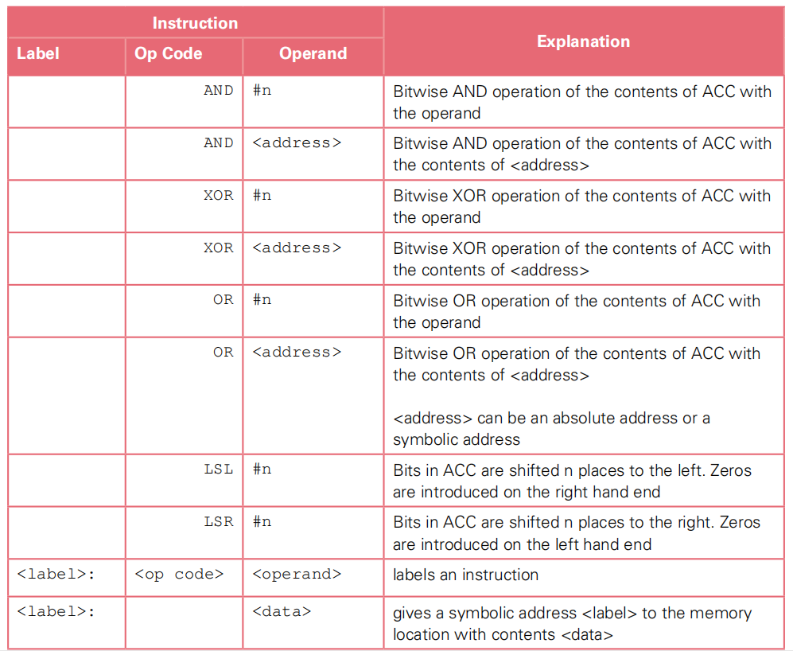

# Table of contents

- [3.6 Monitoring and control systems](#36-monitoring-and-control-systems)
  - [***3.6.1 Overview of monitoring and control systems***](#361-overview-of-monitoring-and-control-systems)
    - [Explain the importance of feedback in a control system \[3\]](#explain-the-importance-of-feedback-in-a-control-system-3)
    - [Describe the use of feedback in this control system \[4\]](#describe-the-use-of-feedback-in-this-control-system-4)
  - [***3.6.2 Bit manipulation to monitor and control devices***](#362-bit-manipulation-to-monitor-and-control-devices)

3.6 Monitoring and control systems
----------------------------------

### ***3.6.1 Overview of monitoring and control systems***

> show understanding of the difference between a monitoring system, and a control system
---

> show understanding of sensors and actuators and their usage
---

> show understanding of the additional hardware required to build these systems
---

> show understanding of the software requirements of these systems
---

> show understanding of the importance of feedback in a control system
---

#### Explain the importance of feedback in a control system \[3\]
> s19_33_Q6

- To ensure that the system operates within the given criteria
- By enabling system output to affect subsequent system inputs
- Thus enabling the system to automatically adjust conditions
- Suitable example of feedback

#### Describe the use of feedback in this control system \[4\]
> s19_33_Q6

- Sensors continually measure the temperature of the water in the swimming pool
- The (stream of) readings are sent to a processor and compared with 28 degrees
- If the reading is out of range (by a system set amount) then actuators turn the heater/cooler on or off as necessary

### ***3.6.2 Bit manipulation to monitor and control devices***

> show understanding of how bit manipulation can be used to monitor/control a device
---

> carry out bit manipulation operations: test a bit and set a bit (using a bit masking) using the instructions from Section 1.4.3, and those listed below
---

> show understanding of how to make use of appropriate bit manipulation in monitoring systems and control systems
---

