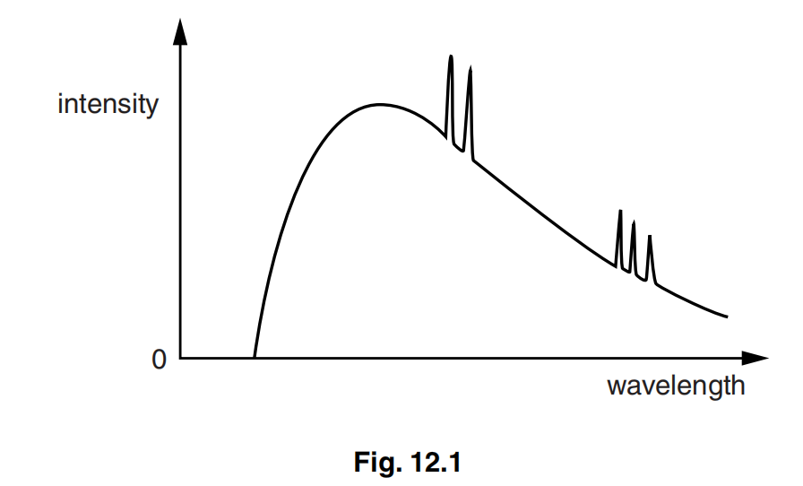

# Table of contents

- [Medical imaging](#medical-imaging)
  - [Explain the principles of the **detection** of `ultrasound wave` \[4\]](#explain-the-principles-of-the-detection-of-ultrasound-wave-4)
  - [Explain the principles of the **use** of `ultrasound waves` \[6\]](#explain-the-principles-of-the-use-of-ultrasound-waves-6)
  - [Explain why there is very little transmission of `ultrasound waves` from air into skin. \[3\]](#explain-why-there-is-very-little-transmission-of-ultrasound-waves-from-air-into-skin-3)
  - [The principles of computed tomography `CT scanning` \[5\]](#the-principles-of-computed-tomography-ct-scanning-5)
  - [Why there is a `continuous distribution of wavelengths` \[3\]](#why-there-is-a-continuous-distribution-of-wavelengths-3)
  - [Why there is a `sharp cut-off at short wavelength` \[2\]](#why-there-is-a-sharp-cut-off-at-short-wavelength-2)
  - [Why there is a `series of peaks` superimposed on the continuous distribution of wavelengths \[1\]](#why-there-is-a-series-of-peaks-superimposed-on-the-continuous-distribution-of-wavelengths-1)
  - [how to `filter` the longer wavelength photons out of the X-ray beam \[1\]](#how-to-filter-the-longer-wavelength-photons-out-of-the-x-ray-beam-1)

Medical imaging
---------------

### Explain the principles of the **detection** of `ultrasound wave` \[4\]
> s20_42_Q5
>
> Hint: pulses, quartz crystal, oscillate, generates e.m.f.

- pulses of ultrasound
- ultrasound incident on quartz crystal
- wave make quartz oscillate
- oscillations of crystal generates e.m.f.

### Explain the principles of the **use** of `ultrasound waves` \[6\]
> s17_42_Q4
>
> Hint: pulses, quartz crystal, gel, boundaries, transmitter, processed and displayed, intensity information, time depth

> Bold - required \[4\]
> Italic - details max \[2\]

- **Pulses** of ultrasound
- *... produced by quartz crystal.*
- *Gel medium used to reduce reflection at skin.*
- **Ultrasound reflected from boundaries.**
- **The reflected wave detected by the transmitter.**
- **The reflected wave processed and displayed.**
- *Intensity of reflected wave gives information about the boundary.*
- *Time delay gives information about depth of boundary.*

### Explain why there is very little transmission of `ultrasound waves` from air into skin. \[3\]
> s20_42_Q5
>
> Hint: specific acoustic impedance different, intensity reflection coefficient difference, most reflected

- specific acoustic impedance of air and skin are very different
- intensity reflection coefficient depends on difference between acoustic impedance
- most ultrasound reflected so little transmission

### The principles of computed tomography `CT scanning` \[5\]
> w19_42_Q7
>
> s18_42_Q11

- **X-rays** image taken of one **slice**
- of section (of object)
- scans/images taken at **many angles/directions**
- computer produces 2D image **of slice**
- this is repeated for many **slices**
- images of (many) sections are combined
- to build up a 3D image (of structure)

### Why there is a `continuous distribution of wavelengths` \[3\]
> s16_42_Q12
>
> Hint: photon when particle stop, range of accelerations, distribution

- photon produced when charged particle is stopped suddenly
- range of accelerations in target
- hence, distribution of wavelengths

### Why there is a `sharp cut-off at short wavelength` \[2\]
> s16_42_Q12

- electron gives all its energy to one photon
- electron stopped in single collision

### Why there is a `series of peaks` superimposed on the continuous distribution of wavelengths \[1\]
> s16_42_Q12

- de-excitation of (orbital) electrons in target

### how to `filter` the longer wavelength photons out of the X-ray beam \[1\]
> s16_42_Q12

- aluminium sheet
