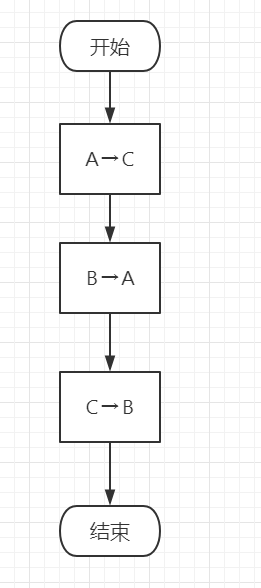
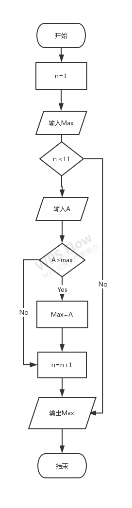
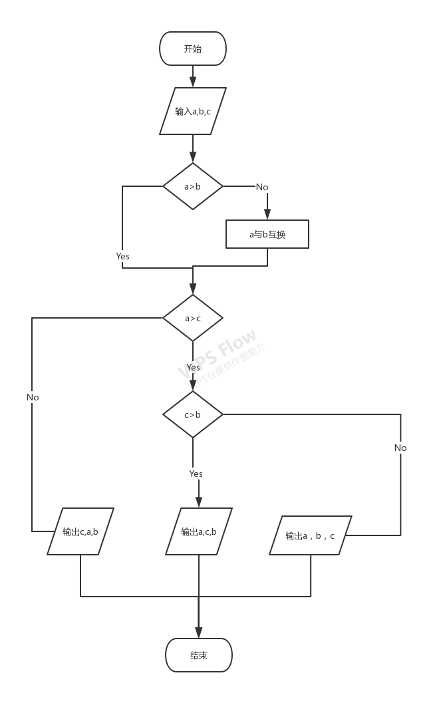
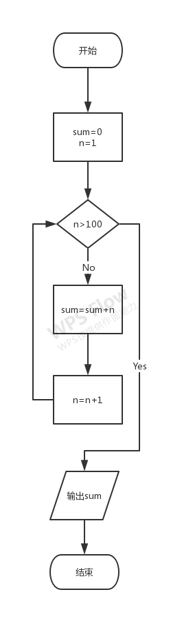
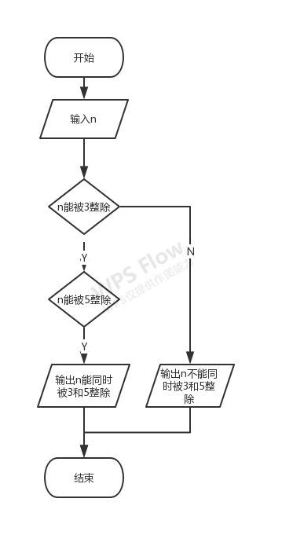
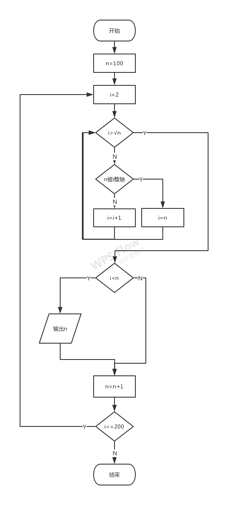
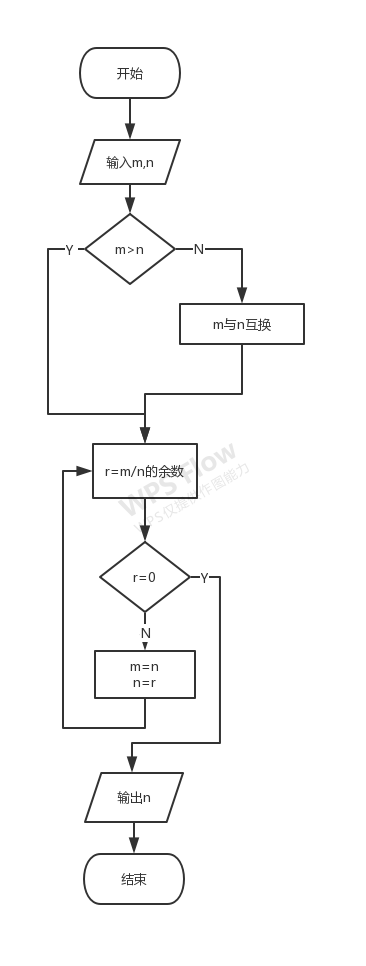
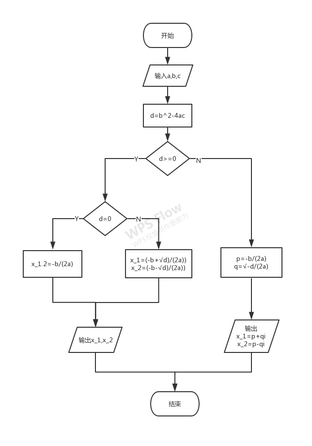
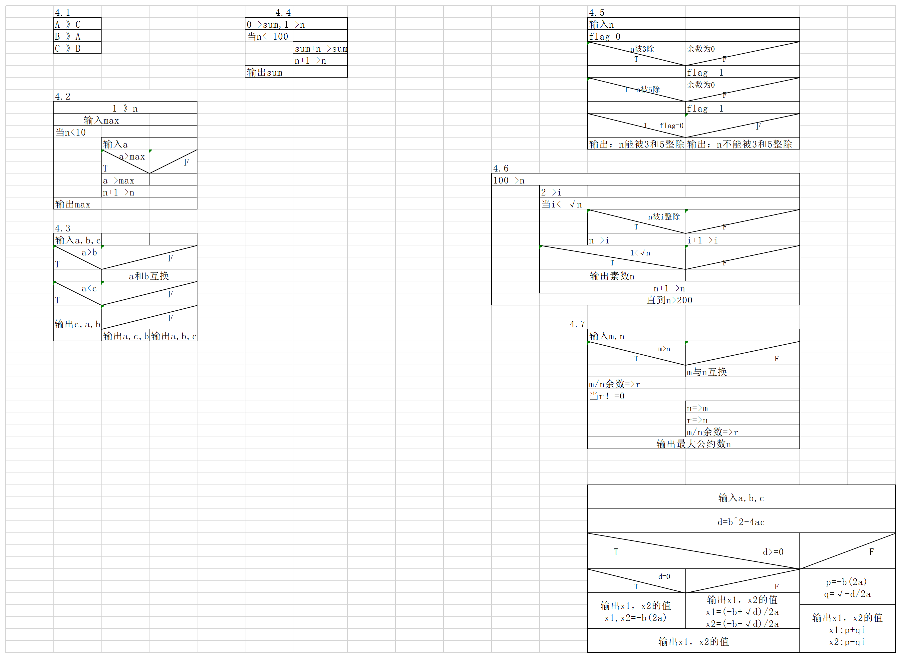

- [Note of Python](#note-of-python)
  - [第一章 程序设计和C语言](#第一章-程序设计和c语言)
    - [习题](#习题)
  - [第二章 算法--程序的灵魂](#第二章-算法--程序的灵魂)
    - [2.4 算法的特性](#24-算法的特性)
    - [2.6 结构化程序设计方法](#26-结构化程序设计方法)
    - [习题](#习题-1)

# Note of Python

> 参考链接 https://github.com/WangSong2017/Answer-for-C-Program-Designing-Fifth-Edition-  
> 侵权删

## 第一章 程序设计和C语言

### 习题

1. 什么是程序什么是程序设计?

    程序就是一组计算机能够识别和执行的指令

2. 为什么需要计算机语言?高级语言有哪些特点?

    出于人机交互的需要

3. 正确理解一下名词及其含义?

    1. 源程序,目标程序,可执行程序

        **源程序**: 高级语言写的程序  
        **目标程序**: 转换为机器指令的程序  
        **可执行程序**: 可在操作系统储存空间中浮动定位的二进制可执行程序

    2. 程序编辑,程序编译,程序连接

        **程序编辑**: 对程序进行修改  
        **程序编译**: 把源程序转换成二进制形式的目标程序  
        **程序连接**: 把所有编译后得到的目标文件连接装配起来

    3. 程序,程序模块,程序文件

        **程序**: 一组计算机能够识别和执行的指令  
        **程序模块**: 由汇编程序,编译程序,装入程序或翻译程序作为一个整体来处理的一级独立的,可识别的程序指令  
        **程序文件**: 描述程序的文件

    4. 函数,主函数,被调用函数,库函数

        **函数**: 一段可以直接被另一段程序引用的程序  
        **主函数**: 函数执行的起点  
        **被调用函数**: 被另一个函数调用的函数  
        **库函数**: 一般指编译器提供用于调用的函数


    5. 程序调试,程序测试

        **程序调试**: 用手动或者编译程序等方法进行测试,修正错误的过程  
        **程序测试**: 对一个完成了全部或者部分的计算机程序在使用前的检测,确保该程序以预定的方式正确的运行

4. 编写一个c程序, 运行时输出
    ```
    Hello World!
    ```

    ```C
    #include<stdio.h>

    int main()
    {
        printf("Hello World!");
        return 0;
    }
    ```

5. 编写一个C程序,运行时输出一下图形:
    ```
    *****
        *****
            *****
                *****
    ```

    ```C
    #include<stdio.h>

    int main()
    {
        char star[] = "*****";
        printf("%s\n\t%s\n\t\t%s\n\t\t\t%s",star,star,star,star);
        return 0;
    }
    ```

6. 编写一个C程序,运行时输入a,b,c三个值,输出其中最大者

    ```C
    #include<stdio.h>

    int main()
    {
        //char star[] = "*****";
        //printf("%s\n\t%s\n\t\t%s\n\t\t\t%s",star,star,star,star);
        int compare_three_better();

        compare_three_better();

        return 0;
    }

    int compare_three()
    {
        int a, b, c, max;

        printf("Enter 3 numbers seprated by \" \":");
        scanf_s("%d %d %d", &a, &b, &c, 20);

        if (a > b)
        {
            if (a > c)
            {
                max = a;
            }
            else
            {
                max = c;
            }
        }
        else
        {
            if (b > c)
            {
                max = b;
            }
            else
            {
                max = c;
            }
        }

        printf("The maximum number is %d", max);

        return 0;
    }
    ```

## 第二章 算法--程序的灵魂

### 2.4 算法的特性

1. 有穷性
2. 确定性
3. 有零个或多个输入
4. 有一个或多个输出
5. 有效性

### 2.6 结构化程序设计方法

1. 自顶向下
2. 逐步细化
3. 模块化设计
4. 结构化编码

### 习题

1. 什么是算法?

    1. 去公园 算法: 走路到车站 搭乘指定车辆 中途转乘 最终到达目的地
    2. 图书馆找书 算法: 找到该类别 遍历直到找到

2. 什么叫结构化的算法?为什么要提倡结构化的算法?

    结构化算法是由一些基本结构顺序组成的

    好处: 将复杂的问题简单化, 让编程更容易, 提高代码维护和可读性

3. 试述3种基本结构的特点, 请另外设计两种基本结构

    特点:
    1. 只有一个入口
    2. 只有一个出口
    3. 结构内的每一部分都有机会被执行到
    4. 结构内不存在死循环

4. 用传统流程图表示下列算法

    1. 有两个瓶子A和B,分别盛放醋和酱油,要求将它们互换

        

    2. 依次将10个数输入, 要求输出其中最大的数

        

    3. 有3个数a,b,c,要求按大小顺序把它们输出

        

    4. 求1+2+3+...+100

        

    5. 判断一个数n能否同时被3和5整除

        

    6. 将100~200之间的素数输出

        

    7. 求两个数m和n的最大公约数

        

    8. 求方程ax<sup>2</sup>+bx+c=0的根
       1. 有两个不等的实根
       2. 有两个相等的实根

        
   
5. 用N-S图表示第4题中各题的算法

    

6. 用伪代码表示第4题中各题的算法

    1.  ```
        c=a
        a=b
        b=c
        ```

    2.  ```
        n=1
        while n<10 do
            input a
            if a>max then max=a
            n=n+1
        end do
        print max
        ```

    3.  ```
        input a,b,c
        if a<b then swap a,b
        if a<c then
            print c,a,b
        else
            if c>b then
                print a,c,b
            else
                print a,b,c
            end if
        end if
        ```

    4.  ```
        sum = 0
        n=1
        while n<=100 do
            sum=sum+1
            n=n+1
        end do
        print sum
        ```

    5.  ```
        input n
        flag=0
        if mod(n,3)!=0 then flag=-1
        if mod(n,5)!=0 then flag=-1
        if flag=0 then
            print n "能被3和5整除"
        else
            print n"不能同时被3和5整除"
        end if
        ```

    6.  ```
        n =100
        while n<=200 do
            i=2
            while i<=√n
                if mod(n,i)=0 then
                    i=n
                else
                    i=i+1
                end if
            end do
            if i<√n then print n
            n=m+1
        end do
        ```

    7.  ```
        intput m,n
        if m<n then swap m,n
        t=mod(m,n)
        while r!= do
            m=n
            n=r
            r=mod(m,n)
        end do
        print n
        ```

    8.  ```
        int a,b,c
        disc = b^2-4ac
        if disc>=0 then
            if disc=0 then
                x1,x2=-b/(2a)
            else
                x1=(-b+√disc)/(2a)
                x2=(-b-√disc)/(2a)
            end if
            print x1,x2
        else
            p=-b/(2a)
            q=√disc /(2a)
            print p+q,"+",p-q,"i"
        end if
        ```


