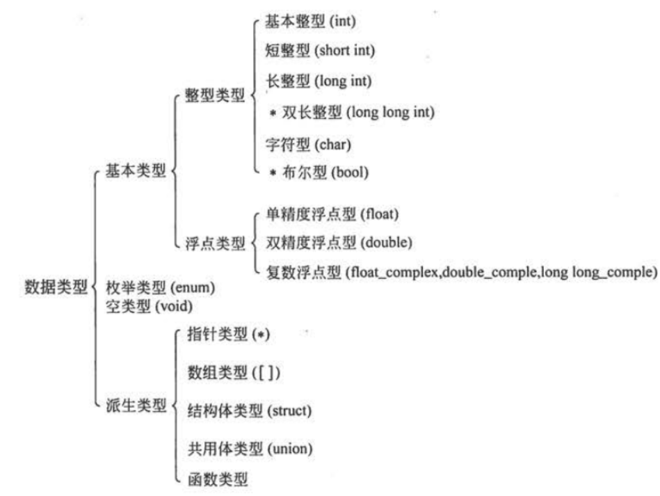
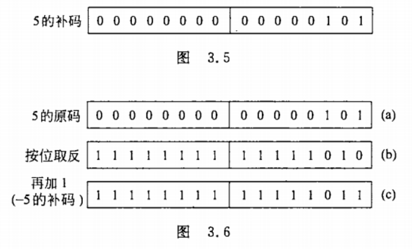

- [Note of Python](#note-of-python)
  - [第一章 程序设计和C语言](#第一章-程序设计和c语言)
    - [习题](#习题)
  - [第二章 算法--程序的灵魂](#第二章-算法--程序的灵魂)
    - [2.4 算法的特性](#24-算法的特性)
    - [2.6 结构化程序设计方法](#26-结构化程序设计方法)
    - [习题](#习题-1)
  - [第三章 最简单的C程序设计--顺序程序设计](#第三章-最简单的c程序设计--顺序程序设计)
    - [3.2 数据的表现形式及其运算](#32-数据的表现形式及其运算)
      - [3.2.1 常量和变量](#321-常量和变量)
      - [3.2.2 数据类型](#322-数据类型)
      - [3.2.3 整型数据](#323-整型数据)
      - [3.2.4 字符型数据](#324-字符型数据)
      - [3.2.5 浮点型数据](#325-浮点型数据)
    - [3.5 数据的输入输出](#35-数据的输入输出)
      - [3.5.3 用printf函数输出数据](#353-用printf函数输出数据)
      - [3.5.4 用scaf函数输入数据](#354-用scaf函数输入数据)
    - [习题](#习题-2)
  - [第四章 选择结构程序设计](#第四章-选择结构程序设计)
    - [if语句例子](#if语句例子)
    - [switch语句例子](#switch语句例子)
    - [习题](#习题-3)
  - [第五章 循环结构程序设计](#第五章-循环结构程序设计)
    - [5.2 用while语句实现循环](#52-用while语句实现循环)
    - [5.3 用do...while语句实现循环](#53-用dowhile语句实现循环)
    - [5.3 用for语句实现循环](#53-用for语句实现循环)
  - [第六章 利用数组处理批量数据](#第六章-利用数组处理批量数据)
    - [定义数组例子](#定义数组例子)
    - [初始化数组例子](#初始化数组例子)
    - [定义二维数组](#定义二维数组)
    - [初始化二维数组](#初始化二维数组)
    - [6.3 字符数组](#63-字符数组)
  - [第七章 用函数实现模块化程序设计](#第七章-用函数实现模块化程序设计)

# Note of Python

> 参考链接 https://github.com/WangSong2017/Answer-for-C-Program-Designing-Fifth-Edition-  
> 侵权删

## 第一章 程序设计和C语言

### 习题

1. 什么是程序什么是程序设计?

    程序就是一组计算机能够识别和执行的指令

2. 为什么需要计算机语言?高级语言有哪些特点?

    出于人机交互的需要

3. 正确理解一下名词及其含义?

    1. 源程序,目标程序,可执行程序

        **源程序**: 高级语言写的程序  
        **目标程序**: 转换为机器指令的程序  
        **可执行程序**: 可在操作系统储存空间中浮动定位的二进制可执行程序

    2. 程序编辑,程序编译,程序连接

        **程序编辑**: 对程序进行修改  
        **程序编译**: 把源程序转换成二进制形式的目标程序  
        **程序连接**: 把所有编译后得到的目标文件连接装配起来

    3. 程序,程序模块,程序文件

        **程序**: 一组计算机能够识别和执行的指令  
        **程序模块**: 由汇编程序,编译程序,装入程序或翻译程序作为一个整体来处理的一级独立的,可识别的程序指令  
        **程序文件**: 描述程序的文件

    4. 函数,主函数,被调用函数,库函数

        **函数**: 一段可以直接被另一段程序引用的程序  
        **主函数**: 函数执行的起点  
        **被调用函数**: 被另一个函数调用的函数  
        **库函数**: 一般指编译器提供用于调用的函数


    5. 程序调试,程序测试

        **程序调试**: 用手动或者编译程序等方法进行测试,修正错误的过程  
        **程序测试**: 对一个完成了全部或者部分的计算机程序在使用前的检测,确保该程序以预定的方式正确的运行

4. 编写一个c程序, 运行时输出
    ```
    Hello World!
    ```

    ```C
    #include<stdio.h>

    int main()
    {
        printf("Hello World!");
        return 0;
    }
    ```

5. 编写一个C程序,运行时输出一下图形:
    ```
    *****
        *****
            *****
                *****
    ```

    ```C
    #include<stdio.h>

    int main()
    {
        char star[] = "*****";
        printf("%s\n\t%s\n\t\t%s\n\t\t\t%s",star,star,star,star);
        return 0;
    }
    ```

6. 编写一个C程序,运行时输入a,b,c三个值,输出其中最大者

    ```C
    #include<stdio.h>

    int main()
    {
        //char star[] = "*****";
        //printf("%s\n\t%s\n\t\t%s\n\t\t\t%s",star,star,star,star);
        int compare_three_better();

        compare_three_better();

        return 0;
    }

    int compare_three()
    {
        int a, b, c, max;

        printf("Enter 3 numbers seprated by \" \":");
        scanf_s("%d %d %d", &a, &b, &c, 20);

        if (a > b)
        {
            if (a > c)
            {
                max = a;
            }
            else
            {
                max = c;
            }
        }
        else
        {
            if (b > c)
            {
                max = b;
            }
            else
            {
                max = c;
            }
        }

        printf("The maximum number is %d", max);

        return 0;
    }
    ```

## 第二章 算法--程序的灵魂

### 2.4 算法的特性

1. 有穷性
2. 确定性
3. 有零个或多个输入
4. 有一个或多个输出
5. 有效性

### 2.6 结构化程序设计方法

1. 自顶向下
2. 逐步细化
3. 模块化设计
4. 结构化编码

### 习题

1. 什么是算法?

    1. 去公园 算法: 走路到车站 搭乘指定车辆 中途转乘 最终到达目的地
    2. 图书馆找书 算法: 找到该类别 遍历直到找到

2. 什么叫结构化的算法?为什么要提倡结构化的算法?

    结构化算法是由一些基本结构顺序组成的

    好处: 将复杂的问题简单化, 让编程更容易, 提高代码维护和可读性

3. 试述3种基本结构的特点, 请另外设计两种基本结构

    特点:
    1. 只有一个入口
    2. 只有一个出口
    3. 结构内的每一部分都有机会被执行到
    4. 结构内不存在死循环

4. 用传统流程图表示下列算法

    1. 有两个瓶子A和B,分别盛放醋和酱油,要求将它们互换

        

    2. 依次将10个数输入, 要求输出其中最大的数

        

    3. 有3个数a,b,c,要求按大小顺序把它们输出

        

    4. 求1+2+3+...+100

        

    5. 判断一个数n能否同时被3和5整除

        

    6. 将100~200之间的素数输出

        

    7. 求两个数m和n的最大公约数

        

    8. 求方程ax<sup>2</sup>+bx+c=0的根
       1. 有两个不等的实根
       2. 有两个相等的实根

        
   
5. 用N-S图表示第4题中各题的算法

    

6. 用伪代码表示第4题中各题的算法

    1.  ```
        c=a
        a=b
        b=c
        ```

    2.  ```
        n=1
        while n<10 do
            input a
            if a>max then max=a
            n=n+1
        end do
        print max
        ```

    3.  ```
        input a,b,c
        if a<b then swap a,b
        if a<c then
            print c,a,b
        else
            if c>b then
                print a,c,b
            else
                print a,b,c
            end if
        end if
        ```

    4.  ```
        sum = 0
        n=1
        while n<=100 do
            sum=sum+1
            n=n+1
        end do
        print sum
        ```

    5.  ```
        input n
        flag=0
        if mod(n,3)!=0 then flag=-1
        if mod(n,5)!=0 then flag=-1
        if flag=0 then
            print n "能被3和5整除"
        else
            print n"不能同时被3和5整除"
        end if
        ```

    6.  ```
        n =100
        while n<=200 do
            i=2
            while i<=√n
                if mod(n,i)=0 then
                    i=n
                else
                    i=i+1
                end if
            end do
            if i<√n then print n
            n=m+1
        end do
        ```

    7.  ```
        intput m,n
        if m<n then swap m,n
        t=mod(m,n)
        while r!= do
            m=n
            n=r
            r=mod(m,n)
        end do
        print n
        ```

    8.  ```
        int a,b,c
        disc = b^2-4ac
        if disc>=0 then
            if disc=0 then
                x1,x2=-b/(2a)
            else
                x1=(-b+√disc)/(2a)
                x2=(-b-√disc)/(2a)
            end if
            print x1,x2
        else
            p=-b/(2a)
            q=√disc /(2a)
            print p+q,"+",p-q,"i"
        end if
        ```

## 第三章 最简单的C程序设计--顺序程序设计

### 3.2 数据的表现形式及其运算

#### 3.2.1 常量和变量

1. 常量

    1. 整型常量
   
        如1000,12345,0,-345等

    2. 实型常量

        1. 十进制小数形式,由数字和小数点组成.
        2. 指数形式,如12.34e3(代表12.34x10<sup>3</sup>)
    
    3. 字符常量

        1. 普通字符,如'a','Z','?'
        2. 转义字符,如\n,\t
   
        

    4. 字符串常量

        如"boy","123"等

    5. 符号常量

        ```C
        #define PI 3.1416
        ```

        使用符号常量有以下好处
        - 含义清楚
        - 能做到一改全改
    
2. 变量
   
    - 先定义后使用
    - 注意区分变量名和变量值
  
3. 常变量

    - C99允许使用常变量
        ```C
        const int a=3;
        ```
    
    常变量和符号常量的区别
    - 定义符号常量是预编译指令,在预编译时进行字符替换,在预编译后符号常量就不存在了
    - 常变量要占用储存单元,有变量值,只是该值不改变
  
4. 标识符

    用来对变量,符号常量名,函数,数组,类型等命名的有效字符序列统称为**标识符**

#### 3.2.2 数据类型



#### 3.2.3 整型数据

1. 整型数据的分类
    1. 基本整型(int型)

        

    2. 短整型(short int)
    3. 长整型(long int)
    4. 双长整型(long long int)
2. 整型变量的符号属性

    

#### 3.2.4 字符型数据

1. 字符和字符代码

    - 字符：A～Z，a～z；
    - 数字：0～9；
    - 专门符号：29 个，如 ! # " " & + - { | } ~ 等等；
    - 空格符：空格、水平制表符（tap）、换行、换页；
    - 不能现实点字符：空 (null) 字符（以 '\0' 表示），警告（以 '\a' 表示），会车（以 '\r' 表示）等；
   
2. 字符变量

    ```C
    char c = '?';
    printf("%d %c\n",c,c);
    ```

    ```
    63 ?
    ```

    ?的ASCII码是63

    

#### 3.2.5 浮点型数据

1. float型(单精度浮点型)
2. double型(双精度浮点型)
3. long double型(长双精度)


### 3.5 数据的输入输出

#### 3.5.3 用printf函数输出数据


#### 3.5.4 用scaf函数输入数据


### 习题

1. 假如我国国民生产总值的年增长率为7%，计算10年后我国国民生产总值与现在相比增长多少百分比。计算公式为  
   **p = (1+r)<sup>n</sup>**  
   r为年增长率，n为年数，p为与现在相比的倍数

    ```C
    #include<stdio.h>
    #include<math.h>

    int main()
    {
        double m, p,r;
        int i;
        r = 0.07;
        m = 1 + r;
        p = m;
        p = pow(p,10);
        printf("%6.2f", p);
        return 0;
    }
    ```

2. 存款利息的计算。有1000元，想存5年，可按以下5种办法存∶
   
    1. 一次存5年期。
    2. 先存2年期，到期后将本息再存3年期。
    3. 先存3年期，到期后将本息再存2年期。
    4. 存1年期，到期后将本息再存1年期，连续存5次。
    5. 存活期存款。活期利息每一季度结算一次。  
    
    2007年12月的银行存款利息如下∶  
        1年期定期存款利息为4.14%；  
        2年期定期存款利息为4.68%；  
        3年期定期存款利息为5.4%；  
        5年期定期存款利息为5.85%；  
        活期存款利息为0.72%（活期存款每一季度结算一次利息）。

    如果r为年利率，n为存款年数，则计算本息和的公式为
    1年期本息和∶P=1000*（1＋r）；
    n年期本息和∶P=1000*（1＋n*r）；
    存n次1年期的本息和∶P=1000*（1＋r）<sup>n</sup>；
    活期存款本息和∶P=1000*（1+r/4)<sup>4n</sup>

    ```C
    #include<stdio.h>
    #include<math.h>

    int main() {
        float money,plan1, plan2, plan3, plan4, plan5,rate0,rate1,rate2,rate3,rate5;
        money = 1000;
        rate0 = 0.0035;
        rate1 = 0.015;
        rate2 = 0.021;
        rate3 = 0.0275;
        rate5 = 0.03;

        plan1 = money * (1 + 5 * rate5);
        plan2 = money * (1 + 2 * rate2) * (1 + 3 * rate3);
        plan3 = money * (1 + 3 * rate3) * (1 + 2 * rate2);
        plan4 = money * pow(1 + rate1, 5);
        plan5 = money * pow((1 + rate0 / 4), 4 * 5);

        printf("The final amount of money for each plan is %f\n%f\n%f\n%f\n%f\n", plan1, plan2, plan3, plan4, plan5);

        return 0;
    }
    ```

3. 
    ```C
    #include <stdio.h>
    #include <math.h>
    int main()
    {
        float d = 300000, p = 6000, r = 0.01, m;
        m = log10(p / (p - d * r)) / log10(1 + r);
        printf("m=%f", m);
        return 0;
    }
    ```

略


## 第四章 选择结构程序设计

### if语句例子

```C
#include <stdio.h>

int main()
{
    int x,y;
    scanf("%d",&x);
    if (x >= 0)
        if(x>0) y = 1;
        else    y=0;
    else        y = -1;
    printf("x=%d,y=%d\n",x,y);
    return 0;
}
```

### switch语句例子

```C
#include <stdio.h>

int main()
{
    char grade;
    scanf("%c",&grade);
    printf("Your Score:");
    switch(grade)
    {
        case 'A': printf("85~100\n");break;
        case 'B': printf("70~84\n");break;
        case 'C': printf("60~69\n");break;
        case 'D': printf("<60\n");break;
        default: printf("enter data error!\n");
    }
    return 0;
}
```

### 习题

1. 什么是算术运算?什么是关系运算?什么是逻辑运算?

    **算术运算**：使用算术运算符号进行的数学计算  
    **关系运算**：对两个对象进行比较，表示两者之间关系的一种运算  
    **逻辑运算**：两个条件之间的运算。

2. C语言中如何表示"真"和"假"?系统如何判断一个量的"真"和"假"?

    对于逻辑表达式，其逻辑为真，用1来表示，逻辑为假，用0表示或非0即为真。

## 第五章 循环结构程序设计

### 5.2 用while语句实现循环

```C
#include<stdio.h>

int main()
{
    int i = 1,sum = 0;
    while(i <= 100>)
    {
        sum= sum + i;
        i++;
    }
    printf("sum=%d\n",sum);
    return 0;
}
```

### 5.3 用do...while语句实现循环

```C
int i = 1;
do
{
    printf("%d",i++);
}
while(i <= 100);
```

### 5.3 用for语句实现循环

```C
for(i = 1;i <= 100;i++)
    printf("%d",i);
```

## 第六章 利用数组处理批量数据

### 定义数组例子

```C
#include <stdio.h>
 
int main ()
{
   int n[ 10 ]; /* n 是一个包含 10 个整数的数组 */
   int i,j;
 
   /* 初始化数组元素 */         
   for ( i = 0; i < 10; i++ )
   {
      n[ i ] = i + 100; /* 设置元素 i 为 i + 100 */
   }
   
   /* 输出数组中每个元素的值 */
   for (j = 0; j < 10; j++ )
   {
      printf("Element[%d] = %d\n", j, n[j] );
   }
 
   return 0;
}
```

### 初始化数组例子

```C
double balance[] = {1000.0, 2.0, 3.4, 7.0, 50.0};
```

### 定义二维数组

```C
float pay[3][6];
```

### 初始化二维数组

```C
int a[3][4] = {{1,2,3,4},{5,6,7,8},{9,10,11,12}};
```

### 6.3 字符数组

```C
char site[7] = {'R', 'U', 'N', 'O', 'O', 'B', '\0'};
printf("%s\n",site);
```

1. puts函数--输出字符串的函数
2. gets函数--输入字符串的函数
3. stract函数--字符串连接函数
4. strcpy和strncpy函数--字符串复制函数
5. strcmp函数--字符串比较函数
6. strlen函数--测字符串长度的函数
7. strlwr函数--转换为小写的函数
8. strupr函数--转换为大写的函数

## 第七章 用函数实现模块化程序设计