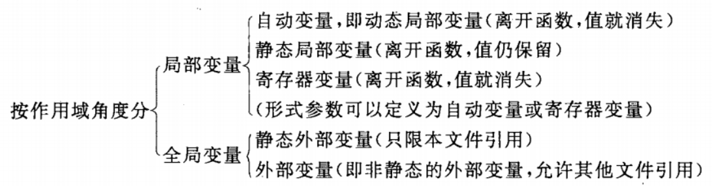
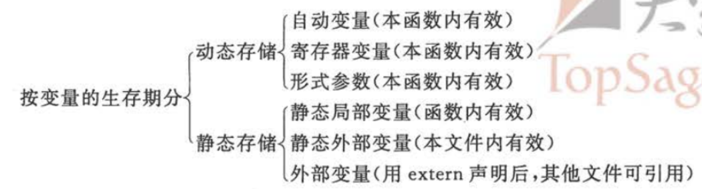
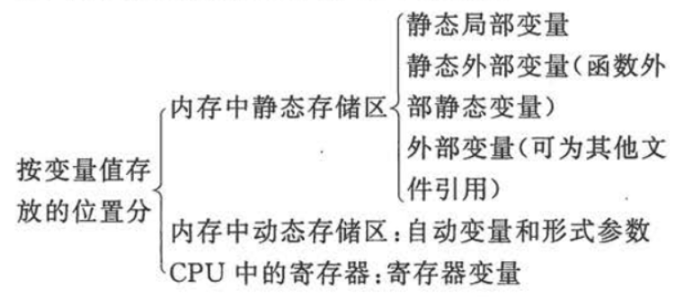
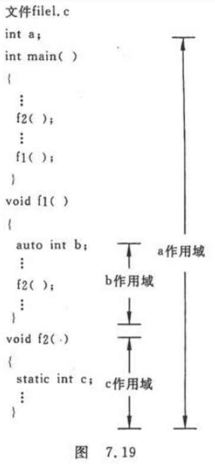
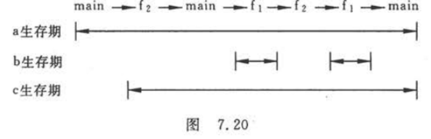
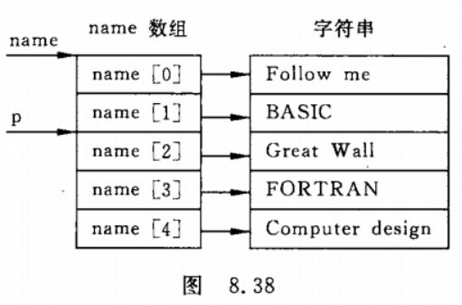
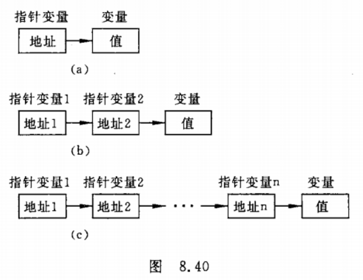
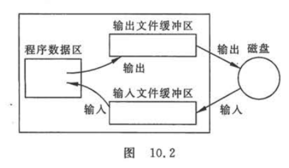
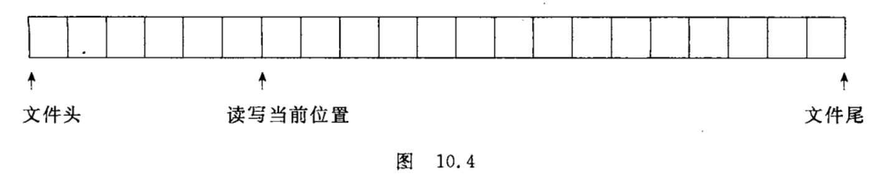

- [Note of Python](#note-of-python)
  - [第一章 程序设计和C语言](#第一章-程序设计和c语言)
    - [习题](#习题)
  - [第二章 算法--程序的灵魂](#第二章-算法--程序的灵魂)
    - [2.4 算法的特性](#24-算法的特性)
    - [2.6 结构化程序设计方法](#26-结构化程序设计方法)
    - [习题](#习题-1)
  - [第三章 最简单的C程序设计--顺序程序设计](#第三章-最简单的c程序设计--顺序程序设计)
    - [3.2 数据的表现形式及其运算](#32-数据的表现形式及其运算)
      - [3.2.1 常量和变量](#321-常量和变量)
      - [3.2.2 数据类型](#322-数据类型)
      - [3.2.3 整型数据](#323-整型数据)
      - [3.2.4 字符型数据](#324-字符型数据)
      - [3.2.5 浮点型数据](#325-浮点型数据)
    - [3.5 数据的输入输出](#35-数据的输入输出)
      - [3.5.3 用printf函数输出数据](#353-用printf函数输出数据)
      - [3.5.4 用scaf函数输入数据](#354-用scaf函数输入数据)
    - [习题](#习题-2)
  - [第四章 选择结构程序设计](#第四章-选择结构程序设计)
    - [if语句例子](#if语句例子)
    - [switch语句例子](#switch语句例子)
    - [习题](#习题-3)
  - [第五章 循环结构程序设计](#第五章-循环结构程序设计)
    - [5.2 用while语句实现循环](#52-用while语句实现循环)
    - [5.3 用do...while语句实现循环](#53-用dowhile语句实现循环)
    - [5.3 用for语句实现循环](#53-用for语句实现循环)
  - [第六章 利用数组处理批量数据](#第六章-利用数组处理批量数据)
    - [定义数组例子](#定义数组例子)
    - [初始化数组例子](#初始化数组例子)
    - [定义二维数组](#定义二维数组)
    - [初始化二维数组](#初始化二维数组)
    - [6.3 字符数组](#63-字符数组)
  - [第七章 用函数实现模块化程序设计](#第七章-用函数实现模块化程序设计)
    - [7.2 怎样定义函数](#72-怎样定义函数)
      - [7.2.1 为什么要定义函数](#721-为什么要定义函数)
      - [7.2.2 定义函数的方法](#722-定义函数的方法)
    - [7.3 调用函数](#73-调用函数)
      - [7.3.1 函数调用的形式](#731-函数调用的形式)
      - [7.3.2 函数调用时的数据传递](#732-函数调用时的数据传递)
      - [7.3.4 函数的返回值](#734-函数的返回值)
    - [7.8 局部变量和全局变量](#78-局部变量和全局变量)
      - [7.8.2 全局变量](#782-全局变量)
    - [7.9 变量的储存方法和生存期](#79-变量的储存方法和生存期)
      - [7.9.1 动态存储方式和静态存储方式](#791-动态存储方式和静态存储方式)
      - [7.9.2 局部变量的存储类别](#792-局部变量的存储类别)
      - [7.9.3 全局变量的存储类别](#793-全局变量的存储类别)
      - [7.9.4 存储类别小结](#794-存储类别小结)
    - [7.11 内部函数和外部函数](#711-内部函数和外部函数)
      - [7.11.1 内部函数](#7111-内部函数)
      - [7.11.2 外部函数](#7112-外部函数)
  - [第八章 善于利用指针](#第八章-善于利用指针)
    - [8.2 指针变量](#82-指针变量)
      - [8.2.2 怎样定义指针变量](#822-怎样定义指针变量)
      - [8.2.3 怎样引用指针变量](#823-怎样引用指针变量)
    - [8.3 通过指针引用数组](#83-通过指针引用数组)
      - [8.3.1 数组元素的指针](#831-数组元素的指针)
      - [8.3.3 通过指针引用数组元素](#833-通过指针引用数组元素)
      - [8.3.5 通过指针引用多维数组](#835-通过指针引用多维数组)
    - [8.4 通过指针引用字符串](#84-通过指针引用字符串)
      - [8.4.1 字符串的引用方式](#841-字符串的引用方式)
      - [8.4.3 使用字符指针变量和字符数组的比较](#843-使用字符指针变量和字符数组的比较)
    - [8.5 指向函数的指针](#85-指向函数的指针)
      - [8.5.1 什么是函数指针](#851-什么是函数指针)
    - [8.7 指针数组和多重指针](#87-指针数组和多重指针)
      - [8.7.1 什么是指针数组](#871-什么是指针数组)
      - [8.7.2 指向指针数据的指针](#872-指向指针数据的指针)
    - [8.8 动态内存分配与指向它的指针变量](#88-动态内存分配与指向它的指针变量)
      - [8.8.2 怎样建立内存的动态分配](#882-怎样建立内存的动态分配)
    - [8.9 有关指针的小结](#89-有关指针的小结)
  - [第九章 用户自己建立数据类型](#第九章-用户自己建立数据类型)
    - [9.1 定义和使用结构体变量](#91-定义和使用结构体变量)
      - [9.1.1 自己建立结构体类型](#911-自己建立结构体类型)
      - [9.1.2 定义结构体类型变量](#912-定义结构体类型变量)
      - [9.1.3 结构体变量的初始化的引用](#913-结构体变量的初始化的引用)
    - [9.2 使用结构体数组](#92-使用结构体数组)
      - [9.2.1 定义结构体数组](#921-定义结构体数组)
    - [9.3 结构体指针](#93-结构体指针)
      - [9.3.1 指向结构体变量的指针](#931-指向结构体变量的指针)
      - [9.3.2 指向结构体数组的指针](#932-指向结构体数组的指针)
      - [9.3.3 用结构体变量和结构体变量的指针作为函数参数](#933-用结构体变量和结构体变量的指针作为函数参数)
    - [9.4 用指针处理链表](#94-用指针处理链表)
      - [9.4.1 什么是链表](#941-什么是链表)
      - [9.4.2 建立简单的静态链表](#942-建立简单的静态链表)
      - [9.4.3 建立动态链表](#943-建立动态链表)
      - [9.4.4 输出链表](#944-输出链表)
    - [9.5 共用体类型](#95-共用体类型)
      - [9.5.3 共用体类型数据的特点](#953-共用体类型数据的特点)
    - [9.6 使用枚举类型](#96-使用枚举类型)
    - [9.7 用typedef声明新类型名](#97-用typedef声明新类型名)
  - [第十章 对文件的输入输出](#第十章-对文件的输入输出)
    - [10.1 C文件的有关基本知识](#101-c文件的有关基本知识)
      - [10.1.1 什么是文件](#1011-什么是文件)
      - [10.1.2 文件名](#1012-文件名)
      - [10.1.3 文件的分类](#1013-文件的分类)
      - [10.1.4 文件缓冲区](#1014-文件缓冲区)
      - [10.1.5 文件类型指针](#1015-文件类型指针)
    - [10.2 打开与关闭文件](#102-打开与关闭文件)
      - [10.2.1 用fopen函数打开数据文件](#1021-用fopen函数打开数据文件)
      - [10.2.2 用fclose函数关闭数据文件](#1022-用fclose函数关闭数据文件)
    - [10.3 顺序读写数据文件](#103-顺序读写数据文件)
      - [10.3.1 怎样向文件读写字符](#1031-怎样向文件读写字符)
      - [10.3.2 怎样向文件读写一个字符串](#1032-怎样向文件读写一个字符串)
      - [10.3.3 用格式化的方式读写文件](#1033-用格式化的方式读写文件)
      - [10.3.4 用二进制方式向文件读写一组数据](#1034-用二进制方式向文件读写一组数据)
    - [10.4 随机读写数据文件](#104-随机读写数据文件)
      - [10.4.1 文件位置标记及其定位](#1041-文件位置标记及其定位)
      - [10.4.2 随机读写](#1042-随机读写)
    - [10.5 文件读写的出错检测](#105-文件读写的出错检测)

# Note of Python

> 参考链接 https://github.com/WangSong2017/Answer-for-C-Program-Designing-Fifth-Edition-  
> 侵权删

## 第一章 程序设计和C语言

### 习题

1. 什么是程序什么是程序设计?

    程序就是一组计算机能够识别和执行的指令

2. 为什么需要计算机语言?高级语言有哪些特点?

    出于人机交互的需要

3. 正确理解一下名词及其含义?

    1. 源程序,目标程序,可执行程序

        **源程序**: 高级语言写的程序  
        **目标程序**: 转换为机器指令的程序  
        **可执行程序**: 可在操作系统储存空间中浮动定位的二进制可执行程序

    2. 程序编辑,程序编译,程序连接

        **程序编辑**: 对程序进行修改  
        **程序编译**: 把源程序转换成二进制形式的目标程序  
        **程序连接**: 把所有编译后得到的目标文件连接装配起来

    3. 程序,程序模块,程序文件

        **程序**: 一组计算机能够识别和执行的指令  
        **程序模块**: 由汇编程序,编译程序,装入程序或翻译程序作为一个整体来处理的一级独立的,可识别的程序指令  
        **程序文件**: 描述程序的文件

    4. 函数,主函数,被调用函数,库函数

        **函数**: 一段可以直接被另一段程序引用的程序  
        **主函数**: 函数执行的起点  
        **被调用函数**: 被另一个函数调用的函数  
        **库函数**: 一般指编译器提供用于调用的函数


    5. 程序调试,程序测试

        **程序调试**: 用手动或者编译程序等方法进行测试,修正错误的过程  
        **程序测试**: 对一个完成了全部或者部分的计算机程序在使用前的检测,确保该程序以预定的方式正确的运行

4. 编写一个c程序, 运行时输出
    ```
    Hello World!
    ```

    ```C
    #include<stdio.h>

    int main()
    {
        printf("Hello World!");
        return 0;
    }
    ```

5. 编写一个C程序,运行时输出一下图形:
    ```
    *****
        *****
            *****
                *****
    ```

    ```C
    #include<stdio.h>

    int main()
    {
        char star[] = "*****";
        printf("%s\n\t%s\n\t\t%s\n\t\t\t%s",star,star,star,star);
        return 0;
    }
    ```

6. 编写一个C程序,运行时输入a,b,c三个值,输出其中最大者

    ```C
    #include<stdio.h>

    int main()
    {
        //char star[] = "*****";
        //printf("%s\n\t%s\n\t\t%s\n\t\t\t%s",star,star,star,star);
        int compare_three_better();

        compare_three_better();

        return 0;
    }

    int compare_three()
    {
        int a, b, c, max;

        printf("Enter 3 numbers seprated by \" \":");
        scanf_s("%d %d %d", &a, &b, &c, 20);

        if (a > b)
        {
            if (a > c)
            {
                max = a;
            }
            else
            {
                max = c;
            }
        }
        else
        {
            if (b > c)
            {
                max = b;
            }
            else
            {
                max = c;
            }
        }

        printf("The maximum number is %d", max);

        return 0;
    }
    ```

## 第二章 算法--程序的灵魂

### 2.4 算法的特性

1. 有穷性
2. 确定性
3. 有零个或多个输入
4. 有一个或多个输出
5. 有效性

### 2.6 结构化程序设计方法

1. 自顶向下
2. 逐步细化
3. 模块化设计
4. 结构化编码

### 习题

1. 什么是算法?

    1. 去公园 算法: 走路到车站 搭乘指定车辆 中途转乘 最终到达目的地
    2. 图书馆找书 算法: 找到该类别 遍历直到找到

2. 什么叫结构化的算法?为什么要提倡结构化的算法?

    结构化算法是由一些基本结构顺序组成的

    好处: 将复杂的问题简单化, 让编程更容易, 提高代码维护和可读性

3. 试述3种基本结构的特点, 请另外设计两种基本结构

    特点:
    1. 只有一个入口
    2. 只有一个出口
    3. 结构内的每一部分都有机会被执行到
    4. 结构内不存在死循环

4. 用传统流程图表示下列算法

    1. 有两个瓶子A和B,分别盛放醋和酱油,要求将它们互换

        

    2. 依次将10个数输入, 要求输出其中最大的数

        

    3. 有3个数a,b,c,要求按大小顺序把它们输出

        

    4. 求1+2+3+...+100

        

    5. 判断一个数n能否同时被3和5整除

        

    6. 将100~200之间的素数输出

        

    7. 求两个数m和n的最大公约数

        

    8. 求方程ax<sup>2</sup>+bx+c=0的根
       1. 有两个不等的实根
       2. 有两个相等的实根

        
   
5. 用N-S图表示第4题中各题的算法

    

6. 用伪代码表示第4题中各题的算法

    1.  ```
        c=a
        a=b
        b=c
        ```

    2.  ```
        n=1
        while n<10 do
            input a
            if a>max then max=a
            n=n+1
        end do
        print max
        ```

    3.  ```
        input a,b,c
        if a<b then swap a,b
        if a<c then
            print c,a,b
        else
            if c>b then
                print a,c,b
            else
                print a,b,c
            end if
        end if
        ```

    4.  ```
        sum = 0
        n=1
        while n<=100 do
            sum=sum+1
            n=n+1
        end do
        print sum
        ```

    5.  ```
        input n
        flag=0
        if mod(n,3)!=0 then flag=-1
        if mod(n,5)!=0 then flag=-1
        if flag=0 then
            print n "能被3和5整除"
        else
            print n"不能同时被3和5整除"
        end if
        ```

    6.  ```
        n =100
        while n<=200 do
            i=2
            while i<=√n
                if mod(n,i)=0 then
                    i=n
                else
                    i=i+1
                end if
            end do
            if i<√n then print n
            n=m+1
        end do
        ```

    7.  ```
        intput m,n
        if m<n then swap m,n
        t=mod(m,n)
        while r!= do
            m=n
            n=r
            r=mod(m,n)
        end do
        print n
        ```

    8.  ```
        int a,b,c
        disc = b^2-4ac
        if disc>=0 then
            if disc=0 then
                x1,x2=-b/(2a)
            else
                x1=(-b+√disc)/(2a)
                x2=(-b-√disc)/(2a)
            end if
            print x1,x2
        else
            p=-b/(2a)
            q=√disc /(2a)
            print p+q,"+",p-q,"i"
        end if
        ```

## 第三章 最简单的C程序设计--顺序程序设计

### 3.2 数据的表现形式及其运算

#### 3.2.1 常量和变量

1. 常量

    1. 整型常量
   
        如1000,12345,0,-345等

    2. 实型常量

        1. 十进制小数形式,由数字和小数点组成.
        2. 指数形式,如12.34e3(代表12.34x10<sup>3</sup>)
    
    3. 字符常量

        1. 普通字符,如'a','Z','?'
        2. 转义字符,如\n,\t
   
        

    4. 字符串常量

        如"boy","123"等

    5. 符号常量

        ```C
        #define PI 3.1416
        ```

        使用符号常量有以下好处
        - 含义清楚
        - 能做到一改全改
    
2. 变量
   
    - 先定义后使用
    - 注意区分变量名和变量值
  
3. 常变量

    - C99允许使用常变量
        ```C
        const int a=3;
        ```
    
    常变量和符号常量的区别
    - 定义符号常量是预编译指令,在预编译时进行字符替换,在预编译后符号常量就不存在了
    - 常变量要占用储存单元,有变量值,只是该值不改变
  
4. 标识符

    用来对变量,符号常量名,函数,数组,类型等命名的有效字符序列统称为**标识符**

#### 3.2.2 数据类型


#### 3.2.3 整型数据

1. 整型数据的分类
    1. 基本整型(int型)

        

    2. 短整型(short int)
    3. 长整型(long int)
    4. 双长整型(long long int)
2. 整型变量的符号属性

    

#### 3.2.4 字符型数据

1. 字符和字符代码

    - 字符：A～Z，a～z；
    - 数字：0～9；
    - 专门符号：29 个，如 ! # " " & + - { | } ~ 等等；
    - 空格符：空格、水平制表符（tap）、换行、换页；
    - 不能现实点字符：空 (null) 字符（以 '\0' 表示），警告（以 '\a' 表示），会车（以 '\r' 表示）等；
   
2. 字符变量

    ```C
    char c = '?';
    printf("%d %c\n",c,c);
    ```

    ```
    63 ?
    ```

    ?的ASCII码是63

    

#### 3.2.5 浮点型数据

1. float型(单精度浮点型)
2. double型(双精度浮点型)
3. long double型(长双精度)


### 3.5 数据的输入输出

#### 3.5.3 用printf函数输出数据


#### 3.5.4 用scaf函数输入数据


### 习题

1. 假如我国国民生产总值的年增长率为7%，计算10年后我国国民生产总值与现在相比增长多少百分比。计算公式为  
   **p = (1+r)<sup>n</sup>**  
   r为年增长率，n为年数，p为与现在相比的倍数

    ```C
    #include<stdio.h>
    #include<math.h>

    int main()
    {
        double m, p,r;
        int i;
        r = 0.07;
        m = 1 + r;
        p = m;
        p = pow(p,10);
        printf("%6.2f", p);
        return 0;
    }
    ```

2. 存款利息的计算。有1000元，想存5年，可按以下5种办法存∶
   
    1. 一次存5年期。
    2. 先存2年期，到期后将本息再存3年期。
    3. 先存3年期，到期后将本息再存2年期。
    4. 存1年期，到期后将本息再存1年期，连续存5次。
    5. 存活期存款。活期利息每一季度结算一次。  
    
    2007年12月的银行存款利息如下∶  
        1年期定期存款利息为4.14%；  
        2年期定期存款利息为4.68%；  
        3年期定期存款利息为5.4%；  
        5年期定期存款利息为5.85%；  
        活期存款利息为0.72%（活期存款每一季度结算一次利息）。

    如果r为年利率，n为存款年数，则计算本息和的公式为
    1年期本息和∶P=1000*（1＋r）；
    n年期本息和∶P=1000*（1＋n*r）；
    存n次1年期的本息和∶P=1000*（1＋r）<sup>n</sup>；
    活期存款本息和∶P=1000*（1+r/4)<sup>4n</sup>

    ```C
    #include<stdio.h>
    #include<math.h>

    int main() {
        float money,plan1, plan2, plan3, plan4, plan5,rate0,rate1,rate2,rate3,rate5;
        money = 1000;
        rate0 = 0.0035;
        rate1 = 0.015;
        rate2 = 0.021;
        rate3 = 0.0275;
        rate5 = 0.03;

        plan1 = money * (1 + 5 * rate5);
        plan2 = money * (1 + 2 * rate2) * (1 + 3 * rate3);
        plan3 = money * (1 + 3 * rate3) * (1 + 2 * rate2);
        plan4 = money * pow(1 + rate1, 5);
        plan5 = money * pow((1 + rate0 / 4), 4 * 5);

        printf("The final amount of money for each plan is %f\n%f\n%f\n%f\n%f\n", plan1, plan2, plan3, plan4, plan5);

        return 0;
    }
    ```

3. 
    ```C
    #include <stdio.h>
    #include <math.h>
    int main()
    {
        float d = 300000, p = 6000, r = 0.01, m;
        m = log10(p / (p - d * r)) / log10(1 + r);
        printf("m=%f", m);
        return 0;
    }
    ```

略


## 第四章 选择结构程序设计

### if语句例子

```C
#include <stdio.h>

int main()
{
    int x,y;
    scanf("%d",&x);
    if (x >= 0)
        if(x>0) y = 1;
        else    y=0;
    else        y = -1;
    printf("x=%d,y=%d\n",x,y);
    return 0;
}
```

### switch语句例子

```C
#include <stdio.h>

int main()
{
    char grade;
    scanf("%c",&grade);
    printf("Your Score:");
    switch(grade)
    {
        case 'A': printf("85~100\n");break;
        case 'B': printf("70~84\n");break;
        case 'C': printf("60~69\n");break;
        case 'D': printf("<60\n");break;
        default: printf("enter data error!\n");
    }
    return 0;
}
```

### 习题

1. 什么是算术运算?什么是关系运算?什么是逻辑运算?

    **算术运算**：使用算术运算符号进行的数学计算  
    **关系运算**：对两个对象进行比较，表示两者之间关系的一种运算  
    **逻辑运算**：两个条件之间的运算。

2. C语言中如何表示"真"和"假"?系统如何判断一个量的"真"和"假"?

    对于逻辑表达式，其逻辑为真，用1来表示，逻辑为假，用0表示或非0即为真。

## 第五章 循环结构程序设计

### 5.2 用while语句实现循环

```C
#include<stdio.h>

int main()
{
    int i = 1,sum = 0;
    while(i <= 100>)
    {
        sum= sum + i;
        i++;
    }
    printf("sum=%d\n",sum);
    return 0;
}
```

### 5.3 用do...while语句实现循环

```C
int i = 1;
do
{
    printf("%d",i++);
}
while(i <= 100);
```

### 5.3 用for语句实现循环

```C
for(i = 1;i <= 100;i++)
    printf("%d",i);
```

## 第六章 利用数组处理批量数据

### 定义数组例子

```C
#include <stdio.h>
 
int main ()
{
   int n[ 10 ]; /* n 是一个包含 10 个整数的数组 */
   int i,j;
 
   /* 初始化数组元素 */         
   for ( i = 0; i < 10; i++ )
   {
      n[ i ] = i + 100; /* 设置元素 i 为 i + 100 */
   }
   
   /* 输出数组中每个元素的值 */
   for (j = 0; j < 10; j++ )
   {
      printf("Element[%d] = %d\n", j, n[j] );
   }
 
   return 0;
}
```

### 初始化数组例子

```C
double balance[] = {1000.0, 2.0, 3.4, 7.0, 50.0};
```

### 定义二维数组

```C
float pay[3][6];
```

### 初始化二维数组

```C
int a[3][4] = {{1,2,3,4},{5,6,7,8},{9,10,11,12}};
```

### 6.3 字符数组

```C
char site[7] = {'R', 'U', 'N', 'O', 'O', 'B', '\0'};
printf("%s\n",site);
```

1. puts函数--输出字符串的函数
2. gets函数--输入字符串的函数
3. stract函数--字符串连接函数
4. strcpy和strncpy函数--字符串复制函数
5. strcmp函数--字符串比较函数
6. strlen函数--测字符串长度的函数
7. strlwr函数--转换为小写的函数
8. strupr函数--转换为大写的函数

## 第七章 用函数实现模块化程序设计

### 7.2 怎样定义函数

#### 7.2.1 为什么要定义函数

定义函数应包括一下几个内容

   1. 指定函数的名字,以便以后按名调用
   2. 指定函数的类型,即函数返回值的类型
   3. 指定函数的参数的名字和类型,以便在调用函数时向它们传递数据.对无参函数不需要这项
   4. 指定函数应当完成什么操作,也就是函数是做什么的,即函数的功能.这是最重要的,是在函数体中解决的

#### 7.2.2 定义函数的方法

1. 定义无参函数

    ```
    类型名  函数名()
    {
        函数体
    }

    或者

    类型名  函数名(void)
    {
        函数体
    }
    ```

2. 定义有参函数

    ```
    类型名  函数名(形式参数表列)
    {
        函数体
    }
    ```

3. 定义空函数

    ```
    类型名  函数名()
    {   }
    ```

### 7.3 调用函数

#### 7.3.1 函数调用的形式

1. 函数调用语句

    如`printf_star();`

2. 函数表达式

    如`c = 2*max(a,b);`

3. 函数参数

    如`printf("%d",max(a,b));`

#### 7.3.2 函数调用时的数据传递

- 形式参数和实际参数

    在定义函数时函数名后面括号中的变量名称为"形式参数"或"虚拟函数"(形参)  
    在主调函数中调用一个函数时,函数名后面括号中的参数称为"实际参数"(实参)

#### 7.3.4 函数的返回值

1. 函数的返回值是通过函数中的return语句获得的

    ```C
    max(int x, int y)
    {
        return(x>y?x:y);
    }
    ```

2. 函数值的类型

    ```C
    int max(float x, float y)
    ```

3. 在定义函数时指定的函数类型一般应该和return语句中的表达式类型一致

    即函数类型决定返回值的类型

### 7.8 局部变量和全局变量

#### 7.8.2 全局变量


### 7.9 变量的储存方法和生存期

#### 7.9.1 动态存储方式和静态存储方式

储存空间可以分为3部分
1. 程序区
2. 静态存储区
3. 动态存储去

全局变量全部存放在**静态存储区**中  
在程序开始执行时给全局变量分配存储区,程序执行完毕就释放  
在程序执行过程中它们占据固定的存储单元,而不是动态的进行分配和释放

在动态存储区中存放以下的数据
1. 函数形式参数.在调用函数时给形参分配存储空间
2. 函数中定义的没有用关键字static声明的变量,即自动变量
3. 函数调用时的现场保护和返回地址等

在c语言中,每个变量和函数都有两个属性: **数据类型**和**数据的存储类别**

C的存储类别包括四种: 自动的(auto) 静态的(static) 寄存器的(register) 外面的(extern)

#### 7.9.2 局部变量的存储类别

1. 自动变量(auto变量)

函数中的局部变量,如果不专门声明为static（静态）存储类别,都是动态地分配存储空间的,数据存储在动态存储区中  
调用该函数时,系统会给这些变量分配存储空间,在函数调用结束时就自动释放这些存储空间.  
因此这类局部变量称为**自动变量**

```C
int f(int a)
{
    auto int b,c = 3;
}
```

2. 静态局部变量(static局部变量)

> 1. 静态局部变量属于静态存储类别，在静态存储区内分配存储单元。在程序整个运行期间都不释放。而自动变量（即动态局部变量）属于动态存储类别，分配在动态存储区空间而不在静态存储区空间，函数调用结束后即释放。
> 2. 对静态局部变量是在编译时赋初值的，即只赋初值一次，在程序运行时它已有初值。以后每次调用函数时不再重新赋初值而只是保留上次函数调用结束时的值。而对自动变量赋初值，不是在编译时进行的，而是在函数调用时进行的，每调用一次函数重新给一次初值，相当于执行一次赋值语句
> 3. 如果在定义局部变量时不赋初值的话，则对静态局部变量来说，编译时自动赋初值0（对数值型变量）或空字符′\0'（对字符变量）。而对自动变量来说，它的值是一个不确定的值。这是由于每次函数调用结束后存储单元已释放，下次调用时又重新另分配存储单元，而所分配的单元中的内容是不可知的
> 4. 虽然静态局部变量在函数调用结束后仍然存在，但其他函数是不能引用它的。因为它是局部变量，只能被本函数引用，而不能被其他函数引用

3. 寄存器变量(register变量)

对寄存器的存取速度远高于对内存的存取速度,因此这样做可以提高执行效率.

#### 7.9.3 全局变量的存储类别

1. 在一个文件内拓展外部变量的作用域

把局部变成全局

```C
int max()
{
    extern int A,B,C;
}
```

2. 将外部变量的作用域拓展到其他文件

把一个文件的全局变成另一个文件的全局

```C
extern int A;
```

3. 将外部变量的作用域限制在本文件中

添加 static在前面

```C
static int A;
```

#### 7.9.4 存储类别小结

1. 从作用域角度



2. 从变量存在的时间区分



3. 从变量值存放位置来区分



4. 关于作用域和生存期的概念






### 7.11 内部函数和外部函数

#### 7.11.1 内部函数

仅仅只在本文件使用

```C
static int fun(int a,int b)
```

#### 7.11.2 外部函数

可以被别的文件引用

```C
extern int fun(int a, int b)
```

## 第八章 善于利用指针

### 8.2 指针变量

#### 8.2.2 怎样定义指针变量

类型名 *指针变量名

```C
int *pointer_1,*pointer_2;

int* pointer_1,pointer_2;

int *pointer_1=&a,*pointer_2=&b;
```

一个变量的指针的含义包括两方面,一是以储存单元编号表示的地址(如编号为2000的字节),一是它指向的存储单元的数据类型(如int,char,float)

#### 8.2.3 怎样引用指针变量

1. 给指针变量赋值

    `p = &a;`

    指针变量p的值是变量a的地址,p指向a

2. 引用指针变量指向的变量

    `*p = 1;`

    将整数1赋给p当前所指的变量,如果p指向变量a,则相当于把1赋给a,即"`a=1;`"

3. 引用指针变量的值

    `printf("%o",p);`

    以八进制数形式输出指针变量p的值,如果p指向a,就是输出了a的地址,即`&a`

### 8.3 通过指针引用数组

#### 8.3.1 数组元素的指针

所谓数组元素的指针就是数组元素的地址

```C
int a[10] = {1,3,5,7,9,11,13,15,17,19};
int *p;
p=&a[0];
```

`p=&a[0];`等价`p=a;`

#### 8.3.3 通过指针引用数组元素

1. 下标法

    如`a[i]`形式

2. 指针法

    如`*(a+i)`或`*(p+i)`


#### 8.3.5 通过指针引用多维数组

1. 多维数组元素的地址

    `int a[3][4]={{1,2,3,4},{5,6,7,8},{9,10,11,12}};`

    

### 8.4 通过指针引用字符串

#### 8.4.1 字符串的引用方式

```C
#include <stdio.h>
int main()
{
    char string[]="I love China!";
    printf("%s\n",string);
    printf("%c\n",string[7]);
    return 0;
}
```
#### 8.4.3 使用字符指针变量和字符数组的比较

1. 字符数组由若干个元素组成，每个元素中放一个字符，而字符指针变量中存放的是地址（字符串第1个字符的地址），绝不是将字符串放到字符指针变量中
2. 赋值方式。可以对字符指针变量赋值，但不能对数组名赋值

    正确的
    ```C
    char *a;
    a="I love China!";

    等价

    char *a = "I love China!";
    ```

    错误的
    ```C
    char str[14];
    str[0]='I';
    str="I love China!";

3. 初始化的含义.对字符指针变量赋初值

    ```C
    char str[14]="I love China!";

    不等价

    char str[14];
    str[] = "I love China!";
    ```

4. 存储单元的内容。编译时为字符数组分配若干存储单元，以存放各元素的值，而对字符指针变量，只分配一个存储单元（Visual C++为指针变量分配4个字节）
5. 指针变量的值是可以改变的，而数组名代表一个固定的值（数组首元素的地址），不能改变
6. 字符数组中各元素的值是可以改变的（可以对它们再赋值），但字符指针变量指向的字符串常量中的内容是不可以被取代的（不能对它们再赋值）。
7. 引用数组元素
8. 用指针变量指向一个格式字符串,可以用它代替printf函数中的格式字符串.

### 8.5 指向函数的指针

#### 8.5.1 什么是函数指针

`int (*p)(int,int);`

定义p是一个指向函数的指针变量,它可以指向函数的类型为整型且有两个整型参数的函数.

### 8.7 指针数组和多重指针

#### 8.7.1 什么是指针数组

`int *p[4]`

`类型名 *数组名[数组长度]`

#### 8.7.2 指向指针数据的指针





### 8.8 动态内存分配与指向它的指针变量

#### 8.8.2 怎样建立内存的动态分配

1. 使用malloc函数

    `void *malloc(unsigned int size);`

    其作用是在内存的动态存储区中分配一个长度为size的连续空间。

2. 使用calloc函数

    `void *calloc(unsigned n,unsigned size);`

    其作用是在内存的动态存储区中分配n个长度为size的连续空间，这个空间一般比较大，足以保存一个数组

3. 使用free函数

    `void free(void *p);`

    其作用是释放指针变量p所指向的动态空间，使这部分空间能重新被其他变量使用

4. 使用realloc函数

    `void *realloc(void *p, unsigned int size);`

    如果已经通过 malloc 函数或 calloc 函数获得了动态空间，想改变其大小，可以用 recalloc 函数重新分配

### 8.9 有关指针的小结


## 第九章 用户自己建立数据类型

### 9.1 定义和使用结构体变量

#### 9.1.1 自己建立结构体类型

```C
struct Date
{
    int month;
    int day;
    int year;
};
struct Student
{
    int num;
    char name[20];
    char sex;
    int age;
    struct Date birthday;
    char addr[30];
};
```

#### 9.1.2 定义结构体类型变量

1. 先声明结构体类型,再定义该类型的变量

    ```
    struct Student student1,student2;
    结构体类型名    结构体    变量名
    ```

2. 在声明类型的同时定义变量

    ```
    struct 结构体名
    {
        成员表列
    }变量名表列;
    ```

3. 不指定类型名而直接定义结构体类型变量

    ```
    struct
    {
        成员表列;
    }变量名表列
    ```

#### 9.1.3 结构体变量的初始化的引用

```C
#include <stdio.h>
int main()
{
    struct Student
    {
        int num;
        char name[20];
        float score;
    }student1,student2;
    scanf("%d%s%f",&student1.num,student1.name,&student1.score);
    scanf("%d%s%f",&student2.num,student2.name,&student2.score);
    printf("The higher score is:\n");
    if(student1.score>student2.score)
        printf("%d %s %6.2f\n", student1.num,student1.name,student1.score);
    else if (student1.score<student2.score)
        printf("%d %s %6.2f\n", student2.num,student2.name,student2.score);
    else
    {
        printf("%d %s %6.2f\n", student1.num,student1.name,student1.score);
        printf("%d %s %6.2f\n", student2.num,student2.name,student2.score);
    }
    return 0;
}
```

1. student1和student2是struct Student类型的变量.在3个成员中分别存放学号,姓名和成绩.
2. 用scanf函数输入结构体变量时,必须分别输入他们的成员的值,不能在scanf函数中使用结构体变量名一揽子输入全部成员的值.注意在scanf函数中在成员student1.num和student1.score的前面都有地址符&,而在student1.name前面没有&,这是因为name是数组名,本身就代表地址,古不能画蛇添足地再加一个&.
3. 根据student.score和student2.score的比较结构,输入不同学生的信息.从这里可以看到利用结构体变量的好处:由于student1是一个"组合项",内放有关联的一组数据,student1.score是属于student1变量的一部分

### 9.2 使用结构体数组

#### 9.2.1 定义结构体数组

1. 定义结构体数组一般形式是
   
    1. struct 结构名

        {成员表列}数据名\[数组长度\];
    
    2. 先声明一个结构体类型,然后在用此类型定义结构体数组
   
        结构体类型 数组名\[数组长度\];  
        sturct Person leader\[3\];
    
2. 对结构体数组初始化的形式是在定义数组的后面加上

    ={初值表列};

    sturct Person leader\[3\] = {"Li",0,"Zhang",0,"Sun",0};

### 9.3 结构体指针

#### 9.3.1 指向结构体变量的指针

struct Student *pt;

#### 9.3.2 指向结构体数组的指针

```C
#include <stdio.h>
stuct Student
{
    int num;
    char name[20];
    char sex;
    int age;
};
struct Student stu[3]={{10101,"Li Lin",'M',18},{10102,"Zhang Fang",'M',19},{10104,"Wang Min",'F',20}};
int main()
{
    struct Student *p;
    printf("No.    Name              sex age\n");
    for(p=stu;p<stu+3;p++)
        printf("%5d &-20s %2c %4d\n",p->num,p->name,p->sex,p->age);
    return 0;
}
```

1. 如果p的初值为stu，即指向stu的第1个元素，p加1后，p就指向下一个元素。例如  

    (++p)->num 先使p自加1，然后得到p指向的元素中的num成员值（即10102）  
    (p++)->num 先求得p一>num的值（即10101），然后再使p自加1，指向stu\[1\]  
    请注意以上二者的不同。  

2. 程序定义了p是一个指向struct Student类型对象的指针变量，它用来指向一个struct Student类型的对象（在例9.6中的p的值是stu数组的一个元素（如stu\[0\]或stu\[1\]）的起始地址），不应用来指向stu 数组元素中的某一成员。例如，下面的用法是不对的

    p=stu[1].name;      //stu\[1\].name是stu\[1\]元素中的成员name的首字符的地址

    编译时将给出“警告”信息，表示地址的类型不匹配。不要认为反正p是存放地址的，可以将任何地址赋给它。如果要将某一成员的地址赋给p，可以用强制类型转换，先将成员的地址转换成p的类型。例如∶
    
    p=(struct Student * )stu\[0\].name;

    此时，p的值是stu\[0\]元素的name成员的起始地址。可以用"printf（"%s"，p）；"输出stu\[0\]中成员name的值。但是，p仍保持原来的类型。如果执行"printf（"%s"，p＋1）；"，则会输出stu\[1\]中 name 的值。执行p＋＋时，p 的值增加了结构体 struct Student的长度。

#### 9.3.3 用结构体变量和结构体变量的指针作为函数参数

将一个结构体变量的值传递给另一个函数，有3个方法∶
1. 用结构体变量的成员作参数。例如，用stu【1】.num或stu【2】.name作函数实参，将实参值传给形参。用法和用普通变量作实参是一样的，属于"值传递"方式。应当注意实参与形参的类型保持一致。
2. 用结构体变量作实参。用结构体变量作实参时，采取的也是“值传递”的方式，将结构体变量所占的内存单元的内容全部按顺序传递给形参，形参也必须是同类型的结构体变量。在函数调用期间形参也要占用内存单元。这种传递方式在空间和时间上开销较大，如果结构体的规模很大时，开销是很可观的。此外，由于采用值传递方式，如果在执行被调用函数期间改变了形参（也是结构体变量）的值，该值不能返回主调函数，这往往造成使用上的不便。因此一般较少用这种方法。
3. 用指向结构体变量（或数组元素）的指针作实参，将结构体变量（或数组元素）的地址传给形参。

### 9.4 用指针处理链表

#### 9.4.1 什么是链表

链表是一种常见的重要的数据结构.它是动态的进行储存分配的一种结构.

链表有一个"头指针"变量,它存放一个地址,该地址指向一个元素.链表中每一个元素称为"结点",每个结点都应包括两个部分:
- 用户需要的实际数据
- 下一个节点的地址

最后一个元素不再指向其他元素,它称为"表尾",它的地址部分放一个"NULL"表示空地址,链表到此结束

#### 9.4.2 建立简单的静态链表

```C
#include <stdio.h>
struct Student
{
    int num;
    float score;
    struct Student* next;
};
int main()
{
    struct Student a,b,c,*head,*p;
    a.num = 10101; a.score = 89.5;
    b.num = 10103; b.score = 90;
    c.num = 10107; c.score = 85;
    head =&a;
    a.next = &b;
    b.next = &c;
    c.next = NULL;
    p = head;
    do
    {
        printf(%ld %5.1f\n",p->num,p->score);
        p = p->next;
    }while(p! = NULL);
    return 0;
}
```

#### 9.4.3 建立动态链表

```C
#include<stdio.h>
#include<stdlib.h>
#define LEN sizeof(struct Student)
struct Student
{
    long num;
    float score;
    struct Student * next;
};
int n;
struct Student* creat(void)
{
    struct Student *head;
    struct Student *p1,*p2;
    n = 0;
    p1 = p2 = (struct Student*) malloc(LEN);
    scanf("%1d,%f", &p1->num,&p1->score);
    head = NULL;
    while(p1->num! = 0)
    {
        n = n + 1;
        if(n == 1)head = p1;
        else p2->next = p1;
        p2 = p1;
        p1 = (struct Student* ) malloc(LEN);
        scanf("%1d,%f",&p1->num,&p1->score);
    }
    p2->next = NULL;
    return(head);
}
```

#### 9.4.4 输出链表

```C
#include<stdio.h>
#include<stdlib.h>
#define LEN sizeof(struct Student)
struct Student
{
    long num;
    float score;
    struct Student *next;
};
int n;
void print(struct Student * head)
{
    struct Student *p;
    printf("\nNow,These %d records are: \n",n);
    p = head;
    ifhead != NULL)
        do
        {
            printf("%1d %5.1f\n",p->num,p->score);
            p = p->next;
        }while(p!=NULL);
}
```

### 9.5 共用体类型

用同一段内存单元存放不同类型的变量

```C
union 共用体名
{
    成员表列
}变量表列;

union Data
{
    int i;
    char ch;
    float f;
}a,b,c;
```

#### 9.5.3 共用体类型数据的特点

```C
union Date
{
    int i;
    char ch;
    float f;
}a;
a.i = 97;

printf("%d",a.i);
printf("%c",a.ch);
printf("%f",a.f);
```

由于97是赋给a.i的,因此按整数形式存储在变量单元中,最后一个字节是"01100001".  
如果用"%d"格式符输出a.i就会输出整数97.  
按"%c"格式符输出就是字符a.  
01100001作为浮点数是0

```C
union Data a={16}; //初始化第一个
union Data a={.ch='j'}; //对指定的成员初始化
```

```C
#include <stdio.h>
struct
{
    int num;
    char name[10];
    char sex;
    char jon;
    union
    {
        int clas;
        char position[10];
    }caregory;
}person[2];

int main()
{
    int i;
    for(i = 0;i < 2; i++)
    {
        printf("please enter the data of person;\n");
        scanf("%d%s%c%c",&person[i].num,&person[i],&person[i].name,&person[i].sex,&person[i].job);
        if(person[i],job=='s')
            scanf("%d",&person[i].category.clas);
        else if(person[i].job=='t')
            scanf("%s",&person[i].category.position);
        else
            printf("Input error!");
    }
    printf("\n");
    printf("No.    name    sex    job    class/position\n");
    for(i = 0;i<2;i++)
    {
        if(person[i],job=='s')
            printf("%-6d%-10s%-4c%-4c%-10d\n",person[i].num,person[i].name,person[i].sex,person[i].job,person[i].category.clas);
        else
            printf("%-6d%-10s%-4c%-4c%-10s\n",person[i].num,person[i].name,person[i].sex,person[i].job,person[i].category.position);
    }
    return 0;
}
```

### 9.6 使用枚举类型

```C
enum Weekday{sun,mon,tue,wed,thu,fri,sat};

enum Weekday workday,weekend;

enum{sun,mon,tue,wed,thu,fri,sat} workday,weekend;

enum [枚举名] {枚举元素列表} 
```
### 9.7 用typedef声明新类型名

```C
typedef int Integer;    //指定用Integer为类型名,作用与int相同
typedef float Real;     //指定用Real为类型名,作用与float相同
```

1. 命名一个新的类型名代表结构体类型

    ```C
    typedef struct
    {
        int month;
        int day;
        int year;
    }Date;

    Date birthday;
    Date* p;
    ```

2. 命名一个新的类型名代表数组类型

    ```C
    typedef int Num[100];
    Num a;
    ```

3. 命名一个新的类型名代表指针类型

    ```C
    typedef char* String;
    String p,s[10];
    ```

4. 命名一个新的类型名代表指向函数的指针类型

    ```C
    typedef int (*Pointer)();
    Pointer p1,p2;
    ```

## 第十章 对文件的输入输出

### 10.1 C文件的有关基本知识

#### 10.1.1 什么是文件

1. 程序文件

    包括源程序文件(后缀为.c),目标文件(后缀为.obj),可执行文件(后缀为.exe)等.这种文件的内容是程序代码

2. 数据文件

    文件的内容不是程序,而是供程序运行时读写的数据,如在程序运行过程中输出到磁盘(或者其他外部设备)的数据,或在程序运行过程中供读入的数据.如一批学生的成绩数据,货物交易的数据等

#### 10.1.2 文件名

`D:\CC\temp\file1.dat`

#### 10.1.3 文件的分类

根据数据的组织形式,数据文件可分为ASCII文件和二进制文件.

数据在内存中是以二进制形式存储的,如果不能加转换地输出到外村,就是二进制文件,可以认为它就是存储在内存的数据的映像,所以也称为映像文件(image file)

如果要求在外存上以ASCII码形式存储,则需要在存储前进行转换.ASCII文件又称为文本文件(text file),每一个字节放一个字符的ASCII代码.

#### 10.1.4 文件缓冲区



#### 10.1.5 文件类型指针

```C
typedef struct
{
    short level;                //缓冲区"满"或"空"的程度
    unsigned flags;             //文件状态标志
    char fd;                    //文件描述符
    unsigned char hold;         //如缓冲区无内容不读取字符
    short bsize;                //缓冲区的大小
    unsigned char *buffer;      //数据缓冲区的位置
    unsigned char *curp;        //指针当前指向
    unsigned istemp;            //临时文件指示器
    short token;                //用于有效性检查
}FILE;
```

### 10.2 打开与关闭文件

#### 10.2.1 用fopen函数打开数据文件

```
fopen(文件名,使用文件方式);

fopen("a1","r");
```

  


#### 10.2.2 用fclose函数关闭数据文件

```
fclose(文件指针);

fclose(fp);
```

### 10.3 顺序读写数据文件

#### 10.3.1 怎样向文件读写字符


```C
#include<stdio.h>
#include<stdlib.h>

int main()
{
    FILE *fp;
    char ch,filename[10];
    printf("请输入所用的文件名: ");
    scanf("%s",filename);
    if((fp=fopen(filename,"w"))==NULL)
    {
        printf("无法打开此文件\n");
        exit(0);
    }
    ch = getchar();
    printf("请输入一个准备存储到磁盘的字符串(以#结束): ");
    ch = getchar();
    while(ch!='#')
    {
        fputc(ch,fp);
        putchar(ch);
        ch=getchar();
    }
    fclose(fp);
    putchar(10);
    return 0;
}
```

#### 10.3.2 怎样向文件读写一个字符串


#### 10.3.3 用格式化的方式读写文件

```C
fprintf(文件指针,格式字符串,输出表列);
fscanf(文件指针,格式字符串,输入表列);
```

#### 10.3.4 用二进制方式向文件读写一组数据

```C
fread(buffer,size,count,fp);
fwrite(buffer,size,count,fp);
```

- buffer: 是一个地址
- size: 要读写的字节数
- count: 要读些多少个数据项
- fp: FILE类型指针

### 10.4 随机读写数据文件

#### 10.4.1 文件位置标记及其定位

1. 文件位置标记

    

2. 文件位置标记地定位

    1. 用rewind函数使文件位置标记指向文件开头

        rewind函数的作用是使文件位置标记重新返回文件开头,此函数没有返回值

    2. 用fseek函数改变文件位置标记

        fseek(文件类型指针,位移量,起始点)

        

    3. 用ftell函数测定文件位置标记的当前位置

        ftell函数的作用是得到流式文件中文件位置标记的当前位置

#### 10.4.2 随机读写

```C
#include<stdio.h>
#include<stdlib.h>
struct student_type
{
    char name[10];
    int num;
    int age;
    char addr[15];
}stud[10];

int main()
{
    int i;
    FILE *fp;
    if((fp=fopen("stu.dat","rb"))==NULL)
    {
        printf("Can not open file\n");
        exit(0);
    }
    for(i = 0;i < 10;i += 2)
    {
        fseek(fp,i* sizeof(struct student_type),0);
        fread(&stud[i],sizeof(struct student_type),1,fp);
        printf("%-10s %4d %4d %-15s\n",stud[i].name,stud[i].num,stud[i].age,stud[i].addr);
    }
    fclose(fp);
    return 0;
}
```

### 10.5 文件读写的出错检测

1. ferror函数

    如果ferror返回值为0(假),表示未出错;如果返回一个非零值,表示出错

2. clearerr函数

    clearerr的作用是使文件错误标志和文件结束标志置为0

    只要出现文件读写错误标志,它就一直保留,直到对同一文件调用clearerr函数或rewind函数,或任何其他一个输入输出函数
