<!-- TOC start -->

- [AI Note](#ai-note)
  * [1. Machine Learning Basics](#1-machine-learning-basics)
    + [1.1 Categories of machine learning](#11-categories-of-machine-learning)
    + [1.2 Supervised learning workflow](#12-supervised-learning-workflow)
    + [1.3 Model evaluation](#13-model-evaluation)
  * [2. Hierarchical Clustering](#2-hierarchical-clustering)
    + [2.1 Clustering concepts](#21-clustering-concepts)
    + [2.2 Hierarchical clustering](#22-hierarchical-clustering)
  * [3. K-means](#3-k-means)
    + [3.1 K-means](#31-k-means)
  * [4. GMM/EM](#4-gmmem)
    + [4.1 Gaussian mixture models(GMMs)](#41-gaussian-mixture-modelsgmms)
    + [4.2 Expectation-Maximization(EM Algorithm)](#42-expectation-maximizationem-algorithm)
    + [4.3 Summary](#43-summary)
  * [5. DBSCAN](#5-dbscan)
    + [5.1 Density-based Clustering - DBSCAN](#51-density-based-clustering---dbscan)
    + [5.2 The algorithm](#52-the-algorithm)
  * [6. Supervised Learning](#6-supervised-learning)
    + [6.1 Supervised Learning](#61-supervised-learning)
    + [6.2 Training data](#62-training-data)
    + [6.3 Terminology in Supervised Learning](#63-terminology-in-supervised-learning)
    + [6.4 Applications of supervised learning](#64-applications-of-supervised-learning)
  * [7. Linear Regression](#7-linear-regression)
    + [7.1 Regression](#71-regression)
    + [7.2 Univariate linear regression](#72-univariate-linear-regression)
    + [7.3 Loss functions (or cost functions)](#73-loss-functions-or-cost-functions)
    + [7.4 what we want to do](#74-what-we-want-to-do)
    + [7.5 Gradient Descent](#75-gradient-descent)
    + [7.6 Gradient](#76-gradient)
  * [8. Logistic Regression](#8-logistic-regression)
    + [8.1 Logistic regression](#81-logistic-regression)
    + [8.2 Model formulation](#82-model-formulation)
    + [8.3 Cost function](#83-cost-function)
    + [8.4 Learning algorithm by gradient descent](#84-learning-algorithm-by-gradient-descent)
  * [9. Neural Networks](#9-neural-networks)
    + [9.1 Neural Networks](#91-neural-networks)
    + [9.2 Overfitting](#92-overfitting)
  * [10. Evaluation & Hyperparameter Tuning](#10-evaluation--hyperparameter-tuning)
    + [10.1 Recap](#101-recap)
    + [10.3 Evaluating models for model choice](#103-evaluating-models-for-model-choice)
    + [10.4 The holdout validation method](#104-the-holdout-validation-method)
    + [10.5 k-fold Cross-validation](#105-k-fold-cross-validation)
    + [10.6 Leave-one-out validation](#106-leave-one-out-validation)
    + [10.7 Advantages & Disadvantages](#107-advantages--disadvantages)
  * [11. Naive Bayes](#11-naive-bayes)
    + [11.1 Fundamental concepts in Probability Theory](#111-fundamental-concepts-in-probability-theory)
    + [11.2 Bayes' Theorem](#112-bayes-theorem)
    + [11.3 Naive Bayes for Categorical Independent Variables](#113-naive-bayes-for-categorical-independent-variables)
    + [11.4 Naive Bayes for Numerical Independent Variables](#114-naive-bayes-for-numerical-independent-variables)
  * [12. K-Nearest Neighbours](#12-k-nearest-neighbours)
    + [12.1 Notation](#121-notation)
    + [12.2 k-Nearest Neighbour](#122-k-nearest-neighbour)
    + [12.3 k-NN algorithm and pros/cons](#123-k-nn-algorithm-and-proscons)
    + [12.4 Summary](#124-summary)
  * [13. Uninformed Search](#13-uninformed-search)
    + [13.1 Asymptotic Analysis](#131-asymptotic-analysis)
    + [13.2 Search Problem Formulation](#132-search-problem-formulation)
    + [13.3 Breadth-First Search](#133-breadth-first-search)
    + [13.4 Depth-First Search](#134-depth-first-search)
    + [13.5 Variations of Depth-First Search](#135-variations-of-depth-first-search)
  * [14. Informed Search](#14-informed-search)
    + [14.1 Informed Search](#141-informed-search)
    + [14.2 A\* Search](#142-a-search)
    + [14.3 Summary](#143-summary)
  * [15. Introduction to Optimisation](#15-introduction-to-optimisation)
    + [15.1 Optimisation Problems](#151-optimisation-problems)
    + [15.2 Artificial Intelligence Optimisation Algorithms](#152-artificial-intelligence-optimisation-algorithms)
    + [15.3 Learning vs Optimisation](#153-learning-vs-optimisation)
  * [16. Optimisation Problem Formulation](#16-optimisation-problem-formulation)
    + [16.1 Formulating Optimisation Problems](#161-formulating-optimisation-problems)
    + [16.2 Summary](#162-summary)

<!-- TOC end -->

# AI Note

## 1. Machine Learning Basics

### 1.1 Categories of machine learning

- Supervised learning  
  有监督的学习

  > Labeled data  
  > 标记数据  
  > Predict outcome/future  
  > 预测结果/未来

  - Classification: predict categorical class labels  
    分类:预测分类类别标签
    - e.g. the handwritten digit (multi-class)  
      例如，手写的数字（多类）

  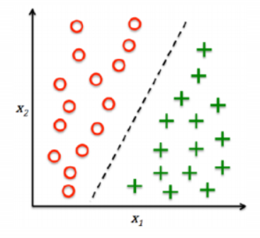

  - Regression: Prediction of continuous outcomes  
    回归: 对连续结果的预测
    - e.g. students’ grade scores 例如学生的成绩

  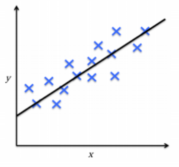

- Unsupervised learning  
  无监督的学习

  > No labels/targets  
  > 无标签/目标  
  > Find hidden structure/insights in data  
  > 在数据中找到隐藏的结构/见解

  - Clustering: Objectives within a cluster share a degree of
    similarity.  
    聚类: 集群内的目标有一定程度的相似性
    - e.g. product recommendation  
      例如产品推荐

  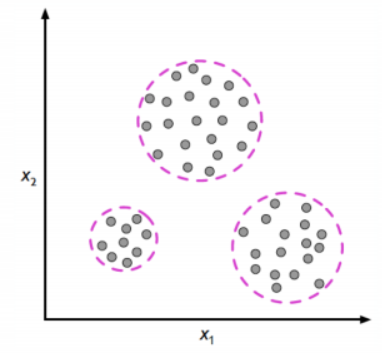

  - Dimensionality Reduction:  
    降维
    - reduce data sparsity  
      降低数据稀疏性
    - reduce computational cost  
      降低计算成本

  

- Reinforcement learning  
  强化学习
  - Decision process  
    判定过程
  - Reward system  
    反馈系统
  - Learn series of actions  
    学习一系列动作
  - Applications: chess, video games, some robots, self-driving cars  
    应用程序：国际象棋，电子游戏，一些机器人，自动驾驶汽车

### 1.2 Supervised learning workflow

  

!Note: Training Data is used to build up the model and Test DAta is used
to test the model

### 1.3 Model evaluation

- misclassification error  
  错误分类错误

- other metrics  
  其他指标
  - Accuracy (1-Error)
  - ROC, AUC
  - Precision, Recall
  - F-measure, G-mean
  - (Cross) Entropy
  - Likelihood
  - Squared Error/MSE
  - R2

## 2. Hierarchical Clustering

### 2.1 Clustering concepts

- Segment data into clusters, such that there is  
  将数据分割成集群，这样有
  - high intra-cluster similarity  
    高聚类内相似性
  - low inter-cluster similarity  
    低聚类间相似性
- informally, finding natural groupings among objects  
  非正式地，在物体之间寻找自然的分组。

- Clustering set-up  
  聚类设置
  - Our data are: D = {x1, . . . , xN}.
  - Each data point is m-dimensional, i.e.  
    xi = <xi,1, . . . , xi,m>
  - Define a distance function (i.e. similarity measures) between data,  
    d(xi, xj)
  - Goal: segment xn into k groups  
    {z1, . . . , zN} where zi ∈ {1, . .
    . ,K}

- Similarity Measures
  - Between any two data samples p and q, we can calculate their
    distance d(p,q) using a number of measurements:  
    

- Types of Clustering Algorithms  
  聚类算法的类型
  - Partitional clustering, e.g. K-means, K-medoids  
    分区聚类，例如K-means，K-medoids
  - Hierarchical clustering  
    分层聚类
    - Bottom-up(agglomerative)  
      自下而上（凝聚）
    - Top-down  
      自上而下
  - Density-based clustering, e.g. DBScan  
    基于密度的聚类，例如DBScan
  - Mixture density based clustering 基于混合密度的聚类
  - Fuzzy theory based, graph theory based, grid based, etc.  
    基于模糊理论、基于图论理论、基于网格理论等

### 2.2 Hierarchical clustering

- Create a hierarchical decomposition of the set of objects using some
  criterion  
  使用某种标准创建对象集的分层分解
- Produce a dendrogram  
  生成树状图

- Agglomerative clustering illustration  
  凝聚性的聚类说明
  - Place each data point into its own singleton group  
    将每个数据点放到它自己的单例组中
  - Repeat: iteratively merge the two closest groups  
    重复：迭代地合并两个最近的组
  - Until: all the data are merged into a single cluster  
    直到：将所有数据都合并为单个集群

- Output: a dendrogram  
  输出：树状图
- Reply on: a distance metric between clusters  
  回复：集群之间的距离度量

- Measuring Distance between clusters
  - Single linkage  
    单连锁
    - the similarity of the closest pair  
      最近的一对之间的相似性

  

  - Complete linkage  
    完全连锁
    - the similarity of the furthest pair 最远的一对之间的相似性

  

  - Group average  
    组平均值
    - the average similarity of all pairs  
      所有成对的平均相似度
    - more widely used  
      更广泛地使用
    - robust against noise 抗噪声强

  

- Strengths, weaknesses, caveats  
  优势、弱点和注意事项
  - Strengths  
    优势
    - provides deterministic results  
      提供确定性结果
    - no need to specify number of clusters beforehand  
      不需要预先指定集群的数量
    - can create clusters of arbitrary shapes  
      可以创建任意形状的集群吗
  - Weakness  
    缺点
    - does not scale up for large datasets, time complexity at least
      O(n2)  
      不可以扩展到大型数据集，时间复杂度至少为O(n2)
  - Caveats  
    注意事项
    - Different decisions about group similarities can lead to vastly
      different dendrograms.  
      关于群体相似性的不同决定可能会导致截然不同的树状图
    - The algorithm imposes a hierarchical structure on the data, even
      data for which such structure is not appropriate.
      该算法对数据强加了一个分层结构，即使是这种结构不合适的数据

## 3. K-means

### 3.1 K-means

- Centroid-based: describe each cluster by its mean  
  基于质心的：用它的平均值来描述每个聚类
- Goal: assign data to K.  
  目标：将数据分配给K
- Algorithm objective: minimize the within-cluster variances of all
  clusters.  
  算法目标：最小化所有聚类的簇内方差

- A non-deterministic method  
  非确定性方法
- Finds a local optimal result (multiple restarts are often necessary)  
  找到局部最优结果（通常需要多次重启）

- Algorithm description  
  

## 4. GMM/EM

### 4.1 Gaussian mixture models(GMMs)

- Assume data was generated by a set of Gaussian distributions  
  假设数据是由一组高斯分布生成的
- The probability density is a mixture of them 概率密度是它们的混合物
- Find the parameters of the Gaussian distributions and how much each
  distribution contributes to the data  
  找出高斯分布的参数以及每个分布对数据的贡献程度
- This is a mixture model of Gaussian  
  这是一个高斯分布的混合模型

- Generative Models  
  生成模型
  - In supervised learning, we model the joint distribution  
    在监督学习中，我们建立了联合分布的模型  
    
  - In unsupervised learning, we do not have labels z, we model  
    在无监督学习中，我们没有标签z，我们建模  
    

- A GMM represents a distributions as  
  一个GMM表示一个分布为  
  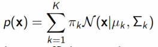
- with πk the mixing coefficients, where  
  与πk的混合系数，其中  
  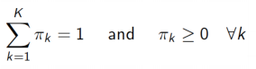
- GMM is a density estimator  
  GMM是一个密度估计器
- GMM is universal approximators of densities (if you have enough
  Gaussians)  
  GMM是密度的通用近似器（如果你有足够的高斯分布）

- To have a model best fit data, we need to maximize the (log)
  likelihood  
  为了得到一个模型的最佳拟合数据，我们需要最大化（对数）的可能性  
  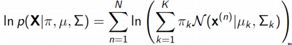
- Expectation: if we knew πk, µ and ∑ , we can get “soft”
  Zk P(z(n)|x) - responsibility
- Maximization: if we know Zk, we can get πk, µ
  and ∑

- GMM model has 3 parameters in total to optimise:  
  GMM模型共有3个参数进行优化：
  - the mean vectors of each component(mu)  
    每个分量的平均向量(mu)
  - the covariances matrices of each component(sigma)  
    每个分量的协方差矩阵(sigma)
  - the weights associated with each component(pi)  
    与每个组件关联的权重(pi)

  - Each iteration of the EM algorithm increases to likelihood of the
    data, unless you happen to be exactly at a local optimum.  
    EM算法的每次迭代都会增加到数据的可能性，除非你碰巧恰好处于局部最优状态。

### 4.2 Expectation-Maximization(EM Algorithm)

- An optimization process that alternates between 2 steps:  
  在以下两个步骤之间交替进行的优化过程：
  - E-step: compute the posterior probability over z given the current
    model.  
    E步：计算给定当前模型对z的后验概率  
    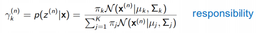
  - M-step: Assuming data was really generated this way, change the
    parameters of each Gaussian to maximize the probability that it
    would generate the data it is currently responsible for.  
    m步：假设数据真的是以这种方式生成的，那么就改变每个高斯分布的参数，以最大限度地提高它产生它目前负责的数据的概率
    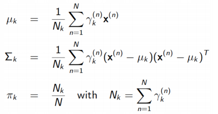

- A general algorithm for optimizing many latent variable models (not
  just for GMMs).  
  一种用于优化许多潜在变量模型的通用算法(不仅仅是用于gmm)
- Iteratively computes a lower bound then optimizes it  
  迭代地计算一个下界，然后优化它
- Converges but maybe to a local minima  
  收敛，但可能会收敛到一个局部最小值
- Can use multiple restarts  
  可以使用多个重新启动

### 4.3 Summary

- Clustering  
  聚类
  - group similar data points  
    组相似的数据点
  - need a distance measure  
    需要一个距离测量
- Agglomerative hierarchical clustering  
  凝聚的层次聚类
  - successively merges similar groups of points  
    依次合并相似的点组
  - build a dendrogram (binary tree)  
    构建一个树状图（二叉树）
  - different ways to measure distance between clusters  
    测量集群之间距离的不同方法
- GMM using EM  
  GMM使用EM
  - build a generative model based on Gaussian distributions  
    建立一个基于高斯分布的生成模型
  - need to pre-define k (number of clusters)  
    需要预先定义k（集群的数量）
  - Using EM to find the best fit of the model  
    利用EM找到模型的最佳拟合性

## 5. DBSCAN

### 5.1 Density-based Clustering - DBSCAN

- Acronym for: Density-based spatial clustering of applications with
  noise  
  缩写：基于密度的带有噪声的应用程序的空间聚类
- Clusters are dense regions in the data space separated by regions of
  lower sample density  
  聚类是数据空间中由样本密度较低的区域分隔的密集区域
- A cluster is defined as a maximal set of density connected points  
  一个簇被定义为密度连接点的最大集
- Discover clusters of arbitrary shape  
  发现任意形状的簇

- Define three exclusive types of points  
  定义三种排他性类型的点
  - Core, Border (or Edge) and Noise (or outlier)  
    核心、边界（或边缘）和噪声（或异常值）

> Core points -- dense region 核心点，密集区域  
> Noise -- sparse region 噪声稀疏区

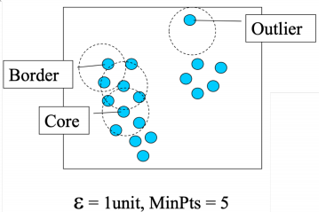

- Need two parameters  
  需要两个参数
  - a circle of epsilon radius  
    一个半径的圆
  - a circle containing at least minPts number of points  
    一个至少包含分钟数点的圆

- Three types of points

| core   | The point has at least minPts number of points within Eps 该点在Eps内至少有minPts数量的点数                                                            |
|:-------|:------------------------------------------------------------------------------------------------------------------------------------------------------|
| border | The point has fewer than minPts within Eps, but is in the neighbourhood (i.e. circle) of a core point 该点在Eps内比minpt少，但在一个核心点的附近（即圆圈） |
| noise  | Any point that is not a core point or a border point.  任何不是核心点或边界点的任何点                                                                   |

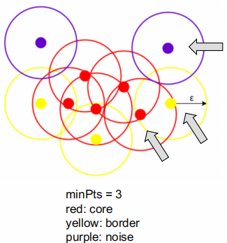

- Density-reachability  
  密度可达性
  - Directly density-reachable: a point q is directly density-reachable
    from point p if p is a core point and q is in p’s neighbourhood  
    直接密度可达：如果p是一个核心点，并且q在p的邻域内，则一个点q从点p直接密度可达

  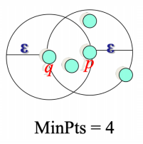
  - q is directly density-reachable from p  
    q可以从p直接得到密度
  - p is not necessarily directly density-reachable from q  
    p不一定能从q中直接达到密度
  - Density-reachability is asymmetric  
    密度-可达性是不对称的
  - Density-Reachable (directly and indirectly)  
    密度-可达性（直接或间接）
    - A point p is directly density-reachable from p2  
      一个点p可以从p2直接通过密度到达
    - p2 is directly density-reachable from p1  
      p2可以从p1直接达到密度
    - p1 is directly density-reachable from q  
      p1可以直接从q达到密度
    - q -> p1 -> p2 -> p form a chain(p is the border)  
      q->p1->p2->p形成一个链(p是边界)

  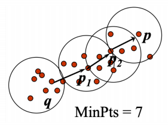
  - p is indirectly density-reachable from q  
    p是从q间接达到密度的
  - q is not density-reachable from p  
    q不能从p得到密度

### 5.2 The algorithm

1. Label all points as core, border or noise.  
   将所有点标记为核心、边界或噪声
2. Eliminate noise points. 消除噪声点
3. For every core point p that has not been assigned to a cluster:  
   对于没有分配给集群的每个核心点p  
   Create a new cluster with the point p and all the points that are
   density-reachable from p  
   用点p和所有从p可以达到密度的点创建一个新的集群
4. For border points belonging to more than 1 cluster, assign it to the
   cluster of the closest core point.  
   对于属于1个集群的边界点，将其分配给最近核心点的集群。

- Some key points
  - DBSCAN can find non-linearly separable clusters. (an advantage over
    K-means and GMM)  
    DBSCAN可以找到非线性可分的簇。(相对于K-means和GMM的优势)
  - Resistant to noise  
    耐噪音
  - Not entirely deterministic: border points that are reachable from
    more than one cluster can be part of either cluster, depending on
    the implementation  
    不完全确定性的：从多个集群可访问的边界点可以是任意一个集群的一部分，这取决于实现

- K-means and EM rely on cluster initialisation, and EM also relies on
  gradient descent. Therefore, they are non-deterministic algorithms and
  may get struck at local optima  
  K-means和EM依赖于聚类初始化，而EM也依赖于梯度下降。因此，它们是非确定性的算法，可能会达到局部最优

- Gaussian mixture model trained using EM is a soft version of K-means,
  but these two algorithms do not necessarily produce the same cluster
  centres given the same data set.  
  使用EM训练的高斯混合模型是K-means的软版本，但这两种算法在相同的数据集下不一定产生相同的聚类中心。
- DBSCAN is capable to discover clusters of any shapes.  
  DBSCAN能够发现任何形状的集群
- Using Gaussian mixture model with Expectation-maximization
  optimization to cluster a data set, the result is non-deterministic
  and may get stuck in local optima.  
  利用高斯混合模型和期望最大化优化对数据集进行聚类，结果是不确定性的，可能会陷入局部最优。

## 6. Supervised Learning

### 6.1 Supervised Learning

- One of the most prevalent forms of ML  
  ML最普遍的形式之一
  - Teach a computer to do something, then let it use its knowledge to
    do it  
    教电脑去做某件事，然后让它用自己的知识去做
- Other forms of ML  
  其他形式的ML
  - Unsupervised learning  
    无监督学习
  - Reinforcement learning  
    强化学习

- Types of supervised learning  
  监督学习的类型
  - Regression  
    回归
  - Classification  
    聚类
    - Binary
    - Multi-class

### 6.2 Training data

- Supervised learning needs annotated data for training:  
  监督学习需要培训的注释数据：  
  in the form of examples of (Input, Output) pairs  
  以（输入、输出）对的示例的形式出现
- After training completed  
  培训完成后
  - you present it with new Input that it hasn't seen before  
    你用它以前从未见过的新输入来呈现它
  - It needs to predict the appropriate Output  
    它需要预测适当的输出

### 6.3 Terminology in Supervised Learning

- Input = attribute(s) = feature(s) = independent variable
- Output = target = response = dependent variable
- function = hypothesis = predictor

### 6.4 Applications of supervised learning

- Handwriting recognition  
  手写识别
  - When you write an envelope, algorithms can automatically route
    envelopes through the post  
    当你写一个信封时，算法可以自动通过邮件发送信封
- Computer vision & graphics  
  计算机视觉和图形
  - When you go out during lockdown, object detection & visual tracking
    algorithms can automatically detect compliance with the rules  
    当你在锁定期间外出时，目标检测和视觉跟踪算法可以自动检测到是否符合规则
- Bioinformatics  
  生物
  - Algorithms can predict protein function from sequence  
    算法可以从序列中预测蛋白质的功能
- Human-computer interaction  
  人机互动
  - Intrusion detection algorithms can recognise speech, gestures,
    intention  
    入侵检测算法可以识别语音、手势、意图

## 7. Linear Regression

### 7.1 Regression

- Regression means learning a function that captures the “trend” between
  input and output  
  回归意味着学习一个捕获输入和输出之间的“趋势”的函数
- We then use this function to predict target values for new inputs  
  然后，我们使用这个函数来预测新输入的目标值

### 7.2 Univariate linear regression

- Visually, there appears to be a trend  
  从视觉上看，似乎有一种趋势
- A reasonable **model** seems to be the **class of linear functions
  (lines)**  
  一个合理的模型似乎是一类线性函数（线）
- We have one input attribute (year) - hence the name **univariate**  
  我们有一个输入属性（年份），因此它被命名为单变量

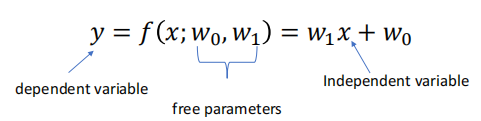

- Any line is described by this equation by specifying values for 𝑤1,
  𝑤0.

### 7.3 Loss functions (or cost functions)

- We need a criterion that, given the data, for any given line will tell
  us how bad is that line.  
  我们需要一个标准，给定数据，对于任何给定的线都会告诉我们这条线有多糟糕
- Such criterion is called a loss function. It is a function of the free
  parameters!  
  这种准则被称为损失函数。它是一个自由参数的函数
- Loss function = cost function = loss = cost = error function

- Square loss(L2 loss)
  - The loss expresses an error, so it must be always non-negative  
    损失表示一个错误，所以它必须总是是非负的
  - Square loss is a sensible choice to measure mismatch for regression  
    平方损失是衡量回归不匹配的合理选择
  - Mean Square Error (MSE)平均平方误差(MSE)  
    

### 7.4 what we want to do

- Given training data  
  
- Fit the model  
  
- By minimising the cost function  
  

- Every combination of w0 and w1 has an associated cost  
  w0和w1的每个组合都有一个相关的成本
- To find the ‘best fit’ we need to find values for w0 and w1 such that
  the cost is minimum.  
  为了找到“最佳拟合”，我们需要找到w0和w1的值，从而使成本最小

### 7.5 Gradient Descent

- A general strategy to minimise cost functions  
  一种最小化成本函数的一般策略
- Goal: Minimise cost function 𝑔(𝑤), where 𝒘 =(𝑤0, 𝑤1, , …)  
  目标：最小化成本函数，𝑔(𝑤)  
  
- α is called “learning rate”= “step size”

- If the value of alpha is too high, Gradient Descent will never reach
  the minimum  
  如果alpha的值过高，梯度下降将永远不会达到最小值

### 7.6 Gradient

- Partial derivative with respect to 𝑤0
  is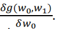It means the derivative
  function of 𝑔(𝑤0, 𝑤1) when 𝑤1 is treated as constant.
- Partial derivative with respect to 𝑤1
  is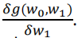It means the derivative
  function of 𝑔(𝑤0, 𝑤1) when 𝑤0 is treated as constant.
- The vector of partial derivatives is called the gradient  
  偏导数的向量称为梯度 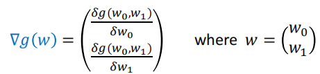
- The negative of the gradient evaluated at a location (𝑤0, 𝑤1) gives
  us the direction of the steepest descent from that location.  
  在一个位置（𝑤0，𝑤1）上计算的梯度的负值给出了从该位置最陡下降的方向

- Computing the gradient for our L2 loss  
  计算L2损失的梯度  
  
- Algorithm for univariate linear regression using GD  
  基于GD的单变量线性回归算法  
  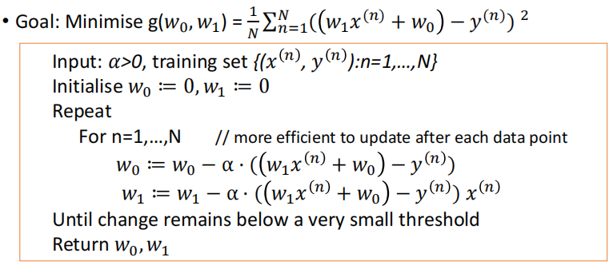

- Multivariate linear regression  
  多元线性回归  
  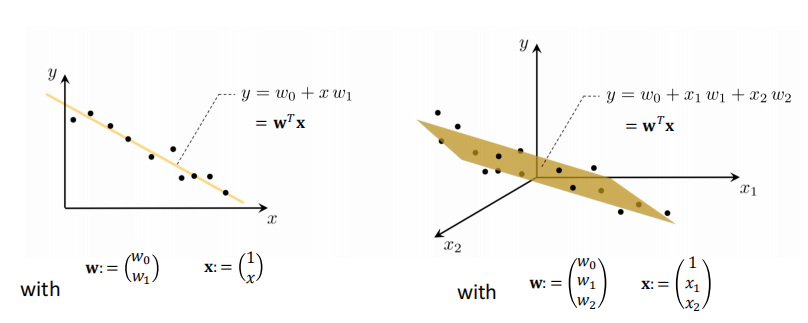

- Univariate nonlinear regression  
  单变量非线性回归  
  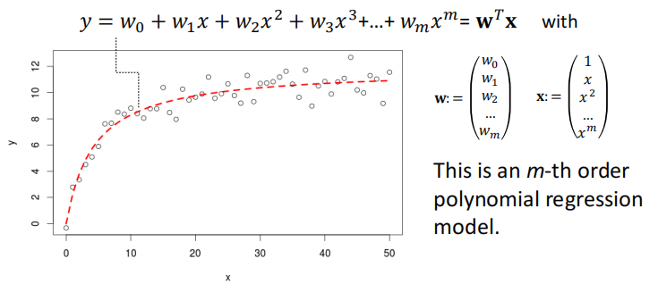

- Advantages of vector notation  
  矢量符号的优点
  - Vector notation in concise  
    向量符号简明
  - With the vectors 𝒘 and 𝐱 populated appropriately (and differently
    in each case, as on the previous 2 slides), these models are still
    linear in the parameter vector.  
    由于向量𝒘和𝐱适当填充（每种情况下都不同，如前两个幻灯片），这些模型在参数向量中仍然是线性的。
  - The cost function is the L2 as before  
    成本函数和前面一样是l2
  - So the gradient in both cases
    is: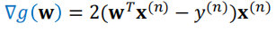
  - Ready to be plugged into the general gradient descent algorithm  
    准备好被插入到一般的梯度下降算法中

- x is independent variables
- w is free parameters(weights)

- Note: The choice of learning rate alpha depends upon dataset and
  hypothesis function. Thus, without any further known details and given
  an arbitrary choice of alpha, it cannot be estimated whether gradient
  descent will converge or not.  
  注：学习率alpha的选择取决于数据集和假设函数。因此，如果没有任何已知细节和给定任意选择，就不能估计梯度下降是否会收敛。

## 8. Logistic Regression

### 8.1 Logistic regression

- It is a linear model for classification (contrary to its name!)  
  它是一个分类的线性模型（与它的名字相反！）

- In regression, the targets are real values  
  在回归中，目标是真实的值
- In classification, the targets are categories, and they are called
  labels  
  在分类中，目标是类别，它们被称为标签

### 8.2 Model formulation

- We want to put a boundary between 2 classes  
  我们想在两个类之间设置一个界限
- If x has a single attribute, we can do it with a point  
  如果x有一个单一的属性，我们可以用一个点来完成它  
  
- If x has 2 attributes, we can do it with a line  
  如果x有两个属性，我们可以用一行来做  
  
- If x has 3 attributes, we can do it with a plane  
  如果x有3个属性，我们可以用一个平面来做
- If x has more than 3 attributes, we can do it with a hyperplane (can’t
  draw it anymore)  
  如果x有超过3个属性，我们可以用一个超平面来完成它（不能再绘制它了）
- If the classes are linearly separable, the training error will be 0  
  如果这些类是线性可分的，则训练误差将为0

- The sigmoid function takes a single argument (note, 𝒘𝑇𝒙
  is one number).  
  s型函数采用单个参数（注意，𝒘𝑇𝒙是一个数字）
- It always returns a value between 0 and 1. The meaning of this value
  is the probability that the label is 1  
  它总是返回一个介于0到1之间的值。这个值的含义是标签为1的概率  
  
  - If this is smaller than 0.5 then we predict label 0  
    如果这小于0.5，那么我们预测标签为0
  - if this is larger than 0.5 then we predict label 1  
    如果这大于0.5，那么我们预测标签1
- There is a slim chance that the sigmoid outputs exactly 0.5. The set
  of all possible inputs for which this happens is called the decision
  boundary.  
  sigmoid 输出恰好为 0.5 的可能性很小。所有可能的集合发生这种情况的输入称为决策边界

### 8.3 Cost function

- each data point contributes a cost, and the overall cost function is
  the average of these  
  每个数据点贡献一个成本，总体成本函数是这些成本的平均值
- the cost is a function of the free parameters of the model  
  代价是模型的自由参数的函数

- Given training data  
  
- Fit the model  
  
- By minimising the cross-entropy cost function  
  

- When the actual output y=0 and the prediction is 1, the logistic
  regression cost function assigns a cost of ∞ 当实际输出 y=0 且预测为 1
  时，逻辑回归成本函数分配的成本为 ∞

### 8.4 Learning algorithm by gradient descent

- We use gradient descent (again!) to minimise the cost function, i.e.
  to find the best weight values.  
  我们使用梯度下降（再次如此！）使成本函数最小化，即找到最佳的权重值
- The gradient vector is:  
  梯度向量为  
    
  

- Learning algorithm for logistic regression  
  

- Nonlinear logistic regression: instead of linear function inside the
  exp in the sigmoid, we can use polynomial functions of the input
  attributes  
  非线性逻辑回归：我们可以使用输入属性的多项式函数，而不是s型exp中的线性函数
- Multi-class logistic regression: uses a multi-valued version of
  sigmoid  
  多类逻辑回归：使用多值版本的s型算法

- Examples of application of logistic regression  
  逻辑回归的应用例子
  - Face detection: classes consist of images that contain a face and
    images without a face
  - Sentiment analysis: classes consist of written product-reviews
    expressing a positive or a negative opinion
  - Automatic diagnosis of medical conditions: classes consist of
    medical data of patients who either do or do not have a specific
    disease

## 9. Neural Networks

### 9.1 Neural Networks

- Highly nonlinear models having many free parameters  
  具有许多自由参数的高度非线性模型
- Can be used for either regression and classification depending on the
  choice of loss function  
  可根据损失函数的选择进行回归和分类
- Can replace nonlinear regression and nonlinear logistic regression
  which are less practical  
  可以代替不太实用的非线性回归和非线性逻辑回归

1. Model formulation

- Sometimes called “architecture”  
  有时也被称为“建筑”
- Designing this for the problem at hand is the main challenge  
  针对当前的问题设计这个方案是主要的挑战

2. Cost function

- for regression: Mean square error between predictions and observed
  targets  
  回归：预测和观测目标之间的均方误差
- for classification: Logistic loss (also called cross-entropy)  
  用于分类：Logistic损失（也称为交叉熵）

3. Learning algorithm by gradient descent

- The update rules are non-trivial, because the models are much more
  complex  
  更新规则不简单，因为模型要复杂得多
- It is performed by an algorithm called “Backpropagation”  
  它是由一种叫做“反向传播”的算法来执行的
- Conceptually, each iteration of Backprop takes a gradient descent step  
  从概念上讲，每一次的后prop迭代都采取一个梯度下降步骤
- Implementations exist that are able to compute the grandient
  automatically  
  存在着能够自动计算宏伟建筑的实现
- To update the weights of the Neural Network  
  更新神经网络的权重

- use the Backpropagation algorithm and set a good learning rate (alpha)
  for it:  
  用反向传播并且设置一个好的alpha值
  - Train on the training data repeatedly, each time using a different
    value of alpha, and pick the version of the model for which the
    validation error is lowest.  
    重复训练训练数据，每次使用不同的 alpha 值，并选择验证错误最低的模型版本。

- Building blocks of a feedforward neural net  
  前馈神经网络的构件
  - Each node is one unit or neuron  
    每个节点是一个单位或神经元
  - Each arrow is a connection with a weight  
    每个箭头都是一个带有一个重量的连接点
  - Nodes are arranged in layers  
    节点被分层排列
    - One input layer
    - One output layer
    - Any number of hidden layers (0,1,2,…)
  - Hidden & output nodes typically apply a sigmoid, or other activation
    function  
    隐藏和输出节点通常应用s型节点或其他激活函数

- Simplest neural net  
  最简单的神经网络
  - A neural net with 0 hidden layers is called a perceptron  
    一个具有0个隐藏层的神经网络被称为感知器
  - If the activation function is the sigmoid, then this model is
    equivalent to a logistic regression  
    如果激活函数是s型的，那么这个模型就等价于一个逻辑回归  
    
    - The type of computation performed by each non-input node is the
      same in multi-layer networks too.  
      在多层网络中，每个非输入节点所执行的计算类型也同样相同
    - The choice of activation function can be different  
      激活函数的选择可能会有所不同

- Multi-layer perceptron  
  多层感知机
  - When we have one hidden layer, the model is called multi-layer
    perceptron  
    当我们有一个隐藏层时，该模型被称为多层感知器
  - It is a truly non-linear model  
    这是一个真正的非线性模型
  - Weights = parameters
  - Number of hidden units, choice of activation function =
    hyperparameters
  - Number of output nodes = number of targets or labels we want to
    predict
  - MLP is more complex, hence it is more flexible  
    MLP 更复杂，因此更灵活
  - MLP can learn a nonlinear curve  
    MLP 可以学习非线性曲线

- Deep neural networks  
  深度神经网络
  - Very simply, deep learning is machine learning using neural networks
    that have multiple hidden layers  
    很简单，深度学习是一种使用具有多个隐藏层的神经网络的机器学习
  - Number of hidden layers is another hyperparameter  
    隐藏层的数量是另一个超参数
  - Several hidden layers, several hidden nodes, several hyperparameters  
    几个隐藏层，几个隐藏节点，几个超参数
  - Mean square error

### 9.2 Overfitting

- learning every irrelevant detail (noise) in a training data set will
  not help  
  在训练数据集中学习每一个不相关的细节（噪声）是没有帮助的
- Overfitting happens when the model is more complex than required  
  当模型比要求的更复杂时，就会发生过拟合
- The error on the test data increases across consecutive epochs whereas
  that on the training data reduces  
  测试数据上的误差在连续的时期内增加，而训练数据上的误差减少

- Classification  
  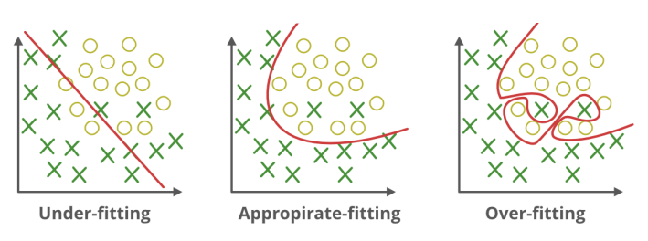

- Regression  
  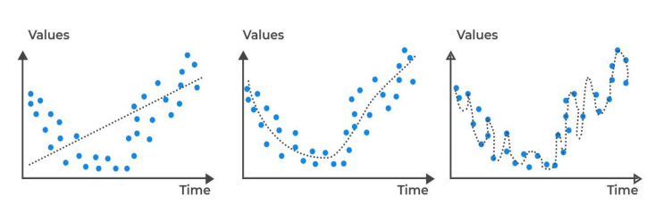

- Regularisation 规则化
  - One way to guard against overfitting is regularisation  
    防止过度拟合的一种方法是规则化
  - Add a penalty to the cost function to penalise more complex models  
    在成本函数中添加一个惩罚，以惩罚更复杂的模型
  - Prune the model  
    修剪模型

- Early stopping 早停
  - Stopping the training early is another effective way to guard
    against overfitting  
    提前停止训练是防止过度拟合的另一种有效方法
  - After each gradient update (or Backprop cycle), the training cost
    will decrease until it reaches 0  
    在每次梯度更新（或反向循环）后，培训成本将会下降，直到达到0
  - Set aside a subset of the data (called hold-out set) to use only for
    monitoring the cost on previously unseen data  
    留出一个数据子集（称为保留集），仅用于监视以前未见过的数据的成本
  - The error on hold-out set will decrease at first, but as training
    continues, it can start increasing  
    保留集上的错误一开始会减少，但随着训练的继续，它可能会开始增加
  - Stop training when the error on hold-out set starts increasing  
    当在保留集上的错误开始增加时，停止训练

## 10. Evaluation & Hyperparameter Tuning

### 10.1 Recap

- Each supervised learning method consists of 3 ingredients:  
  每种监督学习方法由3个组成部分组成
  - Model: form of function we want to learn (has free parameters)  
    模型：我们想要学习的函数形式（有自由参数）
  - Cost function: given a training set, it measures the misfit of any
    particular function from the model  
    代价函数：给定一个训练集，它度量模型中任何特定函数的不拟合
  - Training algorithm: gradient descent minimisation of the cost
    function  
    训练算法：代价函数的梯度下降最小化

- Hyperparameters are “higher-level” free parameters  
  超参数是“高级”自由参数
  - In Neural Networks:  
    神经网络中：
    - Depth (number of hidden layers)  
      深度（隐藏图层数）
    - Width (number of hidden neurons in a hidden layer)  
      宽度（隐藏层中隐藏神经元的数量）
    - Activation function (choice of nonlinearity in non-input nodes)  
      激活函数（非输入节点中的非线性选择）
    - Regularisation parameter (way to trade off simplicity vs. fit to
      the data)  
      正则化参数（权衡简单性与适合数据的方法）
  - In polynomial regression  
    多项式回归
    - Order of the polynomial (use of 𝑥, 𝑥2,
      𝑥3, … , 𝑥𝑚)  
      多项式的顺序（使用𝑥, 𝑥2, 𝑥3, … ,
      𝑥𝑚）
  - In general  
    普遍地
    - Model choice  
      模型选择

- Always split the available annotated data randomly into:  
  总是将可用的注释数据随机分成
  - A training set- to be used for training – i.e. estimating all the
    free parameters  
    一个用于训练的训练集，即估计所有的自由参数
  - A test set - to be used to evaluate the trained predictor before
    deploying it  
    一个测试集-用于在部署它之前评估已训练过的预测器

- Each hyperparameter value corresponds to a different model  
  每个超参数值对应于一个不同的模型
- For this evaluation we can no longer use our cost function computed on
  training set – why?  
  对于这个评估，我们不能再使用我们对训练集计算的成本函数-为什么？
  - The more complex (flexible) the model, the better it will fit the
    training data  
    模型越复杂（越灵活），就越适合训练数据
  - But the goal is to predict well on future data  
    但其目标是要很好地预测未来的数据
  - A model that has capacity to fit any training data will overfit  
    一个能够拟合任何训练数据的模型将会被过度拟合

- Even if the models only differ by one hyperparameter, they are
  different models.  
  即使这些模型只相差一个超参数，它们也是不同的模型。
- Choosing a particular value of a hyperparameter requires evaluating
  each model.  
  选择一个超参数的特定值需要评估每个模型

### 10.3 Evaluating models for model choice

- The training set is annotated data (input, output) – use for training
  within a chosen model  
  训练集是注释数据（输入、输出）-用于在选定的模型内进行训练
- The test set is also annotated data (input output) – use for
  evaluating the performance of the trained predictor before deploying
  it  
  测试集还包括注释数据（输入输出）——用于在部署它之前评估训练过的预测器的性能
- None of these can be used to choose the model!  
  这些都不能用来选择模型！

- Idea: To choose between models or hyperparameters, split out a subset
  from the training set = validation set  
  想法：要在模型或超参数之间进行选择，从训练集=验证集中分割出一个子集
- Methods:
  - Holdout validation  
    保留验证
  - Cross-validation  
    交叉验证
  - Leave-one-out validation  
    留一验证

### 10.4 The holdout validation method

1. Randomly choose 30% of the data to form a validation set  
   随机选择30%的数据形成一个验证集  
   
2. The remainder is a training set  
   剩下的是一个训练集
3. Train your model on the training set  
   在训练集中训练你的模型  
   
   
   
4. Estimate the test performance on the validation set  
   估计在验证集上的测试性能

- In regression, we compute the cost function (mean square error) on the
  examples of the validation set (instead of the training set)  
  在回归过程中，我们在验证集（而不是训练集）的例子上计算代价函数（均方误差）
- In classification, we don’t compute the cross-entropy cost on the
  validation set, instead on validation set we compute the 0-1 error
  metric:  
  在分类中，我们不计算验证集上的交叉熵代价，而是在验证集上计算0-1的误差度量：  
  
  - There are also other metrics, besides Accuracy, that take account of
    the 2 types of error specific to classification (false positives and
    false negatives)  
    除了准确性之外，还有其他指标考虑了分类的两种类型的错误（假阳性和假阴性）

5. Choose the model with lowest validation error  
   选择验证误差最小的模型
6. Re-train with the chosen model on joined train & validation set to
   obtain predictor  
   在连接列车和验证集上使用所选模型进行再训练，以获得预测器
7. Estimate future performance of obtained predictor on the test set  
   在测试集上估计所获得的预测器的未来性能
8. Ready to deploy the predictor  
   已经准备好部署该预测器了

### 10.5 k-fold Cross-validation

- Split the training set randomly into k (equal sized) disjoint sets.
  (In this example, k=3)  
  将训练集随机分割成k个（大小相等）的不相交集。(在本例中，k=3)
- Use k-1 of those together for training  
  将其中的k-1一起进行培训
- Use the remaining one for validation.  
  使用其余的一个来进行验证。
- Permute the k sets and repeat k times.  
  排列k个集合并重复k个时间。
- Average the performances on the k validation sets.  
  平均在k个验证集上的性能。

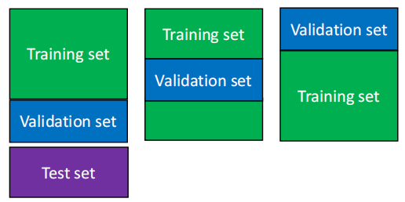

- Randomly break the dataset into k partitions (here k=3)  
  将数据集随机分解为k个分区(这里是k个=3)  
  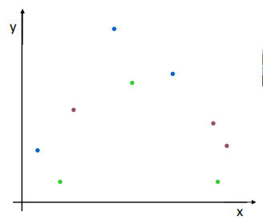
- For the blue partition: Train on all the points except the blue
  partition. Compute the validation error using the points in the blue
  partition  
  对于蓝色分区：对除蓝色分区以外的所有点进行训练。使用蓝色分区中的点来计算验证错误  
  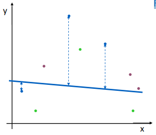
- For the green partition: Train on all the points except the green
  partition. Compute the validation error using the points in the green
  partition.  
  对于绿色分区：对除绿色分区以外的所有点进行训练。使用绿色分区中的点来计算验证错误。  
  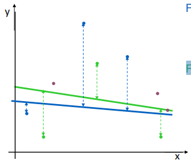
- For the purple partition: Train on all the points except the purple
  partition. Compute the validation error using the points in the purple
  partition.  
  对于紫色分区：对除紫色分区之外的所有点进行训练。使用紫色分区中的点来计算验证错误。  
  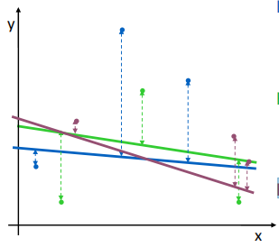
- Take the mean of these errors  
  取这些误差的平均值  
  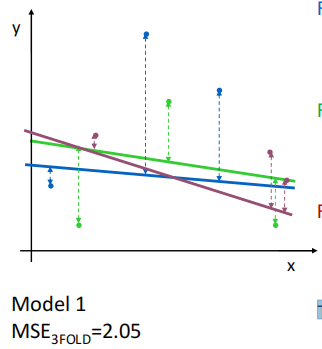
  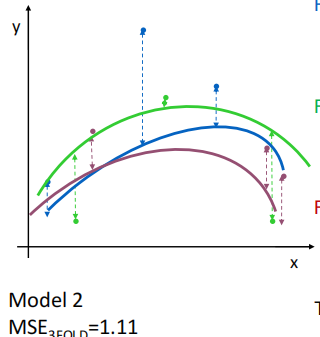
  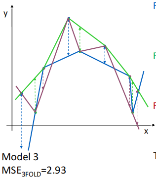

### 10.6 Leave-one-out validation

- We leave out a single example for validation, and train on all the
  rest of the annotated data  
  我们省略了一个可供验证的示例，并对所有其余的注释数据进行了训练
- For a total of N examples, we repeat this N times, each time leaving
  out a single example  
  对于总共N个例子，我们重复这N次，每次都省略一个例子 Take the average of the
  validation errors as measured on the left-out points  
  取在遗漏点上测量的验证误差的平均值

- Same as N-fold cross-validation where N is the number of labelled
  points  
  与N倍交叉验证相同，其中N是标记点的数量

### 10.7 Advantages & Disadvantages

|                    | Advantages                              | Disadvantages                                                                       |
|:-------------------|:----------------------------------------|:------------------------------------------------------------------------------------|
| Holdout validation | Computationally cheapest                | Most unreliable if sample size is not large enough                                  |
| 3-fold             | Slightly more reliable than holdout     | - Wastes 1/3-rd annotated data - Computationally 3-times as expensive as holdout |
| 10-fold            | - Only wastes 10%  - Fairly reliable | - Wastes 10% annotated data  - Computationally 10-times as expensive as holdout  |
| Leave-one-out      | Doesn't waste data                      | Computationally most expensive                                                      |

- re-train the same network with a lot more training data  
  用更多的训练数据重新训练同一个网络
  - The turning point in the validation error curve will occur at a
    later iteration than before.  
    验证误差曲线的转折点将发生在比以前更晚的迭代中。
  - The training error curve and validation error curve will become more
    similar to each other.  
    训练误差曲线和验证误差曲线将变得更加相似

## 11. Naive Bayes

### 11.1 Fundamental concepts in Probability Theory

- Probabilistic model: a mathematical description of an uncertain
  situation. The two main elements of a probabilistic model are:  
  概率模型：对不确定情况的数学描述。一个概率模型的两个主要要素是：
  - The sample space Ω, which is the set of all possible outcomes  
    样本空间Ω，它是所有可能结果的集合
  - The probability law, which assigns to a set A of possible outcomes
    (called an event) a nonnegative number P(A) (called the probability
    of A)  
    概率定律，它赋予A可能结果（称为事件）一个非负数P(A)（称为A的概率）
- Every probabilistic model involves an underlying process, called the
  experiment, that produces exactly one of several possible outcomes  
  每个概率模型都涉及到一个潜在的过程，称为实验，它恰好产生了几种可能的结果中的一种
- A subset of the sample space Ω is called an event  
  样本空间Ω的一个子集被称为事件

- Probability Axioms 概率公理
  - Nonnegativity: P(A) ≥ 0, for every event A  
    非负性：P(A)≥0，对于每个事件A
  - Additivity: If A and B are two disjoint events, then the probability
    of their union satisfies: P(A ∪ B) = P(A) + P(B)  
    可加性：如果A和B是两个不相交的事件，则它们的并集的概率满足：P(A∪B)=P(A)+P(B)
  - Normalisation: The probability of the entire sample space is equal
    to 1, namely P(Ω)= 1  
    归一化：整个样本空间的概率等于1，即P(Ω)= 1

- Random variables are usually indicated with uppercase letters, e.g., X
  or Temperature or Infection  
  随机变量通常用大写字母表示，如X或温度或感染
- The values are indicated with lowercase letters, X∈{ture,false}  
  这些值用小写字母表示,X∈{ture,false}
- Vectors are usually indicated with bold letters or a small arrow above
  the letter  
  向量通常用粗体字母或字母上方的一个小箭头表示
- PMF is usually indicated by the symbol px(x)  
  MF通常用符号px(x)表示

- An unconditional (or prior) probability distribution gives us the
  probabilities of all possible events without knowing anything else
  about the problem, e.g., the maximum value of two rolls of a 4-sided
  die  
  一个无条件（或先验）概率分布给我们所有可能事件的概率，而不知道问题的任何其他东西，例如，四面模具的两卷的最大值
- A conditional (or posterior) probability distribution gives us the
  probability of all possible events with some additional knowledge,
  e.g., the maximum value of two rolls of a 4-sided die knowing that the
  first roll is 3  
  一个条件（或后验）概率分布给了我们有一些附加知识的所有可能事件的概率，例如，知道第一个辊的双面模具的两辊的最大值是3

- A joint probability distribution is the probability distribution
  associated to all combinations of the values of two or more random
  variables  
  联合概率分布是与两个或多个随机变量的值的所有组合相关联的概率分布
- This is indicated by commas, e.g., P(X,Y)  
  这是用逗号表示的，例如，P(X,Y)
- We can calculate the joint probability distribution by using the
  product rule as in the following:  
  P(X,Y) = P(X|Y)P(Y) = P(Y|X)P(X)

- The mean (or expected value or expectation), also indicated by μ of a
  random variable X with PMF px(x) represents the centre of
  gravity of the PMF:  
  平均值（或期望值或期望值），也由随机数的 μ 表示带有 PMF px(x) 的变量
  X 表示 PMF 的重心：  
  
- The variance of a random variable X provides a measure of the
  dispersion around the mean:  
  一个随机变量X的方差提供了一个在均值周围的离散度的度量  
  
- The standard deviation is another measure of dispersion:  
  标准偏差是离散度的另一种度量方法：  
  

- Continuous Random Variables  
  连续随机变量
  - A random variable X is called continuous if its probability law can
    be described in terms of a nonnegative function fx. This function is
    called probability density function (PDF) and is the equivalent of
    the PMF for discrete random variables  
    如果随机变量 X 的概率规律可以被描述，则称其为连续变量 就非负函数 fx
    而言。这个函数称为概率密度 函数 (PDF) 并且等效于离散随机变量的 PMF  
    
  - Since we are dealing with continuous variables, there are an
    infinite number of values that X can take  
    因为我们处理的是连续变量，所以X可以取无数个值
  - As for the discrete case, also for continuous random variables we
    can have unconditional, conditional and joint probability
    distributions  
    对于离散情况，对于连续随机变量，我们可以有无条件的、条件的和联合概率分布

- A probability mass function for a categorical / ordinal random
  variable gives the probability of observing each of the possible
  values of this variable.  
  分类/有序随机变量的概率质量函数给出了观察该变量每个可能值的概率

### 11.2 Bayes' Theorem

- The above equation is known as Bayes’ Theorem (also Bayes’ rule or
  Bayes’ law)  
  上述方程称为贝叶斯定理（也称为贝叶斯规则或贝叶斯定律）

- Equivalent Terminology  
  等效术语
  - Input attribute, independent variable, input variable  
    输入属性，自变量，输入变量
  - Output attribute, dependent variable, output variable, label
    (classification)  
    输出属性、因变量、输出变量、标签（分类）
  - Predictive model, classifier (classification), or hypothesis
    (statistical learning)  
    预测模型、分类器（分类）或假设（统计学习）
  - Learning a model, training a model, building a model  
    学习模型，训练模型，建立模型
  - Training examples, training data  
    培训示例、培训数据
  - Example, observation, data point, instance (more frequently used for
    test examples)  
    示例、观察、数据点、实例（通常用于测试示例）
  - P(a,b) = P(a and b) = P(a ∧ b)

- More than 1 Independent Variable  
  1多个自变量  
  
  - P represents the probability calculated based on the frequency
    tables  
    P表示根据频率表计算出的概率
  - c represents a class  
    c表示一个类
  - ai represents the value of independent variable
    xi ∈ {1, … , n}  
    ai表示自变量xi∈{1，...，n}的值
  - n is the number of independent variables  
    n是自变量的数量
  - α is the normalisation factor  
    α是正常化因子

### 11.3 Naive Bayes for Categorical Independent Variables

- For increasing numbers of independent variables, all possible
  combinations must be considered:  
  对于增加自变量的数量，必须考虑所有可能的组合  
  
- For a domain described by n Boolean variables, we would need an input
  table of size O(2n) and it would take O(2n) to
  process the table  
  对于由 n 个布尔变量描述的域，我们需要一个大小为 O(2n)
  的输入表，处理该表需要 O(2n)

- Assumption: each input variable is conditionally independent of any
  other input variables given the output  
  假设：每个输入变量都有条件地独立于给定输出的任何其他输入变量
- Independence: A is independent of B when the following equality holds
  (i.e., B does not alter the probability that A has occurred):  
  独立性：当下列等式时，A 独立于 B 成立（即 B 不会改变 A 发生的概率）：  
  P(A|B) = P(A)

- Conditional independence: x1 is conditionally independent
  of x2 given y when the following equality holds  
  条件独立：x1 条件独立于给定的 x2 y 当下列等式成立时  
  P(x1|x2,y) = P(x1,y)

- Summary
  - Naïve Bayes Learning Algorithm  
    朴素贝叶斯学习算法
    - Create frequency tables for each independent variable and the
      corresponding values for the frequency of an event  
      为每个自变量创建频率表和事件频率的相应值
    - Count the number of training examples of each class with each
      independent variable  
      用每个自变量计算每个类的训练示例的数量
    - Apply Laplace smoothing  
      应用拉普拉斯平滑
  - Naïve Bayes Model  
    朴素贝叶斯模型
    - Consists of the frequency tables obtained from Bayes’ Theorem
      under the conditional independence assumption (with or without
      Laplace smoothing)  
      由在条件独立假设下（有无拉普拉斯平滑）的贝叶斯定理得到的频率表组成
  - Naïve Bayes prediction for an instance (X=a, Y=?)  
    对一个实例的朴素贝叶斯预测(X=a，Y=？)
    - We use Bayes’ Theorem under the conditional independence
      assumption  
      我们在条件独立假设下使用贝叶斯定理

### 11.4 Naive Bayes for Numerical Independent Variables

- We use the frequency table for the categorical independent variables  
  我们使用频率表作为分类自变量
- We use the parameter table for the numerical independent variables  
  我们使用参数表的数值自变量

- Pros and Cons of Naïve Bayes  
  朴素贝叶斯理论的利弊
  - Pros
    - Easy to implement and fast to predict a class from training data
      (online learning)  
      易于实现和快速地从培训数据预测一个课程（在线学习）
    - Performs well in multi-class prediction  
      在多类预测中表现良好
    - Good for categorical variables in general  
      一般于分类变量
  - Cons
    - Data that are not observed require smoothing techniques to be
      applied  
      没有观察到的数据需要应用平滑技术
    - For numerical variables, Gaussian distribution is assumed (strong
      assumption)  
      对于数值变量，假设为高斯分布（强假设）
    - Not good for regression problems  
      不利于回归问题

## 12. K-Nearest Neighbours

### 12.1 Notation

- Probabilistic models  
  概率模型
  - Variables are denoted by uppercase letters  
    变量用大写字母表示
  - Values that a variable can take are denoted by lowercase letters  
    一个变量可以取的值用小写字母表示
  - Vectors are denoted by letters in bold  
    向量用以粗体表示的字母表示

- Nonparametric Models  
  非参数模型
  - A nonparametric model is a model that cannot be characterised by a
    bounded set of parameters  
    非参数模型是一种不能由一组有界的参数来描述的模型
    - For instance, suppose that each prediction we make will consider
      all training examples, including the one from the previous
      prediction(s)  
      例如，假设我们所做的每个预测都将考虑所有的训练例子，包括前一个预测(s)
    - The set of examples grows over time, thus nonparametric  
      一组例子随着时间的增长，因此是非参数的
  - This approach is also called instance- or memory-based learning  
    这种方法也被称为基于实例或基于记忆的学习
    - The simplest method for instance-based learning is table lookup  
      基于实例的学习中最简单的方法是表查找
    - For table lookup, we put all training examples in a table, and
      when looking for a value, we return the corresponding value  
      对于表查找，我们将所有训练示例放在一个表中，在寻找一个值时，我们返回相应的值
    - Problem: if the value does not exist, then a default value is
      returned  
      问题：如果该值不存在，则返回一个默认值

### 12.2 k-Nearest Neighbour

- Distance Metrics  
  距离度量
  - Consider a problem with n dimensions, x\[q\] being the
    new example  
    考虑一个n维的问题，x\[q\]是一个新的例子
  - The Minkowski distance (or Lp norm) is defined as  
    Minkowski 距离（或 Lp 范数）定义为  
    
  - In general, the Euclidean distance is used, namely when p = 2  
    一般采用欧式距离，即p=2时  
    

### 12.3 k-NN algorithm and pros/cons

- Input: training examples x\[i\] ∈ x and their corresponding
  class y\[i\] , a new query example x\[q\],
  number of neighbours k  
  输入：训练样本 x\[i\] ∈ x 及其对应的类 y\[i\] ，
  一个新的查询示例 x\[q\]，邻居数 k
- Output: prediction of the new query example x\[q\]  
  输出：新查询示例 x\[q\] 的预测
- For each training example x\[i\] ∈ x  
  对于每个训练样例 x\[i\] ∈ x
  - Calculate the distance between the training example
    x\[i\] and the new query example x\[q\]  
    计算训练样例 x\[i\] 与新查询之间的距离 示例 x\[q\]
  - Keep the best k distances (the shortest distance) in a data
    structure T  
    在数据结构T中保持最佳的k个距离（最短的距离）
- Return the majority vote (or average/median) of the class
  y\[i\] for the first k entries of T  
  返回类 y\[i\] 的多数票（或平均值/中位数） T 的前 k 个条目

- Different numeric attributes may have different scales  
  不同的数字属性可能有不同的尺度
- For example, if x1 is in \[0,1\] and x2 is in
  \[1, 10\], x2 will affect the distance more  
  例如，如果 x1 在 \[0,1\] 中并且 x2 在 \[1, 10\]
  中，则 x2 会影响 距离更多
- To avoid this problem, we normalise the numeric input attributes of
  all data as in the following  
  为了避免这个问题，我们将所有数据的数值输入属性进行规范化，如下所示  
  
- Another approach (see book) is to calculate mean μj and
  standard deviation σj for each dimension j as:
  (xj\[i\] − μj)/σj  
  另一种方法（见书）是计算平均 μj 和 每个维度 j 的标准差
  σj 为： (xj\[i\] -
  μj)/σj

- For numeric input attributes, e.g., age in \[0, 100\], we calculate
  the distance as shown in previous examples  
  对于数值输入属性，例如\[0,100\]中的年龄，我们计算距离如前面所示所示
- For ordinal input attributes, e.g., sunny in {yes, no}, we can convert
  the values to numeric values: yes = 1, no = 0  
  对于顺序输入属性，例如，阳光在{是，否}中，我们可以将这些值转换为数值：是的=1，没有=0
- For categorical input attributes, e.g., phone_brand in {samsung,
  apple, nokia}, we can use the following approach:  
  对于分类输入属性，例如，在{三星、苹果、诺基亚}中的phone_brand，我们可以使用以下方法：
  - If the value of the query example is the same as the value for
    example i then their difference is 0. Formally, if
    xj\[q\] = xj\[i\] , then
    xj\[q\] − xj\[i\] = 0  
    如果查询示例的值与 例如 i 那么它们的差是 0。形式上，如果
    xj\[q\] = xj\[i\] ，然后
    xj\[q\] - xj\[i\] = 0
  - Otherwise, their difference is 1. Formally, if
    xj\[q\] ≠ xj\[i\] , then
    xj\[q\] − xj\[i\] = 1  
    否则，它们的差是 1。形式上，如果 xj\[q\] ≠
    xj\[i\] ，然后 xj\[q\] -
    xj\[i\] = 1

### 12.4 Summary

- k-NN Learning Algorithm  
  K-NN学习算法
  - The algorithm does not have proper training  
    该算法没有经过适当的训练
  - We simply store all training data, which increase over time  
    我们只是存储所有的训练数据，它们会随着时间的推移而增加
  - We normalise by calculating the minimum and maximum in the training
    data  
    我们通过计算训练数据中的最小值和最大值来进行归一化

- k-NN Model  
  k-NN模型
  - All training data, the values of the numeric input attributes  
    所有的训练数据，数值输入属性的值

- k-NN prediction for an instance (x\[i\], y = ?)  
  实例的 k-NN 预测 (x\[i\], y = ?)
  - Find the k nearest neighbours whose distance to x\[i\] is
    the smallest  
    找到到 x\[i\] 距离最小的 k 个最近邻
  - For classification problems, majority vote. For regression problems,
    average/median  
    对于分类问题，多数投票。对于回归问题，平均值/中值

- Pros
  - Training is simple and fast: just store training data  
    培训非常简单而快速：只需存储培训数据
  - Find the class of the new example based on most similar examples
    present in the training data  
    根据训练数据中最相似的例子找到新例子的类

- Cons
  - It uses large space in memory: we need to store all data  
    它使用了很大的内存空间：我们需要存储所有的数据
  - Running the algorithm can be slow if we have many training examples
    and many dimensions  
    如果我们有很多训练例子和许多维度，运行算法可能会很慢

## 13. Uninformed Search

### 13.1 Asymptotic Analysis

- Benchmarking is one approach  
  基准测试是一种方法
  - We run the algorithms and we measure speed (in seconds) and memory
    consumption (in bytes)  
    我们运行这些算法，并测量速度（以秒为单位）和内存消耗（以字节为单位）
  - Problem: this approach measures the performance of a specific
    program written in a particular language, on a given computer, with
    particular input data  
    问题：这种方法测量在特定的计算机上用特定语言编写的特定程序的性能
- Asymptotic analysis is the second approach:  
  渐近分析是第二种方法：
  - It is a mathematical abstraction over both the exact number of
    operations (by ignoring constant factors) and exact content of the
    input (by considering the size of the input, only)  
    它是对操作的精确数量（通过忽略常数因子）和输入的精确内容（仅通过考虑输入的大小）的一种数学抽象
  - It is independent of the particular implementation and input  
    它独立于特定的实现和输入

- The first step in the analysis is to abstract over the input. In
  practice, we characterise the size of the input, which we call n  
  分析的第一步是对输入进行抽象。在实践中，我们 表征输入的大小，我们称之为 n
- The second step is to abstract over the implementation. The idea is to
  find some measure that reflects the running time of the algorithm  
  第二步是抽象的实现。其想法是为了找到一些反映算法运行时间的度量方法
- For asymptotic analysis, we typically use 3 notations:  
  对于渐近分析，我们通常使用3种符号：
  - Big O notation: O(·)
  - Big Omega notation: Ω(·)
  - Big Theta notation: θ(·)

- Big O
  - We say that f(n) ∈ O(g(n)) when the following condition holds:  
    当以下条件成立时，我们说 f(n) ∈ O(g(n))：  
    
  - The above reads: “There exists a positive constant k such that for
    all n>n0, |f(n)|≤ k⋅ g(n)”  
    上面写着：“存在一个正常数 k，使得对于所有 n>n0, |f(n)|≤ k⋅ g(n)”
  - In simple terms, this is equivalent to saying that |f| is bounded
    above by a function g(up to a constant factor) asymptotically  
    简单来说，这相当于说 |f|有界以上 由函数 g（直到一个常数因子）渐近

- Big Theta and Big Omega
  - We say that f(n) ∈ Ω(g(n)) when the following condition holds:  
    当以下条件成立时，我们说 f(n) ∈ Ω(g(n))  
    
  - This is equivalent to saying that f is bounded below by g
    asymptotically  
    这相当于说 f 渐近地被 g 包围
  - We say that f(n) ∈ θ(g(n)) when the following condition holds:  
    当以下条件成立时，我们说 f(n) ∈ θ(g(n))  
    
  - Or f is bounded both above and below by g asymptotically  
    或者 f 在上面和下面都以 g 渐近为界

- Summary
  - Asymptotic analysis is a powerful tool to describe the speed and
    memory consumption of an algorithm  
    渐近分析是描述算法的速度和内存消耗的有力工具
  - It is useful as it is independent of a particular implementation and
    input  
    它是有用的，因为它独立于特定的实现和输入
  - It is an approximation as the input n approaches infinity and over
    the number of steps required  
    它是一个近似值，因为输入 n 接近无穷大并且超过所需步骤数
  - Convenient to compare algorithms, e.g., an O(n) algorithm is better
    than an O(n2) algorithm  
    便于比较算法，例如 O(n) 算法更好 比 O(n2) 算法

- An algorithm that works on a tree data structure stores a node for
  each element of the input at most once. The space complexity for this
  algorithm is therefore O(n).  
  一种适用于树数据结构的算法最多为输入的每个元素存储一个节点。因此，该算法的空间复杂度为
  O(n)。
- The Big O notation provides an upper bound in the asymptotic limit.  
  大 O 表示法提供了渐近极限的上限
- For an algorithm that performs 2n+n2 operations, the time
  complexity is O(n2).  
  对于执行 2n+n2 次操作的算法，时间复杂度为 O(n2)
- The Big Theta notation provides an upper and lower bound in the
  asymptotic limit.  
  Big Theta 表示法提供了渐近极限的上限和下限

- What is(are) the main advantage(s) in using asymptotic analysis rather
  than benchmarking?  
  使用渐近分析而不是基准测试的主要优势是什么？
  - It is independent of any particular programming language.  
    它独立于任何特定的编程语言
  - It is independent of any particular data structures used to run the
    algorithm.  
    它独立于用于运行算法的任何特定数据结构

### 13.2 Search Problem Formulation

- Problem-Solving Agents  
  解决问题的代理
  - An agent is something that perceives and acts in an environment  
    代理是指在一个环境中进行感知和起作用的东西
  - A problem-solving agent  
    解决问题的代理
    - Uses atomic representations (each state of the world is perceived
      as indivisible)  
      使用原子表示法（世界上的每个状态都被认为是不可分割的）
    - Requires a precise definition of the problem and its goal/solution  
      需要对问题及其目标/解决方案的精确定义

- Problem formulation is the process of deciding what actions and states
  to consider, given a goal  
  问题表述是决定在给定目标下要考虑什么行动和状态的过程
- To this end, we make the following assumptions about the environment:  
  为此，我们对环境做出了以下假设：
  - Observable, i.e., the agent knows the current state  
    可观察的，即代理知道当前状态
  - Discrete, i.e., there are only finitely many actions at any state  
    离散的，即在任何状态下只有有限多的动作
  - Known, i.e., the agent knows which states are reached by each action  
    已知的，即，代理知道每个动作都达到了哪些状态
  - Deterministic, i.e., each action has exactly one outcome  
    确定性的，即每个动作都有一个结果
- Under these assumptions, the solution to any problem is a fixed
  sequence of actions  
  在这些假设下，任何问题的解决方案都是一个固定的行动序列

- The agent’s task is to find out how to act, now and in the future, in
  order to reach a goal state: namely to determine a sequence of actions  
  代理的任务是找出现在和将来如何行动，以达到一个目标状态：即确定一系列的行动
- The process of looking for a sequence of actions is called search
  寻找一系列动作的过程被称为搜索
- A solution to a search problem is the sequence of actions from the
  initial state to the goal state  
  搜索问题的一个解决方案是从初始状态到目标状态的动作序列

- A problem is defined formally by five components:  
  一个问题的正式定义为以下五个组成部分：
  - Initial state, i.e., the state that the agent starts in  
    初始状态，即代理开始时的状态
  - Actions, i.e., a description of all possible actions that can be
    executed in a given state s  
    操作，即对在给定状态下可以执行的所有可能操作的描述
  - Transition model, i.e., the states resulting from executing each
    action a from every state s (a description of what each action does)  
    转换模型，即从每个状态s中执行每个动作a所产生的状态（对每个动作执行什么的描述）
  - Goal test to determine if a state is a goal state  
    目标测试，以确定一个状态是否为目标状态
  - Path cost function that assigns a value (cost) to each path  
    为每个路径分配一个值（成本）的路径成本函数
- The first three components considered together define the state space
  of the problem, in the form of a directed graph or network  
  前三个分量一起考虑，以有向图或网络的形式定义了问题的状态空间
- A path in the state space is a sequence of states connected by a
  sequence of actions  
  状态空间中的路径是由一系列动作连接的状态序列

  
  
  

- A problem-solving agent is an agent that is able to search for a
  solution in a given problem  
  解决问题的代理是指能够在给定的问题中寻找解决方案的代理
- Problem formulation, namely the process of deciding what actions and
  states to consider, given a goal  
  问题制定，即决定在给定目标时考虑什么行动和状态的过程

- A solution of a given search problem is a sequence of actions that
  takes us from the initial state to the goal state.  
  给定搜索问题的解决方案是一系列将我们从初始状态带到目标状态的动作
- A goal state is just a state to show us what a solved task looks like.  
  目标状态只是向我们展示已解决任务是什么样子的状态
- The cost function evaluates the cost of the solution that takes us
  from the initial state to a goal state, i.e., the cost of the path
  from the initial state to a goal state.  
  成本函数评估将我们从初始状态带到目标状态的解决方案的成本，即从初始状态到目标状态的路径成本
- The problem formulation (initial state, goal state(s), possible
  actions and their effects on states, and cost function) is the only
  thing that the search algorithm needs as the input for uninformed
  search algorithms.  
  问题表述（初始状态、目标状态、可能的动作及其对状态的影响以及成本函数）是搜索算法唯一需要作为不知情搜索算法的输入的东西

### 13.3 Breadth-First Search

- A solution is an action sequence from an initial state to a goal state  
  一个解决方案是一个从一个初始状态到一个目标状态的动作序列
- Possible action sequences form a search tree with initial state at the
  root; actions are the branches and nodes correspond to the state space  
  可能的动作序列形成一个在根处有初始状态的搜索树；动作是与状态空间对应的分支和节点
- The idea is to expand the current state by applying each possible
  action: this generates a new set of states  
  其想法是通过应用每一个可能的动作来扩展当前状态：这将生成一组新的状态

- Uninformed search (also called blind search) means that the strategies
  have no additional information about states beyond that provided in
  the problem definition  
  无知搜索（也称为盲搜索）意味着除了问题定义中提供的信息之外，策略没有关于状态的额外信息
- Uninformed search strategies can only generate successors and
  distinguish a goal state from a non-goal state  
  不知情的搜索策略只能生成后继者，并区分目标状态和非目标状态
- The key difference between two uninformed search strategies is the
  order in which nodes are expanded  
  两种不知情的搜索策略之间的关键区别是节点被扩展的顺序

- Breadth-First search is one of the most common search strategies:  
  广度-优先搜索是最常见的搜索策略之一：
  - The root node is expanded first  
    首先展开根节点
  - Then, all the successors of the root node are expanded  
    然后，展开根节点的所有后继节点
  - Then, the successors of each of these nodes  
    然后，每个节点的后继者
- In general, the frontier nodes that are expanded belong to a given
  depth of the tree  
  一般来说，被扩展的边界节点属于树的给定深度
- This is equivalent to expanding the shallowest unexpanded node in the
  frontier; simply use a queue (FIFO) for expansion  
  这相当于在边界中扩展最浅的未扩展节点；只需使用一个队列(FIFO)来进行扩展

- We can evaluate the performance of an algorithm based on the
  following:  
  我们可以根据以下方法来评估一个算法的性能：
  - Completeness, i.e., whether the algorithm is guaranteed to find a
    solution if there is one  
    完整性，即如果有解，算法是否保证找到解
  - Optimality, i.e., whether the strategy is able to find the optimal
    solution  
    最优性，即该策略是否能够找到最优解
  - Time complexity, i.e., the time the algorithm takes to find a
    solution  
    时间复杂度，即算法找到解决方案所需的时间
  - Space complexity, i.e., the memory used to perform the search  
    空间复杂性，即用于执行搜索的内存
- To measure the performance, the size of the space graph is typically
  used, i.e., |V|+ |ℰ|, the set of vertices and set of edges,
  respectively  
  为了衡量性能，空间图的大小通常是 使用，即|V|+ |ℰ|，分别是顶点集和边集

- In AI, we use an implicit representation of the graph via the initial
  state, actions and transition model (also the graph could be infinite)  
  在人工智能中，我们通过初始状态、动作和过渡模型（图也可以是无限的）来使用图的隐式表示
- Therefore, the following three quantities are used  
  因此，我们使用了以下三个量
  - Branching factor, the maximum number of successors of each node: b  
    分支因子，每个节点的最大后继数：b
  - Depth of the shallowest goal node (number of steps from the root): d  
    最浅目标节点的深度（距根的步数）：d
  - The maximum length of any path in the state space: m  
    状态空间中任意路径的最大长度：m

- Let us evaluate the performance of the breadth-first search algorithm  
  让我们来评估宽度优先搜索算法的性能
  - Completeness: if the goal node is at some finite depth d then the
    BFS algorithm is complete as it will find it (given that b is
    finite)  
    完整性：如果目标节点在某个有限深度 d 处，则 BFS算法是完整的，因为它会找到它（假设
    b 是有限的）
  - Optimality: BFS is optimal if the path cost is a nondecreasing
    function of the depth of the node (e.g., all actions have the same
    cost)  
    最优性：如果路径代价是节点深度的非递减函数（例如，所有的动作都具有相同的代价），则BFS是最优的
  - Time complexity: O(bd), assuming a uniform tree where
    each node has b successors, we generate b+ b2 + ⋯ +
    bd = O(bd)  
    时间复杂度：O(bd)，假设一棵统一树，其中每个节点有b个后继者，我们生成b+
    b2 +⋯ + bd = O(bd)
  - Space complexity: O(bd), if we store all expanded nodes,
    we have O(bd-1) explored nodes in memory and
    O(bd) in the frontier  
    空间复杂度：O(bd)，如果我们存储所有扩展节点，我们在内存中有
    O(bd-1) 个探索节点和 O(b d) 在边境

- Summary
  - Uninformed tree search strategies have no additional information  
    不知情的树搜索策略没有额外的信息
  - Breadth-First Search is a search algorithm that expands the nodes in
    the frontier starting from the shallowest, similar to a queue (FIFO)  
    广度优先搜索是一种搜索算法，它从最浅的节点开始扩展边界中的节点，类似于队列(FIFO)
  - This algorithm is complete (for finite b, optimal (if the path cost
    is nondecreasing), but it has high time and space complexity
    O(bd)  
    这个算法是完备的（对于有限的b，最优的（如果路径成本是非递减的），但是它的时间和空间复杂度高O(bd)

### 13.4 Depth-First Search

- Depth-First search is another common search strategy:  
  深度优先搜索是另一种常见的搜索策略：
  - The root node is expanded first  
    首先展开根节点
  - Then, the first (or one at random) successor of the root node is
    expanded  
    然后，展开根节点的第一个（或随机的一个）后继者
  - Then, the deepest node in the current frontier is expanded  
    然后，扩展当前边界中最深的节点
- This is equivalent to expanding the deepest unexpanded node in the
  frontier; simply use a stack (LIFO) for expansion  
  这相当于在边界中扩展最深的未扩展节点；只需使用一个堆栈(LIFO)来进行扩展
- Basically, the most recently generated node is chosen for expansion  
  基本上，选择最近生成的节点进行扩展

- Let us evaluate the performance of the depth-first search algorithm  
  让我们来评估深度优先搜索算法的性能
  - Completeness: DFS is not complete if the search space is infinite or
    if we do not check infinite loops; it is complete if the search
    space is finite  
    完整性：如果搜索空间是无限的，或者我们不检查无限的循环，那么DFS就不完整了；如果搜索空间是有限的，那么它是完整的
  - Optimality: DFS is not optimal as it can expand a left subtree when
    the goal node is in the first level of the right subtree  
    最优性：DFS不是最优的，因为当目标节点在右子树的第一层时，它可以展开一个左子树
  - Time complexity: O(bm), as it depends on the maximum
    length of the path in the search space (in general m can be much
    larger than d)  
    时间复杂度：O(bm)，因为它取决于搜索空间中路径的最大长度（通常 m
    可以远大于 d）
  - Space complexity: O(bm), as we store all the nodes from
    each path from the root node to the leaf node  
    空间复杂度：O(bm)，因为我们存储从根节点到叶节点的每条路径的所有节点

- Summary
  - Depth-First Search is a search algorithm that expands the nodes in
    the frontier starting from the deepest, similar to a stack (LIFO)  
    深度优先搜索是一种搜索算法，它从最深的深度处开始扩展边界中的节点，类似于堆栈(LIFO)
  - This algorithm is complete (for finite search space), but not
    optimal; also it has high time complexity and space complexity
    O(bm)  
    这个算法是完整的（对于有限的搜索空间），但不是最优的；时间复杂度和空间复杂度都很高
    O(bm)

### 13.5 Variations of Depth-First Search

- Depth-First Search comes with several issues  
  深度优先搜索有几个问题
  - Not optimal  
    不是最佳的
  - High time complexity  
    高时间复杂度
  - High space complexity  
    空间复杂度高
- DFS with less memory usage (saving space complexity)  
  DFS可以减少内存使用（节省空间复杂性）
  - This would reduce the space complexity to O(bm)  
    这会将空间复杂度降低到 O(bm)
  - We need to store a single path along with the siblings for each node
    on the path  
    我们需要为路径上的每个节点存储单个路径以及兄弟路径
  - Recall that b is the branching factor and m is the maximum depth of
    the search tree  
    回想一下，b 是分支因子，m 是最大值搜索树的深度
- Depth-Limited Search  
  深度有限的搜索
  - The issue related to depth-first search in infinite state spaces can
    be mitigated by providing a depth limit ℓ  
    通过提供深度限制ℓ，可以缓解无限状态空间中深度优先搜索的问题
  - This adds an additional source of incompleteness if we choose ℓ < d
    namely the shallowest goal is beyond the depth limit  
    如果我们选择ℓ<d，这就增加了一个额外的不完整的来源，即最浅的目标超出了深度限制
  - This approach is nonoptimal also in the case ℓ > d  
    这种方法在ℓ>d的情况下也是非最优的
  - Time complexity is O(bℓ)  
    时间复杂度为 O(bℓ)

- Summary
  - Depth-First Search can be improved in terms of its time and space
    complexity through some modifications  
    深度优先搜索可以通过一些修改来提高其时间和空间的复杂性
  - Depth-First Search with less memory usage only keeps in memory the
    current path and the siblings of the nodes  
    深度-优先搜索使用较少的内存，只保留在内存中的当前路径和节点的兄弟姐妹
  - Depth-Limited Search is another variation, where a depth limit is
    specified; this adds an additional source of incompleteness  
    深度有限搜索是另一种变体，其中指定了深度限制；这增加了一个额外的不完整性来源

## 14. Informed Search

### 14.1 Informed Search

- Informed search strategies use problem-specific knowledge beyond the
  definition of the problem itself  
  知情搜索策略使用超出问题本身定义之外的特定问题的知识
- Informed search strategies can find solutions more efficiently
  compared to uninformed search  
  与无知搜索相比，知情搜索策略可以更有效地找到解决方案

- The general approach, called best-first search, is to determine which
  node to expand based on an evaluation function  
  一般的方法称为最佳优先搜索，是根据求值函数确定要扩展哪个节点  
  f(n):node → cost estimate
- This function acts as a cost estimate: the node with the lowest cost
  is the one that is expanded next  
  这个函数作为一个成本估计：成本最低的节点是下一个扩展的节点  
  

- The evaluation function f(n) for most best-first algorithms includes a
  **heuristic** function as a component:  
  大多数最佳优先算法的评估函数 f(n) 包括 启发式函数作为一个组件：  
  ℎ(n)= estimated cost of the cheapest path from node n to a goal node  
  ℎ(n)= 从节点 n 到目标节点的最便宜路径的估计成本
- Heuristic functions are the most common form in which new knowledge is
  given to the search algorithm. If n is a goal node, then ℎ(n) = 0  
  启发式函数是新知识最常见的形式 被赋予搜索算法。如果 n 是目标节点，则 ℎ(n) = 0
- A heuristic can be a rule of thumb, common knowledge; it is quick to
  compute, but not guaranteed to work (nor to yield optimal solutions)  
  启发式可以是经验法则，常识；它计算速度快，但不能保证工作（也不能产生最优解）

### 14.2 A\* Search

- The most widely known informed search strategy is A\*  
  最广为人知的知情搜索策略是A\*
- This search strategy evaluates nodes using the following cost function  
  此搜索策略使用以下成本函数来评估节点  
  f(n) = g(n) + h(n)  
  where g(n) is the cost to reach the node and h(n) is the heuristic
  from the node to the goal  
  其中 g(n) 是到达节点的成本，h(n) 是从节点到目标的启发式
- This is equivalent to the cost of the cheapest solution through node n  
  这相当于通过节点n获得最便宜的解决方案的成本

- A\* search algorithm:  
  A\*搜索算法
  - Expand the node in the frontier with smallest cost f(n) = g(n) +
    h(n)  
    以最小的代价f(n)=g(n)+h(n)展开边界节点
  - Do not add children in the frontier if the node is already in the
    frontier or in the list of visited nodes (to avoid loopy paths)  
    如果节点已经在边界中或已访问节点列表中，则不要在边界中添加子节点（以避免循环路径）
  - If the state of a given child is in the frontier  
    如果一个给定的孩子的状态处于边界状态
    - If the frontier node has a larger g(n), place the child into the
      frontier and remove the node with larger g(n) from the frontier  
      如果边界节点具有较大的g(n)，则将子节点放入边界中，并将g(n)较大的节点从边界中移除
  - Stop when a goal node is visited  
    在访问目标节点时停止

- The A\* search is complete and optimal if ℎ(n) is consistent
- A heuristic is said to be consistent (or monotone), if the estimate is
  always no greater than the estimated distance from any neighbouring
  vertex to the goal, plus the cost of reaching that neighbour  
  如果估计总是不大于从任何相邻顶点到目标的估计距离，加上到达该邻居的成本，则称为启发式是一致的（或单调的）
  h(n) ≤ cost(n,n') + h(n')

- The number of states for the A\* search is exponential in the length
  of the solution, namely for constant step costs: O(b∈d)  
  A\*搜索的状态数在解的长度上呈指数级增长，即对于常数的步长代价：O(b∈d)
- When h/* is the actual cost from root node to goal node,
   is the relative error  
  当ℎ∗是从根节点到目标节点的实际成本时，是相对误差
- Space is the main issue with A\*, as it keeps all generated nodes in
  memory, therefore A\* is not suitable for many large-scale problems  
  空间是A\*的主要问题，因为它将所有生成的节点都保存在内存中，因此A\*不适用于许多大规模的问题

- Completeness: if the heuristic ℎ(n) is consistent, then the A\*
  algorithm is complete  
  完整性：如果启发式的ℎ(n)是一致的，那么A*算法是完整的
- Optimality: if the heuristic ℎ(n) is consistent, A\* is optimal  
  最优性：如果启发式 ℎ(n) 是一致的，则 A\* 是最优的
- Time complexity: O(b∈d), where ∈ is the relative error of
  the heuristic  
  时间复杂度：O(b∈d)，其中 ∈ 是启发式的相对误差
- Space complexity: O(b∈d), since we keep in memory all
  expanded nodes and all nodes in the frontier  
  空间复杂度：O(b∈d)，因为我们将所有扩展节点都保存在内存中
  和边界中的所有节点

### 14.3 Summary

- A\* is complete and optimal, given a consistent heuristic
  A\*是完整的和最优的，给定一个一致的启发式
- However, A\* has typically high time/space complexity, regardless of
  the heuristic chosen  
  然而，A\*通常具有较高的时间/空间复杂度，无论选择什么启发式方法
- Heuristics have a considerable impact on the performance of informed
  search algorithms, and they can drastically reduce the time and space
  complexity in comparison to uninformed search algorithms  
  启发式算法对知情的搜索算法的性能有相当大的影响，与不知情的搜索算法相比，它们可以大大降低时间和空间的复杂性

- A\* is only complete, optimal and optimally efficient when the
  heuristic is consistent.  
  只有当启发式一致时，A\* 才是完整的、最优的和最优效率的
- Any consistent heuristic guarantees the A\* algorithm is optimally
  efficient.  
  任何一致的启发式都可以保证 A\* 算法是最有效的

## 15. Introduction to Optimisation

### 15.1 Optimisation Problems

- Optimisation problems: to find a solution that minimises/ maximises
  one or more pre-defined objective functions.  
  优化问题：找到一个最小化或最大化一个或多个预定义的目标函数的解决方案。
- Maximisation / minimisation problems  
  最大化/最小化问题
- There may be some constraints that must or should be satisfied for a
  given solution to be feasible  
  对于给定的解决方案可行，可能必须或应该满足一些约束

- Optimisation Algorithms from Artificial Intelligence  
  基于人工智能中的优化算法
  - Solutions do not correspond to paths built step by step from an
    initial to a goal state. 解决方案并不对应于从初始状态到目标状态逐步构建的路径
  - Instead, the algorithms typically maintain whole candidate solutions
    from the beginning.  
    相反，这些算法通常从一开始就保持整个候选解决方案。
  - Candidate solutions may be feasible or infeasible  
    候选的解决方案可能是可行的或不可行的

- Search and Optimisation  
  搜索和优化
  - In search, we are interested in searching for a goal state  
    在搜索过程中，我们感兴趣的是搜索一个目标状态
  - In optimisation, we are interested in searching for an optimal
    solution.  
    在优化过程中，我们感兴趣的是寻找一个最优解
  - As many search problems have a cost associated to actions, they can
    also be formulated as optimisation problems  
    由于许多搜索问题都有与操作相关的成本，因此它们也可以被表述为优化问题
  - Similarly, optimisation problems can frequently be formulated as
    search problems associated to a cost function  
    类似地，优化问题通常可以表述为与代价函数相关的搜索问题
  - Many search algorithms will “search” for optimal solutions (see A\*
    as an example).  
    许多搜索算法会“搜索”最优解决方案(以A\*为例)
  - Optimisation algorithms may also be used to solve search problems if
    they can be associated to an appropriate function to be optimised  
    优化算法也可以用于解决搜索问题，如果它们可以关联到一个适当的函数来进行优化

### 15.2 Artificial Intelligence Optimisation Algorithms

- Advantages
  - Usually more space efficient, frequently requiring the same amount
    of space from the beginning to the end of the optimisation process  
    通常空间效率更高，从优化过程的开始到结束通常需要相同数量的空间
    - They do not maintain alternative paths to solutions  
      他们不维护获得解决方案的替代路径
    - Frequently able to find reasonable solutions for problems with
      large state spaces, for which the tree-based search algorithms are
      unsuitable  
      对于基于树的搜索算法不适合使用的大状态空间问题，经常能够找到合理的解决方案
  - Can potentially be more time efficient, depending on the algorithm  
    根据算法的不同，时间可能会更有效
  - Do not necessarily require problem-specific heuristics  
    不一定需要特定于问题的启发式方法
- Weaknesses
  - Not guaranteed to retrieve the optimal solution in a reasonable
    amount of time  
    不能保证在合理的时间内得到最优解
  - Depending on the problem formulation and operators, not guaranteed
    to be complete either  
    根据问题的公式和算子，也不能保证是完整的
- Applicability
  - Can be used for any problem that can be formulated as an
    optimisation problem  
    可以用于任何可以表述为优化问题的问题

### 15.3 Learning vs Optimisation

- From an algorithmic perspective, learning can be seen as finding
  parameters that minimise a loss function  
  从算法的角度来看，学习可以被看作是寻找最小化损失函数的参数
- We can compute the loss based on the training set  
  我们可以根据训练集来计算损失

- From a problem perspective, the goal of machine learning is to create
  models able to generalise to unseen data  
  从问题的角度来看，机器学习的目标是创建能够推广到不可见的数据的模型
  - In supervised learning, we want to minimise the expected loss, i.e.,
    the loss considering all possible examples, including those that we
    have not observed yet  
    在监督学习中，我们希望将预期的损失最小化，即，将损失考虑到所有可能的例子，包括那些我们还没有观察到的例子
  - We cannot calculate the loss based on unseen data during training
    time  
    我们不能根据训练期间看不见的数据来计算损失
  - So, learning can be essentially seen as trying to optimise a
    function that cannot be computed  
    因此，学习本质上可以被看作是试图优化一个无法计算的函数
  - Therefore, our algorithms may calculate the loss based on the
    training set, and design a loss function that includes, e.g., a
    regularisation term, in an attempt to generalise well to unseen data  
    因此，我们的算法可以根据训练集计算损失，并设计一个损失函数，其中包括，例如，一个正则化项，以试图很好地推广到看不见的数据

- From a problem perspective, optimisation usually really wants to
  minimise (or maximise) the value of a given (known) objective function  
  从问题的角度来看，优化通常真的想要最小化（或最大化）一个给定的（已知的）目标函数的值
- In that sense, learning and optimisation are different  
  从这个意义上说，学习和优化是不同的
- However, there will be some optimisation problems where we can’t
  compute the exact function to be optimised, causing the distinction
  between learning and optimisation to become more blurry  
  然而，将会有一些优化问题，我们无法计算出要优化的精确函数，从而导致学习和优化之间的区别变得更加模糊

- Summary
  - Optimisation problems are problems where we want to minimise (or
    maximise) one or more objective functions, possibly subject to
    certain constraints  
    优化问题是指我们想要最小化（或最大化）一个或多个目标函数的问题，可能会受到一定的约束
  - Optimisation algorithms can often find good solutions in a
    reasonable amount of time, but are typically not guaranteed to find
    optimal solutions in a reasonable amount of time  
    优化算法通常可以在合理的时间内找到好的解，但通常不能保证在合理的时间内找到最优解

- Optimisation algorithms can be used to build machine learning models
  if we formulate learning as an optimisation problem where the loss
  function calculated based on the training set is to be minimised  
  如果我们将学习表述为一个优化问题，其中基于训练集计算的损失函数将被最小化，则优化算法可用于构建机器学习模型
- Search and optimisation problems are closely related, because there is
  frequently a cost associated to the actions in search problems, and
  such cost should ideally be minimised  
  搜索和优化问题密切相关，因为搜索问题中的动作经常会产生成本，理想情况下，这种成本应该最小化
- In some search problems, we may be interested in finding a feasible
  solution to the problem, without necessarily attempting to optimise
  this solution.  
  在某些搜索问题中，我们可能对找到问题的可行解决方案感兴趣，而不必尝试优化该解决方案

## 16. Optimisation Problem Formulation

### 16.1 Formulating Optimisation Problems

- Design variables represent a candidate solution  
  设计变量代表了一个候选的解决方案
  - Design variables define the search space of candidate solutions  
    设计变量定义了候选解的搜索空间
- Objective function defines the quality (or cost) of a solution  
  目标函数定义了解决方案的质量（或成本）
  - Function to be optimised (maximised or minimised)  
    需要优化的功能（最大化或最小化）
- Solutions must satisfy certain constraints, which define solution
  feasibility  
  解决方案必须满足一定的约束条件，这就定义了解决方案的可行性
  - Candidate solutions may be feasible or infeasible  
    候选的解决方案可能是可行的或不可行的

### 16.2 Summary

- We can formulate an optimisation problem by specifying  
  我们可以通过指定来制定一个优化问题
  - Design variables  
    设计变数
  - Objective functions  
    目标功能
  - Constraints  
    约束

- Design Variable
  - The design variable is correctly formulated. As we have assumed that
    cities 1 and N will always be the city of origin and the city of
    destination, these two cities do not need to be present in the
    design variable. The design variable just needs to have the sequence
    of cities travelled by in between cities 1 and N. There is just one
    assumption here in that this problem formulation would not allow
    solutions where we travel straight from the city of origin to the
    city of destination, without any cities in between.  
    设计变量的公式是正确的。由于我们假设城市 1 和 N
    始终是始发城市和目的地城市，因此这两个城市不需要出现在设计变量中。设计变量只需要具有城市
    1 和 N
    之间经过的城市序列。这里只有一个假设，即这个问题表述不允许我们直接从起点城市到目的地城市的解决方案，中间没有任何城市

- Objective Function
  - The objective function is correctly formulated, given the design
    variable. In particular, it appropriately sums the distance between
    city 1 and the first city in the design variable, the distances
    between consecutive cities in the design variable, and the distance
    between the last city in the design variable and the city of
    destination  
    给定设计变量，目标函数是正确制定。特别是，它适当地总结了城市1与设计变量中第一个城市之间的距离，设计变量中连续城市之间的距离，以及设计变量中最后一个城市与目的地城市之间的距离

- Dealing with Contraints
  - The contraints handling is not entirely correct, given the
    formulation of the design variable and objective function. This is
    because it does not check the existence of the direct path between
    city 1 and x1 and the existance of the direct path between city
    xsize(x) and city N. In particular, h1(x) will
    be equal to 0 even when D1,x1 = -1 or
    Dxsize(X),N = -1, innapropriately considering the
    solution as feasible despite the inexistence of such direct paths.  
    考虑到设计变量和目标函数的公式化，约束处理并不完全正确。这是因为它没有检查城市 1 和
    x1 之间是否存在直接路径，以及城市 xsize(x) 和城市 N
    之间是否存在直接路径。特别是，h即使当 D1,x1 = -1 或
    Dxsize(X),N = -1 时，1(x) 也将等于
    0，不恰当地考虑尽管不存在这种直接路径，但该解决方案是可行的

