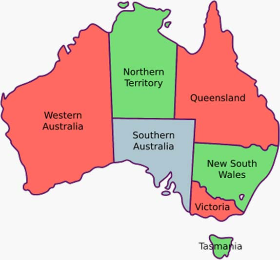

- [AI2 Note](#ai2-note)
  - [Maximum Likelihood](#maximum-likelihood)
    - [Introduction](#introduction)
    - [Maximum Likelihood](#maximum-likelihood-1)
    - [Solving Maximum Likelihood Estimator](#solving-maximum-likelihood-estimator)
      - [Gradient descent](#gradient-descent)
  - [Search and Constraint Satisfaction Problems](#search-and-constraint-satisfaction-problems)
    - [Search recap](#search-recap)
    - [Constraint Satisfaction Problems](#constraint-satisfaction-problems)
  - [Solving CSPs](#solving-csps)
      - [Solving CSPs by BFS](#solving-csps-by-bfs)
      - [Solving CSPs by DFS](#solving-csps-by-dfs)
      - [Backtracking Search](#backtracking-search)
        - [Filtering](#filtering)
        - [Ordering](#ordering)
        - [Example: Backtracking + Forward Checking + Ordering](#example-backtracking--forward-checking--ordering)
    - [Tree Search vs Local Search](#tree-search-vs-local-search)
      - [Local Search for CSPs](#local-search-for-csps)
    - [Summary: CSPs](#summary-csps)
    - [Question:](#question)
  - [Games](#games)
    - [Quiz](#quiz)


# AI2 Note

## Maximum Likelihood

### Introduction

- To describe or summarise the data, we can use **Descriptive Statistics**: a summary that quantitatively describe our data in hand, the data we currently have. The simplest method is called Univariate analysis
  - Central tendency: **expectation**(mean), median, mode, etc.
  - Dispersion: the range and quartiles of the dataset,
  - Spread: **variance** and standard deviation
  - Shape of the distribution: skewness and kurtosi

### Maximum Likelihood

- **Bernouli distribution**: P(B) = θ and P(W) = 1 - θ
$$L(θ|x) = \prod_{i=1}^{N} y_{j}\begin{cases}
  θ \qquad\quad if\ x_i = B\\
  1 - θ \quad if\ x_i= W\\
\end{cases}$$
- This probability is called **likelihood** function L, which is a function of θ, given the samples(observation) x.
- **Likelihood**(似然): The probability of observing your data given a particular model.

- Likelihood function: general definition
  - Let n Xn denoted compactly using a vector
  - **X** = (X<sub>1</sub>, X<sub>2</sub>...X<sub>n</sub>) be a random sample from a distribution with a parameter θ.  
    Suppose we have observed that X<sub>1</sub> = x<sub>1</sub> ..., denote a vector **x** = (x<sub>1</sub>,...), we can define the likelihood function as
    - If $X_i$'s are discrete:  
      $$ 
        L(θ|x)  = L(θ|x_1,x_2,...,x_n)\\
                = P_x(x;θ),
      $$  
      where $P_x(x;θ)$ is the PMF of X parametrised by θ
    - If $X_i$'s are continuous:  
      $$
        L(θ|x)  = L(θ|x_1,x_2,...,x_n)\\
                = f_x(x|θ),
      $$  
- Note: In general, θ can be a vector, $θ = (θ_1,θ_2,...,θ_k)$

    
  Figure: Likelihood function $L(θ|x),θ\in[0,1]$

- Note that the likelihood is not a probability function - the area under the likelihood curve **does not have to sum to one**

- Difference between the Probability and Likelihood
  - **Probability**: **a number** $p\in[0,1]$ between 0 to 1 to describe how likely and event is to occur, or how likely it is that a proposition is true, assuming we know the distribution of the data.
  - **Likelihood**: **a function** that measures the gooodness of fit of a statistical model to a sample of data for given values of the unknown parameters. It is a functin of the unknown parameters(e.g. θ)
  > So the fundamental difference between Probability and Likelihood is their aims.  
  > The aim of probability calculation is to find a number $p\in[0,1]$ between 0 to 1 to describe how likely an event is to occur, or how likely it is that a proposition is true, assuming we know the distribution of the data.   
  > The aim of Likelihood calculation is to find the best distribution of the data  

### Solving Maximum Likelihood Estimator

- **Maximum likelihood estimation**: Informally, based solely on the data, Maximum likelihood estimation searches the best parameters of a probability distribution that makes the data most likely
  - Changing the value of θ will change the value of the function L(θ|x)
  - The bigger the value, the better the model fit
  - This rudimental method only works for simple and low-dimensional problems

- Formally, Let $X = (X_1, X_2, X_3, ..., X_n)$ be a random sample from a distribution with a parameter θ. Supppose we have observed the values of X as $x = (x_1, x_2, x_3, ..., x_n)$, a maximum likelihood estimate of θ, denoted as $\hat{\theta}_{MLE}$ is a value of θ that maximises the likelihood function
  $$
    \hat{\theta}_{MLE} = \mathop{\arg\max}\limits_{\theta}L(θ|x)
  $$

> Maximum Likelihood Estimator(MLE):  
> A maximum likelihood estimator(MLE) of the parameter θ, denoted as $\hat{\theta}_{MLE}$ is a random variable $\hat{\theta}_{MLE} = \hat{\theta}_{MLE}(X)$ whose value when $X_1 = x_1$, $X_2 = x_2$, ...,$X_n = x_n$ is given by $\hat{\theta}_{MLE}$

- **Question**: Given the optimisation problem as formulated in $\hat{\theta}_{MLE} = \mathop{\arg\max}\limits_{\theta}L(θ|x)$, how to solve it
  - **Option 1**: Exhaustive serch -only works for low dimensional problems such as this
    - One naive way is to sweep all the values of parameters θ to find one that generate the maximum likelihood function, or to make the model mostly likely to generate the observation $x$
    - Grid search: usually used for tuning hyper-parameters of a machine learning model
    - For a grid search method, instead of evaluating all possible values of θ, which are spaced at samll intervals, then pick the value of θ that gives you the maximum likelihood.
  - *Option 2*: Optimization algorithms - a more general way to solve the problem

- Cost functions
  - **Cost function**: A function that maps a set of events into a number that represents the "cost" of theat event occurring. Also known as the loss function or objective function
  - Cost function for likelihood: a general one-to-one mapping with likelihood - the negative logarithm of the likelihood function:
    $$
      J(θ, D) = -log(L(θ|D))
    $$
  - **Question**: Why use the negative logarithm of the likelihood function as the cost function
    - **Convention**: By convention, many optimisation problems are minimisation problems
    - **Convenience**: Taking the logarithm changes multiplication to addition, i.e., log(AB) = log(A) + log(B), which is easier to differentiate
    - **Numerically stable**: Product of θ, which is a probability will converge quickly to zero, which might cause problems for computers who are limited by machine precision

  > The cost funciton is negative is because of convention. Many of these optimization techniques originated from physics, where the objective is to minimize the energy of a system. Therefore optimization will by default try to minimize functions.  
  > We take the logarithm of the likelihood is because it changes multiplication to addition, which makes the differentation easier  
  > Taking the logarithm also avoid problems caused by the limit of computer precision  
  > This is because if we use the product of the product of θ-s, of which each is a probability, i.e., the value is between 0 and 1, their product tend to converge quickly to zero
  > However, taking the logarithm changes the product to sums, which makes the numerical calculation more stable.  
  > This is very important if you are going to solve this maximum likelihood problem using a computer because the precision of that computer is limited, which does not distinguish a very small number from zero.

  
  > The point that was the maximum of the likelihood function is also the point that is the minimum of the cost function

- Introduction to optimisation
  - **Optimization**: finding the best solution from among the set of all feasible solutions
  - **Optimisation procedure:**
    - Constructing a Model
    - Determing the Problem Type
    - Selecting an optimisation algorithm
  > We need to first construct an mathematical model, usually by making some assumptions  
  > The second step is to determine the problem type, whether it is a discrete problem, a continuous problem or a mix-variable problem? Is it constrained or unconstrained? Is the model invloves uncertainty? etc.

- Machine learning => optimisation problems
  - **Supervised learning**: Given some training data, we want to train a machine learning model to explain the data. The training process is essentially a process of finding a optimal set of parameters of this model and the optimality is defined by an objective function
  - **Unsupervised learning**: Given some unlabelled samples, we aim to divide them into multiple clusters or groups, of which the samples in same group are as similar as possible but samples in different group are as different as possible.

- The First-Order Optimality Condition
  - **Optimisation**: For a funciton $g(w)$ of N dimensional independent variables $w\in{R^N}$, the optimisation problem is 
    $$
      \mathop{\arg\min}\limits_{\theta}g(w)
    $$
  - A $w^*$ is the local minimum if it satisfies
  - First-order necessary condition for optimality:
    $$
      \bigtriangledown_{w}g(w^*)=0_{N\times1}
    $$
  - The point which satisfy the condition is also called **stationary point**
    > Note: A stationary point can be minimum, maximum or a saddle point(a saddle point is also called a minimax point)
  - The equation of first-order necessary condition cna be written as a system of N first order equations:
    $$
      \frac{\partial}{\partial w_1} g(w^*) = 0 \\
      \frac{\partial}{\partial w_2} g(w^*) = 0 \\
      ... \\
      \frac{\partial}{\partial w_N} g(w^*) = 0
    $$
  - **Question**: can we solve this system of N first-order equations to identify the minimum points of the function g?
    - The answer is no. This is because, first of all, it is difficult or even impossible to solve such system algebraically for ’closed form’ solutions, esp. when the equations are non-linear.
    - Secondly, as we just learned, the condition is just a necessary condition, the solutions also include many other stationary points such as maxima and saddle points
    - Because of the above two reasons, we need some iterative methods to solve the such a system to identify minimum points.

#### Gradient descent

- **Gradient descent**: a first-order iterative optimization algorithm for finding a local minimum of a differentiable cost function.
- **Idea**: to employ the **negative gradient** at each step to decreases the cost function.
- **Two ingredients**: the negative gradient consists
  - a direction – determined by the gradient at the point
  - a magnitude, sometimes called step size
- **Intuition**: start at any value of parameter θ, then change θ in the direction that decreases the cost function, and keep repeating until there is only the tiniest decrease in cost with each step.
- Formally, we define the negative gradient of a cost function $J(θ)$ as
  $$
    -\bigtriangledown_{\theta}J = - \frac{dJ(\theta)}{d\theta}
  $$
- then we need to choose a magnitude or step size parameter η (also called the learning rate) so that the update equation becomes:
  $$
     θ(t + 1) = θ(t) − η\bigtriangledown_{θ}J(θ(t)) = θ(t) − η\frac{dJ(θ(t))}{dθ}
  $$

- **Pseudo-code of gradient descent:**
  - **Initialisation**: Start at any value of parameter θ
    - **repeat**
      - change the parameter θ in the direction that decreases the cost function J(θ)
    - **until** the decrease in cost with each step is very small
  - **end**

## Search and Constraint Satisfaction Problems

- What is Search?
  - Search is not about prediction but about choice and decision-making, such as plainning and assigning  
    搜索不是关于预测，而是关于选择和决策，比如计划和分配
  - Search techniques are universal problem-solving methods  
    搜索技术是解决问题的通用方法。
  - Examples of search: path-finding(Google map), taking next move in games(AlphaGo), and task assigning(Uber taxi)

> Search is the process of navigating from a start state to a goal state by transitioning through intermediate states  
> 搜索是通过转换到中间状态，从起始状态导航到目标状态的过程

### Search recap

- Search Problems
  - Search is the process of navigating from a start state to a goal state by transitioning through intermediate states  
    搜索是通过转换到中间状态，从起始状态导航到目标状态的过程
  - A search problem consists of
    - **State space**: all possible states
    - **Start state**: where the agent begins the search
    - **Goal state**: the desired state that the agent is looking for
    - **Goal test**: whether the goal state is achieved or not
    - **A successor function**(also called transition function, often associated with a cost): given a certain state, what actions are available and for those actions what are the next stage the agent will land into
  - A **solution** is a sequnce of actions which transforms the start state to a goal state

- State Space Graph and Search Tree
  - **State spce graph**: a mathematical representation of a search problem
    - Nodes represent states
    - Arcs represent successor functions  
    
  - **A search tree**: the process of solving the search problem can be abstracted as a search tree.
    - The start state is the root node
    - Children correspond to successors
    - Nodes show states, but correspond to plans that achieve those states  
    

- Generic tree search
  ```
  function Tree-Search(problem, strategy) return a solution, or failure
    initialise the search tree via setting Frontier to be the start state of problem
    loop do
      if there are no nodes in Frontier for expansion then return failure
      else choose a node in Frontier for expansion according to strategy and remove it from Frontier
      if the chosen node is a goal state then return the corresponding solution
      else expand the node based on problem and add the resulting nodes to frontier
    end
  ```
  - Important things:
    - **Frontier**: to store the nodes waiting for expansion.
    - **Expansion**: to find and display the children of the node
    - **Expansion strategy**: to decide which node in Frontier to expand, also called to explore.

- Depth-First Search(DFS)
  - The number inside a node represent the order in which the node is expanded (tie is broken from left to right)

- Breadth-First Search(BFS)
  - The number inside a node represent the order in which the node is expanded (tie is broken from left to right)

### Constraint Satisfaction Problems

- Another type of search problems: Identification
  - All the above cases are about planning, which is only one type of search problems.
  - Planning: a sequence of actions
    - We care about the path to the goal
  - Identification: an assignment
    - We care about the goal itself, not the path
    - For example, a taxi firm assigns taxis a, b, c to customers x, y, z such that the cost incurred is minimal  
  

- Search ‐> Identification ‐> CSP
  - **Constraint Satisfaction Problems (CSPs)**: Identification problems have constraints to be satisfied; there is no preference in CSPs.
  - Constraint refer to hard constraints which a legal solution cannot violate.
  - Preferences sometimes are refered to as soft constraints(or objectives), where we need to optimise

- CSPs
  - A constraint satisfaction problem consists of
    - **A set of variables**
    - **A domain for each variable**
    - **A set of constraints**
  - In a CSP, an assignment is **complete** if every variable has a value, otherwise it is **partial**
  - **Solutions** are complete assignments satisfying all the constraints
  - Example: Module scheduling problem
    - **Variables** - Modules: AI1, Data Structure, Software Engineering, OOP, AI2, Neural Computation
    - **Domain** - year-term: {1-1, 1-2, 2-1, 2-2, 3-1, 3-2}
    - **Constraints** - pre-requisites: {AI1 < AI2, OOP < SE...}
    - **Solutions** - e.g. : (AI1 = 1-2, OOP = 1-1, AI2 = 2-2, SE=2-1...)

- Standard Search Problems vs CSPs
  - Standard Search problems
    - State is a "black-box": arbitrary data structure
    - Goal test can be any function over states
  - Constraint Satisfaction Problems(CSPs)
    - State is defined by **variables** $X_1,X_2,...$ with values from **domains** $D_1,D_2,...$
    - Goal test is a set of **constraints** specifying allowable combinations of values of variables.
    - An example of a formal representation language, in which many search algorithms
    - This allows useful general-purpose algorithms with more power than standard search algorithms.
  > - **Example**: Map Colouring
  >   - **Problem**: Map colouring problem is to paint a map is such a way that none of adjacent regions can have the same colour
  >   
  >     
  >     - **Variables**: WA, NT, Q, NSW, V, SA, T
  >     - **Domain**: D = {red, green, blue}
  >     - **Constraints**: adjacent regions must have different colours
  >       - WA ≠ NT, WA ≠ SA, NT ≠ SA, NT ≠ Q, ...
  >     - **Solutions**: {WA = red, NT = green, Q = red, NSW = green, V = red, SA = blue, T = green}  
  >     

- Constraint Graphs
  - Constraint graphs are used to represent relations among constraints in CSPs, where nodes correspond to the variables and arcs reflect the constraints  
  

  > - **Example**: Sudoku
  >   - **Problem**: Sudoku is to fill a 9×9 grid with digits so that each column, each row, and each of the regions contain all of the digits from 1 to 9  
  >   
  >     - **Variables**: each open cell
  >     - **Domain**: D = {1,2,3,…,9}
  >     - **Constraints**:
  >       - Each row contains different numbers
  >       - Each column contains different numbers
  >       - Each region contains different numbers

- When a constraint relates to more than two variables
  - Use a square to represent a constraint.
  - The square connects all the variables involved in that constraint

  > - **Example**: Minesweeper
  >   - **Variables**: All squares to be uncovered $X_1, X_2,...$
  >   - **Domain**:D = {0, 1} , where 0 denotes not a mine and 1 denotes a mine
  >   - **Constraint description**: The number on a square is the sum of its neighbour’s values.  
  > 
  > $X_1 = 1$  
  > $X_1 + X_2 = 1$  
  > ...

  > - **Example**: N‐Queens
  >   - **Problem**: N‐queens puzzle is the problem of placing N chess queens on an N×N chessboard so that no two queens threaten each other.
  >   - **Variables**: ܺ $X_{ij}$ , where $i$ is the $i$th row and $j$ is the $j$th column
  >   - **Domain**: D = {0, 1}, where 1 means having a queen
  >   - **Constraints**:
  >     - One queen each row:
  >       $$
  >         \forall i, j, k \in\{1,2, \ldots, N\}, j \neq k:\left(X_{i j}, X_{i k}\right) \in\{(0,0),(0,1),(1,0)\}
  >       $$
  >     - One queen each column:
  >       $$
  >       \forall i, j, k \in\{1,2, \ldots, N\}, j \neq k:\left(X_{j i}, X_{k i}\right) \in\{(0,0),(0,1),(1,0)\}
  >       $$
  >     - One queen each diagonal:
  >       $$
  >       \begin{gathered}
  >       \forall i, j, k \in\{1,2, \ldots, N\}, i+k \leq N, j+k \leq N: \\
  >       \left(X_{i j}, X_{i+k, j+k}\right) \in\{(0,0),(0,1),(1,0)\} \\
  >       \forall i, j, k \in\{1,2, \ldots, N\}, i+k \leq N, j-k \geq 1: \\
  >       \left(X_{i j}, X_{i+k, j-k}\right) \in\{(0,0),(0,1),(1,0)\}
  >       \end{gathered}
  >       $$
  >     - Must have $N$ queens in total: $\sum_{i, j \in\{1,2, \ldots, N\}} X_{i j}=N$

- Variety of CSPs
  - Variables
    - *Finite* domains (discrete), e.g. all the preceding examples.
    - *Infinite* domains (discrete or continuous), e.g., variables involving time
  - Constraints
    - Unary, binary and high‐order constraints
  - CSPs are difficult search problems
    - If a CSP has ݊ variables, the size of each domain is ݀$d$, then there are $O(d^n)$	complete assignments
    - For the preceding representation of the 4 × 4 queens puzzle, there are $2^{16}$ complete assignments.

- Real‐world CSPs
  - Assignment problems, e.g. who teaches which class
  - Timetabling problems, e.g. which class is offered when and where
  - Hardware configuration
  - Transportation scheduling
  - Factory scheduling
  - Circuit layout
  - Fault diagnosis
  - ...
  > Many of CSP problems can also consider the preferences (i.e., objectives), in which case they turn into constrained optimisation problems.

## Solving CSPs

> - Cryptarithmetic is a puzzle where the digits of numbers are represented by letters. Each letter represents a unique digit. The goal is to find the digits such that a given equation is verified
>   - **Variables**:
>     - T,W,O,F,U,R
>     - X1,X2,X3(they are the carries in the tenths, hundredths and thousandths places, respectively)
>   - **Domain**:
>     - T,W,O,F,U,R $\in\{0,1,2,3,4,5,6,7,8,9\}$
>     - X1,X2,X3 $\in\{0,1\}$
>   - **Constraints**:
>     - alldiff(T,W,O,F,U,R)
>     - O + O = R + 10 · X1
>     - W + W + X1 = U + 10 · X2
>     - T + T + X2 = O + 10 · X3
>     - X3 = F
>     - T，F ≠ 0  
>   

- Generate and Test
  - The exhaustive generate-and-test algorithm is to generate all the complete assignments, then test them in turn, and return the first one that satisfies all of the constrains
  - It needs to store all $d^n$ complete assignments, where $d$ is the domain size and is the number of variables.

- Solving CSPs by standard search formulation
  - In CSPs, states defined by the values assigned so far(partial assignments)
    - Initial state: the empty assignment{}
    - Successor function: asssign a value to an unassigned variable
    - Goal test: if the current assignment is complete and satisfies all the constraints

#### Solving CSPs by BFS
- Example: There are three variables A,B,and C, all with domain{0,1,2}. The constraint is A + B + C = 1
- Since the solution are always in the bottom layer, BFS needs to traverse all the nodes(partial assignments)  
  

#### Solving CSPs by DFS
- Example: There are three variables A, B, and C, all with domain{0,1,2}. The constraint is A+B+C=1
- Sounds a good idea, but what if the constraint is A>B>C?  
  

#### Backtracking Search  

> - Backtracking is a DFS method wtih two additional things:
>   1. Check constraints as you go
>   2. COnsider one variable at a layer
- Example: there are three variables A, B, and C, all with domain{0,1,2}. The constraint is A < B < C
- **Check constraints as you go**
  - i.e., consider only values which do not conflict previous assignments
  - may hvae to do some computation to check the constraints
  - "incremental goal test"
- **Consider one variable at a layer**
  - Variable assignments are commutative, so fix ordering  


- Improving Backtracking
  - General-purpose ideas give huge gain in speed
  - Two ideas:
    - **Filtering**: Can we detect inevitable failure early
    - **Ordering**: Which variable should be assigned next

##### Filtering

- Keep track of domains for unassigned variables and cross off bad options
- There are different methods. Forward Checking is one of them
- **Forward Checking**: cross off values that violate a constraint when added to the existing assignment. That is, when assign a variable, cross off anything that is now violated on all its neighbours' domains
  - Example: There are three variables A,B,and C, all with domain{0,1,2}. The constraint is B>A>C
  - When A is assigned 0, domains of itsneighbours B and C are reduced, so it is quick to know that this assignment is not legal(as C is empty now)  
  

##### Ordering

- Consider minimum remaining values, i.e.,choose the variable with the fewest legal values left in its domain
- Example: There are three variabels A,B,and C, all with domain{0,1,2}. The constraint is A ≤ B < C
- Once A is assigned 0, after forward checking C will be assigned since its domain is samller than B's domain
- Also called "most constrained variable" or "fail-fast" ordering  


##### Example: Backtracking + Forward Checking + Ordering

- Example: There are three variables A,B,C, all with domain{0,1,2}. The constraints: A ≤ B< C and A + B + C = 3. Tie is broken alphabetically/numerically  
  

- Minesweeper
  - **Variables**:
    - $X_1,X_2,X_3,X_4$
  - **Domain**:
    - D = {0,1}, where 0 denotes not a mine and 1 denotes a mine
  - **Constraints**
    - $X_1 = 1$
    - $X_1 + X_2 = 1$
    - $X_1 + X_2 + x_3 + X_4 = 3$
    - $X_4 = 1$
    - ...
  - Based on the forward checking and ordering, the order of variables to be visited is (tie is broken numerically):  
    $X_1\rArr X_2\rArr X_4 \rArr X_3$

### Tree Search vs Local Search

- Tree Search methods: systematically search the spce of assignments
  - Start with an empty assignment
  - Assign a value to an unassigned variable and deal with constraints on the way until a solution is found

- But what if the space is too big and even infinite, so in any resonable time, systematic search may fail to consider enough of the space to give any meaningful result

- Local Search method: not systematically search the space but design to find solutions quickly on average
  - Start with an(arbitrary) complete assignment, so constraints can be violated
  - Try to improve the assignment iteratively

#### Local Search for CSPs

- Example: There are three variables A,B,C, all with domain {0,1,2}. The constraints: A ≤ B < C  
  
- A typical local search algorithm(i.e. hill climbing for CSPs): Randomly generate a complete assignment  
  While stop criterion not met
  - Step 1: Variable selection - randomly select a constraint-violeted variable
  - Step 2: Value selection(min-conflict heuristic) - choose a value that violates the fewest constraints

- Example: N-Queens
  - Problem: N-queens puzzle is the problem of placing N chess queens on an NxN chessboard so that no two queens threaten each other  
    
    - Formulation - Variables: Q1, Q2, Q3, Q4; Domains: {1,2,3,4}; Constraints: $\forall i,j$, not-threatening(Qi, and Qj)
    - Randomly generate a complete assignment
    - Assume we first consider Q3, then Q3 going to column 4 has fewest constraints violated;
    - Assume then we consider Q1, then Q1 going to column 3 has fewest constraints violated;
    - Assume next we consider Q4, then Q4 going to column 2 has fewest constraints violated;
    - Stop execution and return the solution.

- Can Local Search always guarantee finding a solution
  - Local search may get stuck in somewhere based on the problem's landscape and search strategy  
  
  > Strategy like "fixing the queen on the top before fixing the others" can lead to a never-ending search
  - But it is effective in practice: can solve the million-queens problem in an average of 50 steps

### Summary: CSPs

- CSPs are a special class of search problems
  - States are partial assignment
  - Goal test defined by constraints
- Basic **strategy**: Backtracking
- **Speed-ups**
  - Filtering: forward checking
  - Ordering
- **Local search**: not systematically search the space, start with a (bad) complete assignment and improve it iteratively
  - Not only apply to CSPs, but to various optimisation problems

- Optimisation
  - Optimisation problem: **search problem** with **preferences**, i.e. objective funciton(s)
  - They consist of **variables, domains, objective function**(s)
    - Objectives:
      - **Single-objective optimisation problems**, e.g., Travelling Salesman Problem(TSP): minimising the cost of the travelling
      - **Multi-objective optimisation problems**, e.g., TSP with and additional objective: minimising the time of the travelling
    - Constraints:
      - **Unconstrained optimisation problems**
      - **Constrained optimisation problems**
  - Tree search methods may not work for optimisation problems, e.g. in some continuous search space
  - Local search methods can be effective for optimisation problems

- Local Search for Optimisation  
  
  - Generally fast and memory efficient
  - Can deal with problems where the search state is difficult to represent/formulate
  - Can be used in an online setting when the problem changes, e.g., in airline scheduling problem

- Local search methods
  - Hill climbing, e.g. gradient descent
  - Simulated annealing, tabu search(keep a small list of recently visited solutions and forbid the algorithm to return to those solutions)
  - Population-based local search: evolutionary computation(e.g., genetic algorithms)  
  

### Question:

- Here is a Graph Coloring Problem (GCP). Your task is to paint all nodes with different colors.  Each node can be painted with any of the three colors (purple, red, and green).  Every two nodes connected by arcs can not be painted with the same color.  
  Can you solve this problem by the Backtracking Search and the Backtracking Search with Forward Checking and Ordering respectively?  
  The tie of nodes is broken first from left to right and then from bottom to top, and the tie of colors is broken from purple to red to green.   
  

## Games

- Formalisation
  - States: S (Start State $s_0$)
  - Actions: A(may depend on player/state)
  - Transition function: $S \times A \rArr S$
  - Terminal test: $S \rArr (ture, false)$
  - Players: P = (1,...,N) (usually take turns)
  - Utilities: $S_{terminal} \times P \rArr R(values on outcomes)$
    - A utility function(also called an objective function or payoff function)defines the final numeric value for a game that ends in terminal state s for a player p.
 > We want algorithms to find a strategy(Policy) which recommends an move for each state, i.e. S -> A

- Value of State
  - The best achievable outcome(utility) from that state

- Minimax
  - Minimax value of a node is the utility of the terminal state to which both players play optimally from that node
  - So the process of a two-player game is that one player(called player Max) is to maximise its utility whereas its opponent(called player Min)is to minimise the utility of Max
  - For a state s, its minimax value minimax(s) is  
    $$
      \begin{cases}
        utility(s),  & \text{if s is a terminal state}\\
        max_{s' \in {successor(s)}}  (minimax(s')), & \text{if player is Max}\\
        min_{s' \in {successor(s)}}  (minimax(s')), & \text{if player is Min}\\
      \end{cases}
    $$

- Adversarial Search(Minimax)
  - Deterministic, zero-sum games
    - Tic-tac-toe, chess, go
    - One player maximises result and the other minimises result
  - Minimax search
    - A state-space search tree
    - Players alternate turns
    - Compute each node's minimax value, i.e. the best achievable utility against an optimal adversary

- Implementing Minimax  
  ```
  function minimax_value(state) return its minimax value
    if state is a terminal state
      return its utility
    if state is for agent Max to take an action
      return max_value(state)
    if state is for agent Min to take an action
      return min_value(state)
  ```
  ```
  function max_value(state) return its minimax value v
    initialise v = -∞
    for each successor of state
      v = max(v, minimax_value(successor))
    return v
  ```
  ```
  function min_value(state) return its minimax value v
    initialise v = + ∞
    for each successor of state
      v = min(v, minimax_value(successor))
    return v
  ```

- Computational Complexity of Minimax
  - How efficient is minimax
    - DFS(exhaustive)
    - Time: $O(b^m)$, b is branching factor, m is maximum depth of the tree
    - Space: $O(bm)$
  - Example
    - Chess: b = 35, m = 100
    - Go: b = 250, m = 150
  > Solving them is completely infeasible in most cases, but do we need to explore the entire tree to find the minimax value?

- Alpha-Beta Pruning
  - General configuration(for agent Max)
    - Let a be the value that Max can currently get at least
    - We are now computing the min_value at some node n
    - When we explore n's children, if we find that the value of n will never be better than a (for agent Max), then we can stop considering n's other children
  - Properties of alpha-beta pruning
    - The pruning has no effect on minimax value for the root
    - Good child ordering improves effectiveness of pruning
    - Complexity of perfect ordering: $O(b^{m/2})$
    - Full search of many games is still hopeless

### Quiz

- Question 1: Give the minimax value at each node for the game tree below.
- Question 2: Find the nodes of the following tree pruned by alpha-beta pruning algorithm. Assuming child nodes are visited from left to right. There are five layers and you can use L𝑚-𝑛 to denote the 𝑛th node from left to right in the layer 𝑚, e.g., the first node (with value 10) at the bottom layer can be denoted by L5-1.  
  
