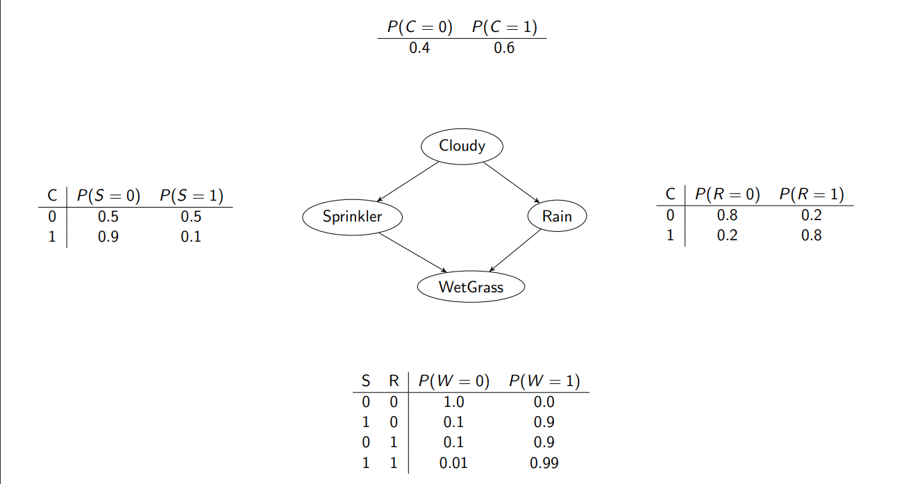
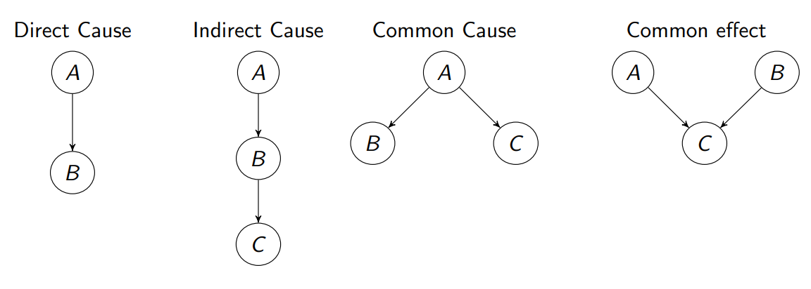

# AI2 Review

> 1,2,3,4,7,8,9 weeks

## Week 1 Lecture 2:

1. Concepts of likelihood， page 5

    - **Bernouli distribution**: P(B) = θ and P(W) = 1 - θ
    $$L(θ|x) = \prod_{i=1}^{N} y_{j}\begin{cases}
      θ \qquad\quad if\ x_i = B\\
      1 - θ \quad if\ x_i= W\\
    \end{cases}$$
    - This probability is called **likelihood** function L, which is a function of θ, given the samples(observation) x.
    - **Likelihood**(似然): The probability of observing your data given a particular model. 给定特定模型观察数据的概率。
    - Likelihood function: general definition
      - a Likelihood function measures the goodness of fit of the function and the observation by holding the observation x constant and varying θ
      - Let Xn denoted compactly using a vector
      - **X** = (X1, X2...Xn) be a random sample from a distribution with a parameter θ.  
        Suppose we have observed that X1 = x1 ..., denote a vector **x** = (x1,...), we can define the likelihood  function as
        - If $X_i$'s are discrete:  
          $$ 
            L(θ|x)  = L(θ|x_1,x_2,...,x_n)\\
                    = P_x(x;θ),
          $$  
          where $P_x(x;θ)$ is the PMF of X parametrised by θ
        - If $X_i$'s are continuous:  
          $$
            L(θ|x)  = L(θ|x_1,x_2,...,x_n)\\
                    = f_x(x|θ),
          $$  
      - Note: In general, θ can be a vector, $θ = (θ_1,θ_2,...,θ_k)$

      
      Figure: Likelihood function $L(θ|x),θ\in[0,1]$

    - Note that the likelihood is not a probability function - the area under the likelihood curve **does not have to sum to one**

    - Difference between the Probability and Likelihood
       - **Probability**: **a number** $p\in[0,1]$ between 0 to 1 to describe how likely and event is to occur, or how likely it is that a proposition is true, assuming we know the distribution of the data.
       - **Likelihood**: **a function** that measures the gooodness of fit of a statistical model to a sample of data for given values of the unknown parameters. It is a functin of the unknown parameters(e.g. θ)
            > So the fundamental difference between Probability and Likelihood is their aims.  
            > - The aim of probability calculation is to find a number $p\in[0,1]$ between 0 to 1 to describe how likely an event is to occur, or how likely it is that a proposition is true, assuming we know the distribution of the data.   
            > - The aim of Likelihood calculation is to find the best distribution of the data  

2. Maximum likelihood estimator, the meaning of equation 5, page 9

    - **Maximum likelihood estimation**: Informally, based solely on the data, Maximum likelihood estimation searches the best parameters of a probability distribution that makes the data most likely
        - Changing the value of θ will change the value of the function L(θ|x)
        - The bigger the value, the better the model fit
        - This rudimental method only works for simple and low-dimensional problems

    - Formally, Let $X = (X_1, X_2, X_3, ..., X_n)$ be a random sample from a distribution with a parameter θ. Supppose we have observed the values of X as $x = (x_1, x_2, x_3, ..., x_n)$, a maximum likelihood estimate of θ, denoted as $\hat{\theta}_{MLE}$ is a value of θ that maximises the likelihood function
        $$
          \hat{\theta}_{MLE} = \mathop{\arg\max}\limits_{\theta}L(θ|x)
        $$
        > Maximum Likelihood Estimator(MLE):  
        > A maximum likelihood estimator(MLE) of the parameter θ, denoted as $\hat{\theta}_{MLE}$ is a random variable $\hat{\theta}_{MLE} = \hat{\theta}_{MLE}(X)$ whose value when $X_1 = x_1$, $X_2 = x_2$, ...,$X_n = x_n$ is given by $\hat{\theta}_{MLE}$

    > 
    > Given the optimisation problem as formulated in $\hat{\theta}_{MLE} = \mathop{\arg\max}\limits_{\theta}L(θ|x)$, how to solve it
    >   - **Option 1**: Exhaustive serch -only works for low dimensional problems such as this
    >       - One naive way is to sweep all the values of parameters θ to find one that generate the maximum likelihood function, or to make the model mostly likely to generate the observation $x$
    >       - Grid search: usually used for tuning hyper-parameters of a machine learning model
    >       - For a grid search method, instead of evaluating all possible values of θ, which are spaced at samll intervals, then pick the value of θ that gives you the maximum likelihood.
    >   - **Option 2**: Optimization algorithms - a more general way to solve the problem
  
3. Cost function of Maximum likelihood estimator, page 11

    - Cost functions
      - **Cost function**: A function that maps a set of events into a number that represents the "cost" of theat event occurring. Also known as the loss function or objective function
      - Cost function for likelihood: a general one-to-one mapping with likelihood - the negative logarithm of the likelihood function:
        $$
          J(θ, D) = -log(L(θ|D))
        $$
        
      > The point that was the maximum of the likelihood function is also the point that is the minimum of the cost function

4. Why we use the negative logarithm of the likelihood function, page 12 

    > - **Question**: Why use the negative logarithm of the likelihood function as the cost function
    >   - **Convention**: By convention, many optimisation problems are minimisation problems
    >   - **Convenience**: Taking the logarithm changes multiplication to addition, i.e., log(AB) = log(A) + log(B), which is easier to differentiate
    >   - **Numerically stable**: Product of θ, which is a probability will converge quickly to zero, which might cause problems for computers who are limited by machine precision
      ---
    > - The cost funciton is **negative** is because of convention. Many of these optimization techniques originated from physics, where the objective is to minimize the energy of a system. Therefore optimization will by default try to minimize functions.  
    > - We take the **logarithm** of the likelihood is because it changes multiplication to addition, which makes the differentation easier  
    >     - Taking the logarithm also avoid problems caused by the limit of computer precision  
    >     - This is because if we use the product of the product of θ-s, of which each is a probability, i.e., the value is between 0 and 1, their product tend to converge quickly to zero
    >     - However, taking the logarithm changes the product to sums, which makes the numerical calculation more stable.  

## Week 7 Lecture 1
1. Concepts of odds and logit, page 7
    - **Probability**: a number p ∈ [0, 1] between 0 to 1 to describe how likely an event is to occur, or how likely it is that a proposition is true.
    - **Odds**: A number to describe to the probability of a binary outcome, which either present or absent, e.g., mortality. Specifically, the odds are the ratio of the probability that an outcome present, i.e., p to the probability that the outcome absent, i.e., 1 − p
        $$
          odds = \frac{p}{1-p}
        $$
      - **Logit(aka. log-odds)**: the logarithm of the odds:
        $$
          logit(p) = \log(\frac{p}{1-p})=\log(p)-\log(1-p)=-\log(\frac{1}{p}-1)
        $$

    > - Example
    >   - Q1: What is the **probability**(sometimes called risk) of drawing a card randomly from the deck and getting spades?
    >     - A1: the probability (sometimes called risk) of drawing a card randomly from the deck and getting spades is 13/52 = 0.25.
    >   - Q2: What is the **odds** of drawing a spade?
    >     - A2: Since the probability of not drawing a spade is 1 - 0.25, so the odds is 0.25/0.75 or 1:3 (or 0.33 or 1/3 pronounced 1 to 3 odds).

2. Main assumptions of logistic regression, page 9
    - Main assumptions of Logistic Regression
      - Binary outcomes
      - Independent observations: observations are independent of each other. In other words, the observations should not come from repeated measurements or matched data.
      - Low or no multicollinearity among the independent variables: the independent variables are not too highly correlated with each other.
      - Linearity of independent variables and log odds. Note: this does not mean logistic regression assumes the dependent and independent variables are related linearly
      - A large sample size.
        - **Rule of ten**: to fit a logistic regression model, we need at least 10 cases with the least frequent outcome for each independent variable in your model. For example, if you have 5 independent variables and the expected probability of your least frequent outcome is .10, then you would need a minimum sample size of 10*5 / .10 = 500.
    ---
    - Main assumptions of Logistic Regression
      - How: use the logarithm of the odds (called logit or log-odds) to models the binary prediction (dependent variable) as a linear combination of independent variables.
      - Details: Given n independent variables x1 to xn, and one dependent variable Y which is a random variable that follow Bernoulli distributin (binary) which is denoted as p = P(Y = 1). The logistic model can be formally defined as:
        $$
          logit = \log(\frac{p}{1-p}) = \theta_0 + \theta_1x_1 + \theta_2x_2\dots+\theta_nx_n
        $$
    
    > - Linear Regression
    >   - Linear Regression (function approximation): approximating an underlying linear function from a set of noisy data
    >   - Problem definition: we have N observations, i.e., {$(x_i, y_i)$}, i = 1, · · · , N, where
    >     - $x_i$: independent variables, also called regressor which is a K dimensional vector $x_i \in \R^K$, and $x_i = [x_{i1} \space x_{i2} \space \dots x_{iK}]$, e.g., hours spent
    >     - $y_i$: dependent variable,  e.g., math score, which is a scalar $y_i \in \R^1$
    >   - Aim: To approximate a linear regression model to predict the dependent variable
    >     $$
    >       \widehat{y}_i = \theta_0 + \sum\limits_{k=1}^{K}\theta_kx_{ik} + \epsilon_i, i = \sum\limits_{k=1}^{K}\theta_kx_{ik} + \epsilon_i = \theta^Tx_i + \epsilon_i
    >     $$
    >     where $\theta_0$ is the interception and $\theta_k$ is the weight of the kth dimensional data, $\epsilon_i$ is the disturbance term or error variable  
    >     where $\theta$ is a vector $\theta$ = $[\theta_0 \space \theta_1 \dots \space \theta_K]^T$, $x_i = [1 \space x_{i1} \dots x_{iK}]$
    >     - Logistic regression: for each pair of train samples, we aim to learn a function of the form:
    >       $$
    >         P(y_i = 1|x_i) = \frac{1}{1 + \exp(-\theta^Tx_i)}, i = 1,2,\dots, N
    >       $$
    >       and
    >       $$
    >         P(y_i = 0 | x_i) = 1 - P(y_i = 1| x_i)
    >       $$
    >       we define $\sigma(x_i) = \frac{1}{1+\exp(-\theta^Tx_i)}$ as the "logistic" or "sigmoid" function  
    >       
    >     
    ---
    > - Maximum Likelihood Estimation of Logistic Regression
    >     **Derivation**: write equation 1 as a generalized linear model function parametrised by θ  
    >     $$
    >       h_\theta(x) = P(Y = 1|X;\theta) = \frac{1}{1 + exp(-\theta^TX)}
    >     $$
    >     and
    >     $$
    >       P(Y = 0| X; \theta) = 1 - h_\theta(X)
    >     $$
    >     From Bernoulli distribution, we have
    >     $$
    >       P(y | X;\theta) = Bernoulli(h_\theta(X)) = h_\theta(X)^y(1-h_\theta(X))^{1-y}
    >     $$
    >     Now we can define the likelihood function
    >     $$
    >     \begin{align}
    >       L(\theta|y;x) &= P(Y|X;\theta)  \\
    >                     &= \prod\limits_iP(y_i | x_i;\theta)\\
    >                     &= \prod\limits_ih_\theta(x_i)^(y_i)(1 - h_\theta(x_i))^(1-y_i)
    >     \end{align}
    >     $$
    >     We then use the negative logarithm of the likelihood function as the cost function, i.e., $− log(L(θ | y; x)):$
    >     $$
    >       -\log(L(\theta|y;x)) = \sum\limits_{i=1}^N[y_i\log(h_\theta(x_i)) + (1-y_i)\log(1-h_\theta(x_i))]
    >     $$
    >     Finally minimise it to obtain $\widehat{\theta}_{MLE} = \argmin_\theta-\log(L(\theta|y;x))$

## Week 7 Lecture 2: Introduction to Information Theory 
1. Concept of self-information, page 9

   - **Self Information**: Given a random variable X with probability mass function $P_x(x)$, the self-information of measuring X as outcome x is defined as
      $$
        I_x(x) = -\log_b[P_x(x)] = \log_b\frac{1}{P_x(x)}
      $$
      where different based of the logarithm b result in different units:
      - b = 2: bits
      - b = e: called "natural units" or "nat"
      - b = 10 called "dits", "bans", or "hartleys"

2. Concept of entropy, page 11

   - **Entropy**: quantifies “the uncertainty in a random variable X”. More formally, given a discrete random variable 2 X with range $R_X = {x_1, . . . , x_n}$, and its probability mass function as $P_X (x)$, the entropy of X is formally defined as:
    $$
      \begin{align}
        H(X)  &\equiv E[I_X(x)] \equiv - \sum\limits_i^nP(X = x_i)\log_bP(x = x_i)\\
              &\equiv E[\log_b\frac{1}{P_X(x)}]\equiv-E[\log_bP_X(x)]\\
      \end{align}
    $$

Week 8 Lecture 1:  Information Theory II -- Measures for more variables
1. Joint entropy, page 4 

  - **Joint entropy**: “A measure of the uncertainty associated with a set of variables.”. For two discrete random variables X and Y , the joint entropy is defined as:
    $$
      H(X, Y) = -E[\log p(X,Y)] = - \sum\limits_{x_i\in R_X}\sum\limits_{y_j\in R_Y}p(x_i,y_j)\log p(x_i, y_j)
    $$ 

2. Chain rule for conditional entropy, page 8

  - **Conditional entropy**: “Quantifies uncertainty of the outcome of a random variable Y given the outcome of another random variable X.”, which is defined as
    $$
      H(Y|X) \equiv -E[\log p(Y|X)]=-\sum\limits_{x_i\in R_X}\sum\limits_{y_j\in R_Y}p(x_i,y_j)\log p(y_j|x_i)
    $$

  - **Chain Rule**: 
    $$
      H(X,Y) = H(X) + H(Y|X) = H(Y) + H(X|Y)
    $$

  > - **Relative entropy** or **Kullback-Leibler divergence**: “quantifies the distance between two probability distributions”
  >   $$
  >     D_{KL}(P||Q) = \sum\limits_{x\in R_X} P(x)\log\frac{P(x)}{Q(x)}=E[\log\frac{P(x)}{Q(x)}]
  >   $$

3. Mutual information and entropy, pages 15-16

  - **Mutual information**: “measures the information that X and Y share”
    $$
      I(X;Y) \equiv H(X,Y) - H(Y|X) - H(X|Y)
    $$

4. Exercise question: 18 (model answers)

  -略

## Week 8 Lecture 2:  Information Theory II --  Applications of Information Theory to Machine Learning

1. Information gain is mutual information, page 19
  - **Information gain**: the information we can gain after spiting the samples based on a independent variable (internal node)

  - **Gini Index**: Give a training dataset of J classes, it is defined as  
    $$
      I_G(P) = 1 -\sum\limits_{i=1}^Jp_i^2
    $$
    where pi is the fraction of items labeled with class i in the dataset

2. Mutual information feature selection, page 21

  - **Mutual Information feature selection**: Use mutual information to choose a optimal set of independent variables, called features that allow us to classify samples. Formally, given an initial set F with n independent variables, $X = \{X_1, X_2 . . . , X_n\}$, find subset with S ⊂ F features that maximises the Mutual Information $I(Y ; S)$ between the dependent variable Y (label), and the subset of selected features S.

  > Mutual information feature selection
  > $$
  > \begin{align*}
  >   &\text{Initialisation: Set } F \leftarrow X \text{ and } S \leftarrow ∅ \\
  >   &\quad f_{\max} = \argmax_{X_i \in X} I(Y; X_i) \\
  >   &\quad \text{Set } F \leftarrow F \ \{f_{\max}\} \text{ and } S \leftarrow f_{\max} \\
  >   &\quad \text{Repeat until } |S| = K: \\
  >   &\quad \quad f_{\max} = \argmax_{X_i \in F}I(Y; X_i) - \beta\sum_{X_s\in S} I(X_s; X_i) \\
  >   &\quad \quad \text{set } F \leftarrow F \ \{f_{\max}\} \text{ and } S \leftarrow f_{\max}\\
  >   &\quad \text{End}\\
  >   &\text{End}
  > \end{align*}
  > $$

## Week 9 Lecture 1:  Bayes theorem revisit
1. Example, pages 6-8, 10, 12, 16.
  - **Bayes’ theorem for Probability Distributions**: Given two random variables, X and Θ
    $$
      p(\Theta|x) = \frac{p(x|\Theta)p(\Theta)}{p(x)}
    $$
    where p(Θ|x) is called posterior distribution,  
    p(x|Θ) is the likelihood function,  
    p(Θ) is called the prior,  
    x is a value of X and x ∈ RX ,  
    and p(x) is a scalar, called marginal likelihood.  
    In plain English:
    $$
      \text{posterior distribution} = \frac{\text{likelihood function} \times \text{prior distribution}}{\text{marginal likelihood}}
    $$

## Week 9 Lecture 2:  Bayesian networks
1. Bayesian network (BN) representation, page 8
  - **Bayesian Networks**: a kind of probabilistic graphic models that uses the direction of edges to represent the cause-effect relationship and Bayes’ theorem for probabilistic inference

    > Advantages:
    > - Graphical representation: Provide a visual representation of joint probability distributions of different random variables –  reasonably interpretability
    > - More powerful: can capture complex relationships between random variables
    > - Combine data and prior knowledge: Prior knowledge can be incorporated and updated with statistically significant information  from data – better approximation of true knowledge.
    > - Generative approach: generate new data similar to existing data
    > 
    > Disadvantages: 
    > - Require prior knowledge of many probabilities.
    > - Sometimes computationally intractable

2. Wet grass example, page 9

  

3. Bayesian network joint probability equation, page 10, equation 2.

  - **Full joint distribution**:
    $$
      P(X_1, X_2, ..., X_n) = P(X_1)P(X_2|X_1)P(X_3|X_1, X_2)...P(X_n|X_1, X_2,..., X_{n-1})\\
      = \prod\limits_{i=1}^{n}P(X_i|X_{i-1}, ... , X_1)
    $$
    but for a Bayesian network, based on the edges, we define the full joint distribution as the product of the local conditional distributions:
    $$
      P(X_1, X_2, ..., X_n) = \prod\limits_{i=1}^{n}P(X_i|Parents(X_i))
    $$
    **Essence of a Bayesian network**: a compact representation of a joint probability distribution in terms of conditional distribution

4. Casual structures, pages 11, 12-13, 17-18, 20-23

  - Probabilistic relationship: standard structures  
    

## Notation

**Likelihood**(似然): The probability of observing your data given a particular model.

**Likelihood function**: a Likelihood function measures the goodness of fit of the function and the observation by holding the observation x constant and varying θ

**Self Information**: self information is a measure of the unexpectedness or information content of an event

**Entropy**: quantifies “the uncertainty in a random variable X”.

**Conditional entropy**: quantifies uncertainty of the outcome of a random variable Y given the outcome of another random variable X

**Joint entropy**: “A measure of the uncertainty associated with a set of variables.”

**Mutual information**: “measures the information that X and Y share”

**Mutual Information feature selection**: Use mutual information to choose a optimal set of independent variables, called features that allow us to classify samples.

**Information gain**: the information we can gain after spiting the samples based on a independent variable (internal node)

**Backtracking**: A depth first search method with two additional features: 1) Check constraints as we go and 2) Consider one variable at one layer in the search tree.

**Forward checking**: when assigning a variable, cross off anything that is now violated on its neighbours’ domains.

**Ordering**: choose the variable with the fewest legal values left in its domain.

- Main assumptions of Logistic Regression
  - Binary outcomes
  - Independent observations: observations are independent of each other. In other words, the observations should not come from repeated measurements or matched data.
  - Low or no multicollinearity among the independent variables: the independent variables are not too highly correlated with each other.
  - Linearity of independent variables and log odds. Note: this does not mean logistic regression assumes the dependent and independent variables are related linearly
  - A large sample size.