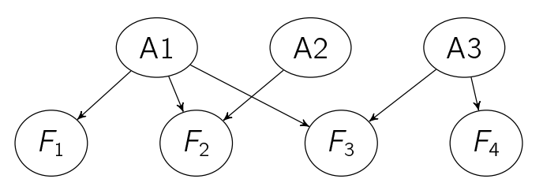
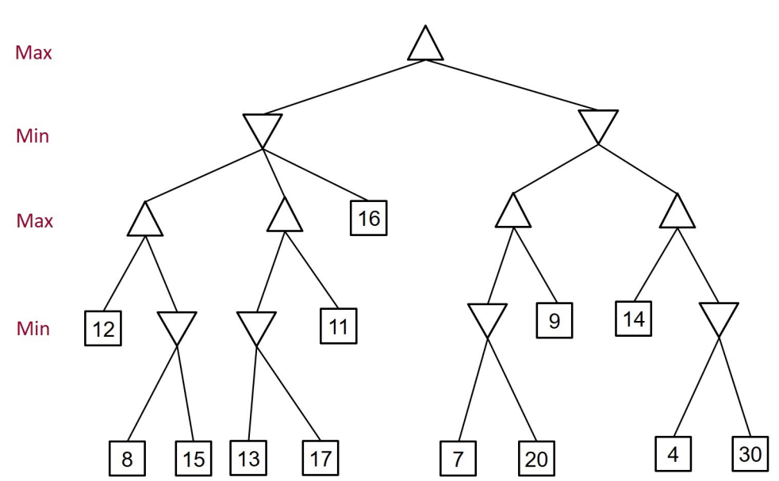

# Pastpaper

## Main Summer Examinations 2021

1. As a data scientist in a telecommunication company, your task is to analyse a customer dataset to predict whether a customer will terminate his/her contract. The dataset consists of around 8000 customer records, each consisting of one binary dependent variable Y , indicating whether the customer terminates the contract (Y = 1) or not (Y = 0), and 19 independent variables, which include the customer's information, e.g., age, subscription plan, extra data plan, etc., and the consumer behaviour such as average numbers of calls and hours per week. Since your boss needs some actionable insights to retain customers, you decided to use interpretable machine learning methods. Design your interpretable machine learning method by answering the following questions:
    1. You have implemented a feature selection algorithm based on mutual information to select the most informative features from the 19 independent variables. To validate the implementation of your mutual information calculation function, you use a small subset of the data to calculate mutual information manually. You select one independent variable `subscription plan`, denoted as S, which takes two values, $S \in \{1,2\}$. Please use the following Probability Mass Function table
        | P(S,Y) | S=1 | S=2 |
        |--------|-----|-----|
        | Y=0    | $\frac{2}{12}$    |  $\frac{5}{12}$   |
        | Y=1    | $\frac{2}{12}$    |  $\frac{3}{12}$   |
        to calculate
        - Entropies H(S) and H(Y)
        - Conditional entropies H(S|Y) and H(Y|S)
        - Joint entropy H(S,Y)
        - Mutual information I(S;Y)
        Show all your working. Discuss what mutual information means and whether this feature will be selected or not.

        > $H(S) = -(\frac{4}{12}\times\log\frac{4}{12} + \frac{8}{12}\times\log\frac{8}{12})= 0.918 bits\text{(bits是以2为底数)}$  
        > $H(Y) = -(\frac{7}{12}\times\log\frac{7}{12} + \frac{5}{12}\times\log\frac{5}{12})= 0.980 bits$  
        > $H(S,Y) = -(\frac{2}{12}\times\log\frac{2}{12} + \frac{5}{12}\times\log\frac{5}{12}+\frac{2}{12}\times\log\frac{2}{12} + \frac{3}{12}\times\log\frac{3}{12}) = 1.888 bits$  
        > $H(S|Y) = H(S,Y) - H(Y) = 0.908 bits$  
        > $H(Y|S) = H(S,Y) - H(S) = 0.970 bits$  
        > $I(S;Y) = H(S) - H(S|Y) = 0.01 bits$  
        > Mutual information measures the information that S and Y share. This feature will not be selected as the mutual information is too small which means the feature is not useful at all.

    2. After applying your algorithm you selected two variables:  
        1) extra data plan E, which is a binary random variable that indicates whether the customer subscribes to the extra data plan (E = 1) or not (E = 0); and 
        2) averaged hours used per week H, which is a continuous random variable. 
        You then built a logistic regression model to classify customers into `low risk` or `high risk` of terminating the contract. The fitted model is
        $$
            \log(\frac{p}{1-p}) = -0.77 + 0.23H - 1.18E
        $$
        - Given a customer who has the extra data plan (E = 1) and spent on average 0.5 hours per week, calculate the odds and the probability the customer will terminate the contract (Y = 1). `(4 marks)`
            > $odds = \frac{p}{1-p} = e^{-0.77 + 0.23H - 1.18E} = e^{-0.77 + 0.23\times 0.5 - 1.18\times 1} = 0.1596$  
            > $sigmoid(Y = 0) = \frac{1}{1+e^{-0.77 + 0.23H - 1.18E}} = \frac{1}{1+e^{-0.77 + 0.23\times 0.5 - 1.18\times 1}} = 0.862$
            > $sigmoid(Y = 1) = 1- sigmoid(Y = 1) = 0.138 OR_E = \frac{\text{odds when E = 1}}{\text{odds when E = 0}} = \frac{e^{-0.77 + 0.23H - 1.18}}{e^{-0.77 + 0.23H}}$
        - Using this fitted model, explain to your boss what actions should be taken to retain customers. `(10 marks)`  
            > $OR_E = \frac{\text{odds when E = 1}}{\text{odds when E = 0}} = \frac{e^{-0.77 + 0.23H - 1.18}}{e^{-0.77 + 0.23H}}=e^{-1.18} = 0.31$  
            > $OR_H = \frac{\text{odds when} H = h+\Delta}{\text{odds when} H = h} = \frac{e^{-0.77 + 0.23(H+\Delta) - 1.18E}}{e^{-0.77 + 0.23H - 1.18E}} = {e^{(0.23)}}^{\Delta} = 1.25^{\Delta}$  
            > - If a customer add the extra data plan, the odds of terminating the contract will increase is 0.3, which means that odds the customer terminating the contract will decrease by a factor of 3  
            > - If a customer increase the average time by one hour, the odds of terminating the contract increase by a factor of 1.25  
            >
            > From the analysis,we can suggest to the boss that, the more hours the customers spent, the more likely the customers will terminate, which means the company should improve its telecomunication service/price. However, by simply persuade them to subscribe to the extra data plan, they are more likely to stay

## Main Summer Examinations 2022

1. Mary is taking the exam of AI2, which has three questions: question A, B and C. For each question, Mary either knows how to solve it and gets the full marks, or does not know and gets 0 marks. Suppose question A has 20 marks, question B has 30 marks, and question C has 50 marks. Suppose Mary knows how to solve question A with probability 0:6, question B with probability 0:5 and question C with probability 0:4. Assume Mary solves these three questions independently.
    1. Mary can get the first-class degree if she gets at least 70 marks. What is the probability of Mary getting a first-class degree?
        > $A,B,C = 0.6\times 0.5\times 0.4 = 0.12$  
        > $A, C = 0.6 \times 0,4 = 0.24$  
        > $B,C = 0.5 \times 0.4 = 0.2$  
        > $P(First-class) = 0.56$
    2. What is the expectation of the marks Mary can get from the exam?
        > $E = 0.6\times 20+ 0.5\times 30+ 0.4\times 50 = 47$
    3. Let X1 =`the marks Mary gets from question A`, X2 =`the marks Mary gets from question B` and X3 =`the marks Mary gets from question C`. Let $X = \max\{X_1, X_2, X_3\}$ (the maximum among X1, X2, X3). Write down the probability mass function of X
        > $P(X_1=20) = 0.6$  
        > $P(X_2=30) = 0.5$  
        > $P(X_3=50) = 0.4$  
        > $P(X=0)=P(X_1=0) \times P(X_2=0) \times P(X_3=0) = 0.4 \times 0.5 \times 0.6 = 0.12$  
        > $P(X=20)=P(X_1=20) \times P(X_2=0) \times P(X_3=0) = 0.6 \times 0.5 \times 0.6 = 0.18$  
        > $P(X=30)=P(X_1=0) \times P(X_2=30) \times P(X_3=0)+ P(X_1=20) \times P(X_2=30) \times P(X_3=0)= 0.4 \times 0.5 \times 0.6 + 0.6 \times 0.5 \times 0.6= 0.3$   
        > $P(X=50)=P(X_1=0) \times P(X_2=0) \times P(X_3=50)+ P(X_1=20) \times P(X_2=0) \times P(X_3=50)+P(X_1=0) \times P(X_2=30) \times P(X_3=50)+P(X_1=20) \times P(X_2=30) \times P(X_3=50)= 0.4 \times 0.5 \times 0.4 + 0.6 \times 0.5 \times 0.4+0.4 \times 0.5 \times 0.4+0.6 \times 0.5 \times 0.4= 0.4$  
        > $$
        >   P(x;\theta) =
        >   \begin{cases}
        >     0.12  & \text{When X=0}\\
        >     0.18  & \text{When X=20}\\
        >     0.3 & \text{When X=30}\\
        >     0.4 & \text{When X=50}\\
        >   \end{cases}
        > $$

2. As a machine learning expert for an AI cyber security company, your task is to design an automated network intrusion detection system. You have collected a large number of records of network activities. Each record includes the log information about network activity, such as protocol types, duration, number of failed logins, which are random variables, denoted as $X = [X_1, X_2, ..., X_n]^T$. Each record also includes a binary random variable Y called label that was labelled by cyber security experts as intrusions (Y=1) or normal connections(Y=0)
    1. Consider feature selection based on mutual information to reduce the number of independent variables.
       1. Explain to your colleague, who knows nothing about information theory, the concept of mutual information. 
            > Basic motivation behind mutual information is to measure the information that two random variables X and Y share. In other words, it measures how much knowing one of these variables reduces uncertainty about the other.
       2. Explain the loop, i.e., lines 4-7 of the pseudocode in Table 1. Note $I(Y;X_i)$ is the mutual information between $Y$ and $X_i$
            $$
            \begin{align*}
              &\text{Initialisation: Set } F \leftarrow X \text{ and } S \leftarrow ∅ \\
              &\quad f_{\max} = \argmax_{X_i \in X} I(Y; X_i) \\
              &\quad \text{Set } F \leftarrow F / \{f_{\max}\} \text{ and } S \leftarrow f_{\max} \\
              &\quad \text{Repeat until } |S| = K: \\
              &\quad \quad f_{\max} = \argmax_{X_i \in F}I(Y; X_i) - \beta\sum_{X_s\in S} I(X_s; X_i) \\
              &\quad \quad \text{set } F \leftarrow F \ \{f_{\max}\} \text{ and } S \leftarrow f_{\max}\\
              &\quad \text{End}\\
              &\text{End}
            \end{align*}
            $$  
            Table 1: Pseudocode of Mutual Information based Feature Selection Algorithm.  
            > The two lines in the loop are used to select K features. In this loop, we also nd the feature $f_{\max}$ which achieves the maximum mutual information I among all the remaining independent variables in set F . However, because some features highly correlated with each other, selecting them will increase the number of features but does not improve the prediction. Therefore, we need to make sure there must be minimal redundancy between the candidate feature $X_i$ and the set of selected features S. That's exactly the second term of the equation ($f_{\max}$) You then add this feature into S and then subtract it from set F and repeat until we got K features
    2. After applying your feature selection algorithm, assume you selected four random variables as features, denoted as $F_1, F_2, F_3, F_4$. Based on these features, you now work with a cyber security expert to construct a Bayesian network to harness the domain knowledge of cyber security. The expert first divides intrusions into three cyber attacks, $A_1, A_2, A_3$, which are marginally independent from each other. The expert suggests the presence of the four features are used to find the most probable type of cyber attacks. The four features are conditionally dependent on the three types cyber attacks as follows: $F_1$ depends only on $A_1, F_2$ depends on $A_1$ and $A_2$. $F_3$ depends on $A_1$ and $A_3$, whereas $F_4$ depends only on $A_3$. We assume all these random variables are binary, i.e., they are either 1 (true) or 0 (false).
       1. Draw the Bayesian network according to the expert?s description. [2 marks]  
            > 
       2. Write down the joint probability distribution represented by this Bayesian network. [3 mark]  
            > $P(A_1, A_2, A_3, F_1, F_2, F_3, F_4)$  
            > $=P(A_1)P(A_2)P(A_3)P(F_1|A_1)P(F_2|A_1,A_2)P(F_3|A_1,A_3)P(F_4|A_3)$
       3. How many parameters are required to describe this joint probability distribution? Show your working. [5 marks]
            > | Conditional Probability | Number of parameters |
            > |-------------------------|----------------------|
            > | $P(A_1)$                | 1                    |
            > | $P(A_2)$                | 1                    |
            > | $P(A_3)$                | 1                    |
            > | $P(F_1\|A_1)$           | 2                    |
            > | $P(F_2\|A_1,A_2)$       | 4                    |
            > | $P(F_3\|A_1,A_3)$       | 4                    |
            > | $P(F_4\|A_3)$           | 2                    |
       4. Suppose in a record we observe $F_2$ is true, what does observing $F_4$ is true tell us? If we observe $F_3$ is true instead of $F_2$, what does observing $F_4$ is true tell us? [5 marks]
            > With $F_2 = 1$, obeserving $F_4 = 1$ still gives us information only about $A_3$  
            > If we observe $F_3 = 1$ instead of $F_2$, then oberving $F_4 = 1$ will give us information about $A_1$ and $A_3$ due to competing causes

3.  1. Consider the following minimax game tree. There are two players Max and Min; the player Max wants to maximise the utility and the player Min wants to minimise the utility. The tree has five layers and we can use Lm-n to denote the nth node from left to right in the layer m; for example, the root node can be denoted by L1-1, the first node at the bottom layer (with value 8) can be denoted by L5-1, and the fourth node at the fourth layer (with value 11) can be denoted by L4-4. Give the value of the root node (L1-1) and the values of the two nodes at the second layer (L2-1 and L2-2).[2 marks]
        
        > L1-1: 12  
        > L2-1: 12  
        > L2-2: 9
    2. We use the alpha-beta pruning algorithm to prune the tree. List all the pruned nodes. Assume that child nodes are visited from left to right. [10 marks]
        > L5-2, L4-4, L5-6, L3-5, L4-7, L4-8, L5-7, L5-8

## Information Theory Exercise Problems 1-4

1. Prove that the information measure is additive: that the informatin gained from observing the combination of N independent events, whose probabilities are $p_i$ for $i = 1...N$, is the $sum$ of the information gained from observing each one of these events separately and in any order
