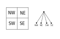
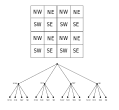

# Class Test 2

## Marking table

The exercises are defined so that it is hard to get a first-class mark.

```
  1st          - 35 marks and above.
  upper second - 30-34 marks.
  lower second - 25-29 marks.
  third        - 20-24 marks.
  fail         -  0-19 marks.
```

The module mark will be the sum of the marks on both class tests. All questions
have equal weight.

## Preparation

* The test must be completed on Jupyter Lab.
* Run `git pull` on Jupyter Lab to make sure you have the latest version of the
  course repository.
* Do __not__ modify either the file `Types.hs` or the file
  `ClassTest2-Template.hs`.
* Copy the file `ClassTest2-Template.hs` to a new file called `ClassTest2.hs`
  and write your solutions in `ClassTest2.hs`.

  __Don't change the header of this file, including the module declaration, and,
  moreover, don't change the type signature of any of the given functions for you
  to complete.__

  __If you do make changes, then we will not be able to mark your submission and
  hence it will receive zero marks!__
* Solve the exercises below in the file `ClassTest2.hs`.

The following is how you will need to run `ghci` on Jupyter for today's Class
Test.  This is important so that the monad libraries are available:

## `$ ghci ClassTest2 -package mtl`

## Submission procedure

* If your submission doesn't compile or fails to pass the presubmit script on
  Jupyter Lab, it will get zero marks.
* Run the presubmit script provided to you on your submission from Jupyter by
  running `./presubmit.sh ClassTest2` in the terminal (in the same folder as
  your submission).
* This will check that your submission is in the correct format.
* If it is, submit on Canvas.
* Otherwise fix and repeat the presubmission procedure.

## Plagiarism

Plagiarism will not be tolerated. Copying and contract cheating have led to full
loss of marks, and even module or degree failure, in the past.

You will need to sign a declaration on Canvas, before submission, that you
understand the [rules](/README.md#plagiarism) and are abiding by them, in order
for your submission to qualify.

## Background material

- Each question has some **Background Material**, an **Implementation Task** and
  possibly some **Examples**.
- Read this material first, then implement the requested function.
- The corresponding type appears in the file `ClassTest2-Template.hs` (to be
  copied by you).
- Replace the default function implementation of `undefined` with your own
  function.
- This test uses the `State` Monad. Recall that to load your file (i.e to test 
  your functions in ghci), you should append `-package mtl` when loading the 
  module. Specifically, you should run `ghci ClassTest2 -package mtl` in the 
  terminal.

## More Rules

* This is an open book test.
* You may consult your own notes, the course materials, any of the recommended
  books or [Hoogle](https://hoogle.haskell.org/).
* Feel free to write helper functions whenever convenient.
* If you do write any helper function, make sure its name does not clash with
  any of the functions in the `Types.hs` file.
* All the exercises may be solved without importing additional modules. Do not
  import any modules, as it may interfere with the marking.

## Submission Deadline

* The official submission deadline is 2pm.
* If you are provided extra time, then your submission
  deadline is that given to you by the Welfare office.

## Question 1 - Monadic Tribonacci

### Background Material

The Tribonnaci sequence is a generalisation of the Fibonacci sequence defined
as follows:

T<sub>1</sub> = 1,

T<sub>2</sub> = 1,

T<sub>3</sub> = 2, 

T<sub>n</sub> = T<sub>n-3</sub> + T<sub>n-2</sub> + T<sub>n-1</sub>.

A naive implementation can be given as follows:

```haskell
trib :: Int -> Int
trib 1 = 1
trib 2 = 1
trib 3 = 2
trib n | n > 3 = trib (n-3) + trib (n-2) + trib (n-1)
```

This naive implementation of trib has a major drawback: the run time of this
function has exponential growth. Indeed, even for n as low as 30, we see huge
increases in the function runtime.

```hs
ghci> :set +s

ghci> trib 25
1389537
(0.73 secs, 293,723,688 bytes)
ghci> trib 27
4700770
(2.45 secs, 993,455,688 bytes)
ghci> trib 30
29249425
(15.25 secs, 6,181,094,824 bytes)
```

### Implementation Task

Rewrite the above function using the state monad to improve its efficiency.

```haskell
stateTrib :: Integer -> State (Integer,Integer,Integer) ()
stateTrib = undefined

runStateTrib :: Integer -> Integer
runStateTrib n = let ((),(a,b,c)) = (runState (stateTrib n) (1,0,0)) in a
```
The function `runStateTrib n` should return the n<sup>th</sup> Tribonacci number 
_efficiently_, using the state monad to keep track of intermediate values. 

This function will be tested for large values of `n`. In particular, 
`runStateTrib 1000` should run in well under `1` second.

### Examples

```hs
ghci> runStateTrib 30
29249425
(0.00 secs, 106,632 bytes)
ghci> runStateTrib 1000
1499952522327196729941271196334368245775697491582778125787566254148069690528296568742385996324542810615783529390195412125034236407070760756549390960727215226685972723347839892057807887049540341540394345570010550821354375819311674972209464069786275283520364029575324
(0.00 secs, 1,184,936 bytes)
```

## Question 2 - Writer/Leaves

### Background 

Recall the type of binary trees carrying data at both the node and leaves:

```haskell
data Bin a b = Lf a
             | Nd b (Bin a b) (Bin a b)
             deriving (Eq, Show)
``` 


### Implementation Task

Write a function to perform an in-order traversal of the tree, logging the values of the nodes and leaves using an `Either` type (since they have different types):

```haskell
writeLeaves :: Bin a b -> Writer [Either a b] ()
writeLeaves = undefined
```
### Examples

Consider the trees
```hs
tr1 = Nd 'a' (Lf 4) (Nd 'b' (Lf 7) (Lf 2))
tr2 = Nd 3 (Nd 5 (Nd 7 (Lf 'a') (Lf 'b')) (Nd 8 (Lf 'c') (Lf 'd'))) (Nd 4 (Lf 'e') (Lf 'f'))
```
Traversing them gives:
```hs
ghci> snd $ runWriter $ writeLeaves tr1
[Left 4,Right 'a',Left 7,Right 'b',Left 2]
ghci> snd $ runWriter $ writeLeaves tr2
[Left 'a',Right 7,Left 'b',Right 5,Left 'c',Right 8,Left 'd',Right 3,Left 'e',Right 4,Left 'f']
```

## Question 3 - Collapsing

### Backgroup Material 

Refer to the type `Bin a b` of binary trees from the previous question.

### Implementation Task

Suppose that the leaves of our tree are *themselves* decorated by binary trees.  Write 
a function:

```haskell
collapse :: Bin (Bin a b) b -> Bin a b
collapse = undefined
``` 
which converts this to a single tree, promoting the decorations of the leaves to be subtrees of the result.

### Example

Given the tree

```haskell
tr3 :: Bin (Bin Int Char) Char
tr3 = Nd 'a' (Lf (Nd 'b' (Lf 2) (Lf 7))) (Lf (Nd 'c' (Lf 2) (Lf 7)))
```
we have
```hs
ghci> collapse tr3
Nd 'a' (Nd 'b' (Lf 2) (Lf 7)) (Nd 'c' (Lf 2) (Lf 7))
```

## Question 4 - Mapping with Addresses

### Background Material

Consider the map function on lists:
```hs
map :: (a -> b) -> [a] -> [b]
```
As the map proceeds, the function provided as a first argument only has access to the element (of type `a`) in order to produced an output value of type `b`.  A slightly more sophisticated `map` is given by the `mapWithIndex` function:
```hs
mapWithIndex :: (a -> Int -> b) -> [a] -> [b]
```
In this version, the first argument is a function which is passed not only the current element as the map proceeds *but also the index of that element in the list*.

We can do something completely analogous for trees.  Referring to the binary trees from Question 2, recall that each node or leaf of the tree can be assigned an *address* (see the section "Directions, addresses and paths in binary trees" from [User defined data types I](/files/LectureNotes/Sections/Data1.md#bintreeaddr)) consisting of the list of choices of moving left and right required to reach it.  That is:

```hs
data Direction = L | R deriving (Eq, Show)
type Address = [Direction]
```

### Implementation Task

Write a function
```haskell
mapLeavesWithAddress :: (a -> Address -> c) -> Bin a b -> Bin c b
mapLeavesWithAddress = undefined
```
which applies the provided function to the data at each leaf, while also passing in the address of that leaf.

### Examples

Consider again the trees
```hs
tr1 = Nd 'a' (Lf 4) (Nd 'b' (Lf 7) (Lf 2))
tr2 = Nd 3 (Nd 5 (Nd 7 (Lf 'a') (Lf 'b')) (Nd 8 (Lf 'c') (Lf 'd'))) (Nd 4 (Lf 'e') (Lf 'f'))
```
One possible thing we could do is to simply return the address when we reach a leaf.  In this case, each leaf will become decorated by its own address.  For example:
```hs
ghci> mapLeavesWithAddress (\ _ addr -> addr) tr1
Nd 'a' (Lf [L]) (Nd 'b' (Lf [L,R]) (Lf [R,R]))
ghci> mapLeavesWithAddress (\ _ addr -> addr) tr2
Nd 3 (Nd 5 (Nd 7 (Lf [L,L,L]) (Lf [R,L,L])) (Nd 8 (Lf [L,R,L]) (Lf [R,R,L]))) (Nd 4 (Lf [L,R]) (Lf [R,R]))
```

## Question 5

### Background

A `QuadTree` is a data structure which is very useful for storing images.  It is a tree in which each node has 4 descendants, corresponding to dividing an image into 4 regions, which we will label by `NW`, `NE`, `SW` and `SE`.  Using integers to represent pixels, the definition would look like this:

```hs
type Pixel = Integer

data QuadTree = N QuadTree QuadTree QuadTree QuadTree
              | P Pixel
              deriving (Eq, Show)
```

For a 2x2 image, here's a picture of the corresponding quadtree.  It consists of a single node with 4 leaves as children.



The labels `NW`, `NE`, `SW` and `SE` here tell us which parts of the image are stored in which constructor arguments.  The displayed quadtree would be written `N (L NW) (L NE) (L SW) (L SE)` (of course, the labels such as `NW` are not integers so this expression is not well typed.  It's just to fix an ordering convention).

Now, for a 4x4 image, we subdivide again, leading to a two level tree like this:



On the other hand, we can represent an image as a 2-dimensional array, implemented here as a list of lists:

```haskell
type Image = [[Pixel]]
```

Here are two example images (these definitions are imported for you in the template):

```hs
image1 = [ [1, 2]
         , [3, 4] ]

image2 = [ [1,  2,  3,  4]
         , [5,  6,  7,  8]
         , [9,  10, 11, 12]
         , [13, 14, 15, 16] ]
```

### Implementation Task

Write two functions

```haskell
toQuadTree :: Image -> QuadTree
toQuadTree = undefined

fromQuadTree :: QuadTree -> Image
fromQuadTree = undefined
```
which converts an `Image` to a `QuadTree`, and vice-versa. 

For simplicity, you may assume that the images we want to convert are
1. Non-empty, and
1. Square arrays where the length of each side are powers of two. This means that 
    - The resulting `QuadTree`'s have uniform depth (as show in the two examples)
    - All of the `Leaves` are on the same level. Hence, any `Node` which contains a `Pixel` will _only_ contain `Pixel`'s.
	
Your code does not need to handle images or trees which are not of this form, and may simply leave these cases undefined.

To obtain full marks, your functions must be mutually inverse. That is, we should have
```hs
fromQuadTree (toQuadTree im) == im
toQuadTree (fromQuadTree qt) == qt
```
for any image `im` and any quadtree `qt` satisfying the stated conditions.

### Examples

```hs
ghci> toQuadTree image2
N (N (P 1) (P 2) (P 5) (P 6)) (N (P 3) (P 4) (P 7) (P 8)) (N (P 9) (P 10) (P 13) (P 14)) (N (P 11) (P 12) (P 15) (P 16))

ghci> fromQuadTree (N (N (P 1) (P 2) (P 5) (P 6)) (N (P 3) (P 4) (P 7) (P 8)) (N (P 9) (P 10) (P 13) (P 14)) (N (P 11) (P 12) (P 15) (P 16)))
[[1,2,3,4],[5,6,7,8],[9,10,11,12],[13,14,15,16]]

ghci> image2 == fromQuadTree (toQuadTree image2)
True

ghci> image1 == fromQuadTree (toQuadTree image2)
False
```
