# Introduction to Haskell - the Game of Life 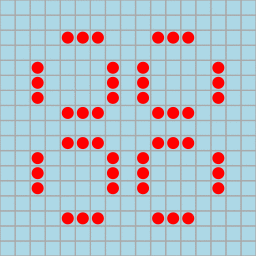

# Prerequisites

* Watch the lecture [Game of Life - Part 1](https://bham.cloud.panopto.eu/Panopto/Pages/Viewer.aspx?id=a479ce41-092c-43af-8c49-adab009d3ef5).
* Watch the lecture [Game of Life - Part 2](https://bham.cloud.panopto.eu/Panopto/Pages/Viewer.aspx?id=8097e3cd-667a-4a07-adbe-adab009d42f7).

# Learning objective

In these notes we discuss a self-contained Haskell program that has
many features that we will study in the next few lectures.  Don't
worry if you don't understand everything. Our objective is to motivate
the usefulness of these features with an entertaining example.

There is a [blackboard file](GameOfLife.pdf) with a summary of the material here, and a discussion of existing functional programming languages, used in the above video lectures.

# Contents

* [Background](#background)
  * [Rules](#rules)
  * [Examples](#examples)
* [Implementing Conway's Game of Life](#implementation)
  * [Representing the board and step function](#boardstep)
  * [Visualising the game](#visualisation1)
* [An implementation in Kotlin](#kotlin)

<a name="background"></a>
# Background

The [Game of Life](https://en.wikipedia.org/wiki/Conway's_Game_of_Life), invented by [John Conway](https://www.youtube.com/watch?v=E8kUJL04ELA), was an early example of a cellular automaton with complex behaviors generated from a simple set of rules.

<a name="rules"></a>
## Rules

The *Game of Life* begins by placing some tokens on the cells of a two-dimensional grid.
Cells of the grid that contain a token are said to be *live*, while empty cells are said to be *dead*.
Each cell has exactly eight neighbours, corresponding to the cells that are immediately adjacent horizontally, vertically, or diagonally.

The initial configuration is called the *seed*, or generation 0.
Afterwards the game is played deterministically according to the following rules of evolution whereby a cell interacts with its neighbours:

1. [Birth.] A dead cell with exactly three live neighbours becomes live at the next generation.
2. [Survival.] A live cell with either two or three live neighbours survives to the next generation.
3. [Death.] A cell dies from overcrowding if it has more than three live neighbours, or from isolation if it has fewer than two neighbours.

It is important to clarify that the rules specify that all of these births and deaths happen *simultaneously* as the grid evolves into the next generation, rather than in any particular order.

<a name="examples"></a>
## Examples

Many initial configurations quickly die off.
For example, the seed

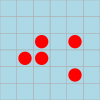

evolves to an empty grid after five generations.
(Since an empty grid can never be repopulated, all generations after generation 5 are the same.)

0 
1 
2 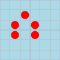
3 

4 
5 
6 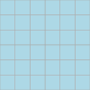
7 

On the other hand, some seeds enter into a stable pattern of oscillation between a collection of two or more states.

0 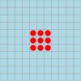
1 
2 
3 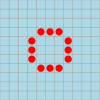

4 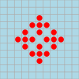
5 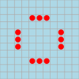
6 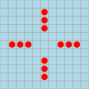
7 

---

0 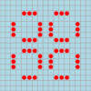
1 
2 
3 

4 
5 
6 
7 

Another interesting example is Conway's *glider* pattern, which moves slowly across the board, drifting up and to the right by one square every four generations.

0 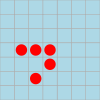
1 
2 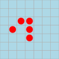
3 

4 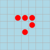
5 
6 
7 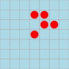

It turns out that behaviors in the Game of Life can get arbitrarily complicated &mdash; indeed it is possible to [simulate a Turing machine](https://www.youtube.com/watch?v=My8AsV7bA94) by encoding it as an initial seed and watching it evolve!

<a name="implementation"></a>
# Implementing Conway's Game of Life

Now let's see how to translate the rules of the Game of Life into a simple Haskell implementation.
We will develop all of the code that we need right here in these [markdown](https://en.wikipedia.org/wiki/Markdown) notes, which can be converted into a Haskell file automatically by running the program [`mdtohs.hs`](../../Resources/mdtohs.hs) as follows:
```
$ cat Life.md | runhaskell ../../Resources/mdtohs.hs > Life.hs
```
assuming you are in the directory `LectureNotes/Sections`.

Soon we will want to animate the game, and so we need to include the following import to use a builtin delay function:
```haskell
import Control.Concurrent
```

Note that besides this library, the Haskell [Standard Prelude](https://www.haskell.org/onlinereport/standard-prelude.html) is automatically imported into the environment.

With that bureaucracy out of the way, let's turn to the more substantive question of how to represent the state of the game.

<a name="boardstep"></a>
## Representing the board and step function

One way we might think of representing the grid is as a two-dimensional array of booleans with some fixed number of rows and columns.
However, this representation has a couple disadvantages:

* The official rules don't put any bound on the size of the grid, and there are patterns (such as the glider) which eventually travel through an infinite region of cells.
* Typical grid configurations are *sparse* in the sense that most of the cells are empty.

To avoid these issues, we will instead represent a grid by just keeping track of the *live* cells.
So let us make the following **type declarations**:

```haskell
type Cell = (Int,Int)
type Grid = [Cell]
```

This defines the type `Cell` as a synonym for *pair of machine integers*, and the type `Grid` as a synonym for *list of cells* (= list of pairs of machine integers).
The intended interpretation is that a cell is specified by giving its (x,y) coordinates, while a grid is specified by listing (the coordinates of) its live cells.
For example, the grids


&nbsp;&nbsp;&nbsp; and &nbsp;&nbsp;&nbsp;


are represented by the following lists of coordinates:

```haskell
pentagenarian :: Grid
pentagenarian = [(1,2),(2,2),(2,3),(4,1),(4,3)]

glider :: Grid
glider = [(1,3),(2,1),(2,3),(3,2),(3,3)]
```

Now that we've settled on the representation, let's go ahead and implement the rules of the Game of Life.
We begin with several helper functions.
```haskell
isLive, isDead :: Cell -> Grid -> Bool
isLive c g = c `elem` g
isDead c g = not (isLive c g)
```
The functions `isLive` and `isDead` determine whether or not the cell at coordinate c is live in a given grid g: since the grid is represented as a list of live cells, this simply reduces to checking whether or not c is an element of g.

```haskell
neighbours :: Cell -> [Cell]
neighbours (x,y) = [ (x+i,y+j) | i <- [-1..1], j <- [-1..1], not (i==0 && j==0) ]
```

The function `neighbours` returns the list of eight neighbours of a given cell.
A first aspect of this definition that is worth pointing out is the use of **pattern matching** on the left-hand side
```hs
neighbours (x,y) = {- ... -}
```
to automatically give names to the two components of the cell coordinate.
This definition can be equivalently expressed using destructors and `let` bindings
```hs
neighbours c = let x = fst c in let y = snd c in {- ... -}
```
but the definition via pattern-matching is more clear and concise.
Another aspect of this definition worth pointing out is the use of a **list comprehension**
```hs
{- ... -} = [ (x+i,y+j) | i <- [-1..1], j <- [-1..1], not (i==0 && j==0) ]
```
on the right-hand side.
List comprehensions are a powerful feature of Haskell that mimic set comprehension notation in mathematics.
The expression above constructs a list of pairs of the form (x+i,y+j), where i and j run from -1 to 1, but cannot both be equal to 0.
(You can read more about pattern matching and list comprehension in Chapters 4 and 5 of [the textbook](http://www.cs.nott.ac.uk/~pszgmh/pih.html).)
Here is a sample output of `neighbours`, running within the GHC interpreter:
```hs
> neighbours (2,2)
[(1,1),(1,2),(1,3),(2,1),(2,3),(3,1),(3,2),(3,3)]
```
By combining `neighbours` with `isLive` using another list comprehension, we can compute the live neighbours of a cell within a given grid:

```haskell
liveNeighbours :: Grid -> Cell -> [Cell]
liveNeighbours g c = [c' | c' <- neighbours c, isLive c' g]
```

Sample outputs:

```hs
> liveNeighbours pentagenarian (2,2)
[(1,2),(2,3)]
> liveNeighbours glider (2,2)
[(1,3),(2,1),(2,3),(3,2),(3,3)]
```

Finally, we combine these ingredients to write a function `step`, which takes a grid as input and applies the rules of the Game of Life to compute the next generation grid as output.

```haskell
step :: Grid -> Grid
step [] = []
step g =
  [(x,y) | x <- [minX-1 .. maxX+1],
           y <- [minY-1 .. maxY+1],
              (isDead (x,y) g && length (liveNeighbours g (x,y)) == 3)
           || (isLive (x,y) g && length (liveNeighbours g (x,y)) `elem` [2,3])
         ]
  where
    minX = minimum [ x | (x,y) <- g ]
    maxX = maximum [ x | (x,y) <- g ]
    minY = minimum [ y | (x,y) <- g ]
    maxY = maximum [ y | (x,y) <- g ]
```

The first clause of the definition
```hs
step [] = []
```
simply repeats the already mentioned fact that an empty grid can never be repopulated.
The second clause is a bit more subtle so it's worth spending some time to understand it.
We begin by computing the minimum/maximum values obtained for the x and y coordinates of all of the live cells of the grid.
(This all happens in the `where` block, which is evaluated first even though it occurs syntactically below the list comprehension.)
Since the live cells of the next generation must all be within distance one from the live cells of the current generation, it suffices to consider the rectangle of cells (x,y) ranging from the lower left corner (minX-1,minY-1) to the upper right corner (maxX+1,maxY+1) (see shaded region in the diagram below).

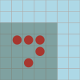

For all of the cells lying within this region, we then test the boolean formula
```hs
              (isDead (x,y) g && length (liveNeighbours g (x,y)) == 3)
           || (isLive (x,y) g && length (liveNeighbours g (x,y)) `elem` [2,3])
```
which directly expresses the logic of *birth* or *survival*: a dead cell becomes live in the next generation if it has exactly three neighbours, while a live cell survives if it has either two or three neighbours.
(The logic of *death* is also implicitly encapsulated by the formula, since a cell with more than three or fewer than two live neighbours will be excluded from the list of live cells in the next generation.)

Here is a sample interaction with the `step` function:

```hs
> step pentagenarian
[(1,2),(1,3),(2,2),(2,3),(3,3)]
> step (step pentagenarian)
[(1,2),(1,3),(2,4),(3,2),(3,3)]
> step (step (step pentagenarian))
[(1,3),(2,4),(3,3)]
> step (step (step (step pentagenarian)))
[(2,3),(2,4)]
> step (step (step (step glider)))
[(2,4),(3,2),(3,4),(4,3),(4,4)]
```

One last remark: in the definition of `step`, it is important that the clause
```hs
step [] = []
```
appears before the clause
```hs
step g = {- ... -}
```
to cover the case of the empty grid.
Otherwise the implementation would be incorrect, since the operations `minimum` and `maximum` raise an exception in the case of an empty list.

<a name="visualisation1"></a>
## Visualising the game in a terminal

We will animate the game in a terminal, using [Ansi escape code](https://en.wikipedia.org/wiki/ANSI_escape_code).

Firstly we will assume the following dimensions for our terminal (change for testing, if needed):
```haskell
terminalWidth  = 70
terminalHeight = 22
```

For programs that do input and output, we must use the `IO ()`
type. The Ansi escape code `\ESC[2J` is for clearing the terminal:
```haskell
cls :: IO ()
cls = putStr "\ESC[2J"
```

If we want to print a character in a certain position of the terminal, we need to move the cursor there with the Ansi escape code `\Esc[` followed by two numbers separated by `;` and ended by `H`.
```haskell
goto :: Cell -> IO ()
goto (x,y) = putStr ("\ESC[" ++ show (terminalHeight-y) ++ ";" ++ show (x+1) ++ "H")
```
Here we subtracted `y` from the terminal height because we use the convention that rows of the board are numbered from bottom to top, whereas rows of the terminal are numbered from top to bottom.
We also added 1 to `x` because we want board position (0,0) to correspond to the bottom-left position of the terminal.

We will print the letter `O` to represent a live cell:
```haskell
printCell :: Cell -> IO ()
printCell (x,y) | x >= 0 && x < terminalWidth
               && y >= 0 && y < terminalHeight = do
                                                  goto (x,y)
                                                  putChar 'O'

                | otherwise                    = return ()
```
A warning is that the `IO`-type's `return` function is not like `Java`'s return. We will see what `return` means more precisely when we study monads later. For the moment, we just state its type:
```hs
return :: Monad m => a -> m a
```
Observe that `return` has a *polymorphic* type since `m` and `a` are variables.
Here we are using it with the monad `m = IO` and type `a = ()`.

Finally, we render a grid in the terminal as follows:
```haskell
terminalRender :: Grid -> IO ()
terminalRender g = do
                    cls
                    sequence [ printCell c | c <- g ]
                    goto (0,terminalHeight)
```
The Haskell prelude function `sequence` performs a sequence of `IO` operations in this case, and a sequence of monadic operations in general, and has the following type:
```hs
sequence :: (Traversable t, Monad m) => t (m a) -> m (t a)
```
Here we are using it with `t a = [a]` and `m = IO`.

We also need a delay function, for otherwise the evolution of the game is shown too fast (this needs `import Control.Concurrent`):

```haskell
delayTenthSec :: Int -> IO ()
delayTenthSec n = threadDelay (n * 10^5)
```

Finally we can animate the Game of Life as follows in the terminal:
```haskell
life :: Grid -> IO ()
life seed = f 0 seed
 where
  f n g = do
           terminalRender g
           putStrLn (show n)
           delayTenthSec 1
           f (n+1) (step g)
```

Example:
```haskell
main :: IO ()
main = life glider
```

Run this file as follows from a terminal in a lab machine:
```shell
$ module load func-prog
$ git clone https://git.cs.bham.ac.uk/mhe/fp-learning-2021-2022.git
$ cd fp-learning-2021-2022/LectureNotes
$ cat Sections/Life.md | runhaskell ../Resources/mdtohs.hs > Life.hs
```
Then run
```shell
$ runhaskell Life.hs
```
Or instead run `ghci Life.hs` and `life glider` or `life pentagenarian` or other examples.

By the way, the other two initial seeds illustrated in the [Examples](#examples) section can be expressed concisely as follows using list comprehensions:

```haskell
block3 :: Grid
block3 = [(x,y) | x <- [1..3], y <- [1..3]]

pulsar :: Grid
pulsar = [(x+i,y) | x <- [2,8], y <- [0,5,7,12], i <- [0..2]] ++ [(x,y+i) | x <- [0,5,7,12], y <- [2,8], i <- [0..2]]
```

You can go ahead and try running them!

# An implementation in Kotlin

[Kotlin](https://developer.android.com/kotlin) is Google's [preferred language for developing Android applications](https://techcrunch.com/2019/05/07/kotlin-is-now-googles-preferred-language-for-android-app-development/).

Kotlin supports functional programming, as illustrated in this [direct translation](../../Resources/life.kt) of the Haskell program.

Can you translate this to Java, while maintaining the functional style of the code?

# After studying this handout

Do the [lab exercise](../../ProblemSheets/ProblemSheet-Week1.md).
