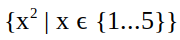
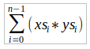

# List Comprehensions

These notes should be read in conjunction with chapter 5 of our textbook Programming in Haskell.

* We discuss some examples from the [Haskell'98 standard prelude](https://www.haskell.org/onlinereport/standard-prelude.html) for pedagogical purposes.

* See the [prelude for the current version of the language](https://hackage.haskell.org/package/base-4.12.0.0/docs/Prelude.html) for all predefined classes and their instances.

## Note:

Please ignore this declaration until you have read the *Encoding and Decoding* section in the **The Caesar Cipher** example at the end of this handout. We mention it here, in order to ensure that the generated haskell file contains this import statement at the beginning.

```haskell
import Data.Char
```

## Basic Concepts

There is also a [video](https://bham.cloud.panopto.eu/Panopto/Pages/Viewer.aspx?id=1bd321bf-1f1c-45fd-8e9a-ac3e01048680) on this section.

In mathematics, the _comprehension_ notation can be used to construct new sets from existing sets. For example:



Produces the set {1, 4, 9, 16, 25} of all numbers x^2 such that x is an element of the set {1...5}

In Haskell, a similar comprehension notation can be used to construct __new lists__ from old lists. For example: 

```hs
> [x^2 | x <- [1..5]] 
[1,4,9,16,25]
```
The symbol `|` is read is _such that_, `<-` is read as _drawn from_, and the expression `x <- [1..5]` is called a __generator__. A generator states how to generate values for x. 

Comprehensions can have _multiple_ generators, separated by commas. For example:

```hs
> [(x,y) | x <- [1,2,3], y <- [4,5]]
[(1,4),(1,5),(2,4),(2,5),(3,4),(3,5)]
```

Changing the order of the generators changes the order of the elements in the final list:

```hs
> [(x,y) | y <- [4,5], x <- [1,2,3]]
[(1,4),(2,4),(3,4),(1,5),(2,5),(3,5)]
```

Multiple generators are like nested loops, with later generators as more deeply nested loops whose variables change value more frequently.


## Dependent Generators

There is also a [video](https://bham.cloud.panopto.eu/Panopto/Pages/Viewer.aspx?id=a5ce4d07-dd54-47cc-8c4d-ac3e010489c3) on this section.

Later generators can depend on the variables that are introduced by earlier generators:

```hs
> [(x,y) | x <- [1..3], y <- [x..3]]
[(1,1),(1,2),(1,3),(2,2),(2,3),(3,3)]
```
The above list includes all pairs of numbers `(x,y)` such that `x,y` are elements of the list `[1..3]` and `y` >= `x`.

Using a dependent generator we can define the library function that _concatenates_ a list of lists:

```hs
concat :: [[a]] -> [a]
concat xss = [x | xs <- xss, x <- xs]
```
For example:
```hs
> concat [[1,2,3],[4,5],[6]]
[1,2,3,4,5,6]
```
The wildcard pattern `_` is sometimes useful in generators to discard certain elements from a list. For example, a function that selects all the first components from a list of pairs can be defined as follows:

```haskell
firsts :: [(a,b)] -> [a]
firsts ps = [x | (x, _) <- ps]
```

Similarly, the library function that calculates the length of a list can be defined by replacing each element by one and summing the resulting list:

```hs
length :: [a] -> Int
length xs = sum [1 | _ <- xs]
```

In the above case, the generator `_ <- xs` simply serves as a counter to govern the production of the appropriate number of ones. 

## Guards

There is also a [video](https://bham.cloud.panopto.eu/Panopto/Pages/Viewer.aspx?id=b18b42b5-0509-4976-a51c-ac3e01048c63) on this section.

List comprehensions can use **guards** to restrict the values produced by earlier generators. If the guard is _true_, then the current values are retained; if it is _false_, then they are discarded. 

For example:

```hs
> [x | x <- [1..10], even x]
[2,4,6,8,10]
```

Similarly, a function that maps a positive integer to its list of positive factors can be defined by:

```haskell
factors :: Int -> [Int]
factors n = [x | x <- [1..n], n `mod` x == 0]
```
For example:
```hs
> factors 15
[1,3,5,15]
```

A positive integer is prime if its only factors are 1 and itself. Hence, using `factors` we can define a function that decides if a number is prime:

```haskell
prime :: Int -> Bool
prime n = factors n == [1,n]
```
For example:

```hs
> prime 15
False

> prime 7
True
```

Note: To decide that a number such as 15 is not prime does not require the function `prime` to produce all of its factors, because under lazy evaluation the result `False` is returned as soon as any factor other than one or the number itself is produced. 

Using a guard we can now define a function that returns the list of all primes up to a given limit:

```haskell
primes :: Int -> [Int]
primes n = [x | x <- [2..n], prime x]
```

For example:

```hs
> primes 40
[2,3,5,7,11,13,17,19,23,29,31,37]
```

## The Zip Function

There is also a [video](https://bham.cloud.panopto.eu/Panopto/Pages/Viewer.aspx?id=aa33daea-3f09-40a7-9e74-ac3e01048ee7) on this section.

A useful library function is `zip`, which maps two lists to a list of pairs of their corresponding elements.

```hs
zip :: [a] -> [b] -> [(a,b)]
```
For example:

```hs
> zip ['a','b','c'] [1,2,3,4]
[('a',1),('b',2),('c',3)]
```
Using `zip` we can define a function that returns the list of all pairs of adjacent elements from a list:

```haskell
pairs :: [a] -> [(a,a)]
pairs xs = zip xs (tail xs)
```

For example:
```hs
> pairs [1,2,3,4]
[(1,2),(2,3),(3,4)]
```

Using `pairs` we can define a function that decides if the elements in a list are sorted:

```haskell
sorted :: Ord a => [a] -> Bool
sorted xs = and [x <= y | (x,y) <- pairs xs]
```

For example:
```hs
> sorted [1,2,3,4]
True
> sorted [1,3,2,4]
False
```

Using `zip` we can define a function that returns the list of all positions of a value in a list:

```haskell
positions :: Eq a => a -> [a] -> [Int]
positions x xs =
   [i | (x',i) <- zip xs [0..], x == x']
```

For example:
```hs
> positions 0 [1,0,0,1,0,1,1,0]
[1,2,4,7]

> positions False [True, False, True, False]
[1,3]
```

## String Comprehensions

There is also a [video](https://bham.cloud.panopto.eu/Panopto/Pages/Viewer.aspx?id=bd34ce3f-2698-4ee6-8c4a-ac3e0104a34e) on this section.

A string is a sequence of characters enclosed in double quotes. Internally, however, strings are represented as lists of characters.

For example the string `"abc" :: String` is just an abbreviation for the list of characters `['a', 'b', 'c'] :: [Char]`.

Because strings are just special kinds of lists, any polymorphic function that operates on lists can also be applied to strings. For example:

```hs
> "abcde" !! 2
'c'
> take 3 "abcde"
"abc"
> length "abcde"
5
> zip "abc" [1,2,3,4]
[('a',1),('b',2),('c',3)]
```

Similarly, list comprehensions can also be used to define functions on strings, such as counting how many times a character occurs in a string:

```haskell
count :: Char -> String -> Int
count x xs = length [x' | x' <- xs, x == x']
```

For example:
```hs
> count 's' "Mississippi"
4
```

Similarly, we can define a function that returns the number of lower-case letters and particular characters that occur in a string:

```haskell
lowers :: String -> Int
lowers xs = length [x | x <- xs, x >= 'a' && x <= 'z']
```

For example
```hs
> lowers "Haskell"
6
```

## Extended Programming Example - The Caesar Cipher

There is also a [video](https://bham.cloud.panopto.eu/Panopto/Pages/Viewer.aspx?id=9b744b7b-a16b-4f6d-b901-ac3e0104c35d) on this section.

The Caesar cipher is a well-known encoding method for strings, although its a primitive one. It simply replaces each letter in the string by the letter _n_ places (aka _shift factor_) further down the alphabet, wrapping around at the end of alphabet. For example, the string 

"haskell is fun" would be encoded as "kdvnhoo lv ixq" (for n = 3). 

"haskell is fun" would be encoded as "rkcuovv sc pex" (for n = 10). 

### Encoding and Decoding

For this example, we will use a number of standard functions on characters that are provided in a library called `Data.Char`, which can be loaded into a Haskell script by including the following declaration at the start of the script:

```hs
import Data.Char
```

Note: For simplicity, we will only encode the lower-case letters within a string, leaving other characters such as upper-case letters and punctuation unchanged. 

Lets start by defining a function `let2int` that converts a lower-case letter into corresponding integer between 0 and 25. We will also define the opposite function `int2let`, which converts a number to the corresponding letter. 

```haskell
let2int :: Char -> Int
let2int c = ord c - ord 'a'

int2let :: Int -> Char
int2let n = chr (ord 'a' + n)
```

For example
```hs
> let2int 'a'
0

> int2let 0
'a'
```

Using the above two functions, we can define a function `shift` that applies a shift factor to a lower-case letter by converting the letter into the corresponding integer, adding on the shift factor and taking the remainder when divided by twenty-six, and converting the resulting integer back into a lower-case letter:

```haskell
shift :: Int -> Char -> Char
shift n c | isLower c = int2let ((let2int c + n) `mod` 26)
          | otherwise = c
```

For example: 

```hs
> shift 3 'a'
'd'

> shift 3 'z'
'c'

> shift (-3) 'c'
'z'
```
Now we can define the `encode` function that uses the shift function within a list comprehension:

```haskell
encode :: Int -> String -> String
encode n xs = [shift n x | x <- xs]
```

For example:
```hs
> encode 3 "haskell is fun"
"kdvnhoo lv ixq"
```

We don't need a separate function to decode a string. We can reuse the `encode` function and provide it with a negative shift factor. 

For example:
```hs
> encode (-3) "kdvnhoo lv ixq"
"haskell is fun"
```

### Frequency Tables

There is also a [video](https://bham.cloud.panopto.eu/Panopto/Pages/Viewer.aspx?id=874a8714-47e2-45ea-bfe0-ac3e0104d9f2) on this section.

The key to cracking the Caeser cipher is the observation that some letters are used more frequently than others in English. By analyzing a large volume of English text, we can derive the following approximate percentage frequencies. 

```haskell
table :: [Float]
table = [8.1, 1.5, 2.8, 4.2, 12.7, 2.2, 2.0, 6.1, 7.0,
         0.2, 0.8, 4.0, 2.4, 6.7, 7.5, 1.9, 0.1, 6.0, 
         6.3, 9.0, 2.8, 1.0, 2.4, 0.2, 2.0, 0.1]
```

For example the letter 'e' occurs most often (12.7%) and the letters 'q' and 'z' occur least often (0.1% each).

Lets define a function that calculates the percentage of one integer with respect to another:

```haskell
percent :: Int -> Int -> Float
percent n m = (fromIntegral n / fromIntegral m) * 100
```

For example:

```hs
> percent 5 15
33.333336
```

We can now define a function that returns a frequency table for any given string:

```haskell
freqs :: String -> [Float]
freqs xs = [percent (count x xs) n | x <- ['a'..'z']]
           where n = lowers xs
```

For example:

```hs
> freqs "abbcccddddeeeee"
[6.666667, 13.333334, 20.0, 26.666667, ..., 0.0]
```
### Cracking the Cipher

There is also a [video](https://bham.cloud.panopto.eu/Panopto/Pages/Viewer.aspx?id=29b5fe9f-ee0c-4f9b-b883-ac3e0104ff1f) on this section.

A standard method for comparing a list of observed frequencies _os_ with a list of expected frequencies _es_ is the _chi-square statistic_, which is defined by the following summation:


where _n_ denotes the length of the two lists.

Note: We are interested in the fact that the smaller the value it produces, the better is a match between the two frequency lists. The above formula can be translated into a function definition:

```haskell
chisqr :: [Float] -> [Float] -> Float
chisqr os es = sum [((o-e)^2)/e | (o,e) <- zip os es]
```

We also define a function `rotate` that rotates the elements of a list by _n_ places to the left, wrapping around at the start of the list, and assuming that the integer argument _n_ is between zero and the length of the list:

```haskell
rotate :: Int -> [a] -> [a]
rotate n xs = drop n xs ++ take n xs
```

For example:
```hs
> rotate 3 [1,2,3,4,5]
[4,5,1,2,3]
```

_Now suppose that we are given an encoded string, but not the shift factor that was used to encode it, and wish to determine this number in order to decode the string. How can we do this?_

We can achieve this by producing the frequency table of the encoded string, calculating the chi-square statistic for each possible rotation of this table with respect to the table of expected frequencies, and using the position of the minimum chi-square value as the shift factor. 

For example, if we let 
```hs
table' = freqs "kdvnhoo lv ixq"
```
then

```hs
[chisqr (rotate n table') table | n <- [0..25]]
```
gives the result

```hs
[1408.8524, 640.0218, 612.3969, 202.42024, ..., 626.4024]
```

where the value 202.42024 appearing at position 3 is the minimum value. We conclude that 3 is the most likely shift factor that we used to encode this string (which we know is the case!).

Now we can write the complete function for cracking the cipher:

```haskell
crack :: String -> String
crack xs = encode (-factor) xs
  where
     factor = head (positions (minimum chitab) chitab)
     chitab = [chisqr (rotate n table') table | n <- [0..25]]
     table' = freqs xs
```

For example:

```hs
> crack "kdvnhoo lv ixq"
"haskell is fun"

> crack "vscd mywzboroxcsyxc kbo ecopev"
"list comprehensions are useful"
```

Note: The _crack_ function can decode most strings produced using the Caesar cipher, however, it may not be successful if the string is short or has an unusual distribution of letters.

For example:

```hs
> crack (encode 3 "haskell")
"piasmtt"

> crack (encode 3 "boxing wizards jump quickly")
"wjsdib rduvmyn ephk lpdxfgt"
```

## Exercises

(1) A triple (x,y,z) of positive integers is called pythagorean if x^2 + y^2 = z^2 . Using a list
comprehension, define a function:
```hs
pyths :: Int -> [(Int,Int,Int)]
```
that maps an integer n to all such triples with components in [1..n].
For example:
```hs
> pyths 5
[(3,4,5),(4,3,5)]
```

(2) A positive integer is perfect if it equals the sum of all of its factors, excluding the number itself. Using a list comprehension, define a function

```hs
perfects :: Int -> [Int]
```
that returns the list of all perfect numbers up to a given limit. For example:
```hs
> perfects 500
[6,28,496]
```

(3) The scalar product of two lists of integers xs and ys of length n is given by the sum of the products of the corresponding integers:



Using a list comprehension, define a function that returns the scalar product of two lists.


