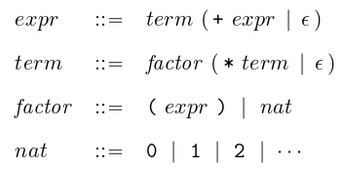

# Monads

## Organization

 1. We first discuss how to *use* existing monads.

 1. We then explain what monads are, how they work, and how to define new
    ones.

 1. Finally we discuss the parsing monad. Deliberately, this is a
    self-learning section, and so there are no video recordings for
    this section of the notes (corresponding to Chapter 13).

We'll use the following language "pragma" and imports, which we'll explain later:
```haskell
{-# LANGUAGE MonadComprehensions #-}

import Control.Monad.Writer
import Control.Monad.State

import Control.Applicative
import Data.Char
```

<a name="videolectures"></a>
## Video lectures

   * [Motivation for monads](https://bham.cloud.panopto.eu/Panopto/Pages/Viewer.aspx?id=b5efd83f-e13a-4e93-81ea-ac6d00c438de) (10min).

   * [The `Maybe` and list monads](https://bham.cloud.panopto.eu/Panopto/Pages/Viewer.aspx?id=594c51f2-c1c3-455d-b92c-ac6d00c4384b) (11min).

   * [Accounting for errors with the `Maybe` monad](https://bham.cloud.panopto.eu/Panopto/Pages/Viewer.aspx?id=8c5914d4-759a-4f1d-baee-ac6d00c438b0) (8min).

   * [Accounting for errors with the list monad](https://bham.cloud.panopto.eu/Panopto/Pages/Viewer.aspx?id=fee642ca-112d-47de-9d68-ac6d00c4a004) (8min).

   * [Producing a log of the computation with the `Writer` monad](https://bham.cloud.panopto.eu/Panopto/Pages/Viewer.aspx?id=fff1cb18-2267-44a5-818a-ac6d00c4d49c) (6min).

   * [Counting the number of recursive calls with the `State` monad](https://bham.cloud.panopto.eu/Panopto/Pages/Viewer.aspx?id=e3ea5ff5-1616-40a5-aeb9-ac6d00c53ed3) (13min).

   * [What monads are, how they work, and how to define new ones, how the list monad works](https://bham.cloud.panopto.eu/Panopto/Pages/Viewer.aspx?id=4cd39e86-9b25-4340-8836-ac6d00c5daab) (9min).

   * [How the `Maybe` monad works, and translating `do` notation to `>>=`](https://bham.cloud.panopto.eu/Panopto/Pages/Viewer.aspx?id=01e4469d-9d09-4694-82ba-ac6d00c62c61) (10min).

Total time 1:15hrs.

## Motivation

A video for this part is [available](https://bham.cloud.panopto.eu/Panopto/Pages/Viewer.aspx?id=b5efd83f-e13a-4e93-81ea-ac6d00c438de).

Consider the following Java program:
```java
class Factorial {

int fac (int n) {
  int y = 1;
  while (n > 1} {
   System.out.println("n = " + n);
   y = y * n;
   n--;
   }
  }
  return y;
}
```
This method computes the factorial of a number **and** it has a so-called side-effect, namely producing a printout of the changing value of `n`.

In Haskell, a function
```hs
fac :: Int -> Int
```
cannot have side-effects, by deliberate design. Functions are "pure", or free from side-effects. However, if we do want to have a side-effect, we can. We just need to change the type of the function to explicitly indicate this:
```hs
fac :: Int -> IO Int
fac n | n == 0    = pure 1
      | otherwise = do
                     putStrLn ("n = " ++ show n)
                     y <- fac (n-1)
                     pure (y * n)
```
We have that `IO` is a **monad**. Different monads account for different kinds of side-effects. It is also possible to combine monads, but we will not cover this subject in this module.

## Using monads

A video for this part is [available](https://bham.cloud.panopto.eu/Panopto/Pages/Viewer.aspx?id=594c51f2-c1c3-455d-b92c-ac6d00c4384b).

### Running example

Consider the following [Fibonacci](https://en.wikipedia.org/wiki/Fibonacci_number) function:
```haskell
fib :: Integer -> Integer
fib 0 = 0
fib 1 = 1
fib n = fib (n-2) + fib (n-1)
```
We have e.g.
```hs
*Main> fib 11
89
```
We rewrite the function `fib` in *monadic form* as follows, using `pure` and `do`:
```haskell
fibm :: Monad m => Integer -> m Integer
fibm 0 = pure 0
fibm 1 = pure 1
fibm n = do
          x <- fibm (n-2)
          y <- fibm (n-1)
          pure (x+y)
```
We'll use this example to illustrate various useful monads.

### The `Maybe` and list monads

Let's try to begin to understand what `fibm` does by trying it out:
```hs
*Main> fibm 11 :: Maybe Integer
Just 89
*Main> fibm 11 :: [Integer]
[89]
```
In these two examples, we used two different "monads", defined by
  * `m a = Maybe a`
  * `m a = [a]`

for any given type `a`, and then we considered `a = Integer`.

We have that
  * `pure x = Just x`
  * `pure x = [x]`

respectively.

We can specialize `fibm` to define the following two functions directly with the above two choices of `m`, which are inferred automatically by Haskell:
```haskell
fib_maybe :: Integer -> Maybe Integer
fib_maybe = fibm

fib_list :: Integer -> [Integer]
fib_list = fibm
```
The function `fib_list` can be equivalently written as follows using list comprehension notation instead:
```haskell
fib_list' :: Integer -> [Integer]
fib_list' 0 = pure 0 -- equivalent to [0]
fib_list' 1 = pure 1 -- equivalent to [1]
fib_list' n = [ x+y | x <- fib_list' (n-2), y <- fib_list' (n-1)]
```
In the case of lists, do-notation and list-comprehension notation are equivalent, and they "[desugar](https://en.wikipedia.org/wiki/Syntactic_sugar)" to the same code, as we will explain later.

In fact, thanks to the pragma `{-# LANGUAGE MonadComprehensions #-}` used above, the function `fibm` can be equivalently written as follows:
```haskell
fibm' :: Monad m => Integer -> m Integer
fibm' 0 = pure 0
fibm' 1 = pure 1
fibm' n = [ x+y | x <- fibm' (n-2), y <- fibm' (n-1)]
```
Although we find the list comprehension notation appealing, we'll stick to the equivalent `do` notation.

### What are monads good for?

What can we do with this monadic transformation `fibm` of the original function `fib`? One useful thing we can do is to specialize it to different monads and then make modifications to obtain different "effects".

### Accounting for errors with the `Maybe` monad

A video for this part is [available](https://bham.cloud.panopto.eu/Panopto/Pages/Viewer.aspx?id=8c5914d4-759a-4f1d-baee-ac6d00c438b0).

Our Fibonacci function is not defined for negative numbers, and we want to use `Nothing` to explicitly indicate the undefinedness. A direct way to do this is the following:
```haskell
fib1 :: Integer -> Maybe Integer
fib1 n | n <  0  = Nothing
       | n == 0  = Just 0
       | n == 1  = Just 1
       | n >= 2  = case fib1 (n-2) of
                     Nothing -> Nothing
                     Just x  -> case fib1 (n-1) of
                                  Nothing -> Nothing
                                  Just y  -> Just (x+y)
```
Notice that, because the function is recursive, we have to account for possible errors in the return values of recursive calls, explicitly propagating them. This is a nuisance and, moreover, makes the code hard to read. We adapt `fibm` to get a more transparent definition:
```haskell
fib1' :: Integer -> Maybe Integer
fib1' n | n <  0 = Nothing
        | n == 0 = pure 0
        | n == 1 = pure 1
        | n >= 2 = do
                     x <- fib1' (n-2)
                     y <- fib1' (n-1)
                     pure (x+y)
```
As we shall see, the functions `fib1` and `fib1'` desugar to the same code. The second one has the advantage of performing error propagation automatically. We'll see how this works [under the hood](https://www.definitions.net/definition/under+the+hood) later.

```hs
*Main> fib1' (-1)
Nothing
*Main> fib1' 11
Just 89
```

### Accounting for errors with the list monad

A video for this part is [available](https://bham.cloud.panopto.eu/Panopto/Pages/Viewer.aspx?id=fee642ca-112d-47de-9d68-ac6d00c4a004).

We use `[]` in place of `Nothing` and `[x]` in place of `Just x`. Our adopted textbook uses this trick often, to be able to use list comprehension notation instead of `do` notation without having to use the pragma `{-# LANGUAGE MonadComprehensions #-}` or explain monads.

```haskell
fib2 :: Integer -> [Integer]
fib2 n | n <  0 = []
       | n == 0 = pure 0
       | n == 1 = pure 1
       | n >= 2 = do
                    x <- fib2 (n-2)
                    y <- fib2 (n-1)
                    pure (x+y)
```
We get
```hs
*Main> fib2 (-1)
[]
*Main> fib2 11
[89]
```

### Printing while computing, for example for debugging

We use the `IO` monad when we want to perform input/output during the computation, in addition to deliver a result at the end:
```haskell
fib3 :: Integer -> IO Integer
fib3 n | n <  0 = error ("invalid input " ++ show n)
       | n == 0 = pure 0
       | n == 1 = pure 1
       | n >= 2 = do
                    putStrLn ("call with n = " ++ show n)
                    x <- fib3 (n-2)
                    y <- fib3 (n-1)
                    pure (x+y)
```
The function `putStrLn` is available only in the `IO` monad.

Now we can see that out general strategy for computing the Fibonacci function is very inefficient, as previous values of the function are computed again and again:
```hs
*Main> fib3 11
call with n = 11
call with n = 9
call with n = 7
call with n = 5
call with n = 3
call with n = 2
call with n = 4
call with n = 2
call with n = 3
call with n = 2
call with n = 6
call with n = 4
call with n = 2
call with n = 3
call with n = 2
call with n = 5
call with n = 3
call with n = 2
call with n = 4
call with n = 2
call with n = 3
call with n = 2
call with n = 8
call with n = 6
call with n = 4
call with n = 2
call with n = 3
call with n = 2
call with n = 5
call with n = 3
call with n = 2
call with n = 4
call with n = 2
call with n = 3
call with n = 2
call with n = 7
call with n = 5
call with n = 3
call with n = 2
call with n = 4
call with n = 2
call with n = 3
call with n = 2
call with n = 6
call with n = 4
call with n = 2
call with n = 3
call with n = 2
call with n = 5
call with n = 3
call with n = 2
call with n = 4
call with n = 2
call with n = 3
call with n = 2
call with n = 10
call with n = 8
call with n = 6
call with n = 4
call with n = 2
call with n = 3
call with n = 2
call with n = 5
call with n = 3
call with n = 2
call with n = 4
call with n = 2
call with n = 3
call with n = 2
call with n = 7
call with n = 5
call with n = 3
call with n = 2
call with n = 4
call with n = 2
call with n = 3
call with n = 2
call with n = 6
call with n = 4
call with n = 2
call with n = 3
call with n = 2
call with n = 5
call with n = 3
call with n = 2
call with n = 4
call with n = 2
call with n = 3
call with n = 2
call with n = 9
call with n = 7
call with n = 5
call with n = 3
call with n = 2
call with n = 4
call with n = 2
call with n = 3
call with n = 2
call with n = 6
call with n = 4
call with n = 2
call with n = 3
call with n = 2
call with n = 5
call with n = 3
call with n = 2
call with n = 4
call with n = 2
call with n = 3
call with n = 2
call with n = 8
call with n = 6
call with n = 4
call with n = 2
call with n = 3
call with n = 2
call with n = 5
call with n = 3
call with n = 2
call with n = 4
call with n = 2
call with n = 3
call with n = 2
call with n = 7
call with n = 5
call with n = 3
call with n = 2
call with n = 4
call with n = 2
call with n = 3
call with n = 2
call with n = 6
call with n = 4
call with n = 2
call with n = 3
call with n = 2
call with n = 5
call with n = 3
call with n = 2
call with n = 4
call with n = 2
call with n = 3
call with n = 2
89
```

*Puzzle.* We have seen an efficient implementation of this function using accumulators in [another handout](Data1.md#an-aside-on-accumulators). Here is another one, using infinite lists, also known as lazy lists, rather than functions
```haskell
fibs :: [Integer]
fibs = 0 : 1 : zipWith (+) fibs (tail fibs)
```
For example:
```hs
*Main> take 20 fibs
[0,1,1,2,3,5,8,13,21,34,55,89,144,233,377,610,987,1597,2584,4181]
*Main> fibs !! 100
354224848179261915075
*Main> fibs !! 1000
43466557686937456435688527675040625802564660517371780402481729089536555417949051890403879840079255169295922593080322634775209689623239873322471161642996440906533187938298969649928516003704476137795166849228875
```
These results are computed in a fraction of a second. Using our original approach, it is impossible to compute the 100th Fibonacci number before the sun becomes a red giant and fries the Earth, because it runs in exponential time.

### Producing a log of the computation with the `Writer` monad

A video for this part is [available](https://bham.cloud.panopto.eu/Panopto/Pages/Viewer.aspx?id=fff1cb18-2267-44a5-818a-ac6d00c4d49c).

We want to know the arguments of recursive calls, as above, but instead of printing them we want to collect them in a log, which will be a list of integers. We use the `Writer` monad and its associated function `tell` for that purpose,
```haskell
fib4 :: Integer -> Writer [Integer] Integer
fib4 n | n <  0 = error ("invalid input " ++ show n)
       | n == 0 = pure 0
       | n == 1 = pure 1
       | n >= 2 = do
                    tell [n]
                    x <- fib4 (n-2)
                    y <- fib4 (n-1)
                    pure (x+y)
```
To extract the result out of an element of the `Writer` monad, we use the function `runWriter`
```hs
*Main> runWriter (fib4 11)
(89,[11,9,7,5,3,2,4,2,3,2,6,4,2,3,2,5,3,2,4,2,3,2,8,6,4,2,3,2,5,3,2,4,2,3,2,7,5,3,2,4,2,3,2,6,4,2,3,2,5,3,2,4,2,3,2,10,8,6,4,2,3,2,5,3,2,4,2,3,2,7,5,3,2,4,2,3,2,6,4,2,3,2,5,3,2,4,2,3,2,9,7,5,3,2,4,2,3,2,6,4,2,3,2,5,3,2,4,2,3,2,8,6,4,2,3,2,5,3,2,4,2,3,2,7,5,3,2,4,2,3,2,6,4,2,3,2,5,3,2,4,2,3,2])
```

### Counting the number of recursive calls with the `State` monad

A video for this part is [available](https://bham.cloud.panopto.eu/Panopto/Pages/Viewer.aspx?id=e3ea5ff5-1616-40a5-aeb9-ac6d00c53ed3).

The state monad can simulate mutable variables of the kind available in imperative languages such as C, Java and Python. In our case the state will be an `Int` and the result will be an `Integer` as before. In recursive calls, we modify the state by adding one to the `Int`:
```haskell
fib5 :: Integer -> State Int Integer
fib5 n | n <  0 = error ("invalid input " ++ show n)
       | n == 0 = pure 0
       | n == 1 = pure 1
       | n >= 2 = do
                    modify (+1)
                    x <- fib5 (n-2)
                    y <- fib5 (n-1)
                    pure (x+y)
```
We use the function `runState` to initialize the state, with `0` in our case, and run the computation:
```hs
*Main> runState (fib5 11) 0
(89,143)
```
This means that the 11th Fibonacci number is 89, and that we incremented the counter 143 times, which measures the number of recursive calls.

### Using the state monad to get another algorithm for the Fibonacci function

Consider the following Java method to compute the `n`th Fibonacci number for non-negative `n` (which loops for ever if `n` is negative):
```java
static int fib (int n) {
  int x = 0;
  int y = 1;
  while (n != 0) {
    int tmp = x+y;
    x = y;
    y = tmp;
    n--;
  }
  return x;
}
```
We can simulate this by the following Haskell program using the state monad. We use a pair `(x,y)` for the state and we don't need the temporary variable `tmp`. The return type of the helper function `f` is `()`, because we are interested only in the state. The initial state is `(0,1)`.
```haskell
fib' :: Integer -> Integer
fib' n = x
 where
  f :: Integer -> State (Integer, Integer) ()
  f 0 = pure ()
  f n = do
         modify (\(x,y) -> (y, x+y))
         f (n-1)

  ((),(x,y)) = runState (f n) (0,1)
```
This is fast and efficient, and equivalent to the approach using accumulators discussed in [another handout](data.md#accum).
```hs
*Main> fib' 11
89
*Main> fib' 100
354224848179261915075
*Main> fib' 1000
43466557686937456435688527675040625802564660517371780402481729089536555417949051890403879840079255169295922593080322634775209689623239873322471161642996440906533187938298969649928516003704476137795166849228875
```

### Topics not discussed here

It is possible to combine monads, with monad transformers, in order to combine effects, such as errors given by the `Maybe` monad with `Nothing` and states `s` with the `State s` monad, among others.

## What monads are, how they work, and how to define new ones

A video for this part is [available](https://bham.cloud.panopto.eu/Panopto/Pages/Viewer.aspx?id=4cd39e86-9b25-4340-8836-ac6d00c5daab).

### The general definition of the `Monad` class

To define `Monad`, we need to define `Applicative` first, and in turn we have to define `Functor` before:

```hs
class Functor f where
 fmap :: (a -> b) -> f a -> f b

class Functor f => Applicative f where
 pure  :: a -> f a
 (<*>) :: f (a -> b) -> f a -> f b

class Applicative m => Monad m where
 return :: a -> m a
 (>>=)  :: m a -> (a -> m b) -> m b

 return = pure
```

### Example: the `list` monad

A video for this part is [available](https://bham.cloud.panopto.eu/Panopto/Pages/Viewer.aspx?id=4cd39e86-9b25-4340-8836-ac6d00c5daab).


The list type former has an instance in the `Functor` class, defined as follows:
```hs
instance Functor [] where
 fmap = map
```
Recall that is defined in the prelude and satisfies the following equations:
```hs
map :: (a -> b) -> [a] -> [b]
map f []     = []
map f (x:xs) = f x : map f xs
```
The list type former has an instance in the `Applicative` class, defined as follows:
```hs
instance Applicative [] where
 pure x = [x]
 gs <*> xs = [ g x | g <- gs, x <- xs]
```
Example. The following list has `2 * 5` elements:
```hs
*Main> [(+1),(*10)] <*> [1..5]
[2,3,4,5,6,10,20,30,40,50]
```
This applies the functions "add one" and "multiply by 10" to the list of numbers from 1 to 5.

Finally, the list monad is defined as follows:
```hs
(>>=) :: [a] -> (a -> [b]) -> [b]
xs >>= f = [y | x <- xs, y <- f x]
```

### Example: the `Maybe` monad

A video for this part is [available](https://bham.cloud.panopto.eu/Panopto/Pages/Viewer.aspx?id=01e4469d-9d09-4694-82ba-ac6d00c62c61).

The `Maybe` type former has an instance in the `Functor` class, defined as follows:
```hs
instance Functor Maybe where
 fmap g Nothing  = Nothing
 fmap g (Just x) = Just (g x)
```
The `Maybe` type former has an instance in the `Applicative` class, defined as follows:
```hs
instance Applicative Maybe where
 pure x = Just x
 Nothing <*> xm = Nothing
 Just g  <*> xm = fmap g xm
```
Examples:
```hs
*Main> Just (+1) <*> Nothing
Nothing
*Main> Just (+1) <*> Just 100
Just 101
*Main> Nothing <*> Just 100
Nothing
*Main> Nothing <*> Nothing
Nothing
```

Finally, the `Maybe` monad is defined as follows:
```hs
(>>=) :: Maybe a -> (a -> Maybe b) -> Maybe b
Nothing >>= f = Nothing
Just x  >>= f = f x
```

### Example: the `Writer` monad

The `Writer'` monad is already defined, and so we define our own version `Write'`.

```haskell
data Writer' a = Result a String
                deriving Show

instance Monad Writer' where
  return x = Result x ""
  xm >>= f = case xm of
               Result x s -> case f x of
                               Result y t -> Result y (s ++ t)

-- Boiler plate:

instance Functor Writer' where
  fmap f xm = do x <- xm
                 return (f x)

instance Applicative Writer' where
      pure = return
      fm <*> xm = do f <- fm
                     x <- xm
                     return (f x)
```
## Example: the `State` monad

The `State` monad is already defined, and so we define our own version `State'`.

The `State` monad lets us simulate variables in a storage. More abstractly, we have a state, and we can modify the state during the computation. If we are in a given state, we want to produce
 * a result, and
 * a new state.

The process that does that is called a *transition function*. So we
use the letter `T` for our constructor.

```haskell
data State' s a = T (s -> (a,s))
```
We will use letters
  * `x`, `y`, `z` for values of type `a`,
  * `u`, `v`, `w` for states of type `s`,
  * `p`, `q` for transition functions of type `s -> (a,s)`.

The destructor (the function opposite to the constructor `T`) is traditionally called `runState`:
```haskell
runState' :: State' s a -> (s -> (a, s))
runState' (T p) = p
```
Notice that it is not `State'` which is the monad, but rather `State' s` for a type `s` of states.
```haskell
instance Monad (State' s) where
  return x = T (\u -> (x,u))
  -- (>>=) :: State' s a -> (a -> State' s b) -> State' s b
  xm >>= f = case xm of
               T p -> T (\u -> case p u of
                                (x, v) -> case f x of
                                            T q -> q v)
```
 * The return function, given a value `x`, creates a transition function that doesn't change the current state `u`, and simply pairs `x` with it.

 * The bind function `>>=` is more complicated.

    * Given `xm :: State' s a` and `f :: a -> State' s b`, we need to produce something of type `State' s b`.
    * We first extract the transition function from `xm` using `case` (we could have used `runState'`). This is `p`.
    * Then, with the constructor `T`, we create the transition function of the result `State' s a`.
    * Starting with the state `u`, we apply `p` to `u`.
    * This gives a pair, which we inspect with a `case`.
    * The first thing is a value `x`, which we give to `f`.
    * `f` produces a transition function `q`, which which we pass the state `v`.

We again need the boiler-plate code according to the new-style definition of monads in Haskell:
```haskell
instance Functor (State' s) where
  fmap f xm = do x <- xm
                 return (f x)

instance Applicative (State' s) where
      pure = return
      fm <*> xm = do f <- fm
                     x <- xm
                     return (f x)
```
The above defines the monad. We also need to the define the three functions for side-effects.
This reads the state:
```haskell
get' :: State' s s
get' = T (\s -> (s,s))
```
This replaces the state by a given state:
```haskell
put' :: s -> State' s ()
put' s = T (\_ -> ((), s))
```
And this modifies the state by applying a function to it:
```haskell
modify' :: (s -> s) -> State' s ()
modify' f = T(\s -> ((), f s))
```

### Translating `do` notation to `>>=`

The `do` notation is really just syntax sugar for uses of `>>=`. For example, the above definition
```hs
fibm :: Monad m => Integer -> m Integer
fibm 0 = pure 0
fibm 1 = pure 1
fibm n = do
          x <- fibm (n-2)
          y <- fibm (n-1)
          pure (x+y)
```
desugars to
```haskell
fibm'' :: Monad m => Integer -> m Integer
fibm'' 0 = pure 0
fibm'' 1 = pure 1
fibm'' n = fibm'' (n-2) >>= (\x ->
           fibm'' (n-1) >>= (\y ->
           pure (x+y)))
```

For more details, see our adopted textbook and the website [All About Monads](https://wiki.haskell.org/All_About_Monads).


## Monadic Parsing

### What is a parser?
A _parser_ is a program that takes a string of characters as input, and produces some form of tree that makes the syntactic structure of the string explicit.

For example, the string 2*3+4 could be parsed into the following expression tree:

```hs
       +
      / \
     *   4
    / \
   2   3
```

The structure of this tree makes it explicit that `+` and `*` are operators with two arguments, and the `*` operator has higher precedence than `+`.

**Example Parsers**: Calculator program that parses numeric expressions, GHC system for parsing Haskell programs.

In Haskell, a parser can be viewed as a function that takes a string and produces a tree i.e. we can define a parser type:

```hs
type Parser = String -> Tree
```

In general, a parser may not consume all of its input string, therefore the unconsumed part of input string may be returned as well:

```hs
type Parser = String -> (Tree, String)
```

Similarly, a parser may not always succeed in parsing the input, therefore we can further generalise our type for parsers to return a list of results. The returned list can be empty to indicate failure or a singleton list to denote success.

```hs
type Parser = String -> [(Tree, String)]
```

Different parsers can return different kinds of trees such as an integer value, therefore it is better to make the return type into a parameter of the Parser type:

```hs
type Parser a = String -> [(a, String)]
```

The above declaration states that _a parser of type **a** is a function that takes an input string and produces a list of results, each of which is a pair comprising a result value of type **a** and an output string_.

### Basic Definitions

The following two standard libraries for applicative functors and characters will be used in the implementation of parser:

```hs
import Control.Applicative
import Data.Char
```

To allow the Parser type to be made into instances of classes, it is first redefined using newtype, with dummy constructor called **P**:

```haskell
newtype Parser a = P (String -> [(a, String)])
```

Parser of this type can then be applied to an input string using a function that simply removes the dummy constructor:

```haskell
parse :: Parser a -> String -> [(a, String)]
parse (P p) inp = p inp
```

Lets define our first parsing primitive function called `item`, which fails if the input string is empty and succeeds with the first character as the result value:

```haskell
item :: Parser Char
item = P (\inp -> case inp of
                     []     -> []
                     (x:xs) -> [(x,xs)])
```

The item parser is the basic building block from which all other parsers that consume characters from the input will be ultimately be constructed.

For example:
```hs
> parse item ""
[]

> parse item "abc"
[('a',"bc")]
```

### Sequencing and Making Choice between Parsers

We will now make the parser type an instance of the functor, applicative and monad classes, in order that the **do notation** can be used to combine parsers in sequence. We will also take into account that a parser may fail during parsing.

Lets make the `Parser` type into a functor:

```haskell
instance Functor Parser where
  -- fmap :: (a -> b) -> Parser a -> Parser b
  fmap g p = P (\inp -> case parse p inp of
                           []        -> []
                           [(v,out)] -> [(g v, out)])
```

That is, `fmap` applies a function to the result value of a parser if the parser succeeds, and propagates the failure otherwise.

For example:
```hs
> parse (fmap toUpper item) "abc"
[('A',"bc")]

> parse (fmap toUpper item) ""
[]
```

Now, we can make the `Parser` type into an applicative functor:


```haskell
instance Applicative Parser where
  -- pure :: a -> Parser a
  pure v = P (\inp -> [(v,inp)])

  -- <*> :: Parser (a -> b) -> Parser a -> Parser b
  pg <*> px = P (\inp -> case parse pg inp of
                   []         -> []
                   [(g, out)] -> parse (fmap g px) out)

```

Here the applicative function, `pure` transforms a value into a parser that always succeeds with this value as its result, without consuming any of the input string:

```hs
> parse (pure 1) "abc"
[(1,"abc")]
```

The applicative primitive <*> applies a parser that (1) returns a function to a parser that (2) returns an argument to give a parser that (3) returns the result of applying the function to the argument, and only succeeds if all of the components succeed. For example, a parser that consumes three characters, discards the second one and returns the first and third as a pair can now be defined in applicative style:

```hs
three :: Parser (Char,Char)
three = pure g <*> item <*> item <*> item
        where g x y z = (x, z)
```

For example:

```hs
> parse three "abcdef"
[(('a','c'),"def")]

> parse three "ab"
[]
```

Finally, we can make the `Parser` type into a monad:

```haskell
instance Monad Parser where
  -- (>>=) :: Parser a -> (a -> Parser b) -> Parser b
  p >>= f = P (\inp -> case parse p inp of
                          []        -> []
                          [(v,out)] -> parse (f v) out)
```

That is, the parser `p >>= f` fails if the application of the parser `p` to the input string `inp` fails, and otherwise applies the function `f` to the result value `v` to give another parser `f v`, which is then applied to the output string `out` that was produced by the first parser to give the final result.

We can now use the **do notation** to sequence parsers and process their result values. For example:

```hs
three :: Parser (Char,Char)
three = do x <- item
           item
           z <- item
           return (x,z)
```

**Note:** That the monadic function `return` is just another name for the applicative function `pure`, which in this case builds parsers that always succeed.

Another natural way of combining parsers is to apply one parser to the input string, and if this fails then apply another parser to the same input instead. In our case, we can apply the `empty`and choice operator `<|>` to implement this idea. The `empty` parser always fails regardless of the input string and the choice operator returns the result of the first parser if it succeeds on the input, and applies the second parser to the same input otherwise:

```haskell
instance Alternative Parser where
  -- empty :: Parser a
  empty = P (\inp -> [])

  -- (<|>) :: Parser a -> Parser a -> Parser a
  p <|> q = P (\inp -> case parse p inp of
                          []        -> parse q inp
                          [(v,out)] -> [(v,out)])
```

For example:

```hs
> parse empty "abc"
[]

> parse (item <|> return 'd') "abc"
[('a',"bc")]

> parse (empty <|> return 'd') "abc"
[('d',"abc")]
```

### Derived Primitives and Handling Spacing

Using the three basic parsers defined so far i.e. `item`, `return` and `empty`, as well as the sequencing and choice, we can now define other user useful parsers. For example, we can define the following parser `sat p` for single characters that satisfy a given predicate `p`:

```haskell
sat :: (Char -> Bool) -> Parser Char
sat p = do x <- item
           if p x then return x else empty
```

Similarly, we can now define the following parsers for single digits, lower-case letters, upper-case letters, arbitrary letters, alphanumeric characters and specific characters.

```haskell
digit :: Parser Char
digit = sat isDigit

lower :: Parser Char
lower = sat isLower

upper :: Parser Char
upper = sat isUpper

letter :: Parser Char
letter = sat isAlpha

alphanum :: Parser Char
alphanum = sat isAlphaNum

char :: Char -> Parser Char
char x = sat (==x)
```

For example:

```hs
> parse (char 'a') "abc"
[('a',"bc")]

> parse (char 'b') "abc"
[]
```

Using the `char`, we can define a parser `string xs` for the string of characters xs, with the string itself returned as the result value:

```haskell
string :: String -> Parser String
string []         = return []
string (x:xs)     = do char x
                       string xs
                       return (x:xs)
```

**Note:** The above string parser only succeeds if the entire target string is consumed from the input. For example:

```hs
> parse (string "abc") "abcdef"
[("abc","def")]

> parse (string "abc") "ab1234"
[]
```

We can also use the `many` and `some` parsers from the `Alternative` class definition. The `many p` and `some p` parsers apply the given parser `p` as many times as possible until it fails, with the result values from each successful application of `p` being return in a list. The `many` parser permits zero or more applications of `p` whereas the `some` requires at least one successful application. For example:

```hs
> parse (many digit) "123abc"
[("123","abc")]

> parse (many digit) "abc"
[("","abc")]

> parse (some digit) "abc"
[]
```

Now, we can define parsers for identifiers (variable names) comprising of a lower-case letter followed by zero or more alphanumeric characters, natural numbers comprising of one or more digits, and spacing comprising zero or more space, tab, and newline characters.

```haskell
ident :: Parser String
ident = do x <- lower
           xs <- many alphanum
           return (x:xs)

nat :: Parser Int
nat = do xs <- some digit
         return (read xs)

space :: Parser ()
space = do many (sat isSpace)
           return ()
```

For example:

```hs
> parse ident "abc def"
[("abc"," def")]

> parse nat "123 abc"
[(123," abc")]

> parse space "   abc"
[((),"abc")]
```

Using the `nat` parser, we can define a parser for integer values:

```haskell
int :: Parser Int
int = do char '-'
         n <- nat
         return (-n)
      <|> nat
```

For example:

```hs
> parse int "-123 abc"
[(-123," abc")]

> parse int "4567 abc"
[(4567," abc")]
```

#### Handling Spacing

Most real-life parsers allow spacing to be freely used around the basic tokens in their input string. For example, strings `1+2` and `1 + 2` are both parsed in the same way. We can define a new primitive that ignores any space before and after applying a parser for a token:

```haskell
token :: Parser a -> Parser a
token p = do space
             v <- p
             space
             return v
```

Using the `token`, we can now define parsers that ignore spacing around identifiers, natural numbers, integers and special symbols:

```haskell
identifier :: Parser String
identifier = token ident

natural :: Parser Int
natural = token nat

integer :: Parser Int
integer = token int

symbol :: String -> Parser String
symbol xs = token (string xs)

-- a parser for a non-empty list of natural numbers that ignores spacing
nats :: Parser [Int]
nats = do symbol "["
          n <- natural
          ns <- many (do symbol ","
                         natural)
          symbol "]"
          return (n:ns)
```

For example:

```hs
> parse nats "  [1, 2,  3]  "
[([1,2,3],"")]

> parse nats "  [ 1,   2,  3  ]  "
[([1,2,3],"")]

> parse nats "  [ 10,   2,  3  ]  "
[([10,2,3],"")]

> parse nats "  [ 10,   2,  34  ] "
[([10,2,34],"")]

> parse nats "  [ 10,   2  34  ] "
[]

> parse nats "  [ 10,   2,  ] "
[]
```

### Parsing Arithmetic Expressions

In this example, we consider arithmetic expressions that are built up from natural numbers using addition, multiplication and parentheses only. We assume that addition and multiplication associate to the right, and that multiplication has higher priority (precedence) than addition. For example, `2+3+4` means `2+(3+4)`, while `2*3+4` means `(2*3)+4`.

We can use a _grammar_ to describe the syntactic structure of any language, which is a set of rules that describes how strings of the language can be constructed. For example, a grammar for our language of arithmetic expressions can be written as:

```
expr ::= expr + expr | expr * expr | (expr) | nat
nat  ::= 0 | 1 | 2 | ...
```

We can construct the following _parse tree_ for the expression `2*3+4`, in which the tokens in the expression appear at the leaves, and the grammatical rules applied to construct the expression give rise to the branching structure:


```
                    expr
                  /  |   \
               expr  +   expr
             /  |  \      |
          expr  *  expr  nat
           |        |     |
          nat      nat    4
           |        |
           2        3
```

However, the above grammar also permits another possible parse tree for the same expression, which corresponds to the erroneous interpretation of the expression as `2*(3+4)`:

```
                    expr
                  /  |   \
               expr  *   expr
                |       /  |  \
               nat   expr  +  expr
                |     |        |
                2    nat      nat
                      |        |
                      3        4
```

The problem is that our grammar for expressions does not take account of the fact that multiplication has higher priority than addition. We can modify our grammar to have a separate rule for each precedence level i.e. addition at the lowest, multiplication at the middle and parentheses and numbers at the highest level.

```
expr   ::= expr + expr | term
term   ::= term * term | factor
factor ::= (expr) | nat
nat    ::= 0 | 1 | 2 | ...
```
Using this grammar, we can produce only a single parse tree for the expression `2*3+4`, which corresponds to the correct interpretation of the expression as `(2*3)+4`:

```
                    expr
                  /  |   \
              expr   +   expr
                |          |
              term        term
             /  |  \       |
          term  *  term  factor
           |        |      |
         factor   factor  nat
           |        |      |
          nat      nat     4
           |        |
           2        3
```

This grammar still does not take into account that addition and multiplication associate to the right. For example, the expression `2+3+4` as two possible parse trees, corresponding to `(2+3)+4` and `2+(3+4)`. We can easily rectify this by modifying the rules for addition and multiplication and make them recursive in their right arguments:

```
expr   ::= term + expr | term
term   ::= factor * term | factor
factor ::= (expr) | nat
nat    ::= 0 | 1 | 2 | ...
```

Using the new grammar, the expression `2+3+4` is parsed correctly and we have only a single possible parse tree, which corresponds to the correct interpretation of the expression i.e. `2+(3+4)`:

```
                    expr
                  /  |   \
              term   +   expr
                |       /  |  \
              factor term  +  expr
                |      |       |
               nat   factor   term
                |      |       |
                2     nat    factor
                       |       |
                       3      nat
                               |
                               4
```

The above grammar is _unambiguous_, in the sense that every well-formed expression has precisely one parse tree. We will now simplify our grammar, as some of the expressions in our grammar have common elements. For example, the rule `expr   ::= term + expr | term`, which states that an expression is either the addition of a term and an expression, or is a term. In other words, an expression always begins with a term, which can then be followed by the addition of an expression or by nothing.



The above grammar can now be translated into a parser for expressions, by simply rewriting the rules using parsing primitives:

```haskell
expr :: Parser Int
expr = do t <- term
          do symbol "+"
             e <- expr
             return (t + e)
           <|> return t

term :: Parser Int
term = do f <- factor
          do symbol "*"
             t <- term
             return (f * t)
           <|> return f

factor :: Parser Int
factor = do symbol "("
            e <- expr
            symbol ")"
            return e
          <|> natural
```

**Note:** The above parsers return the integer value of the expression that was parsed, rather than some form of expression tree.

Finally, using `expr` we define a function that returns the integer value that results from parsing and evaluating an expression. Unconsumed and invalid inputs result in error messages and program termination:

```haskell
eval :: String -> Int
eval xs = case parse expr xs of
             [(n,[])]  -> n
             [(_,out)] -> error ("Unused input " ++ out)
             []        -> error "Invalid input"
```

For example:

```hs
> eval "2*3+4"
10

> eval "2+3*4+2"
16

> eval "(2+3)*(4+2)"
30

> eval "one plus two"
*** Exception: Invalid input
```
