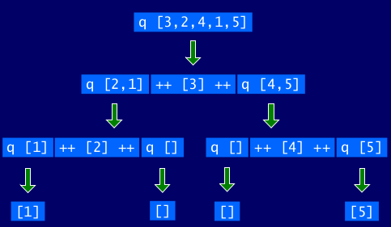

# Recursive Functions

These notes should be read in conjunction with chapter 6 of our textbook Programming in Haskell.

* We discuss some examples from the [Haskell'98 standard prelude](https://www.haskell.org/onlinereport/standard-prelude.html) for pedagogical purposes.

* See the [prelude for the current version of the language](https://hackage.haskell.org/package/base-4.12.0.0/docs/Prelude.html) for all predefined classes and their instances.


## Basic Concepts

There is also a [video](https://bham.cloud.panopto.eu/Panopto/Pages/Viewer.aspx?id=48fbd212-bfcd-4f05-9630-ac4f012526fb) on this section.

As we have seen, many functions can naturally be defined in terms of other functions. For example, a function that returns the factorial of a non-negative integer can be defined by using library functions to calculate the product of the integers between one and the given number:

```hs
fac :: Int -> Int
fac n = product [1..n]
```

Expressions are evaluated by a stepwise process of applying functions to their arguments.

For example:

```hs
fac 5
= product [1..5]
= product [1,2,3,4,5]
= 1*2*3*4*5
= 120
```

In Haskell, functions can also be defined in terms of themselves. Such functions are called __recursive__.

```haskell
fac :: Int -> Int
fac 0 = 1
fac n = n * fac (n-1)
```
The function __fac__ maps 0 to 1 (_base case_), and any other integer to the product of itself and the factorial of its predecessor (_recursive case_).

For example:

```hs
fac 3
= 3 * fac 2
= 3 * (2 * fac 1)
= 3 * (2 * (1 * fac 0))
= 3 * (2 * (1 * 1))
= 3 * (2 * 1)
= 3 * 2
= 6
```

Note:

* fac 0 = 1 is appropriate because 1 is the identity for multiplication: 1 * x = x = x * 1.

* The recursive definition diverges on integers < 0 because the base case is never reached:

```hs
> fac (-1)
*** Exception: stack overflow
```

### Why is Recursion Useful?

* Some functions, such as factorial, are simpler to define in terms of other functions.

* As we shall see, however, many functions can naturally be defined in terms of themselves.

* Properties of functions defined using recursion can be proved using the simple but powerful mathematical technique of _induction_.

## Recursion on Lists

There is also a [video](https://bham.cloud.panopto.eu/Panopto/Pages/Viewer.aspx?id=8f28b057-a77c-4b81-8769-ac4f01252b5a) on this section.

Recursion is not restricted to numbers, but can also be used to define functions on lists.

```haskell
product' :: Num a => [a] -> a
product' []     = 1
product' (n:ns) = n * product' ns
```

The `product'` function maps the empty list to 1 (_base case_), and any non-empty list to its head multiplied by the `product'` of its tail (_recursive case_).

For example:

```hs
product' [2,3,4]
= 2 * product' [3,4]
= 2 * (3 * product' [4])
= 2 * (3 * (4 * product' []))
= 2 * (3 * (4 * 1))
= 24
```

Note: Lists in Haskell are actually constructed one element at a time using the __cons__ operator. Hence, [2,3,4] is just an abbreviation for 2:(3:(4:[])).

Using the same pattern of recursion as in `product'` we can define the length function on lists.

```hs
length :: [a] -> Int
length []     = 0
length (_:xs) = 1 + length xs
```

The length function maps the empty list to 0 (_base case_), and any non-empty list to the successor of the length of its tail (_recursive case_).

For example:

```hs
length [1,2,3]
= 1 + length [2,3]
= 1 + (1 + length [3])
= 1 + (1 + (1 + length []))
= 1 + (1 + (1 + 0))
= 3
```

Using a similar pattern of recursion we can define the reverse function on lists.

```hs
reverse :: [a] -> [a]
reverse []     = []
reverse (x:xs) = reverse xs ++ [x]
```

The function reverse maps the empty list to the empty list, and any non-empty list to the reverse of its tail appended to its head.

For example:

```hs
reverse [1,2,3]
= reverse [2,3] ++ [1]
= (reverse [3] ++ [2]) ++ [1]
= ((reverse [] ++ [3]) ++ [2]) ++ [1]
= (([] ++ [3]) ++ [2]) ++ [1]
= [3,2,1]
```

Interestingly, the append opearator ++ used in the above example can also be defined using recursion. 

```hs
(++) :: [a] -> [a] -> [a]
[]     ++ ys = ys
(x:xs) ++ ys = x : (xs ++ ys)
```

For example:

```hs
[1,2,3] ++ [4,5]
= 1 : ([2,3] ++ [4,5])
= 1 : (2 : ([3] ++ [4,5]))
= 1 : (2 : (3 : ([] ++ [4,5])))
= 1 : (2 : (3 : [4,5]))
= [1,2,3,4,5]))
```

The recursive definition of ++ formalises the idea that two lists can be appended by copying elements from the first list until it is exhausted, at which point the second list is joined-on at the end.

## Multiple Arguments

There is also a [video](https://bham.cloud.panopto.eu/Panopto/Pages/Viewer.aspx?id=dcc491f3-e715-4223-a9b7-ac4f01252e28) on this section.

Functions with more than one argument can also be defined using recursion. 

* Zipping the elements of two lists:

```hs
zip :: [a] -> [b] -> [(a,b)]
zip []     _      = []
zip _      []     = []
zip (x:xs) (y:ys) = (x,y) : zip xs ys
```
For example:

```hs
zip ['a', 'b', 'c'] [1,2,3,4]
= ('a',1) : zip ['b', 'c'] [2,3,4]
= ('a',1) : ('b',2) : zip ['c'] [3,4]
= ('a',1) : ('b',2) : ('c',3) : zip [] [4]
= ('a',1) : ('b',2) : ('c',3) : []
= [('a',1), ('b',2), ('c',3)]
```

* Remove the first n elements from a list:

```hs
drop :: Int -> [a] -> [a]
drop 0 xs     = xs
drop _ []     = []
drop n (_:xs) = drop (n-1) xs
```
For example:

```hs
drop 3 [4,6,8,10,12]
= drop 2 [6,8,10,12]
= drop 1 [8,10,12]
= drop 0 [10,12]
[10,12]
```

## Multiple Recursion

There is also a [video](https://bham.cloud.panopto.eu/Panopto/Pages/Viewer.aspx?id=1ebd39f3-edad-4c4d-b777-ac4f01253209) on this section.

Functions can also be defined using _mulitple recursion_, in which a function is applied more than once in its own definition.

A function that calculates the nth Fibonacci number (0, 1, 1, 2, 3, 5, 8, 13, ...) for any integer n >= 0 can be defined using double recursion as follows:

```haskell
fib :: Int -> Int
fib 0 = 0
fib 1 = 1
fib n = fib (n-2) + fib (n-1)
```

For example:

```hs
fib 4
= fib (2) + fib (3)
= fib (0) + fib (1) + fib (1) + fib (2)
= 0 + 1 + 1 + fib (0) + fib (1)
= 0 + 1 + 1 + 0 + 1
= 3
```

## Mutual Recursion

There is also a [video](https://bham.cloud.panopto.eu/Panopto/Pages/Viewer.aspx?id=88804dd0-9656-4969-af7d-ac4f01253d4c) on this section.

Functions can also be defined using _mutual recursion_, where two or more functions are defined recursively in terms of each other. For non-negative integers, we can define even and odd numbers using mutual recursion.

```hs
even :: Int -> Bool
even 0 = True
even n = odd (n-1)

odd :: Int -> Bool
odd 0 = False
odd n = even (n-1)
```

For example:

```hs
even 4
= odd 3
= even 2
= odd 1
= even 0
= True
```

Similarly, functions that select the elements from a list at all even and odd positions (counting from zero) can be defined as follows:

```haskell
evens :: [a] -> [a]
evens []     = []
evens (x:xs) = x : odds xs

odds :: [a] -> [a]
odds []     = []
odds (_:xs) = evens xs
```
For example:

```hs
evens "abcde"
= 'a' : odds "bcde"
= 'a' : evens "cde"
= 'a' : 'c' : odds "de"
= 'a' : 'c' : evens "e"
= 'a' : 'c' : 'e' : odds []
= 'a' : 'c' : 'e' : []
= "ace"
```

## Programming Example - Quicksort

There is also a [video](https://bham.cloud.panopto.eu/Panopto/Pages/Viewer.aspx?id=e818b628-dc42-4b7f-96ca-ac4f012557da) on this section.

The quicksort algorithm for sorting a list of values can be specified by the following two rules:

* The empty list is already sorted;

* Non-empty lists can be sorted by sorting the tail values <= the head, sorting the tail values > the head, and then appending the resulting lists on either side of the head value.

Using recursion, this specification can be translated directly into an implementation:

```haskell
qsort :: Ord a => [a] -> [a]
qsort []     = []
qsort (x:xs) = qsort smaller ++ [x] ++ qsort larger
               where
                 smaller = [a | a <- xs, a <= x]
                 larger  = [b | b <- xs, b > x]
```
Note: This is probably the simplest implementation of quicksort in any programming language!

For example (abbreviating qsort as q):



## Advice on Recursion

There is also a [video](https://bham.cloud.panopto.eu/Panopto/Pages/Viewer.aspx?id=a733c6a0-01c7-4769-95f0-ac4f01256f33) on this section.

In this section, we offer some advice for defining functions in general, and recursive functions in particular, using a five-step process.

Example - drop: that removes a given number of elements from the start a list.

* Step 1: define the type

The drop function takes an integer and a list of values of some type a, and produces another list of such values.

```hs
drop :: Int -> [a] -> [a]
```
We have already made four design decisions in defining this type:

(i) using integers rather than a more general numeric type - for simiplicity

(ii) using currying rather than taking arguments as a pair - for flexibility

(iii) supplying the integer argument before the list argument - for readability (_drop_ __n__ _elements from_ __xs__)

(iv) making the function _polymorphic_ in the type of the list elements - for generality.

* Step 2: enumerate the cases

We have a total of four possible cases i.e. two possible values for integer argument (0 and n) and two possibilities for the list argument ([] and (x:xs)) thus giving us four possible combinations (cases). 

```hs
drop 0 []     = 
drop 0 (x:xs) = 
drop n []     = 
drop n (x:xs) = 
```

* Step 3: define the simple cases

By definition, removing zero elements from the start of any list gives the same list.

```hs
drop 0 []     = []
drop 0 (x:xs) = x:xs
drop n []     = 
drop n (x:xs) = 
```

Attempting to remove one or more elements from the empty list is invalid, so the third case could be omitted, which would result in an error being produced if this situation arises. However, we choose to avoid the production of an error by returning the empty list in this case:

```hs
drop 0 []     = []
drop 0 (x:xs) = x:xs
drop n []     = []
drop n (x:xs) = 
```

* Step 4: define the other cases

For removing one or more elements from a non-empty list, we drop the head of the list and recursively call itself with one less than the previous call on the tail of the list.

```hs
drop 0 []     = []
drop 0 (x:xs) = x:xs
drop n []     = []
drop n (x:xs) = drop (n-1) xs
```
* Step 5: generalise and simplify

The first two equations for drop can be combined into a single equation that states that removing zero elements from any list gives the same list:

```hs
drop 0 xs     = xs
drop n []     = []
drop n (x:xs) = drop (n-1) xs
```

The variable n in the second equation and x in the third can be replaced by the wildcard pattern \_, as these variables are not being used in the bodies of their equations.

```hs
drop :: Int -> [a] -> [a]
drop 0 xs     = xs
drop _ []     = []
drop n (_:xs) = drop (n-1) xs
```
This is precisely the same definition of drop function as available in the standard prelude.

## Exercises

(1) Without looking at the standard prelude, define the following library functions using recursion:

* Decide if all logical values in a list are true:

```hs
and :: [Bool] -> Bool
```
* Concatenate a list of lists:

```hs
concat :: [[a]] -> [a]
```
* Produce a list with n identical elements:

```hs
replicate :: Int -> a -> [a]
```

* Select the nth element of a list:

```hs
(!!) :: [a] -> Int -> a
```

* Decide if a value is an element of a list:

```hs
elem :: Eq a => a -> [a] -> Bool
```

(2) Define a recursive function

```hs
merge :: Ord a => [a] -> [a] -> [a]
```
that merges two sorted lists of values to give a single sorted list. 

For example:

```hs
> merge [2,5,6] [1,3,4]
[1,2,3,4,5,6]
```
