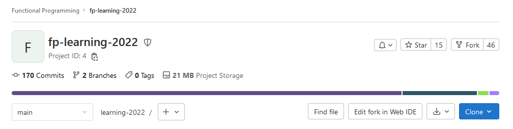

# Contributing

This document covers contributing to the Gitlab repository. It will primarily use the Git CLI but other means of contributing (such as the use of Github Desktop, GitKraken, etc.) are entirely possible and welcome.

## Contents
- [Forking the project](#forking-the-project)
- [Making changes in Gitlab](#making-changes-in-gitlab)
- [Cloning the project locally](#cloning-the-project-locally)
  - [Telling Git who you are](#telling-git-who-you-are)
  - [Changing branches](#changing-branches)
  - [Committing Changes](#committing-changes)
- [Creating a Merge Request](#creating-a-merge-request)

## Forking the project
The first thing you will need to do is fork the project so you can make your own changes without having to modify the main project. 

To start, navigate to the home page for [Functional Programming 2022](https://git.cs.bham.ac.uk/fp/learning-2022), so you will see something similar to the following.



To the right of that, you will see a button "Fork". Just click on that, and you can start the process of forking the project.
- The project name can be kept the same.
- When selecting the project URL, select the namespace matching your university tag (e.g. abc123).
- The project slug can be kept the same. If you change it, please 
- You can enter a project description if you wish.
- Set the visibility level to Internal at a minimum.

From there, just click "Fork project" at the bottom, and you'll have the project forked successfully.

## Making changes in Gitlab
If you're correcting a minor typo or making changes that you don't think warrant cloning the project, you can just click on a file you want to change in your forked project, "Open in Web IDE", and make the changes you need. Gitlab already provides you with a convenient IDE so there's not much else you need.

Once corrected and set up, just click the "Create Commit" button at the bottom left of the page, add your commit message, and proceed to push your changes to the branch you want.

> For best practice, you generally want a branch dedicated to each change you want to make. For example, for creating this guide, I used `doc/contribution-guide`, others may use `week-3/book-link-typo`, or just `correct-typos`. To avoid spamming, you would want to try and lump vaguely similar tasks together, such as correcting multiple typos or broken links. If you want to extend on a specific set of lecture notes, have a branch for that, but if you want to correct a typo separately, have a different branch for that.

## Cloning the project locally
To clone the project, you will need the Git CLI itself, or UI software like [Sourcetree](https://www.sourcetreeapp.com/). This will be using the Git CLI.

> If you are cloning the project into Jupyter, you will need to create a separate folder to clone your project into if your project slug stayed the same, or it will attempt to clone it into your existing learning folder.

Once you are in the folder where you want to clone the project, navigate to your version of the Gitlab project, and click on the "Clone" button. This will give you two strings for cloning: one for SSH and one for HTTPS. You can use either of these, but cloning with HTTPS will require a Personal Access Token. See more about this [here](https://git.cs.bham.ac.uk/help/gitlab-basics/start-using-git#clone-with-https).

Once copied, open your Git CLI (such as Git Bash, or just the terminal) and run the `git clone` command:

```
[1000630000@jupyterhub-nb-abc123 learning-fork]$ git clone git@git.cs.bham.ac.uk:abc123/learning-2022.git
```

The string used is for SSH cloning.

Once done, `cd` into your new repository (`cd learning-2022` if you kept the project slug the same), and you will have your fork project files in there.

### Telling Git who you are
Prior to pushing changes locally, Git will need to know who you are. To do this, run the `git config` commands to set your name and email:
```
[1000630000@jupyterhub-nb-abc123 learning-2022]$ git config user.name "Jane Doe"
[1000630000@jupyterhub-nb-abc123 learning-2022]$ git config user.email "abc123@student.bham.ac.uk"
```
> If you are doing this in Jupyter, you can add the `--global` flag, e.g. `git config --global user.name "Jane Doe"`, with the same done for the email.

### Changing branches
If you've created a branch dedicated to changes you're making, run the command `git checkout branch-name` to switch to it, e.g. `git checkout doc/contribution-guide`. Note that any changes you make will have to be changed or committed prior to running checkout.

### Committing Changes
After you've made the changes you want, you can start making commits to your fork.

To do this, add the files you have changed using `git add <File Name>` (or `git add .` to add every change):
```
[1000630000@jupyterhub-nb-abc123 learning-2022]$ git add CONTRIBUTING.md
```
Once done, create a commit and add a message:
```
[1000630000@jupyterhub-nb-abc123 learning-2022]$ git commit -m "Updated the contributing guide"
```
And then, just go and push your changes to your branch:
```
[1000630000@jupyterhub-nb-abc123 learning-2022]$ git push
```

## Creating a Merge Request
Once done, you can create a merge request for review by the module team.

From now, go back to the original [Functional Programming repository](https://git.cs.bham.ac.uk/fp/learning-2022), and under the dropdown to your left, click "Merge Requests".

At the top of the page, there should be a widget saying "You pushed to \<Branch Name> at Jane Doe/fp-learning-2022" or similar. You can just create a Merge Request using that button. 

When setting the title and description of the merge request, ensure that:
- Your title immediately says what you are adding/changing,
- The description goes into further detail about what your merge request is for.

You can have the source branch deleted when creating the merge request. If you have several smaller commits, you can squash these into a single commit when creating the merge request.

If you wish to allow the module team to make changes to your request, keep "Allow commits from members who can commit to the target branch" ticked.

And from there, once the merge request is created, congratulations! You've made a merge request. The module team will proceed to review it and provide you with any feedback they need to provide.
