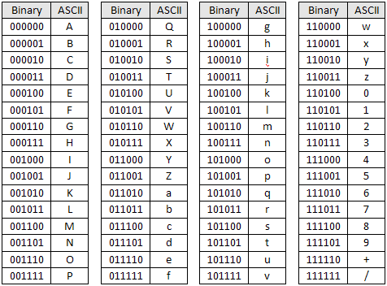
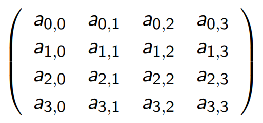
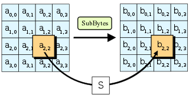
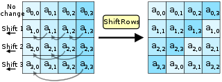
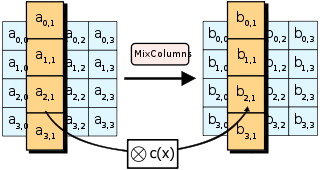
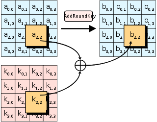
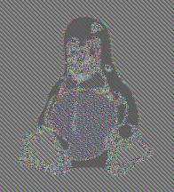

- [Security and Networks Note](#security-and-networks-note)
  - [Cryptography](#cryptography)
    - [Codes Versus Ciphers](#codes-versus-ciphers)
    - [Symmetric Cryptography](#symmetric-cryptography)
      - [Advanced Encryption Standard(AES)](#advanced-encryption-standardaes)
        - [SubBytes: S-box](#subbytes-s-box)
        - [ShiftRows](#shiftrows)
        - [MixColumn](#mixcolumn)
        - [AddRoundKey](#addroundkey)
        - [Key Schedule](#key-schedule)
        - [Security of AES](#security-of-aes)
      - [Data Encryption Standard(DES)](#data-encryption-standarddes)
      - [Padding](#padding)
      - [Block Cipher Modes](#block-cipher-modes)
  - [Access Control](#access-control)
  - [Introduction to Networking](#introduction-to-networking)
  - [Security Protocols](#security-protocols)
  - [Web Systems and Attacks](#web-systems-and-attacks)
  - [Other Common Attacks and Defenses](#other-common-attacks-and-defenses)

# Security and Networks Note

- What is Computer Security?
  - Correctness and Efficient algorithms against an attacker
  - Decide on your assets: Information and Infrastructure
    - Sensitive Data
    - Control Systems
    - Hardware devices
  - How do you safeguard: security goal, estimate impact of attacks, and design mitigations
  - Analyse systems, spot vulnerabilities, build protection

- Information Security
  - Aims
    - **Confidentiality**: Attacker should not retrieve any information
    - **Integrity and Authenticity**: Received data is authentic and the sender is genuine.
    - **Availability**: Data should accessible on demand
  - Potential Attackers
    - **Hackers**: Potentially learning by running known attacks, exploting vulnerabilities
    - **Criminals**: Take control of computers via bugs in softwares. Phishing attacks, Denial of Service(DoS attacks)
    - **Governments**: Extreme computing powers,control on resources(wiretaps)
    - **Business Houses like ISPs**: Spying to sell your data

> - Some Known Attacks
>   - Ransomware
>   - Phishing

## Cryptography

- Cryptography describes how to transfer messages between participants without anyone else being able to read or modify them
- Prerequisite for computer Security
- Start module with explaining th basics of cryptography(enough to understand how TLS works; for more details see cryptography module)
- Before we start with Cryptography, need to look at how to represent data

### Codes Versus Ciphers

- Codes vs. Ciphers
  - A code is any way to represent data.  
    Will use bitstrings (sequence of bits) to represent data.
    Examples: Morese Code, ASCII, Hex Base64
  - A cipher is a code where it is difficult to derive data from code
    - Almost always uses a key
    - Data for a cipher usually called *plain text*. encoding called *cipher text*
    - Function from plain text to cipher text called *encryption*
    - Function from cipher text to plain text called *decryption*

- ASCII  
  

- Base64  
  

- Caesar Cipher
  - The Caesar Cipher replaces each letter of the alphabet with one three to the right
    - a becomes d
    - b becomes e
    - ...
    - z becomes c
  - Use a key
    - **Kerckhoffs' principle**: A cipher should be secure even if the attacker knows everything about it apart from the key
    

- Frequency Analysis
  - While hard to break by brute force, replacing each letter with another is easy to break using frequency analysis
  - Frequency analysis counts the number of times
    - each symbol occurs
    - each pair of symbols
    - etc.
    and tries to draw conclusions from this

- Summary
  - Code is any binary representation of data; cipher is a code where it is difficult to derive data from code
  - Looked at various codes, including Hex
  - Looked at substitution ciphers, which replace single letters. These are easily breakable

### Symmetric Cryptography

- Overview
  - Will now look at proper encryption schemes
  - Assumption: All participants share common secret key
  - Will consider most important encryption shemes
  - Need some mathematical prerequisites to explain encryption schemes(modular arithmetic)

- Modular Arithmetic
  - Arithmetic modulo n means that you count up to n-1 then loop back to 0
  - i.e., 0, 1, 2, ..., n-1, 0, 1, 2, ...
  - a mod b = r for largest whole number k such that a = b*k + r
  - e.g. 9 mod 4 = 1 because 9 = 2 * 4 + 1

- xor
  - xor(⊕) is binary addition modulo 2;  
    > 0 ⊕ 0 = 0  
    > 1 ⊕ 0 = 1  
    > 0 ⊕ 1 = 1  
    > 1 ⊕ 1 = 0  
  - xor on bitstrings of same length defined by applying xor to corresponding bits
  - Important properties
    - xor is associative and commutative
    - for all bitstrings M, M ⊕ 0 = M
    - for all bitstrings M, M ⊕ M = 0
    > where 0 is a bitstring of all 0's of the appropriate length

- One time Pads
  - Needs a key as long as the message
  - XOR/add the key and the message:  
    (Demonstrated here with strings and addition and subtraction of keys; for bitstrings use xor)
  > Message     : HELLOALICE  
  > Key         : THFLQRZFJK  
  > Cipher text : ALRWERKNLO  
  - Have perfectexryption:  
    You don't learn anything about the plaintext from the ciphertext
  > Theorem:  
  > Given any ciphertext of a certain length, without knowing the key the probability of the ciphertext being the encryption of a plaintext of the same length is the same for all plaintexts of the same length as the ciphertext
  - Problem
    - The key needs to be as long as the message
    - Must use key only once

- Block Ciphers
  - Modern ciphers work on blocks of plain text, not just a single symbol
  - They are made up of a series of permutations and substitutions repeated on each block
  - The key controls the exact nature of the permutations and subsitutions

#### Advanced Encryption Standard(AES)

- AES is a state-of-the art block cipher
- It works on blocks of 128-bits
- It generates *10 round* keys from a signle 128-bit key
- It uses one permutation: ShiftRows and three substitutions SubBytes, MixColumns, AddRoundKey
> A block of 128 bits is represented by a 4x4-matrix where each matrix element is a byte(8 bits), written as  
> 

##### SubBytes: S-box

- SubByte is an operation on bytes using finite field arithmetic
- Use the S-box to transfer the original data to new data

  

##### ShiftRows

- ShiftRows moves the 
  - 2nd row one byte to the left
  - the 3rd row two bytes
  - and the 4th row 3 bytes

  

##### MixColumn

- MixColumn is substitution of each column such that
  - (a0x3+a1x2+a2x+a3)x(3x3+x2+x+2) mod (x4 + 1) = (b0x3+b1x2+b2x+b3)
  - It is matrix mutiplication for the column(cipher key will not be used)**(It is a constant matrix)**

  

##### AddRoundKey

- AddRoundKey applies ⊕ to the block and the 128-bit round key(which was generated from the main key)

  

##### Key Schedule

1. RotWord: Rotates a 32 bit word(last column)
2. SubWord: Substitutes a 32 bit word using the AES S-Box
3. Round Constants: Round Constants are generated using a recursive function(10 round functions! They are constant)
4. AddRoundKey: add round key for each column

##### Security of AES

- No formal proof of security(P = NP?) but best known cryptographic aatack requires 2126 key guesses - an (irrelevant) improvement of factor 4 compared to 2128 guesses via brute force attack
- There are side channel attacks(eg via measuring power consumption, execution time)
- Key aspects of security:
  - Shuffling of rows and columns to ensure small change in input causes very big chage in output
  - Require at least one non-linear operation(in the sense of linear algebra) on the data

#### Data Encryption Standard(DES)

- The data Encryption Standard(DES), was the previous standard
- Before it was accepted as a standard the NSA stepped in and added S-boxes and fixed the key length at 56 bits
- S-boxes are a type of substitution

#### Padding

- Block ciphers only work on fixed size blocks.
- If the message isn’t of the right block size we need to pad themessage.
- But receiver needs to tell the difference between the padding and message.

- PKCS5/7
  - If there is 1 byte of space write 01
  - If there are 2 byte of space write 0202
  - If there are 3 byte of space write 030303
  - · · ·
  - If the message goes to the end of the block add a new block of 16161616..
- PKCS 7: 16 byte block, PKCS 5: 8 byte block

#### Block Cipher Modes

- Block Ciphers can be used in a number of modes:
  1. Electronic codebook mode(ECB)
     - Each bloack is encrypted individually
     - Encrypted blocks are assembled in the same order as the plain text blocks
     - if blocks are repeated in the plain text, this is revealed by the cipher text  

      

  2. Cipher Block Chaining Mode(CBC)
     - - each block XOR'd with previous block
       - Start with a random Initialization Vector(IV)
       - helps overcome replay atttack
     - Suppose the plain text is B1, B2, .., Bn  
        IV = random number (sent in the clear)  
        C1 = encrypt(B1 ⊕ IV)  
        C2 = encrypt(B2 ⊕ C1)  
        ...  
        Cn = encrypt(Bn ⊕ Cn-1)  

      %20mode.png)

      - CBC decrypt
        - Receive IV
        - Receive cipher text C1, C2, . . . , Cn
        - Plain text is B1, B2, . . . , Bn, where  
          B1 = decrypt(C1) ⊕ IV  
          B2 = decrypt(C2) ⊕ C1  
          · · ·  
          Bn = decrypt(Cn) ⊕ Cn−1  

      %20mode_decrypt.png)

      - Probabilistic Encryption
        - Probabilistic encryption schemes use random elements to make every encryption different.
        - CBC with a random IV is a good way to make encryption probabilistic.
        - Using CBC and random IVs lets me encrypt the same message, and with the same key, without an attacker realising.  
  
      

  3. Counter Mode(CTR)
      - Suppose the plain text is B1, B2, .., Bn  
      - IV = random number (sent in the clear)  
      - Cipher text: C1, C2, ..., Cn where  
        C1 = B1 ⊕ encrypt(IV)  
        C2 = B2 ⊕ encrypt(IV + 1)  
        ...  
        Cn = Bn ⊕ encrypt(IV + n - 1)  

      %20mode%20encryption.png)

      %20mode%20decryption.png)

      - Cipher Texts Can Be Altered
        - AES encryption with a particular key maps any 128-bit blockto a 128-bit block (or 256)
        - AES decrypt also maps any 128-bit block to a 128-bit block.
        - Decrypt can be run on any block (not just encryptions).
      - Known Plain Text Attacks
        - If I know the plaintext I can change CTR encrypted messages
        - eg If I know EncCTR(M1) and I know M1, I can make a ciphertext that decrypts to any message I want, eg M2
        - New ciphertext is EncCTR(M1) ⊕ (M1 ⊕ M2)
        > DecCTR(EncCTR(M1) ⊕ (M1 ⊕ M2)) =  
        > DecCTR(Enc(N||Ctr) ⊕ M1) ⊕ (M1 ⊕ M2) =  
        > Enc(N||Ctr) ⊕ (Enc(N||Ctr) ⊕ M1) ⊕ (M1 ⊕ M2) =  
        > M2?  

## Access Control

## Introduction to Networking

## Security Protocols

## Web Systems and Attacks

## Other Common Attacks and Defenses