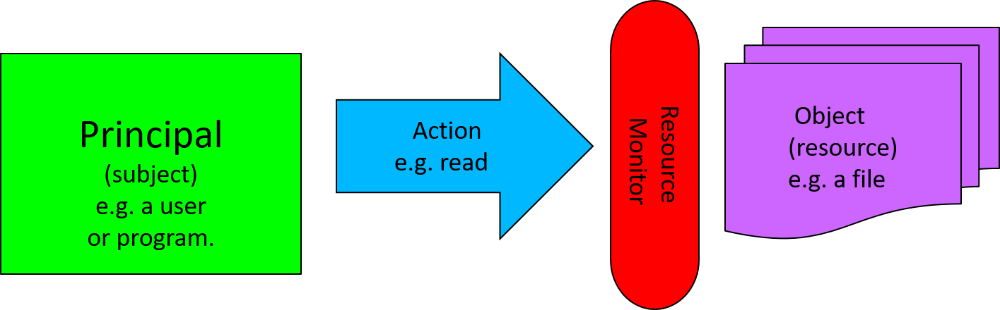
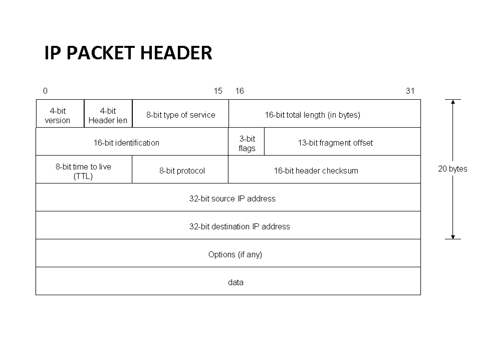
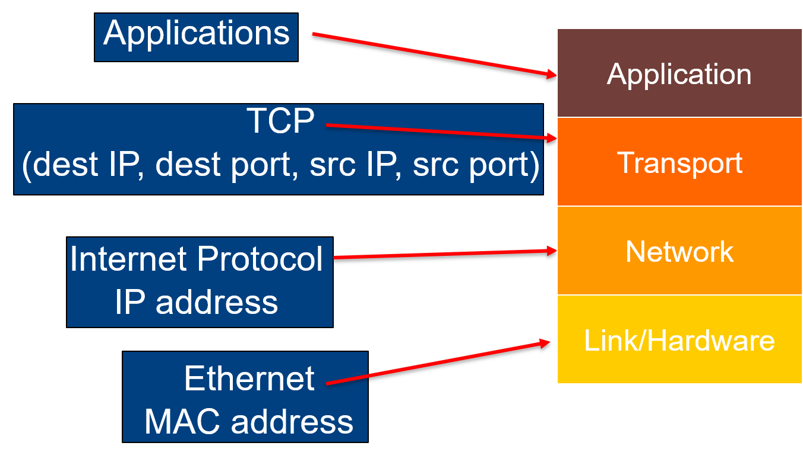

- [Security and Networks Note](#security-and-networks-note)
  - [Cryptography](#cryptography)
    - [Codes Versus Ciphers](#codes-versus-ciphers)
    - [Symmetric Cryptography](#symmetric-cryptography)
      - [Advanced Encryption Standard(AES)](#advanced-encryption-standardaes)
        - [SubBytes: S-box](#subbytes-s-box)
        - [ShiftRows](#shiftrows)
        - [MixColumn](#mixcolumn)
        - [AddRoundKey](#addroundkey)
        - [Key Schedule](#key-schedule)
        - [Security of AES](#security-of-aes)
      - [Data Encryption Standard(DES)](#data-encryption-standarddes)
      - [Padding](#padding)
      - [Block Cipher Modes](#block-cipher-modes)
    - [Introduction to Public-Key Cryptography](#introduction-to-public-key-cryptography)
    - [Secure Key Exchange](#secure-key-exchange)
    - [RSA Encryption](#rsa-encryption)
    - [Digital Signatures](#digital-signatures)
      - [Features of hand-written signatures in Digital World](#features-of-hand-written-signatures-in-digital-world)
      - [Ensure hardness of forgery](#ensure-hardness-of-forgery)
    - [Hashes, MACs and Authenticated Encryption](#hashes-macs-and-authenticated-encryption)
      - [Hash](#hash)
      - [MACs](#macs)
      - [Authenticated Encryption Modes](#authenticated-encryption-modes)
      - [Summary](#summary)
  - [Access Control](#access-control)
    - [Summary](#summary-1)
  - [The Internet and Sockets](#the-internet-and-sockets)
  - [Security Protocols](#security-protocols)
    - [Key Establishment Protocol](#key-establishment-protocol)
    - [The Needham-Schroeder Public Key Protocol](#the-needham-schroeder-public-key-protocol)
    - [An Attack Against the NH Protocol](#an-attack-against-the-nh-protocol)
    - [Forward Secrecy](#forward-secrecy)
    - [Station-to-Station Protocol](#station-to-station-protocol)
    - [Full Station-to-Station Protocol](#full-station-to-station-protocol)
    - [The Needham-Schroeder key establishment protocol](#the-needham-schroeder-key-establishment-protocol)
    - [The Highest Goal](#the-highest-goal)
  - [The TLS \& Tor Protocols](#the-tls--tor-protocols)
  - [Automated Protocol Verification](#automated-protocol-verification)
  - [Privacy in Mobile Telephony Systems](#privacy-in-mobile-telephony-systems)
  - [Attacks against Websites](#attacks-against-websites)

# Security and Networks Note

- What is Computer Security?
  - Correctness and Efficient algorithms against an attacker
  - Decide on your assets: Information and Infrastructure
    - Sensitive Data
    - Control Systems
    - Hardware devices
  - How do you safeguard: security goal, estimate impact of attacks, and design mitigations
  - Analyse systems, spot vulnerabilities, build protection

- Information Security
  - Aims
    - **Confidentiality**: Attacker should not retrieve any information
    - **Integrity and Authenticity**: Received data is authentic and the sender is genuine.
    - **Availability**: Data should accessible on demand
  - Potential Attackers
    - **Hackers**: Potentially learning by running known attacks, exploting vulnerabilities
    - **Criminals**: Take control of computers via bugs in softwares. Phishing attacks, Denial of Service(DoS attacks)
    - **Governments**: Extreme computing powers,control on resources(wiretaps)
    - **Business Houses like ISPs**: Spying to sell your data

> - Some Known Attacks
>   - Ransomware
>   - Phishing

## Cryptography

- Cryptography describes how to transfer messages between participants without anyone else being able to read or modify them
- Prerequisite for computer Security
- Start module with explaining th basics of cryptography(enough to understand how TLS works; for more details see cryptography module)
- Before we start with Cryptography, need to look at how to represent data

### Codes Versus Ciphers

- Codes vs. Ciphers
  - A code is any way to represent data.  
    Will use bitstrings (sequence of bits) to represent data.
    Examples: Morese Code, ASCII, Hex Base64
  - A cipher is a code where it is difficult to derive data from code
    - Almost always uses a key
    - Data for a cipher usually called *plain text*. encoding called *cipher text*
    - Function from plain text to cipher text called *encryption*
    - Function from cipher text to plain text called *decryption*

- ASCII  
  

- Base64  
  

- Caesar Cipher
  - The Caesar Cipher replaces each letter of the alphabet with one three to the right
    - a becomes d
    - b becomes e
    - ...
    - z becomes c
  - Use a key
    - **Kerckhoffs' principle**: A cipher should be secure even if the attacker knows everything about it apart from the key
    

- Frequency Analysis
  - While hard to break by brute force, replacing each letter with another is easy to break using frequency analysis
  - Frequency analysis counts the number of times
    - each symbol occurs
    - each pair of symbols
    - etc.
    and tries to draw conclusions from this

- Summary
  - Code is any binary representation of data; cipher is a code where it is difficult to derive data from code
  - Looked at various codes, including Hex
  - Looked at substitution ciphers, which replace single letters. These are easily breakable

### Symmetric Cryptography

- Overview
  - Will now look at proper encryption schemes
  - Assumption: All participants share common secret key
  - Will consider most important encryption shemes
  - Need some mathematical prerequisites to explain encryption schemes(modular arithmetic)

- Modular Arithmetic
  - Arithmetic modulo n means that you count up to n-1 then loop back to 0
  - i.e., 0, 1, 2, ..., n-1, 0, 1, 2, ...
  - a mod b = r for largest whole number k such that a = b*k + r
  - e.g. 9 mod 4 = 1 because 9 = 2 * 4 + 1

- xor
  - xor(⊕) is binary addition modulo 2;  
    > 0 ⊕ 0 = 0  
    > 1 ⊕ 0 = 1  
    > 0 ⊕ 1 = 1  
    > 1 ⊕ 1 = 0  
  - xor on bitstrings of same length defined by applying xor to corresponding bits
  - Important properties
    - xor is associative and commutative
    - for all bitstrings M, M ⊕ 0 = M
    - for all bitstrings M, M ⊕ M = 0
    > where 0 is a bitstring of all 0's of the appropriate length

- One time Pads
  - Needs a key as long as the message
  - XOR/add the key and the message:  
    (Demonstrated here with strings and addition and subtraction of keys; for bitstrings use xor)
  > Message     : HELLOALICE  
  > Key         : THFLQRZFJK  
  > Cipher text : ALRWERKNLO  
  - Have perfectexryption:  
    You don't learn anything about the plaintext from the ciphertext
  > Theorem:  
  > Given any ciphertext of a certain length, without knowing the key the probability of the ciphertext being the encryption of a plaintext of the same length is the same for all plaintexts of the same length as the ciphertext
  - Problem
    - The key needs to be as long as the message
    - Must use key only once

- Block Ciphers
  - Modern ciphers work on blocks of plain text, not just a single symbol
  - They are made up of a series of permutations and substitutions repeated on each block
  - The key controls the exact nature of the permutations and subsitutions

#### Advanced Encryption Standard(AES)

- AES is a state-of-the art block cipher
- It works on blocks of 128-bits
- It generates *10 round* keys from a signle 128-bit key
- It uses one permutation: ShiftRows and three substitutions SubBytes, MixColumns, AddRoundKey
> A block of 128 bits is represented by a 4x4-matrix where each matrix element is a byte(8 bits), written as  
> 


##### SubBytes: S-box

- SubByte is an operation on bytes using finite field arithmetic
- Use the S-box to transfer the original data to new data

  

##### ShiftRows

- ShiftRows moves the 
  - 2nd row one byte to the left
  - the 3rd row two bytes
  - and the 4th row 3 bytes

  

##### MixColumn

- MixColumn is substitution of each column such that
  - (a<sub>0</sub>x<sup>3</sup>+a<sub>1</sub>x<sup>2</sup>+a<sub>2</sub>x+a<sub>3</sub>)x(3x<sup>3</sup>+x<sup>2</sup>+x+2) mod (x<sup>4</sup> + 1) = (b<sub>0</sub>x<sup>3</sup>+b<sub>1</sub>x<sup>2</sup>+b<sub>2</sub>x+b<sub>3</sub>)
  - It is matrix mutiplication for the column(cipher key will not be used)**(It is a constant matrix)**

  

##### AddRoundKey

- AddRoundKey applies ⊕ to the block and the 128-bit round key(which was generated from the main key)

  

##### Key Schedule

1. RotWord: Rotates a 32 bit word(last column)
2. SubWord: Substitutes a 32 bit word using the AES S-Box
3. Round Constants: Round Constants are generated using a recursive function(10 round functions! They are constant)
4. AddRoundKey: add round key for each column

##### Security of AES

- No formal proof of security(P = NP?) but best known cryptographic aatack requires 2<sup>126</sup> key guesses - an (irrelevant) improvement of factor 4 compared to 2<sup>128</sup> guesses via brute force attack
- There are side channel attacks(eg via measuring power consumption, execution time)
- Key aspects of security:
  - Shuffling of rows and columns to ensure small change in input causes very big chage in output
  - Require at least one non-linear operation(in the sense of linear algebra) on the data

#### Data Encryption Standard(DES)

- The data Encryption Standard(DES), was the previous standard
- Before it was accepted as a standard the NSA stepped in and added S-boxes and fixed the key length at 56 bits
- S-boxes are a type of substitution

#### Padding

- Block ciphers only work on fixed size blocks.
- If the message isn’t of the right block size we need to pad themessage.
- But receiver needs to tell the difference between the padding and message.

- PKCS5/7
  - If there is 1 byte of space write 01
  - If there are 2 byte of space write 0202
  - If there are 3 byte of space write 030303
  - · · ·
  - If the message goes to the end of the block add a new block of 16161616..
- PKCS 7: 16 byte block, PKCS 5: 8 byte block

#### Block Cipher Modes

- Block Ciphers can be used in a number of modes:
  1. Electronic codebook mode(ECB)
     - Each bloack is encrypted individually
     - Encrypted blocks are assembled in the same order as the plain text blocks
     - if blocks are repeated in the plain text, this is revealed by the cipher text  

      

  2. Cipher Block Chaining Mode(CBC)
     - - each block XOR'd with previous block
       - Start with a random Initialization Vector(IV)
       - helps overcome replay atttack
     - Suppose the plain text is B<sub>1</sub>, B<sub>2</sub>, .., B<sub>n</sub>  
        IV = random number (sent in the clear)  
        C<sub>1</sub> = encrypt(B<sub>1</sub> ⊕ IV)  
        C<sub>2</sub> = encrypt(B<sub>2</sub> ⊕ C<sub>1</sub>)  
        ...  
        C<sub>n</sub> = encrypt(B<sub>n</sub> ⊕ C<sub>n-1</sub>)  

      %20mode.png)

      - CBC decrypt
        - Receive IV
        - Receive cipher text C1, C2, . . . , Cn
        - Plain text is B1, B2, . . . , Bn, where  
          B1 = decrypt(C1) ⊕ IV  
          B2 = decrypt(C2) ⊕ C1  
          · · ·  
          Bn = decrypt(Cn) ⊕ Cn−1  

      %20mode_decrypt.png)

      - Probabilistic Encryption
        - Probabilistic encryption schemes use random elements to make every encryption different.
        - CBC with a random IV is a good way to make encryption probabilistic.
        - Using CBC and random IVs lets me encrypt the same message, and with the same key, without an attacker realising.  
  
      

  3. Counter Mode(CTR)
      - Suppose the plain text is B<sub>1</sub>, B<sub>2</sub>, .., B<sub>n</sub>  
      - IV = random number (sent in the clear)  
      - Cipher text: C<sub>1</sub>, C<sub>2</sub>, ..., C<sub>n</sub> where  
        C<sub>1</sub> = B<sub>1</sub> ⊕ encrypt(IV)  
        C<sub>2</sub> = B<sub>2</sub> ⊕ encrypt(IV + 1)  
        ...  
        C<sub>n</sub> = B<sub>n</sub> ⊕ encrypt(IV + n - 1)  

      %20mode%20encryption.png)

      %20mode%20decryption.png)

      - Cipher Texts Can Be Altered
        - AES encryption with a particular key maps any 128-bit blockto a 128-bit block (or 256)
        - AES decrypt also maps any 128-bit block to a 128-bit block.
        - Decrypt can be run on any block (not just encryptions).
      - Known Plain Text Attacks
        - If I know the plaintext I can change CTR encrypted messages
        - eg If I know EncCTR(M1) and I know M1, I can make a ciphertext that decrypts to any message I want, eg M2
        - New ciphertext is Enc<sub>CTR</sub>(M1) ⊕ (M1 ⊕ M2)
        > DecCTR(EncCTR(M1) ⊕ (M1 ⊕ M2)) =  
        > DecCTR(Enc(N||Ctr) ⊕ M1) ⊕ (M1 ⊕ M2) =  
        > Enc(N||Ctr) ⊕ (Enc(N||Ctr) ⊕ M1) ⊕ (M1 ⊕ M2) =  
        > M2?  

### Introduction to Public-Key Cryptography

- Cryptography: four directions
  - Confidentiality
  - Message Integrity
  - Sender Authentication
  - (soft)Sender Undeniability(non-repudiation)

- Symmetric Key Cryptography  
  
  - Each person has two keys: one public and one Private
  - The keys are asymmetric: Related but not identical
  - Public Key is known to everyone, private key is kept secret  
    
  

### Secure Key Exchange

- MultiRound Solution  
  

- Diffie Hellman Key Exchange
  - Parameters
    - Choose a prime $p$ and a number $g < p$ such that $gcd(g, p − 1) = 1$.
  - Diffie-Hellman Assumption
    - There is no polynomial time algorithm to compute $g^{ab} \mod p$ from $g^a mod p$ and $g^b \mod p$

    

- Man-in-the-Middle Attack  
  
  - How to Solve?
    - **Basic Idea**: Authenticating Public Key.
    - **Requirement**: Trusted Third Party: Certification Authority(CA).

### RSA Encryption

- Textbook RSA scheme: Three Algorithms (Gen, Enc, Dec)
  - Gen: on input a security parameter $\lambda$
    - Generate two distinct primes $p$ and $q$ of same bit-size $\lambda$
    - Compute $N = pq$ and $\phi(N) = (p - 1)(q - 1)$
    - Choose at random an integer $e(1<e<\phi(N))$ such that $gcd(e, \phi(N)) = 1$
    - Let $Z_N^*={x | 0<x<N\space and \space gcd(x,N)=1}$
    - Compute $d$such that $e·d ≡ 1(\mod\phi(N))$
    - Public key $PK = (e, N)$. The private key $SK = e, d, N$
  - Enc(PK,m): On input an element $m\in Z_N^*$ and the public key PK = (e,N) compute
    - $c = m^e(\mod N)$
  - Dec(SK, c): On input an element $c\in Z_N^*$ and the private key SK = (e, d, N) compute
    - $m = c^d(\mod N)$

### Digital Signatures

#### Features of hand-written signatures in Digital World

- Hand-written Signatures
  - Function: bind a statement/message to its authors
  - Verification is public. (against a prior authenticated one)
  - Properties
    - **Correctness**: A correct signature should always be verified true
    - **Security**: Hard to forge

#### Ensure hardness of forgery

- Signature Schemes
  - Correctness  
    
  - Unforgeability:  
    Must output forgery for a message for which the attacker did not request the signature.  
    
  > - RSA Full Domain Hash
  >   - Public Functions A hash function $H :\{0, 1 \}^*\space\rArr Z_N^*$ 
  >   - Keygen: Run RSA.Keygen. $pk = (e,N), sk = (d, N)$
  >   - Sign: Input: sk, M. Output  
  >     $\sigma = RSA.Dec(sk, H(M)) = H(M)^d \mod N$
  >   - Verify: Input: $sk,M,\sigma$. If $RSA.Enc(pk,\sigma) = H(M)$ output accept, else reject
  >   - If $\sigma^e \mod N = H(M)$, output accept, else reject
  > 
  > - Note
  >   - A hash function takes string of arbitrary length as input and produces a fixed length output. For cryptographic hash functions, given a $z$, it is very expensive to find $x$ such that $H(x) = z$

### Hashes, MACs and Authenticated Encryption

#### Hash

- Hashes
  - A hash of any message is a short string generated from that message
  - The hash of a message is always the same
  - Any small change makes the hash totally different
  - It is very hard to go from the hash to the message
  - It is very unlikely that any two differrent messages have the same hash

- Uses of Hashing
  - Verification of download of message
  - Tying parts of a message together(hash the whole message)
  - Hash the message, then sign the hash(for electronic signatures)
  - Protect passwords
    - Store the hash, not the passwords

- Attacks on hashes
  - Preimage attack: Find a message for a given hash: very hard.
  - Collision attack: Find two messages with the same hash
  - Prefix collision attack: A collision attack where the attacker can pick a prefix for message

#### MACs

- Message Authentication Codes
  - Abbreviated often as "MAC", has nothing to do with MAC in MAC address for networking(MAC = Media Access Control)
  - MACs sometimes used for authentication:
    - Example: Alice and Bank share key k, Alice sends to bank
      $$
        ”Pay \space Bob \space \$10”, MAC_k (”Pay Bob \$10”)
      $$
  - Possible attack on MAC: Add data to a MAC without knowing the key(Length extension attack)

- How can we make a MAC?
  - Block Cipher Modes
    
  - Making a CBC MAC
    
  - An Inefficient Hash Function
    

- Broken Hash to Mac
  - If we had a Hash we could try to make a MAC by:
    $$
      MAC_{Key}(M) = H(Key, M)
    $$
  - But this might allow a length extension attack
    

- Cipher Texts Can Be Altered
  - AES encryption with a particular key maps any 128-bit block to a 128-bit block (or 256)
  - AES decrypt also maps any 128-bit block to a 128-bit block
  - Decrypt can be run on any block (not just encryptions)

- Block Mode
  - CBC mode: any change affects all of the rest of the message
  - ECB mode: any change affects only the block
  - CTR mode: any change affects only the bits altered

#### Authenticated Encryption Modes

- Authenticated Encryption Modes
  - Authenticated encryption modes stop this.
  - With Authenticated Encryption you can only form a valid ciphertext if you know the key.
  - Most common way to do this is to add a MAC to the ciphertext.

- CCM mode encryption
  - First calculate an AES CBC-MAC on the data.
  - Then encrypt the message followed by the MAC using the same key and CTR mode.
  - Not rocket science, but proven secure
    - Fully defined as RFC 3610

#### Summary
  - Defined ways of detecting manipulation of ciphertexts
    - **Hashes**: Detect corruption of messages in general. New hashes can be generated by the attacker
    - **MAC (Message Authentication Codes)**: use a key to ensure that message has not been changed
    - **Authenticated Encryption**: provides encryption such that manipulation of cipher texts can be detected. Often uses MACs.

## Access Control

- Introduction
  - Need to ensure that only authorised uses have access to what they need
  - Will discuss ways of achieving this and possible pitfalls

- Model of Access Control  
  

- Access Control Matrix  
  
  > Permission: x: execute, r: read, w: write
  - ACM is a matrix of all principals and objects
  - The matrix entries describe the permissions
  - Problem: maintaining such a matrix can be difficult
  - If the matrix is corrupted, then all control is lost

- The UNIX Access Control List  
  

- UNIX File Permissions
  - Permissions:
    - r: read permission
    - w: write permission
    - x: execution permission
    - -: no permissions
  - File Type:
    - -: file
    - d: directory
    - b/c: device file

  

- Access Control for Directories
  - For directories
    - "r" is read only for directory contents
    - "x" is permission to traverse, e.g. switch to, run
  - No "x": I can't run any commands inside the directory
  - No "y": I can't list the files in the directory

- Access Control for Program
  ```
  -r-sr-xr-x  1 root  wheel 70352 19 Jun  2009 passwd
  ```
  - The "x" permission controls who can run a program in the case of passwd: anyone
  - The "s" permission indicates that the program runs with the permission of its owner

- Different user identifiers
  - Have different user identifiers(uids):
    - real uid (ruid) owner of process
    - effective uid (euid): used for access checks (except filesystem)
    - file system uid (fsuid): used for access checks and ownership of files (usually equal to effective uid)
    - saved user uid (suid): when the euid is changed, the old euid is saved as suid. Unprivileged process may change euid only to ruid or suid.
  - Provides flexibility for granting higher privileges temporarily
    - eg daemons: start as root (to bind to ports < 1024), then set ruid, euid and suid to unprivileged values. Cannot gain root privileges afterwards
    - Process run as privileged user may set euid to unprivileged value, then execute non-privileged operations, and gain root privileges afterwards

- Security issues with granting higher privileges
  - Users can run process with more privileges
  - If there was a mistake in the passwd program we could use it do root only actions.
  - Particular problem: race conditions in code like: `if can_access file then perform_operations on file`
  - **Make sure process have as low a level as possible.**

- Storing Passwords
  - Passwords not stored in clear text
  - Only hashes are stored
  - Further security measure: Store pair (Salt, Hash), where Salt is random bitstring, and Hash the hash of the salt and the password
  - ⇒ Same password for two users gives rise to different entries in the password file
  - Makes cracking passwords much harder

- Windows Password Hashes
  - Windows stores its password hashes in:  
    `system32/config/SAM`
  - This file requires Admin level to read.
  - It is locked and encrypted with a key, based on other key values  
    This adds no real security

- Password Hashes in Windows Domain
  - In a Windows Domain, passwords hashes are used to authenticate users on hosts in the domain
  - Password hashes are cached to avoid asking for the password
  - Gives rise to devastating attack(Pass-the-Hash)
    - Obtain user credentials for one host in the domain
    - Exploit vulnerability to become local administrator
    - Install process which waits for domain administrator to login into this machine
    - Extract cached hash for domain administrator
    - Login as domain administrator
  - Defence mechanism exist but are painful to use
  - ssh much better: public key on untrusted machine, private key on trusted machine

- Password capture by attacker
  - Phishing: Username and password captured by attackers via malicious links
  - Used to login and then for attacks(ransomware, theft of credit card details, IP ...)
  - Best protection: multi-factor authentication(something else apart from username and password, eg one-time password via apps, SMS codes, physical hardware tokens)
  - ssh with public key authentication only also protects against
phishing

### Summary

- Discussed mechanisms for access control, eg file permissions, mechanisms for granting higher privileges temporarily
- Authentication still mostly done with username and password
- However, subject to phishing attacks  
  Multifactor authentication and public key ssh access protect against this
- Need also to protect hard disk against loss or theft  
  Best way: use full disk encryption

## The Internet and Sockets

- Computer Networks
  - local networks
  - telephone line connections
  - leased line



- Domain Name Servers(DNS)
  - Remembering IP address is hard
  - So people associate names with addresses  
    e.g. news.bbc.com->212.58.226.141
  - Ahierarchy of servers list handle requests
  - The route for most of Europe is RIPE based in Amsterdam

- Port
  - To allow multiple connections TCP uses "ports"
  - A TCP "Socket" connection is defined by:  
    (*destination IP, destination port, source IP, source port*)
  - The destination port normally depends on the service: WW runs on port 80, ssh on port 22, dns on 53...
  - The source port is normally, ssh on port 22, dns on 53

- Netcat
  - Netcat is a tool to make Internet connections
  - Syntax varies between OS
  - listen on 1337: `nc -l 1337`
  - connect to machine `127.0.0.1` on port 1337: `nc 127.0.0.1 1337`

- Nmap
  - Check if 1000 most common ports are open:  
    `nmap 127.0.0.1`
  - Additionally send messages to ports to find out what the service is:  
    `nmap -A 127.0.0.1`
  - Scan all ports  
    `nmap -p- 127.0.0.1`

- The Internet Protocol Stack
  - Internet communication uses a stack of protocols
  - Each protocol uses the protocol below it to sent data  
  

- MAC and IP Addresses
  - Every machine has a unique MAC address(media access control) e.g. 48:d7:05:d6:7a:51
  - Every computer on the Internet has an IP address, e.g.:  
    147.188.193.15
  - NAT address 10.*.*.* and 192.168.*.* are not unique local addresses

- DHCP and ARP
  - Dynamic Host Configuration Protocol:
    - Assigns an IP address to a new machine(MAC address). Not stored long term
  - Address Resolution Protocol(ARP)
    - Lets router find out which IP address is being used by which machine
    - ARP spoofing lets one machine steal the IP address of another on the same network

- Wireshark
  - A network protocol analyzer: It records all Internet traffic, so it can then be viewed and analysed.
  - Excellent for debugging protocols and network problems
  - See also tcpdump, which writes packets directly to disk.


- The Attacker Owns the Network
  - The Internet was not designed with security in mind
  - Traffic may be monitored or altered
  - All good security products assume that the attacker has complete control over the network

## Security Protocols

> - A simple Protocol
>   ```
>   A → B : {“I’m Alice”}Kab
>   E(A) → B : {“I’m Alice”}Kab
>   ```
>   - Attacker can intercept and replay messages
>   - Assume the attacker "owns" the network
>
> - A Nonce(临时)  
>   
>
> - A better Protocol  
>   


### Key Establishment Protocol
- This protocol was possible because A and B shared a key
- Often, the principals need to set up a session key using a **Key Establishment Protocol**
- To be sure they are communicating with the correct principal, they must either know each others public keys or use a **Trusted Third Party(TTP)**

### The Needham-Schroeder Public Key Protocol
- Assume Alice and Bob know each others public keys, can they set up a symmetric key?
> 1. $A \rightarrow B : E_B(N_a, A)$
> 2. $B \rightarrow A : E_A(N_a, N_b)$
> 3. $A \rightarrow B : E_B(N_b)$
> - A:"The only person who could know $N_a$ is the person who decrypted the first message."
> - B:"The only person who could know $N_b$ is the person who decrypted the first message."
- $N_a$ and $N_b$ can then be used to generate a symmetric key
- **Goals**: Alice and Bob are sure they are talking to each other and only they know the key

### An Attack Against the NH Protocol
1. $A \rightarrow C : E_C(N_a, A)$
   1. $C(A) \rightarrow B : E_B(N_a, A)$
   2. $B \rightarrow C(A) : E_A(N_a, N_b)$
2. $C \rightarrow A : E_A(N_a, N_b)$
3. $A \rightarrow C : E_C(N_b)$
   1. $C(A) \rightarrow B : E_B(N_b)$
> 1. $A \rightarrow B : E_B(N_a, A)$
> 2. $B \rightarrow A : E_A(N_a, N_b, B)$
> 3. $A \rightarrow B : E_B(N_b)$

### Forward Secrecy
> 1. $A \rightarrow B : E_B(N_a, A)$  
> 2. $B \rightarrow A : E_A(N_a, N_b, B)$  
> 3. $A \rightarrow B : E_B(N_b)$  
> 4. $B \rightarrow A : \{M\}_{key(N_a,N_b)}$  
- Secure against the “standard” attacker:  
  *intercept, replay, delete, alter*
- A protocol has Forward Secrecy if it keeps the message secret from an attacker who has:
  - A recording of the protocol run
  - The long term keys of the principals
- Protection against a government that can force people to give up their keys, or hackers that might steal them.

### Station-to-Station Protocol

> 1. $A \rightarrow B : g^x$
> 2. $B \rightarrow A : g^y, \{S_B(g^y,g^x)\}_{g^{xy}}$
> 3. $A \rightarrow B : \{S_A(g^y,g^x)\}_{g^{xy}}$
> 4. $B \rightarrow A : \{M\}_{g^{xy}}$
>
> - $S_X(\_)$ means signed by X

- $x,y,g^{xy}$ are not stored after the protocol run
- A and B's keys don't let the attacker read M
- STS has **forward secrecy**

### Full Station-to-Station Protocol

> 1. $A \rightarrow B : g^x$
> 2. $B \rightarrow A : g^y, Cert_B, \{S_B(g^y,g^x)\}_{g^{xy}}$
> 3. $A \rightarrow B : Cert_A, \{S_A(g^y,g^x)\}_{g^{xy}}$

- The “full” STS protocol adds certificates for A and B
- These contain their public key signed by a TTP, so Alice and Bob don’t have to know each other’s public key

### The Needham-Schroeder key establishment protocol

- A and B use trusted third party to establish a key $K_{ab}$:
  1. $A \rightarrow S : A,B,N_a$
  2. $S \rightarrow A : \{N_a, B, K_{ab}, \{K_ab, A\}_{K_{bs}}\}_{K_{as}}$
  3. $A \rightarrow B : \{K_{ab}, A\}_{K_{ab}}$
  4. $B \rightarrow A : \{N_b\}_{K_{ab}}$
  5. $A \rightarrow B : \{N_b + 1\}_{K_{ab}}$

### The Highest Goal

- Some Key Establishment Goals
  - **Key Freshness**: the key established is new (either from some trusted third party or because it uses a new nonce).
  - **Key Exclusivity**: the key is only known to the principals in the protocol.
  - **Good Key**: the key is both fresh and exclusive

- Authentication Goals
  - **Far-end Operative**: A knows that “B” is currently active
  - **Once Authentication**: A knows that B wishes to communicate with A.
  - **Entity Authentication**: A knows that B is currently active and wants to communicate with A.

- The Highest Goal
  - A protocol provides **Mutual Belief** in a key K for Alice with respect to Bob if, after running the protocol, Bob can be sure that:
    - K is a good key with A
    - Alice can be sure that Bob wishes to communicate with Alice using K
    - Alice knows that Bob believes that K is a good key for B


## The TLS & Tor Protocols

- Details of TLS
  - How it works
  - Common problems
- Tor
  - Anonymity on the internet
  - The Tor Protocol
  - Hidden servers

- The SSL/TLS Protocol
  - The Secure Sockets Layer(SSL) protocol was renamed to Transport Layer Security(TLS) protocol
  - It provides encrypted socket communication and authentication based on public keys
  - It may use a range of ciphers(RSA, DES, DH, ...)
    - These are negotiated at the start of the run

- X.509 Standard for Certificates
  - X.509 certificates contain a subject, subject’s public key, issuer name, etc
  - The issuer signs the hash of all the data
  - To check a certificate, I hash all the data and check the issuers public key.
  - If I have the issuer’s public key and trust the issuer, I can then be sure of the subject’s public key

- The Internet Protocol Stack (Most of the Time)  
  

- The Internet Protocol Stack with TLS  
  

- TLS
  1. $C \rightarrow S: N_C$
  2. $S \rightarrow C: N_S, Cert_S$
  3. $C \rightarrow E_S(K_{seed}), \{Hash_1\}_{K_{CS}}$
  4. $S \rightarrow C: \{Hash_2\}_{K_{CS}}$  
  $Hash_1 = \#(N_C, N_S, E_S(K_{seed}))$  
  $Hash_2 = \#(N_C, N_S, E_S(K_{seed})), \{Hash_1\}_{K_{CS}}$  
  $K_{CS}$ is a session key based on $N_C, N_S, K_{seed}$

- TLS-DHE  
  A variant uses Diffie-Hellman for forward secrecy  
  i.e., if someone gets the server's key later, they can't go back and break a recording of the traffic.
  1. $C \rightarrow S: N_C$
  2. $S \rightarrow C: N_S, g^x, Cert_S, Sign_S(\#(N_C, N_S, g^x))$
  3. $C \rightarrow S: g^y, \{\#(All previous messages)\}_{K_{CS}}$
  4. $S \rightarrow C: \{\#(All previous messages)\}_{K_{CS}}$
  $K_{CS}$ is a session key based on $N_C, N_S, g^{xy}$

- Cipher Suites Handshake  
  

- Weaknesses in TLS
  - Configuration weaknesses:
    - Cipher downgrading
    - Self-signed certificates
  - Direct attack against implementations:
    - Apple's goto fail bug
    - LogJam attack
    - HeartBleed

- Cipher downgrading attack
  - The cipher suite messages are not authenticated!
  - An attacker that owns the network can remove strong ciphers.
  - If both client and server support a weak cipher, then an attack can force its use.

- Self-signed Certificates
  - Maintaining a set of certificates is hard(especially on apps loT devices)
  - It's much easier just to accept any certificate(or certificates that sign them selves)
  - If the client accepts the self-signed certificates, then it's easy to man-in-the-middle
  - This has been shown to happen a lot in devices and code that use TLS!

- Cipher Suites
  - What if one side supports a weak cipher suite but the other does not?
  - Generally considered safe
  - Browser developers removed all weak ciphers, some remained in servers.
  - This depends on different cipher suites being incompatible

- Diffie-Hellman
  - Alice and Bob pick random numbers $r_A$ and $r_B$ and find $t_A=g^{r_A} mod\space p$ and $t_B=g^{r_B}mod\space p$
  - The protocol just exchanges these numbers:
    1. $A \rightarrow B: t_A$
    2. $B \rightarrow A: t_B$
  - Alice calculates $t_B^{r_A} mod \space p$ and Bob $t_B=g^{r_B}mod\space p$, receiving the key: $K = g_{r_Ar_B}mod \space p$

- Attack Diagram from paper  
  

- Proxy: Hotspot Shield VPN
  - An internet connection reveals your IP number.
  - VPNs promise “Anonymity”
  - Connection made via their servers.
  - The intended recipient server never see’s your IP address.

- Virtual Private Networks For Anonymity
  - To get some anonymity, you can route all your traffic via the VPN.
    - Server thinks you are the VPN provider
    - ISP only sees the connection to the VPN
    - A global observer can probably link your connections
  - There is no anonymity to the VPN provider.

> - Suppose you’re connected to a public WiFi hotspot and browse to the website “https://bham.ac.uk“ using a VPN
>   - What information does the WiFi provider have about you?
>     - …your WiFi’s outgoing IP address (×)
>     - …that you are connected to the VPN (×)
>     - …your VPN’s outgoing IP address(√)
>     - …that you are browsing to “https://bham.ac.uk”(√)
>     - …the contents of your communication with the website(√)

- Tor: Onion Routing
  - Each proxy only learns the IP of the proxy before it and the proxy after it.
  - The public key of each proxy is known.
  - Source IP is visible to the first node, destination IP is visible to the last node.
  - User picks 3 proxies (entry, middle, and exit node) and is anonymous as long as they aren’t all corrupt.  
  

## Automated Protocol Verification

- Applied pi calculus: Grammar
  - Terms
    $$
    \begin{align}
      M, N &::= \\
          &a, b, c, k, m, n,s,t,r, . . . &name\\
          &x, y, z &variable\\
          &g(M1, . . . , Ml) &function
    \end{align}
    $$
  - Equational theory
    $$
      \begin{align}
        adec(aenc(x,pk(y))) &= x\\
        fst((x,y)) &= x\\
        snd((x,y)) &= y\\
      \end{align}
    $$
  - Processes
    $$
      \begin{align}
        P, &Q, R ::= processes\\
        &0 &null process\\
        &P | Q &parallel comp.\\
        &!P &replication\\
        &new n.P &name restriction\\
        &in(u, x).P &message input\\
        &out(u, M).P &message output\\
        &if M = N then P else Q cond’nl\\
      \end{align}
    $$

- Proverif
  - Several tools available for automated verification Consider a tool called Proverif (Blanchet 2001) Capabilities of ProVerif:
    - **Reachability properties**: Is a certain event reachable (eg leaking secret keys to the attacker)
    - **Correspondence assertions**: If event e has been executed, then event e' has been previously been executed
    - **Observational equivalences**: The attacker cannot identify which one of two processes has been executed  
      Example:  
      Process 1: Voter A chooses option 1, voter B chooses option 2  
      Process 2: Voter A chooses option 2, voter B chooses option 1

## Privacy in Mobile Telephony Systems

- Mobile phone privacy
  - Privacy is explicit goal of UMTS standard:  
    An intruder cannot deduce whether different services are delivered to the same user.

- Mobile phone identifiers
  - Every phone has unique identifier (IMSI)
  - If IMSI appears in cleartext, identification of mobile phone user would be easily possible
  - Problem recognised in the UMTS standard
  - temporary identifiers (TMSI) used which should be changed periodically  

- TMSI reallocation
  - Initiated by the MS to update its location
  - MS unique identity stored in the SIM card: IMSI
  - The network assigns a temporary identity TMSI
  - A new TMSI is assigned during the location update

- Problems with TMSI reallocation
  - TMSI reallocation rarely executed: Experimentally verified
  - Old keys for encrypting traffic are reused after TMSI-reallocation  
    Gives rise to protocol attack

- TMSI reallocation protocol
  

- Privacy properties of fix
  - Have formally specified and verified privacy properties of fix Applied π-calculus used for formalisation
    - Agents modelled as processes
    - communication between agents modelled as messages on channels
    - have terms and reduction rules corresponding to cryptographic primitives
    - nonces and private keys modelled by scope restriction of identifiers

- Modelling TMSI
  - Issue: How to handle TMSI (stored in phone memory)?
    - Instance of global mutable state
    - Encoding of state in applied π-calculus leads to large amount of false positives in Proverif
  - Solution: add mutable global state as primitive Leads to StatVerif
  - Have shown following theorem  
    $vdck.(!(Init|MS)|!SN) \approx vdck.(!(Init|!MS)|!SN)$
  - Proof works by constructing suitable bisimulation  
    Key point: multiple sessions of same mobile phone can be simulated by multiple phones executing one session each

- Conclusions
  - Temporary identifiers used by mobile phones are used incorrectly
    - changed rarely
    - old ciphering keys are reused
  - Weaknesses make it possible to track mobile phone users Second problem can be fixed by not reusing keys

## Attacks against Websites

- Introduction
  - Will discuss attacks on websites and their prevention
    - Authentication failure
    - SQL injection
    - Cross-site scripting
    - Cross-site request forgery
    - Code injection
  - Two main sources of vulnerabilities:
    - input validation
    - application logic

- Authenticating users after log in
  - IP address-based
    - NAT may cause several users to share the same IP
    - DHCP may cause same user to have different IPs
  - Certificate-based
    - Who has a certificate and what is it, and who will sign it?
  - Cookie-based
    - The most common

- Cookies
  - Cookies let server store a string on the client.  
    Based on the server name.
    - HTTP response: Set-Cookie: adds a cookie
    - HTTP header: Cookie: gives a "cookie"
  - This can be used to
    - Identify the user (cookie given out after login)
    - Store user name, preferences etc.
    - Track the user: time of last visit, etc.

- Simple authentication scheme
  - The Web Application:
    - Verifies the credentials, e.g., against database
    - Generates a cookie which is sent back to the user  
      *Set-Cookie: auth=secret*
  - When browser contacts the web site again, it will include the session authenticator  
    *Cookie: auth=secret*

- Fixed cookies
  - Log in/out recorded on the server side.
    - Set cookie the first time browser connects,
    - Every page looks up cookie in database to get session state.
  - PhP does this automatically: session cookies and *start session()*

- What can go wrong?
  - OWASP = Open Web Application Security Project
  - Public effort to improve web security:
    - Many useful documents.
    - Open public meetings and events
  - The “10 top” lists the current biggest web threats: https://owasp.org/www-project-top-ten

- Eavesdropping
  - If the connection is not encrypted, it is possible to eavesdrop, by
    - ISP,
    - anyone on the route,
    - anyone on your local network, e.g. using the same wi-fi

- Steal the Cookie
  - So the attacker does not need the username and password - just the cookie
  - If the website uses https (TLS) it is secure
  - But many websites dropped back to http after a secure login

- Countermeasures
  - Use https (TLS) all the time.
  - Set the secure flag: cookie is sent only over secure connections:
    ```js
      Cookie secureCookie =
        new Cookie("credential",c);
        secureCookie.setSecure(true);
    ```
  
- Broken Authentication
  - Many web developers implement their own log in systems. Often broken, e.g.
    - No session time outs.
    - Passwords not hashed

- Sensitive Data Exposure
  - Sensitive data transmitted in clear text (e.g. use of http instead of https)
  - Sensitive data stored in clear text (e.g. passwords not hashed in database, credit card numbers not encrypted in database)
  - Cookie stealing because https connection turns to http

- SQL Attack Types
  - The best vulnerabilities will print the result of the SQL query.
    - This lets you explore the whole database
    - Information schema table can tell you the names of all other tables
  - Blind SQL attacks do not print the results:
    - Lots of guesswork needed
    - Run commands on database, e.g. add a password, delete tables
    - Copy data (e.g. password) into a field you can read

- Cross Site Scripting (XSS)
  - An input validation vulnerability.
  - Allows an attacker to inject client-side code (JavaScript) into web pages.
  - Looks like the original website to the user, but actually modified by attacker

- Reflected XSS
  - The injected code is reflected off the web server
    - an error message,
    - search result,
    - response includes some/all of the input sent to the server as part of the request
  - Only the user issuing the malicious request is affected

- Stored XSS
  - The injected code is stored on the web site and served to its visitors on all page views
    - User messages
    - User profiles
  - All users affected

- Steal cookie example
  - JavaScript can access cookies and make remote connections.
  - A XSS attack can be used to steal the cookie of anyone who looks at a page, and send the cookie to an attacker.
  - The attacker can then use this cookie to log in as the victim.

- XSS attacks: phishing
  - Attacker injects script that reproduces look-and-feel of login page etc
  - Fake page asks for user’s credentials or other sensitive information
  - Variant: attacker redirects victims to attacker’s site
  ```html
    <script>
    document.location = "http://evil.com";
    </script>
  ```

- XSS attacks: run exploits
  - The attacker injects a script that launches a number of exploits against the user’s browser or its plugins
  - If the exploits are successful, malware is installed on the victim’s machine without any user intervention
  - Often, the victims machine becomes part of a botnet

- Solution for injection: sanitisation
  - Sanitize all user inputs is difficult
  - Sanitisation is context-dependent
    - JavaScript `<script>user input</script>`
    - CSS value `a:hover {color: user input }`
    - URL value `<a href="user input">`
  - Sanitisation is attack-dependent, e.g. JavaScript vs. SQL

- Cross-site request forgery (CSRF)
  1. Victim is logged into vulnerable web site
  2. Victim visits malicious page on attacker web site
  3. Malicious content is delivered to victim
  4. Victim sends a request to the vulnerable web

- Solutions to CSRF(1)
  - Check the value of the Referer header
  - Does not work:
    - Attacker cannot spoof the value of the Referer header in the users browser (but the user can).
    - Legitimate requests may be stripped of their Referer header
      - Proxies
      - Web application firewalls

- Solutions to CSRF (2)
  - Every time a form is served, add an additional parameter with a secret value (token) and check that it is valid upon submission
  - If the attacker can guess the token value, then no protection

- Solutions to CSRF (3)
  - Every time a form is served, add an additional parameter with a secret value (token) and check that it is valid upon submission.
  - If the token is not regenerated each time a form is served, the application may be vulnerable to replay attacks (nonce)

- XML External Entities
  - XML is very common in industry
  - XML processors resolve an “external entity” during processing:  
    `<?xml version="1.0" encoding="ISO-8859-1"?>`
  ```html
    <!DOCTYPE foo [
    <!ELEMENT foo ANY >
    <!ENTITY xxe SYSTEM "file:///etc/passwd" >]>
    <foo>&xxe;</foo>
  ```

- Path Traversal
  - The user can type anything they want into the URL bar, or even form the request by hand.
  - If the webserve is running with root permission this will give me the password file.

- Path Traversal: Fix
  - Use access control settings to stop Path Transversal
  - Best practice: make a specific user account for the webserver
  - Only give that account access to public files

- Security Misconfiguration
  - Make sure your security settings don’t give an attacker an advantage, e.g.
    - Error messages: should not be public.
    - Directory listings: It should not be possible to see the files in a directory.
    - Admin panels should not be publically accessible

- Insecure Deserialisation
  - Deserialisation on the server of data provided by end user
  - Attacker can change field names, contents, and mess with the format
  - Remote code execution possible

- Insufficient Logging and Monitoring
  - Auditable events not logged
  - Warning and error message not logged
  - Logs not monitored for suspicious activities

- Summary
  - To secure a website, you need to know how it works:
    - How clients request resources.
    - How clients are authenticated.
    - How HTTP and webservers work  
  
    Possible Web Attacks
    - Stolen cookies
    - SQL injection
    - Code injection
    - Cross-site scripting attacks (XSS)
    - Cross-site request forgery (CSRF)
    - For more, see OWASP Top 10
  - Errors are often down to bad application logic
  - Always sanitise all inputs