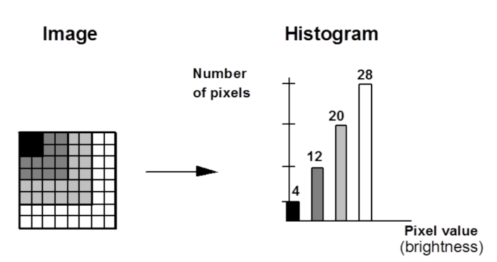
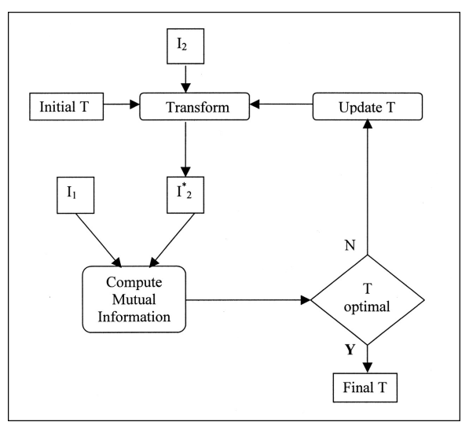

# Week 3 Note

## Image Segmentation

### Digital image representations

- Image representation
  - 2-dimensional arrays of pixels
    - (x, y)
  - multi-dimensinal arrays
    - (x,y,z)
    - (x,y,t)
    - (x,y,z,t)
    - (x,y,z,b1,b2, … , bN)
  
### Image properties

- Characterising images
  - Spatial resolution
    - 空间分辨率
    - pixel size
      - 像素大小
    - pixels/inch
      - 像素/英寸
  - Intensity resolution
    - 强度分辨率
    - Bits per pixel
      - 每像素位数
  - Time resolution
    - 时间分辨率
    - Frames per second
      - 每秒帧数
  - Spectral resolution
    - 光谱分辨率
    - Number of bands + bandwidth
      - 波段数 + 带宽

- Characterising images as signals
  - Image statistics
    - Mean, standard deviation
      - 平均值、标准差
    - Histogram: frequency distribution graph
      - 直方图：频率分布图
  - Image noise
    - signal-to-noise ratio(SNR)
      - 信噪比（SNR）

- Characterising images as objects
  - This requires that image is partitioned into meaningful regions
    - 这要求将图像划分为有意义的区域
  - The process of partitioning is known as segmentation
    - 划分过程称为分割

### Image segmentation techniques
  - Pixel-by-pixel(global statistics)Thresholding
    - 逐像素（全局统计）阈值化
    - Image gradient(energy driven)Active contours
      - 图像梯度（能量驱动）活动轮廓
  - Groups of pixels(similarity)Clustering Region growing Relaxation
    - 像素组（相似性）聚类区域增长松弛
    - Model based(statistics of shape)Active shape models
      - 基于模型（形状统计）活动形状模型
  
- Image Segmentatation can be classified as:
  - 图像分割可分为：
  - Non-automated
    - 非自动化
    - Identifying regions by hand
      - 手动识别区域
    - Given an image, select and define a region of interest by hand
      - 给定图像，手动选择并定义感兴趣的区域
      - Rough estimate
        - 粗略估计
  - Semi-automated
    - 半自动化
    - Thresholding
      - 阈值
      - Histogram-based segmentation
      - Given an image, select a suitable threshold value
      > - Histogram
      >   - A frequency distribution graph
      >   - Shows the number of pixels in the image having a particular value or a range of values  
      >   
      > 
  - Thresholding challenges
    - Often impossible to select a satisfactory threshold based only on pixel values
    - Region Growing
      - 区域增长
    - Active Contour, etc
      - 活动轮廓等
  - Automated
    - 自动化
    - Model based
      - 基于模型
      - Area of intensive research
        - 深入研究领域

- Otsu's Thresholding
  1. Compute histogram and probabilities of each intensity level
  2. Set up initial $\omega_i(0)$ and $\mu_i(0)$
  3. Step through all possible thresholds t = 1, ... maximum intensity
     1. Update $\omega_i$ and $\mu_i$
     2. Compute $\sigma_b^2(t)$
  4. Desired threshold corresponds to the maximum $\sigma_b^2(t)$
  
- Thresholding - Problems
  - 阈值 - 问题
  - Manual methods:
    - 手动方法：
    - Time consuming
      - 耗时
    - Operator error
      - 操作员错误
    - Subjective
      - 主观
  - Different regions/image areas may need different levels of threshold
    - 不同区域/图像区域可能需要不同级别的阈值
  - Noise
    - 噪音

## Image Registration

### Image registration

- Image registration
  - 图像配准
  - Geometric (and Photometric) alignment of one image with another
    - 将一幅图像与另一幅图像进行几何（和光度）对齐
  - Implemented as the process of estimating an optimal transformation between two images.
    - 实现为估算两幅图像之间的最佳变换的过程。 
  - Images may be of same or different types (MR, CT, visible, fluorescence, ...)
    - 图像可以是相同或不同类型的（MR、CT、可见光、荧光等）

- Examples of image registration
  - 图像配准示例
  - Individual
    - 个人
    - Aligning an image taken now with one taken on a previous occasion (monitor the progression of disease, discover the fact of a disease)
      - 将当前拍摄的图像与之前拍摄的图像进行配准（监测疾病进展，发现疾病事实）
    - Aligning two images of different sorts (e.g. MRI and CT) of the same patient (data fusion)
      - 将同一患者的两张不同类型的图像（例如 MRI 和 CT）进行配准（数据融合）
  - Groups
    - 团体
    - Aligning the images of patients and aligning those of normals to develop a statistical model of variation associated with a disease;
      - 将患者图像与正常人图像进行配准，以开发与疾病相关的变异统计模型；
    - Aligning the images from many thousands of subjects around the world as part of a clinical/drug trial
      - 作为临床/药物试验的一部分，将来自世界各地成千上万名受试者的图像进行配准

- Components of registration
  - The registration problem can be formulated as:
    $$
    T = \underset{p}{\mathrm{argmin}} \sum_{k} \text{sim} ( I(x_k), J(T_p(x_k)) )
    $$
    where sim = Similarity function, J = J image after transformation T, I = Reference image, T = Target(floating) image
  - Find transformation T (defined by a parameter vector p) that minimises the difference between the reference image I and target image J
    - 找到最小化参考图像 I 和目标图像 J 之间差异的变换 T（由参数向量 p 定义）
  - Issues to consider
    - 需要考虑的问题
    - What entities do we match? Features, intensities, …
      - 我们要匹配哪些实体？特征、强度……
    - What class of transforms? Rigid, affine, spline warps, ...
      - 哪一类变换？刚性、仿射、样条扭曲……
    - What similarity criterion to use? Normalised cross-correlation, ....
      - 使用什么相似性标准？正则化互相关……
    - What search algorithm to find the minimum T?
      - 什么搜索算法可以找到最小 T？ 
    - What interpolation method to use? Bilinear, spline, ...
      - 使用什么插值方法？双线性、样条……

- Other features
  - 其他特征
  - Image values
    - 图像值
  - Edges, contours or surfaces
    - 边缘、轮廓或表面
  - Salient features
    - 显著特征
    - Corners
      - 角落
    - Centers
      - 中心
    - Points of high curvature
      - 高曲率点
    - Line intersections
      - 线交点

### Transformation Model

- Rigid Transformation Model
  - 刚性变换模型
  - Used for within-subject registration when there is no **distortion**
    - 用于无失真时的主体内配准
  - Composed of 3 rotations and 3 translations
    - 由 3 次旋转和 3 次平移组成
  - Linear – can be represented as a 4x4 matrix
    - 线性 - 可以表示为 4x4 矩阵
  - Translations by $t_x$ and $t_y$
    - $x^1 = x + t_x$
    - $y^1 = y + t_y$  
    
  - Rotation around the origin by $\varphi$ radians
    - $x^1 = cos(\varphi)x + sin(\varphi)y$
    - $y^1 = -sin(\varphi)x + cos(\varphi)y$  
      

- **Affine** Transformation Model
  - 仿射变换模型
  - Used for within-subject registration when there is global gross-overall distortion
    - 当存在全局总体失真时，用于对象内配准
  - More typically used as a crude approximation to fully nonrigid transformation.
    - 通常用作完全非刚性变换的粗略近似。 
  - Composed of 3 rotation, 3 translations, 3 stretches and 3 shears.
    - 由 3 个旋转、3 个平移、3 个拉伸和 3 个剪切组成。 
  - Also a linear transformation – can be represented as a 4x4 matrix
    - 也是线性变换 - 可以表示为 4x4 矩阵
  - Translations by $t_x$ and $t_y$
    - $-x^1 = x_0 + t_x$
    - $-y^1 = y_0 + t_y$  
    
  - Rotation around the origin by $\varphi$ radians
    - $-x^1 = cos(\varphi)x + sin(\varphi)y$
    - $-y^1 = -sin(\varphi)x + cos(\varphi)y$  
  - Zooms by $s_x$ and $s_y$
    - $x_1 = s_xx_0$
    - $y_1 = s_yy_0$
  - Shear
    - $x_1 = x_0 + hy_0$
    - $y_1 = y_0$

- Piecewise Affine Transformation Model
  - 分段仿射变换模型
  - Simple extension to fully non-rigid transformation
    - 简单扩展到完全非刚性变换
    - Typically use different affine transformation for different parts of the image
      - 通常对图像的不同部分使用不同的仿射变换

- Non-rigid (elastic) transformation model
  - 非刚性（弹性）变换模型
  - Model the original image as an elastic body acted upon by two types of forces
    - 将原始图像建模为受两种力作用的弹性体
  - External forces drive deformation
    - 外力驱动变形
  - Internal forces provide constraints
    - 内力提供约束
  - Needed for inter-subject registration and distortion correction
    - 需要进行主体间配准和失真校正
  - Non-linear i.e. no matrix representation
    - 非线性，即无矩阵表示
  - Many different parameterizations e.g.
    - 许多不同的参数化，例如
    - Spline parameterizations (b-splines, thinplate splines)
      - 样条参数化（b 样条、薄板样条）
    - General diffeomorphisms (e.g. fluid models)
      - 一般微分同胚（例如流体模型）
    - Truncated basis function expansion methods (Fourier parameterizations)
      - 截断基​​函数展开法（傅立叶参数化）

### Similarity Metrics (objective functions)

- Feature-based Methods (i.e. using corners, edges, etc)
  - 基于特征的方法（即使用角、边等）
  - Geometric distance between corresponding points (e.g. CPD)
    - 对应点之间的几何距离（例如 CPD）
  - Similarity metric between feature values
    - 特征值之间的相似性度量
    - Similar curvature, etc
      - 相似曲率等

- Intensity-based Methods (i.e. using image values)
  - 基于强度的方法（即使用图像值）
  - Mean Squared Difference / Sum of Squared Differences
    - 均方差/平方差和
    - Only valid for same modality with properly normalized intensities
      - 仅适用于具有适当标准化强度的相同模态
  - Mutual Information
    - 相互信息
    - A metric which maximizes the clustering of the joint histogram.
      - 最大化联合直方图聚类的度量。 
  - Normalized Cross-Correlation
    - 标准化互相关
    - Allows for linear relationship between the intensities of the two images
      - 允许两个图像的强度之间存在线性关系

### Mutual Information

- Algorithms for maximising mutual information (between intensities) have been some of the most popular for medical image registration to date
  - 最大化互信息（强度之间）的算法是迄今为止医学图像配准中最流行的算法
  $$
  MI(I, J | T) = \sum_{i,j} p_{i,j} \log \left( \frac{p_{i,j}}{p_i p_j} \right)
  $$
  