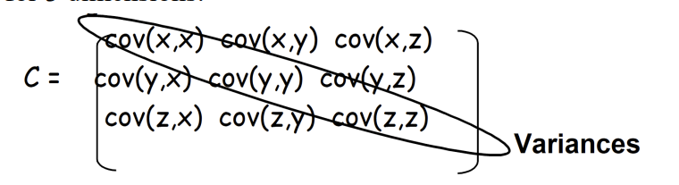
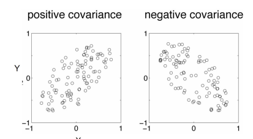

# Week 4 Note

## Hough Transform Bascis

- Find edges by convolving with the derivative of a Gaussian filter in two directions
- Steps:
  - Take image
  - Convolve mask with image for each direction
    - Calculate derivatives Gx and Gy
  - Calculate magnitude = $M(\hat{G}) = \sqrt{\hat{G}_x^2 + \hat{G}_y^2}$

- The basic idea
  - 基本思想
  - Each straight line in this image can be described by an equation
    - 此图像中的每条直线都可以用一个方程来描述
  - Each white point if considered in isolation could lie on an infinite number of straight lines
    - 如果单独考虑，每个白点可能位于无数条直线上
  - In the Hough transform each point votes for every line it could be on
    - 在霍夫变换中，每个点都会为它可能所在的每条线投票
  - The lines with the most votes win
    - 获得最多投票的线获胜

- How do we represent lines?
  - 我们如何表示线？ 
  - Any line can be represented by two numbers
    - 任何线都可以用两个数字表示
  - Here we will represent the yellow line by $(w,\phi)$
    - 这里我们将用 $(w,\phi)$ 表示黄线
  - In other words we define it using
    - 换句话说，我们使用以下方式定义它
    - a line from an agreed origin
      - 从约定的原点开始的线
    - of length w
      - 长度为 w
    - at angle $\phi$ to the horizontal
      - 与水平面成 $\phi$ 角

> #### Hough Transform
> 
> - Create $\phi$ and $w$ for all possible lines
> - Create an array A indexed by $\phi$ and $w$
> - For each point $(x,y)$
>   - for each angle $\phi$
>     - $w = x \cdot \cos(\phi) + y \cdot \sin(\phi)$
>     - $A[\phi, w] = A[\phi, w] + 1$
>   - end
> - end
> 
> - where A > Threshold return a line

- Hough Transform
  - 霍夫变换
  - There are generalised versions for ellipses, circles
    - 有针对椭圆、圆的通用版本
  - For the straight line transform we need to supress non-local maxima
    - 对于直线变换，我们需要抑制非局部最大值
  - The input image could also benefit from edge thinning
    - 输入图像也可以从边缘细化中受益
  - Single line segments not isolated
    - 单线段不孤立
  - Will still fail in the face of certain textures
    - 面对某些纹理仍会失败

## Face Recognition

### Eigenfaces: the idea

- Think of a face as being a weighted combination of some “component” or “basis” faces
  - 将人脸视为一些“组件”或“基础”人脸的加权组合
- These basis faces are called eigenfaces
  - 这些基础人脸称为特征人脸
  
- Eigenfaces: representing faces
  - 特征人脸：表示人脸
  - These basis faces can be differently weighted to represent any face
    - 这些基础人脸可以采用不同的权重来表示任何人脸
  - So we can use different vectors of weights to represent different faces
    - 因此我们可以使用不同的权重向量来表示不同的人脸

### Eigenvectors and Eigenvalues

We can use the eigenfaces in two ways
  我们可以用两种方式使用特征脸
1. we can store and then reconstruct a face from a set of weights
  - 我们可以存储然后根据一组权重重建一张脸
2. we can recognise a new picture of a familiar face
  - 我们可以识别一张熟悉脸的新照片

### Co-variance

### Learning Eigenfaces from training sets of faces

- All we are doing in the face case is treating the face as a point in a high-dimensional space, and then treating the training set of face pictures as our set of points 
  - 在人脸案例中，我们所做的就是将人脸视为高维空间中的一个点，然后将人脸图片的训练集视为我们的点集
- To train: 
  - 训练：
    - Take your images, and re-arrange as a 2Dmatrix  
      - 拍摄图像，并重新排列为 2D 矩阵
        - Rows: Each image  
          - 行：每张图像
        - Columns: Each pixel value 
          - 列：每个像素值
    - We calculate the covariance matrix of the faces 
      - 我们计算人脸的协方差矩阵
    - We then find the eigenvectors of that covariance matrix 
      - 然后我们找到该协方差矩阵的特征向量
- These eigenvectors are the eigenfaces or basis faces  
  - 这些特征向量是特征脸或基础脸
- Eigenfaces with bigger eigenvalues will explain more of the variation in the set of faces, i.e. will be more distinguishing 
  - 具有较大特征值的特征脸将解释人脸集中的更多变化，即更具区分性

- Eigenfaces: image space to face space
  - When we see an image of a face we can transform it to face space
    $$
      W_k = x^i.v_k
    $$
  - There are k=1..n eigenfaces $v_k$
  - The $i^{th}$ face in image space in a vector $x^i$
  - The corresponding weight is $w_k$
  - We calculate the corresponding weight for every eigenface

### Recognition and reconstruction

- Recognition in face space
  - Recognition is now simple. We find the euclidean distance d between our face and all the other stored faces in face space:
    $$ d(w^1, w^2) = \sqrt{\sum_{i=1}^{n} (w_i^1 - w_i^2)^2} $$

  - The closest face in face space is the chosen match

- Reconstruction
  - The more eigenfaces you have the better the reconstruction, but you can have high quality reconstruction even with a small number of eigenfaces
    - 特征脸越多，重建效果越好，但即使使用少量特征脸也可以获得高质量的重建

## Principal Components Analysis

### Covariance

- Variance and Covariance
  - 方差和协方差
  - measure of the “spread” of a set of points around their centre of mass (mean)
    - 测量一组点围绕其重心（平均值）的“分布”
  - Variance
    - 方差
    - measure of the deviation from the mean for points in one dimension e.g. heights
      - 测量某一维度上的点与平均值的偏差，例如高度
  - Covariance
    - 协方差
    - measure of how much each of the dimensions vary from the mean with respect to each other
      - 测量每个维度相对于平均值的差异
    - measured between 2 dimensions to see if there is a relationship between the 2 dimensions e.g. number of hours studied & marks obtained
      - 在两个维度之间进行测量，以查看这两个维度之间是否存在关系，例如学习时长和获得的分数
      $$\text{COV}(x_1, x_2) = \frac{\sum_{i=1}^{n} (x_1^i - \overline{x}_1)(x_2^i - \overline{x}_2)}{n - 1}$$
  - For a 3-dimensional data set (x,y,z)
    - 对于三维数据集 (x,y,z)
    - measure the covariance between
      - 测量以下维度之间的协方差：
      - x and y dimensions, 
        - x 和 y 维度，
      - y and z dimensions. 
        - y 和 z 维度。 
      - x and z dimensions.
        - x 和 z 维度。 
    - Measuring the covariance between
      - 测量以下维度之间的协方差：
      - x and x
        - x 和 x
      - y and y
        - y 和 y
      - z and z
        - z 和 z
    - Gives you the variance of the x , y and z dimensions respectively
      - 分别给出 x、y 和 z 维度的方差

- Covariance Matrix
  - Representing Covariance between dimensions as a matrix e.g. for 3 dimensions:  
    
  - Diagonal is the variances of x, y and z
    - 对角线是 x、y 和 z 的方差
  - cov(x,y) = cov(y,x) hence matrix is symmetrical about the diagonal
    - cov(x,y) = cov(y,x) 因此矩阵关于对角线对称
  - N-dimensional data will result in NxN covariance matrix
    - N 维数据将产生 NxN 协方差矩阵

- Covariance examples
  - 协方差示例
  - A positive value of covariance 
    - 协方差为正值
    - Both dimensions increase or decrease together e.g. as the number of hours studied increases, the marks in that subject increase.
      - 两个维度一起增加或减少，例如，随着学习时间的增加，该科目的分数也会增加。
  - A negative value
    - 负值
    - while one increases the other decreases, or vice-versa e.g. Hours awake vs performance in Final Assessment.
      - 一个增加，另一个减少，反之亦然，例如，清醒时间与期末评估表现。
  - If covariance is zero:
    - 如果协方差为零：
    - the two dimensions are independent of each other e.g. heights of students vs the marks obtained in the Quiz
      - 两个维度彼此独立，例如，学生身高与测验成绩

- Covariance calculations are used to find relationships between dimensions in high dimensional data sets(usually greater than 3) where visusalization is difficult

### Principal components analysis(PCA)

- PCA is a technique that can be used to simplify a dataset
  - PCA 是一种可用于简化数据集的技术
  - A linear transformation that chooses a new coordinate system for the data set such that:
    - 一种线性变换，它为数据集选择一个新的坐标系，使得：
  - greatest variance by any projection of the data set comes to lie on the first axis (then called the first principal component),
    - 数据集的任何投影的最大方差位于第一个轴上（然后称为第一个主成分），
  - the second greatest variance on the second axis
    - 第二大方差位于第二个轴上
  - and so on.
    - 依此类推。 
- PCA can be used for reducing dimensionality by eliminating the later (none substantial principal components.)
  - PCA 可用于通过消除后者（非实质性主成分）来降低维数。

- Given a set of points, how do we know if they can be compressed like in the previous example?
  - 给定一组点，我们如何知道它们是否可以像前面的例子一样被压缩？ 
- The answer is to look into the correlation between the points
  - 答案是研究点之间的相关性
- The tool for doing this is called PCA
  - 用于执行此操作的工具称为 PCA

-----

- What is the principal component.
  - 什么是主成分。 
  - By finding the eigenvalues and eigenvectors of the covariance matrix, we find that the eigenvectors with the largest eigenvalues correspond to the dimensions that have the strongest correlation in the dataset.
    - 通过找到协方差矩阵的特征值和特征向量，我们发现具有最大特征值的特征向量对应于数据集中相关性最强的维度。 
- PCA is a useful statistical technique that has found application in:
  - PCA 是一种有用的统计技术，已应用于：
  - fields such as face recognition and image compression
    - 人脸识别和图像压缩等领域
  - finding patterns in data of high dimension.
    - 在高维数据中查找模式。

### PCA Theorem

- Each $x_j$ can be written as:
  $$ X_j = \bar{X} + \sum_{i=1}^{n} g_{ji}e_i $$
- where $e_i$ are the $n$ eigenvectors of Q with non-zero eigenvalues
- Remember
  - The eigenvectors $e_1, e_2, \ldots, e_n$ span an eigenspace.
  - $e_1, e_2, \ldots, e_n$ are $N \times 1$ orthonormal vectors (directions in N-Dimensional space).
  - The scalars $g_{ji}$ are the coordinates of $x_j$ in the space.

  $$ g_{ji} = (\vec{x}_j - \bar{X}) \cdot e_i $$

Using PCA to Compress Data

- Expressing $x$ in terms of $e_1, e_2, \ldots, e_n$ has not changed the size of the data.
- **BUT:**
  - if the points are highly correlated many of the coordinates of $x$ will be zero or close to zero.
    - 如果这些点高度相关，则 $x$ 的许多坐标将为零或接近于零。 
  - This means they lie in a lower-dimensional linear subspace.
    - 这意味着它们位于低维线性子空间中。
- Sort the eigenvectors $e_i$ according to their eigenvalue: $\lambda_1 \geq \lambda_2 \geq \ldots \geq \lambda_n$
- Assuming that: $\lambda_i \approx 0$ if $i > k$
- Then: $x_j \approx \bar{x} + \sum_{i=1}^{k} g_{ji}e_i$

### Implementing PCA

- Finding the *first k eigenvectors of Q*:
$$
Q = XX^T = \begin{bmatrix}
    x_1 - \bar{x} & x_2 - \bar{x} & \cdots & x_n - \bar{x}
\end{bmatrix}
\begin{bmatrix}
    (x_1 - \bar{x})^T \\
    (x_2 - \bar{x})^T \\
    \vdots \\
    (x_n - \bar{x})^T
\end{bmatrix}
$$
- Q is N X N (N could be the number of pixels in an image. For a 256 x 256 image, N = 65536 !!)
- Don't want to explicitly compute Q!!!!

-----

Singular Value Decomposition (SVD)

- Any $m \times n$ matrix $X$ can be written as the product of 3 matrices:

$$
X = UDV^T
$$

- where:
  - $U$ is $m \times m$ and its columns are orthonormal vectors
  - $V$ is $n \times n$ and its columns are orthonormal vectors
  - $D$ is $m \times n$ diagonal and its diagonal elements are called the singular values of $X$, and are such that:
    - $s_1 \ge s_2 \ge s_3 \ge \dots \ge 0$

-----

SVD Properties

$$
X = UDV^T
$$

- The columns of U are the eigenvectors of $XX^T$
- The columns of V are the eigenvectors of $X^TX$
- The diagonal elements of D are the eigenvalues of $XX^T$ and $X^TX$
