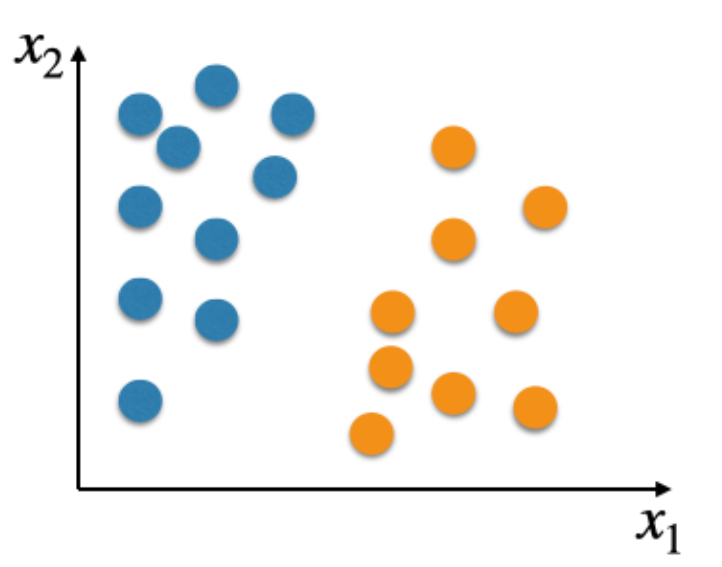

# Assignment 1 Review

## 1a - Introduction

1. In classification problems  
    - [ ] the independent variables are numeric. 
    - [ ] both the input and output variables are categorical. 
    - [x] we are interested in learning a function that can separate examples of different categories.
    - [ ] both the input and output attributes are numeric. 
    - [ ] the dependent variable is numeric. 
    - [x] the dependent variable is categorical. 
    > 从分类问题的目的角度出发 -> 找到能够分类的方程，输出结果是分类结果

2. In regression problems
    - [ ] the dependent variable is categorical. 
    - [ ] the dependent variable is categorical. 
    - [ ] both the input and output attributes are numeric. 
    - [ ] both the input and output variables are categorical. 
    - [ ] we are interested in learning a function that can separate examples of different categories.
    - [x] the output variable is numeric. 
    - [x] we are interested in learning a function that estimates a numeric value based on the inputs.
    > 从回归问题的目的角度出发 -> 找到能够预测结果的方程, 输出结果是数字

3. Consider a problem where we wish to estimate the amount of effort in person-hours required to develop a software project based on features describing the project, such as required reliability, required memory, programming language, estimated size and team expertise. You collect a dataset containing several examples of previous projects described by such features and their actual required effort. You wish to use machine learning to learn the estimation function based on this dataset. This problem is an example of:
    - [ ] A classification problem. 
    - [x] A supervised learning problem. 
    - [x] A regression problem. 
    > 预测结果 -> 监督学习  
    > 输出结果是数字 -> 回归问题

4. Is the following statement true of false?  
   "Machine learning can be seen as a field within AI."   
   Reflect on why that the statement is true or false.
   - [x] True
   - [ ] False
   > ML在AI领域内

## 1b - Logistic Regression Hypothesis set

1. Is the following statement ture or false?  
   In supervised learning, we are interested in learning models able to perform well on unseen examples of a given unknown probability distribution.
   - [x] True
   - [ ] False
   > 监督学习目的就是预测

2. Is the following statement true or false?  
   In supervised learning, each training example consists of a single vector representing the input variables of the problem.
   - [ ] True
   - [x] False
   > 监督学习的输入不仅要有代表输入值的vector, 还需要有对应的结果标签

3. Consider a binary classification problem with 2 independent variables.  
   Consider that the coefficients to be used with Logistic Regression are:
   $$
    \vec{w}^T = (0.1, 0.2 ,0.6)
   $$
   What class would Logistic Regression predict for a new instance
   $$
    \vec{X}^T = (1,1,3)
   $$
   - [ ] Class 0
   - [x] Class 1
   > $logit(p_1) = \vec{w}^T\vec{x} = w_0x_0 + w_1x_1 + w_2x_2 = 0.1x_0 + 0.2x_1 + 0.6x_2 = 0.1 \times 1 + 0.2 \times 1 + 0.6 \times 3 = 2.1$  
   > As $2.1 \geq 0$, the predicted class is class 1  

4. What is the probability $p_1$ for the new instance $x^T = (1,1,3)$ in the previous exercise?
   - 0.8909
   > $p_1 = \frac{e^{\vec{w}^T\vec{x}}}{1 + e^{\vec{w}^T\vec{x}}} = \frac{e^{2.1}}{1 + e^{2.1}} = 0.8909$

5. Given that logistic regression models the logit of p1 as a linear combination of the input variables ($logit(p_1) = \vec{w}^T\vec{x}$), show that this correspods to modelling a probability of the format
   > $$
   >   logit(p_1) = \vec{w}^T\vec{x} \\
   >   \ln(\frac{p_1}{1 - p_1}) = \vec{w}^T\vec{x} \\
   >   e^{\ln(\frac{p_1}{1 - p_1})} = e^{\vec{w}^T\vec{x}} \\
   >   \frac{p_1}{1 - p_1} = e^{\vec{w}^T\vec{x}}\\
   >   p_1 = e^{\vec{w}^T\vec{x}} \times (1 - p_1) \\
   >   p_1 = e^{\vec{w}^T\vec{x}} - p_1 \times e^{\vec{w}^T\vec{x}} \\
   >   p_1 + p_1 \times e^{\vec{w}^T\vec{x}} = e^{\vec{w}^T\vec{x}} \\
   >   p_1 \times (1 + e^{\vec{w}^T\vec{x}}) = e^{\vec{w}^T\vec{x}} \\
   >   p_1 = \frac{e^{\vec{w}^T\vec{x}}}{1 + e^{\vec{w}^T\vec{x}}}
   > $$

6. Explain what does it mean for us to say that the hypothesis set of logistic regression for binary classification problems is 
   $$
    h(\vec{x}) = p_1 = p(1|\vec{x},\vec{w}) = \frac{e^{(\vec{w}^T\vec{x})}}{1 + e^{(\vec{w}^T\vec{x})}}, \forall \vec{w} \in R^{d+1}
   $$
   > It means that logistic regression is a learning approach that can learn sigmoid functions of the format $\frac{e^{(\vec{w}^T\vec{x})}}{1 + e^{(\vec{w}^T\vec{x})}}$ in an attempt to approximate the true undelying conditional probability $P(1|x)$ of the class being 1 given the input variables $\vec{x}$ for a given problem
   >
   > In Logistic Regression, we are assuming that $P(y|\vec{x})$ is a Bernoulli Distribution
   >
   > The hypothesis set consists of functions of the format $\frac{e^{(\vec{w}^T\vec{x})}}{1 + e^{(\vec{w}^T\vec{x})}}$, for any $\vec{w} in R^{d+1}$. Therefore, the parameters to be learned by the learning algorithm are $\vec{w}$. Learning consists of determing a good value for $\vec{w}$ based on the training examples.

## 1c - Logistic Regression Loss Function and Gradient Descent

1. Consider a given training set containing the following examples:
   $$
    x^{(1)} = (0.1, 0.1)^T, y^{(1)} = 1\\
    x^{(2)} = (0.1, 0.2)^T, y^{(2)} = 0\\
    x^{(3)} = (0.2, 0.2)^T, y^{(3)} = 1
   $$
   Assume that we augment our examples with an additional variable $x_0 = 1$ as done in Lecture 1b and that the weights of our logistic regression model are $\vec{w} = (0,0,0)^T$.

   Calculate the cross-entropy loss for the logistic regression model on this training set and enter it in the text box below.

   - 2.0794

   > $$
   >     \varepsilon(\vec{w}) = -\ln(L(\vec{w})) = -\sum\limits^N_{i=1}y^i\ln p(1|\vec{x}^i,\vec{w}) + (1-y^i)\ln (1 - p(1|\vec{x}^i,\vec{w})) \\
   >     = -[1 \times \ln(p_1(\vec{x}^{(1)},\vec{w})) + (1-0) \times \ln(1 - p_1(\vec{(2)}, \vec{w})) + 1 \times \ln (p_1(\vec{x}^{(3)}, \vec{w}))]\\
   >     = -[3 \times ln(\frac{e^0}{1 + e^0})] \\
   >     = 2.0794
   > $$

2. Consider a given training set containing the following examples:
   $$
    \vec{x}^{(1)} = (0.1)^T, y^{(1)} = 1\\
    \vec{x}^{(2)} = (0.2)^T, y^{(2)} = 0
   $$
   Assume that we augment our examples with an additional variable $x_0 = 1$ as done in Lecture 1b, that the weights of our logistic regression model are $\vec{w} = (0,0)^T$ and that our learning rate is $\eta = 0.1$

   What would be the coefficients $\vec{w}$ after one iteration of the Batch Gradient Descent?

   - $w_0 = 0$
   - $w_1 = -0.005$

   > The weight update rule is:
   > $$
   >   \vec{w} = \vec{w} - \eta\triangledown\varepsilon(\vec{w})
   > $$
   > where
   > $$
   >   \triangledown\varepsilon(\vec{w}) = \sum_{i=1}^N(p(1|\vec{x}^{(i)}, \vec{w}) - y^{i})x^{(i)}
   > $$
   > Therefore, we need to compute the gradient in order to update the weights
   > $$
   >   \triangledown\varepsilon(\vec{w}) = [(\frac{e^0}{1+e^0} - 1)
   >   \begin{pmatrix}
   >      1 \\ 0.1
   >   \end{pmatrix}]
   >   + [(\frac{e^0}{1+e^0} - 0)
   >   \begin{pmatrix}
   >      1 \\ 0.2
   >   \end{pmatrix}]
   >   = \begin{pmatrix}
   >      -0.5 \\ -0.05
   >   \end{pmatrix}
   >   + \begin{pmatrix}
   >      0.5 \\ 0.1
   >   \end{pmatrix}
   >   = \begin{pmatrix}
   >      0 \\ 0.05
   >   \end{pmatrix}
   > $$
   > The new weights are thus going to be:
   > $$
   >    \vec{w} = \vec{w} - \eta\triangledown\varepsilon(\vec{w})
   >    = \begin{pmatrix}
   >      0 \\ -0.005
   >   \end{pmatrix}
   > $$

3. The probability p1 for each of the examples in Question 2 was 0.5 before the update in the coefficients $\vec{w}$. What is the probability $p_1$ for the example $x^{(1)}$ after the update?
   - 0.4999

4. And what is the probability $p_1$ for the example $x^{(2)}$ after the update?
   - 0.4998

5. The lecture mentioned that the negative log-likelihood is equivalent to the cross-entropy loss, i.e.:
   $$
    E(\vec{w}) = -\ln(L(\vec{w})) = -\sum^N_{i=1}\ln p_{y^{(i)}}
   $$
   is equivalent to:
   $$
    E(\vec{w}) = -\sum^N_{i=1}y^{(i)}\ln p(1|\vec{x}^{(i)}, w) + (1 - y^{(i)})\ln (1 - p(1|\vec{x}^{(i)}, \vec{w}))
   $$
   Show that this is true
   
   - 略

## 2a - Logistic Regression - IRLS

1. Consider the function $f(x) = x^2$. The first-order derivative is $f'(x) = 2x$ and the second-order derivative is $f''(x) = 2$.

   Consider that we initialise the value of $x$ as $x = 10$. Apply the Newton-Raphson update rule once and enter the new value of $x$ in the space below.
   - 0
   $$
     x = x - \frac{f'(x)}{f''(x)} = 10 - 2 \times 10 \div 2 = 0
   $$

2. In Question 1, Newton-Raphson was able to find the optimum value for $x$ in a single step. Why was that the case?
   - Newton-Raphson was able to find this optimum in a single step because this function is quadratic. The quadratic approximation used by Newton-Raphson takes us directly to the optimum of the quadratic approximation by solving the equation shown in Slide 10. In the case of our function $f(x) = x^2$, the quadratic approximation is the quadratic function itself.

3. Consider a problem with the following training set, where the input vector has already been augmented with a dummy variable fixed to the value of 1:  
   $$
    \vec{x}^{(1, 0.1, 0.2)} = (0.1)^T, y^{(1)} = 1\\
    \vec{x}^{(1, 0.3, 0.4)} = (0.2)^T, y^{(2)} = 0
   $$
   Compute the Hessian for Logistic Regression using Cross-Entropy Loss when the weights of the model are $w=(0,0,0)^T$.

   > $$
   >    \begin{align*}
   >    H_E(\vec{w}) &= \sum\limits^N_{i=1}p(1|\vec{x}^{(i)},\vec{w})(1-p(1|\vec{x}^{(i)}, \vec{w}))\vec{x}^{(i)}\vec{x}^{(i)^T} \\
   >    &= p_1(\vec{x}^{(1)}, \vec{w})(1 - p_1(\vec{x}^{(1)}, \vec{w}))\vec{x}^{(1)}{\vec{x}^{(1)}}^T + p_1(\vec{x}^{(2)}, \vec{w})(1 - p_1(\vec{x}^{(2)}, \vec{w}))\vec{x}^{(2)}{\vec{x}^{(2)}}^T\\
   >    &= 0.5 \times 0.5 \times \begin{pmatrix} 1 & 0.1 & 0.2 \\ 0.1 & 0.01 & 0.02 \\ 0.2 & 0.02 & 0.04 \end{pmatrix} + 0.5 \times 0.5 \times \begin{pmatrix} 1 & 0.3 & 0.4 \\ 0.3 & 0.09 & 0.12 \\ 0.4 & 0.12 & 0.16 \end{pmatrix} \\
   >    &= \begin{pmatrix} 0.25 & 0.025 & 0.05 \\ 0.025 & 0.0025 & 0.005 \\ 0.05 & 0.005 & 0.01 \end{pmatrix} + \begin{pmatrix} 0.25 & 0.075 & 0.1 \\ 0.075 & 0.0225 & 0.03 \\ 0.1 & 0.03 & 0.04 \end{pmatrix} \\
   >    &= \begin{pmatrix} 0.5 & 0.1 & 0.15 \\ 0.1 & 0.025 & 0.035 \\ 0.15 & 0.035 & 0.05 \end{pmatrix}
   >    \end{align*}
   > $$

4. In the lecture, we have been mainly discussing the use of Newton-Raphson for convex functions, as Logistic Regression with Cross-Entropy Loss uses a convex loss function. In Question 1, we used Newton-Raphson to find the minimum of $f(x) = x^2$, which is a convex quadratic function. 

   > What would happen if we applied Newton-Raphson to a concave quadratic function, e.g., $f(x) = - x^2$?
   > 
   > Instead of finding the minimum of the function, Newton-Raphson would retrieve the maximum of the function. 
   > 
   > The second order derivative of a `convex` region is positive. So, when we subtract the gradient from the current value of w in the update rule $x = x - \frac{f'(x)}{f''(x)}$, we would be moving in the opposite direction of the gradient (as in Gradient Descent), which takes us in the direction of the minimum.
   > 
   > However, the second order derivative of a concave region is negative. This negative sign would "interact" with the negative sign of the subtraction of the gradient from the current value of w. As a result, we would be making an update in the direction of the gradient, instead of in the opposite direction of the gradient. Therefore, the update would be in the direction of the maximum, instead of the being in the direction of the minimum.
   > 
   > Overall, Newton-Raphson can be used in an attempt to find the minimum or maximum of a function.

## 2c - Nonlinear Transformations

1. Consider a binary classification problem where there are three input variables $x_1, x_2, x_3$. Assume that the decision boundary to separate the examples of the two different classes would have to be quadratic. What feature transform $\phi(\vec{x})$ could you use to successfully separate the examples when using logistic regression?
   - A possible basis expansion would be:
     $$
        \phi(\vec{x}) = (1, x_1, x_2, x_3, x_1^2, x_2^2, x_3^2, x_1x_2, x_1x_3, x_2x_3)^T
     $$

2. Explain why you believe the basis expansion from Question 1 would work to successfully separate the examples when using logistic regression.
   - If we expand the equation $\vec{w}\phi(\vec{x}) = 0$, we get:
     $$
        w_0+ w_1x_1 + w_2x_2+ w_3x_3+ w_4x_1^2+ w_5x_2^2+ w_6x_3^2+ w_7x_1x_2+ w_8x_1x_3+ w_9x_2x_3 = 0
     $$
     As we can see, even though the equation is linear as a function of $\phi(\vec{x})$, it is quadratic as a function of $x_1$ ,$x_2$  and $x_3$. Therefore, the hyperplane representing the decision boundary in the higher dimensional embedding $\phi(\vec{x})$ is actually a quadratic function in the original input space.

3. Consider the problem below, where there is a two dimensional input space and examples belong to classes orange or blue.  
    
   Which basis expansions are valid basis expansions for this problem and would enable logistic regression to learn a decision boundary that  separates all training examples? Tick all that apply.
   - [x] $\phi(\vec{x}) = (1,x_1,x_2)$
   - [x] $\phi(\vec{x}) = (1,x_1,x_2,x_1^2,x_2^2,x_1x_2)$
   - [ ] $\phi(\vec{x}) = (1,x_1,x_2,x_3)$

4. Assume that you have a feature transform $\phi(\vec{x}) = (1,x_1,x_2^2)$ for a problem where $\vec{x} = (1,x_1,x_2)^T$.

   Assume that you've learned a linear decision boundary $\vec{w}^T\phi(\vec{x}) = 0$ for this problem based on logistic regression, where $\vec{w} = (w_0, w_1, w_2)^T$.

   What is the decision boundary in the original input space?

   - The decision boundary in the original space (i.e., as a function of $\vec{x}$ intead of $\phi(\vec{x})$ would be:
     $$
        w_0 + w_1x_1 + w_2x^2_2 = 0
     $$

5. The decision rule for the model learned in the previous question is:

   If $\vec{w}^T\phi(\vec{x})$, predict class 1. Otherwise, predict class 0.

   What class would be predicted for the example $\vec{x} = (1,2,3)$ when $\vec{w} = (1, 0, 1)$?

   - $$
        1 + 0 \times x_1 + 1 \times x^2_2 = 10
     $$
     As $10 > 0$, we predict class 1

## 3a - SVM: Maximum Margin Classifier

1. Consider a given training set containing the following examples:
   $$
    x^{(1)} = (0.1, 0.1)^T, y^{(1)} = red\\
    x^{(2)} = (0.1, 0.2)^T, y^{(2)} = blue\\
    x^{(3)} = (0.2, 0.2)^T, y^{(3)} = blue
   $$
   Consider a decision boundary defined as:
   $$
    x_2 - 0.15 = 0
   $$
   What is the margin formed by this decision boundary?

   - For $x_1, x_2, x_3$, the distance is
     $$
        dist = \frac{|0.1 - 0.15|}{1} = 0.05\\
        dist = \frac{|0.2 - 0.15|}{1} = 0.05\\
        dist = \frac{|0.2 - 0.15|}{1} = 0.05\\
     $$

2. Consider the formulation of the quadratic programming problem that needs to be solved in support vector machines:
   $$
    \argmin_{\vec{w,b}}{\frac{1}{2}||\vec{w}||^2}\\
    y^{(n)}h(\vec{x}^{(n)}) \geq 1, \forall(\vec{x}^{(n)},y^{(n)}) \in T
   $$

   Why is it convenient for us to consider the two different classes to be represented by +1 and -1?

   - By doing that, we can easily write the constraints as products $y^{(n)}h(\vec{x}^{(n)})$ that need to be larger or equal to 1. In particular, these constraints come from the constraints $y^{(n)}h(\vec{x}^{(n)}) > 0$, which indicate that all examples need to be correctly classified. By using +1 and -1 to represent the classes, we know that this product will be positive when an example is correctly classified and negative when an example is incorrectly classified

3. Consider the problem below, where there is a two dimensional input space and examples belong to classes orange or blue.  
     
   Which basis expansions are valid basis expansions for this problem that would enable a `support vector machine` to learn a decision boundary that perfectly separates all training examples? Tick all that apply.
   - [x] $\phi(\vec{x}) = (x_1,x_2)$
   - [ ] $\phi(\vec{x}) = (x_1,x_2,x_3)$
   - [x] $\phi(\vec{x}) = (1,x_1,x_2)$
   - [x] $\phi(\vec{x}) = (1,x_1,x_2,x_1^2,x_2^2,x_1x_2)$

4. Consider a decision boundary $h(\vec{x}) = w_1x_1 + w_2x_2 + b = 0$. Show that rescaling $w_1, w_2$ by dividing them by $\min_ny^{(n)}h(\vec{x}^{(n)})$ will ensure that $yh(\vec{x}) = 1$ for the training example that is the closest to the decision boundary.
   - $$
       y^{(k)}h_{old}(\vec{x}^{(k)}) = \min_ny^{(k)}h_{old}(\vec{x}^{(k)}) = a\\
       y^{(k)}h_{new}(\vec{x}^{(k)}) = y^{(k)}(\frac{w_{old,1}}{a}x^{(k)}_1 + \frac{w_{old,2}}{a}x^{(k)}_2 + \frac{b_{old}}{a})\\
       = y^{(k)}(w_{old,1}x_1^{(k)} + w_{old,2}x_2^{(k)} + b_{old})\frac{1}{a} = y^{(k)}h_{old}(\vec{x}^{(k)})\frac{1}{a} = a\frac{1}{a} = 1
     $$