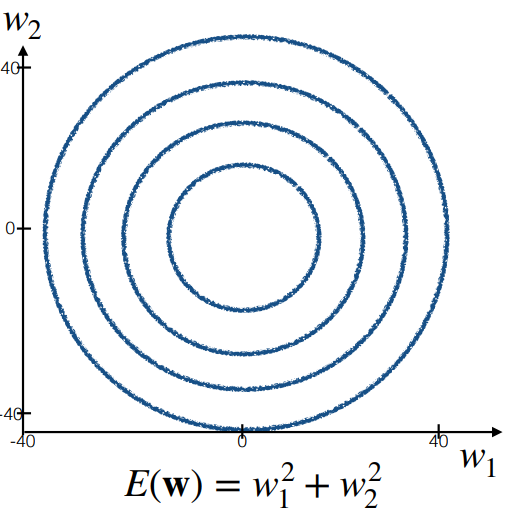
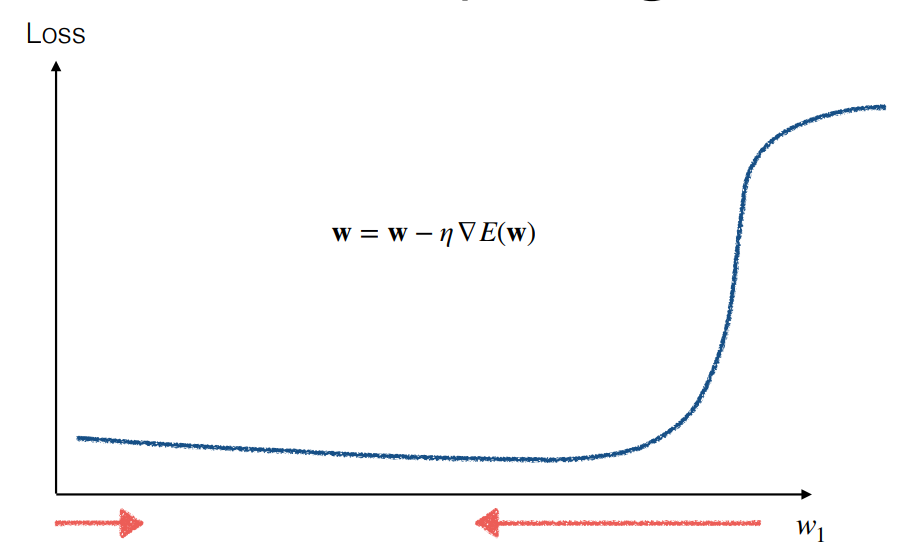
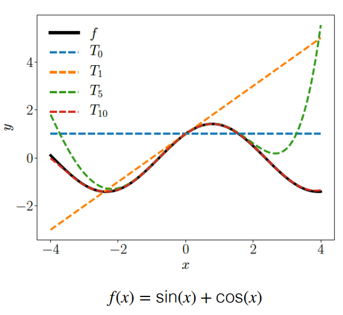
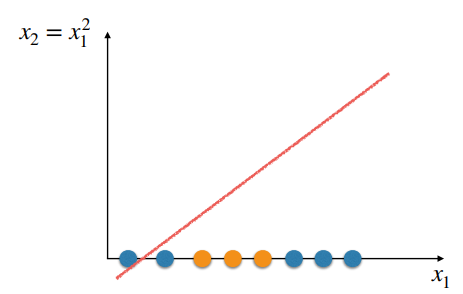
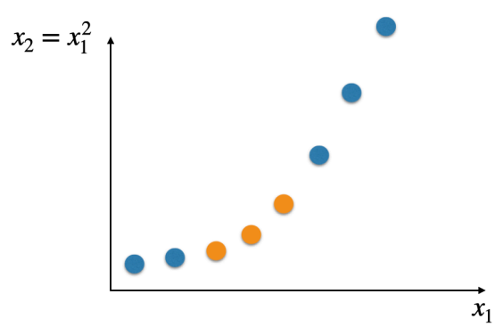

# Week 2 Note

## Gradient Descent

- Local Minima and Learning Rate
  - Gradient descent can get stuck in `local minima`
    - But this is not an issue in the case of **Logistic Regression** using **Cross-Entropy Loss**, because the function being optimised is `strictly convex`
  - **Too large** learning rate - The algorithm may **jump across** the optimum
  - **Too small** learning rate - It may take a **long time** to find the optimum

- Differential Curvature
  
  

  $$
    E(\vec{w}) = w^2_1 + w^2_2 \space\text{for example}
  $$

  - Contour plots(等高线图) of the loss function, where each line corresponds to points in the input space where the loss is the same
  - Steepest descent forms a 90 degree angle with the line

  $$
    E(\vec{w}) = w^2_1 + 4w^2_2
  $$

  - In the elliptical bowl function, the gradients along the $w_1$ and $w_2$ axis have different magnitudes

    > $\frac{\partial E}{\partial w_2} > \frac{\partial E}{\partial w_1}$ depending on the location

  - The path of the steepest descent in most loss functions is only an instantaneous direction of best movement, and is not eh best direction in the longer term

- Standardisation
  - Different partial dervatives with respect to different weights can be a result of different input variables having different scales and variances affecting the loss function to different extents
  - Standardising input variables (e.g., by deducting the mean from each input variable and then dividing by the standard deviation) can help with this

- Difficult Topologies(可能存在的, GD非最优解的情况)
  
  

  - Smaller gradient, slow due to small steps
  - Big gradient, likely to overshoot

## Newton-Raphson

$$
    w = w - \frac{E'(w)}{E''(w)}
$$

> **Reduce** the size of the update if the curvature is high

- `Taylor Polynomial of degree` $n$ can be used to approximate a function $E(w)$ at $w_0$:

  

  $$
    T_n(w) = \sum\limits^n_{k = 0}\frac{E^{k}(w_0)}{k!}(w-w_0)^k
  $$

  where $E^{(k)}(w_0)$ is the $k$-th order derivative of $E$ at $w_0$

  > 在知道函数在$w_0$处的所有信息（即其值及其所有导数的值）的情况下，如何在该点附近近似函数的值

- `Taylor polynomial of degree 2` to approximate our loss function at $w_0$

  $$
    \frac{d}{dw}(E(w_0) + (w-w_0)E'(w_0)+\frac{(w-w_0)^2}{w}E''(w_0)) = 0
  $$

  this will lead to the following `weight update rule`:

  $$
    w := w - \frac{E'(w)}{E''(w)}
  $$

### Newton-Raphson Method: Multivariate Case

- The `Hessian matix`

  $$
      \frac{\partial}{\partial x_i}(\frac{\partial f}{\partial x_i}) = \frac{\partial^2f}{\partial x_i^2}, \frac{\partial}{\partial x_i}(\frac{\partial f}{\partial x_j}) = \frac{\partial^2f}{\partial x_i\partial x_j}
  $$

  $$
      H(f(\vec{x})) = H_f(\vec{x}) = 
      \begin{bmatrix}
        \frac{\partial^2 f}{\partial x_0^2} & \frac{\partial^2 f}{\partial x_0 \partial x_1} & \cdots & \frac{\partial^2 f}{\partial x_0 \partial x_n} \\
        \frac{\partial^2 f}{\partial x_1 \partial x_0} & \frac{\partial^2 f}{\partial x_1^2} & \cdots & \frac{\partial^2 f}{\partial x_1 \partial x_n} \\
        \vdots & \vdots & \ddots & \vdots \\
        \frac{\partial^2 f}{\partial x_d \partial x_1} & \frac{\partial^2 f}{\partial x_d \partial x_2} & \cdots & \frac{\partial^2 f}{\partial x_d^2}
      \end{bmatrix}
  $$

- Weight Update Rule
  - Univariate update rule:

    $$
        w = w - \frac{E'(w)}{E''(w)}
    $$

  - Multivariate update rule:

    $$
        \vec{w} = \vec{w} - H^{-1}_E(\vec{w})\triangledown E(\vec{w})
    $$

    where $H^{-1}_E(\vec{w})$ is the inverse of the Hessian at the old $\vec{w}$ and $\triangledown E(\vec{w})$ is the gradient at the old $w$

- Logistic Regression - Iterative Reweighted Least Squares
  $$
      \vec{w} = \vec{w} - H^{-1}_E(\vec{w})\triangledown E(\vec{w})
  $$

  $$
      H_E(\vec{w}) = \sum\limits^N_{i=1}p(1|\vec{x}^{(i)},\vec{w})(1-p(1|\vec{x}^{(i)}, \vec{w}))\vec{x}^{(i)}\vec{x}^{(i)^T}
  $$

  $$
      \triangledown_E(\vec{w}) = \sum\limits^N_{i = 1}(p(1|\vec{x}^{(i)}, \vec{w})-y^{(i)})\vec{x}^{(i)}
  $$

## Summary - Gradient Descent

Gradient descent may require a large number of iterations depending on the shape of the loss function.
- Iterative Reweighted Least Squares / Newton-Raphson can be used in an attempt to reach the minimum with less steps.
- It does so by creating a quadratic approximation of the loss function and finding the minimum of this quadratic approximation.
- This results in making use of information about the curvature of the loss function to:
- avoid large steps in directions where the gradient is changing too much or
- increase the size of the steps in directions where the gradient is not changing much

> Norm - 向量的模长

## Nonlinear Transformations

Higher dimensional embedding/feature space: $\underbrace{\phi(\vec{x})}_\text{feature transform/basis expansion} = \underbrace{(x_1, x_1^2)^T}_\text{basis functions}$

- Example for polynomial
  - of order 2and a problem with 1 input variables:
    $$
      \vec{x} = (1,x_1) \rarr \phi(\vec{x}) = (1, x_1, x_1^2)^T
    $$
  - of order 2 and a problem with 2 input variables:
    $$
      \vec{x} = (1,x_1,x_2)^T \rarr \phi(\vec{x}) = (1, x_1, x_2, x_1^2, x_2^2, x_1x_2)^T
    $$
  
> If we follow this idea, any decision boundary that is a polynomial of order $p$ in $\vec{x}$ is linear in $\phi(\vec{x})$
>
> So, we can adopt linear models in the higher dimensional embedding formed by $\phi(\vec{x})$, to learn decision boundaries corresponding to polynomials of order $p$ in $x$

### Adopting Nonlinear Transformations in Logistic Regression

$$
  logit(p_1) = \vec{w}^T\phi(\vec{x})
$$

$$
  p_1 = p(1|\phi(\vec{x}),\vec{w}) = \frac{e^{\vec{w}^T\phi(\vec{x})}}{1 + e^{\vec{w}^T\phi(\vec{x})}}
$$

$$
  \text{Given}\ \ J = \{(\phi(\vec{x}^{(1)}, y^1), (\phi(\vec{x}^{(2)}, y^2),...,(\phi(\vec{x}^{(N)},y^N)\}, \argmin\limits_{\vec{w}} E(\vec{w})
$$

$$
  E(\vec{w}) = -\sum\limits^N_{i=1}y^i\ln p(1|\phi(\vec{x}^{(i)},\vec{w}) + (1-y^i)\ln (1 - p(1|\phi(\vec{x}^{(i)},\vec{w}))
$$

$$
  \triangledown E(\vec{w}) = \sum\limits^N_{i=1}(p(1|\phi(\vec{x}^{(i)}),\vec{w}) - y^i)\phi(\vec{x}^{(i)}
$$

$$
  H_E(\vec{w}) = \sum\limits^N_{i=1}p(1|\phi(\vec{x})^i,\vec{w})(1 - p(1|\phi(\vec{x}^{(i)}), \vec{w}))\phi(\vec{x}^{(i)})\phi(\vec{x}^{(i)})^T
$$

1. Choose a nonlinear transformation.
2. Apply it to the training examples so that they have the format $(\phi(\vec{x}), y)$
3. Create a linear model $h'(\phi(\vec{x}))$ based on the transformed training examples
4. Determine the (nonlinear) model $h(\vec{x})$ by replacing $\phi_I(\vec{x})$ with the corresponding value that depends on $\vec{x}$

> - Advantages of Linear Models
>   - Linear models are often associated to relatively efficient learning algorithms
>   - They can be robust and have good generalisation properties
>
> - Caveats of Nonlinear Transforms
>   - The number of dimensions may become very high
>   - Choosing a nonlinear transformation that fits the training examples well does not necessarily mean that there will be good generalisation

### Summary - Nonlinear Transformations

- We can create nonlinear transformations to obtain a higher dimensional embedding where our problems become linearly separable, even if they were not linearly separable in the original space
- We can then adopt our original logistic regression to create a linear decision boundary in this higher dimensional embedding
- This idea can is also applicable to other linear models