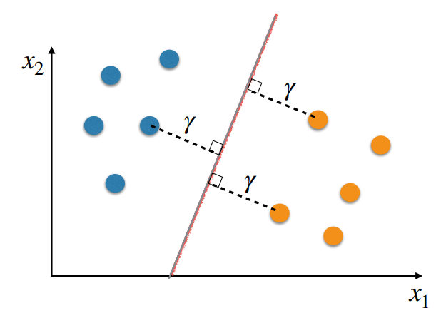
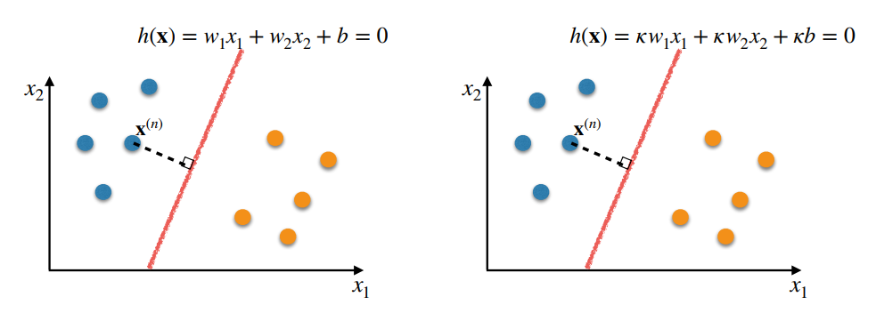
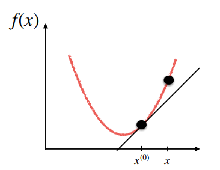

# Week 3 Note

## Support Vector Machines(SVMs)

- The perpendicular distance $\gamma$ between the decision boundary and the closest training examole is called the `margin`
- The decision boundary can be chosen so as to maximise the margin
- Training examples that are exactly on the margin are called `support vectors`

- `Given` a set of training examples
  
  $$J = \{(\vec{x}^{(1)}, y^{(1)}),(\vec{x}^{(2)}, y^{(2)}),...,(\vec{x}^{(N)}, y^{(N)})\}$$

  where $(\vec{x}^{(i)},y^{(i)})\in X \times Y$ are drawn from a fixed albeit unkown joint probability distribution $P(\vec{x},y) = P(y|\vec{x})P(\vec{x})$

- `Goal`: to learn a function $g$ able to `generalise` to unseen(test) examples of the same probability distribution $P(\vec{x},y)$
  - $g$: $X \rarr Y$, mapping input space to output space
  - $g$ as a probability distribution approximating $P(y|\vec{x})$

### Hypothesis Set

$$
  h(\vec{x}) = 
  \begin{cases}
    +1 \quad\quad if\ \vec{w}^T\vec{x}+b > 0\\
    -1 \quad\quad if\ \vec{w}^T\vec{x}+b <> 0\\
  \end{cases}
  , \forall\vec{w} \in \R^d, \forall b \in \R
$$

- Perpendicular Distance From a Point $\vec{x}^{(n)}$ to a Hyperplane $h(\vec{x}) = 0$
  $$
    dist(h, \vec{x}^{(n)}) = \frac{|h(\vec{x}^{(n)})|}{||\vec{w}||} = \frac{y^{(n)}h(\vec{x}^{(n)})}{||\vec{w}||}
  $$
  where $||w|| = \sqrt{\vec{w}^T\vec{w}}$ is the Euclidean norm(the length of the vector $\vec{w}$)

- Find $\vec{w}$ and $b$ that maximise the margin
- `Constraint`: all training examples must be correctly classified

> $$
>   \min\limits_n dist(h,\vec{x}^{(n)})\\
>   \darr\\
>   \argmax\limits_{\vec{w},b}\{\min\limits_n dist(h,\vec{x}^{(n)})\}\\
> $$
>
> `Constraint`:
> 
> $$
>   Subject\ to\ y^{(n)}h(\vec{x}^{(n)}) > 0, \forall(\vec{x}^{(n)}, y^{(n)}) \in J\\
> $$

> $$
>   \argmax\limits_{\vec{w},b}\{\min\limits_n (\frac{y^{(n)}h(\vec{x}^{(n)})}{||\vec{w}||})\}\\
>   \darr\\
>   \argmax\limits_{\vec{w},b}\{\frac{1}{||\vec{w}||}\min\limits_n(y^{(n)}h(\vec{x}^{(n)}))\}\\
> $$
>
> `Constraint`:
>
> $$
>   Subject\ to\ y^{(n)}h(\vec{x}^{(n)}) > 0, \forall(\vec{x}^{(n)}, y^{(n)}) \in J\\
>   Subject\ to\ \min\limits_ny^{(n)}h(\vec{x}^{(n)}) = 1, \forall(\vec{x}^{(n)}, y^{(n)}) \in J\\
> $$
> > - Why are these two constraints equivalent?
> >   - Rescaling $\vec{w}$ and $b$ does not change the position of the hyperplane, nor the distances of the training examples to it
> >   
> >   - If there is a hyperplane that can separate the training examples, its $\vec{w}$ and $b$ can be divided by $\min\limits_ny^{(n)}h(\vec{x}^{(n)})$ so that $y^{(n)}h(\vec{x}^{(n)}) = 1$ for the closet example

> $$
>   \argmax\limits_{\vec{w},b}\{\frac{1}{||\vec{w}||}\}\\
>   \darr\\
>   \argmin\limits_{\vec{w},b}\{||\vec{w}||\}
> $$
>
> `Constraint`:
>
> $$
>   Subject\ to\ \min\limits_ny^{(n)}h(\vec{x}^{(n)}) = 1, \forall(\vec{x}^{(n)}, y^{(n)}) \in J \ stricter\\
>   Subject\ to\ y^{(n)}h(\vec{x}^{(n)}) \geq 1, \forall(\vec{x}^{(n)}, y^{(n)}) \in J \ looser\\
> $$
>
> > The optimal solution will satisfy the equality in $y^{(n)}h(\vec{x^{(n)}}) \geq 1$ for at least one training example

> $$
>   \argmin\limits_{\vec{w},b}\{\frac{1}{2}||\vec{w}||^2\}
> $$
>
> `Constraint`:
>
> $$
>   Subject\ to\ y^{(n)}(\vec{w}^T\phi(\vec{x}^{(n)}+b) \geq 1, \forall(\vec{x}^{(n)}, y^{(n)}) \in J
> $$

## Convexity

- Convex Sets
  - A set $C$ is convex if the line segment between any two points in $C$ lies in $C$
  - For any two points $\vec{x}^{(1)}, \vec{x}^{(2)} \in C$ and any $\lambda \in (0,1)$, we have:
    $$
      \lambda \vec{x}^{(1)} + (1 - \lambda)\vec{x}^{(2)} \in C
    $$
  

- Convex Functions
  - A convex function $f(\vec{x})$ is a function with a convex domain $C$ that satisfies the following condition for any $\vec{x}^{(1)}, \vec{x}^{(2)} \in C$ and $\lambda \in (0,1)$
    $$
      f\left( \lambda \vec{x}^{(1)} + (1 - \lambda) \vec{x}^{(2)} \right) \leq \lambda f\left( \vec{x}^{(1)} \right) + (1 - \lambda) f\left( \vec{x}^{(2)} \right)
    $$
  - Strictly convex: satisfies the condition with <  
  

> - Importance of Convexity in Machine Learning/Optimisation
>   - Any minimum in a convex function is a global minimum
>   - A strictly convex function has at most one stationary (critical) point. If such a point exists, it is a global minimum

> - Concave: A function $f(\vec{x})$ is concave if $-f(\vec{x})$ is convex

- First-Derivative Characterisation of Convexity
  - A differentiable function $f(\vec{x})$ is convex iff its domain $C$ is convex and it satisfies the following condition for any pair $\vec{x}^{(0)}, \vec{x} \in C$
    $$
      f(\vec{x}) \geq \underbrace{f(\vec{x}^{(0)}) + \triangledown f(\vec{x}^{(0)}) · (\vec{x} - \vec{x}^{(0)})}_\text{Equation of the tangent line}
    $$
  - Strictly convex: satisfies the condition with > for any $\vec{x}^{(1)} \neq \vec{x}^{(2)}$  
  

- Second-Derivative Characterisation of Convexity
  - A twice differentiable function $f(\vec{x})$ is convex iff:
    - Its domain $C$ is a convex set and
    - Its Hessian $H_f(\vec{x})$ is positive semidefinite for all $\vec{x}\in C$
  - If a twice differentiable function $f(\vec{x})$
    - has a convex set $C$ as its domain and
    - its Hessian $H_f(\vec{x})$ is positive definite for all $\vec{x} \in C$
  - It is a strictly convex function.(sufficient but not necessary condition)

> - First-Order(Partial) Derivatives
>   - `(First-order) derivatives` tell us the rate of change of $f(x)$ as we increase x
>     $$
>       \frac{d}{dx}f(x) = \frac{df}{dx} = f'(x) = f^{(1)}(x)
>     $$
>   - `(First-order) partial derivatives` tell us the rate of change of $f(\vec{x})$ as we increase a specific variable $x_i$
>     $$
>       \frac{\partial f}{\partial x_i}
>     $$
>   - `(Partial) derivatives` tell us whether $f(\vec{x})$ is increasing /decreasing (along a specific axis) and how rapidly

> - Second-Order(Partial) Derivatives
>   - `Second-order derivative`: This is the derivative of the derivative of $f(x)$, denoted as $\frac{d^2 f(x)}{dx^2}$. In simpler terms, it gives the rate of change of the slope $f'(x)$.
>     $$
>       \frac{d^2}{dx^2}f(x) = \frac{d}{dx} \left( \frac{df}{dx} \right) = \frac{d^2f}{dx^2} = f''(x) = f^{(2)}
>     $$
>   - `Second-order partial derivative``: This is the partial derivative of the partial derivative of $f(x)$. It shows the rate of change of the slope along a specific axis, relative to that same axis or another one.
>     $$
>       \frac{\partial^2f}{\partial x_i^2} = \frac{\partial}{\partial x_i} \left( \frac{\partial f}{\partial x_i} \right) \\
>       \frac{\partial^2f}{\partial x_i \partial x_j} = \frac{\partial}{\partial x_i} \left( \frac{\partial f}{\partial x_j} \right)
>     $$

> - Hessian - Matrix of Second-Order Partial Derivatives
>   - Consider $f(\vec{x})$, where $\vec{x} = (x_0. x_1, ... , x_d)^T$
>     $$
>       H(f(\vec{x})) = H_f(\vec{x}) = 
>       \begin{bmatrix}
>         \frac{\partial^2 f}{\partial x_0^2} & \frac{\partial^2 f}{\partial x_0 \partial x_1} & \cdots & \frac{\partial^2 f}{\partial x_0 \partial x_n} \\
>         \frac{\partial^2 f}{\partial x_1 \partial x_0} & \frac{\partial^2 f}{\partial x_1^2} & \cdots & \frac{\partial^2 f}{\partial x_1 \partial x_n} \\
>         \vdots & \vdots & \ddots & \vdots \\
>         \frac{\partial^2 f}{\partial x_d \partial x_1} & \frac{\partial^2 f}{\partial x_d \partial x_2} & \cdots & \frac{\partial^2 f}{\partial x_d^2}
>       \end{bmatrix}
>   $$

- Univariate Case
  - The function is convex iff $f''(x) \geq 0$ for all $x$
  - If $f''(0) > 0$ for all $x$, a function is strictly convex(sufficient but not necessary condition)
  - If $f'(x) = 0$ and $f''(x) > 0$, then $x$ is a (local) minimum(sufficient but not necessary condition)
  - The function is concave iff $f''(x) \leq 0$ for all $x$
  - If $f''(0) < 0$ for all $x$, a function is strictly concave(sufficient but not necessary condition)
  - If $f'(x) = 0$ and $f''(x) < 0$, then $x$ is a (local) maximum(sufficient but not necessary condition)

- Multivariate Case
  - The function is convex iff $H_f(\vec{x}) \geq 0$ (positive semidefinite) for all $\vec{x}$
  - If $H_f(\vec{x})>0$(positive definite) for all $\vec{x}$, a function is strictly convex(sufficient but not necessary condition)
  - if $\triangledown f(\vec{x}) = 0$ and $H_f(\vec{x}) > 0$, then $x$ is a (local) minimum(sufficient but not necessary condition)

- Positive Semidefinite Matrix
  - A $d \times d$ symmetric matrix $A$ is positive semidefinite iff for any non-zero vector $\vec{z} \in \R^d$, the following is true:
    $$
      \vec{z}^TA\vec{z}\geq0
    $$

    e.g.
    $$
      \vec{z}^TA\vec{z} = 
        \begin{pmatrix}
          z_1 & z_2
        \end{pmatrix}
        \begin{pmatrix}
          1 & 0 \\
          0 & 1 \\
        \end{pmatrix}
        \begin{pmatrix}
          z_1 \\
          z_2 \\
        \end{pmatrix}
        =
        \begin{pmatrix}
          z_1 & z_2
        \end{pmatrix}
        \begin{pmatrix}
          z_1 \\
          z_2 \\
        \end{pmatrix}
        = z^2_1 + z^2_2
    $$
    Satisfying the above with > defines a "positive definite" matrix

> - Second-Derivative Characterisation of Convexity
>   - A twice differentiable function $f(\vec{x})$ is convex iff:
>     - its domain $C$ is a convex set and
>     - its Hessian $H_f(\vec{x})$ is positive semidefinite for all $\vec{x} \in C$
>   - For any $\vec{z}, \vec{x}$, we have $\vec{z}H_f(\vec{x})\vec{z} \geq 0$

> - Eigenvalues and Eigenvectors
>   - The eigenvalues of $H$ capture the direction of the principal curvatures of the function $f(\vec{x})$, where the curvature is most pronounced
>   - The eigenvalues of $H$ capture the curvature itself
>   - If all eigenvalues are $\geq 0$, the curvature is always positive, "upwards"
>   - The eigenvalues are $\geq 0$ iff $H_f(\vec{x}) \geq 0$

## The Dual Representation for SVM

### Dual representation of SVM

- Primal Representation
  $$
    \argmin_{\vec{w},b}\{\frac{1}{2}||\vec{w}||^2\}
  $$
  Subject to: $y^{(n)}(\vec{w}^T\phi(\vec{x}^{(n)}) + b) \geq 1 \ \forall(\vec{x}^{(n)}, y^{(n)} \in J)$

- Dual Representation
  $$
    \argmax_a\tilde{L}(\vec{a})\sum_{n=1}^Na^{(n)} - \frac{1}{2}\sum_{n=1}^N\sum_{m=1}^Na^{(n)}a^{(m)}y^{(n)}y^{(m)}k(\vec{x}^{(n)},\vec{x}^{(m)})
  $$
  where: $k(\vec{x}^{(n)},\vec{x}^{(m)}) = \phi(\vec{x}^{(n)})^T\phi(\vec{x}^{(m)})$  
  Subject to: $a^{(n)} \leq 0$, $\forall n \in \{1,...,N\}$ $\sum\limits_{n=1}^Na^{(n)}y^{(n)} = 0$

### Kernel trick

- There is a way to compute $k(\vec{x}^{(n)}, \vec{x}^{(m)}) = \phi(\vec{x}^{(n)})^T\phi(\vec{x}^{(m)})$ without having to ever compute $\phi(x)$. This is called the `Kernel Trick`

- This calculation can be generalised to basis expansions composed of all terms of order up to $p$
  $$
    k(\vec{x}, \vec{z}) = \phi(\vec{x})^T\phi(\vec{z}) = (1 + \vec{x}^T\vec{z})^p
  $$

- Mercer's Condition
  - Consider any finite set of points $\vec{x}^{(1)} , ..., \vec{x}^{(M)}$(not necessarily the training set)
  - Gram matrix: An $M \times M$ similarity matrix $K$, whose elements are given by $K_{i,j} = k(\vec{x}^{(i)}, \vec{x}^{(j)})$
  - Mercer's condition states that $K$ must be symmetric and positive semidefinite.
    - Symmetric: $k(\vec{x}^{(i)}, \vec{x}^{(j)}) = k(\vec{x}^{(j)}, \vec{x}^{(i)})$
    - Positive semidefinite: $\vec{z}K\vec{z} \geq 0 \ \forall \vec{z} \in \R^M$

> If these conditions are satisfied, the inner product defined by the kernel in the feature space respects the properties of inner products.

- Given valid kernels $k_1(x, z)$ and $k_2(x, z)$, the following will also be valid kernels:
  - $k(x, z) = c k_1(x, z)$ 
    - where $c \geq 0$ is a constant. 
  - $k(x, z) = f(x)k_1(x, z)f(z)$ 
    - where $f( \cdot )$ is any function.
  - $k(x, z) = q(k_1(x, z))$ 
    - where $q( \cdot )$ is a polynomial with non-negative coefficients.
  - $k(x, z) = e^{k_1(x,z)}$
  - $k(x, z) = k_1(x, z) + k_2(x, z)$
  - $k(x, z) = k_1(x, z)k_2(x, z)$

- Gaussian kernel, a.k.a. Radial Basis Function (RBF) kernel
  $$
    k(\vec{x}, \vec{x}^{(n)}) = e^{-\frac{||x-x^{(n)}||^2}{2\sigma^2}}
  $$
  The embedding $\phi$ is infinite dimensional