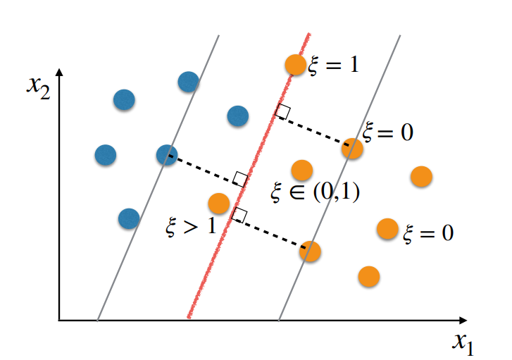
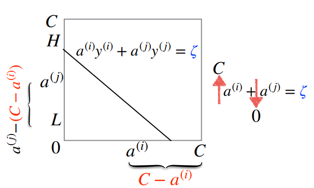

# Week 4 Note

## Support Vector Machine: Soft Margin

### Making preditions based on the dual representation

- Primal: 
  $$
    h(x) = \vec{w}^T\phi(\vec{x})+b 
    \begin{cases}
        h(\vec{x}) > 0 \rarr \text{class + 1}\\
        h(\vec{x}) < 0 \rarr \text{class - 1}
    \end{cases}
  $$

- Dual:
  $$
    h(\vec{x}) = \sum^N_{n=1}a^{(n)}y^{(y)}k(\vec{x},\vec{x}^{(n)}) + b 
    \begin{cases}
        h(\vec{x}) > 0 \rarr \text{class + 1}\\
        h(\vec{x}) < 0 \rarr \text{class - 1}
    \end{cases}
  $$

  where Substituting $\vec{w} = \sum\limits^N_{n = 1}a^{(n)}y^{(y)}\phi(\vec{x}^{(n)})$

- For every training example
  - It will be correctly classified(if the SVM problem is feasible)
  - Either: $a^{(n)} = 0$, so the value of $y^{(n)}k(\vec{x},\vec{x}^{(n)})$ won't matter
  - Or: $a^{(n)} > 0$ and $1 - y^{(n)}(\vec{w}^T\phi(\vec{x}^{(n)})+b) = 0$, this is a support vector
  $$
    g(\vec{w},b) = \max_{\vec{a}}\sum^N_{n=1}a^{(n)}(1 - y^{(n)}(\vec{w}^T\phi(\vec{x}^{(n)})+b))
  $$

- We only need to store the suport vectors for making predictions
  $$
    h(\vec{x}) = \sum_{n\in S}a^{(n)}y^{(y)}k(\vec{x},\vec{x}^{(n)}) + b
  $$
  where $S$ is the set of indexes of the support vectors

> - Primal Representation
>   $$
>     \argmin_{\vec{w},b}\{\frac{1}{2}||\vec{w}||^2\}
>   $$
>   Subject to: $y^{(n)}(\vec{w}^T\phi(\vec{x}^{(n)}) + b) \geq 1 \ \forall(\vec{x}^{(n)}, y^{(n)} \in J)$
> 
> - Dual Representation
>   $$
>     \argmax_a\tilde{L}(\vec{a})\sum_{n=1}^Na^{(n)} - \frac{1}{2}\sum_{n=1}^N\sum_{m=1}^Na^{(n)}a^{(m)}y^{(n)}y^{(m)}k(\vec{x}^{(n)},\vec{x}^{(m)})
>   $$
>   where: $k(\vec{x}^{(n)},\vec{x}^{(m)}) = \phi(\vec{x}^{(n)})^T\phi(\vec{x}^{(m)})$  
>   Subject to: $a^{(n)} \leq 0$, $\forall n \in \{1,...,N\}$ $\sum\limits_{n=1}^Na^{(n)}y^{(n)} = 0$

- Clalculating $b$
  - Note that $y^{(n)}h(\vec{x}^{(n)}) = 1$ for all support vectors
    $$
        b = y^{(n)} - \sum_{m \in S}a^{(m)}y^{(m)}k(\vec{x}^{(n)}, \vec{x}^{(m)})
    $$

- AAveraging for All Support Vectors
  - We have $N_S$ support vectors
  - We can compute $b$ for each of them and average the results to get a numerically more stable solution:
    $$
        b = \frac{1}{N_S}\sum_{n \in S}(y^{(n)} - \sum_{m \in S}a^{(m)}y^{(m)}k(\vec{x}^{(n)}, \vec{x}^{(m)}))
    $$
    where $S$ is the set of indexes of the support vectors and $N_S$ is the number of support vectors

> Adopting the dual representation enables us to adopt powerful kernels, e.g., the Gaussian kernel, which takes us to an infinite dimensional embedding  
> 
> Predictions when using the dual representation are based on the support vectors

### Soft margin SVM

- Slack Variables $\xi$
  - On slack variable $\xi^{(n)} \ge 0$ is associated to each training example $(\vec{x}^{(n)}, y^{(n)})$
  - These variables tell us by how much an example can be within the margin or on the wrong side of the decision boundary
    $$
        y^{(n)}h(\vec{x}^{(n)}) \ge 1 - \xi^{(n)}
    $$
  

> - The effect of $\xi$
>   - $y^{(n)}h(\vec{x}^{(n)}) \ge 1 - \xi^{(n)}$
>   - $\xi^{(n)} = 0 \rarr y^{(n)}h(\vec{x}^{(n)}) \ge 1$
>   - $\xi^{(n)} \in (0,1) \rarr y^{(n)}h(\vec{x}^{(n)}) \in (0,1)$
>   - $\xi^{(n)} = 1 \rarr y^{(n)}h(\vec{x}^{(n)}) \ge 0$
>   - $\xi^{(n)} > 1 \rarr y^{(n)}h(\vec{x}^{(n)}) < 0$

- Margin
  - Our margin was previously defined by
    $$
        dist(h, \vec{x}^{(k)}) = \frac{y^{(k)}h(\vec{x}^{(k)})}{||\vec{w}||} = \frac{1}{||\vec{w}||}
    $$
    where $(\vec{x}^{(k)},y^{(k)})$ was the closest example to the decision boundary 

#### Primal

- New Optimisation Problem
  $$
    \argmin_{\vec{w},b,\xi}\{\frac{1}{2}||\vec{w}||^2+C\sum^N_{n=1}\xi^{(n)}\}
  $$
  Subject to: $y^{(n)}h(\vec{x}^{(n)}) \ge 1 - \xi^{(n)}, \forall n \in \{1,2,...,N\}, \xi^{(n)} \ge 0$
  > $C$ is a hyperparameter that controls the trade-off between the slack variable penalty and the margin
  > 
  > When we allow slacks > 0, the margin is called a “`soft margin`”, as opposed to a “`hard margin`”.

#### Dual

- Using Slack
  $$
    \argmax_a\tilde{L}(\vec{a})\sum_{n=1}^Na^{(n)} - \frac{1}{2}\sum_{n=1}^N\sum_{m=1}^Na^{(n)}a^{(m)}y^{(n)}y^{(m)}k(\vec{x}^{(n)},\vec{x}^{(m)})
  $$
  Subject to: $a^{(n)} \leq 0 \leq C$, $\forall n \in \{1,...,N\}$ $\sum\limits_{n=1}^Na^{(n)}y^{(n)} = 0$

- Calculation of $b$
  $$
    b = \frac{1}{N_M}\sum_{n \in M}(y^{(n)} - \sum_{m \in S}a^{(m)}y^{(m)}k(\vec{x}^{(n)}, \vec{x}^{(m)}))
  $$
  where $M$ is the set of indexes of the support vectors that are on the margin and $N_M$ is the number of such support vectors

## Support Vector Machines: Sequential Minimal Optimisation(SMO)

- Solving the Optimisation Problem
  - Sequential minimal optimisation is one of the most popular techniques.
    - It breaks the quadratic programming problem into subquadratic programming problems that can be solved analytically one at a time. -> a subset of $a$.
    - Uses heuristics to decide which of these smaller problems to solve at each step -> which subset of $a$ to solve

- Sequential Minimal Optimisation(SMO)
  ```
  Initialise a
  Repeat for a maximum number of iterations:
    Select a pair of Lagrange multipliers a(i) and a(j) to update next
    Optimise L(a) with respect to a(i) and a(j), while holding all other Lagrange multipliers fixed
  ```
  - Initialise $a$
    $$
        0 \geq a^{(n)} \geq C, \forall n \in \{1,...,N\}\\
        \sum^N_{n=1}a^{(n)}y^{(n)} = 0
    $$
    The simplest way is to choose $a^{(n)} = 0, \forall n \in \{1,...,N\}$
  - Optimise $\tilde{L}(\vec{a})$ with respect to $a^{(i)}$ and $a^{(j)}$, while Dealing With Constrains
    $$
        \sum^N_{n=1}a^{(n)}y^{(n)} = 0 \\
        a^{(i)}y^{(i)}+a^{(j)}y^{(j)} = -\sum_{n\neq i,j}a^{(n)}y^{(n)}\\
        a^{(i)}y^{(i)}+a^{(j)}y^{(j)} = \xi
    $$
      
    > - Lower and Higeher Possible Values For $\vec{a}$
    >   - If $y^{(i)} = y^{(j)}$
    >     $$
    >       L = \max(0, a^{(i)}+a^{(j)} - C)\\
    >       H = \min(C, a^{(i)}+a^{(j)})
    >     $$
    >   - If $y^{(i)} \neq y^{(j)}$
    >     $$
    >       L = \max(0, a^{(j)}-a^{(i)})\\
    >       H = \min(C, C + a^{(j)}-a^{(i)})
    >     $$

- Optimising for $a^{(j)}$
  $$
    a^{(j,new)} = a^{(j)} + \frac{y^{(j)}(E^{(i)}-E^{(j)})}{k(\vec{x}^{(i)},\vec{x}^{(i)}) + k(\vec{x}^{(j)},\vec{x}^{(j)}) - 2k(\vec{x}^{(i)},\vec{x}^{(j)})}
  $$
  where the following is the error on training example $i$:
  $$
    E^{(i)} = h(\vec{x}^{(i)}) - y^{(i)}
  $$

- Clipping the Value of $a^{(j)}$
  - This update rule may lead to violations in the box constraints(not only for $a^{(j)}$ but also for $a^{(i)}$, since $a^{(i)}$ is set based on $a^{(j)}$).
  $$
    a^{(j, new ,clipped)} = \begin{cases}
        H \quad if\ a^{(j,new)} \geq H\\
        a^{(j,new)} \quad if\ L < a^{(j,new)} < H\\
        L \quad if\ a^{(j,new)} \leq L\\
    \end{cases}
  $$
  > This will ensure that the box constraints are satisfied for $a^{(j)}$.

- Obtaining $a^{(i)}$
  $$
    a^{(i,new)} = \frac{\xi - a^{(j,new,clipped)y^{(j)}}}{y^{(i)}}
  $$
  > This will ensure that $\sum\limits^N_{n=1}a^{(n)}y^{(n)} = 0$ is satisfied(and the box constraint for $a^{(i)}$ too)

- Karush-Kuhn-Tucker (KKT) Conditions
  - KKT conditions are conditions that have been proved to be necessary and sufficient for a solution of a quadratic programming problem to be optimal.
  - For soft margin SVM, they boil down to the following,$\forall n \in \{1,..,N\}$:
    - $0 < a^{(n)} < C \iff y^{(n)}h(\vec{x}^{(n)}) = 1$
    - $a^{(n)} = C \iff y^{(n)}h(\vec{x}^{(n)}) \leq 1$
    - $a^{(n)} = 0 \iff y^{(n)}h(\vec{x}^{(n)}) \geq 1$

### Selecting Pair $a^{(i)}$ and $a^{(j)}$ To Optimise Next

- Selection is done heuristically.
- We first select a value for $a^{(i)}$ and then for $a^{(j)}$.
- The Lagrange multiplier $a^{(i)}$ is selected by alternating between the following two strategies:
  - Selected randomly among those corresponding to training examples that violate the KKT conditions with a certain margin of error .
  - Selected randomly among those corresponding to training examples that violate the KKT conditions given the margin and $0 < a^{(i)} < C$(support vectors on the margin)
- The Lagrange multiplier $a^{(j)}$ is selected by trying the following strategies in the following order, until a positive improvement in the objective is observed:
  - Pick the $a^{(j)}$ associated to the example that will obtain the largest change in the $a^{(j)}$ value (which would hopefully result in a large increase in the objective). Largest step size approximated based on $|E^{(i)} - E^{(j)}|$
    $$
        a^{(j,new)} = a^{(j)} + \frac{y^{(j)}(E^{(i)}-E^{(j)})}{k(\vec{x}^{(i)},\vec{x}^{(i)}) + k(\vec{x}^{(j)},\vec{x}^{(j)}) - 2k(\vec{x}^{(i)},\vec{x}^{(j)})}
    $$
  - Pick each $0 < a^{(i)} < C$ in turn.
  - Look through the entire training set.
  - Replace $a^{(i)}$ and try again