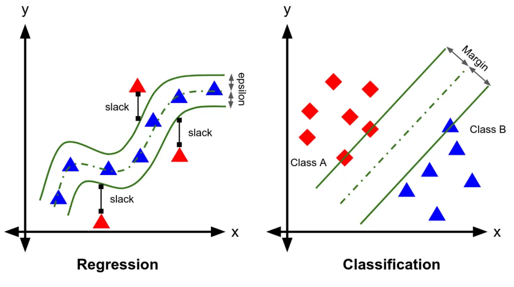

# Week 5 Note

## Machine Learning Linear Regression

- Evaluating Regression Models
  - Common metrics for evaluating regression models
    - Coefficient of determination or $R^2 = 1 - \frac{\sum_i(y_i-\hat{y}_i)^2}{\sum_i(y_i-\bar{y})^2}$; $\bar{y}$ is the mean of the observed targets
    - Mean absoute error(MAE) = $\frac{1}{N}\sum^N_i|y_i-\hat{y}_i|$
    - Mean squared error(MSE) = $\frac{1}{N}\sum^n_i(y_i-\hat{y}_i)^2$
    - Root mean squared error(RMSE) = $\sqrt{\frac{1}{N}\sum^N_i(y_i-\hat{y}_i)^2}$

- Formalization:
  - Input: $\vec{x}$
  - Output: $y$
  - Target function: $f : X \rarr Y$
  - Data: $(\vec{x}_1, y_1), (\vec{x}_2, y_2), ...,(\vec{x}_N, y_N)$
  - Hypothesis: $g : X \rarr Y$
- Cost function
  - in-sample error: $E_{in}(h) =  \frac{1}{N}\sum\limits^N_{n=1}(h(\vec{x}_n) - y_n)^2 = \frac{1}{N}||X\vec{w}-y||^2$

> - Linear regression with linear and non-linear basis function
>   - Polynomial basis functions:
>     $$
>       w_0+w_1x^2_1+w_2x_2^2+...+w_Dx^2_D
>     $$
>   - Gaussian basis functions/radial basis functions
>     $$
>       \phi_j(x) = e^{-\frac{1}{2\sigma^2}(x-\mu_j)^2}
>     $$
>   - Sigmoidal basis functions
>     $$
>       g(\alpha) = \frac{1}{1+e^{-\alpha}}
>     $$
>   - tanh basis functions
>     $$
>       h(\alpha) = \frac{e^{2\alpha}-1}{e^{2\alpha}+1}
>     $$

### Summary

- Linear and non-linear basis functions may be used to formulate a linear regression function
- OLS used to estimate linear regresssion weights by minimising sum of squared residuals
- OLS solution boild down to computing pseudoinverse of the Design Matrix
- Linear regression models can be fit to data using gradient descent

## Machine Learning SVM Regression

- Support Vector Regression
  - Find a function, $f(x)$ with at most $\epsilon$-deviation from the target $y$
  - We don't care about errors as long as they are less than $\epsilon$
  - Only the pint ouside the $\epsilon$-region contribute to the final cost
  $$
    \min\frac{1}{2}||w||^2\\
    s.t. y_i - w_1x_i - b \leq \epsilon;\\
    w_1x_i + b - y_i \leq \epsilon;
  $$

  $$
    J(w) = \underbrace{\frac{1}{2}w'w}_\text{正则化防过拟合} + C\sum^N_1(\xi+\xi*);\\
    y_i - (x_iw + b) \leq \epsilon + \xi_i\\
    (x_iw + b) - y_i \leq \epsilon + \xi_i^*\\
    \xi^* \leq 0\\
    \xi_i \leq 0
  $$

- Hyperparameter $C$
  - As $C$ increases, our tolerance for points outside of $\epsilon$ also increases
  - As $C$ approaches 0, the tolerance approaches 0 and the quation collapes into the simplified(although sometimes infeasible) one

> 希望确保模型的预测值落在真实值的一个ε区域内，或者至少尽可能地靠近这个区域。slack variables $\xi$ 和 $\xi^*$ 允许我们有一些灵活性，即当预测值与真实值之间的差异大于ε时，它们会吸收这种差异。

- Optimizing the Lagrangian
  $$
    L := \frac{1}{2}||w||^2 + C\sum^l_{i=1}(\xi_i+\xi_i^*) - \sum^l_{i=1}(\mu_i\xi_i+\mu_i^*\xi^*_i)\\
    - \sum^l_{i=1}\alpha_i(\epsilon + \xi_i - y_i + \langle w,x_i \rangle + b)\\
    - \sum^l_{i=1}\alpha_i(\epsilon + \xi_i^* + y_i - \langle w,x_i \rangle - b)\\
  $$
  Lagrange multipliers $\alpha_i^{(*)}, \mu_i^{(*)} \leq 0$
  > - Optimizing the Lagrangian
  >   - The partial derivatives of $L$ with respect to the variables
  >   $$
  >     \delta_bL = \sum^l_{i=1}(\alpha^*_i-\alpha_i) = 0\\
  >     \delta_wL = w - \sum^l_{i=1}(\alpha_i - \alpha_i^*)x_i = 0\\
  >     \delta_{\xi_i^{(*)}}L = C - \alpha_i^{(*)}- \mu_i^{(*)} = 0
  >   $$

  $$
    maximize \begin{cases}
      -\frac{1}{2}\sum^l_{i,j=1}(\alpha_i - \alpha_i^*)(\alpha_j - \alpha_j^*)\langle x_i, x_j\rangle\\
      -\epsilon\sum^l_{i=1}(\alpha_i+\alpha_i^*)+\alpha^l_{i=1}y_i(\alpha_i-\alpha_i^*)
    \end{cases}
  $$
  Subject to $\sum^l_{i=1}(\alpha_i-\alpha_i^*) = 0$ and $\alpha_i, \alpha_i^* \in [0, C]$

- SVM: Regression vs Classification  
  

### Summary

- Linear regression tries to minimize the error between the real and predicted value
- SVR tries to fit the best line within a threshold value
- The threshold value is the distance between the hyperplane and boundary line
- Observations within the threshold of epsilon produce no error, only the observation outside the epsilon range produce error - sparse kernel machines