# Week 8 Note

## Dichotomy

### Binary classification

- Input vectors: $\vec{x}_1, \dots, \vec{x}_N$
- Labels: $\y_1, \dots y_N$
- Training set: $D$
- Target function $f$ : Maps $\vec{x}_n$ to $y_n$
- Target function is always **unknown** to you

### Training and Testing Set

- Hypothesis set : $H = \{h_1, \dots, h_M\}$: Possible decision boundaries
- Algorithm: Picks $h_m$ from $H$
- Final hypothesis $g$ : The one you found

### Learning Model

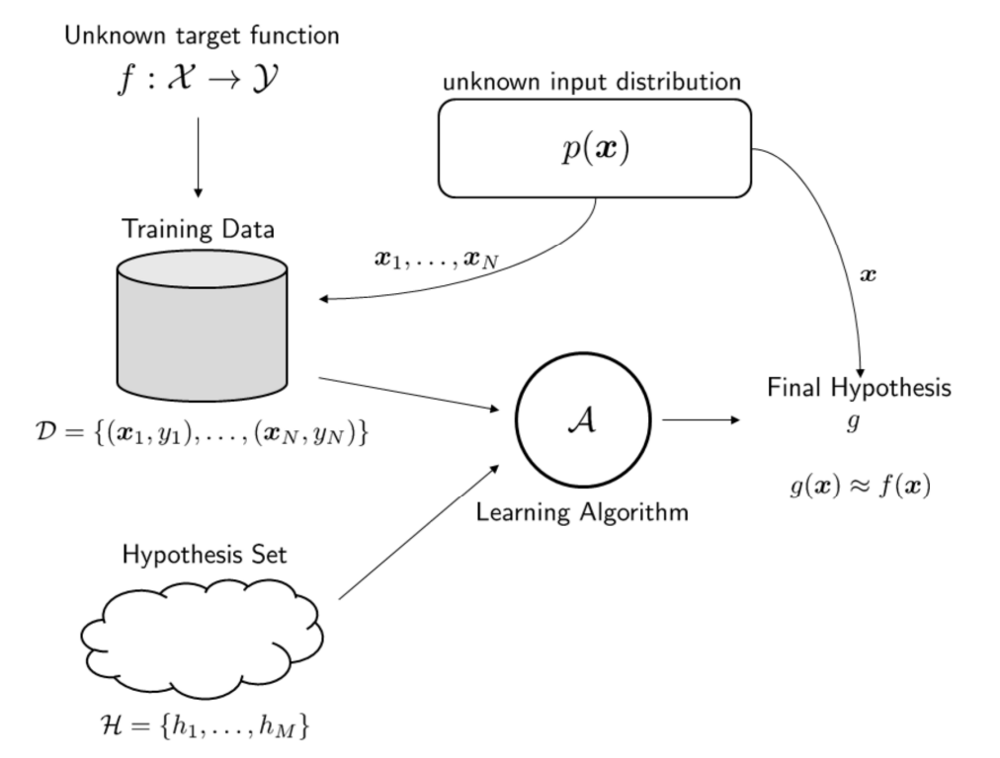

### Is Learning Feasible?

- In-sample and Out-sample
  - In-sample: Training Data
  - Out-sample: Testing Data

### Guarantee vs Possibility

- Difference between deterministic and probabilistic learning
  - Deterministic:
    - Anything outside $D$ has uncertainty. There is no way to deal with this uncertainty
  - Probabilistic:
    - If training and testing have the same distribution $p(x)$, then training can say something about testing
    - Assume all samples are independently drawn from $p(x)$

在机器学习中，我们往往不能对从未见过的数据做出确定性的预测

### Hoeffding Inequality

- Interpreting the Bound
  - Let us look at the bound again:
    $$
        P[|E_{in}(h) - E_{out}(h)| > \epsilon] \leq 2e^{-2\epsilon^2N}
    $$
  - Message 1: You can bound $E_{out}(h)$ using $E_{in}(h)$
  - $E_{in}(h)$: You know. $E_{out}(h)$: You don't know, but you want to know.
  - They are close if N is large
  - Message 2: The right hand side is independent of $h$ and $p(\vec{x})$
  - So it is a universal upper bound
  - Works for any $A$, any $H$, any $f$, and any $p(\vec{x})$

- Accuracy and Confidence
  - $\delta = 2 e^{-2\epsilon^2N}$. confidence: $1 - \delta$
  - $\epsilon = \sqrt{\frac{1}{2N}\log\frac{2}{\delta}}$. accuracy: $1-\epsilon$
  - Then the equation becomes:
    $$
        P[|E_{in}(h) - E_{out}(h)| > \epsilon] \leq \delta
    $$
  - which is equivalent to:
    $$
        P[|E_{in}(h) - E_{out}(h)| \leq \epsilon] > 1 - \delta
    $$

### PAC(Probably Approximately Correct)

- Probably: Quantify error using probability:
  $$
    P[|E_{in}(h) - E_{out}(h)| \leq \epsilon] \geq \bold{1 - \delta}
  $$
- Approximately Correct: In-sample error is an approximation of the out-sample error:
  $$
    P[\bold{|E_{in}(h) - E_{out}(h)| \leq \epsilon}] \geq 1 - \delta
  $$
- If you can find an algorithm $A$ such that for any $\epsilon$ and $\delta$, there exists an N which can make the above inequality holds, then we say that the target function is $PAC-learnable$

如果存在一个学习算法，它能够在足够大的样本量 $N$ 下，找到一个假设 $h$，使得 $h$ 在训练集上的误差 $E_{\text{in}}(h)$ 和在整个分布上的期望误差 $E_{\text{out}}(h)$ 之间的差距小于某个预设的界限 $\epsilon$，而这个界限的满足是以至少 $1 - \delta$ 的概率保证的，那么我们说这个学习算法是PAC可学习的

### One Hypothesis vs the Final Hypothesis

- Hoeffding Inequality
  - In this equation
    $$
        P\{|E_{in}(h) - E_{out}(h)| \leq \epsilon\} \geq 1 - \delta
    $$
    the hypothesis $h$ is fixed
  - This $h$ is chosen **before** we look at the dataset
  - If $h$ is chosen **after** we look at the datast, then Hoeffding is invalid
  - We have to choose a $h$ from $\mathcal{H}$ during the learning process
  - The $h$ we choose depends on $D$
  - This $h$ is the final hypothesis $g$
  - When you need to choose $g$ from $h_1, \dots, h_M$, you need to repeat Hoeffding M times
  
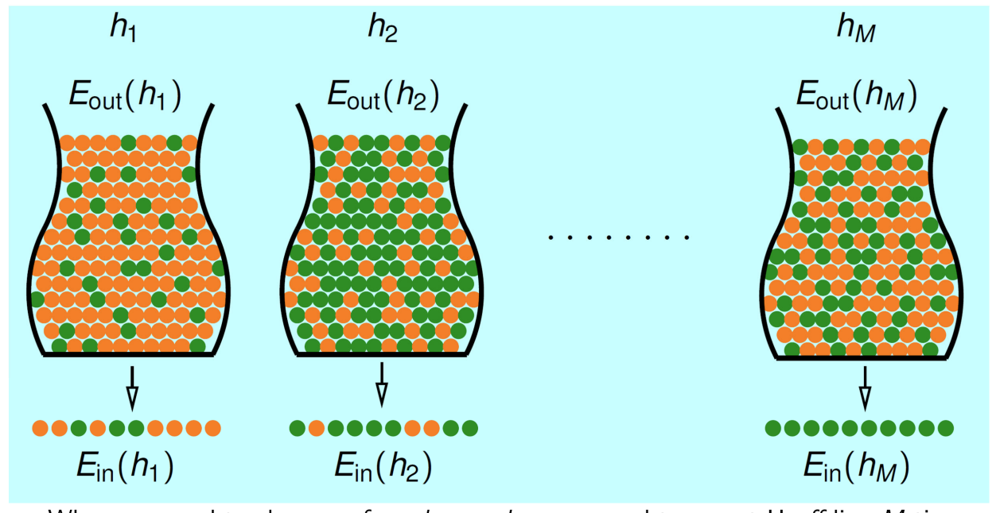

- Change this equation
  $$
    P\{|E_{in}(h) - E_{out}(h)| > \epsilon\} \leq 2e^{-2\epsilon^2N}
  $$
- to this equation
  $$
    P\{|E_{in}(g) - E_{out}(g)| > \epsilon\} \leq 2Me^{-2\epsilon^2N}
  $$
- So what? M is a constant
- Bad news: M can be large, or even $\infty$
- A linear regression have $M = \infty$
- Good news: It is possible to bound M
- We will do it later. Let us look at the interpretation first

### Learning Goal

- The ultimate goal for learning is to make
  $$
    E_{out} \approx 0
  $$
- To achieve this we need
  $$
    E_{out}(g) \underbrace{\approx}_\text{Hoeffding Inequality} E_{in}(g) \underbrace{\approx}_\text{Training Error} 0
  $$
- Hoeffding inequality holds when N is large
- Training error is small when you train well

- Complex $H$
  - Recall Hoeffding inequallity
    $$
      P\{|E_{in}(g) - E_{out}(g)| > \epsilon\} \leq 2Me^{-2\epsilon^2N}
    $$
  - If $H$is complex, then M will be large. So the approximation by Hoeffding inequality will be worse
  - But if $H$ is complex you have more options during training. So training error is improved
  - So there is a trade-off:
    $$
      E_{out}(g) \underbrace{\approx}_\text{worse if H complex} E_{in}(g) \underbrace{\approx}_\text{good if H complex} 0
    $$
  - You cannot use a very complex model
  - Simple models generalize better

强调了在模型复杂性和泛化能力之间寻找平衡的重要性。虽然复杂的模型可能更好地拟合训练数据，但它们可能在未见过的数据上表现不佳，因为它们的泛化误差界限更高。简单的模型可能在训练数据上的表现不如复杂模型，但它们更有可能保持在新数据上的好表现，因为它们的泛化误差界限更低。这就是所谓的“偏差-方差权衡”（bias-variance tradeoff）

- Complex $f$
  - Reall Hoeffding inequality
    $$
      P\{|E_{in}(g) - E_{out}(g)| > \epsilon\} \leq 2Me^{-2\epsilon^2N}
    $$
  - Good news: Hoeffding is not affected by f
  - So even if f is complex, Hoeeffding remains
  - Bad news: If f is complex, then very hard to train
  - So training error cannnot be samll
  - There is another trade-off:
    $$
        E_{out}(g) \underbrace{\approx}_\text{no effect by f} E_{in}(g) \underbrace{\approx}_\text{worse if f complex} 0
    $$
  - You can make $H$ to counteract, but complex $H$ will make Hoeffding worse

### Rewriting the Hoeffding Inequality

- Recall the Hoeffding Inequality
  $$
    P\{|E_{in}(g) - E_{out}(g)| > \epsilon\} \leq 2Me^{-2\epsilon^2N}
  $$
- This is the same as
  $$
    P\{|E_{in}(g) - E_{out}(g)| \leq \epsilon\} \geq 1 - \delta
  $$
- Equivalently, we can say: **with probability** $1-\delta$
  $$
    E_{in}(g) - \epsilon \leq E_{out}(g) \leq E_{in}(g) + \epsilon
  $$

### Generalization bound

- Move around the terms, then we have
  $$
    2Me^{-2\epsilon^2N} = \delta \rArr \epsilon = \sqrt{\frac{1}{2N} \log \frac{2M}{\delta}}
  $$
- Plug this result into the privous bound
  $$
    E_{in}(g) - \epsilon \leq E_{out}(g) \leq E_{in}(g) + \epsilon
  $$
- This gives us
  $$
    E_{in}(g) - \sqrt{\frac{1}{2N} \log \frac{2M}{\delta}} \leq E_{out}(g) \leq E_{in}(g) + \sqrt{\frac{1}{2N}\log\frac{2M}{\delta}}
  $$
- This is called the generalization bound

### Interpreting the Generaliation Bound

$$
  E_{in}(g) - \sqrt{\frac{1}{2N} \log \frac{2M}{\delta}} \leq E_{out}(g) \leq E_{in}(g) + \sqrt{\frac{1}{2N}\log\frac{2M}{\delta}}
$$

- N: Training sample
- More is better
- $\delta$: The probabiltiy tolerance level. "Confidence"
- Small $\delta$: You are very conservative. So you need large N to compensate for $\log\frac{1}{\delta}$
- $M$: Model complexity
- Large $M$: You use a very complicated model. So you need large N to compensate for $\log M$

### Two Sides of the Generalization Bound

- Upper Limit
  $$
    E_{in}(g) - \sqrt{\frac{1}{2N} \log \frac{2M}{\delta}} \leq E_{out}(g) \leq E_{in}(g) + \sqrt{\frac{1}{2N}\log\frac{2M}{\delta}}
  $$
  - $E_{out}(g)$ cannot be worse than $E_{in}(g) + \epsilon$
  - Performance guarantee. $E_{in}(g) + \epsilon$ is the worst you will have. If you can manage this worst case you are good
- Lower Limit
  $$
    E_{in}(g) - \sqrt{\frac{1}{2N} \log \frac{2M}{\delta}} \leq E_{out}(g) \leq E_{in}(g) + \sqrt{\frac{1}{2N}\log\frac{2M}{\delta}}
  $$
  - $E_{out}(g)$ cannot be better than $E_{in}(g) - \epsilon$
  - Intrinsic limit of your dataset(which controls N), model complexity(which controls M) and how much you want (which determines $\delta$)

### The 'Statistical' Learning Flow

- if $|H| = M$ finite, N large enough, for whatever g picked by $A$, $E_{out}(g) \approx E_{in}(g)$
- if $A$ finds one $g$ with $E_{in}(g) \approx 0$, PAC guarantee for $E_out(g) \approx 0$

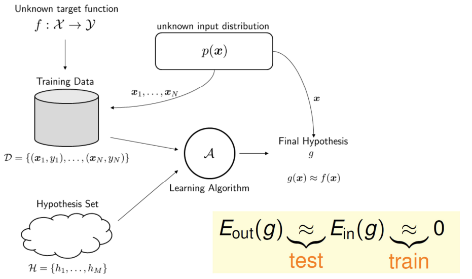

### Summary

- Not all problems are learnable
- Those that are learnable require training and testing sample are correlated
- For any accurcay and any confidence, if we can find an algorithm such that as long as N is large enough the Hoeffding inequality can be proved, then the target function is PAC leanable
- The aim is the replace M by some quantity on the hypothesis set H using Dichotomy

## VC dimension

### Two Central Questions

$$
    E_{out}(g) \underbrace{\approx}_\text{test} E_{in}(g) \underbrace{\approx}_\text{train} 0
$$

Learning split to two central questions:
1. can we make sure that $E_{out}(g)$ is close enought to $E_{in}(g)$
2. can we make $E_{in}(g)$ small enough?

What role does $\underbrace{M}_{|H|}$ play for the two questions?
- Small M
  1. Yes, $P[BAD] \leq 2 · M · \exp(\dots)$
  2. No, too few choices
- Large M
  1. No, $P[BAD] \leq 2 · M · \exp(\dots)$
  2. Yes, many choices

### Goal

- Known 
  $$
    P\{|E_{in}(g) - E_{out}(g)| > \epsilon\} \leq 2Me^{-2\epsilon^2N}
  $$
- Todo
  - establish a finite quantity that replaces M
    $$
      P\{|E_{in}(g) - E_{out}(g)| > \epsilon\} \leq 2M_He^{-2\epsilon^2N}
    $$
  - Justify the feasibility of learning for infinite M
  - Study $m_H$ to understand its trade-off for 'right' H, just like M

### Overcoming the M Factor

- The Bad vents $B_m$ are
  $$
    B_m = \{|E_{in}(h_m) - E_{out}(h_m)| > \epsilon \}
  $$
- The factor M is here because of the Union bound:
  $$
    P[B_1\ or \dots\ or\ B_M] \leq P[B_1] + \dots + P[B_M]
  $$

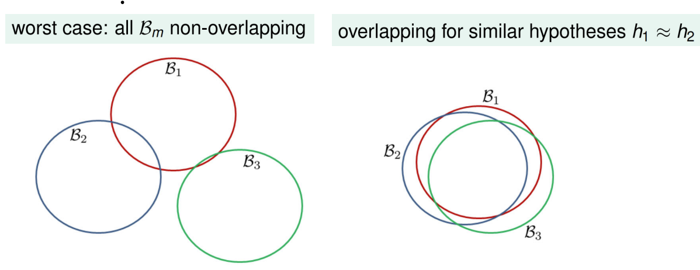

### Effective Number of Lines

maximum kinds of lines with respect to N inputs $x_1, \dots, x_N$ $\rArr$ effective number of lines

- must be $\leq 2^N$
- finite 'grouping' of infinitely-many lines $\in \mathcal{H}$
- wish:
    $$
        P[|E_{in}(g) - E_{out}(g)| > \epsilon] \leq 2 · effective(N) · \exp(-2\epsilon^2N)
    $$

> if
> 1. effective(N) can replace M and
> 2. effective(N) $<< 2^N$
> learning possible with infinite liners

### Dichotomy: Mini-hypotheses

$\mathcal{H} = \{hypothesis h: \mathcal{X} \rarr\{x, o\}\}$

size: upper bounded by $2^N$

$|\mathcal{H}(x_1,\dots,x_N)|$: candidate for repacing M

### Counting the Overlapping Area

- $\Delta E_{out}$ = change in the +1 and -1 area
- Example below: Chage a little bit
- $\Delta E_{in}$ = change in labels of the training samples
- Example below: Change a little bit, too
- So we should expect the probabilities
$$
  P[|E_{in}(h_1) - E_{out}(h_1)| > \epsilon] \approx P[|E_{in}(h_2) - E_{out}(h_2)| > \epsilon]
$$

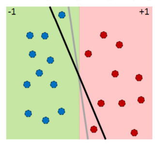

### Looking at the Training Samples Only

- Here is a our goal: Find something to replace M
- But M is big because the whole input space is big
- If you move the hypothesis a little, you get a differenct partition
- Literally there are infinitely many hypotheses
- This is M
- Can we restrict ourselves to just the training sets?
- The idea is: Just look at the training samples
- Put a mask on your dataset
- Don't care until a training sample flips its sign

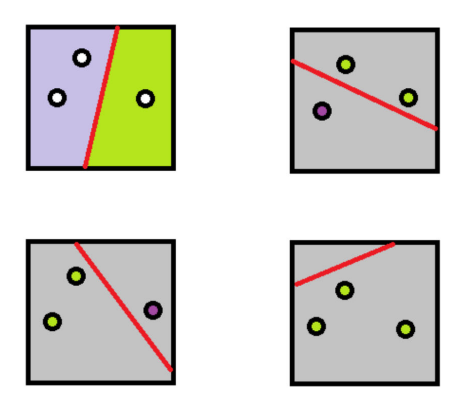

### Dichotomy

- We need a new name: dichotomy
- Dichotomy = mini-hypothesis
  | Hypothesis                            | Dichotomy                                  |
  | ------------------------------------- | ------------------------------------------ |
  | $h : \mathcal{X} \rightarrow \{+1, -1\}$ | $h : \{x_1, ..., x_N\} \rightarrow \{+1, -1\}$ |
  | for all population samples            | for training samples only                  |
  | number can be infinite                | number is at most $2^N$               |
- Different hypothesis, same dichotomy

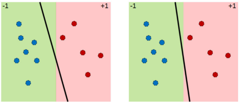

- Definittion:  
  Let $x_1, \dots, x_N \in \mathcal{X}$. The dichotomies generated by $\mathcal{H}$ on these points are
  $$
    \mathcal{H}(x_1, \dots, x_N) = \{(h(x_1), .., h(x_N))| h \in \mathcal{H}\}
  $$
  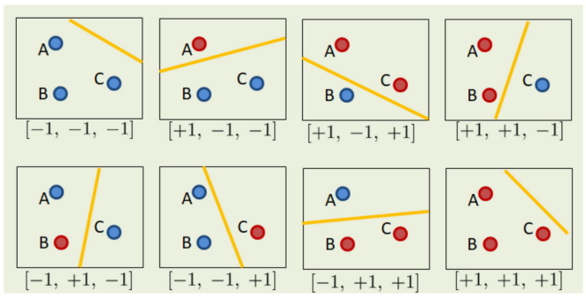

### Candidate to Replace M

- So here is our candidate replacement for M
- Define Growth Function
  $$
    m_{\mathcal{H}}(N) = \max_{x_1,\dots,x_N \in \mathcal{X}}|\mathcal{H}(x_1, \dots , x_N)|
  $$
- You give me a hypothesis set $\mathcal{H}$
- You tell me there are N training samples
- My job: Do whatever I can, by allocating $x_1,\dots,x_N$, so that the numbr of dichotomies is maximized
- Maximum number of dichotomy = the best I can do with your $\mathcal{H}$
- $m_{\mathcal{H}}(N)$: How expressive your hypothesis set $\mathcal{H}$ is
- Large $m_{\mathcal{H}}(N)$ = more expressive $\mathcal{H}$ = more complicated $\mathcal{H}$
- $m_{\mathcal{H}}(N)$ only depends on $\mathcal{H}$ and N
- Doesn't depend on the learning algorithm $\mathcal{A}$
- Doesn't depend on the distribution $p(x)$(because I'm giving you the max)

### Growth Function

- $|\mathcal{H} (x_1,x_2,\dots, x_N)|$: depend on inputs $(x_1,x_2,\dots, x_N)$
- growth function  
  remove dependence by taking max of all possible $(x_1,x_2,\dots, x_N)$
  $$
    m_{\mathcal{H}}(N) = \max_{x_1,\dots,x_N \in \mathcal{X}}|\mathcal{H}(x_1, \dots , x_N)|
  $$
- finite, upper-bounded by $2^N$

### Growth Function for Positive Rays

- $\mathcal{H}$ = set of h: $\R \rarr \{+1, -1\}$
- $h(x) = sign(x - a)$
- Cut the line into two halves
- You can only move along the line
- $m_\mathcal{H}(N) = N + 1$
- The N comes from the N points
- The +1 comes from the two ends

### Growth Function for Positive Intervals

- $\mathcal{H}$ = set of h: $\R \rarr \{+1, -1\}$
- Put an interval
- Length of the intervalis N points
- $$ 
    m_{\mathcal{H}}(N) = \begin{pmatrix}
      N+1 \\ 2
      \end{pmatrix}+1 = \frac{N^2}{2}+ \frac{N}{2} + 1
  $$
- Think of $N+1$ balls, pick 2

### Growth Function for 2D perceptrons

- $\mathcal{H}$ = linear models in 2D
- N = 3
- How many dichotomies can I generate by moving the three points?
- This gives you 6. The previous is the best. So $m_\mathcal{H}(3) = 8$

### Growth Function for Convex Sets

- $\mathcal{X} = \R^2$(two dimensional)
- $\mathcal{H}$ contains h, where $h(x) = + 1$ iff x in a convex region, -1 otherwise

- One possible set of N inputs:  
  $x_1, \dots, x_N$ on a big circle
- Every dichotomy can be implemented by $\mathcal{H}$ using a convex region slightly extended from contour of positive inputs
  $$
    m_\mathcal{H}(N) =  2^N
  $$
- call those N inputs 'shattered' by $\mathcal{H}$

- $m_\mathcal{H}(N) = 2^N \lrArr$ exists N inputs that can be shattered

### Shatter

- Definition:  
  If a hypothesis set $\mathcal{H}$ is able to generate all $2^N$ dichotomies, then we say that $\mathcal{H}$ shatter $x_1, \dots, x_N$
  - $\mathcal{H}$ = hyperplane returned by a perceptron algorithm in 2D
  - If N = 3, then $\mathcal{H}$ can shatter
  - Because we can achieve $2^3 = 8$ dichotomies
  - If N = 4, then $\mathcal{H}$ cannot shatter
  - Because we can only achieve 14 dichotomies

> - if no k inputs can be shattered by $\mathcal{H}$ can k a break point for $\mathcal{H}$
>   - $m_\mathcal{H}(k) < 2^k$
>   - k + 1, k + 2, k + 3 , ... also break points!
>   - will study minimum break point k
>   - 2D perceptrons: break point at 4

### Growth Function & Break Points

- Positive rays: $m_\mathcal{H}(N) = N + 1$  
  break point at 2
- Positive intervals: $m_\mathcal{H}(N) = \frac{1}{2}N^2 + \frac{1}{2}N + 1$  
  break point at 3
- Convex sets: $m_\mathcal{H}(N) =2^N$  
  no break point
- 2D perceptrons: $m_\mathcal{H}(N) < 2^N$in some cases.  
  break point at 4

### VC Bound

- When N large enough: 
  $$
    P[\exist h \in \mathcal{H}\ s.t. |E_{in}(h) - E_{out}(h)| > \epsilon] \leq 2·2m_\mathcal{H}(2N)·\exp(-2·\frac{1}{16}\epsilon^2N)
  $$

- For any $g = \mathcal{A}(\mathcal{D}) \in \mathcal{H}$ and 'statistical' large $\mathcal{D}$
  $$
    P_\mathcal{D}[|E_{in}(g) - E_{out}(g)| > \epsilon] \\
    \leq P_\mathcal{D}[\exist h \in \mathcal{H}\ s.t. |E_{in}(h) - E_{out}(h)| > \epsilon] \\
    \leq 4m_\mathcal{H}(2N)\exp(-\frac{1}{8}\epsilon^2N) \\
    \text{if k exists}\\
    \leq 4(2N)^{k-1}\exp(-\frac{1}{8}\epsilon^2N)
  $$

> - if  
>   1. $m_\mathcal{H}(N)$ breaks at k (good $\mathcal{H}$)
>   2. N large enough(good $\mathcal{D}$)
>      - generalized '$E_{out} \approx E_{in}$', and
> - if  
>   3. $\mathcal{A}$ picks a g with small $E_{in}$ (good $\mathcal{A}$)
>      - learned

### VC Dimension

- the formal name of maximum non-break point
- Definition
  - VC dimension of $\mathcal{H}$, denoted $d_{VC}(\mathcal{H})$ is **largest** N for which $m_\mathcal{H}(N) = 2^N$
  - the **most** inputs $\mathcal{H}$ that can shatter
  
> - $N \leq d_{VC} \rArr$ $\mathcal{H}$ can shatter some N inputs
> - $N > d_{VC} \rArr$ N is a break point for $\mathcal{H}$

- $m_\mathcal{H}(N)$ is indeed upper bounded by a polynomial of order no greater than $d_{VC}$
  $$
    m_\mathcal{H}(N) \leq N^{d_{VC}} + 1
  $$

- Definition(VC Dimension)  
  The vapnik-Chervonenkis dimension of a hypothesis set $\mathcal{H}$, denoted by $d_{VC}$, is the largest value of N for which $\mathcal{H}$ can shatter all N training samples

### VC Dimension of a Perceptron

- Theorem(VC Dimension of a Perceptron)  
  Consider the input space $\mathcal{X} = \R^d \bigcup \{1\}$, i.e., ($\vec{x} = [1, x_1, \dots, x_d]^T$). The VC dimension of a perceptron is
  $$
    d_{VC} = d + 1
  $$
  - The "+1" comes from the bias term ($w_0$ if you recall)
  - So a linear classifier is "no more complicated" than d+1
  - The best it can shatter is d + 1 in a d-dimensional space

- Proof:
  - We claim $d_{VC} \geq d + 1$ and $d_{VC} \leq d + 1$
  - $d_{VC} \geq d + 1$:  
    $\mathcal{H}$ can shatter at least d + 1 points
  - It may shatter more, or it may not shatter more. We don't know by just looking at this statement
  - $d_{VC} \leq d + 1$:
    $\mathcal{H}$ cannot shatter more than d + 1 points
  - So with $d_{VC} \leq d + 1$, we show that $d_{VC} = d + 1$
---
- Proof: - $d_{VC} \geq d + 1$
  - Goal: Show that there is at least one configuration of d + 1 points that can be shattered by $\mathcal{H}$
  - Think about the 2D case: Put the three points anywhere not on the same line
  - Choose
    $$
      \vec{x}_n = [1, 0, \dots, 1, \dots, 0]^T
    $$
  - Linear classifier: $sign(\vec{w}^T\vec{x}_n)$
  - For all d + 1 data points, we have
    $$
      \text{sign} \left(
      \begin{bmatrix}
          1 & 1 & \cdots & 0 & 0 \\
          1 & 1 & \cdots & 0 & 0 \\
          1 & 0 & 1 & \cdots & 0 \\
          \vdots & \vdots & \ddots & \ddots & \vdots \\
          1 & 0 & \cdots & 0 & 1 \\
      \end{bmatrix}
      \begin{bmatrix}
          w_0 \\
          w_1 \\
          \vdots \\
          w_d \\
      \end{bmatrix}
      \right) =
      \begin{bmatrix}
          y_1 \\
          y_2 \\
          \vdots \\
          y_{d+1} \\
      \end{bmatrix} =
      \begin{bmatrix}
          \pm 1 \\
          \pm 1 \\
          \vdots \\
          \pm 1 \\
      \end{bmatrix}
    $$
  - We can remove the sign because we are trying to find **one** configuration of points that can be shattered
    $$
      \left(
      \begin{bmatrix}
          1 & 1 & \cdots & 0 & 0 \\
          1 & 1 & \cdots & 0 & 0 \\
          1 & 0 & 1 & \cdots & 0 \\
          \vdots & \vdots & \ddots & \ddots & \vdots \\
          1 & 0 & \cdots & 0 & 1 \\
      \end{bmatrix}
      \begin{bmatrix}
          w_0 \\
          w_1 \\
          \vdots \\
          w_d \\
      \end{bmatrix}
      \right) =
      \begin{bmatrix}
          y_1 \\
          y_2 \\
          \vdots \\
          y_{d+1} \\
      \end{bmatrix} =
      \begin{bmatrix}
          \pm 1 \\
          \pm 1 \\
          \vdots \\
          \pm 1 \\
      \end{bmatrix}
    $$
  - We are only interested in whether the problem solvable
  - So we just need to see if we can ever find a $\vec{w}$ that shatters
  - If there exists at least one $\vec{w}$ that makes all $\pm 1$ correct, then $\mathcal{H}$ can shatter (if you use that particular $\vec{w}$)
  - So is this $(d+1)\times(d+1)$ system invertible?
  - Yes. So $\mathcal{H}$ can shatter at least d + 1 points
---
- Summary of the Examples
  - $\mathcal{H}$ is positive ray: $m_\mathcal{H}(N) = N + 1$
    - If N = 1, then $m_\mathcal{H}(1) = 2$
    - If N = 2, then $m_\mathcal{H}(2) = 3$
    - So $d_{VC} = 1$
  - $\mathcal{H}$ is positive interval: $m_\mathcal{H}(N) = \frac{N^2}{2} + \frac{N}{2} + 1$
    - If N = 2, then $m_\mathcal{H}(2) = 4$
    - If N = 4, then $m_\mathcal{H}(4) = 5$
    - So $d_{VC} = 2$
  - $\mathcal{H}$ is perceptron in d-dimensional space
    - Just showed
    - $d_{VC} = d + 1$
  - $\mathcal{H}$ is convex set: $m_\mathcal{H}(N) = 2^N$
    - No matter which N we choose, we always have $m_\mathcal{H}(N) = 2^N$
    - So $d_{VC} = \infin$
    - The model is as complex as it can be
---
- Summary of the Example  
  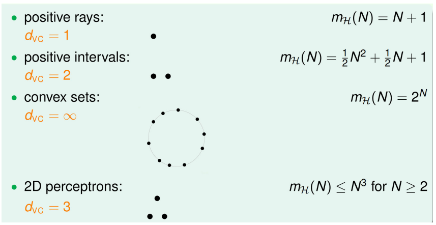

### VC Dimension and Learning

- Finite $d_{VC} \rArr g$ 'Will' generalize($E_{out}(g) \approx E_{in}(g)$)
  - regardless of learning algorithm $\mathcal{A}$
  - regardless of input distribution $P$
  - regardless of target function $f$  
  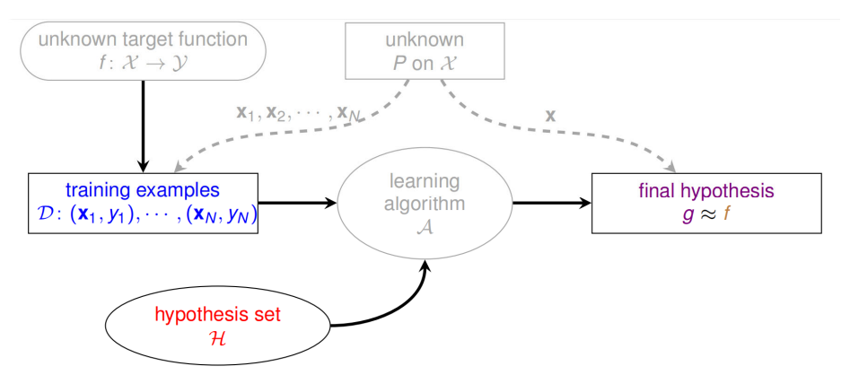

- 2D PLA(Perceptron Learning Algorithm)  
  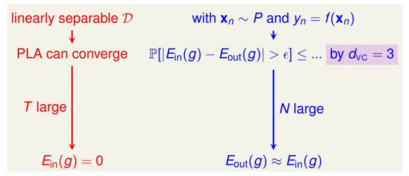

### VC Bound Rephrase: Model Complexity

$$
  E_out(g) \leq E_{in}(g) + \underbrace{\sqrt{\frac{8}{N}\log\frac{4m_\mathcal{H}(2N)}{\delta}}}_{ = \epsilon(N , \mathcal{H}, \delta)}
$$
If we replace $m_\mathcal{H}(2N)$ by $(2N)^{d_{VC}} + 1$, then we can write $\epsilon(N , \mathcal{H}, \delta)$ as
$$
  \epsilon(N , d_{VC}, \delta) = \sqrt{\frac{8}{N}\log\frac{4((2N)^{d_{VC}}+ 1)}{\delta}}
$$

- $\underbrace{\sqrt{\dots}}_{\Omega(N , \mathcal{H}, \delta)}$: penalty for model complexity

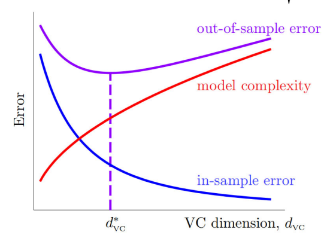

- $d_{\text{VC}} \uparrow$: $\mathbb{E}_{\text{in}} \downarrow$ but $\Omega \uparrow$
- $d_{\text{VC}} \downarrow$: $\Omega \downarrow$ but $\mathbb{E}_{\text{in}} \uparrow$
- best $d_{\text{VC}}^*$ in the middle

### Non-linear transformation

- transform original data $\{(x_n, y_n)\}$ to $\{(z_n = \phi(x_n), y_n)\}$ by $\phi$
- get a good perceptron $\tilde{w}$ using $\{(z_n, y_m)\}$ and your favorite linear classification algorithm $\mathcal{A}$
- return $g(x) = sign(\tilde{w}^T\phi(x))$

---

- Linear Hypotheses in $Z$-space
- General Quadratic Hypothesis Set
- a 'bigger' Z-space with $\phi_2(x) = (1, x_1, x_2, x^2_1, x_1x_2, x^2_2)$  
  perceptrons in Z-space $\lrArr$ quandratic hypotheses in X-space

- The price we pay  
  Z-space is now five-dimensional instead of two dimensional Hence VC Dimension is doubled from 3 to 6

### VC dimension for SVM

- SVM is a linear model
- SVM also inherits the good generalization capability of the simple linear model since the VC dimension is bounded by d+1
- Does the SVM gain any more generalization ability by maximizing the margin?
- Larger margin(fat hyperplane) is better
- Fat Hyperplane shatters fewer points

### Summary

- VC dimension has important implications for machine learning models. 
- It is related to the model’s generalization ability, i.e., its ability to perform well on unseen data. 
- A model with a low VC dimension is less complex and is more likely to generalize well, 
- A model with a high VC dimension is more complex and is more likely to overfit the training data