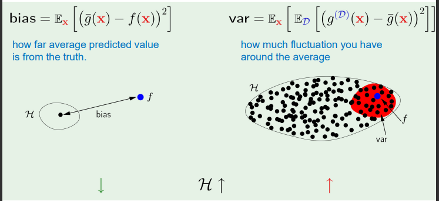
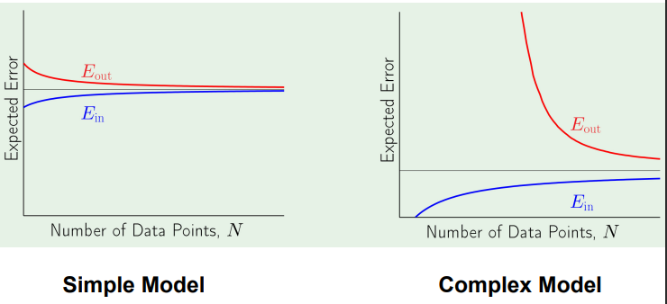
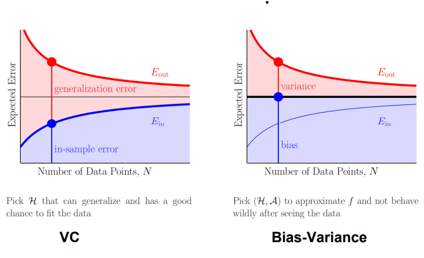
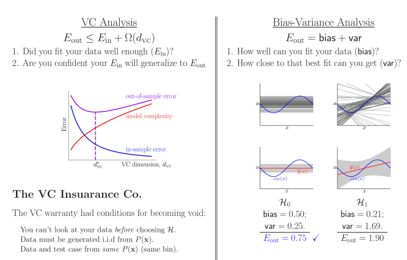
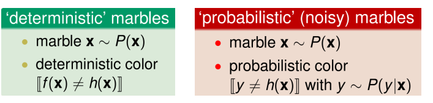
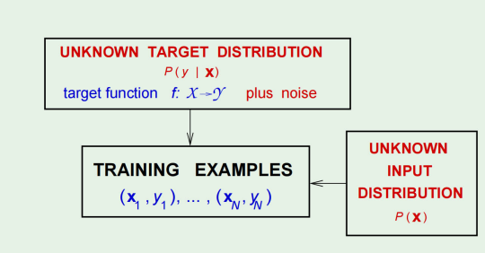
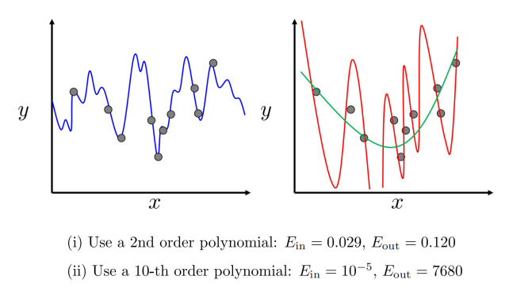

# Week 9 Note

## Bias and Variance

### Approximation-Generalization Tradeoff

- Small $E_{out}$: good approximation of $f$ out of sample  
  意味着在样本外，模型对目标函数 , f 的近似很好

- More Complex $\mathcal{H} \rArr$ better chance of approximating $f$  
  有更好的机会近似目标函数f

- Less complex $\mathcal{H} \rArr$ better chance of generalizing out of sample  
  有更好的机会在样本外泛化

- Ideal $\mathcal{H} = \{f\}$ winning lottery ticket  
  这个假设恰好就是真实的目标函数f

### Quantifying the Tradeoff

VC analysis was one approach: $E_{out} \leq E_{in} + \Omega$

$$
    E_{out}(g) = P[g(x) \neq f(x)]
$$

The probability of Bad events

$$
    E_{out}(g) = \mathbb{P}[g(x) \neq f(x)]\\
    = \mathbb{P}[B = 1]\\
    = 1 \cdot \mathbb{P}[B = 1] + 0 \cdot \mathbb{P}[B = 0]\\
    = \mathbb{E}[B].
$$

Expectation:

$$
    E_{out}(g) = \mathbb{E}_x[1\{g(x) \neq f(x)\}],
$$

1 is the indicator function. The expectation is taken over all $x \sim p(x)$

- VC analysis was one approach: $E_{out} \leq E_{in} + \Omega$
- Bias-variance analysis is another: decomposing $E_{out}$ into
  1. How well $\mathcal{H}$ can approximate $f$
  2. How well we can zoom in on a good $h \in \mathcal{H}$
- Applies to real-valued targets and uses squared error

### VC Analysis vs Bias-variance Analysis

- VC Analysis: 0-1 Loss
  $$
    E_{out}(g) = E_{x}[1\{g(x) \neq f(x)\}]
  $$

  - The Hoeffding inequality provides the worst case bound across all trainging set D
  - Since it is the worst case bound, it does not matter which specific the training set D and the final hypothesis g we are using

- Bias-variance Analysis: Square Loss
  $$
    E_{out}(g) = E_{x}[(g(x) - f(x))^2]
  $$
  - The bias-variance analysis is an average case analysis requiring taking the expectation over all possible training set D's
  $$
    E_{out}(g^{(\mathcal{D})}) = \mathbb{E}_x \left[ \left( g^{(\mathcal{D})}(x) - f(x) \right)^2 \right]
  $$
  
  $$
    \mathbb{E}_{\mathcal{D}}[E_{out}(g^{(\mathcal{D})})] = \mathbb{E}_{\mathcal{D}}\left[\mathbb{E}_x \left[ \left( g^{(\mathcal{D})}(x)   - f(x) \right)^2 \right]\right]
  $$

  - $E_{out}(g^{(\mathcal{D})})$：对于特定从数据集 $\mathcal{D}$ 中找到的模型 $g$ 的样本外误差。
  - $\mathbb{E}_{\mathcal{D}} [E_{out}(g^{(\mathcal{D})})]$：在所有可能的数据集 $\mathcal{D}$ 上平均的样本外误差。
  
  - VC trade-off 是一种“最坏情况”分析：
    - 对每个 $\mathcal{D}$ 提供统一的界限。
  
  - 偏差-方差 trade-off 是一种“平均”分析：
    - 在不同的 $\mathcal{D}$ 上进行平均。

> Why: since the square loss is differentiable  
> we can potentially say something that VC analysis is not able to say
>
> - VC analysis: 0-1 loss. Bias-variance: square loss
> - VC analysis: $\mathcal{D}$ does not matter. Bias-variance: expectation over $\mathcal{D}$
> - VC analysis: worst case. Bias-variance: average case

### Quantifying the Tradeoff

$$
E_{out}(g^{(D)}) = E_{\mathbf{x}} \left[ (g^{(D)}(\mathbf{x}) - f(\mathbf{x}))^2 \right]
$$

$$
E_{\mathbf{D}} [E_{out}(g^{(D)})] = E_{\mathbf{D}} \left[ E_{\mathbf{x}} \left[ (g^{(D)}(\mathbf{x}) - f(\mathbf{x}))^2 \right] \right]
$$

$$
= E_{\mathbf{x}} \left[ E_{\mathbf{D}} \left[ (g^{(D)}(\mathbf{x}) - f(\mathbf{x}))^2 \right] \right]
$$

Now, let us focus on:

$$
E_{\mathbf{D}} \left[ (g^{(D)}(\mathbf{x}) - f(\mathbf{x}))^2 \right]
$$

To evaluate $E_{\mathbf{D}} \left[ (g^{(\mathbf{D})}(\mathbf{x}) - f(\mathbf{x}))^2 \right]$

we define the 'average' hypothesis $\bar{g}(\mathbf{x})$:

$$
\bar{g}(\mathbf{x}) = E_{\mathbf{D}} [g^{(\mathbf{D})}(\mathbf{x})]
$$

Imagine many data sets $\mathbf{D}_1, \mathbf{D}_2, \ldots, \mathbf{D}_K$

$$
\bar{g}(\mathbf{x}) \approx \frac{1}{K} \sum_{k=1}^{K} g^{(\mathbf{D}_k)}(\mathbf{x})
$$

$$
E_{\mathcal{D}} \left[ (g^{(D)}(\mathbf{x}) - f(\mathbf{x}))^2 \right]\\
= \underbrace{E_{\mathbf{D}} \left[ (g^{(D)}(\mathbf{x}) - \bar{g}(\mathbf{x}))^2 \right]}_\text{var(x)} + \underbrace{(g^{(D)}(\mathbf{x}) - f(\mathbf{x}))^2}_{bias(x)}
$$

Therefore, $E_\mathcal{D}[E_{out}(g^{(D)})] = E_{\mathbf{x}} \left[E_\mathcal{D}\left[ (g^{(D)}(\mathbf{x}) - f(\mathbf{x}))^2 \right]\right]$  
    $= E_x\left[bias(x) + var(x)\right]$  
    $= bias + var$

### The Tradeoff

- Bias is defined as bias $= E_x[(\bar{g}(x) - f(x))^2]$, where $x$ is a testing sample.
- It is the deviation from the average predictor to the true predictor.
- Bias is not necessarily a bad thing. A good predictor can have some bias as long as it helps to reduce the variance.
---
- Variance is the deviation between the predictor $g^{(D)}$ and its average $\bar{g}$.
- It can be reduced by using more training samples.

### Learning Curves

- Linear regression:
  - Noisy target $y = \vec{w}^{*T} + noise$
  - Data set $\mathcal{D} = \left\{(x_1, y_1), (x_N, y_N)\right\}$
  - Linear regression solution: w = (X^TX)^{-1}X^Ty
  - In-sample error vector = $Xw - y$
  - 'Out-of-sample' error vector = $Xw - y'$
  - Best approximation error = $\sigma^2$
  - Expected in-sample error = $\sigma^2(1 - \frac{d+1}{N})$
  - Expected out-of-sample error = $\sigma^2(1 + \frac{d+1}{N})$
  - Expected generalization error = $2\sigma^2(\frac{d+1}{N})$

### VC Versus Bias-Variance

### Noise

### The Learning Diagram

### Error Measures

What does "$h \approx f$" mean?

Error measure: $E(h, f)$

Almost always pointwise definition: $e(h(x), f(x))$

Examples:
- Squared error: $e(h(x), f(x)) = (h(x) - f(x))^2$
- Binary error: $e(h(x), f(x)) = [h(x) \neq f(x)]$

### Overall Error

- Overall error $E(h, f)$ = average of pointwise errors $e(h(x), f(x))$
- In-sample error:
  $$
    E_{in}(h) = \frac{1}{N}\sum^N_{n = 1}e(h(x_n), f(x_n))
  $$
- Out-of-sample error:
  $$
    E_{out}(h) = E_x[e(h(x), f(x))]
  $$

### The Learning Diagram - with Error

### Noisy Targets - Target Distribution

- Instead of $y = f(x)$, we use target distribution: $P(y | x)$

- $(x, y)$ is now generated by the joint distribution: $P(x)P(y | x)$

- Noisy target $=$ deterministic target $f(x) = E[y|x]$ plus noise $y - f(x)$

- Deterministic target is a special case of noisy target: $P(y | x)$ is zero except for $y = f(x)$

- Both convey probabilistic aspects of $x$ and $y$

- The target distribution $P(y | x)$ is what we are trying to learn

- The input distribution $P(x)$ quantifies relative importance of $x$

- Merging $P(x)P(y|x)$ as $P(x, y)$ mixes the two concepts

### The Learning Diagram - with Noisy Target

### Bias and Variance with Noise

$f(x) \leftarrow f(x) + \epsilon(x)$,

$\mathbb{E}[\epsilon(x)] = 0$ (meaning that the noise is zero-mean)

$\epsilon \sim \mathcal{N}(0, \sigma^2)$ Normal/Gaussian Distribution

$\mathbb{E}_{D,\epsilon} [(g^{(D)}(x) - (f(x) + \epsilon(x)))^2]$

$= \mathbb{E}_{x} [(g^{(D)}(x) - \bar{g}(x))^2] + \mathbb{E}_{x} [(\bar{g}(x) - f(x))^2] + \mathbb{E}_{x} [\epsilon(x)^2]$

### Probabilistic Machine Learning

- Key difference in Frequentist vs Bayesian paradigms:
    - Frequentist: model parameters $\theta$ are fixed; computed using some estimator such as MLE
    - Confidence in estimates for $\theta$ evaluated through multiple experiments (cross-validation) for different data sets

    - Bayesian: model parameters $\theta$ are random variables
    - Here, there is only one data set (actually observed) and uncertainty in $\theta$ is expressed as a probability distribution over $\theta$

#### Bayes's Law

- Using the sum and product rules of probability for discrete values of $\theta$(or events)
  $$
  P(\theta | X) = \frac{P(X | \theta)P(\theta)}{P(X)}
  $$
  where the marginal probability $P(X)$ is: $P(X) = \sum_{\theta} P(X | \theta)P(\theta)$

- For continuous variables:
  $$
  p(\theta | X) = \frac{p(X | \theta)p(\theta)}{p(X)}
  $$
  except now, $p(\theta)$ is a continuous prior distribution rather than discrete probabilities.

- Now the marginal probability density function $p(X)$ is: $p(X) = \int p(X|\theta)p(\theta)d\theta$

- So we can say: $\text{posterior} \propto \text{likelihood} \times \text{prior}$

#### Overfitting

### Summary

- Bias and Variance Analysis
  $$
  \mathbb{E}_{D} \left[ \left( g^{(D)}(x) - f(x) \right)^2 \right] = \mathbb{E}_{D} \left[ \left( g^{(D)}(x) - \bar{g}(x) \right)^2 \right] + \left( \bar{g}(x) - f(x) \right)^2
  $$
- It is a decomposition of the testing error into bias and variance
- It is a universal result that applies to all ML models
- Test Error = Bias + Var + $\sigma^2$ with noise
- Related to overfitting & underfitting
- It is a conceptual tool to design algorithms

