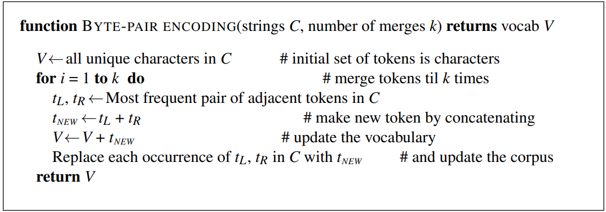

# Week 1 Note

## Regular Expressions

### Disjunctions

- Letters inside square brackets[]

    | Pattern      | Matches              |
    | ------------ | -------------------- |
    | [wW]oodchuck | Woodchuck, woodchuck |
    | [1234567890] | Any digit            |

- Ranges[A-Z]

    | Pattern      | Matches              |
    | ------------ | -------------------- |
    | [A-Z]        | An upper case letter |
    | [a-z]        | A lower case letter  |
    | [0-9]        | A single digit       |

### Negation in Disjunction

**Negations** [^Ss]
- Carat means negation only when first in []

    | Pattern      | Matches              |
    | ------------ | -------------------- |
    | [^A-Z]       | Not an upper case letter |
    | [^Ss]        | Neither 'S' nor 's'  |
    | [^e^]        | Neither 'e' nor '^'  |
    | a^b          | The pattern a carat b|

### More Disjunction

- The pipe | for disjunction

    | Pattern      | Matches              |
    | ------------ | -------------------- |
    | grounding\|woodchuck | woodchuck    |
    | yours\|mine  | yours                |
    | a\|b\|c      | =[abc]               |
    | [gG]roundhog\|[Ww]oodchuck|Woodchuck|

### ?*+.

| Pattern      | Matches              |
| ------------ | -------------------- |
| colou?r      | Optional previous char     |
| oo*h!        | 0 or more of previous char |
| o+h!         | 1 or more of previous char |
| beg.n        | begin begun beg3n          |

### Anchors ^ $

| Pattern      | Matches              |
| ------------ | -------------------- |
| ^[A-Z]       | Palo Alto            |
| ^[^A-Za-z]   | 1  "Hello"           |
| \\.$          | The end.             |
| .$           | The end?  The end!   |


### Error

The process we just went through was based on fixing two kinds of errors:
1. Matching strings that we should not have matched  
   **Flase positives(Type I errors)**
2. Not matching things that we should have matched
   **Flase negatives(Type II errors)**

> - Increasing accuracy or precision (minimizing false positives)
> - Increasing coverage or recall(minimizing false negatives)

## More Regular Expressions: Substitutions and ELIZA

### Substitutions

```
s/regexp1/pattern
```

```
s/colour/color
```

> ```
> /the (.*)er they (.*), the \1er we \2/
> ```
> 
> Matches
> - the faster they ran the faster we ran
> But not
> - the faster they ran the faster we ate

- Non-capturing groups: add a `?:` after paren:
  ```
  /(?:some|a few) (people|cats) like some \1/
  ```

- (`?=` pattern) is true if pattern matches, but is zero-width; doesn't advance character pointer

- (`?!` pattern) true if a pattern does not match

### ELIZA

```
s/.* I’M (depressed|sad) .*/I AM SORRY TO HEAR YOU ARE \1/ 
s/.* I AM (depressed|sad) .*/WHY DO YOU THINK YOU ARE \1/
s/.* all .*/IN WHAT WAY?/ 
s/.* always .*/CAN YOU THINK OF A SPECIFIC EXAMPLE?/ 
```

## Words and Corpora

**Type**: an element of the vocabulary. 不重复的单词有多少种

**Token**: an instance of that type in running text. 总共有多少单词，包括重复出现的单词

N = number of tokens

V = vocabulary = set of types, |V| is size of vocabulary

Heaps Law = Herdan's Law = |V| = $kN^\beta$ where often 0.67 < $\beta$ < 0.75

### Corpora

A text is produced by 
- a specific writer(s), 
- at a specific time, 
- in a specific variety,
- of a specific language, 
- for a specific function

## Word tokenization

### Text Normalization

Every NLP task requires text normalization: 
1. Tokenizing (segmenting) words
2. Normalizing word formats
3. Segmenting sentences

### Tokenization in NLTK

```
>>> text = ’That U.S.A. poster-print costs $12.40...’
>>> pattern = r’’’(?x) # set flag to allow verbose regexps
... ([A-Z]\.)+ # abbreviations, e.g. U.S.A.
... | \w+(-\w+)* # words with optional internal hyphens
... | \$?\d+(\.\d+)?%? # currency and percentages, e.g. $12.40, 82%
... | \.\.\. # ellipsis
... | [][.,;"’?():-_‘] # these are separate tokens; includes ], [
... ’’’
>>> nltk.regexp_tokenize(text, pattern)
[’That’, ’U.S.A.’, ’poster-print’, ’costs’, ’$12.40’, ’...’]
```

> So in Chinese it's common to just treat each character 
> (zi) as a token.
> - So the segmentation step is very simple. In other languages (like Thai and Japanese), more complex word segmentation is required.
> - The standard algorithms are neural sequence models trained by supervised machine learning

## Byte Pair Encoding

### Subword tokenization

Three common algorithms:
- Byte-Pair Encoding (BPE) (Sennrich et al., 2016)
- Unigram language modeling tokenization (Kudo, 2018)
- WordPiece (Schuster and Nakajima, 2012)

All have 2 parts:
- A token learner that takes a raw training corpus and induces a vocabulary (a set of tokens). 
- A token segmenter that takes a raw test sentence and tokenizes it according to that vocabulary

### Byte Pair Encoding (BPE) token learner

Let vocabulary be the set of all individual characters 
= {A, B, C, D,…, a, b, c, d….}
Repeat:
- Choose the two symbols that are most frequently adjacent in the training corpus (say 'A', 'B') 
- Add a new merged symbol 'AB' to the vocabulary
- Replace every adjacent 'A' 'B' in the corpus with 'AB'.

> 如果你的语料库包含词“lower”和“newer”，在初始状态下，词汇表包含单个字符。如果“e”和“r”是最常在一起出现的字符对，它们会被合并成一个新的符号“er”，并添加到词汇表中。然后，语料库中所有“er”的实例都会被这个新符号替换



- Properties of BPE tokens
  - Usually include frequent words
  - And frequent subwords
    - Which are often morphemes like -est or –er
  - A morpheme is the smallest meaning-bearing unit of a language
    - unlikeliest has 3 morphemes un-, likely, and -est

## Word Normalization and other issues

- Case folding
  - Applications like IR: reduce all letters to lower case
  - For sentiment analysis, MT, Information extraction

- Lemmatization
  - Represent all words as their lemma, their shared root

- Stemming
  - Reduce terms to stems, chopping off affixes crudely

- Dealing with complex morphology is necessary for many languages

- Sentence Segmentation
  - !, ? mostly unambiguous but period “.” is very ambiguous
    - Sentence boundary
    - Abbreviations like Inc. or Dr.
    - Numbers like .02% or 4.3
