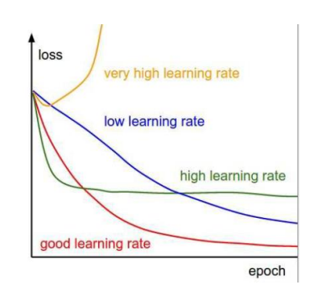
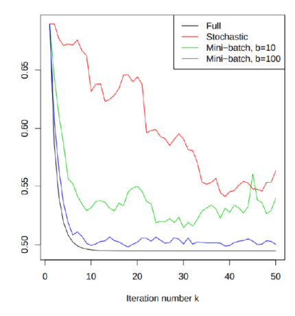

# Week 2 Note

## Gradient descent(GD)

### Introduction

- The <ins>gradient vector</ins> at a point $x$ points in the direction of greatest increase of the function $f$: each element of the gredient shows how fast $f(x)$ is changing

    > -  Example:   
    >     $$
    >         f(\vec{x}) = f(x_1,x_2) = 6x^2_1+ 4x^2_2 - 4x_1x_2
    >     $$
    >   - The gradient vector is
    >     $$
    >         \triangledown f(x_1,x_2) = \begin{pmatrix} 12x_1 - 4x_2 \\  8x_2 - 4x_1\end{pmatrix}
    >     $$

### Optimisation

- Optimisation algorithm  
  1. Start with a point $w$(initial guess)
  2. Find a direction $d$ to move on
  3. Determine how far $(\eta)$ to move along $d$
  4. Update: $w = w + \eta d$

### Minimisation

- It is an iterative algorithm, starting from $\vec{w}^{(0)}$ and producing a new $\vec{w}^{(t+1)}$ at each iteration as:

  $$
    \vec{w}^{(t+1)} = \vec{w}^{(t)} - \eta_t\triangledown C(\vec{w}^{(t)})
  $$

  where $t = 0,1,...,T$

  > $\eta_t > 0$ is the <ins>learning rate</ins> or <ins>step size</ins>

### Choosing a step size

- If step size is `too large` - algorithm may `never converge`
- If step size is `too small` - convergence may be `very slow`

### GD for least squares regression

- Least squares regression
  - For least square regression, let's recall:
    $$
        C(\vec{w}) = \frac{1}{2n}(\underbrace{\vec{w}^TX^TX\vec{w}}_{quadratic} - \underbrace{2\vec{w}^TX^Ty}_{linear} + \underbrace{\vec{y}^T\vec{y}}_{constant})
    $$
  - The gredient is computed as:
    $$
        \triangledown C(\vec{w}) = \frac{1}{n}(X^TX\vec{w} - X^T\vec{y})
    $$
  - GD updates $\vec{w}^{(t)}$ by
    $$
        \vec{w}^{(t+1)} = \vec{w}^{(t)} - \eta\triangledown C(\vec{w}^{(t)})
    $$

    $$
        \vec{w}^{(t+1)} = \vec{w}^{(t)} - \frac{\eta}{n}(X^TX\vec{w}^{(t)} - X^T\vec{y})
    $$

## Stochastic gradient descent(SGD)(随机梯度下降)

### Introduction

- Replace the computationally expensive term $\triangledown C(\vec{w}^{(t)})$ by a stochastic gradient computed on a `random` example

### Algorithm

1. Intialise the weights $\vec{w}^{(0)}$
2. For $t = 0,1,...,T$
  - Draw $i_t$ from ${1,2,...,n}$ with equal probability
  - Compute stochastic gradient $\triangledown C_i(\vec{w}^{(0)})$ and update
    $$
      \vec{w}^{(t+1)} = \vec{w}^{(t)} - \eta_t\triangledown C_i(\vec{w}^{(t)})
    $$

### SGD vs GD

- `GD requires more computations per iteration` but makes a `good progress per iteration`
  - It needs `few iterations to get a good` solution
- SGD requires `less computations per iteration` but makes `less update per iteration`
  - Therefore, it `needs more iterations to get a good` solution
- GD and SGD cannot always dominate the other.
  - If we want <ins>high accuracy</ins> and 𝑛 is small, then **GD** is better
  - If we want <ins>moderate accuracy</ins> and 𝑛 is large, then **SGD** is better

### Effect of learning rates

- If we choose a `low` learning rate, then SGD would converge very `slowly`
- If we choose a `large` learning rate, then SGD would `not go further` as we run more and more iterations
- If we choose a `huge` learning rate, then SGD would become `unstable`
- A typical choice is $\eta_t = \frac{c}{\sqrt{t}}$, where $c$ is a parameter needed to tune

## Minibatch SGD(小批次随机梯度下降)

### Introduction

- Randomly select a batch of indices: $B_t \subseteq \{1,2,...,n\}$ and update the model

  $$
    \vec{w}^{(t)} = \vec{w}^{(t)} - \frac{\eta_t}{b}\sum_{i \in B_t}\triangledown C_i(\vec{w}^{(t)})
  $$

  where $b$ is the batch size

  > If $b= 1$, it is cler that minibatch SGD is SGD(仅一次就是随机梯度下降了)

### Algorithm

- Let $\{\eta_t\}$ be a sequence of step sizes
- Algorithm
  1. Initialise the weights $\vec{w}^{(0)}$
  2. For $t = 0,1,...,T$
    - Randomly select a batch $B_t \subseteq \{1,2,...,n\}$ of size $b$
    - Compute stochastic gradient $\triangledown C_i(\vec{w}^{(t)})$ with $i \in B_t$ and update
      $$
        \vec{w}^{(t)} = \vec{w}^{(t)} - \frac{\eta_t}{b}\sum_{i \in B_t}\triangledown C_i(\vec{w}^{(t)})
      $$

- minibatch selection
  - There are two ways to sample the minibatch $B_t$
    - sampling with replacement(if b = 2, it is possible to get $B_t \subseteq \{2,2\}$)
    - sampling without replacement(if b = 2, it is not possible to get $B_t \subseteq \{2,2\}$)

### Minibatch SGD vs SGD vs GD

- Minibatch SGD requires more computations that SGD per iteration to build stochastic gradient
- Minibatch SGD is more accurate than SGD. Therefor, it converges faster w.r.t. the iteration number
- We need to balance the accuracy and computation by choosing an appropriate $b$
  - Typical choices: b = 32; b = 64; b = 128

## Linear classification

### Introduction

- Suppose we have 
  $$
    D = \{(\vec{x}^1, y^1), (\vec{x}^2, y^2), ..., (\vec{x}^n, y^n)\}
  $$
  and
  $$
    y^i \in \{-1, +1\}
  $$
- To build a linear model to `separate` posite examples from negative examples

### 0-1 loss

$$
  L(\hat{y}, y) = II[\hat{y} \neq y] = 
  \begin{cases}
    1 \quad\quad if\ \hat{y} \neq y\\
    0 \quad\quad otherwise\\
  \end{cases}
$$

- The behaviour of a model on $D$ can be measured by:
  $$
    C(\vec{w}) = \frac{1}{n}\sum^n_{i=1}II[sgn(\vec{w}^T\vec{x}^i) \neq y^i]
  $$

> The surrogate of $C(\vec{w})$ which is easy to minimise

### Margin-based loss

- Margin
  - The margin of a model $\vec{w}$ on an example($\vec{x}, y$)is defined as $y\vec{w}^T\vec{x}$
- A model with a `positive` margin means a `correct` prediction
- A model with a `negative` margin means an `incorrect` prediction

> $\hat{y} = sgn(\vec{w}^Tx)$ \
> $\bar{y} = \vec{w}^Tx$

> Margin(边距)，正确分类的情况下，距离决策边界越远的数据预测的越准确
>
> This further motivateds a model with large margin: a large margin means the model is robust in making a correct prediction(这进一步激发了具有大裕度的模型：大裕度意味着模型在做出正确预测方面具有鲁棒性。)

- Loss function of the form:
    $$
      L(\hat{y},y) = g(y\hat{y})
    $$
    where $g$ is decreasing

- minimising L means maximising the margin
  - Maximising the margin means getting a model with good performance

### Surrogate loss functions

- We mainly consider
  $$
    g(t) = \frac{1}{2}(max\{0, 1-t\})^2 = 
    \begin{cases}
      θ \qquad\qquad if\ t \geq 1\\
      \frac{1}{2}(1-t)^2 \quad otherwise\\
    \end{cases}
  $$

> 即 loss 没有负数(负数变为0)
>
> 为什么要加这一步: 使g/L differentiable(可导)

- The loss function becomes
  $$
    L(\hat{y},y) = \frac{1}{2}(max\{0,1-y\hat{y}\})^2 = \frac{1}{2}(max\{0,1-y\vec{w}^T\vec{x}\})^2
  $$

- The behaviour on $D$ is quantified by
  $$
    C(\vec{w}) = \frac{1}{2n}\sum^n_{i = 1}(max\{0,1-y^i\vec{w}^T\vec{x}\})^2
  $$

- We further get
  $$
    \triangledown C_i(\vec{w}) = 
    \begin{cases}
      θ \qquad\qquad\qquad if\ y^i\vec{w}^T\vec{x}^i \geq 1\\
      (\vec{w}^T\vec{x}^i-y^i)\vec{x}^i \quad otherwise\\
    \end{cases}
  $$

> - There are some other choices, including:
>   - $g(t) = max\{0, 1-t\}$
>     - $\min\limits_{\vec{w}}\frac{1}{n}\sum^n_{i=1}(max\{0, 1-y^i\vec{w}^T\vec{x}^i\})$
>   - $g(t) = \log(1 + \exp(-t))$
>     - $\min\limits_{\vec{w}}\frac{1}{n}\sum^n_{i=1}\log(1 + \exp(-y^i\vec{w}^T\vec{x}^i))$
>   

### SGD for linear classification

- Consider linear classification with the hinge loss
  $$
    C_i(\vec{w}) = \max\{0,1-y^i\vec{w}^T\vec{x}^i\}
  $$

- The formula for SGD update:
  $$
    \vec{w}^{(t+1)} = 
    \begin{cases}
      \vec{w}^{(0)} \qquad\quad\quad if\ y^{i_t}\vec{w}^{{(t)}^T}\vec{x}^{i_t} \geq 1\\
      \vec{w}^{(0)} + \eta_ty^{i_t}\vec{x}^{i_t} \quad otherwise\\
    \end{cases}
  $$

- Consider regularisation in the loss function
  $$
    C_i(\vec{w}) = \frac{1}{2}(\max\{0,1-y^i\vec{w}^T\vec{x}^i\})^2 + \frac{1}{2}\lambda||\vec{w}||^2_2
  $$

- The formula for SGD update:
  $$
    \vec{w}^{(t+1)} = 
    \begin{cases}
      \vec{w}^{(t)}-\lambda\vec{w}^{(t)} \qquad\quad\quad if\ y^{i_t}\vec{w}^{{(t)}^T}\vec{x}^{i_t} \geq 1\\
      \vec{w}^{(t)}-\lambda\vec{w}^{(t)} + \eta_t(1-y^{i_t}\vec{w}^{{(t)}^T}\vec{x}^{i_t})y^{i_t}\vec{x}^{i_t} \quad otherwise\\
    \end{cases}
  $$
