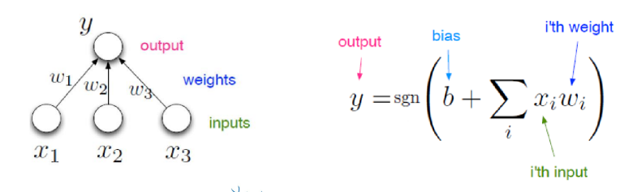
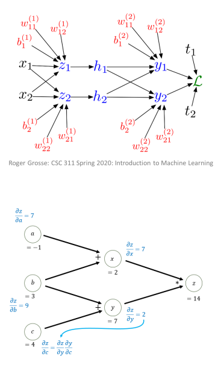

# Week 3 Note

## Perceptron

- Perceptron aka McCulloch-Pitts Neuron  
  

- Perceptron Algorithm  
  1: Initialize $w = 0$  
  2: while All training examples are `not` correctly classified do  
  3: &ensp; for $(x, y) \in S$ do  
  4: &ensp;&ensp; if $y \cdot w^T x \leq 0$ then  
  5: &ensp;&ensp;&ensp; $w \leftarrow w + yx$  
  > We assume no bias for simplicity:
  > - Loop over each (feature, label) pair in the dataset
  > - If the pair $(x, y)$ is misclassified
  > - Update the weight vector $w$

- Gradient Descent for One-Layer NN
  - 1: Initialize $w^{(1)} = 0, b^{(1)} = 0$
  - 2: for $t = 1,2,\dots, T$ do  
    &ensp;&ensp;3: Use (3), (2) to compute gradients
    $$
        \nabla w = - \frac{1}{n} \sum_{i=1}^{n} \frac{\partial C_i(w^{(t)})}{\partial w^{(t)}}\\
        \nabla b = - \frac{1}{n} \sum_{i=1}^{n} \frac{\partial C_i(w^{(t)})}{\partial b^{(t)}}
    $$
  - 4: Update the model
    $$
        w^{(t+1)} = w^{(t)} - \eta_t \nabla w\\
        b^{(t+1)} = b^{(t)} - \eta_t \nabla b
    $$
  > $T$ is the number of iterations

- Soft perceptron
- Chain rule
  $$
    \frac{\partial}{\partial t}f = \frac{\partial f}{\partial g}\frac{\partial g}{\partial t}
  $$
- Gradient descent
  $$
    \frac{\partial}{\partial w_i}C = (\sigma(\sum_j^mw_jx_j+b)-y)\ \sigma'(\sum^m_jw_jx_j + b)\ x
  $$

- Backpropagation Algorithm
  - `Forward pass`: Move forward through graph to compute all intermediate results
  - `Backward pass`: Move backward through graph compute all gradients

- Computation Graphs
  - Directed and acyclic
  - Nodes: variables
  - Edges: computation
  - Enable calc. of gradients

- Backpropagation
  - Efficient computation of gradients
  - Forward pass to compute values 
  - Backward pass to compute gradients
    - Use successor result

