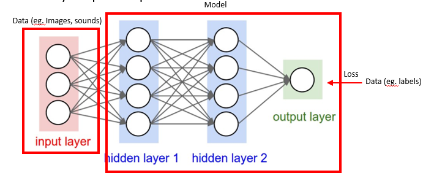
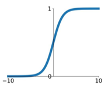
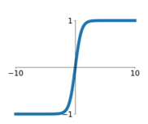
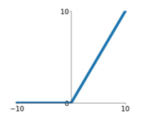
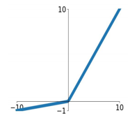
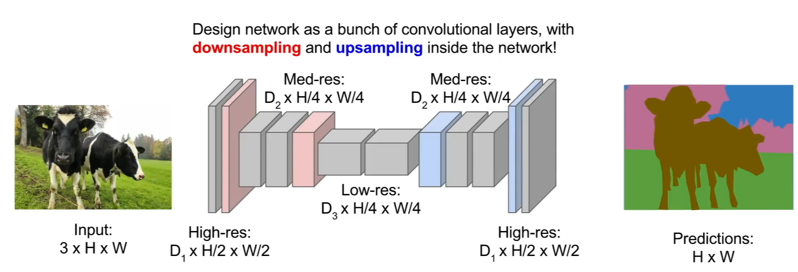
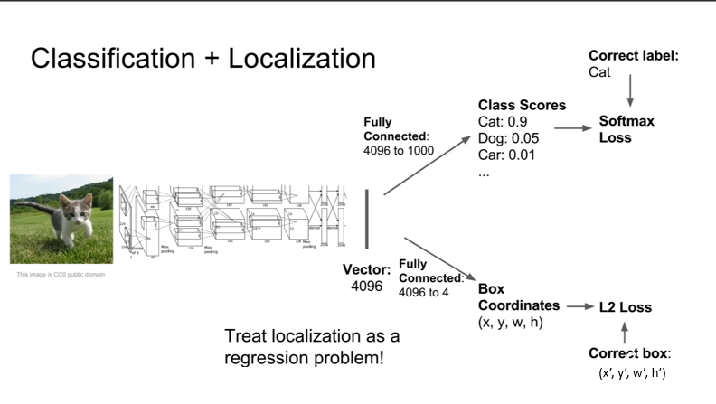
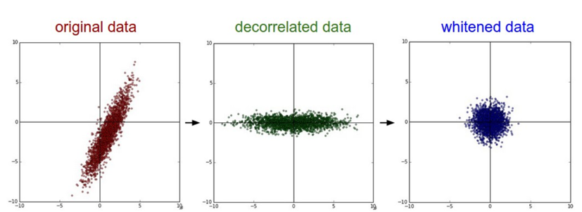

# Week 4 Note

## Convolution Neural Networks

### Multilayer perceptron

- Activation Functions
  - Sigmoid  
    
    $$
        f(x) = \frac{1}{1 + e^{-x}}
    $$
    - Normalise numbers to [0,1]
    - Saturated neurons kill gradients
    - Exponential function is more expensive
  - tanh  
    
    $$
        f(x) = \tanh(x)
    $$
    - Normalise numbers to [-1.1]
    - Saturated neurons kill gradients
  - RuLU(Rectified Linear Unit)  
    
    $$
        f(x) = \max(0,x)
    $$
    - Does not saturate in positive region
    - Converges much faster than sigmoid/tanh(e.g. 6x)
    - Dead ReLU will have no gradients
  - Leaky ReLU  
    
    $$
        f(x) = \max(0.01x, x)
    $$
    - Does not saturate in both negative and positive regions
    - Converges much faster than sigmoid/tanh(e.g. 6x)
    - Will not die

> - Tips in practice
>   - ReLU is the most popular choice
>   - Try out Leaky ReLU sometimes
>   - Try out tanh but do not expect much (normally used at last layer)
>   - Use Sigmoid only at the last layer 

### Convolutional neural networks

- Input a volume of size $W_1 \times H_1 \times D_1$, convoluted with
  1. Number of filters $K$
  2. Kernel of size $F$
  3. Stride $S$
  4. Number of zero-padding $P$
  5. Number of output padding $OP$
  - output volume size
    - Output a volume of size $W_2 \times H_2 \times D_2$
      1. $W_2 = \frac{W_1 - F + 2P}{S} + 1$
      2. $H_2 = \frac{H_1 - F + 2P}{S} + 1$
      3. $D_2 = K$
  - Number of parameters
    - Produces number of parameters
      1. $F \times F \times D_1$ oer filter
      2. $F \times F \times D_1 \times K + K$(total number of parameters: weights + basis)
  - output volume size after pooling
    - output a volume of size $W_2 \times H_2 \times D_2$
      1. $W_2 = \frac{W_1 - F}{S} + 1$
      2. $H_w = \frac{H_1 - F}{S} + 1$
      3. $D_2 = D_1$
  - Output size after upsampling(unpooling)
    - Output a volume of size $W_2 \times H_2 \times D_2$
      1. $W_2 = (W_1 - 1) \times S - 2 \times P + (F - 1) + 1 + OP$
      2. $H_2 = (H_1 - 1) \times S - 2 \times P + (F - 1) + 1 + OP$
      3. $D_2 = K$
  > - Semantic Segmentation: Label each pixel in the image with a category label  
  >   - Sliding Window
  >     - Problem: Very inefficient! Not reusing shared features between overlapping patches
  >   - Fully Convolutional
  >     

- Classification + Localization  
  
  - Treat localizaion as a regression problem

### Data processing

- `Min-max normalization`: Guarantees all features will have the exact same scale but does not handle outliers well
  $$
    Min-Max = \frac{value - min}{max - min}
  $$

- `Z-score normalization`: Handles outliers, but does not produce normalized data with the exact same scale
  $$
    Z-score = \frac{value-mean}{std}
  $$

### Terminologies

1. **Batch**：
   - 批次是指将整个数据集分成若干组或“批”，用于网络的迭代训练过程中。例如，如果你有1000个样本，你可能将它们分成10个批次，每个批次包含100个样本。

2. **Epoch**：
   - 一个时代指的是整个数据集通过神经网络一次正向传递和一次反向传递。因此，一个时代包括整个数据集的所有批次的处理。

3. **Stochastic Gradient Descent (SGD)**：
   - 这是一种用于优化神经网络权重和偏差的方法。SGD通过在每个批次上基于单个样本或子集来更新参数，使损失函数最小化。

4. **Neuron**：
   - 神经元是神经网络中的基本单元，它接收输入，处理信息，并通过激活函数传递输出。

5. **Activation/Feature Map**：
   - 当输入通过卷积层时，特征图或激活图是生成的输出。它是网络学习的特征或激活的空间布局（图）。

6. **Activation Function**：
   - 激活函数决定神经元是否应该被激活或“触发”。它是一个数学函数（如ReLU，sigmoid或tanh），将神经元的输入转换为输出。

7. **Channels/Depth**：
   - 通道是指特征图的深度，例如，在彩色图像中有RGB三个通道。在深度学习中，每个通道通常代表不同类型的特征。

8. **Receptive Field**：
   - 感受野是指在输入空间中，能影响特定神经网络层中神经元输出的区域大小。

9. **Hidden Layer (including many activation maps)**：
   - 隐藏层位于输入层和输出层之间的神经网络层。一个隐藏层包括多个神经元，并且可以有多个激活图，表示不同类型的特征。

10. **Parameter**：
    - 参数是模型中需要学习的变量，例如权重和偏差。这些在训练过程中不断更新。

11. **Hyperparameter**：
    - 超参数是在开始学习过程之前设置的参数，例如学习率、批次大小、训练的轮数（时代）、隐藏层的数量等。

12. **Network Architecture**：
    - 网络架构是指神经网络的整体设计或拓扑结构，包括层数、每层的神经元数、激活函数的选择等。

13. **Inference (deployment)**：
    - 推理或部署是指使用训练好的模型来做出预测的过程。通常，在实际场景或生产环境中进行。

14. **Forward Pass**：
    - 正向传播是神经网络中数据流动的过程，从输入层开始，通过各个隐藏层，最终到达输出层。在这个过程中，计算节点的激活和输出。

15. **Backward Propagation**：
    - 反向传播是一种高效的梯度计算方法，用于更新神经网络的权重和偏差。基于损失函数的梯度，这种方法首先计算输出层的梯度，然后反向传播到隐藏层，依此类推。

**算术关系**：
- 批次大小、时代数和学习率等超参数经常相互影响。例如，更小的批次大小可能需要较低的学习率和更多的训练轮数。
- 层数和每层的神经元数量决定了网络架构的复杂性和模型的参数总数。通常，更深的网络（更多层）拥有更强的特征学习能力，但也更容易过拟合。
- 在反向传播过程中，参数的更新与激活函数的选择、学习率和损失函数的梯度直接相关。不同的激活函数可能会导致完全不同的模型性能和收敛速度。