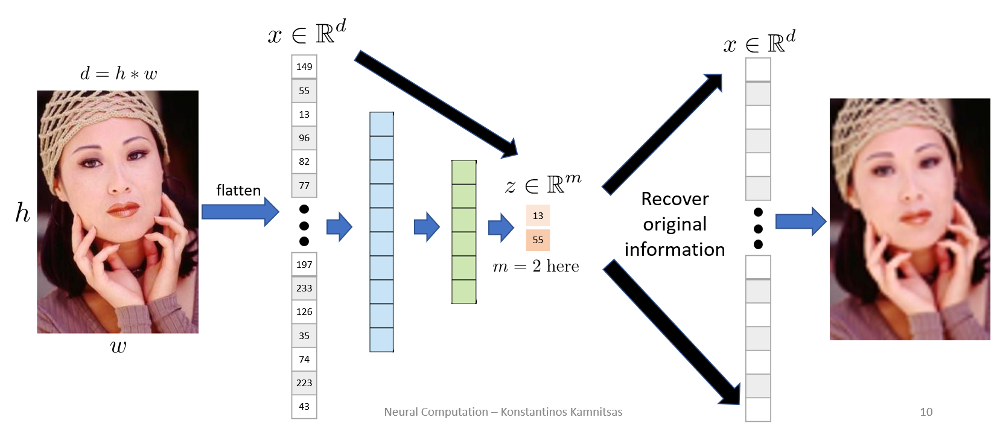
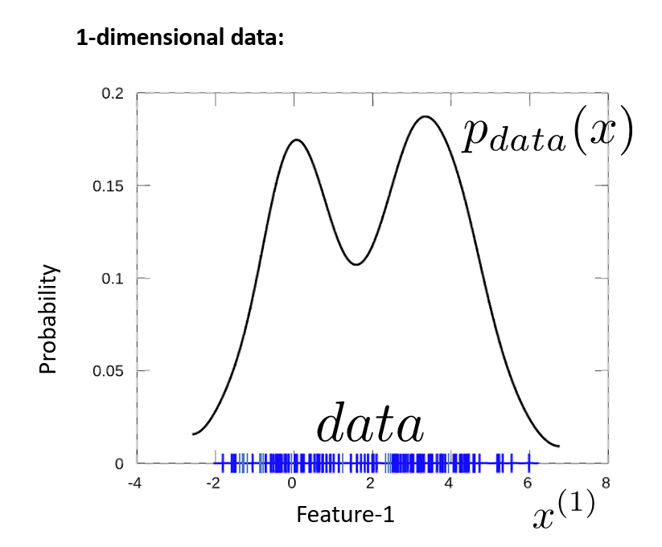
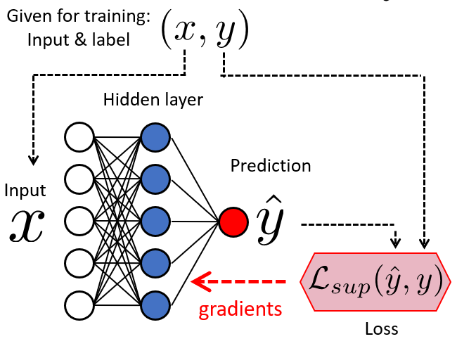
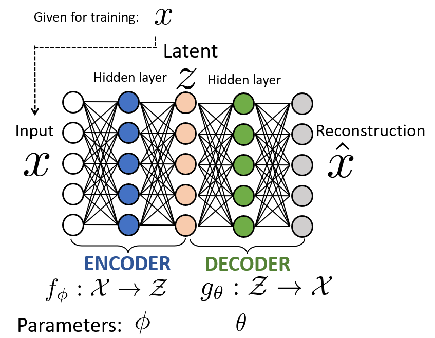
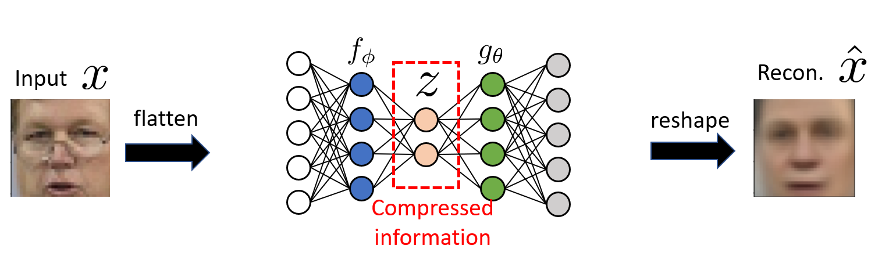
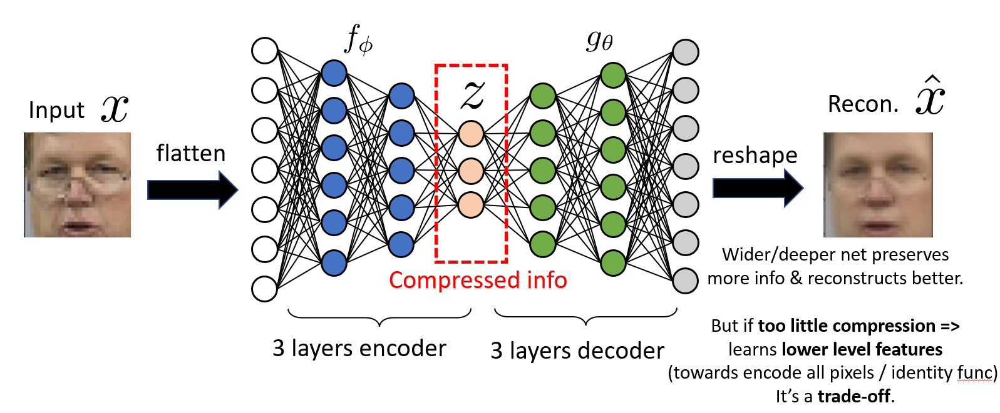
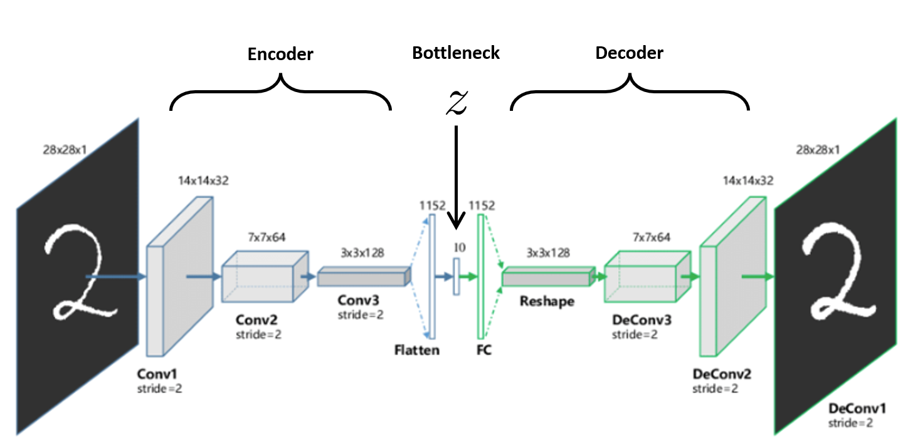
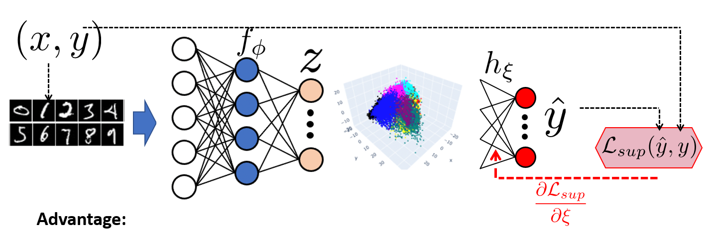
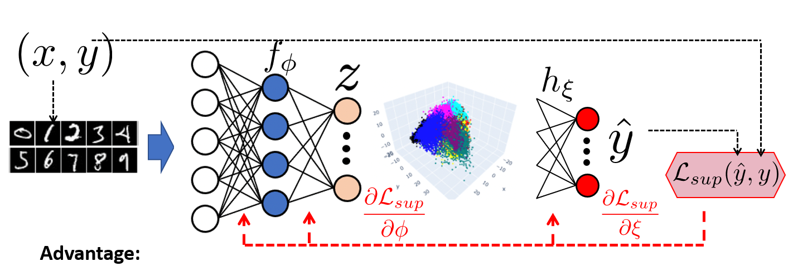
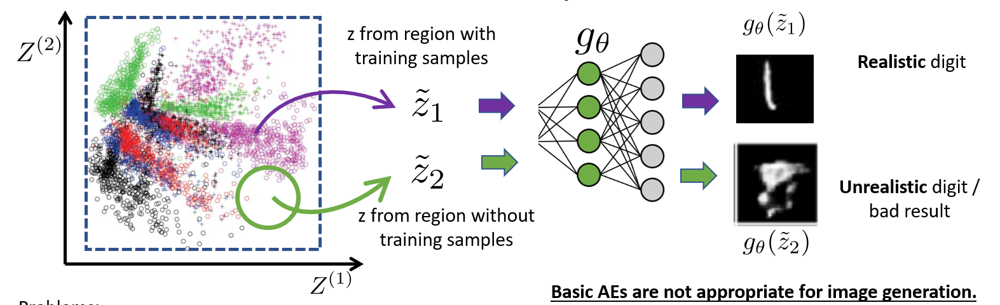

# Week 5 Note

## Unsupervised Learning and Auto-Encoders

- Unsupervised Learning
  - **Available data**: $x_1, ..., x_N \sim P_\text{data}(x)$
  - **Goal**: Learn `useful features` of the data/Learn `the structure` of the data
  - Useful for:
    - Dimensionality Reduction(compression)
      - Learn $f: \R^d \rarr \R^m$ where $d > m$
      - Requirement: Preserve important information  
      
    - Clustering
      - Discover or form groups of samples based on their similarity. Similar samples should be grouped together, dissimilar samples should be separated
    - Probabilit Density Estimation  
      
    - Generation/Synthesis
    - Learn from loads unlabeled data, when labeled data are limited
    - ...

### Auto-Encoders

- Supervised Classifier: $X \rarr Y$
  - Given for training: Input & Label  
    

- Supervised Encoder: $X \rarr Z$
  - Given for training: Only input samples  
    

- Unsupervised Auto-Encoder(AE): 
  - Given for training: $X$  
  
  - Encoder: 
    - Takes input $x$ and encodes it to $z = f_\phi(x)$
  - Decoder:
    - Takes code z and decodes it to re-construct $\hat{x} = g_\phi(f_\phi(x))$
  - Result:
    - Good reconstruction($\hat{x} \approx x$) is possible only if code Z preserves info about $x$

- Reconstruction Loss a.k.a. Mean Squared Error:
  $$
    L_\text{rec} = \frac{1}{d} \sum^d_{j=1} (x^{(j)} - \hat{x}^{(j)})^2\\
    = \frac{1}{d}\sum^d_{j=1}(x^{(j)} - g^{(j)}_\theta(f_\phi(x)))^2
  $$

- Only one Global Optimum:
  $$
    L_{rec} = 0 \Leftrightarrow \hat{x}^{(j)} - x^{(j)} = 0 \ \forall j\\
    \Leftrightarrow  \hat{x} = x
  $$

> The loss is minimized when: $\hat{x} = x \rArr g_\theta(f_\theta(x)) = x$
>
> The Auto-Encder tries to learn the identity function!
>
> Exists trivial solution(and useless model):
> $$
>   z = f_\theta(x) = x\\
>   \hat{x} = g_\theta(z) = z
> $$

- Solution: Bottleneck layer
  $$
    f_\phi: X\in \R^d \rarr Z \in \R^v, \text{where}\ v < d
  $$
  
  > Details may be lost
  - Reconstruction loss **penalizes wrong pixel intensities**. Therefore:  
    Encoder usually learns to encode features that **explain intensities of as many pixels as possible**.  
    Usually these are “**high level**” features, as often called in deep learning: E.g. here: Skin color (most pixels), location and size of eyes, mouth, nose (dark areas), type of hair, clothing…  
    
  - But if too little compression => AE may not learn high level features. It's a **trade-of**

  > - **Important to know**:
  >   - **We do not control** what features are learned
  >   - Re-training with different random seeds **may learn different features** due to randomness of SGD!
  >   - **We do not know** what features (attributes) of the input are learned
  >   - We can find out by visual inspection: After an AE was trained, encode X and decode it after changing only 1 feature.Then, check what changed in the reconstruction!

> - Convolutional Auto-Encoders  
>   
> 
> - RNN-based Auto-Encoders  
>   

- AEs can learn to cluster the data in unsupervised manner
  - Learn from unlabeled data, when labels are lmited
    - Assume our ultimate goal is to learn a Classifier with Supervised learning  
      But number(N) of labeled data is small
      $$
        D = (X,Y) = \{(x_i,y_i)\}^N_{i=1}
      $$
    > **Potential overfit**: Whole image-to-label network trained with little data
  1. **Approach 1**
     - Using the limited labelled data, train with Supervised Learning ONLY the classifier 
       Keep parameters of encoder frozen  
       
       - **Advantage**: Trains only the small classifier with the limited labels.Therefore can avoid over-fit
       - **Disadvantage**: Encoder is not optimized for labelled data. May be suboptimal
  2. **Approach 2**
     - Using the limited labelled data, train with Supervised Learning BOTH the encoder and the classifier(usually for only few SGD iterations)  
       
       - **Advantage**: Encoder is optimized via labels, which "may" lead to better representation Z and results
       - **Disadvantage**: Possibility to overfit as all parameters are trained. Limited GD steps to avoid this. Number of GD steps must be carefully decided on validation data to avoid overfit

- Problem generating new data with basic AE
  1. Step 1: Sample random z  
     E.g. With uniform probability between[min,max] values z seen during training
  2. Step 2: Decode  
  
  - Basic AEs are not appropriate for image generation.  
    Reconstruction loss does not train AE for generation
  > - Problems:
  >   - No "real" digits were encoded in that area during training  
  >     Hence these z values do not encode "realistic" digits
  >   - Decoder has not learned to decode such z values