<!-- TOC start -->
- [AI Note](#ai-note)
  * [1. Machine Learning Basics](#1-machine-learning-basics)
    + [1.1 Categories of machine learning](#11-categories-of-machine-learning)
    + [1.2 Supervised learning workflow](#12-supervised-learning-workflow)
    + [1.3 Model evaluation](#13-model-evaluation)
  * [2. Hierarchical Clustering](#2-hierarchical-clustering)
    + [2.1 Clustering concepts](#21-clustering-concepts)
    + [2.2 Hierarchical clustering](#22-hierarchical-clustering)
  * [3. K-means](#3-k-means)
    + [3.1 K-means](#31-k-means)
  * [4. GMM/EM](#4-gmmem)
    + [4.1 Gaussian mixture models(GMMs)](#41-gaussian-mixture-modelsgmms)
    + [4.2 Expectation-Maximization(EM Algorithm)](#42-expectation-maximizationem-algorithm)
    + [4.3 Summary](#43-summary)
  * [5. DBSCAN](#5-dbscan)
    + [5.1 Density-based Clustering - DBSCAN](#51-density-based-clustering---dbscan)
    + [5.2 The algorithm](#52-the-algorithm)

<!-- TOC end -->

# AI Note

## 1. Machine Learning Basics

### 1.1 Categories of machine learning

- Supervised learning  
  有监督的学习

  > Labeled data  
  > 标记数据  
  > Predict outcome/future  
  > 预测结果/未来

  - Classification: predict categorical class labels  
    分类:预测分类类别标签
    - e.g. the handwritten digit (multi-class)  
      例如，手写的数字（多类）

  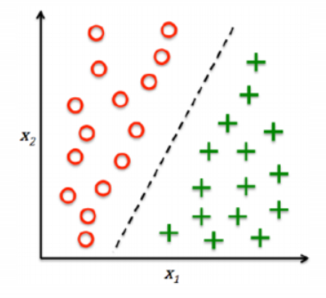

  - Regression: Prediction of continuous outcomes  
    回归: 对连续结果的预测
    - e.g. students’ grade scores 例如学生的成绩

  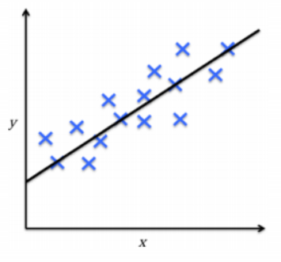

- Unsupervised learning  
  无监督的学习

  > No labels/targets  
  > 无标签/目标  
  > Find hidden structure/insights in data  
  > 在数据中找到隐藏的结构/见解

  - Clustering: Objectives within a cluster share a degree of
    similarity.  
    聚类: 集群内的目标有一定程度的相似性
    - e.g. product recommendation  
      例如产品推荐

  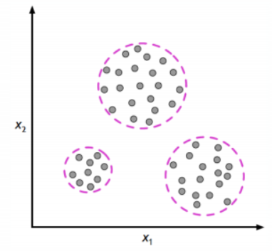

  - Dimensionality Reduction:  
    降维
    - reduce data sparsity  
      降低数据稀疏性
    - reduce computational cost  
      降低计算成本

  

- Reinforcement learning  
  强化学习
  - Decision process  
    判定过程
  - Reward system  
    反馈系统
  - Learn series of actions  
    学习一系列动作
  - Applications: chess, video games, some robots, self-driving cars  
    应用程序：国际象棋，电子游戏，一些机器人，自动驾驶汽车

### 1.2 Supervised learning workflow

  

!Note: Training Data is used to build up the model and Test DAta is used
to test the model

### 1.3 Model evaluation

- misclassification error  
  错误分类错误

- other metrics  
  其他指标
  - Accuracy (1-Error)
  - ROC, AUC
  - Precision, Recall
  - F-measure, G-mean
  - (Cross) Entropy
  - Likelihood
  - Squared Error/MSE
  - R2

## 2. Hierarchical Clustering

### 2.1 Clustering concepts

- Segment data into clusters, such that there is  
  将数据分割成集群，这样有
  - high intra-cluster similarity  
    高聚类内相似性
  - low inter-cluster similarity  
    低聚类间相似性
- informally, finding natural groupings among objects  
  非正式地，在物体之间寻找自然的分组。

- Clustering set-up  
  聚类设置
  - Our data are: D = {x1, . . . , xN}.
  - Each data point is m-dimensional, i.e.  
    xi = <xi,1, . . . , xi,m>
  - Define a distance function (i.e. similarity measures) between data,  
    d(xi, xj)
  - Goal: segment xn into k groups  
    {z1, . . . , zN} where zi ∈ {1, . .
    . ,K}

- Similarity Measures
  - Between any two data samples p and q, we can calculate their
    distance d(p,q) using a number of measurements:  
    

- Types of Clustering Algorithms  
  聚类算法的类型
  - Partitional clustering, e.g. K-means, K-medoids  
    分区聚类，例如K-means，K-medoids
  - Hierarchical clustering  
    分层聚类
    - Bottom-up(agglomerative)  
      自下而上（凝聚）
    - Top-down  
      自上而下
  - Density-based clustering, e.g. DBScan  
    基于密度的聚类，例如DBScan
  - Mixture density based clustering 基于混合密度的聚类
  - Fuzzy theory based, graph theory based, grid based, etc.  
    基于模糊理论、基于图论理论、基于网格理论等

### 2.2 Hierarchical clustering

- Create a hierarchical decomposition of the set of objects using some
  criterion  
  使用某种标准创建对象集的分层分解
- Produce a dendrogram  
  生成树状图

- Agglomerative clustering illustration  
  凝聚性的聚类说明
  - Place each data point into its own singleton group  
    将每个数据点放到它自己的单例组中
  - Repeat: iteratively merge the two closest groups  
    重复：迭代地合并两个最近的组
  - Until: all the data are merged into a single cluster  
    直到：将所有数据都合并为单个集群

- Output: a dendrogram  
  输出：树状图
- Reply on: a distance metric between clusters  
  回复：集群之间的距离度量

- Measuring Distance between clusters
  - Single linkage  
    单连锁
    - the similarity of the closest pair  
      最近的一对之间的相似性

  

  - Complete linkage  
    完全连锁
    - the similarity of the furthest pair 最远的一对之间的相似性

  

  - Group average  
    组平均值
    - the average similarity of all pairs  
      所有成对的平均相似度
    - more widely used  
      更广泛地使用
    - robust against noise 抗噪声强

  

- Strengths, weaknesses, caveats  
  优势、弱点和注意事项
  - Strengths  
    优势
    - provides deterministic results  
      提供确定性结果
    - no need to specify number of clusters beforehand  
      不需要预先指定集群的数量
    - can create clusters of arbitrary shapes  
      可以创建任意形状的集群吗
  - Weakness  
    缺点
    - does not scale up for large datasets, time complexity at least
      O(n2)  
      不可以扩展到大型数据集，时间复杂度至少为O(n2)
  - Caveats  
    注意事项
    - Different decisions about group similarities can lead to vastly
      different dendrograms.  
      关于群体相似性的不同决定可能会导致截然不同的树状图
    - The algorithm imposes a hierarchical structure on the data, even
      data for which such structure is not appropriate.
      该算法对数据强加了一个分层结构，即使是这种结构不合适的数据

## 3. K-means

### 3.1 K-means

- Centroid-based: describe each cluster by its mean  
  基于质心的：用它的平均值来描述每个聚类
- Goal: assign data to K.  
  目标：将数据分配给K
- Algorithm objective: minimize the within-cluster variances of all
  clusters.  
  算法目标：最小化所有聚类的簇内方差

- A non-deterministic method  
  非确定性方法
- Finds a local optimal result (multiple restarts are often necessary)  
  找到局部最优结果（通常需要多次重启）

- Algorithm description  
  

## 4. GMM/EM

### 4.1 Gaussian mixture models(GMMs)

- Assume data was generated by a set of Gaussian distributions  
  假设数据是由一组高斯分布生成的
- The probability density is a mixture of them 概率密度是它们的混合物
- Find the parameters of the Gaussian distributions and how much each
  distribution contributes to the data  
  找出高斯分布的参数以及每个分布对数据的贡献程度
- This is a mixture model of Gaussian  
  这是一个高斯分布的混合模型

- Generative Models  
  生成模型
  - In supervised learning, we model the joint distribution  
    在监督学习中，我们建立了联合分布的模型  
    
  - In unsupervised learning, we do not have labels z, we model  
    在无监督学习中，我们没有标签z，我们建模  
    

- A GMM represents a distributions as  
  一个GMM表示一个分布为  
  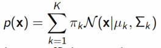
- with πk the mixing coefficients, where  
  与πk的混合系数，其中  
  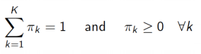
- GMM is a density estimator  
  GMM是一个密度估计器
- GMM is universal approximators of densities (if you have enough
  Gaussians)  
  GMM是密度的通用近似器（如果你有足够的高斯分布）

- To have a model best fit data, we need to maximize the (log)
  likelihood  
  为了得到一个模型的最佳拟合数据，我们需要最大化（对数）的可能性  
  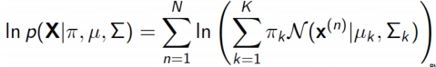
- Expectation: if we knew πk, µ and ∑ , we can get “soft”
  Zk P(z(n)|x) - responsibility
- Maximization: if we know Zk, we can get πk, µ
  and ∑

- GMM model has 3 parameters in total to optimise:  
  GMM模型共有3个参数进行优化：
  - the mean vectors of each component(mu)  
    每个分量的平均向量(mu)
  - the covariances matrices of each component(sigma)  
    每个分量的协方差矩阵(sigma)
  - the weights associated with each component(pi)  
    与每个组件关联的权重(pi)

  - Each iteration of the EM algorithm increases to likelihood of the
    data, unless you happen to be exactly at a local optimum.  
    EM算法的每次迭代都会增加到数据的可能性，除非你碰巧恰好处于局部最优状态。

### 4.2 Expectation-Maximization(EM Algorithm)

- An optimization process that alternates between 2 steps:  
  在以下两个步骤之间交替进行的优化过程：
  - E-step: compute the posterior probability over z given the current
    model.  
    E步：计算给定当前模型对z的后验概率  
    
  - M-step: Assuming data was really generated this way, change the
    parameters of each Gaussian to maximize the probability that it
    would generate the data it is currently responsible for.  
    m步：假设数据真的是以这种方式生成的，那么就改变每个高斯分布的参数，以最大限度地提高它产生它目前负责的数据的概率
    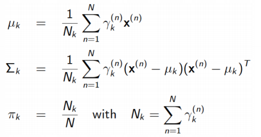

- A general algorithm for optimizing many latent variable models (not
  just for GMMs).  
  一种用于优化许多潜在变量模型的通用算法(不仅仅是用于gmm)
- Iteratively computes a lower bound then optimizes it  
  迭代地计算一个下界，然后优化它
- Converges but maybe to a local minima  
  收敛，但可能会收敛到一个局部最小值
- Can use multiple restarts  
  可以使用多个重新启动

### 4.3 Summary

- Clustering  
  聚类
  - group similar data points  
    组相似的数据点
  - need a distance measure  
    需要一个距离测量
- Agglomerative hierarchical clustering  
  凝聚的层次聚类
  - successively merges similar groups of points  
    依次合并相似的点组
  - build a dendrogram (binary tree)  
    构建一个树状图（二叉树）
  - different ways to measure distance between clusters  
    测量集群之间距离的不同方法
- GMM using EM  
  GMM使用EM
  - build a generative model based on Gaussian distributions  
    建立一个基于高斯分布的生成模型
  - need to pre-define k (number of clusters)  
    需要预先定义k（集群的数量）
  - Using EM to find the best fit of the model  
    利用EM找到模型的最佳拟合性

## 5. DBSCAN

### 5.1 Density-based Clustering - DBSCAN

- Acronym for: Density-based spatial clustering of applications with
  noise  
  缩写：基于密度的带有噪声的应用程序的空间聚类
- Clusters are dense regions in the data space separated by regions of
  lower sample density  
  聚类是数据空间中由样本密度较低的区域分隔的密集区域
- A cluster is defined as a maximal set of density connected points  
  一个簇被定义为密度连接点的最大集
- Discover clusters of arbitrary shape  
  发现任意形状的簇

- Define three exclusive types of points  
  定义三种排他性类型的点
  - Core, Border (or Edge) and Noise (or outlier)  
    核心、边界（或边缘）和噪声（或异常值）

> Core points -- dense region 核心点，密集区域  
> Noise -- sparse region 噪声稀疏区

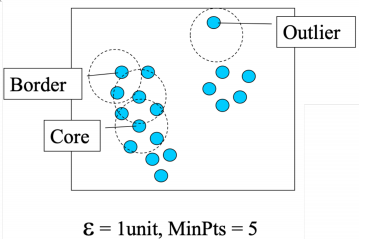

- Need two parameters  
  需要两个参数
  - a circle of epsilon radius  
    一个半径的圆
  - a circle containing at least minPts number of points  
    一个至少包含分钟数点的圆

- Three types of points

| core   | The point has at least minPts number of points within Eps 该点在Eps内至少有minPts数量的点数                                                            |
|:-------|:------------------------------------------------------------------------------------------------------------------------------------------------------|
| border | The point has fewer than minPts within Eps, but is in the neighbourhood (i.e. circle) of a core point 该点在Eps内比minpt少，但在一个核心点的附近（即圆圈） |
| noise  | Any point that is not a core point or a border point.  任何不是核心点或边界点的任何点                                                                   |

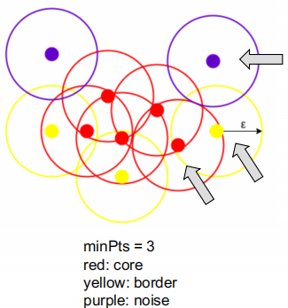

- Density-reachability  
  密度可达性
  - Directly density-reachable: a point q is directly density-reachable
    from point p if p is a core point and q is in p’s neighbourhood  
    直接密度可达：如果p是一个核心点，并且q在p的邻域内，则一个点q从点p直接密度可达

  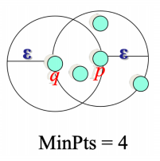
  - q is directly density-reachable from p  
    q可以从p直接得到密度
  - p is not necessarily directly density-reachable from q  
    p不一定能从q中直接达到密度
  - Density-reachability is asymmetric  
    密度-可达性是不对称的
  - Density-Reachable (directly and indirectly)  
    密度-可达性（直接或间接）
    - A point p is directly density-reachable from p2  
      一个点p可以从p2直接通过密度到达
    - p2 is directly density-reachable from p1  
      p2可以从p1直接达到密度
    - p1 is directly density-reachable from q  
      p1可以直接从q达到密度
    - q -> p1 -> p2 -> p form a chain(p is the border)  
      q->p1->p2->p形成一个链(p是边界)

  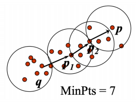
  - p is indirectly density-reachable from q  
    p是从q间接达到密度的
  - q is not density-reachable from p  
    q不能从p得到密度

### 5.2 The algorithm

1. Label all points as core, border or noise.  
   将所有点标记为核心、边界或噪声
2. Eliminate noise points. 消除噪声点
3. For every core point p that has not been assigned to a cluster:  
   对于没有分配给集群的每个核心点p  
   Create a new cluster with the point p and all the points that are
   density-reachable from p  
   用点p和所有从p可以达到密度的点创建一个新的集群
4. For border points belonging to more than 1 cluster, assign it to the
   cluster of the closest core point.  
   对于属于1个集群的边界点，将其分配给最近核心点的集群。

- Some key points
  - DBSCAN can find non-linearly separable clusters. (an advantage over
    K-means and GMM)  
    DBSCAN可以找到非线性可分的簇。(相对于K-means和GMM的优势)
  - Resistant to noise  
    耐噪音
  - Not entirely deterministic: border points that are reachable from
    more than one cluster can be part of either cluster, depending on
    the implementation  
    不完全确定性的：从多个集群可访问的边界点可以是任意一个集群的一部分，这取决于实现

- K-means and EM rely on cluster initialisation, and EM also relies on
  gradient descent. Therefore, they are non-deterministic algorithms and
  may get struck at local optima  
  K-means和EM依赖于聚类初始化，而EM也依赖于梯度下降。因此，它们是非确定性的算法，可能会达到局部最优

