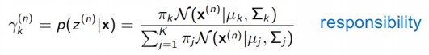
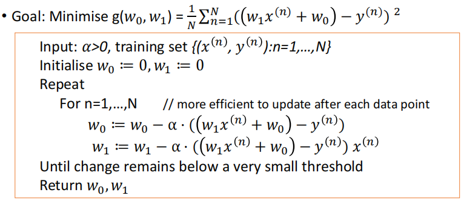

<!-- TOC start -->
- [AI Note](#ai-note)
  * [1. Machine Learning Basics](#1-machine-learning-basics)
    + [1.1 Categories of machine learning](#11-categories-of-machine-learning)
    + [1.2 Supervised learning workflow](#12-supervised-learning-workflow)
    + [1.3 Model evaluation](#13-model-evaluation)
  * [2. Hierarchical Clustering](#2-hierarchical-clustering)
    + [2.1 Clustering concepts](#21-clustering-concepts)
    + [2.2 Hierarchical clustering](#22-hierarchical-clustering)
  * [3. K-means](#3-k-means)
    + [3.1 K-means](#31-k-means)
  * [4. GMM/EM](#4-gmmem)
    + [4.1 Gaussian mixture models(GMMs)](#41-gaussian-mixture-modelsgmms)
    + [4.2 Expectation-Maximization(EM Algorithm)](#42-expectation-maximizationem-algorithm)
    + [4.3 Summary](#43-summary)
  * [5. DBSCAN](#5-dbscan)
    + [5.1 Density-based Clustering - DBSCAN](#51-density-based-clustering---dbscan)
    + [5.2 The algorithm](#52-the-algorithm)
  * [6. Supervised Learning](#6-supervised-learning)
    + [6.1 Supervised Learning](#61-supervised-learning)
    + [6.2 Training data](#62-training-data)
    + [6.3 Terminology in Supervised Learning](#63-terminology-in-supervised-learning)
    + [6.4 Applications of supervised learning](#64-applications-of-supervised-learning)
  * [7. Linear Regression](#7-linear-regression)
    + [7.1 Regression](#71-regression)
    + [7.2 Univariate linear regression](#72-univariate-linear-regression)
    + [7.3 Loss functions (or cost functions)](#73-loss-functions-or-cost-functions)
    + [7.4 what we want to do](#74-what-we-want-to-do)
    + [7.5 Gradient Descent](#75-gradient-descent)
    + [7.6 Gradient](#76-gradient)
<!-- TOC end -->

# AI Note

## 1. Machine Learning Basics

### 1.1 Categories of machine learning

- Supervised learning  
  有监督的学习

  > Labeled data  
  > 标记数据  
  > Predict outcome/future  
  > 预测结果/未来

  - Classification: predict categorical class labels  
    分类:预测分类类别标签
    - e.g. the handwritten digit (multi-class)  
      例如，手写的数字（多类）

  

  - Regression: Prediction of continuous outcomes  
    回归: 对连续结果的预测
    - e.g. students’ grade scores 例如学生的成绩

  

- Unsupervised learning  
  无监督的学习

  > No labels/targets  
  > 无标签/目标  
  > Find hidden structure/insights in data  
  > 在数据中找到隐藏的结构/见解

  - Clustering: Objectives within a cluster share a degree of
    similarity.  
    聚类: 集群内的目标有一定程度的相似性
    - e.g. product recommendation  
      例如产品推荐

  

  - Dimensionality Reduction:  
    降维
    - reduce data sparsity  
      降低数据稀疏性
    - reduce computational cost  
      降低计算成本

  

- Reinforcement learning  
  强化学习
  - Decision process  
    判定过程
  - Reward system  
    反馈系统
  - Learn series of actions  
    学习一系列动作
  - Applications: chess, video games, some robots, self-driving cars  
    应用程序：国际象棋，电子游戏，一些机器人，自动驾驶汽车

### 1.2 Supervised learning workflow

  

!Note: Training Data is used to build up the model and Test DAta is used
to test the model

### 1.3 Model evaluation

- misclassification error  
  错误分类错误

- other metrics  
  其他指标
  - Accuracy (1-Error)
  - ROC, AUC
  - Precision, Recall
  - F-measure, G-mean
  - (Cross) Entropy
  - Likelihood
  - Squared Error/MSE
  - R2

## 2. Hierarchical Clustering

### 2.1 Clustering concepts

- Segment data into clusters, such that there is  
  将数据分割成集群，这样有
  - high intra-cluster similarity  
    高聚类内相似性
  - low inter-cluster similarity  
    低聚类间相似性
- informally, finding natural groupings among objects  
  非正式地，在物体之间寻找自然的分组。

- Clustering set-up  
  聚类设置
  - Our data are: D = {x1, . . . , xN}.
  - Each data point is m-dimensional, i.e.  
    xi = <xi,1, . . . , xi,m>
  - Define a distance function (i.e. similarity measures) between data,  
    d(xi, xj)
  - Goal: segment xn into k groups  
    {z1, . . . , zN} where zi ∈ {1, . .
    . ,K}

- Similarity Measures
  - Between any two data samples p and q, we can calculate their
    distance d(p,q) using a number of measurements:  
    

- Types of Clustering Algorithms  
  聚类算法的类型
  - Partitional clustering, e.g. K-means, K-medoids  
    分区聚类，例如K-means，K-medoids
  - Hierarchical clustering  
    分层聚类
    - Bottom-up(agglomerative)  
      自下而上（凝聚）
    - Top-down  
      自上而下
  - Density-based clustering, e.g. DBScan  
    基于密度的聚类，例如DBScan
  - Mixture density based clustering 基于混合密度的聚类
  - Fuzzy theory based, graph theory based, grid based, etc.  
    基于模糊理论、基于图论理论、基于网格理论等

### 2.2 Hierarchical clustering

- Create a hierarchical decomposition of the set of objects using some
  criterion  
  使用某种标准创建对象集的分层分解
- Produce a dendrogram  
  生成树状图

- Agglomerative clustering illustration  
  凝聚性的聚类说明
  - Place each data point into its own singleton group  
    将每个数据点放到它自己的单例组中
  - Repeat: iteratively merge the two closest groups  
    重复：迭代地合并两个最近的组
  - Until: all the data are merged into a single cluster  
    直到：将所有数据都合并为单个集群

- Output: a dendrogram  
  输出：树状图
- Reply on: a distance metric between clusters  
  回复：集群之间的距离度量

- Measuring Distance between clusters
  - Single linkage  
    单连锁
    - the similarity of the closest pair  
      最近的一对之间的相似性

  

  - Complete linkage  
    完全连锁
    - the similarity of the furthest pair 最远的一对之间的相似性

  

  - Group average  
    组平均值
    - the average similarity of all pairs  
      所有成对的平均相似度
    - more widely used  
      更广泛地使用
    - robust against noise 抗噪声强

  

- Strengths, weaknesses, caveats  
  优势、弱点和注意事项
  - Strengths  
    优势
    - provides deterministic results  
      提供确定性结果
    - no need to specify number of clusters beforehand  
      不需要预先指定集群的数量
    - can create clusters of arbitrary shapes  
      可以创建任意形状的集群吗
  - Weakness  
    缺点
    - does not scale up for large datasets, time complexity at least
      O(n2)  
      不可以扩展到大型数据集，时间复杂度至少为O(n2)
  - Caveats  
    注意事项
    - Different decisions about group similarities can lead to vastly
      different dendrograms.  
      关于群体相似性的不同决定可能会导致截然不同的树状图
    - The algorithm imposes a hierarchical structure on the data, even
      data for which such structure is not appropriate.
      该算法对数据强加了一个分层结构，即使是这种结构不合适的数据

## 3. K-means

### 3.1 K-means

- Centroid-based: describe each cluster by its mean  
  基于质心的：用它的平均值来描述每个聚类
- Goal: assign data to K.  
  目标：将数据分配给K
- Algorithm objective: minimize the within-cluster variances of all
  clusters.  
  算法目标：最小化所有聚类的簇内方差

- A non-deterministic method  
  非确定性方法
- Finds a local optimal result (multiple restarts are often necessary)  
  找到局部最优结果（通常需要多次重启）

- Algorithm description  
  

## 4. GMM/EM

### 4.1 Gaussian mixture models(GMMs)

- Assume data was generated by a set of Gaussian distributions  
  假设数据是由一组高斯分布生成的
- The probability density is a mixture of them 概率密度是它们的混合物
- Find the parameters of the Gaussian distributions and how much each
  distribution contributes to the data  
  找出高斯分布的参数以及每个分布对数据的贡献程度
- This is a mixture model of Gaussian  
  这是一个高斯分布的混合模型

- Generative Models  
  生成模型
  - In supervised learning, we model the joint distribution  
    在监督学习中，我们建立了联合分布的模型  
    
  - In unsupervised learning, we do not have labels z, we model  
    在无监督学习中，我们没有标签z，我们建模  
    

- A GMM represents a distributions as  
  一个GMM表示一个分布为  
  
- with πk the mixing coefficients, where  
  与πk的混合系数，其中  
  
- GMM is a density estimator  
  GMM是一个密度估计器
- GMM is universal approximators of densities (if you have enough
  Gaussians)  
  GMM是密度的通用近似器（如果你有足够的高斯分布）

- To have a model best fit data, we need to maximize the (log)
  likelihood  
  为了得到一个模型的最佳拟合数据，我们需要最大化（对数）的可能性  
  
- Expectation: if we knew πk, µ and ∑ , we can get “soft”
  Zk P(z(n)|x) - responsibility
- Maximization: if we know Zk, we can get πk, µ
  and ∑

- GMM model has 3 parameters in total to optimise:  
  GMM模型共有3个参数进行优化：
  - the mean vectors of each component(mu)  
    每个分量的平均向量(mu)
  - the covariances matrices of each component(sigma)  
    每个分量的协方差矩阵(sigma)
  - the weights associated with each component(pi)  
    与每个组件关联的权重(pi)

  - Each iteration of the EM algorithm increases to likelihood of the
    data, unless you happen to be exactly at a local optimum.  
    EM算法的每次迭代都会增加到数据的可能性，除非你碰巧恰好处于局部最优状态。

### 4.2 Expectation-Maximization(EM Algorithm)

- An optimization process that alternates between 2 steps:  
  在以下两个步骤之间交替进行的优化过程：
  - E-step: compute the posterior probability over z given the current
    model.  
    E步：计算给定当前模型对z的后验概率  
    
  - M-step: Assuming data was really generated this way, change the
    parameters of each Gaussian to maximize the probability that it
    would generate the data it is currently responsible for.  
    m步：假设数据真的是以这种方式生成的，那么就改变每个高斯分布的参数，以最大限度地提高它产生它目前负责的数据的概率
    

- A general algorithm for optimizing many latent variable models (not
  just for GMMs).  
  一种用于优化许多潜在变量模型的通用算法(不仅仅是用于gmm)
- Iteratively computes a lower bound then optimizes it  
  迭代地计算一个下界，然后优化它
- Converges but maybe to a local minima  
  收敛，但可能会收敛到一个局部最小值
- Can use multiple restarts  
  可以使用多个重新启动

### 4.3 Summary

- Clustering  
  聚类
  - group similar data points  
    组相似的数据点
  - need a distance measure  
    需要一个距离测量
- Agglomerative hierarchical clustering  
  凝聚的层次聚类
  - successively merges similar groups of points  
    依次合并相似的点组
  - build a dendrogram (binary tree)  
    构建一个树状图（二叉树）
  - different ways to measure distance between clusters  
    测量集群之间距离的不同方法
- GMM using EM  
  GMM使用EM
  - build a generative model based on Gaussian distributions  
    建立一个基于高斯分布的生成模型
  - need to pre-define k (number of clusters)  
    需要预先定义k（集群的数量）
  - Using EM to find the best fit of the model  
    利用EM找到模型的最佳拟合性

## 5. DBSCAN

### 5.1 Density-based Clustering - DBSCAN

- Acronym for: Density-based spatial clustering of applications with
  noise  
  缩写：基于密度的带有噪声的应用程序的空间聚类
- Clusters are dense regions in the data space separated by regions of
  lower sample density  
  聚类是数据空间中由样本密度较低的区域分隔的密集区域
- A cluster is defined as a maximal set of density connected points  
  一个簇被定义为密度连接点的最大集
- Discover clusters of arbitrary shape  
  发现任意形状的簇

- Define three exclusive types of points  
  定义三种排他性类型的点
  - Core, Border (or Edge) and Noise (or outlier)  
    核心、边界（或边缘）和噪声（或异常值）

> Core points -- dense region 核心点，密集区域  
> Noise -- sparse region 噪声稀疏区

- Need two parameters  
  需要两个参数
  - a circle of epsilon radius  
    一个半径的圆
  - a circle containing at least minPts number of points  
    一个至少包含分钟数点的圆

- Three types of points

| core   | The point has at least minPts number of points within Eps 该点在Eps内至少有minPts数量的点数                                                            |
|:-------|:------------------------------------------------------------------------------------------------------------------------------------------------------|
| border | The point has fewer than minPts within Eps, but is in the neighbourhood (i.e. circle) of a core point 该点在Eps内比minpt少，但在一个核心点的附近（即圆圈） |
| noise  | Any point that is not a core point or a border point.  任何不是核心点或边界点的任何点                                                                   |

- Density-reachability  
  密度可达性
  - Directly density-reachable: a point q is directly density-reachable
    from point p if p is a core point and q is in p’s neighbourhood  
    直接密度可达：如果p是一个核心点，并且q在p的邻域内，则一个点q从点p直接密度可达

  
  - q is directly density-reachable from p  
    q可以从p直接得到密度
  - p is not necessarily directly density-reachable from q  
    p不一定能从q中直接达到密度
  - Density-reachability is asymmetric  
    密度-可达性是不对称的
  - Density-Reachable (directly and indirectly)  
    密度-可达性（直接或间接）
    - A point p is directly density-reachable from p2  
      一个点p可以从p2直接通过密度到达
    - p2 is directly density-reachable from p1  
      p2可以从p1直接达到密度
    - p1 is directly density-reachable from q  
      p1可以直接从q达到密度
    - q -> p1 -> p2 -> p form a chain(p is the border)  
      q->p1->p2->p形成一个链(p是边界)

  
  - p is indirectly density-reachable from q  
    p是从q间接达到密度的
  - q is not density-reachable from p  
    q不能从p得到密度

### 5.2 The algorithm

1. Label all points as core, border or noise.  
   将所有点标记为核心、边界或噪声
2. Eliminate noise points. 消除噪声点
3. For every core point p that has not been assigned to a cluster:  
   对于没有分配给集群的每个核心点p  
   Create a new cluster with the point p and all the points that are
   density-reachable from p  
   用点p和所有从p可以达到密度的点创建一个新的集群
4. For border points belonging to more than 1 cluster, assign it to the
   cluster of the closest core point.  
   对于属于1个集群的边界点，将其分配给最近核心点的集群。

- Some key points
  - DBSCAN can find non-linearly separable clusters. (an advantage over
    K-means and GMM)  
    DBSCAN可以找到非线性可分的簇。(相对于K-means和GMM的优势)
  - Resistant to noise  
    耐噪音
  - Not entirely deterministic: border points that are reachable from
    more than one cluster can be part of either cluster, depending on
    the implementation  
    不完全确定性的：从多个集群可访问的边界点可以是任意一个集群的一部分，这取决于实现

- K-means and EM rely on cluster initialisation, and EM also relies on
  gradient descent. Therefore, they are non-deterministic algorithms and
  may get struck at local optima  
  K-means和EM依赖于聚类初始化，而EM也依赖于梯度下降。因此，它们是非确定性的算法，可能会达到局部最优

- Gaussian mixture model trained using EM is a soft version of K-means,
  but these two algorithms do not necessarily produce the same cluster
  centres given the same data set.  
  使用EM训练的高斯混合模型是K-means的软版本，但这两种算法在相同的数据集下不一定产生相同的聚类中心。
- DBSCAN is capable to discover clusters of any shapes.  
  DBSCAN能够发现任何形状的集群
- Using Gaussian mixture model with Expectation-maximization
  optimization to cluster a data set, the result is non-deterministic
  and may get stuck in local optima.  
  利用高斯混合模型和期望最大化优化对数据集进行聚类，结果是不确定性的，可能会陷入局部最优。

## 6. Supervised Learning

### 6.1 Supervised Learning

- One of the most prevalent forms of ML  
  ML最普遍的形式之一
  - Teach a computer to do something, then let it use its knowledge to
    do it  
    教电脑去做某件事，然后让它用自己的知识去做
- Other forms of ML  
  其他形式的ML
  - Unsupervised learning  
    无监督学习
  - Reinforcement learning  
    强化学习

- Types of supervised learning  
  监督学习的类型
  - Regression  
    回归
  - Classification  
    聚类
    - Binary
    - Multi-class

### 6.2 Training data

- Supervised learning needs annotated data for training:  
  监督学习需要培训的注释数据：  
  in the form of examples of (Input, Output) pairs  
  以（输入、输出）对的示例的形式出现
- After training completed  
  培训完成后
  - you present it with new Input that it hasn’t seen before  
    你用它以前从未见过的新输入来呈现它
  - It needs to predict the appropriate Output  
    它需要预测适当的输出

### 6.3 Terminology in Supervised Learning

- Input = attribute(s) = feature(s) = independent variable
- Output = target = response = dependent variable
- function = hypothesis = predictor

### 6.4 Applications of supervised learning

- Handwriting recognition  
  手写识别
  - When you write an envelope, algorithms can automatically route
    envelopes through the post  
    当你写一个信封时，算法可以自动通过邮件发送信封
- Computer vision & graphics  
  计算机视觉和图形
  - When you go out during lockdown, object detection & visual tracking
    algorithms can automatically detect compliance with the rules  
    当你在锁定期间外出时，目标检测和视觉跟踪算法可以自动检测到是否符合规则
- Bioinformatics  
  生物
  - Algorithms can predict protein function from sequence  
    算法可以从序列中预测蛋白质的功能
- Human-computer interaction  
  人机互动
  - Intrusion detection algorithms can recognise speech, gestures,
    intention  
    入侵检测算法可以识别语音、手势、意图

## 7. Linear Regression

### 7.1 Regression

- Regression means learning a function that captures the “trend” between
  input and output  
  回归意味着学习一个捕获输入和输出之间的“趋势”的函数
- We then use this function to predict target values for new inputs  
  然后，我们使用这个函数来预测新输入的目标值

### 7.2 Univariate linear regression

- Visually, there appears to be a trend  
  从视觉上看，似乎有一种趋势
- A reasonable **model** seems to be the **class of linear functions
  (lines)**  
  一个合理的模型似乎是一类线性函数（线）
- We have one input attribute (year) - hence the name **univariate**  
  我们有一个输入属性（年份），因此它被命名为单变量

- Any line is described by this equation by specifying values for 𝑤1,
  𝑤0.

### 7.3 Loss functions (or cost functions)

- We need a criterion that, given the data, for any given line will tell
  us how bad is that line.  
  我们需要一个标准，给定数据，对于任何给定的线都会告诉我们这条线有多糟糕
- Such criterion is called a loss function. It is a function of the free
  parameters!  
  这种准则被称为损失函数。它是一个自由参数的函数
- Loss function = cost function = loss = cost = error function

- Square loss(L2 loss)
  - The loss expresses an error, so it must be always non-negative  
    损失表示一个错误，所以它必须总是是非负的
  - Square loss is a sensible choice to measure mismatch for regression  
    平方损失是衡量回归不匹配的合理选择
  - Mean Square Error (MSE)平均平方误差(MSE)  
    

### 7.4 what we want to do

- Given training data  
  
- Fit the model  
  
- By minimising the cost function  
  

- Every combination of w0 and w1 has an associated cost  
  w0和w1的每个组合都有一个相关的成本
- To find the ‘best fit’ we need to find values for w0 and w1 such that
  the cost is minimum.  
  为了找到“最佳拟合”，我们需要找到w0和w1的值，从而使成本最小

### 7.5 Gradient Descent

- A general strategy to minimise cost functions  
  一种最小化成本函数的一般策略
- Goal: Minimise cost function 𝑔(𝑤), where 𝒘 =(𝑤0, 𝑤1, , …)  
  目标：最小化成本函数，𝑔(𝑤)  
  
- α is called “learning rate”= “step size”

- If the value of alpha is too high, Gradient Descent will never reach
  the minimum  
  如果alpha的值过高，梯度下降将永远不会达到最小值

### 7.6 Gradient

- Partial derivative with respect to 𝑤0
  isIt means the derivative
  function of 𝑔(𝑤0, 𝑤1) when 𝑤1 is treated as constant.
- Partial derivative with respect to 𝑤1
  isIt means the derivative
  function of 𝑔(𝑤0, 𝑤1) when 𝑤0 is treated as constant.
- The vector of partial derivatives is called the gradient  
  偏导数的向量称为梯度 
- The negative of the gradient evaluated at a location (𝑤0, 𝑤1) gives
  us the direction of the steepest descent from that location.  
  在一个位置（𝑤0，𝑤1）上计算的梯度的负值给出了从该位置最陡下降的方向

- Computing the gradient for our L2 loss  
  计算L2损失的梯度  
  
- Algorithm for univariate linear regression using GD  
  基于GD的单变量线性回归算法  
  

- Multivariate linear regression  
  多元线性回归  
  

- Univariate nonlinear regression  
  单变量非线性回归  
  

- Advantages of vector notation  
  矢量符号的优点
  - Vector notation in concise  
    向量符号简明
  - With the vectors 𝒘 and 𝐱 populated appropriately (and differently
    in each case, as on the previous 2 slides), these models are still
    linear in the parameter vector.  
    由于向量𝒘和𝐱适当填充（每种情况下都不同，如前两个幻灯片），这些模型在参数向量中仍然是线性的。
  - The cost function is the L2 as before  
    成本函数和前面一样是l2
  - So the gradient in both cases
    is:
  - Ready to be plugged into the general gradient descent algorithm  
    准备好被插入到一般的梯度下降算法中

- x is independent variables
- w is free parameters(weights)

- Note: The choice of learning rate alpha depends upon dataset and
  hypothesis function. Thus, without any further known details and given
  an arbitrary choice of alpha, it cannot be estimated whether gradient
  descent will converge or not.  
  注：学习率alpha的选择取决于数据集和假设函数。因此，如果没有任何已知细节和给定任意选择，就不能估计梯度下降是否会收敛。

