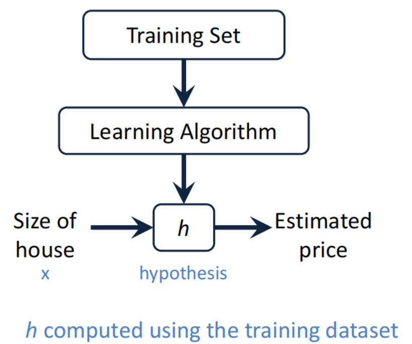
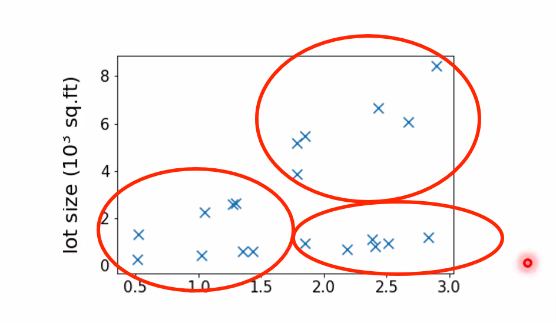

# Machine Learning

## About the Lecture

### Lecture Formate

- 5 lectures
- each week
- divided into 2 parts: 10 min break in between
- HW is due 5 days after the class
- TA will grade and TA can also provide you the correct/official solutions
- 50%: 5 HW
- 50%: project 
  - final presentation: about 5-6 mins per student
  - final report (7-10 pages)
- Vipul@cmu.edu
- finalized around week 3
- https://www.cs.cmu.edu/~goyal/MLhandouts/

### Chinese Version

- 每一次外教课后都有一份作业，总共五次左右，ddl为上课当日起算5日后（含当天），大家上交完作业后我会把答案发在群里，大家记得及时交作业。
- 作业通过微信发给我即可，注意命名格式homework1_yanyuchen（中文名拼音），格式为pdf，具体内容排版清晰即可，没有特定要求
- 课程分数：作业50%+project50%（包括pre和report）
- Project：可以个人也可以小组，选题可以自选也可以从教授给的列表中选（选题列表第三节教授课会发给大家，ps建议大家尽早自行选题）
- Final pre：每个人5-6mins
- Final report: pre结束后五日内上交，大概6-8页

- 教授邮箱Vipul@cmu.edu

## Introduction to Machine Learning

- Machine Learning is programming computers to optimize a performance criterion using example data or past experience
- Learning is used when:
  - Human expertise does not exist(navigating on Mars)
  - Humans are unable to explain their expertise(face recognition, speech recognition)
  - Solution changes in time(self-driving cars)

## Supervised Learning

### Regression

> - Housing Price Prediction
>   - Given: a dataset that contains m samples
>     $$
>       (x_{(1)}, y_{(1)}),...(x_{(m)}, y_{(m)})
>     $$
>   - **Task**: if a house has x square feet, predict its price?
>   

- If $y \in \R$ is continous variable,e.g., price prediction

- Notation:
  - **m** = Number of training examples
  - **x**'s = "input" variable(features)
  - **y**'s = "output" variable("target" variable)
  - $(x,y)$ - one training example
  - $(x^{(i)}, y^{(i)})$ - i-th training example

- Hypothesis
  - In machine learning, many times the goal is simply to compute a "**hypothesis**" denoted as *h*
  - This hypothesis h can take as input x(feature) and produce output y(target). That is $h(x) = y$
  

- Linear Regression
  - $h_{\theta}(x) = {\theta}_0 + {\theta}_1X$

#### Cost Function

- Hypothesis:
  - $h_{\theta}(x) = {\theta}_0 + {\theta}_1X$
- Parameters
  - ${\theta}_0, {\theta}_1$
> Cost Function (squared error function):  
> $$J({\theta}_0, {\theta}_1) = \frac{1}{2m} {\textstyle \sum_{i=1}^{m}}(h_{\theta}(x^{(i)}) - y^{(i)})^2 $$
- Goal: minimize $J({\theta}_0, {\theta}_1)$

- Why squares?
  - Negatives and positives don't cancel each other out
  - minimizes squared distance between training data and predicted line
  - Math works nicely

- Visualizing Cost Function  
  $$
    J({\theta}_0, {\theta}_1) = \frac{1}{2m} {\textstyle \sum_{i=1}^{m}}(h_{\theta}(x^{(i)}) - y^{(i)})^2 
  $$
  

- Simplified Cost Function
  - Hypothesis: $h_{\theta}(x) = {\theta}_1X$
  - Parameters: ${\theta}_1X$
  - 
  - Cost Functions:
    $$
      J({\theta}_1) = \frac{1}{2m} {\textstyle \sum_{i=1}^{m}}(h_{\theta}(x^{(i)}) - y^{(i)})^2
    $$
  - Goal: minimize $J({\theta}_1)$

- 2-Dimensional Cost Function  
  
  - Goal: Find $\theta _0$ and $\theta _1$ for which the cost function is minimized. Gradient Descent Algorithm!
  
#### Gradient Descent

### Classification

- The label y is a discrete variable

## Unsupervised Learning

- Dataset contains no labels: $x^{(1)}, ... x^{(m)}$
- Goal: to find interesting structures in the data

### Clustering

- Cocktail Party Problem
  - Many people talking at the same time  
  
  - The two speeches will be shifted in M1 and M2

## Reinforcement Learning

- can be regard as supervise learning

- The algorithm can collect data interactively  
  

- Credit Decisions
  - Applicant applies for credit
  - Our algorithm gets various pieces of data as input: income, housing status(rent/own), past payment history, education
  - Alogrithm Yes/No

- Automated Game Playing
  - Start with a strategy: win/lose
  - Refine algorithm, repeat

## Homework 1

1. Alice writes a program to play Chess. The program sees win/loss at the end and learns based on that. What type of learning does this represent?  (1 point)
2. The amount of snowfall in a given day is measured in inches. Alice designs a learning algorithm to predict the snowfall for the month of March. Is this a classification problem or a regression problem?  (2 point)
3. In class, normally we considered cost functions which are squares of the differences between y and h(x). Alice has a new idea: she will use cube of the differences instead. That is, the cost function will be the summation of $(h(x) - y)^3$ divided by 2m. Does this represent a good cost function?    (5 point)
4. Consider the house price prediction problem from the lecture. Consider the following table of training data. Here x is area in hundred sq feet and y is the price in hundreds of thousands of dollars.
  > x         y  
  > 1         2  
  > 2         3  
  > 4         6  
  > 5         7  
  1. Compute J(0, 1) for the above data set.  (2 points)
  2. Compute J(1, 1) for the above data set.  (2 points)
  3. Compute J(1, 1.1) for the above data set. (2 points)
  4. Based on the above, which of the three hypotheses would you choose for prediction and why?   (3 points)
