- [Note - Machine Learning and Statistics](#note---machine-learning-and-statistics)
  - [Lecture 1](#lecture-1)
    - [Precise \& accuracy](#precise--accuracy)
    - [Mean, standard deviation, standard error](#mean-standard-deviation-standard-error)
    - [Random errors, the normal distribution](#random-errors-the-normal-distribution)
    - [Reporting results, Confidence limits and error bars](#reporting-results-confidence-limits-and-error-bars)
    - [Poisson distribution](#poisson-distribution)
    - [Chauvenet's Criterion](#chauvenets-criterion)
    - [使用 Chauvenet's Criterion 的步骤：](#使用-chauvenets-criterion-的步骤)
  - [Lecture 2](#lecture-2)
    - [Error propagation](#error-propagation)
      - [Single-variable functions 单变量误差传播](#single-variable-functions-单变量误差传播)
        - [Functional approach](#functional-approach)
        - [Calculus-based approach](#calculus-based-approach)
      - [Multi-variable functions 多变量函数的误差传播](#multi-variable-functions-多变量函数的误差传播)
        - [Functional approach](#functional-approach-1)
    - [Least Squares Method 最小二乘法](#least-squares-method-最小二乘法)
      - [The importance of residuals 残差的重要性](#the-importance-of-residuals-残差的重要性)
      - [The goodness-of-fit parameter 拟合优度参数](#the-goodness-of-fit-parameter-拟合优度参数)
      - [Minimisation 最小化](#minimisation-最小化)
      - [non-uniform error bars](#non-uniform-error-bars)
  - [Lecture 3](#lecture-3)
    - [Least-squares fit to an arbitrary function](#least-squares-fit-to-an-arbitrary-function)
    - [Residuals for a least-squares fit to an arbitrary function](#residuals-for-a-least-squares-fit-to-an-arbitrary-function)
    - [Durbin-Watson statistic](#durbin-watson-statistic)
    - [Calculating the error in a least-squares-fit](#calculating-the-error-in-a-least-squares-fit)
      - [the error surface](#the-error-surface)
    - [Curvature matrix for straight line fit](#curvature-matrix-for-straight-line-fit)
    - [The $\\chi^2$ surface for an arbitrary function](#the-chi2-surface-for-an-arbitrary-function)
    - [How do fitting programs minimise?](#how-do-fitting-programs-minimise)
    - [Covariance(error) matrix and uncertainties in fit parameters](#covarianceerror-matrix-and-uncertainties-in-fit-parameters)
    - [Correlation between uncertainties of fit parameters](#correlation-between-uncertainties-of-fit-parameters)
  - [Lecture 4](#lecture-4)
    - [Null hypothesis](#null-hypothesis)
    - [Degrees of freedom](#degrees-of-freedom)
    - [The $\\chi^2$ probability distribution function](#the-chi2-probability-distribution-function)
    - [Using $\\chi^2$ as a hypothesis test](#using-chi2-as-a-hypothesis-test)
    - [The reduced $\\chi^2$ statistic](#the-reduced-chi2-statistic)
    - [Brief recap](#brief-recap)
    - [What makes a good fit?](#what-makes-a-good-fit)
    - [Testing distributions using $\\chi^2$](#testing-distributions-using-chi2)
    - [Anscombe's quartet](#anscombes-quartet)
    - [Benford's Law(aka the first digit law)](#benfords-lawaka-the-first-digit-law)
  - [Lecture 6](#lecture-6)
    - [Introduction](#introduction)
      - [Types of problems](#types-of-problems)
      - [Types of learning](#types-of-learning)
      - [Learning modes](#learning-modes)
      - [Instance based vs Model based](#instance-based-vs-model-based)
      - [Examples of model-based algorithms](#examples-of-model-based-algorithms)
      - [Examples of instance-based algorithms](#examples-of-instance-based-algorithms)
    - [Perceptron](#perceptron)
      - [Classification](#classification)
      - [Notation](#notation)
      - [Model](#model)
      - [Perceptron Algorithm](#perceptron-algorithm)
      - [Learning rate](#learning-rate)
      - [Convergence](#convergence)
      - [Problems with the perceptron algorithm](#problems-with-the-perceptron-algorithm)
    - [Logistic regression](#logistic-regression)
      - [Logistic regression](#logistic-regression-1)
      - [Logistic regression optimisation](#logistic-regression-optimisation)
      - [Gradient descent](#gradient-descent)
      - [Gradient descent for logistic regression](#gradient-descent-for-logistic-regression)
      - [Loss minimization](#loss-minimization)
      - [Normalising inputs](#normalising-inputs)
    - [Loss functions](#loss-functions)
      - [Gaussian noise](#gaussian-noise)
      - [Two class model](#two-class-model)
  - [Lecture 7](#lecture-7)
    - [Loss Functions](#loss-functions-1)
      - [Gaussian noise](#gaussian-noise-1)
      - [Two class model](#two-class-model-1)
      - [Perceptron loss](#perceptron-loss)
      - [Support vector machine](#support-vector-machine)
    - [ROC Curve](#roc-curve)
    - [Support vector machine](#support-vector-machine-1)
      - [Objective](#objective)
      - [Training a SVM](#training-a-svm)
    - [Learning Curves](#learning-curves)
      - [Testing the model](#testing-the-model)
      - [Learning Curve](#learning-curve)
    - [Non-Linear models](#non-linear-models)
      - [Transforming the features](#transforming-the-features)
      - [Adding polynomial features](#adding-polynomial-features)
      - [Higher order polynomial coefficients](#higher-order-polynomial-coefficients)
    - [Regularisation](#regularisation)
      - [1D regression example 1D](#1d-regression-example-1d)
      - [Traning/Validation/Test sets](#traningvalidationtest-sets)
      - [Cross validation](#cross-validation)
  - [Lecture 8](#lecture-8)
    - [Neural networks](#neural-networks)
      - [Non-linear activation functions](#non-linear-activation-functions)
      - [Network architectures](#network-architectures)
      - [Single layer network](#single-layer-network)
      - [Multi layer network](#multi-layer-network)
      - [Feedforward step](#feedforward-step)
      - [Last step](#last-step)
      - [Multi-class loss function](#multi-class-loss-function)
      - [Example](#example)
    - [Variance Bias Trade-off](#variance-bias-trade-off)
      - [Example](#example-1)
    - [Neural Network Traning](#neural-network-traning)
      - [Feedforward step](#feedforward-step-1)
      - [Training the neural network](#training-the-neural-network)
      - [Last layer](#last-layer)
      - [Layer error treatment](#layer-error-treatment)
      - [Initial weights](#initial-weights)
      - [Difficulties with network traning](#difficulties-with-network-traning)
      - [Regularisation](#regularisation-1)

# Note - Machine Learning and Statistics

## Lecture 1

### Precise & accuracy

- **Precise** measurement: the spread of results is "**small**"
- **Accurate** measurement: result is in agreement with "**accepted**" value

### Mean, standard deviation, standard error

- **Mean**: where is the measurement centred
    $$
        \overline{x} = \frac{1}{N}(x_1 + x_2 + \dots + x_n) = \frac{1}{N}\sum\limits^N_{i=1}x_i
    $$
- **Standard deviation**: width of the distribution
    $$
        \sigma_{n-1} = \sqrt{\frac{(d^2_1 + d^2_2 + \dots + d^2_N)}{N - 1}} = \sqrt{\frac{1}{N - 1}\sum\limits^N_{i=1}d^2_i}
    $$
    where $d_i = x_i - \overline{x}$
- **Standard error**: uncertainty in the location of the centre, $\alpha$
    $$
        \alpha = \frac{\sigma_{N-1}}{\sqrt{N}}
    $$
    We should quote our finding as $\overline{x} \plusmn \alpha$

> Consider an experiment with N number of data points collected:
> - the standard deviation is independent of N  
>   标准差不受样本量 𝑁 的影响, 因为它只关心数据的分散程度
> - the standard error improves with N  
>   标准误差随样本量 𝑁 的增加而减小, 意味着随着收集更多的数据, 均值估计会更加精确

### Random errors, the normal distribution

- **Gaussian or Normal Distribution**
    $$
        f(x) = \frac{1}{\sigma\sqrt{2\pi}}\exp[-\frac{(x-\overline{x})^2}{2\sigma^2}]
    $$
    > Facts: peak centred around mean, symmetric about mean,area under curve equals 1(normalised)

- The error in the error
    $$
        \alpha^{\plusmn} = \text{error in the error} = \frac{1}{\sqrt{2N-2}}
    $$

> Bigger sample size:
> - lower error in the error
> - more confidence
> - can quote more significant figures
>
> Need $N=50$ for the error to be known to 10%
> Need $N > 10k$ for the error to be known below 1%

### Reporting results, Confidence limits and error bars

- The five golden rules for reporting results
  1. The best estimate for a parameter is the mean
  2. The error is the standard error in the mean
  3. Round up the error to the appropriate number of significant figures
  4. Match the number of decimal places in the mean to the standard error
  5. Include units

- What is the probability of the data to lie within some multiple of $\sigma$?”
    - We need to evaluate the **error function** of the Gaussian distribution(G)
        $$
            Erf(x_1;\overline{x}, \sigma) = \int^{x_1}_{-\infty}G(x;\overline{x},\sigma)
        $$

        $$
           f(x) = \frac{1}{\sqrt{2\pi}} e^{-x^2 / 2}
        $$
        $$
            \text{CDF}(x) = \frac{1}{2} \left[ 1 + \text{erf}\left( \frac{x}{\sqrt{2}} \right) \right]
        $$
        $$
             P(-\sigma \leq X \leq \sigma) = \text{erf}\left( \frac{\sigma}{\sqrt{2}} \right)
        $$

- The standard deviation is thus used to define a **confidence level** on the data
- If your result and the accepted value differ by:
  - Up to 1 standard error it is in **excellent agreement**
  - Between 1 and 2: **reasonable agreement**
  - More than 3 standard errors: **disagreement**

### Poisson distribution

- The conditions under which a Poisson distribution holds are:
  - Events are rare
  - Events are independent
  - Tha average rate does not change with time
  $$
    P(N;\overline{N}) = \frac{\exp(-\overline{N})\overline{N}^N}{N!}
  $$
  > Mean = $\overline{N}$  
  > Standard deviation = $\sqrt{\overline{N}}$

### Chauvenet's Criterion 

**Chauvenet's Criterion** 是一种统计学方法, 用于检测和判断数据集中是否存在离群值(outliers)。离群值是指与其他数据点偏差较大的数据点。Chauvenet 的准则基于标准正态分布, 提供了一种方法来确定一个数据点是否与数据集的其他部分显著不同。

### 使用 Chauvenet's Criterion 的步骤：

1. **计算数据的均值(mean, $\mu$)和标准差(standard deviation, $\sigma$)**。

2. **计算每个数据点与均值的偏差**：使用以下公式计算每个数据点与均值的标准化差值(即 Z 值)：
   $$
   Z = \frac{|x_i - \mu|}{\sigma}
   $$
   其中 $x_i$ 是第 $i$ 个数据点, $\mu$ 是均值, $\sigma$ 是标准差。
   
3. **计算离群值的概率**：利用正态分布, Z 值代表的是数据点与均值的偏差程度。对于正态分布, 计算该数据点的累计概率。这个概率表示数据点在多大程度上可以被视为异常值。

4. **判断数据点是否为离群值**：根据数据点的数量 $N$, Chauvenet's Criterion 提供了一个门槛。如果一个数据点的概率低于：
   $$
   P = \frac{1}{2N}
   $$
   则该数据点可以被视为离群值并被拒绝(REJECT), 否则接受(ACCEPT)。

## Lecture 2

### Error propagation

**Objective**:
1. Understanding how to propagate the error is **a vital part of data analysis and reduction**.  
    了解如何传播错误是**数据分析和减少错误的重要部分**。
2. Understanding which factors contribute to the limiting error is **a vital part of experimental design**.  
    了解哪些因素导致了限制误差是**实验设计的重要部分**。

$$
    \alpha_\text{speed} \neq \alpha_\text{distance} + \alpha_{time}
$$
$$
    \alpha_\text{speed} \approx \text{speed}\sqrt{(\frac{\alpha_d}{d})^2 + (\frac{\alpha_t}{t})^2}
$$

#### Single-variable functions 单变量误差传播

##### Functional approach
$$
    \overline{Z} \plusmn \alpha_Z = f(\overline{A} + \alpha_A) \\
    \overline{Z} = f(\overline{A}) \\
    \overline{Z} \mp \alpha_Z = f(\overline{A} - \alpha_A)
$$

- Valid for every single-varible function
    $$
        \alpha_Z = |f(\overline{A} + \alpha_A) - f(\overline{A})|
    $$

##### Calculus-based approach

For $Z = f(A)$:

$$
    P = (\overline{A}, f(A))\\
    Q = (\overline{A} + \alpha_A, f(\overline{A}))\\
    R = (\overline{A} + \alpha_A, f(\overline{A}) + \frac{df}{dA} \times \alpha_A)\\
    S = (\overline{A} + \alpha_A, f(\overline{A} + \alpha_A))\\
    f(\overline{A}) + \frac{df(A)}{dA}\alpha_A = f(\overline{A} + \alpha_A)
$$

$$
    \alpha_Z = |\frac{dZ}{dA}|\alpha_A
$$

#### Multi-variable functions 多变量函数的误差传播

##### Functional approach

Consider a function of two variables, $Z = f(A, B)$
The error of Z has 2 components:
- Change in Z when A is varied and B is constant  
  $$
    \alpha^A_Z = f(\overline{A} + \alpha_A, \overline{B}) - f(\overline{A}, \overline{B})
  $$
- Change in Z when B is varied and A is constant 
  $$
    \alpha^B_Z = f(\overline{A}, \overline{B} + \alpha_B) - f(\overline{A}, \overline{B})
  $$

The total error on Z is obtained via Pythagoras, adding in quadrature:
$$
    (\alpha_Z)^2 = (\alpha^A_Z)^2 + (\alpha^B_Z)^2 + (\alpha^C_Z)^2 + ...
$$

> $$
>     (\alpha Z)^2 = 
>   \left[ f(\bar{A} + \alpha_A, \bar{B}, \bar{C}, \dots) - f(\bar{A}, \bar{B}, \bar{C}, \dots) \right]^2 \\
>   + \left[ f(\bar{A}, \bar{\bar{B}} + \alpha_B, \bar{C}, \dots) - f(\bar{A}, \bar{B}, \bar{C}, \dots) \right]^2 \\
>   + \left[ f(\bar{A}, \bar{B}, \bar{C} + \alpha_C, \dots) - f(\bar{A}, \bar{B}, \bar{C}, \dots) \right]^2 \\
>   + \dots
> $$

- Calculus approximation
$$
    (\alpha_Z)^2 = (\frac{\partial Z}{\partial A})^2(\alpha_A)^2 + (\frac{\partial Z}{\partial B})^2(\alpha_B)^2 + (\frac{\partial Z}{\partial C})^2(\alpha_C)^2 + ...
$$

### Least Squares Method 最小二乘法

#### The importance of residuals 残差的重要性

残差=实际值−模型预测值
$$
    R_i = y_i - y(x_i)
$$
> 最佳拟合直线应该使所有残差尽可能小。

#### The goodness-of-fit parameter 拟合优度参数

Determining the optimal values of parameters for a function is called **regression analysis**.  
确定函数参数的最优值称为回归分析。

The **best-fit straight line** is the one that is close to as many data points as possible -> residuals will be small  
**最佳拟合直线**是尽可能接近更多数据点的直线 -> 残差会很小

This is quantified by the **goodness-of-fit parameter**, $X^2$:
- When $X^2$ is minimised, the probability that we obtain our original set of measurements from the best-fit straight line, is maximised.  
    当 $X^2$ 最小化时，我们从最佳拟合直线获得原始测量值集合的概率最大化。
$$
    X^2 = \sum\limits_i\frac{(y_i - y(x_i))^2}{\alpha^2_i}
$$

> What we have just done is called **method of least squares** (= minimising the sum of the squares of the residuals)  
> 我们刚刚做的叫做最小二乘法（=最小化残差平方和）  
> In the case of the straight line, the best values of slope and intercept are those that minimise the summed differences squared  
> 对于直线，斜率和截距的最佳值是最小化平方和的值  
> This is derived from what is called **maximum likelihood** together with the **central limit theorem** (assumption: the parent distribution from which we draw the yi values is Gaussian width width given by the standard error, ⍺i)  
> 这是从所谓的最大似然和中心极限定理中得出的（假设：我们从中得出 yi 值的父分布是高斯宽度，由标准误差 ⍺i 给出）
> The y-coordinate we get from the best-fit line equation is the **most probable** value of the parent distribution  
> 我们从最佳拟合线方程中得到的 y 坐标是父分布的最可能值  
> The probability of obtaining our measurement values from the best-fit line is maximised when χ2 is minimised  
> 当 χ2 最小化时，从最佳拟合线获得测量值的概率最大化

- $X^2$ for data with Poisson errors
$$
    X^2 = \sum\limits_i\frac{(O_i-E_i)^2}{E_i}
$$

> i: number of counts(bins)  
> $O_i$: observed number of occurrences(in the i-th bin)  
> $E_j$: expected number of occurrences(in the i-th bin)

> If we have a goot fit, $\alpha_i = \sqrt{E_i} \approx \sqrt{O_i}$

#### Minimisation 最小化

The best values for **slope** and **intercept** are those that minimise the squares of the differences summed for all data points  
斜率和截距的最佳值是最小化所有数据点之差的平方和

$$
    S = \sum\limits_i(y_i - y(x_i))^2 = \sum\limits_i R^2_i\\
    S = \sum\limits_i(y_i - mx_i - c)^2 
$$

$$
    \frac{\partial S}{\partial m} = -2\sum_i(x_i[y_i - mx_i - c]) = 0\\
    \frac{\partial S}{\partial c} = -2\sum_i(y_i - mx_i - c) = 0
$$

$S$ is a minimum when $\frac{\partial S}{\partial m} = \frac{\partial S}{\partial c} = 0$

The required values of the slope (m) and the intercept (c) are obtained from the two simultaneous equations  
斜率 (m) 和截距 (c) 的所需值可通过两个联立方程得出

$$
    m\sum_i x^2_i + c\sum_i x_i = \sum_i x_i y_i
$$
$$
    m\sum_i x_i + cN = \sum_i y_i
$$

- The solutions for gradient, intercept, and their uncertainties reduce to simple analytic expressions  
截距 𝑐 的公式
$$
    c = \frac{\sum_ix^2_i\sum_iy_i - \sum_ix_i\sum_ix_iy_i}{\Delta}, \alpha_c = \alpha_{CU}\sqrt{\frac{\sum_ix^2_i}{\Delta}}
$$

斜率 𝑚 的公式：
$$
    m = \frac{N\sum_ix_iy_i - \sum_ix_i\sum_iy_i}{\Delta}, \alpha_m = \alpha_{CU}\sqrt{\frac{N}{\Delta}}
$$

> 共同不确定性:    
> Common uncertainty: $\alpha_{CU} = \sqrt{\frac{1}{N - 2}\sum_i(y_i - mx_i - c)^2}$

总不确定性参数 Δ 
$$
\Delta = N\sum_ix^2_i - (\sum_i x_i)^2
$$

#### non-uniform error bars

Need to perform a **weighted** least-squares fit to take them into account  
需要执行**加权**最小二乘法才能将它们考虑在内
$$
    R_i = \frac{y_i - y(x_i)}{\alpha_i}
$$
The sum of the squares of the normalised residuals is called $X^2$

This is now a weighted fit, and we need to take this into account in the analytic expressions for $m, c, \alpha_c$, with $w_i = \alpha^{-2}_i$

> Points with small errors are more important!

## Lecture 3

### Least-squares fit to an arbitrary function

- Arbitrary non-linear function with N parameters
  $$
    y(x) = f(x; a_1, a_2, ..., a_N)
  $$
- Procedure:
  1. for each value of the independent variable, $x_i$, calculate $y(x_i)$ using an estimated set of values for the parameters
  2. for each value of the independent variables, calculate the square of the normalised residual, $[^{(y_i-y(x_i))}/_{\alpha i}]^2$
  3. calculate $\chi^2$(sum the square of the normalised residuals)
  4. minimise $\chi^2$ by optimising the fit parameters

### Residuals for a least-squares fit to an arbitrary function

- Voltage across an inductor as a function of time - $V(t; a_1, a_2, ..., a_N)$ is a non-linear function
  - $V(t;V_{bat}, V_0, T, \phi, \tau)$
  - Use model and reasonable estimates of parameters to calculate values of the voltage for a range of times
  - Calculate $\chi^2$
  - Minimise $\chi^2$ by varying all 5 parameters to give best fit

$$
    V(t) = V_{bgt} + V_0\cos(2\pi\frac{t}{T}+\phi)\exp(\frac{-t}{\tau})
$$

Data and weighted least-squares-fit for X-ray diffraction of copper

- Fit data with a double-peak model:  
  
  - residuals randomly distributed -> good fit
- Fit data with a single-peak model:  
  
  - residuals show structure -> bad fit

- To better visualise structure in residuals: make a lag plot -> normalised residuals $R_i$ vs lagged residuals $R_{i-k}$(k is usually 1)
- Good fit  
  
  - Random parttern
  - at least 91% of data points in a 2D box of $\pm2$ limits
- Bad fit:  
  
  - non-random pattern
  - < 91% of data points in a 2D box of $\pm2$ limits

### Durbin-Watson statistic

The degree of correlation in the lag plot can be reduced to a single numerical value by evaluating the **Durbin-Waston statistic, D**

$$
    D = \frac{\sum\limits^N_{i=2}[R_i - R_{i-1}]^2}{\sum\limits^2_{i=1}[R_i]^2}
$$
> What does it mean?
> - 0 < D < 4
> - D = 0: systematically correlated residuals
> - D = 2: randomly distributed residuals with Gaussian distribution
> - D = 4: systematically anticorrelated residuals

### Calculating the error in a least-squares-fit

#### the error surface

- Remember how $\chi^2$ evolved with the gradient m of a straight line?
- More generic:
  - Function is more complex
  - Non-uniform error bars
  - Goodness-of-fit remains $\chi^2$, but now it evolves over **surface** defined by the fit parameters

- Shape of error surface is important:
  - Many(few) contours on axis of a parameter = high(low) sensitivity of fit to that parameter
  - Tilted ellipses $\rarr$ correlation between uncertainties of parameter
  - No tilt $\rarr$ no correlation between $\alpha_A, \alpha_B$

- Investigate shape of error surface via Taylor expansion of $\chi^2$
- Taylor expansion: behavior in close vicinty to a value
  $$
    f(x, a + \Delta a) = f(x, a) + \Delta a\frac{\partial f}{\partial a} + \frac{1}{2}\frac{\partial^2 f}{\partial a^2}(\Delta a)^2 + \dots
  $$
  $$
    \chi^2(\overline{a}_j + \Delta a_j) = \chi^2(\overline{a}_j) + \frac{1}{2}\frac{\partial^2\chi^2}{\partial a^2_j}
  $$

If $\Delta a_j$ (the deviation from the best-fit value) is similar to uncertainty
$$
    \chi^2 \rarr \chi^2_{\min} + 1
$$
$\chi^2$ increases by 1  
This effectively corresponds to the $1\sigma$ contour

Can now express the standard error in terms of the curvature of the error surface
$$
    \alpha_j = \sqrt{\frac{2}{(\frac{\partial^2\chi^2}{\partial a^2_j})}}
$$

### Curvature matrix for straight line fit

- Let's stay with straight line fit and introduce the concept of curvature matrix
- We will see later that the uncertainties for N fit parameters can be calculated from the inverse of the curvature matrix, i.e. the error matrix 
- For a straight line fit, the $\chi^2$ surface is perfectly parabolic with respect to both variabels, such that:
  - There is only 1 minimum
  - Finding the minimum is easy
  - The curvature matrix has analytic results that let you calculate errors easily$A=\begin{bmatrix}A_{cc}&&A_{cm}\\A_{mc}&&A_{mm}\end{bmatrix}$
    $$
        A_{cc}=\sum_{i}\frac{1}{\alpha_{i}^{2}}\quad A_{cm}=A_{mc}=\sum_{i}\frac{x_{i}}{\alpha_{i}^{2}}\quad  A_{mm}=\sum_{i}\frac{x_{i}^{2}}{\alpha_{i}^{2}}
    $$

### The $\chi^2$ surface for an arbitrary function

Arbitrary function: the $\chi^2$ surface can be very complicated!
- Multiple local minima
- Need an initial guess for the best-fit parameters(to avoid being trapped in a local minimum)
- The $\Delta \chi^2$ contours can be asymmetric(might not be able limits)
- The elements of the curvature matrix might not have analytic results $\rarr$ need numerical techniques to calculate them

- Newton-Raphson
- Technique that numerically solves $f(x) = 0$
  1. First (approximate) solution is $x_1$
  2. Let $f(x)$ crosses zero at $x_1 + h, f(x_1 + h) = 0$
  3. If h is small, can use Taylor expansion to find second approximation for zero crossing point $x_2$, $x_2 = x_1 - \frac{f(x_1)}{f'(x_1)}$
  4. Repeat this to get successively closer approximation,
    $$
        x_{s+1} = x_s - \frac{f(x_s)}{f'(x_s)}
    $$
  5. Procedure ends when the zero-crossing point is found(within given tolerance)

- Grid search
- The goodness-of-fit parameter is minimized by changing each parameter in turn, based on input step sizes
  1. Gradient is keptt the same, intercept is increased. If $\chi^2$ increases, the direction of motion across surface is reversed
  2. Parameters are changed in turn until convergence  
  Inefficient method, because parameters are changed sequentially

### How do fitting programs minimise?

Iterative approaches

- Gradient descent
  - Change all parameters simultaneously, with vector directed towards minimum
    1. Vector $\triangledown \chi^2$ is along direction along which $\chi^2$ varies most rapidly
    2. Take steps along this steepest descent util convergence, with the gradient being
        $$
            \left(\nabla\chi^{2}\right)_{j}=\frac{\partial\chi^{2}}{\partial a_{j}}\approx\frac{\chi^{2}\left(a_{j}+\delta a_{j}\right)-\chi^{2}\left(a_{j}\right)}{\delta a_{j}}
        $$
    3. Update rule: $a_{s+1}=a_{s}-B \nabla\chi^{2} (a_{s})$
        > B is scaling factor

- Second-order expansion
  - An excellent approximation of the local minimum is a second-order expansion in the parameters about the minimum, i.e. perform a Taylor expansion of $\chi^2$ about the set of parameters $a_s$
    $$
        \chi^{2}\left(\mathrm{a}_{s}+\mathrm{h}\right)\approx\chi^{2}\left(\mathrm{a}_{s}\right)+\mathrm{g}_{s}^{\mathrm{T}}\mathrm{h}+\frac{1}{2}\mathrm{h}^{\mathrm{T}}\mathrm{H}_{s}\mathrm{h}
    $$
    $$
        \mathfrak{g}_s=\nabla\chi^2\left(\mathfrak{a}_s\right)=\left[\frac{\partial\chi^2}{\partial a_1},\cdots,\frac{\partial\chi^2}{\partial a_{\mathcal{N}}}\right]^\mathrm{T}
    $$

- Marquardt-Levenburg method
- Combines best features of gradient and expansion approaches
  - Uses method of steepest descent to progress towards minimum when initial guess was far from optimum value
  - Smooth transition to expansion method when goodness-of-fit parameter reduces, and surface becomes parabolic(no multiple local minima)
  $$
    \mathrm{a}_{s+1}=\mathrm{a}_{s}-\left(\mathrm{H}_{s}+\lambda\mathrm{diag}\left[\mathrm{H}_{s}\right]\right)^{-\mathrm{1}}\mathrm{g}_{s}
  $$

### Covariance(error) matrix and uncertainties in fit parameters

- Simply: the curvature matrix, A, is one half of the Hessian matrix
  - It is also an NxN matrix
  - It has components $A_{jk} = \frac{1}{2}\frac{\partial x^2}{\partial a_j \partial a_k}$
  - Off-diagonal terms are related to degree of correlation of parameter uncertainties(they describe the curvature of the surface, remember!)

- Inverse of curvature matrix = covariance(error) matrix
  $$
    [C] = [A]^{-1}
  $$
  And finally: the uncertainty $a_j$ of the parameter $a_i$ is $\alpha_j = \sqrt{C_{jj}}$, so $a_j + a_j = a_j \pm \sqrt{C_{jj}}$

### Correlation between uncertainties of fit parameters

- The off-diagonal elements of the covariance matrix are the correlation coefficients
- It's easier to use a dimensionless measure for the correlation matrix:
  - Diagonal elements are all 1
  - Correlation coefficients $\rho_{AB} = \frac{c_{AB}}{\sqrt{c_{AA}c_{BB}}}$
    $$
        -1 \leq \rho \leq 1 \\
        \text{0 when A, B uncorrelated}
    $$

- What is the voltage and its error for $f = 75Hz$?
  - Without correlation: $\alpha_{V}^{2}=f^{2}\alpha_{m}^{2} + \alpha_{c}^{2}=f^{2}C_{22}+C_{11}$
  - With correlation: $\alpha_{V}^{2}=f^{2}C_{22}+C_{11}+2fC_{12}$
    
## Lecture 4

### Null hypothesis

Null hypothesis: "My data can be described by a Gaussian"

Hypothesis testing: "What is the probability that my data is described by a Gaussian, like I thought?"

Testing the quality of a fit = Testing the null hypothesis

A common statistic used to test the null hypothesis is the $\chi^2$ statistic, out old friend

### Degrees of freedom

I f we have measured N independent data points and we are fitting a model with $N$ parameters,

then the number of degrees of freedom, $v$, is defined as
$$
  v = N - N
$$
= number of independent pieces of information used to estimate a parameter

The last deviation is not free, it is set by the previous ones such that their sum equals 0. To calculate the standard deviation, we thus have one less free variabels.
$v = 3 - 1 = 2$

So what is better: to have many df? Or to have just a few df?

Complex situation might require assumptions to make the problem easier, which reduces the df.

In data analysis:  
The more data points that are unconstrained, the more robust a statistical estimate of parameters such as the mean, variance and $\chi^2$ become

$$
  v = N - N
$$

Each parameter of a parent distribution estimated from a sample distribution ($v_i$) reduces the $df(v)$ by 1

### The $\chi^2$ probability distribution function

$\chi^2$ is a random variable(it depends on a variety of input parameters, e.g., the input data, the chosen model, the uncertainties, etc)  
-> it has a normalised probability distribution function(PDF)
$$
  X(\chi^2; v) = \frac{(\chi^2)^{(\frac{v}{2}-1)}\exp[-\chi^2 / 2]}{2^{v/2}\Gamma(v/2)}
$$

Facts:
- $X(\chi^2, v)$ is asymmetric(median $\neq$ mode)
- It has a mean(expectation value) of $v$, and a standard deviation, $\sigma_{\chi^2} = \sqrt{2v}$
- P of obtaining a value of $\chi^2$ between $\chi^2_{min}$ and $\infin$ is the cumulative probability function
  $$
    P\left(\chi_{\min}^2\leq\chi^2\leq\infty;v\right)=\int\limits_{\chi_{\min}^2}^\infty X\left(\chi^2;v\right) \mathrm{d}\chi^2
  $$

### Using $\chi^2$ as a hypothesis test

 

Expectation if the proposed model is in good agreement with data: $\chi^2_{min}$ is close to the mean of the $\chi^2$ distribution

For many $v$, distribution is more symmetric -> mean, median, mode similar, $P(\chi_{min}^{2}\approx\nu;\nu)\approx0.5$

If $\chi^2_{\min} \gg v$ $\rarr$ probability is small
- is null hypothesis wrong?
- are uncertainties incorrect?

If $\chi^2_{\min} < v$ $\rarr$ probability tends towards 1
- Not an indication of improved fit
- Likely, uncertainties are overestimated, which results in unrealistically small $\chi^2$ values

> - For a reasonable fit, the value of $P(\chi^2_{\text{min}}; \nu) \approx 0.5$.
> - If $P(\chi^2_{\text{min}}; \nu) \rightarrow 1$, check your calculations for the uncertainties in the measurements, $\alpha_i$.
> - The null hypothesis is generally **not rejected** if the value of $\chi^2_{\text{min}}$ is within $\pm2\sigma$ of the mean, $\nu$, i.e., in the range
>   $$
>   \nu - 2\sqrt{2\nu} \leq \chi^2_{\text{min}} \leq \nu + 2\sqrt{2\nu}.
>   $$
> - The null hypothesis is **questioned** if $P(\chi^2_{\text{min}}; \nu) \approx 10^{-3}$ or $P(\chi^2_{\text{min}}; \nu) > 0.5$.
> - The null hypothesis is **rejected** if $P(\chi^2_{\text{min}}; \nu) < 10^{-4}$.

### The reduced $\chi^2$ statistic

There's a fast way of telling if a null hypothesis should be rejected: reduced $\chi^2$
$$
  \chi^2_v = \chi^2_{\min} / v
$$

> - For a reasonable fit, the value of $\chi^2_{\nu} \approx 1$.
> - If $\chi^2_{\nu} \ll 1$, check your calculations for the uncertainties in the measurements, $\alpha_i$.
> - The null hypothesis is **questioned** if $\chi^2_{\nu} > 2$ for $\nu \approx 10$.
> - The null hypothesis is **questioned** if $\chi^2_{\nu} > 1.5$ if $\nu$ is in the approximate range $50 \leq \nu \leq 100$.

### Brief recap

- **Null hypothesis** = sample distribution is well modeled by the proposed parent distribution ("my model describes the data well")

- **$\chi^2$ test**: find the value of $\chi^2_{\text{min}}$, then determine the number of degrees of freedom (df)

- Two numbers to test the validity of the null hypothesis:
  1. Reduced $\chi^2$
  2. Probability $P$ of obtaining $\chi^2_{\text{min}}$ ≥ to fit value given $\nu$

- Reject the null hypothesis if $\chi^2_{\nu} > 3$

**Null hypothesis rejected: what should I do?**
- A) Try different models
- B) Gather more data
- C) Do more analysis, e.g., look at residuals

### What makes a good fit?

- Two-thirds of the data points should be within one standard error of the theoretical model.
- $\chi^2_{\nu} \approx 1$.
- $P(\chi^2_{\text{min}}; \nu) \approx 0.5$.
- A visual inspection of the residuals shows no structure.
- A test of the autocorrelation of the normalized residuals yields $D \approx 2$.
- The histogram of the normalized residuals should be Gaussian, centered on zero, with a standard deviation of 1.

### Testing distributions using $\chi^2$

### Anscombe's quartet

4 data sets:
- Described by same statistic
- Very different distributions
- Illustrate the danger of not inspecting your plots

### Benford's Law(aka the first digit law)

The "first digit phenomenon" can be described by the following probability:

$$
P(d) = \log_{10}\left(1 + \frac{1}{d}\right)
$$

"In many real-life numerical sets of data, the leading digit is likely to be small" (wiki).

- 1 appears about 30% of the time.
- 9 occurs about 5% of the time.
- Works best if data spans many orders of magnitude.

-----
-----
-----

## Lecture 6

### Introduction

Machine learning algorithms can be classfied according to
- the type of problems they solve
- the model they use
- the way they learn

#### Types of problems
- classification
  - output of the model is a discrete set of categories
- regression
  - output of the model is a continous variable

The boundary between the two types can be blured
- when the categories have a ordering we can use regression and bin the result into categories
- for classification we can fit a function for the probability of belonging to one class

#### Types of learning

- supervised learning
  - we have a training set with labelled examples
- unsupervised learning
  - no labelled example
  - model has to find features
  - can be used as a first step before supervised learning
  - dimensionality reduction
    - many features
    - need to find the most relevant ones as input to supervised learning model

#### Learning modes

- Batch learning
  - The entire training set is used for each iteration of the model optimisation
- online learning
  - The model is updated for each new training example
- mini-batch
  - The model is optimised for subsets of the training set

#### Instance based vs Model based

- instance based
  - uses examples to learn
  - need "similarity" measure to compare new data to training data
- model based
  - we use a model to quantify the relationship between the data
  - the data fixes the parameters of the model

#### Examples of model-based algorithms

- linear models
  - perceptron
  - logistic regression
  - SVM(support vector machine)
  - ...
- non-linear models
  - polynomial features
  - neural networks
  - ...

#### Examples of instance-based algorithms

- k-neighbour
- SVM with RBF kernel
- ...

### Perceptron

#### Classification

We have a set of examples of items from two classes. We want to train a model to distinguish between the two classes for new items.

#### Notation

Traning data is composed of $n_d$ samples, each of which has $n_f$ features. Each data sample's class label is encoded as $\pm 1$

feature: $x^{(i)}_j$, $1 \leq i \leq n_d$, $1 \leq j \leq n_f$

labels: $y^{(i)} = \pm 1$, $1 \leq i \leq n_d$

#### Model

We will tran a linear model
$$
  z(x, w) = w_0 + \sum_j x_jw_j
$$
with $n_f + 1$ parameters
$$
  w_j, 0 \leq j \leq n_f
$$
We will use the decision funtion
$$
  \phi(z) = sgn(z)
$$
If $\phi(z) = + 1$ our model predicts the object to belong the first class, if $\phi(z) = -1$ the model predicts that the object belongs to the second class.

Now we need to set the parameters $w_j$ such that our prediction is as accurate as possible

#### Perceptron Algorithm

Go through all the training data set and for each sample:
- calculate the prediction of the model with the current parameter
- If the prediction for $x^{(i)}$ is correct
  - move to the next sample
- If the prediction for $x^{(i)}$ is incorrect
  - adjust the parameter according to 
    $$
      w_j \rarr w_j + \eta y^{(i)}x^{(i)_j}, 1 \leq j \leq n_f
    $$
    $$
      w_0 \rarr w_0 + \eta y^{(i)}
    $$
  - move to the next sample

Repeat the procedure until no more examples are wrongly predicted(or until a small enough amount fails)

Each repeat is called an epoch

Some references give the perceptron algorithm with a fixed value of $\eta$

It is convenient to add a 1 as the 0-the component of the data vector $x$
$$
  \vec{x} = 1,x_1,...,x_{n_f}
$$
so that the linear model can be written as
$$
  z(x,w) = \vec{x} · \vec{w}
$$
This allows to write the update rule for the preceptron algorithm as
$$
  \vec{w} \rarr \vec{w} + \eta y^{(i)} \vec{x}^{(i)}
$$

#### Learning rate

The parameter $\eta$ in the update rule
$$
  w_j \rarr w_j + \eta y^{(i)}x^{(i)}_j, 1 \leq j \leq n_f
$$
$$
  w_0 \rarr w_0 + \eta y^{(i)}
$$
is a parameter of the algorithm, not a parameter of the model or of the problem. It is an example or hyperparameter of a learning algorithm.

The learning rate set how much a single misclassification should affect our parameters
- a too large learning rate will lead to the parameters "jumping" around their best values and give slow convergence
- a too small learning rate will make more continuous updates but it might take many epochs to get to the right values

#### Convergence

- The perceptron algorithm is converging if the classes are linearly separable in the training set
- It might take a long time to converge
  - Linearly separable
  - Separable, but not linearly
  - Probably not separable

#### Problems with the perceptron algorithm

- convergence depends on order of data
  - random shuffles
- bad generalisation

Bad generalisation

The algorithms stops when there is no errors left but often the demarcation line ends up very close to some of the instances, which leads to bad generalisation

### Logistic regression

The problems we had with the perceptron were:
- only converged for linearly separable problems
- stopped places that did not look like they would generalise well

We need an algorithm that takes a more balanced approach:
- finds a "middle ground" decision boundary
- can make decisions even when the data is not separable

#### Logistic regression

- for binary classification for positive(y=1) vs negative(y=0) class
- for a probability p to belong to the positive class, the odds ratio is given by
  $$
    r = \frac{p}{1-p}
  $$
- if $r > 1$ we are more likely to be in the positive class
- if $r < 1$ we are more likely to be in the negative class
- to make it more symmetric we consider the log of
- use a linear model for $z = \log (r)$
  $$
    z = w_0 + \sum_j x_j w_j = w_0 + (x_1, ..., x_D)·(w_1, ..., w_D)
  $$
If we set $x_0 = 1$ we can write this as
$$
  z=\sum_{j=0}^{n_f}x_jw_j=(x_0,x_1,\ldots,x_D)\cdot(\omega_0,\omega_1,\ldots,\omega_D)
$$

We can invert to obtain probability as a function of z
$$
  p=\frac1{1+e^{-z}}\equiv\phi(z)
$$

#### Logistic regression optimisation

- the typicall loss function optimised for logistic regression is 
  $$
    J=-\sum_iy^{(i)}\log\left(\phi(z^{(i)})+(1-y^{(i)})\log\left(1-\phi(z^{(i)}\right)\right.
  $$
- only one of the log terms is activated per training data point
  - if $y^{(i)} = 0$ the loss has a term $\log(1 - \phi(z^{(i)}))$
    - the contribution to the loss is small if $z^{(i)}$ is negative(assigned correctly)
    - the contribution to the loss is large if $z^{(i)}$ is positive(assigned incorrectly)
  - if $y^{(i)} = 1$ the loss has a term $\log(\phi(z^{(i)}))$
    - the contribution to the loss is large if $z^{(i)}$ is negative(assigned incorrectly)
    - the contribution to the loss is large if $z^{(i)}$ is positive(assigned correctly)

#### Gradient descent

To optimize the parameters $w$ in the logistic regression fit to the log of the probability we calculate the gradient of the loss function $J$ and go in opposite direction
$$
  w_j \rarr w_j - \eta\frac{\partial J}{\partial w_j}
$$
$\eta$ is the learning rate, it sets the speed at which the parameters are adapted

It has to be set empirically

1. Finding a suitable $\eta$ is not always easy
2. A too small learning rate leads to slow convergence
3. Too large learning rate might spoill convergence altogether

#### Gradient descent for logistic regression

$$
  \begin{aligned}
&\frac{\partial\phi(z)}{\partial z}=-\frac1{(1+e^{-z})^2}(-e^{-z})=\phi(z)\frac{e^{-z}}{1+e^{-z}}=\phi(z)(1-\phi(z)) \\
&\frac{\partial\phi}{\partial w_j}=\frac{\partial\phi(z)}{\partial z}\frac{\partial z}{\partial w_j}=\phi(z)(1-\phi(z))x_j \\
&\frac{\partial J}{\partial w_j} =-\sum_iy_i\frac1{\phi(z_i)}\frac{\partial\phi}{\partial w_j}-(1-y_i)\frac1{1-\phi(z_i)}\frac{\partial\phi}{\partial w_j} && \text{(1)} \\
&=-\sum_iy_i(1-\phi(z_i))x_j^{(i)}-(1-y_i)\phi(z_i)x_j^{(i)}&& \text{(2)} \\
&=-\sum_i(y_i-\phi(z_i))x_j^{(i)}&& \left(3\right) 
\end{aligned}
$$
where $i$ runs over all data sample, $1 \leq i \leq n_d$ and j runs from 0 to $n_f$

#### Loss minimization

Algorithms:
- gradient descent method
- Newton method: second order method Training
- use all the training data to compute gradient
- use only part of the training data: Stochastic gradient descent

#### Normalising inputs

It is often important to normalise the features. We want the argument of the sigmoid function to be of order one
- Too large or too small values push the problem into the "flat" parts of the function
- gradient is small
- convergence is slow

It is useful to normalise features such that their mean is 0 and their variance is 1

### Loss functions

Loss functions are used to quantify how well or bad a model can reproduce the values of the training set.

The appropriate loss function depends on the type of problems and the algorithm we use.

Let's denote with $\hat{y}$ the prediction of the model and y the true value.

#### Gaussian noise

Let's assume that the relationship between the features $X$ and the label $Y$ is given by
$$
  Y=\hat{y}(X)+\epsilon 
$$
where $\hat{y}$ is the model whose parameters we want to fix and $\epsilon$ is some random noise with zero mean and variance $\sigma$

The likelihood to measure $y$ for feature value $x$ is given by
$$
L\sim\exp\biggl(-\frac{(y-\hat{y}(x))^2}{2\sigma}\biggr)
$$

If we have a set of examples $x^{(i)}$ the likelihood becomes
$$
  L\sim\prod_i\exp\left(-\frac{(y^{(i)}-\hat{y}(x^{(i)}))^2}{2\sigma}\right)
$$

We now want to fix the parameters in $\hat{y}$ such that we maximize the likelihood that our data was generated by the model

It is more convenient to work with the log of the likelihood. Maximizing the likelihood is equivalent to minimising the negative log-likelihood

$$
  NLL=-\log(L)=\frac1{2\sigma}\sum_i\left(y^{(i)}-\hat{y}(x^{(i)})\right)^2
$$

So assuming gaussian noise for the difference bewteen the model and the data leads to the least square rule

We can use the square error loss
$$
  J(\hat{y}) = \sum_i(y^{(i)}-\hat{y}(x^{(i)}))^2
$$
To train our machine learning algorithm

#### Two class model

If we have two classes, we call one the positive class(c = 1) and the other the negative lass(c = 0), if the probability to belong to class 1
$$
  p(c = 1) = p
$$
We also have
$$
  p(c = 0) = 1 - p
$$
The likelihood for a single measurement if the outcome is in the positive class is p and if the outcome is in the negative class the likelihood is $1 - p$. For a set of measurements with outcomes $y_i$ the likelihood is given by
$$
  L=\prod_{y_i=1}p\prod_{y_i=0}(1-p)
$$

So the negative log-likelihood is:
$$
  NLL=-\sum_{y_i=1}\log(p)-\sum\log(1-p)
$$
Given that y = 0$ or $y = 1$ we can rewrite it as
$$
  NLL=-\sum\left(y\log(p)+(1-y)\log(1-p)\right)
$$

So if we have a model for the probability $\hat{y} = p(X)$ we can maximize the likelihood of the training data by optimizating
$$
  J=-\sum_iy_i\log(\hat y)+(1-y_i)\log(1-\hat y)
$$
It is called the cross entropy

## Lecture 7

### Loss Functions

Loss functions are used to quantify how well or bad a model can reproduce the values of the training set.  
损失函数用于量化模型能够多好或多坏地复制训练集数值。

The appropriate loss function depends on the type of problems and the algorithm we use.  
适当的损失函数取决于我们使用的问题类型和算法。

Let’s denote with $\hat{y}$ the prediction of the model and $y$ the true value    
我们用 $\hat{y}$ 表示模型的预测值，用 $y$ 表示真实值

#### Gaussian noise

Let’s assume that the relationship between the features X and the label Y is given by
$$
  Y = f(X) + \epsilon
$$
where $f$ is the model whose parameters we want to fix and $\epsilon$ is some random noise with zero mean and variance $\sigma$

The likelihood measure $y$ for feature values $x$ is given by
$$
  L \sim \exp(-\frac{(y-f(x))^2}{2\sigma})
$$

If we have a set of examples $x^{(i)}$ the likelihood becomes
$$
  L \sim \prod_i\exp(-\frac{(y^{(i)} - f(x))^2}{2\sigma})
$$

We now want to fix the parameters in f such that we maximize the likelihood that our data was generated by the model

It is more convenient to work with the log of the likelihood. Maximizing the likelihood is equivalent to mnimising the negative log-likelihood

$$
NLL=-\log(L)=\frac1{2\sigma}\sum_i\left(y^{(i)}-f(x^{(i)})\right)^2
$$

So assuming gaussian noise for the difference between the model and the data leads to the least square rule.

We can use the square error loss
$$
  J(f)=\sum_i\left(y^{(i)}-f(x^{(i)})\right)^2
$$
To train our machine learning algorithm

#### Two class model

If we have two classes, we call one the positive class (c=1) and the other the negative class (c=0). If the probability to belong to class 1
$$
p(c = 1) = p
$$
we also have
$$
  p(c = 0) = 1 - p
$$
The likelihood for a single measurement if the outcome is in the positive class is p and if the outcome is in the negative class the likelihood is $1 - p$. For a set of measurements with outcomes $y_i$ the likelihood is given by
$$
  L=\prod_{y_i=1}p\prod_{y_i=0}(1-p)
$$

So the negative log-likelihood is:
$$
  NLL=-\sum_{y_i=1}\log(p)-\sum_{y_i=0}\log(1-p)
$$

Given that $y = 0$ or $y = 1$ we can rewrite it as
$$
  NLL=-\sum\left(y\log(p)+(1-y)\log(1-p)\right)
$$

So if we have a model for the probability $\hat{y} = p(X)$ we can maximize the likelihood of the traning data by optimizing
$$
  J=-\sum_i(y_i\log(\hat y)+(1-y_i)\log(1-\hat y))
$$

It is called the cross entropy

#### Perceptron loss

One can formulate the perceptron algorithm in terms of a stochastic gradient descent with the loss given by
$$
  J(w)=\sum h(y_ip(x_i,w))
$$
where $p(x_i, w)$ is the model prediction $\vec{x}·\vec{w} + w_0$ and $h$ is the hinge function:
$$
  h(x)=\left\{\begin{array}{ccc}-x&\text{if}&x<0\\0&\text{if}&x\geq0\end{array}\right.
$$

#### Support vector machine

The loss for the SVM also uses the hinge function, but offset such that we penalise values up to 1:
$$
  J(w)=\frac12\vec{w}\cdot\vec{w}+C\sum h_1(y_ip(x_i,w))
$$
where $p(x_i, w)$ is the model prediction $\vec{x} · \vec{w} + w_0$ and $h_1$ is the shifted hinge function
$$
h_1(x) = max(0 , 1-x)
$$

$C$ is a model parameter controlling the trade-off between the width of the margin and the amount of margin violation.

### ROC Curve

- The performance of a binary classifier can be described by the confusion matrix
  |                    | true value is positive | true value is negative |
  | ------------------ | ---------------------- | ---------------------- |
  | predicted positive | true positive (TP)     | false positive (FP)    |
  | predicted negative | false negative (FN)    | true negative (TN)     |

- From this matrix we can define several metrics to quantify the quality of the classification.
$$
  \text{true positive rate} = \frac{TP}{TP + FN}
$$
and
$$
  \text{false positive rate} = \frac{FP}{FP + TN}
$$

we can see how well the prediction works by plotting the true value as a function of z for each data point in the training sample:
- The points with z>0 are assigned to the y=1 class
- those with z<0 to the y=0 class

The different categories (TP, FP, TN, FN) can be visualised on this plot:

If we are more worried about false negative than about false positive, we can move the decision boundary to the left:

Of course if means more false positives…

If we are more worried about false positive than about false negative, we can move the decision boundary to the right:

Of course if means more false negatives…

The curve describing this trade-off is the ROC curve (Receiver Operating Characteristic). It is the collection of (FP rate, TP rate) values for all values of the decision boundary.

Move the threshold to the left:
- more true positives
- more false positive

Move the threshold to the right:
- less true positives
- less false positive

### Support vector machine

Support vector machine are a popular Machine Learning tool.
- they can be used both for classification and regression
- they can be used for a linear and non-linear models

We will consider a binary classification problem with positive y=+1 and negative y=−1 classes.

#### Objective

The goal of a Support vector machine is to separate the two classes using a line that maximizes the minimal distance (margin) of the data to the decision boundary.

There are two types of large margin classification
- hard margin classification
  - we do not tolerate any data points in the margin
  - only works on linearly separable data
  - sensitive to outliers (a single point can change the data from separable to non-separable)
- soft margin classification:
  - we tolerate a small amount of data in the margin region or even on the wrong side of the margin

For our linear model the value
$$
z = w_0 + \vec{x}·\vec{w}
$$
is proportional to the distance to the z=0 curve:
$$
d = \frac{z}{||\vec{w}||}
$$

By rescaling $\vec{w}$ we change the relationship between the distance and the value of z.

In a SMV we declare our margin to be between z=1 and z=−1 and find the value of $w_0, \vec{w}$  that
- minimizes the amount of data in the margin (margin violation)
- maximizes the width of the margin

The two goals are in conflict!

#### Training a SVM

Adding data to the training set only affects the model if the additional point falls into the margin.

The model is completely defined by the data samples at the boundary or inside the margin (this is where the name comes from, these data samples are the “support” vectors)

Note: Unlike in the logisitic regression case, there is no probabilistic interpretation for a SVM.

### Learning Curves

#### Testing the model

The data was generated according to a fixed probability density. We can produce a larger set and see how well the model does on new examples.

We will call this set **the validation set** here.

As we increase the polynomial degree the error on the training set decreases

The error on the test set decreases at first but then increases again!

This is overfitting: the model learns the noise in the training set rather than the features of the underlying probability density.

#### Learning Curve

It plots the error rate (the number of mis-classifications divided by the total number of samples) on the training set and on the validation set as a function of the number of data samples in the training set.

If the model is about right for the amount of training data we have we get

The training and validation sets converge to a similar error rate.

If the model is too simple, we get

The training and validation errors converge, but to a high value because the model is not general enough to capture the underlying complexity. This is called underfitting.

If the model is too complex, we ge

The training error is much smaller than the validation error. This means that the model is learning the noise in the training sample and this does not generalise well. This is called overfitting

Adding more training data reduces the overfitting:

### Non-Linear models

Not all separable problems are linearly separable. A straight line in not the best decision boundary in many cases.

#### Transforming the features

In order to be able to separate the two sets linearly. We need to process the data before it is possible. If instead of trying to separate the datasets using x and y we can use transformed features. Let’s use $x^2$ and $y^2$.

#### Adding polynomial features

In general it is difficult to guess which transformation will help separating the data.

By adding polynomial features constructed from the existing ones such as
$$
  (x, y) \rarr (x, y, x^2, y^2, xy)
$$

we increase our separating power. Effectively we allow the straight lines in the linear model to become arbitrary curves if enough polynomial orders are added.

Using quadratic features in addition to the original ones we can separate the datasets using logistic regression on the augmented feature space.

For more complicated boundaries we can include more polynomial features.

#### Higher order polynomial coefficients

It is not linearly separable. Let’s try second order polynomial features.

The model is trying hard to separate the data, but it might not generalise well.

### Regularisation

We can prevent a too general model from overfitting through regularisation.

We modify the loss function to include a penalty for too high parmeter:

$$
  J_{pen}(X,y,\vec w)=CJ(X,y,\vec w)+\frac12\vec w\cdot\vec w
$$

small values of $C$ means strong regularisation, large values of $C$ means weak regularisation.

#### 1D regression example 1D

The fit is minimizing the least square objective:
$$
J(x,y,w)=\sum_i\left(p_w(x^{(i)})-y^{(i)}\right)^2;,\quad p_w(x)=\sum_{i=0}^kw_ix^i
$$

Large values and large cancellations between coefficients is a sign of overfitting.

We can prevent large values of the coefficients if we modify the objective:
$$
  J_{pen}(x,y,w,\alpha)=J(x,y,w)+\alpha\frac12\sum_{i=0}^kw_i^2
$$

As we have seen for the SVM loss function we have two terms in the loss function that push ther result in opposite and conflicting directions. Small values of $\alpha$ do not change the objective function much and correspond to mild regularisation. Large values of $\alpha$ impose a stronger constraint on the size of the coefficients, meaning more regularisation.

This is called **ridge** regression.

The regularised coefficients are a lot smaller then the unregularised ones:

#### Traning/Validation/Test sets

In a normal problem we have no access to the underlying probability
- we need to separate our training data into a set for training and a set for validation
- the validation set is used to set the hyperparameters of the learning algorithm
- it is common to also have a “test” set set appart to check the algorithm on data not used for training or hyperparameter optimisation.

#### Cross validation

It is often the case that we do not have much labelled data and keeping a significant portion of it for hyperparameter optimisation often feels like a waste.

We can use a technique called cross-validation to perform validation without loosing too much of the training set.

In k-fold cross-validation we partition the data sample randomly into $k$ subsamples. For each subsample we train our model on the remaining subsamples and use the subsample we chose to validate the model. This will give a set of $k$ estimates of the model parameters. We can use these to

- obtain an estimate of the uncertainty of the model parameters
- estimate how well the model is going to generalise

## Lecture 8

### Neural networks

Neutral networks started as an attempt to model the human brain. It is composed of neurones

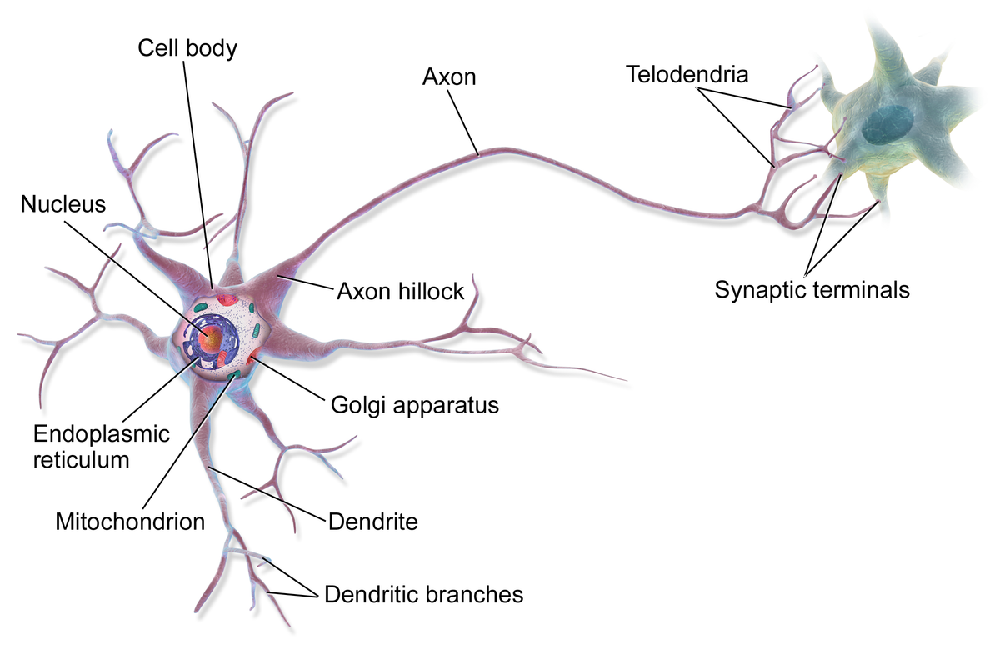

The model for a neuron was the perceptron:
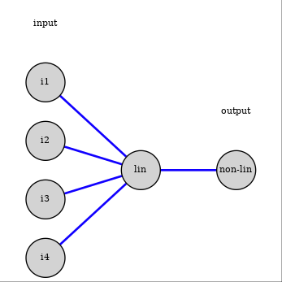

$z = w_0 + \vec{w} · \vec{x};$ $output = \phi(z)$

This is the model of a modern unit in a neural newtwork
- linear cmbination of inputs units
- non-linear function to generate the unit's value, called activation function

#### Non-linear activation functions

There are different decision fucntions that can be used
- the perceptron used a step function
- logistic regression uses the sigmod function
- one can also use $\phi(z) = \tanh(z)$ as a decision function
- various variantions on the hinge function (ReLu)

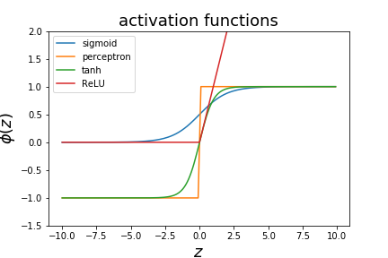

#### Network architectures

Neural networks are build by connecting artificial neurons together.

They can be used for classification or regression. Here we will consider the classification case.

#### Single layer network

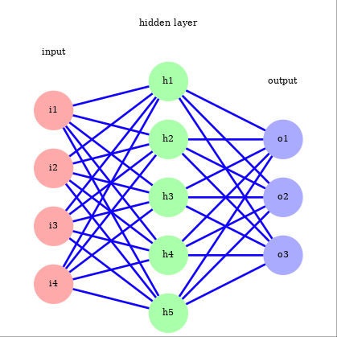

#### Multi layer network

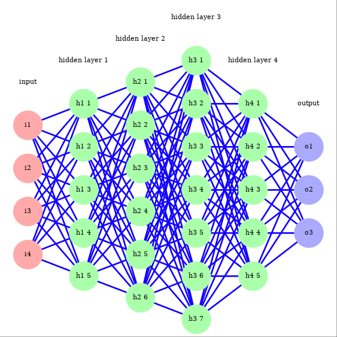

Networks with a large number of layers are referred to as “deep learning”.

They are more difficult to train, recent advances in training algorithms and the use of GPUs have made them much tractable (and popular!).

#### Feedforward step

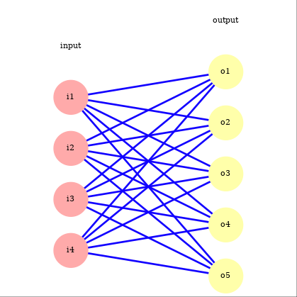

To calculate the output of the j-th unit for the i-th data example we calculate
$$
{o_j^{(i)}=\phi(z_j^{(i)});,\quad z_j^{(i)}=w_{0j}+\sum_{k=1}^{n_i}w_{kj}\cdot x_k^{(i)}}
$$

If we have a $n_i$ input nodes and $n_o$ output units we have $(n_i + 1)\times n_o$ parameters $w_{kj}$. We can organise them in a $n_i + 1$ by $n_o$ matrix of parameters $W$ and write the vector of $z$ values for the $n_o$ output units as
$$
  z = W^Tx
$$
where $x$ is the column vector of input values with a 1 added as the 0-the component

The value $z$ is then passed through the non-linear function

#### Last step
If we have more that 2 classes we want the last layer's output to be probabilities of belonging to one the $k$ classes in the classifier. For this we replace the sigmoid function witht the softmax function:
$$
{s_{i}(z)=\frac{e^{z_{i}}}{\Sigma_{j=1}^{k}e^{z_{j}}}}
$$
It is by definition normalised such that the sum adds to one and is the muti-class generalisation of the sigmoid function. $s_i$ is largest for the index $i$ with the largest $z_i$. The classifier predtion will typically be the class $i$ with the largest value $s_i$.
$$
\frac{\partial s_i}{\partial z_{j}}=\frac{-e^{z_{i}}e^{z_j}+\delta_{ij}e^{z_{i}}\Sigma_{i=1}^ke^{z_i}}{\left(\Sigma_{j=1}^ke^{z_j}\right)^{2}}={s}\frac{-e^{z_j}+\delta_{ij}\Sigma_{i=1}^{\mathrm{k}}e^{z_i}}{\Sigma_{j=1}^{k}e^{z_j}}={s}\left(\delta_{ij}-s_j\right)
$$

#### Multi-class loss function

The generalisation of the cross entropy loss for multiple class is given by
$$
{J=-\sum_{i,j}y_{j}^{(i)}log(\hat y_{j}^{(i)})}
$$
where $y^{(i)}_j$ is 1 if traning sample i is in class j, 0 otherwise

This is called one-hot encoding. The derivative of the loss function with respect to one of hte predictions is given by
$$
\frac{\partial J}{\partial \hat y_j^{(i)}}=-\frac{y_j^{(i)}}{\hat y_j^{(i)}}
$$

#### Example

Using the same circle dataset that we used before, the decision function for a single-layer neural network with 10 hidden units gives the following decision boundary:

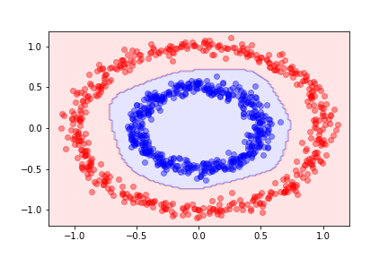

Here is an example using more than two classes

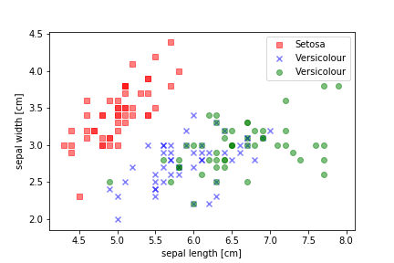

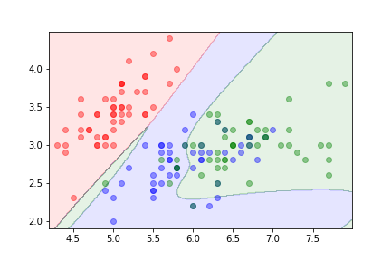

### Variance Bias Trade-off

Let's suppose the relationship between $X$ and $Y$ is is described by
$$
{Y=\sum_{i}w_{i}^{\star}x^{i}+\epsilon}
$$
where $w^*_i$ are the true parameters and $\epsilon$ is some noise.

We will try to model this with 
$$
  y = p(x) = \sum_i w_ix^i
$$
where now the $w_i$ will be fitted to data

We define
$$
\overline{w}_i = \langle w_i\rangle
$$
as the expectation value of the parameter $w_i$ when fitted to multiple independent samples drawn from the trun distribution.

We want to calculate the expected deviation of the fitted coefficients form the true coefficient:
$$
\langle({w_{i}}-{w^\star_{i}})^{2}\rangle\\\langle({w_{i}}-{w^\star_{i}})^{2}\rangle=\langle({w_{i}}-{w_{i}}+{w_{i}}-{w^\star_{i}})^{2}\rangle\\=\langle({w_{i}}-{w_{i}})^{2}\rangle+\langle({w_{i}}-{w^\star_{i}})^{2}\rangle+2\langle({w_{i}}-{w_{i}})({w_{i}}-{w^\star_{i}})\rangle
$$

The third term vanishes:
$$
\langle(w_{{i}}-w_{{i}})(w_{{i}}-w_{{i}}^{\star})\rangle=\langle(w_{\mathrm{i}}-w_{{i}})\rangle(w_{{i}}-w_{{i}}^{\star})=0
$$

So we have
$$
\langle({w_{i}-w_{i}^{\star}})^{2}\rangle=\langle({w_{i}-w_{i}})^{2}\rangle+\langle({w_{i}-w_{i}^{\star}})^{2}\rangle 
$$

The first term is the variance term and the second is the bias

#### Example

To illustrate the variance-bias tradeoff we will be using different models to describe data with true relationship between the input $x$ and the outcome
$$
Y(x)=1+\frac{1}{5}x^{2}+\epsilon\quad for\quad0\leq x\leq1;,\quad0; \mathrm {otherwise}
$$
Where $\epsilon$ is a gaussian noise. We will use the two models
$$
  m_1(x) = a + bx
$$
and
$$
  m_2(x) = a + bx + cx^2 + dx^3
$$
Using $m_1$, a model with too few parameters we get

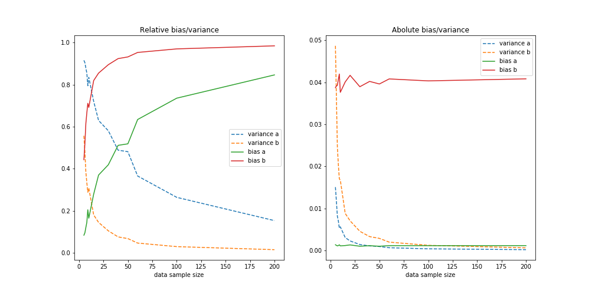

For low dataset size we see the the variance dominates but as the number of training samples grows the bias dominates. Since the model is not capable of describing the truth the error is not diminishing even though the variance part of the error drops proportional to $1/\sqrt{N}$

For the second model where we have enough freedom to exactly describe the truth we get:

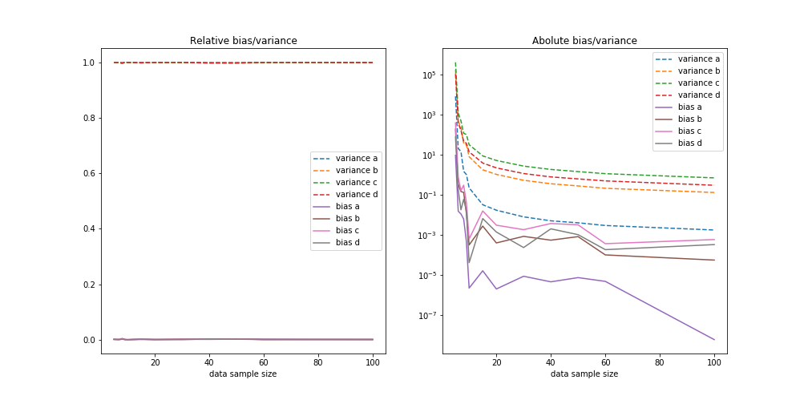

### Neural Network Traning

#### Feedforward step

#### Training the neural network

A neural network is trained through back-propagation. It allows to adapt the weights in the layer successively.

Moving from the perceptron to a continuous activation function allows this.

The idea is to start from the end of the network and evaluate the difference between the output of the network and the target from the training set.

We use this as the error for the last layer. We also propagate the error to the last hidden layer and adapt the weights between the last and second-to-last layer accordingly.

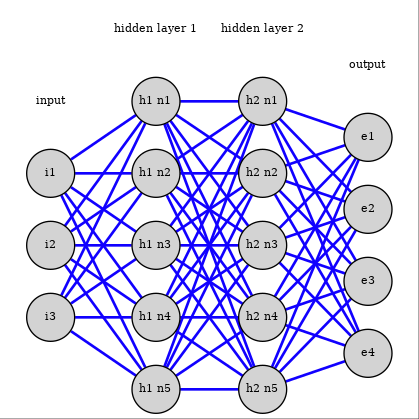

#### Last layer

The last layer is slightly different so we treat it first.

Let’s look at the last set of parameters between the output and the hidden layer.

We have the loss function
$$
{J=-\sum_{i,j}y_{j}^{(i)}\log(\hat y_{j}^{(i)})}
$$
where $y^{(i)}_j$ is 1 if traning sample $i$ is in class $j$, 0 otherwise $\hat{y}^{(i)}_j$ is the prediction of the model, here
$$
\hat y_j^{(i)}=s_j(z_j^{(i)})
$$
with $z^{(i)}_j$ the linear combination of the last hidden layer with the last set of coefficients $w_{jk}$

We can calculate the derivative of the loss function with respect to the linear combination in the last layer:
$$
\frac{\partial J}{\partial z_{j}^{(i)}} = \sum_{l=1}^{n_o} \frac{\partial J}{\partial \hat y_{l}^{(i)}} \frac{\partial y_{l}^{(i)}}{\partial z_{j}^{(i)}} = \sum_{l=1}^{n_o} \left(-\frac{\hat y_{l}^{(i)}}{y_{l}^{(i)}}\right) s_{l} (\delta_{lj} - s_{j})
$$
with $n_0$ the number of units in the output layer
$$
\frac{\partial J}{\partial w_{km}} = \sum_{i=1}^{n_d} \sum_{j=1}^{n_o} \frac{\partial J}{\partial z_{j}^{(i)}} \frac{\partial z_{j}^{(i)}}{\partial w_{km}} = \sum_{i=1}^{n_d} \sum_{j=1}^{n_o} \sum_{l=1}^{n_o} \left(-\frac{y_{l}^{(i)}}{\hat y_{l}^{(i)}}\right) s_{l} (\delta_{lj} - s_{j}) \frac{\partial z_{j}^{(i)}}{\partial w_{km}}
$$
with
$$
\frac{\partial z_{j}^{(i)}}{\partial w_{km}} = x_{k}^{(i)} \bar{\delta}_{mj}
\frac{\partial z_{j}^{(i)}}{\partial w_{km}} = x_{k}^{(i)} {\delta}_{mj}
$$
we get
$$
\frac{\partial J}{\partial w_{km}} = \sum_{i=1}^{n_d} \sum_{l=1}^{n_o} \left(-\frac{y_{l}^{(i)}}{\hat y_{l}^{(i)}}\right) s_{l} (\delta_{lm} - s_{m}) x_{k}^{(i)}
$$

#### Layer error treatment

We now look at a standard layer.

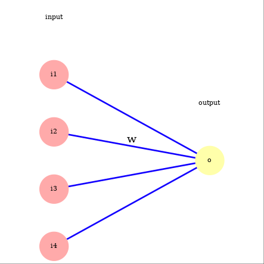

Now we can consider a normal layer with sigmoid activation with input x , parameters w  and output y . We denote with z  the linear combination of x  that enters the activation function (the sigmoid function).
$$
y_j = \phi(z_j)
$$
$$
z = W^Tx
$$
We have
$$
\frac{\partial y_j}{\partial z_j} = y_j (1 - y_j)
$$
and
$$
\frac{\partial y_j}{\partial w_{ij}} = \frac{\partial y_j}{\partial z_j} \frac{\partial z_j}{\partial w_{ij}} = \frac{\partial y_j}{\partial z_j} x_i = y_j (1 - y_j) x_i
$$
We can now calculate the derivative of the loss function with respect to the parameters of the connections:
$$
\frac{\partial J}{\partial w_{ij}} = \frac{\partial J}{\partial y_j} \frac{\partial y_j}{\partial w_{ij}} = \frac{\partial J}{\partial y_j} y_j (1 - y_j) x_i
$$
We see that the derivative depends on the gradient of the loss with respect to the outputs of the layer we are considering. This output is the input into the next layer. So it will be useful to be able calculate the derivative of J with respect to the layer input.
$$
\frac{\partial J}{\partial x_{i}} = \sum_{j} \frac{\partial J}{\partial z_{j}} \frac{\partial z_{j}}{\partial x_{i}} = \sum_{j} \frac{\partial J}{\partial z_{j}} w_{ij}
$$
with
$$
\frac{\partial J}{\partial z_j} = \frac{\partial J}{\partial y_j} \frac{\partial y_j}{\partial z_j} = \frac{\partial J}{\partial y_j} y_j (1 - y_j)
$$
To adapt the parameters of the network we start with the last layer and do for each layer:
- calculate the derivatives with respect to the outputs to adapt the weights
- calculate the derivatives with respect to the inputs to use in the calculation of the parameters of the previous layer.

The parameter adaptation goes in the opposite direction as the prediction, it is called back-propagation.

#### Initial weights

We need to break the symmetry between nodes at initialisation time otherwise all nodes will be updated together.

#### Difficulties with network traning

Training a neural network is challenging because:
- the loss function is not convex (there are local minima)
- if weights get too large the argument of the sigmoid activation gets large, which means the derivative get small and convergence is very slow.
- neural network are prone to overfitting

#### Regularisation

Neural networks have many parameters and can easily overfit. To prevent it there are several options:

- reduce size of the network
- early stopping: do not allow the network to optimize its weights until a minimum is found
- add random noise to the weights or to the units activities
- add a penalty for large weights as we did for other algorithms

