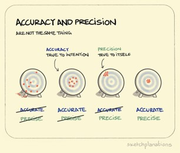

# Summary - Machine Learning and Statistics

## Lecture 1

Errors in the physical sciences, Random errors in measurements, Uncertainties and probabilities   
物理科学中的误差、测量中的随机误差、不确定性和概率

### precision & Accurate

precision: the spread of results is "**small**"  
精确性: 测量结果的分散程度较小，数据点集中在一起

Accurate: result is in agreement with "**accepted**" value  
准确性: 测量结果与“公认”值的接近程度

### Mean, Standard deviation and Standard error

- **Mean**: where is the measurement centred  
  均值: 测量结果的中心位置
    $$
        \overline{x} = \frac{1}{N}(x_1 + x_2 + \dots + x_n) = \frac{1}{N}\sum\limits^N_{i=1}x_i
    $$
- **Standard deviation**: width of the distribution  
  标准差: 分布的宽度，表示数据的离散程度
    $$
        \sigma_{n-1} = \sqrt{\frac{(d^2_1 + d^2_2 + \dots + d^2_N)}{N - 1}} = \sqrt{\frac{1}{N - 1}\sum\limits^N_{i=1}d^2_i}
    $$
    where $d_i = x_i - \overline{x}$
    > - the standard deviation is independent of N  
    >   标准差不受样本量 𝑁 的影响, 因为它只关心数据的分散程度
- **Standard error**: uncertainty in the location of the centre, $\alpha$  
  标准误差: 均值位置的不确定性。
    $$
        \alpha = \frac{\sigma_{N-1}}{\sqrt{N}}
    $$
    We should quote our finding as $\overline{x} \plusmn \alpha$
    > - the standard error improves with N  
    >   标准误差随样本量 𝑁 的增加而减小, 意味着随着收集更多的数据, 均值估计会更加精确

- **Gaussian or Normal Distribution**  
  正态分布
    $$
        f(x) = \frac{1}{\sigma\sqrt{2\pi}}\exp[-\frac{(x-\overline{x})^2}{2\sigma^2}]
    $$
    > Facts: peak centred around mean, symmetric about mean,area under curve equals 1(normalised)  
    > 事实：峰值以平均值为中心，关于平均值对称，曲线下面积等于 1（标准化）

- The error in the error  
  误差中的误差
    $$
        \alpha^{\plusmn} = \frac{1}{\sqrt{2N-2}}
    $$

- The five golden rules for reporting results  
  报告结果的五条黄金法则
  1. The best estimate for a parameter is the mean  
    参数的最佳估计是均值
  2. The error is the standard error in the mean   
    误差是均值的标准误差
  3. Round up the error to the appropriate number of significant figures  
    将误差四舍五入到适当的有效数字
  4. Match the number of decimal places in the mean to the standard error  
    将均值的小数位数与标准误差匹配
  5. Include units  
    包含单位

### Confidence level

- We need to evaluate the **error function** of the Gaussian distribution(G)
    $$
        Erf(x_1;\overline{x}, \sigma) = \int^{x_1}_{-\infty}G(x;\overline{x},\sigma)
    $$
    $$
       f(x) = \frac{1}{\sqrt{2\pi}} e^{-x^2 / 2}
    $$
    $$
        \text{CDF}(x) = \frac{1}{2} \left[ 1 + \text{erf}\left( \frac{x}{\sqrt{2}} \right) \right]
    $$
    $$
         P(-\sigma \leq X \leq \sigma) = \text{erf}\left( \frac{\sigma}{\sqrt{2}} \right)
    $$
    The standard deviation is thus used to define a confidence level on the data.  
    因此，标准差用于定义数据的置信度。
    $$
        \overline{x} \pm ? \frac{\sigma}{\sqrt{N}}
    $$

- The standard deviation is thus used to define a **confidence level** on the data  
  使用标准差定义数据的置信水平
  - Up to 1 standard error it is in **excellent agreement**
  - Between 1 and 2: **reasonable agreement**
  - More than 3 standard errors: **disagreement**

### Poisson distribution

- Events are rare  
  事件稀少。
- Events are independent  
  事件独立。
- Tha average rate does not change with time  
  平均发生率不随时间变化。
  $$
    P(N;\overline{N}) = \frac{\exp(-\overline{N})\overline{N}^N}{N!}
  $$
  > Mean = $\overline{N}$  
  > Standard deviation = $\sqrt{\overline{N}}$

### Chauvenet's Criterion 

**Chauvenet's Criterion** 是一种统计学方法, 用于检测和判断数据集中是否存在离群值(outliers)。离群值是指与其他数据点偏差较大的数据点。Chauvenet 的准则基于标准正态分布, 提供了一种方法来确定一个数据点是否与数据集的其他部分显著不同。

1. **计算数据的均值(mean, $\mu$)和标准差(standard deviation, $\sigma$)**。

2. **计算每个数据点与均值的偏差**：使用以下公式计算每个数据点与均值的标准化差值(即 Z 值)：
   $$
   Z = \frac{|x_i - \mu|}{\sigma}
   $$
   其中 $x_i$ 是第 $i$ 个数据点, $\mu$ 是均值, $\sigma$ 是标准差。

3. **计算离群值的概率**：利用正态分布, Z 值代表的是数据点与均值的偏差程度。对于正态分布, 计算该数据点的累计概率。这个概率表示数据点在多大程度上可以被视为异常值。

4. **判断数据点是否为离群值**：根据数据点的数量 $N$, Chauvenet's Criterion 提供了一个门槛。如果一个数据点的概率低于：
   $$
   P = \frac{1}{2N}
   $$
   则该数据点可以被视为离群值并被拒绝(REJECT), 否则接受(ACCEPT)。

## Lecture 2

Error propagation, Data visualization and reduction  
误差传播、数据可视化和缩减

### Single-variable functions 单变量误差传播

- Functional approach 函数法
    $$
        \alpha_Z = |f(\overline{A} + \alpha_A) - f(\overline{A})|
    $$

- Calculus-based approach 微积分法
    $$
        \alpha_Z = |\frac{dZ}{dA}|\alpha_A
    $$

### Multi-variable functions 多变量函数的误差传播

- Functional approach 函数法
  $$
    (\alpha_Z)^2 = (\alpha^A_Z)^2 + (\alpha^B_Z)^2 + (\alpha^C_Z)^2 + ...
  $$
  - Change in Z when A is varied and B is constant  
      $$
        \alpha^A_Z = f(\overline{A} + \alpha_A, \overline{B}) - f(\overline{A}, \overline{B})
      $$
  - Change in Z when B is varied and A is constant 
      $$
        \alpha^B_Z = f(\overline{A}, \overline{B} + \alpha_B) - f(\overline{A}, \overline{B})
      $$

- Calculus-based approach 微积分法
  $$
    (\alpha_Z)^2 = (\frac{\partial Z}{\partial A})^2(\alpha_A)^2 + (\frac{\partial Z}{\partial B})^2(\alpha_B)^2 + (\frac{\partial Z}{\partial C})^2(\alpha_C)^2 + ...
  $$

### Least Squares Method 最小二乘法

- 残差(residuals) = 实际值−模型预测值
$$
    R_i = y_i - y(x_i)
$$

- Goodness-of-fit Parameter 拟合优度参数
  $$
      \chi^2 = \sum\limits_i\frac{(y_i - y(x_i))^2}{\alpha^2_i}
  $$
  > The probability of obtaining our measurement values from the best-fit line is maximised when χ2 is minimised  
  > 当 χ2 最小化时，从最佳拟合线获得测量值的概率最大化
  - $\chi^2$ for data with Poisson errors
    $$
        X^2 = \sum\limits_i\frac{(O_i-E_i)^2}{E_i}
    $$
    > i: number of counts(bins)  
    > $O_i$: observed number of occurrences(in the i-th bin)  
    > $E_j$: expected number of occurrences(in the i-th bin)

    > If we have a goot fit, $\alpha_i = \sqrt{E_i} \approx \sqrt{O_i}$

### Minimisation 最小化

The best values for **slope** and **intercept** are those that minimise the squares of the differences summed for all data points  
斜率和截距的最佳值是最小化所有数据点之差的平方和

$$
    S = \sum\limits_i(y_i - mx_i - c)^2 
$$

截距 𝑐 的公式
$$
    c = \frac{\sum_ix^2_i\sum_iy_i - \sum_ix_i\sum_ix_iy_i}{\Delta}, \alpha_c = \alpha_{CU}\sqrt{\frac{\sum_ix^2_i}{\Delta}}
$$

斜率 𝑚 的公式：
$$
    m = \frac{N\sum_ix_iy_i - \sum_ix_i\sum_iy_i}{\Delta}, \alpha_m = \alpha_{CU}\sqrt{\frac{N}{\Delta}}
$$

> 共同不确定性:    
> Common uncertainty: $\alpha_{CU} = \sqrt{\frac{1}{N - 2}\sum_i(y_i - mx_i - c)^2}$

总不确定性参数 Δ 
$$
\Delta = N\sum_ix^2_i - (\sum_i x_i)^2
$$

Need to perform a **weighted** least-squares fit to take them into account  
需要执行**加权**最小二乘法才能将它们考虑在内
$$
    R_i = \frac{y_i - y(x_i)}{\alpha_i}
$$

## Lecture 3

Least-squares fitting, Computer minimization and error matrix  
最小二乘拟合、计算机最小化和误差矩阵

### Least-squares fit to an arbitrary function

- Procedure:
  1. for each value of the independent variable, $x_i$, calculate $y(x_i)$ using an estimated set of values for the parameters  
    计算估计参数集下的函数值
  2. for each value of the independent variables, calculate the square of the normalised residual, $[^{(y_i-y(x_i))}/_{\alpha i}]^2$  
    计算归一化残差的平方
  3. calculate $\chi^2$(sum the square of the normalised residuals)  
    计算$\chi^2$
  4. minimise $\chi^2$ by optimising the fit parameters  
    优化拟合参数

- Fit data with a double-peak model:  
  
  - residuals randomly distributed -> good fit  
    双峰模型拟合 X 射线衍射数据：残差随机分布，表示拟合良好。
- Fit data with a single-peak model:  
  
  - residuals show structure -> bad fit  
    单峰模型：残差有结构性，表示拟合较差。

- To better visualise structure in residuals: make a lag plot -> normalised residuals $R_i$ vs lagged residuals $R_{i-k}$(k is usually 1)
- Good fit  
  
  - Random parttern
  - at least 91% of data points in a 2D box of $\pm2$ limits
  - 随机模式 -> 拟合良好。
- Bad fit:  
  
  - non-random pattern
  - < 91% of data points in a 2D box of $\pm2$ limits
  - 非随机模式 -> 拟合不良。

- Durbin-Watson
  $$
    D=\frac{\sum_{i=2}^N(R_i-R_{i-1})^2}{\sum_{i=1}^NR_i^2}
  $$
  > $R_i$表示第$i$个标准差残差  
  > 分子部分是滞后残差的平方和, 表示相邻残差之间的变化  
  > 分母部分是所有残差的平方和，表示残差的总变异

What does it mean?
- 0 < D < 4
- D = 0: systematically correlated residuals 系统性相关残差
- D = 2: randomly distributed residuals with Gaussian distribution 残差随机分布，符合高斯分布
- D = 4: systematically anticorrelated residuals 系统性反相关残差

### the error surface
- 对于直线拟合, $\chi^2$的变化随斜率的变化呈现出简单的曲线
- 对更复杂的函数, $\chi^2$随参数变化形成的误差曲面可能具有多个局部最小值
- 通过泰勒展开来近似$\chi^2$在最优解附近的行为, 从而表达标准误差:
    $$
        \alpha_j = \sqrt{\frac{2}{(\frac{\partial^2\chi^2}{\partial \alpha^2_j})}}
    $$

### Curvature Matrix and Error Matrix

- For a straight line fit, the $\chi^2$ surface is perfectly parabolic with respect to both variabels, such that:
  - There is only 1 minimum
  - Finding the minimum is easy
  - The curvature matrix has analytic results that let you calculate errors easily$A=\begin{bmatrix}A_{cc}&&A_{cm}\\A_{mc}&&A_{mm}\end{bmatrix}$
    $$
        A_{cc}=\sum_{i}\frac{1}{\alpha_{i}^{2}}\quad A_{cm}=A_{mc}=\sum_{i}\frac{x_{i}}{\alpha_{i}^{2}}\quad  A_{mm}=\sum_{i}\frac{x_{i}^{2}}{\alpha_{i}^{2}}
    $$
    $$
        [C] = [A]^{-1}
    $$
    And finally: the uncertainty $a_j$ of the parameter $a_i$ is $\alpha_j = \sqrt{C_{jj}}$, so $a_j + a_j = a_j \pm \sqrt{C_{jj}}$

  - Without correlation: $\alpha_{V}^{2}=f^{2}\alpha_{m}^{2} + \alpha_{c}^{2}=f^{2}C_{22}+C_{11}$
  - With correlation: $\alpha_{V}^{2}=f^{2}C_{22}+C_{11}+2fC_{12}$

## Lecture 4

### Degree of freedom

- 若我们测量了 $N$ 个独立数据点并用 $\mathcal{N}$ 个参数拟合模型，自由度 $v$ 定义为
  $$
    v = N - \mathcal{N}
  $$
- 自由度的概念意味着我们在计算标准偏差时需要减少一个自由变量，因为最后一个偏差是由之前的偏差决定的

### The $\chi^2$ probability distribution function

$\chi^2$ is a random variable(it depends on a variety of input parameters, e.g., the input data, the chosen model, the uncertainties, etc)  
$\chi^2$ 是一个随机变量，它依赖于许多输入参数，如输入数据、选定模型和不确定性等  
-> it has a normalised probability distribution function(PDF)  
其具有一个归一化的概率分布函数 (PDF)
$$
  X(\chi^2; v) = \frac{(\chi^2)^{(\frac{v}{2}-1)}\exp[-\chi^2 / 2]}{2^{v/2}\Gamma(v/2)}
$$

Facts:
- $X(\chi^2, v)$ is asymmetric(median $\neq$ mode) 是非对称的
- It has a mean(expectation value) of $v$, and a standard deviation, $\sigma_{\chi^2} = \sqrt{2v}$
- P of obtaining a value of $\chi^2$ between $\chi^2_{min}$ and $\infin$ is the cumulative probability function
  $$
    P\left(\chi_{\min}^2\leq\chi^2\leq\infty;v\right)=\int\limits_{\chi_{\min}^2}^\infty X\left(\chi^2;v\right) \mathrm{d}\chi^2
  $$

If $\chi^2_{\min} \gg v$ $\rarr$ probability is small
- is null hypothesis wrong?
- are uncertainties incorrect?

If $\chi^2_{\min} < v$ $\rarr$ probability tends towards 1
- Not an indication of improved fit
- Likely, uncertainties are overestimated, which results in unrealistically small $\chi^2$ values

There's a fast way of telling if a null hypothesis should be rejected: reduced $\chi^2$  
一个快速判断零假设是否应被拒绝的方法是 简化的 $\chi^2$
$$
  \chi^2_v = \chi^2_{\min} / v
$$

### What makes a good fit?

- Two-thirds of the data points should be within one standard error of the theoretical model.  
  约 2/3 的数据点在理论模型的一倍标准误差内。
- $\chi^2_{\nu} \approx 1$.
- $P(\chi^2_{\text{min}}; \nu) \approx 0.5$.
- A visual inspection of the residuals shows no structure.  
  残差的可视化检查无结构性。
- A test of the autocorrelation of the normalized residuals yields $D \approx 2$.  
  归一化残差的自相关测试 $D \approx 2$。
- The histogram of the normalized residuals should be Gaussian, centered on zero, with a standard deviation of 1.  
  归一化残差的直方图呈现为以 0 为中心的高斯分布，标准差为 1。

### Anscombe's quartet

4 data sets:
- Described by same statistic  
  使用相同的统计描述。
- Very different distributions  
  但具有非常不同的分布形态。
- Illustrate the danger of not inspecting your plots  
  展示了如果只依赖统计描述而不查看图形可能会带来的危险。

### Benford's Law(aka the first digit law)

The "first digit phenomenon" can be described by the following probability:

$$
P(d) = \log_{10}\left(1 + \frac{1}{d}\right)
$$

"In many real-life numerical sets of data, the leading digit is likely to be small" (wiki).

- 1 appears about 30% of the time.
- 9 occurs about 5% of the time.
- Works best if data spans many orders of magnitude.

这表明，数据中的前导数字通常是小数字，尤其是当数据涉及不同数量级时