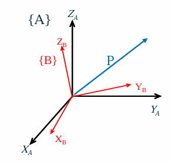
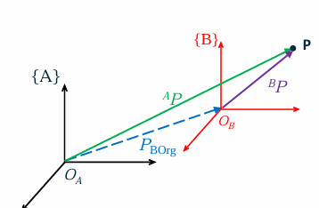
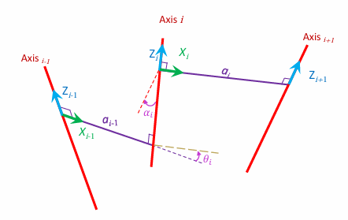
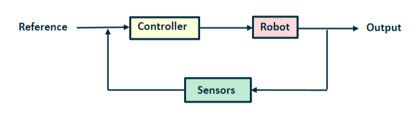

# Note - Robitcs - Planning and Motion

## Lecture 1 - Introduction to Robotic

### Learning Objectives

Objectives:
1. Definition of robotics & it's history  
    机器人定义以及历史
2. Current robotic sectors  
    当前的机器人领域
3. Industrial robotics & manipulators  
    工业机器人和操纵者

### Robot Definition

Two common definitions are:
- (old)An industrial robot is a reprogrammable, multifunctional manipulator designed to move parts, tools or special devices through variable programmed motions for the performance of a variety of tasks  
    （旧）工业机器人是一种可重新编程的多功能操纵器，旨在通过可变的编程动作移动零件、工具或特殊设备，以执行各种任务
- A robot is an artificial physical agent that perceives its environment through `sensors` and acts upon that environment through `actuators`.  
    机器人是一种人工物理代理，它通过传感器感知其环境并通过执行器对该环境采取行动。

### Current Robotic Application Sectors

- Manufacturing  制造业
- Surgical  外科
- Service  服务业
- Military  军事
- Healthcare  医疗保健
- Home  家居
- Space  太空
- Farming  农业
- Security/surveillance  安全/监视
- Rescue  救援
- Extreme Environments  极端环境

## Lecture 2 - Actuators & Sensors

### Learning Objectives

Objectives:
- Different Types of Actuators  不同类型的执行器
- Sensors  传感器

### Actuators

Three commonly used actuator types:
- Electromagnetic(The most common types of actuators)  电磁
- Hydraulic  液压
- Pneumatic  气动

#### Electromagnetic Actuators  电磁执行器

- Brushed DC Motor  有刷直流电动机
  - Current flowing through armature generates a magnetic field and permanent magnets torque the armature  
    通过电枢的电流产生磁场，永久磁铁扭转电枢 
    - Advantages: Provicdes variable speeds, low-cost  
        优点：提供可变速度，成本低
    - Disadvantages: Brush wear out, low precision  
        缺点：刷子磨损，精度低

- Brushless DC Motor  无刷直流电动机
  - Armature is fixed, and permanent magnets rotate    
    电枢固定，永久磁铁旋转
    - Advantages: Efficiency, Low noise, Cooling, Water-resistant  
        优点：效率高、噪音低、散热、耐水
    - Disadvantages: low percision, costly  
        缺点：精度低，成本高

- Stepper Motor  步进电动机
  - Brushless, synchronous motor that moves in discrete steps  
    无刷、同步电机，以离散步进运动
    - Advantage: Precise, quantized control without feedback  优点：精确、量化控制，无需反馈
    - Disadvantages: Slow and moves in discrete steps, expensive  缺点：速度慢，以离散步进移动，成本高

#### Hydraulic Actuators  液压执行器

- Cylinders(linear actuators):  气缸（线性执行器）
  - Advantages:
    - Very powerful that offer very large force capability, but expensive  非常强大，提供极大的力输出，但成本高
    - High power-to-weight ratio  功率与重量比高
  - Drawbacks:
    - Their power supplies are bulky and heavy  电源体积大且沉重
    - Oil leakage  漏油问题

- Motors(rotary actuators)  马达（旋转执行器）

- Integrated Smart Hydraulic Actuator  集成智能液压执行器
  - Usual hydraulic actuator-valve configuration  常见的液压执行器-阀门配置

#### Pneumatic Actuators  气动执行器

- Cylinders(linear actuators)  气缸（线性执行器）

- Motors(rotary actuators)  马达（旋转执行器）

### Sensors

#### Motivation

A robot would be easily controlled if a complete model of the environment was available for the robot, and if tis actuators could execute motion commands perfectly relative to this model  
如果机器人拥有完整的环境模型，并且其执行器能够相对于该模型完美执行运动命令，则机器人将更容易控制。

#### Robotic sensor classsification

- Proprioceptive  本体感知
  - Internal state of the robot  机器人的内部状态
  - Measures values (e.g. wheels position, joint angle, battery level, etc)
- Exteroceptive  外感知
  - External state of the system  系统的外部状态
  - Observing environment, detecting objects, etc

- Active  主动
  - Emits energy(e.g. radar)
- Passive  被动
  - Receives energy(e.g. camera)

- Real-world Characteristics of sensors
  - **Sensitivity**: Ratio of output change to input change  
    灵敏度：输出变化与输入变化的比率
  - **Error/Accuracy**: Difference between the sensor's output and the true value  
    误差/准确度：传感器输出与真实值之间的差异
    - **Systematic/Deterministic Error**: Caused by factors that can be modelled(in theory), e.g., calibration of a laser sensor  
        系统/确定性误差：由可建模的因素引起（理论上），如激光传感器的校准
    - **Random Error**: e.g., hue instability of camera, black level noise of camera  
        随机误差：如相机色调不稳定、相机的黑电平噪声
  - **Reproducibility**: Reproducibility of sensor results  
    再现性：传感器结果的可重复性

#### Various sensors overview

- A simple On/Off switch
- Titl sensor(mercury titl)  倾斜传感器（汞倾斜）
- Dual axis inclinometer  双轴倾斜仪
- Potentiometer  电位器
- Bumpers  缓冲器
  - Mechanical switches

- Light sensors
  - Photoresistors, light dependent resistors(LDR)
  - Phototransistors  光电晶体管

- Thermal sensor
  - Thermal resistor
  - Temperature sensors
    - Analogue
    - Digital

- Proximity sensors  接近传感器
  - Non-contact
  - Devices that can be used in areas that are near to an object to be sensed
  - Different types of Proximity Sensors
    - Infrared
    - Ultrasonic
    - Inductive  电感
    - Capacitive  电容

- Position Sensors
  - Potentiometer  电位器
  - Resolver  解算器
  - Optical Encoders
    - Relative position
    - Absolue position

- Heading sensors:  方位传感器
  - Heading sensors can be proprioceptive(gyroscope, inclinometer) or exteroceptive(compass)  
    方位传感器可以是本体感知（陀螺仪、倾角仪）或外感知（指南针）
  - Used to determine the robots orientation and inclination  
    用于确定机器人的方位和倾斜角

- Accelerometer
  - be made to sense acceleration by simply measuring the force on a mass

- Gyroscope  陀螺仪
  - Heading seonsors for measuring and to keep the orientation to a fixed frame  
    用于测量和保持相对于固定框架的方向的方位传感器
  - Two methods:
    - Mechanical(flywheel)
    - Electronic

### Components used for Manipulators
- Components in a joint:
  - Moters(electric or hydraulic)
  - Moter Encoders
    - Angle(joint angle)
    - Displacement sensor  位移传感器
  - Gearbox  齿轮箱

## Lecture 3 - Manipulators

### Learning Objectives

Objectives:
1. Introduction to Manipulators
2. Manipulators and joints

### Robotic Manipulators 机械臂

Benefits in repetitive operation:
- Increase volume / capacity 增加容量
- Improve quality and consistency 改进质量
- Untouched by human hand 不能人手触碰
- Reduce wastage 减少浪费
- "Up skilling" of work force 技能提升

> A Return On Investment(ROI 回报率) study would be performed to quatify these factors and justify the investment in a bespoke robotics solution

### joints 关节

- Different types of joints
  - Revolute Joint 旋转关节
    - 绕固定轴旋转，自由度(DOF)为1
  - Prismatic Joint 伸缩关节
    - 可以沿直线滑动，自由度(DOF)为1
  - Cylindrical Joint 圆柱关节
  - Spherical Joint 球形关节
  - Universal Joint 万向关节

### Manipulators 机械臂

- Different types of manipulator:
  - Cartesian PPP 笛卡尔型
    - 三个线性关节，适合直线运动
  - Cylindrical RPP 圆柱型
    - 适合具有圆柱形工作空间的任务
  - Spherical RRP 球型
    - 适合球型工作空间
  - Articulated RRR 关节型
    - 更加灵活，常用于需要复杂运动的任务中
  - SCARA, RRP (Selective Compliance Assembly Robot Arm 选择顺应性装配机械手臂)

- Links
  - n moving link(s) n个活动连杆
  - 1 fixed link 固定基座
- joints
  - Revolute (1 DOF)
  - Prismatic (1 DOF)

- Position Parameters 位置参数
  - Position parameters describe the full configuration of the system

n links -> 9n parameters (3 vectors: Each vector has 3 parameters)

**Generalised coordinates**: A set of independent configuration parameters
**Degreee of Freedom**: Number of generalised coordinates

- We need 6 DOF to have access to all space
  - 3 DOF: Position 位置
  - 3 DOF: Orientation 姿态

> Revolute and prismatic joints have 1 DOF

- Generalised coordinates 广义坐标
  - A set of independent configuration parameters 独立参数
  - Each rigid body(刚体) needs 6 parameters to be described
    - 3 positions
    - 3 orientations
  - For n rigid body, we need 6n parameters
  - Constrains myst be applied:
    - Each joint has 1DOF, so 5 constrains will be introduced
    > n moving links -> 6n parameters  
    > n joints -> 5n constrains  
    > n DOF  
    > This is for manipulator with fixed base

- End effectors configuration 末端执行器配置
  - End effector is the last rigid-body and it has all the freedom from previous links
  - A set of parameters describing position and orientation of the end effector: $(x_1, x_2, x_3, ... , x_m)$ with respect to {0}
    > $O_{n+1}$: is operational coordinates(task coordinates)
  - A set of $x_1, x_2, x_3, ... , x_{m_o}$ of $m_o$ independent configuration parameters
  - $m_o$ is number of DOF of the end effector, max 6 DOF 末端执行器自由度最高为6

- End effector, Joint coordination 末端执行器，关节坐标
  - Joint space (configuration space) is the space that a manipulator is represented as a point.
  - (x,y) is a vector for position of end effector $\alpha$ defines orientation(angle) of end effector
  - Defines: operational coordinates -> operational space

- Redundancy 冗余
  - A manipulator is Redundant if 
    $$
      n>m 
    $$
    n number of DOF of the manipulator  
    m number of DOF of the end effector(operational space)  
    Degreee of Redundancy: n - m  

## Lecture 4 - Kinematics

### Learning Objectives

Objectives:
1. Spatial Description
2. Transformation
  - Rotation
  - Translation

### Spatial Description

- Position of a Point 点的位置
  - With respect to a fixed origin O, the position of a point P is described by the vector OP(p)  
    相对于固定原点 O，点 P 的位置由向量 OP(p) 描述

- Coordinate Frames:
  - Rotation
  - Translation

- Rigid body configuration:
  - Position: $^AP$
  - Orientation: {^AX_B, ^AY_B, ^AZ_B}

> These vectors describe rotation of {B} with respect to {A}

### Transformation

#### Rotation

- Rotation Matrix:
  $$
    ^A_BR 
    = \begin{bmatrix}
      r_{11} & r_{12} & r_{13} \\
      r_{21} & r_{22} & r_{23} \\
      r_{31} & r_{32} & r_{33}
      \end{bmatrix} 
    = \begin{bmatrix} ^A \hat{X}_B & ^A \hat{Y}_B & ^A \hat{Z}_B \end{bmatrix}
    = \begin{bmatrix} {^B \hat{X}_A}^T \\ {^B \hat{Y}_A}^T \\ {^B \hat{Z}_A}^T \end{bmatrix} = {^B_A R}^T
    = \begin{bmatrix} 
      \hat{X}_B \cdot \hat{X}_A & \hat{Y}_B \cdot \hat{X}_A & \hat{Z}_B \cdot \hat{X}_A\\ 
      \hat{X}_B \cdot \hat{Y}_A & \hat{Y}_B \cdot \hat{Y}_A & \hat{Z}_B \cdot \hat{Y}_A\\ 
      \hat{X}_B \cdot \hat{Z}_A & \hat{Y}_B \cdot \hat{Z}_A & \hat{Z}_B \cdot \hat{Z}_A 
      \end{bmatrix}
  $$
  > - Inverse of Rotation Matrix(Orthonormal Matrix)
  >   $$
  >     ^A_BR^{-1} =\ ^B_AR =\ ^A_BR^T
  >   $$

- State description: $^A\hat{X}_B = ^A_BR\ \ ^B\hat{X}_B$

$$
  ^A \hat{X}_B = {^A_B R} \begin{bmatrix} 1 \\ 0 \\ 0 \end{bmatrix}\\
  ^A \hat{Y}_B = {^A_B R} \begin{bmatrix} 0 \\ 1 \\ 0 \end{bmatrix}\\
  ^A \hat{Z}_B = {^A_B R} \begin{bmatrix} 0 \\ 0 \\ 1 \end{bmatrix}
$$

- Dot product:
  $$
    ^A \hat{X}_B 
    = \begin{bmatrix} \hat{X}_B \cdot \hat{X}_A \\ \hat{X}_B \cdot \hat{Y}_A \\ \hat{X}_B \cdot \hat{Z}_A \end{bmatrix}\\
    ^A \hat{Y}_B 
    = \begin{bmatrix} \hat{Y}_B \cdot \hat{X}_A \\ \hat{Y}_B \cdot \hat{Y}_A \\ \hat{Y}_B \cdot \hat{Z}_A \end{bmatrix}\\
    ^A \hat{Z}_B 
    = \begin{bmatrix} \hat{Z}_B \cdot \hat{X}_A \\ \hat{Z}_B \cdot \hat{Y}_A \\ \hat{Z}_B \cdot \hat{Z}_A \end{bmatrix}
  $$

- Description of a Frame:
  - Frame{B}: $^A \hat{X}_B, ^A \hat{Y}_B,  ^A \hat{Z}_B$, $^AP_{Borg}$
  $$
    \{B\} = \{^A_BR\space\space^AP_{Borg}\}
  $$
- Mapping:
  - Changing descriptions from frame to frame
- Rotations  
  
  - If $P$ is in $\{B\}$: $^BP$
  $$
    ^AP = \begin{bmatrix}
            ^B \hat{X}_A. ^BP \\ ^B \hat{Y}_A. ^BP \\ ^B \hat{Z}_A. ^BP
          \end{bmatrix}
        = \begin{bmatrix}
            ^B \hat{X}_A^T \\ ^B \hat{Y}_A^T \\ ^B \hat{Z}_A^T
          \end{bmatrix}
          \cdot\ ^BP
  $$
  $$
    ^AP =\ ^A_BR\ ^BP
  $$

#### Translation

$$
  ^AP_{OA} = ^AP_{OB} + ^AP_{BOrg}
$$

#### General Transformation

$$
  ^AP =\ ^A_BR\ ^BP +\ ^AP_{Borg} \\
  \begin{bmatrix}
    ^AP \\ 
    1
  \end{bmatrix}
  = \begin{bmatrix}
    ^A_BR &\ ^AP_{Borg} \\
    0\ 0\ 0 & 1
  \end{bmatrix}
  = \begin{bmatrix}
    ^BP\\
    1
  \end{bmatrix}
$$

- Homogeneous Transformation:
  $$
    ^AP_{(4\times1)} =\ ^A_BT_{(4\times4)}\ ^BP_{(4\times1)}
  $$

- General Operators:
  $$
    P_2 = 
    \begin{bmatrix}
      R_k(\theta) & Q \\
      0\ 0\ 0 & 1
    \end{bmatrix}P_1
  $$
  $$
    P_2 = T\ P_1
  $$

- Inverse Transform
  $$
    ^A_B T = \begin{bmatrix} 
    ^A_B R & ^A P_{Borg} \\ 
    0\ 0\ 0 & 1 \end{bmatrix}
  $$

  $$
    ^A_B T^{-1} = ^B_A T = 
    \begin{bmatrix} 
    ^A_B R^T & -^A_B R^T \cdot\ ^AP_{Borg} \\ 
    0\ 0\ 0 & 1 \end{bmatrix}
  $$

- Homogeneous Transform Interpretations:
- Description of a frame  
  
  $$
    ^A_BT:\{B\} = \{^A_BR\ \ ^AP_{Borg}\}
  $$

- Transform mapping  
  
  $$
    ^A_BT:\ ^BP \rarr\ ^AP
  $$

- Transform operator  
  
  $$
    T: P_1 \rarr P_2
  $$

- Compound Transformation:
  $$
  B_P = ^B_C T \ C_P
  $$

  $$
  A_P = ^A_B T \ B_P
  $$

  $$
  A_P = ^A_B T \ ^B_C T \ C_P
  $$

  $$
  ^A_C T = ^A_B T \ ^B_C T
  $$

  $$
  ^A_C T = \begin{bmatrix} ^A_B R \ ^B_C R & ^A_B R \ ^B P_{Corg} + ^A P_{Borg} \\ 0\ 0\ 0 & 1 \end{bmatrix}
  $$

- Transform Equation
  $$
    ^A_B T \ ^B_C T \ ^C_D T \ ^D_A T = I
  $$

#### Representations

- End-effector Configuration  
  
  $$
    ^B_ET: Position + Orientation
  $$
- End-effector configuration parameters:
  $$
    X = \begin{bmatrix}
      X_P \\
      X_R
    \end{bmatrix}
  $$

- Position representation:  
  
  - Cartesian: (x, y, z)
  - Cylindrical: $(\rho, \theta, z)$
  - Spherical: $(r, \theta, \phi)$

## Lecture 5 - Manipulator Kinematics

### Learning Objectives

- Objectives
  - Link Description
  - Denavit-Hartenberg(D-H parameters)
  - Manipulator Kinematics

### Link Description

- $\vec{a}_{i-1}$: Link Length - mutual perpendicular  
- $\vec{\alpha}_{i-1}$: Link Twist - angle between axes $i$ and $i-1$

#### Link Connection:

- $d_i$ is link offset, constant for revolting joint and variable for prismatic
- $\theta_i$ is joint angle, variable for revolting joint and constant for prismatic

#### First and last links:

$a_i$ and $\alpha_i$ depend on joint axes $i$ and $i + 1$

Convention:
$$
  a_0 = a_n = 0 \text{ and } \alpha_0 = \alpha_n = 0
$$

- First link:  
  

- Last link:  
  

- Denavit-Hartenberg(D-H) Parameters:
  - Four D-H parameters are $(\alpha_i, a_i, d_i, \theta_i)$
- Three fixed link parameters and
- One joint variable:$\left\{\begin{array}{ll}\theta_i & \text{Revolute joint} \\d_i & \text{Prismatic joint}\end{array}\right.$

> - $\alpha_i$ and $a_i$ describe the link $i$
> - $d_i$ and $\theta_i$ connection between the links

#### Frame attachment

1. Common Normals
2. Origins
3. Z-axis
4. X-axis

#### Summary

$\alpha_i$: angle between $z_i$ and $z_{i+1}$ about $x_i$
$a_i$: distance between $z_i$ and $z_{i+1}$ along $x_i$

$d_i$: distance between $x_{i-1}$ and $x_i$ along $z_i$
$\theta_i$: angle between $x_{i-1}$ and $x_i$ about $z_i$

- Forward Kinematics:  
  $$
    ^{i-1}_iT = ^{i-1}_RT\ ^R_QT\ ^Q_PT\ ^P_iT
  $$

  $$
  {}^{i-1}_i T(\alpha_{i-1}, a_{i-1}, \theta_i, d_i) = R_x(\alpha_{i-1}) D_x(a_{i-1}) R_z(\theta_i) D_z(d_i)
  $$

  $$
  {}^{i-1}_i T =
  \begin{bmatrix}
  c\theta_i & -s\theta_i c\alpha_{i-1} & s\theta_i s\alpha_{i-1} & a_{i-1} c\theta_i \\
  s\theta_i & c\theta_i c\alpha_{i-1} & -c\theta_i s\alpha_{i-1} & a_{i-1} s\theta_i \\
  0 & s\alpha_{i-1} & c\alpha_{i-1} & d_i \\
  0 & 0 & 0 & 1
  \end{bmatrix}
  $$

- Symbols:
  - Revolute Joints:  
    
  - Prismatic joints:  
    

## Lecture 6

### Learning Objectives

- Objectives:
  1. Differential drive robots
  2. Localisation
  3. Motion control

### Differential drive robots

Mobile robots
- A robot is an artificial physical agent that perceives its environment through sensors and acts upon that perceives its environment through sensors and acts upon that environment through actuators  
  机器人是一种人工物理代理，它通过传感器感知环境，并通过执行器对环境采取行动。

Divide and Conquer 分而治之
- The world is dynamic and fundamentally unkown
- The controller must be able to respond to environmental conditions
- Instead of building one complicated controller - divide and conquer: Behaviors
  - Go-to-goal实现目标
  - Avoid-obstacles避开障碍物
  - Follow-path遵循路径
  - Track-target跟踪目标
  - ...

Differential drive robots
- Also known as differential wheeled robots, these are mobile robots whose movement is based on two separately driven wheels placed on either side of the robot body. It can thus change its direction by varying the relative rate of rotation of its wheels, thereby requiring no additional steering motion  
  差速轮机器人又称为差速轮机器人，是一种移动机器人，其运动基于机器人身体两侧的两个独立驱动轮。因此，它可以通过改变轮子的相对旋转速度来改变方向，从而无需额外的转向运动

#### Kinematics of a unicycle

Ignoring balancing concerns, there are two action variables, i.e., direct inputs to the system in the XY plane.
- The first one is the forward/linear velocity: $v = \omega_u r$, where $\omega_u$ is the wheel angular velocity, $r$ is wheel radius
- The second one is the steering velocity denoted by $\omega$

Dynamics:
$$
  \dot{x} = v · \cos\theta\\
  \dot{y} = v · \sin\theta\\
  \dot{\theta} = \omega
$$

The nonholonomic constraint:
$$
  \dot{x}\sin\theta - \dot{y}\cos\theta = 0
$$

#### Kinematics of a differential drive

- The resultant forward velocity through $C$(the centre of mass) is $v = r(\frac{\omega_r + \omega_l}{2})$
- The steering velocity is $\omega = r(\frac{\omega_r - \omega_l}{l})$

- Thus, just like the unicycle, the configuration transition equations may be given as
  $$
    \dot{x} = r\frac{\omega_r + \omega_l}{2}\cos\theta\\
    \dot{y} = r\frac{\omega_r + \omega_l}{2}\sin\theta\\
    \dot{\theta} = r\frac{\omega_r - \omega_l}{l}
  $$
- Comparing the equations for unicycle and for differential drive yields the Transformation
  $$
  \begin{bmatrix}
  v \\
  \omega
  \end{bmatrix}
  =
  \begin{bmatrix}
  r/2 & r/2 \\
  r/l & -r/l
  \end{bmatrix}
  \begin{bmatrix}
  \omega_r \\
  \omega_l
  \end{bmatrix}
  $$

### Localisation

- The robot needs to know its location in the environment in order to make proper decisions
- Localisation can be achieved using
  - Proprioceptive sensors(encoders, IMU). This types of localisation is named dead reckoning localisation.
  - Exteroceptive sensors(sonar, LiDAR, camera). This type of localisation is named map-based localisation
  - External sensors(GPS). Not suitable for indoor applications

Probabilistic Localisation
- In robotics, we deal with localisation probabilistically
- Three key components:
  - A robot's belif of where it is (its state)
  - A robot's motion model
  - A robot's sensor model

#### Motion-based Localisation(Dead Reckoning)

This technique uses the internal kinematics of the robot to localise it in the environment.

This method is simple to implement, and does not require sophisticated sensors.

However, such technique sufers from the unbounded growth of the uncertainty about the robot pose over time due to the numerical integration and accumulation of Error

Kinematic model for a differential robot model
$$
\frac{d}{dt}
\begin{bmatrix}
s_x \\
s_y \\
s_\theta
\end{bmatrix}
=
\begin{bmatrix}
\cos(s_\theta) & 0 \\
\sin(s_\theta) & 0 \\
0 & 1
\end{bmatrix}
\begin{bmatrix}
v \\
\omega
\end{bmatrix}
$$

The robot pose 
$$
  \mathbf{s}_k=\begin{bmatrix}S_x&&S_y&&S_\theta\end{bmatrix}^T
$$

The robot inputs
$$
  \mathbf{u}_k=\begin{bmatrix}v&\omega\end{bmatrix}^T
$$

If $\Delta t$ is the sampling time , then it is possible to compute the incremential linear and angular Displacement, $\Delta d$ and $\Delta \theta$, as follows:
$$
\begin{aligned}&\Delta d=v\cdot\Delta t\quad\Delta\theta=\omega\cdot\Delta t\\&\begin{bmatrix}\Delta d\\\Delta\theta\end{bmatrix}=\begin{bmatrix}1/2&1/2\\1/l&-1/l\end{bmatrix}\begin{bmatrix}\Delta d_r\\\Delta d_l\end{bmatrix}\end{aligned}
$$

To compute the pose of the robot at any given time step, the kinematic model must be numerically integrated.

This approximation follows the **Markov assumption** where the current robot pose depends only on the previous pose and the input velocities
$$
  \begin{bmatrix}S_{x,k}\\S_{y,k}\\S_{\theta,k}\end{bmatrix}=\begin{bmatrix}S_{x,k-1}\\S_{y,k-1}\\S_{\theta,k-1}\end{bmatrix}+\begin{bmatrix}\Delta d\cos\bigl(s_{\theta,k-1}\bigr)\\\Delta d\sin\bigl(s_{\theta,k-1}\bigr)\\\Delta\theta\end{bmatrix}
$$

The pose estimation of a mobile robot is always associated with some uncertainty with respect to its state parameters.

From a geometric point of view, the error in differential-drive robots is classified into three groups:
- Range error: it is associated with the computation of $\Delta d$ over time
- Turn error: it is associated with the computation of $\Delta \theta$ over time
- Drift error: it is associated with the difference between the angular speed of the wheels and it affects the error in the angular rotation of the robot.

Due to such uncertainty, it is possible to represent the belief of the robot pose by a Gaussian distribution, where
- the mean vector $\mu_k$ is the best estimate of the pose, and
- the covariance matrix $\sum_k$ is the uncertainty of the pose that encapsulates the erros presented in the previous slide  

The Guassian distribution (or normal distribution) is denoted by
$$
  \mathbf{s}_k{\sim}\mathcal{N}(\mathbf{\mu}_k,\mathbf{\Sigma}_k).
$$

#### Gaussian Distributions

A random varibale $X$ is noramlly distributed, or Gaussian, if its probability density function is defined as:
$$
  p_X(x)=\frac{1}{\sqrt{2\pi\sigma^2}}exp\left(-\frac{(x-\mu_X)^2}{2\sigma^2}\right)
$$
where, $\mu_X, \sigma^2$ are the mean and variance, respectively; they are the distribution parameters. The notation $X \sim \mathcal{N} (\boldsymbol{\mu}_X,\boldsymbol{\Sigma}_X)$ means that the random variable $X$ is Gaussian.

**Affine Transformation**

Consider $X \sim \mathcal{N} (\boldsymbol{\mu}_X,\boldsymbol{\Sigma}_X)$ in $\R^n$, and let $Y = \mathbf{A}X + \boldsymbol{b}$ be the affine transformation, where $\mathbf{A} \in \R^{m \times n}$ and $\mathbf{b} \in \R^m$. Then, the random vector $Y \sim \mathcal{N} (\boldsymbol{\mu}_X,\boldsymbol{\Sigma}_Y)$ such that:
$$
  \begin{aligned}\boldsymbol{\mu}_Y&= \mathbf{A}\boldsymbol{\mu}_X + \mathbf{b}\\\\\boldsymbol{\Sigma}_Y&=\mathbf{A}\boldsymbol{\Sigma}_X\mathbf{A}^T\end{aligned}
$$

In the context of probability, the robot pose at time step $k$, denoted by $s_k$, can be described with Markov assumption as function of previous robot pose $s_{k-1}$ and the current control input $\mathbf{u}_{k}=[v_{k}\quad\omega_{k}]^{T}$. This process is called the robot motion model.
$$
\mathbf{s}_k=\mathbf{h}(\mathbf{s}_{k-1},\mathbf{u}_k)+\mathbf{q}_k
$$
where $q_k$ is an additive Gaussian noise such that $\mathbf{q}_k{\sim}\mathcal{N}(\mathbf{0},\mathbf{Q}_k)$, and $Q_k$ is a positive semidefinite covariance matrix.

The function $\mathbf{h}(\mathbf{s}_{k-1},\mathbf{u}_k)$ is generally nonlinear, and in the case of a differential-drive robot, this fucntion is defined as:
$$
  \mathbf{h}(\mathbf{s}_{k-1},\mathbf{u}_{k})=\begin{bmatrix}s_{x,k-1}+\Delta t\cdot v_k.\cos\bigl(s_{\theta,k-1}\bigr)\\s_{y,k-1}+\Delta t\cdot v_k.\sin\bigl(s_{\theta,k-1}\bigr)\\s_{\theta,k-1}+\Delta t\cdot\omega_k\end{bmatrix}
$$

Assume that the robot pose at time step $k - 1$ is given by a Gaussian distribution such that $\mathbf{s}_{k-1}{\sim}\mathcal{N}(\boldsymbol{\mu}_{k-1},\boldsymbol{\Sigma}_{k-1})$

Then, the above setup can be used to estimate the robot pose at time step k by linearising the robot motion model using first-order Taylor expansion around $\mu_k$ as follows
$$
  \mu_k=\mathbf{h}(\mu_{k-1},\mathbf{u}_k)
$$

The following equation represents the Jacobian matrix of $\mathbf{h}(\mu_{k-1},\mathbf{u}_k)$ with respect to each variable in $s_{k-1}$, evaluated at $s_{k-1} = \mu_{k-1}$
$$
  \mathbf{H}_{k}=\nabla_{\mathbf{s}_{k}}\mathbf{h}(\mathbf{s}_{k-1},\mathbf{u}_{k})\Big|_{\mathbf{s}_{k-1}=\mu_{k-1}}
$$
and the pose $s_k$ is computed using the linearised system:
$$
  \mathbf{s}_k\approx\mathbf{\mu}_k+\mathbf{H}_k(\mathbf{s}_{k-1}-\mathbf{\mu}_{k-1})
$$

In the case of a differential-drive robot, the Jacobian $H_k$ is computed as follows:
$$
\mathbf{h}(\mathbf{s}_{k-1},\mathbf{u}_k)=\begin{bmatrix}s_{x,k-1}+\Delta t\cdot v_k.\cos(s_{\theta,k-1})\\s_{y,k-1}+\Delta t\cdot v_k.\sin(s_{\theta,k-1})\\s_{\theta,k-1}+\Delta t\cdot\omega_k\end{bmatrix}
$$
$$
\begin{gathered}\mathbf{H}_{k}=\begin{bmatrix}\frac{\partial h_1}{\partial s_{x,k}}&\frac{\partial h_1}{\partial s_{y,k}}&\frac{\partial h_1}{\partial s_{\theta,k}}\\\frac{\partial h_2}{\partial s_{x,k}}&\frac{\partial h_2}{\partial s_{y,k}}&\frac{\partial h_2}{\partial s_{\theta,k}}\\\frac{\partial h_3}{\partial s_{x,k}}&\frac{\partial h_3}{\partial s_{y,k}}&\frac{\partial h_3}{\partial s_{\theta,k}}\end{bmatrix}\\=\begin{bmatrix}1&0&-\Delta t\cdot v_k\cdot\sin(\mu_{\theta,k-1})\\0&1&\Delta t\cdot v_k\cdot\cos(\mu_{\theta,k-1})\\0&0&1\end{bmatrix}\end{gathered}
$$

Since the robot motion model is linearised and all uncertainties are Gaussians, it is possible to compute the covariance $\Sigma_k$ associated with the robot pose at time step $k$ using the properties of Gaussians:
$$
\Sigma_k = H_k \Sigma_{k-1} H_k^T + Q_k
$$

Thus, the estimated pose at time step $k$ is Gaussian such that $s_k \sim \mathcal{N}(\mu_k, \Sigma_k)$, and it is computed recursively using the pose at time step $k - 1$ and the input vector $\mathbf{u_k}$. The initial robot pose is assumed known such that $\mu_0 = 0$, and $\Sigma_0 = 0$.

The pose uncertainty will always increase every time the robot moves due to the addition of the nondeterministic error represented by $Q_k$, which is positive semi-definite.

The joint uncertainty of $s_x$ and $s_y$ is represented by an ellipsoid around the robot. This ellipsoid is named **Ellipsoid of Confidence**. As the robot moves along the $x$-axis, its uncertainty along the $y$-axis increases faster than the $x$-axis due to the drift error.

The uncertainty ellipsoid is no longer perpendicular to the motion direction as soon as the robot starts to turn.

#### Pose covariance matrix

- Consider the following motion model for a differential drive robot:
  $$
    \boldsymbol{h}\big(\boldsymbol{s}_{k},\omega_{r,k},\omega_{l,k}\big)=\begin{bmatrix}s_{x,k-1}+r\Delta t \frac{\omega_{r,k}+\omega_{l,k}}{2}\cos( s_{\theta,k-1}\big)\\s_{y,k-1}+r\Delta t \frac{\omega_{r,k}+\omega_{l,k}}{2}\sin( s_{\theta,k-1}\big)\\s_{\theta,k-1}+r\Delta t \frac{\omega_{r,k}-\omega_{l,k}}{l}\end{bmatrix}
  $$
  where $\omega_{r,k}$ and $\omega_{l,k}$ are the right and left wheel angular velocity at time step keep

- Now assume the noise in both right and left wheel angular velocities to be zero-mean Gaussian distribution such that:
  $$
  \begin{bmatrix}
  \omega_{r,k} \\
  \omega_{l,k}
  \end{bmatrix}
  \sim \mathcal{N}(0, \Sigma_{\Delta,k})
  $$
  $$
  \Sigma_{\Delta,k} = 
  \begin{bmatrix}
  k_r |\omega_{r,k}| & 0 \\
  0 & k_l |\omega_{l,k}|
  \end{bmatrix}
  $$
  where $k_r$ and $k_l$ are constants representing the error associated with computing the angular velocity by each wheel.
- These constants are related to the traction between the wheels and the floor surface or the encoder noise used to compute the wheel displacements.
- Larger angular speed of the right motor $|\omega_{r,k}|$ will lead to a larger variance of that motor $k_r |\omega_{r,k}|$.

- It is possible to propagate this noise $\Sigma_{\Delta, k}$ to be seen from the robot state prospective using Taylor series expansion as follows:

$$
Q_k = \nabla_{\omega_k} \cdot \Sigma_{\Delta, k} \cdot \nabla_{\omega_k}^T
$$

$$
\nabla_{\omega_k} =
\begin{bmatrix}
\frac{\partial h_1}{\partial \omega_{r,k}} & \frac{\partial h_1}{\partial \omega_{l,k}} \\
\frac{\partial h_2}{\partial \omega_{r,k}} & \frac{\partial h_2}{\partial \omega_{l,k}} \\
\frac{\partial h_3}{\partial \omega_{r,k}} & \frac{\partial h_3}{\partial \omega_{l,k}}
\end{bmatrix}
=
\frac{1}{2}r\Delta t
\begin{bmatrix}
\cos(s_{\theta, k-1}) & \cos(s_{\theta, k-1}) \\
\sin(s_{\theta, k-1}) & \sin(s_{\theta, k-1}) \\
\frac{2}{l} & -\frac{2}{l}
\end{bmatrix}
$$

### Motion Control

- The motion control for a mobile robot deals with the task of finding the control inputs that need to be applied to the robot such that a predefined goal can be reached in a finite amount of time.

- Control of differential drive robots has been studied from several points of view, but essentially falls into one of the following three categories: point- to-point navigation (or point stabilisation), trajectory tracking, and path following.

- The objective here is to drive the robot to a desired fixed state, say a fixed position and orientation. Point stabilisation presents a true challenge to control system when the vehicle has nonholonomic constraints, since that goal cannot be achieved with smooth time-invariant state-feedback control laws. This control technique will be used in this course.

- The objective is driving the robot into following a time-parameterised state trajectory. In fact, the trajectory tracking problem for fully actuated systems is well understood and satisfactory solutions can be found in advanced nonlinear control textbooks. However, in case of underactuated systems, the problem is still a very active area of research.

- In this case the vehicle is required to converge to and follow a path, without any temporal specifications. The underlying assumption in path following control is that the vehicle’s forward speed tracks a desired speed profile, while the controller acts on the vehicle orientation to drive it to the path. Typically, smoother convergence to a path is achieved and the control signals are less likely pushed to saturation.

#### Point Stabilisation

The goal can be defined in the simplest way as a set of coordinates in a multidimensional space. For instance, if the robot is moving in a two dimensional space the goal is:

$X_g=\begin{pmatrix}x_g\\y_g\end{pmatrix}$ if the position of the robot needs to be controlled, or

$X_g=\begin{pmatrix}x_g\\y_g\\\theta_g\end{pmatrix}$ if both position and heading need to be controlled

In order to design the controller we first need to define the robot inputs, robot pose and the goal. For a non-holonomic robot moving in a 2D environment the robot pose can be represented by the vector
$$
  \boldsymbol{\rho}_r=\begin{pmatrix}x_r\\y_r\\\theta_r\end{pmatrix}
$$
The inputs are the linear and angular velocity of the robot
$$
v_r=\binom{v_r}{\omega_r}
$$

For the sake of simplicity, in this course, the goal is defined only by a 2D set of coordinates $X_g=\begin{pmatrix}x_g\\y_g\end{pmatrix}$

Then compute the errors by using the goal coordinates and robot position as in the following:
$$
  e_{x}= x_{g}-x_{r}\\e_{y}= y_{g}-y_{r}\\e_{\theta}= atan2(e_{y},e_{x})-\theta_{r}
$$

The robot position is assumed to be known and can be computed using various localisation techniques as Dead Reckoning. The equations for the error can be represented in vector format as follows:
$$
  \boldsymbol{e}=\begin{pmatrix}e_x\\e_y\\e_\theta\end{pmatrix}
$$
The general form of the control law can be written as:
$$
\begin{pmatrix}
v_r \\
\omega_r
\end{pmatrix}
=
K
\begin{pmatrix}
e_x \\
e_y \\
e_\theta
\end{pmatrix}
$$
where
$K =
\begin{pmatrix}
k_{11} & k_{12} & k_{13} \\
k_{21} & k_{22} & k_{23}
\end{pmatrix}$, is the control matrix

For simplicity the six controller gain parameters can be reduced to only two by defining the distance error:
$$
e_d = \sqrt{e_x^2 + e_y^2}
$$
The control law can now be written as:
$$
  v_r = K_de_d\\
  \omega_r = K_\theta e_\theta
$$

Closed-loop control block diagram:  

## Lecture 7

### Objectives:

1. Feedback Systems
2. Bang-Bang Control
3. PID Control
4. State-Space Representation
5. Stability of the System

### Feedback Systems

#### Robot Control

- Robot control with (almost) no theory
  - PID Controller
  - Differential drive robots
- Control theory(State-space)
  - Multiple inputs / Multiple outputs
  - Dynamics of internal states

#### Open-Loop VS Closed-Loop

- Easy to implement
- Large tracking error
- Difficult to coordinate

- Accurate motion
- Possible to apply coordination algorithms
- Robust to disturbance
- More efforts in controller design and hardware implementation

### Bang-Bang Control

#### Simple control system

Mobile robot with 1-dimensional motion
- Single Input Single Output (SISO) system
- Input [𝑢]: DC Motor voltage
- Output [𝑦]: robot position

Move robot to position 𝑟
- Reference [𝑟]: The desired value for the output
- Error [𝑒 = 𝑟 − 𝑦]: Difference between desired and actual output.
- Input [𝑢 = 𝑐(𝑒)]: Reacts to the error.

$$
  c(e)=\left\{\begin{matrix}u=u_{max},&e>\varepsilon\\u=-u_{max},&e<-\varepsilon\\u=0,&|e|\leq\varepsilon\end{matrix}\right.
$$

#### Following Another Robot

Control R1 to keep a constant distance $d_r$ from R2

R2 moves at a constant speed $s$

- Input [𝑢]: DC Motor Voltage of R1
- Output [𝑦]: position of R1
- Error [𝑒 = 𝑑−𝑑𝑟]: distance to the desired position

$$
  c(e)=\left\{\begin{matrix}u=u_{max},&e>\varepsilon\\u=-u_{max},&e<-\varepsilon\\u=0,&|e|\leq\varepsilon\end{matrix}\right.
$$

### PID Control

$$
  c(e) = K_pe
$$

#### Proportional-Integral(PI) Control

$$
  c(e)=K_pe(t)+K_i\int_0^te(t)dt
$$

#### Proportional-Integral-Derivative (PID) Control

$$
  c(e)=K_pe(t)+K_i\int_0^te(t)dt+K_d\frac d{dt}e(t)
$$

#### Summary of Tuning Tendencies

| Response | Rise Time    | Overshoot   | Settling Time | Steady-State Error |
|----------|--------------|-------------|---------------|--------------------|
| $K_p$    | Decrease     | Increase    | Small change  | Decrease           |
| $K_I$    | Decrease     | Increase    | Increase      | Eliminate          |
| $K_D$    | Small change | Decrease    | Decrease      | No change          |

#### Advantages of PID Control

1. Robustness: PID controllers are inherently robust. They can handle various disturbances and changes in the system, such as variations in load, setpoint changes, or changes in system parameters, and still maintain stable control.  
   稳健性：PID 控制器天生就具有稳健性。它们可以处理系统中的各种干扰和变化，例如负载变化、设定点变化或系统参数变化，同时仍能保持稳定的控制。
2. Stability: Properly tuned PID controllers ensure system stability. They prevent the system from oscillating or becoming uncontrollable, which is crucial in many industrial applications to ensure safety and efficiency.  
   稳定性：经过适当调整的 PID 控制器可确保系统稳定性。它们可防止系统振荡或变得无法控制，这对于许多工业应用中的安全性和效率至关重要。
3. Ease of Implementation: PID controllers are relatively straightforward to implement, both in hardware and software. This simplicity makes them cost- effective and suitable for a wide range of applications.  
   易于实施：PID 控制器在硬件和软件方面都相对容易实施。这种简单性使它们具有成本效益，适用于广泛的应用。
4. Tuning Flexibility: While PID controllers require tuning to match the specific system, there are well-established methods for tuning PID parameters, such as the Ziegler-Nichols method.  
   调整灵活性：虽然 PID 控制器需要调整以匹配特定系统，但有成熟的方法来调整 PID 参数，例如 Ziegler-Nichols 方法。
5. Linear and Nonlinear Systems: PID controllers can be applied to linear and nonlinear systems.  
   线性和非线性系统：PID 控制器可应用于线性和非线性系统。

#### Disadvantages of PID Control

1. Tuning Challenges: Tuning PID parameters can be a complex and time-consuming task. Finding the right set of parameters to ensure optimal performance can be challenging.  
   调整挑战：调整 PID 参数可能是一项复杂且耗时的任务。找到正确的参数集以确保最佳性能可能具有挑战性。
2. Integral Windup: In cases where the system experiences long periods of sustained error (e.g., saturation or integrator windup), the integral term can accumulate excessively, causing a large overshoot or instability.  
   积分饱和：在系统经历长时间持续误差（例如饱和或积分器饱和）的情况下，积分项可能会过度累积，从而导致较大的过冲或不稳定。
3. Not Ideal for Dead Time Dominant Systems: Systems with significant dead time (delay between a control action and its effect on the process) can be challenging for PID control.  
   不适合死区时间主导系统：具有显着死区时间（控制动作与其对过程的影响之间的延迟）的系统对于 PID 控制来说可能具有挑战性。
4. Limited Performance for Multivariable Systems: PID controllers are typically designed for single-input, single-output (SISO) systems. When dealing with complex, multivariable systems, multiple PID controllers may need to be coordinated.  
   多变量系统的性能有限：PID 控制器通常设计用于单输入、单输出 (SISO) 系统。在处理复杂的多变量系统时​​，可能需要协调多个 PID 控制器。
5. Not Suitable for Some Highly Dynamic Systems: In systems with extremely fast dynamics or systems that require advanced control strategies, such as those in aerospace or high-speed manufacturing, PID control may not be sufficient to achieve the desired performance.  
   不适合某些高动态系统：在具有极快动态的系统或需要高级控制策略的系统中，例如航空航天或高速制造中的系统，PID 控制可能不足以实现所需的性能。

### State-Space Representation

- State [𝒙]: A snapshot description of the system
- Input [𝒖]: What we can do to modify the state.
- Output [𝒚]: What we can observe from the system.
- Dynamics: How the state evolves over time (laws of physics)

#### Linear Time Invariant(LTI) systems

- Any system that can be represented in this shape is LTI:
  $$
    \dot{x}(t)=Ax(t)+Bu(t)\\\dot{y}(t)=Cx(t)+Du(t)
  $$
  where $A,B,C,D$ are constant matrices/vectors

- Linearity:
  - If input $u_1(t)$ produces output $y_1(t)$
  - and input $u_2(t)$ produces output $y_2(t)$
  - then input $a_1u_1(t) + a_2u_2(t)$ produces output $a_1y_1(t) + a_2y_2(t)$
- Time invariance
  - If input $u(t)$ produces output $y(t)$
  - then input $u(t-T)$ produces output $y(t-T)$

#### Single-Integrator System

Mobile robot with 1-dimensional motion
- State [𝑥]: robot position
- Input [𝑢]: robot speed
- Output [𝑦]: robot position

#### Double-Integrator System

Mobile robot with 1-dimensional motion
- State [𝑥]: robot position
- State 2 [𝑣]: robot velocity
- Input [𝑢]: robot acceleration
- Output [𝑦]: robot position

#### Output of the LTI System

Predict(or simulate) the dynamics of an LTI system

Given
- A LTI system with known $A,B,C,D$
- An initial state with $x_0 = x(0)$
- A known input signal u(t)

Find
- How state x(t) and output y(t) evolve over time

#### Initial Condition Response

- Consider no control input
  $$
    \dot{x} = Ax
  $$
- Now, if $A = a$ is a scalar:
  $$
    \dot{x} = ax
  $$
- The time response is given by
  $$
    x(t) = e^{at}x(0)
  $$

#### Matrix Exponential

- Similarly, if A is a matrix, the Taylor expansion of $e^A$ is
  $$
    e^A=I+A+\frac{A^2}{2!}+\frac{A^3}{3!}+\cdots=\sum_{k=0}^{\infty}\frac{A^k}{k!}
  $$
- Then we have
  $$
    e^{At}=I+At+\frac{A^2t^2}{2!}+\frac{A^3t^3}{3!}+\cdots\quad=\quad\sum_{k=0}^{\infty}\frac{A^kt^k}{k!}
  $$
- Differentiating
  $$
    \begin{aligned}\frac{d}{dt}e^{At}&=A+A^{2}t+\frac{A^{3}t^{2}}{2!}+\cdots\quad=\quad A\left(I+At+\frac{A^{2}t^{2}}{2!}+\frac{A^{3}t^{3}}{3!}+\cdots\right)\\&=Ae^{At}\end{aligned}
  $$

- Hence, we have
  $$
    \dot{x}(t)=\frac{d(e^{At})}{dt}x_0=Ae^{At}x_0=Ax(t)
  $$
- The time response is given by
  $$
    x(t) = e^{At}x(0)
  $$

### Stability of the System

#### Lyapunov Stability

- Let 𝑥(𝑡; 𝑎) be a solution to $\dot{x} = f(x)$ with initial condition 𝑎
- A solution is stable in the sense of Lyapunov if other solutions that start near 𝑎 stay close to 𝑥(𝑡; 𝑎)
- For all 𝜀 > 0 is there exists 𝛿 > 0 such that
  $$
    |b-a|<\delta \Rightarrow |x(t;b)-x(t;a)|<\varepsilon \forall t\geq0
  $$

  

#### Asymptotic Stability

- When a system verifies the following:
  - It is Lyapunov stable
  - Additionally:
    $$
      |b-a|<\delta \Rightarrow \lim_{t\to\infty}|x(t;b)-x(t;a)|=0
    $$

    

#### Neutral Stability

- When a system verifies the following:
  - It is Lyapunov stable
  - It is not asymptotically stable
  
  

#### Stability of the LTI System

$$
  \dot{x}(t)=Ax(t)+Bu(t)
$$

#### Scalar Exponential Response

- Assuming no input, and A is a scalar, we have
  $$
    \dot{x}=ax\quad x(t)=e^{at}x(0)
  $$
- If a < 0, the system is asymptotically stable  
  

- If a > 0, the system is not stable  
  
  
- If a = 0, the system is neutrally stable  
  

#### Matrix Exponential Response
  
- If 𝐴 is a matrix, a matrix 𝐴 is diagonalisable if there is an invertible matrix 𝑇 and a diagonal matrix 𝛬 such that:
  $$
    \Lambda=T^{-1}AT=\begin{bmatrix}\lambda_1&0&\cdots&0\\0&\lambda_2&\cdots&0\\\vdots&\vdots&\ddots&\vdots\\0&0&\cdots&\lambda_n\end{bmatrix}
  $$
- Choose a set of coordinates z for our state such that
  $$
    Tz = x
  $$
- Then 
  $$
    T\dot{z}=\dot{x}=Ax\quad\dot{z}=T^{-1}ATz=\Lambda z
  $$
- $\dot{z} = \Lambda z$has the same stability properties as $\dot{x} = Ax$

$$
  \Lambda=\begin{bmatrix}\lambda_1&0&\cdots&0\\0&\lambda_2&\cdots&0\\\vdots&\vdots&\ddots&\vdots\\0&0&\cdots&\lambda_n\end{bmatrix}\quad e^{\Lambda t}=\begin{bmatrix}e^{\lambda_1t}&0&\cdots&0\\0&e^{\lambda_2t}&\cdots&0\\\vdots&\vdots&\ddots&\vdots\\0&0&\cdots&e^{\lambda_nt}\end{bmatrix}
$$

- The system is asymptotically stable if
  $$
    \lambda_i<0\quad\forall i\in\{1,2,...,n\}
  $$
- The system is not stable if
  $$
    \exist\lambda_i>0\quad i\in\{1,2,...,n\}
  $$
- The system in neutrally stable if
  $$
    \exists\lambda_{i}=0\quad i\in\{1,2,\ldots,n\}\\\lambda_{i}\leq0\quad\forall i\in\{1,2,\ldots,n\}
  $$

#### Stability of Nonlinear System

- We consider nonlinear time-invariant system $\dot{x} = f(x)$
- A point $x_e$ is an equilibrium point of the system if $f(x_e) = 0$

The system is globally asymptotically stable if for every trajectory 𝑥(𝑡), we have 𝑥(𝑡) → 𝑥𝑒 as 𝑡 → ∞

#### Positive Definite Functions

A function V is positive definite if
- $V(x) \geq 0 \quad \forall x$
- $V(x) = 0 \iff x = 0$
- $v(x) \rarr \infty$ as $x \rarr \infty$

#### Lyapunov Theory

Lyapunov theory is used to make conclusions about trajectories of a system $\dot{x} = f(x)$ without finding the trajectories 

A typical Lyapunov theorem has the form:
- If there exists a function V(x) that satisfies some conditions on $V$ and $\dot{V}$
- Then trajectories of system satisfy some property

If such a function $V$ exists we call it a Lyapunov function((that proves the property holds for the trajectories)

#### Lyapunov Stability Theorem

Suppose there is a function $V$ such that
- $V(x)$ is positive definite
- $\dot{V}(x) < 0 \quad \forall x \neq, \dot{V}(0) = 0$

Then,every trajectory of $\dot{x} = f(x)$ converges to zero as $t \rarr \infty$