- [Summary - Robotics - Planning and Motion](#summary---robotics---planning-and-motion)
  - [Lecture 1 - Introduction to Robotic](#lecture-1---introduction-to-robotic)
  - [Lecture 2 - Actuators \& Sensors](#lecture-2---actuators--sensors)
    - [Actuators 执行器](#actuators-执行器)
      - [Electromagnetic  电磁](#electromagnetic--电磁)
      - [Hydraulic  液压](#hydraulic--液压)
      - [Pneumatic  气动](#pneumatic--气动)
    - [Sensors 传感器](#sensors-传感器)
      - [Robotic sensor calssification](#robotic-sensor-calssification)
      - [Various sensors overview](#various-sensors-overview)
    - [Components used for Manipulators 机械臂中使用的部件](#components-used-for-manipulators-机械臂中使用的部件)
  - [Lecture 3 - Manipulators](#lecture-3---manipulators)
    - [Robotic Manipulators 机械臂](#robotic-manipulators-机械臂)
    - [joints 关节](#joints-关节)
    - [Manipulators 机械臂](#manipulators-机械臂)
  - [Lecture 4 - Kinematics](#lecture-4---kinematics)
    - [Spatial Description](#spatial-description)
    - [Transformation](#transformation)
      - [Rotation](#rotation)
      - [Translation](#translation)
      - [General Transformation](#general-transformation)
      - [Representations](#representations)
  - [Lecture 5 - Manipulator Kinematics](#lecture-5---manipulator-kinematics)
    - [Link Description](#link-description)
      - [Link Connection:](#link-connection)
      - [First and last links:](#first-and-last-links)
      - [Frame attachment](#frame-attachment)
      - [Summary](#summary)
  - [Lecture 6](#lecture-6)
- [\\end{bmatrix}](#endbmatrix)
    - [Dead Recokoning](#dead-recokoning)
- [\\end{bmatrix}](#endbmatrix-1)
      - [Gaussian Distributions](#gaussian-distributions)
      - [Pose covariance matrix](#pose-covariance-matrix)
- [\\end{bmatrix}](#endbmatrix-2)
      - [Point Stabilisation](#point-stabilisation)
- [\\end{pmatrix}](#endpmatrix)
  - [Lecture 7](#lecture-7)
    - [Proportional Control](#proportional-control)
    - [Proportional-Integral(PI) Control](#proportional-integralpi-control)
    - [Proportional-Integral-Derivative(PID) Control](#proportional-integral-derivativepid-control)
    - [Summary of Tuning Tendencies](#summary-of-tuning-tendencies)
      - [Advantages of PID Control](#advantages-of-pid-control)
      - [Disadvantages of PID Control](#disadvantages-of-pid-control)
    - [Matrix Exponential](#matrix-exponential)
    - [Stability of the System](#stability-of-the-system)
      - [Lyapunov Stability](#lyapunov-stability)
      - [Asymptotic Stability](#asymptotic-stability)
      - [Neutral Stability](#neutral-stability)
      - [Stability of the LTI System](#stability-of-the-lti-system)
      - [Scalar Exponential Response](#scalar-exponential-response)
      - [Matrix Exponential Response](#matrix-exponential-response)
      - [Stability of Nonlinear System](#stability-of-nonlinear-system)
      - [Positive Definite Functions](#positive-definite-functions)
      - [Lyapunov Theory](#lyapunov-theory)
      - [Lyapunov Stability Theorem](#lyapunov-stability-theorem)
  - [Lecture 8](#lecture-8)
    - [Obstacle Avoidance](#obstacle-avoidance)
      - [Bug 0 Strategy](#bug-0-strategy)
      - [Bug 1 Strategy](#bug-1-strategy)
        - [Bug 1 Path Bound](#bug-1-path-bound)
      - [Bug 2 Strategy](#bug-2-strategy)
      - [Bug 1 VS Bug 2](#bug-1-vs-bug-2)
      - [Configuration Space](#configuration-space)
      - [C-Space](#c-space)
        - [C-Space for Mobile Robots](#c-space-for-mobile-robots)
        - [C-Space Modification](#c-space-modification)
      - [Graphs](#graphs)
        - [Graph Definitions](#graph-definitions)
        - [Graph Direction](#graph-direction)
      - [Adjacency Matrix](#adjacency-matrix)
      - [Grid movement](#grid-movement)
    - [Search Algorithms](#search-algorithms)
      - [Breadth-First](#breadth-first)
      - [Depth-First](#depth-first)
      - [Wavefront Expansion](#wavefront-expansion)
    - [Dijkstra's Algorithm](#dijkstras-algorithm)
    - [A\* Search Algorithm](#a-search-algorithm)
      - [Heuristics](#heuristics)
      - [A\* Pseudo Code](#a-pseudo-code)
      - [Advanced Planning Algorithms](#advanced-planning-algorithms)
  - [题型预测](#题型预测)
    - [Week 1-5](#week-1-5)
    - [Week 6-9](#week-6-9)
  - [例题](#例题)
    - [第一部分：Week 1-5 (基础机械臂、矩阵变换)](#第一部分week-1-5-基础机械臂矩阵变换)
      - [**题目 1: 压力差计算**](#题目-1-压力差计算)
      - [**题目 2: 冗余度计算**](#题目-2-冗余度计算)
      - [**题目 3: 矩阵变换**](#题目-3-矩阵变换)
      - [**题目 4: 末端位置计算**](#题目-4-末端位置计算)
      - [**题目 5: 冗余机械臂**](#题目-5-冗余机械臂)
    - [第二部分：Week 6-9 (运动学、控制、SLAM)](#第二部分week-6-9-运动学控制slam)
      - [**题目 6: 速度计算**](#题目-6-速度计算)
      - [**题目 7: Jacobian 矩阵**](#题目-7-jacobian-矩阵)
      - [**题目 8: PID 控制**](#题目-8-pid-控制)
      - [**题目 9: 稳定性判断**](#题目-9-稳定性判断)
      - [**题目 10: A* 算法*\*](#题目-10-a-算法)
    - [**定位 (Localization, Week 6)**](#定位-localization-week-6)
      - [**问题 1:**](#问题-1)
    - [**控制 (Control, Week 7)**](#控制-control-week-7)
      - [**问题 2:**](#问题-2)
      - [**问题 3:**](#问题-3)
    - [**规划 (Planning, Week 8)**](#规划-planning-week-8)
      - [**问题 4:**](#问题-4)
      - [**问题 5:**](#问题-5)
    - [**映射 (Mapping, Week 9)**](#映射-mapping-week-9)
      - [**问题 6:**](#问题-6)
      - [**问题 7:**](#问题-7)
    - [**综合题目**](#综合题目)
      - [**问题 8:**](#问题-8)
      - [**问题 9:**](#问题-9)
      - [**问题 10:**](#问题-10)
    - [Localization (Week 6)](#localization-week-6)
    - [Control (Week 7)](#control-week-7)
    - [Planning (Week 8)](#planning-week-8)
    - [Mapping (Week 9)](#mapping-week-9)
    - [Multi-topic Advanced](#multi-topic-advanced)
    - [**Week 6: Localization (定位)**](#week-6-localization-定位)
    - [**Week 7: Control (控制)**](#week-7-control-控制)
    - [**Week 8: Planning (规划)**](#week-8-planning-规划)
    - [**Week 9: Mapping (映射)**](#week-9-mapping-映射)
    - [**综合建议**](#综合建议)
    - [**重点高频知识点**](#重点高频知识点)

# Summary - Robotics - Planning and Motion

## Lecture 1 - Introduction to Robotic

## Lecture 2 - Actuators & Sensors

---

### Actuators 执行器

---

#### Electromagnetic  电磁

The most common types of actuators  
最常见的执行器类型

**Brushed DC Motor** 有刷直流电动机
- Current flowing through *armature* generates a magnetic field and permanent magnets torque the *armature*.  
  通过电枢的电流产生磁场，永久磁铁扭转电枢 
  > - **Advantages**: Provides variable speeds, low-cost  
  >     优点：提供可变速度，成本低
  > - **Disadvantages**: Brush wear out, low precision  
  >     缺点：刷子磨损，精度低

  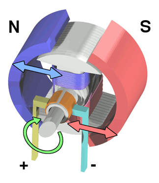


**Brushless DC Motor**  无刷直流电动机
- *Armature* is fixed, and permanent magnets rotate    
  电枢固定，永久磁铁旋转
  > - **Advantages**: Efficiency, Low noise, Cooling, Water-resistant  
  >     优点：效率高、噪音低、散热、耐水
  > - **Disadvantages**: low percision, costly  
  >     缺点：精度低，成本高

  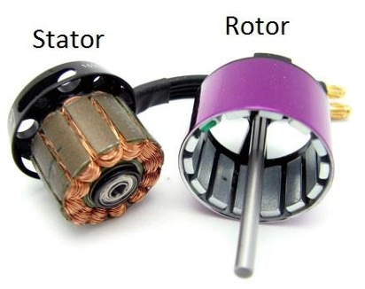


**Stepper Motor**  步进电动机
- Brushless, synchronous motor that moves in discrete steps  
  无刷、同步电机，以离散步进运动
  > - Advantage: Precise, quantized control without feedback  
  >   优点：精确、量化控制，无需反馈
  > - Disadvantages: Slow and moves in discrete steps, expensive  
  >   缺点：速度慢，以离散步进移动，成本高

  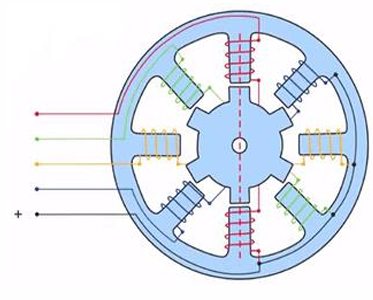

---

#### Hydraulic  液压

（大概率出题）
**Cylinders(linear actuators)**:  气缸（线性执行器）
> - Advantages:
>   - Very powerful that offer very large force capability, but expensive  
>     非常强大，提供极大的力输出，但成本高
>   - High power-to-weight ratio  
>     功率与重量比高
> - Drawbacks:
>   - Their power supplies are bulky and heavy  
>     电源体积大且沉重
>   - Oil leakage  
>     漏油问题

> $$
> Force = Pressure * Area
> $$
> 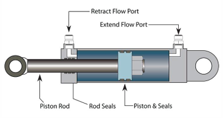
> 
> force for extending the rod with max P:   
> $A1 = \pi R_1^2$  
> $F = P * A_1$
> 
> force for retracting the rod with max P:  
> $A = \pi R_1^2 - \pi R_2^2$  
> $F = P * A$
> 
> 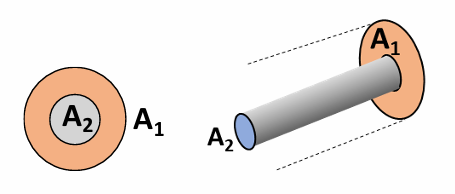

**Motors(rotary actuators)**  马达（旋转执行器） 


**Integrated Smart Hydraulic Actuator**  
集成智能液压执行器
- Usual hydraulic actuator-valve configuration  
  常见的液压执行器-阀门配置

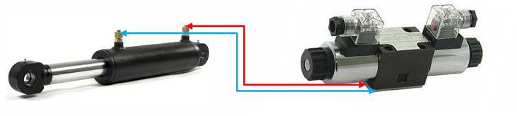

---

#### Pneumatic  气动

**Cylinders(linear actuators)**  
气缸（线性执行器）

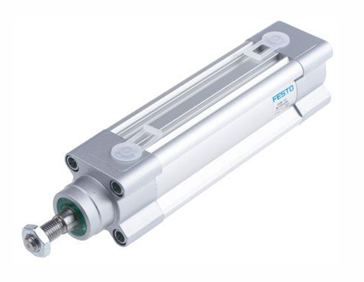

**Motors(rotary actuators)**  
马达（旋转执行器）

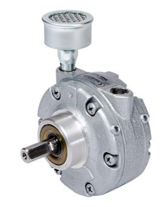

---

### Sensors 传感器

**Motivation**
- A robot would be easily controlled if a complete model of the environment was available for the robot, and if tis actuators could execute motion commands perfectly relative to this model  
  如果机器人拥有完整的环境模型，并且其执行器能够相对于该模型完美执行运动命令，则机器人将更容易控制。
- Sensors only measure a physical quantity

---

#### Robotic sensor calssification

> - **Proprioceptive**  本体感知
>   - Internal state of the robot  机器人的内部状态
>   - Measures values (e.g. wheels position, joint angle, battery level, etc)
> - **Exteroceptive**  外感知
>   - External state of the system  系统的外部状态
>   - Observing environment, detecting objects, etc

> - **Active**  主动
>   - Emits energy(e.g. radar)
> - **Passive**  被动
>   - Receives energy(e.g. camera)

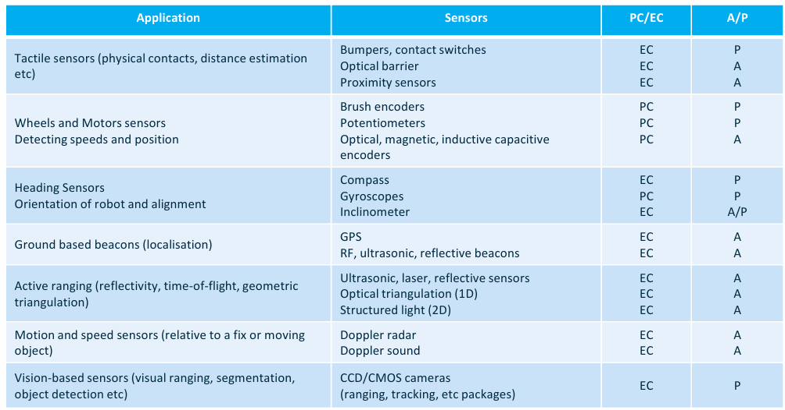

Real-world Characteristics of sensors
- **Sensitivity**: Ratio of output change to input change  
  灵敏度：输出变化与输入变化的比率
- **Error/Accuracy**: Difference between the sensor's output and the true value  
  误差/准确度：传感器输出与真实值之间的差异
  - **Systematic/Deterministic Error**: Caused by factors that can be modelled(in theory), e.g., calibration of a laser sensor  
      系统/确定性误差：由可建模的因素引起（理论上），如激光传感器的校准
  - **Random Error**: e.g., hue instability of camera, black level noise of camera  
      随机误差：如相机色调不稳定、相机的黑电平噪声
- **Reproducibility**: Reproducibility of sensor results  
  再现性：传感器结果的可重复性

#### Various sensors overview

Mechanical switches 机械开关
- A simple On/Off switch 简单的开关
- Titl sensor(mercury titl)  倾斜传感器（汞倾斜）
- Dual axis inclinometer  双轴倾斜仪
- Potentiometer  电位器
- Bumpers  缓冲器

Light sensors 光传感器
- Photoresistors, light dependent resistors(LDR) 光敏电阻(LDR)
- Phototransistors  光电晶体管

Thermal sensor 热传感器
- Thermal resistor 热敏电阻 
- Temperature sensors 温度传感器
  - Analogue 模拟
  - Digital 数码

Proximity sensors  接近传感器
- Non-contact 非接触式
  - Devices that can be used in areas that are near to an object to be sensed  
    可用于靠近要感测物体的区域的设备
- Different types of Proximity Sensors  
  不同类型的近距离传感器
  - Infrared 红外
  - Ultrasonic 超声波
  - Inductive  电感
  - Capacitive  电容

Position Sensors 位置传感器
- Potentiometer  电位器
- Resolver  解析器
- Optical Encoders 光学编码器
  - Relative position 相对位置
  - Absolue position 绝对位置

Heading sensors:  方位传感器
- Heading sensors can be proprioceptive(gyroscope, inclinometer) or exteroceptive(compass)  
  方位传感器可以是本体感知（陀螺仪、倾角仪）或外感知（指南针）
- Used to determine the robots orientation and inclination  
  用于确定机器人的方位和倾斜角

Accelerometer 加速度计
- be made to sense acceleration by simply measuring the force on a mass  
  通过简单测量质量上的力来感应加速度

Gyroscope  陀螺仪
- Heading seonsors for measuring and to keep the orientation to a fixed frame  
  用于测量和保持相对于固定框架的方向的方位传感器
- Two methods:
  - Mechanical(flywheel) 机械(飞轮)
  - Electronic 电子

---

### Components used for Manipulators 机械臂中使用的部件

- Components in a joint:
  - **Moters**(electric or hydraulic)
  - **Moter Encoders**
    - Angle(joint angle)  角度(关节角度)
    - Displacement sensor  位移传感器
  - Gearbox  齿轮箱

---

## Lecture 3 - Manipulators

---

### Robotic Manipulators 机械臂

Benefits in repetitive operation:
- Increase volume / capacity 增加容量
- Improve quality and consistency 改进质量
- Untouched by human hand 不能人手触碰
- Reduce wastage 减少浪费
- "Up skilling" of work force 技能提升

> A **Return On Investment**(ROI 回报率) study would be performed to quatify these factors and justify the investment in a bespoke robotics solution

---

### joints 关节

- Different types of joints
  - Revolute Joint 旋转关节
    - 绕固定轴旋转，自由度(DOF)为1
    - 
  - Prismatic Joint 伸缩关节
    - 可以沿直线滑动，自由度(DOF)为1
    - 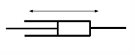
  - Cylindrical Joint 圆柱关节
    - 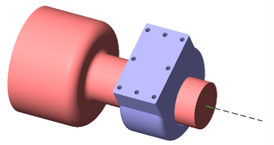
  - Spherical Joint 球形关节
    - 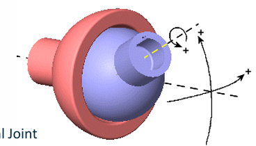
  - Universal Joint 万向关节
    - 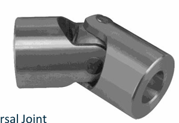

---

### Manipulators 机械臂

- Different types of manipulator:
  - **Cartesian** PPP 笛卡尔型
    - 三个线性关节，适合直线运动
    - 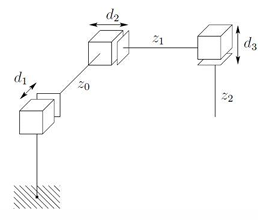
  - **Cylindrical** RPP 圆柱型
    - 适合具有圆柱形工作空间的任务
    - 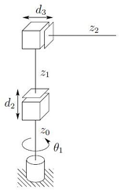
  - **Spherical** RRP 球型
    - 适合球型工作空间
    - 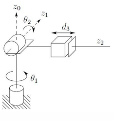
  - **Articulated** RRR 关节型
    - 更加灵活，常用于需要复杂运动的任务中
    - 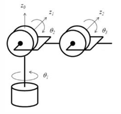
  - SCARA, RRP (Selective Compliance Assembly Robot Arm 选择顺应性装配机械手臂)
    - 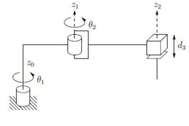

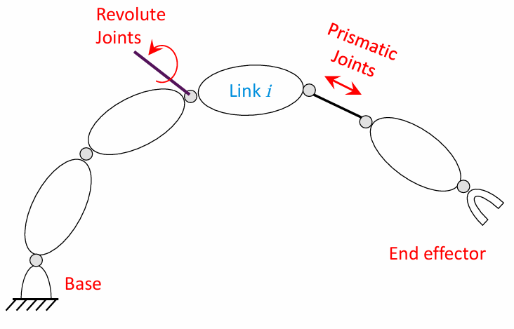

- Links
  - n moving link(s) n个活动连杆
  - 1 fixed link 固定基座
- joints
  - Revolute (1 DOF)
  - Prismatic (1 DOF)

- Position Parameters 位置参数
  - Position parameters describe the full configuration of the system  
    位置参数描述了系统的完整配置

n links -> 9n parameters (3 vectors: Each vector has 3 parameters)

**Generalised coordinates**: A set of independent configuration parameters  
**Degreee of Freedom**: Number of generalised coordinates

- We need 6 DOF to have access to all space
  - 3 DOF: Position 位置
  - 3 DOF: Orientation 姿态

> Revolute and prismatic joints have 1 DOF

- Generalised coordinates 广义坐标
  - A set of independent configuration parameters 独立参数
  - Each rigid body(刚体) needs 6 parameters to be described
    - 3 positions
    - 3 orientations
  - For n rigid body, we need 6n parameters
  - Constrains myst be applied:
    - Each joint has 1DOF, so 5 constrains will be introduced
    > n moving links -> 6n parameters  
    > n joints -> 5n constrains  
    > n DOF  
    > This is for manipulator with fixed base

- End effectors configuration 末端执行器配置
  - End effector is the last rigid-body and it has all the freedom from previous links  
    末端执行器是最后一个刚体，它具有先前链接的所有自由度
  - A set of parameters describing position and orientation of the end effector: $(x_1, x_2, x_3, ... , x_m)$ with respect to {0}  
    一组描述末端执行器位置和方向的参数：$(x_1, x_2, x_3, ... , x_m)$ 相对于 {0}
    > $O_{n+1}$: is operational coordinates(task coordinates)  
    > $O_{n+1}$：是操作坐标（任务坐标）
  - A set of $x_1, x_2, x_3, ... , x_{m_o}$ of $m_o$ independent configuration parameters  
    一组 $x_1, x_2, x_3, ... , x_{m_o}$ 的 $m_o$ 独立配置参数
  - $m_o$ is number of DOF of the end effector, max 6 DOF  
    $m_o$ 是末端执行器的自由度数，最大 6 DOF 终止执行器自由度最高为 6

- End effector, Joint coordination 末端执行器，关节坐标
  - Joint space (configuration space) is the space that a manipulator is represented as a point.  
    关节空间（配置空间）是将操纵器表示为点的空间。
  - (x,y) is a vector for position of end effector $\alpha$ defines orientation(angle) of end effector  
    (x,y) 是末端执行器位置的向量 $\alpha$ 定义末端执行器的方向（角度）
  - Defines: operational coordinates -> operational space  
    定义：操作坐标 -> 操作空间

- Redundancy 冗余
  - A manipulator is Redundant if 
    $$
      n > m 
    $$
    > n number of DOF of the manipulator  
    > m number of DOF of the end effector(operational space)  
    > Degreee of Redundancy: n - m  

---

## Lecture 4 - Kinematics

---

### Spatial Description

- Position of a Point 点的位置
  - With respect to a fixed origin O, the position of a point P is described by the vector OP(p)  
    相对于固定原点 O, 点 P 的位置由向量 OP(p) 描述  
  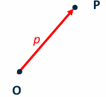

- Coordinate Frames:
  - Rotation
  - Translation

- Rigid body configuration:
  - Position: $^AP$
  - Orientation: {^AX_B, ^AY_B, ^AZ_B}

> These vectors describe rotation of {B} with respect to {A}

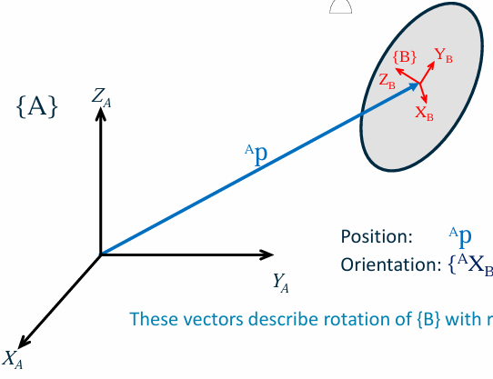

---

### Transformation

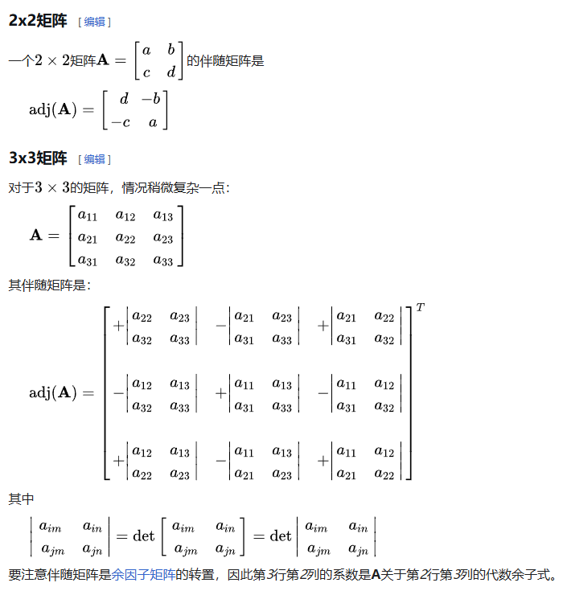

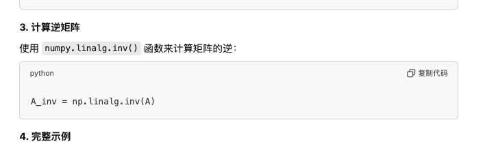

---

#### Rotation

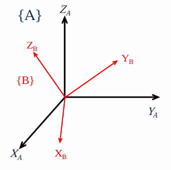

- Rotation Matrix:
  $$
    ^A_BR 
    = \begin{bmatrix}
      r_{11} & r_{12} & r_{13} \\
      r_{21} & r_{22} & r_{23} \\
      r_{31} & r_{32} & r_{33}
      \end{bmatrix} 
    = \begin{bmatrix} ^A \hat{X}_B & ^A \hat{Y}_B & ^A \hat{Z}_B \end{bmatrix}
    = \begin{bmatrix} {^B \hat{X}_A}^T \\ {^B \hat{Y}_A}^T \\ {^B \hat{Z}_A}^T \end{bmatrix} = {^B_A R}^T
    = \begin{bmatrix} 
      \hat{X}_B \cdot \hat{X}_A & \hat{Y}_B \cdot \hat{X}_A & \hat{Z}_B \cdot \hat{X}_A\\ 
      \hat{X}_B \cdot \hat{Y}_A & \hat{Y}_B \cdot \hat{Y}_A & \hat{Z}_B \cdot \hat{Y}_A\\ 
      \hat{X}_B \cdot \hat{Z}_A & \hat{Y}_B \cdot \hat{Z}_A & \hat{Z}_B \cdot \hat{Z}_A 
      \end{bmatrix}
  $$
  > - Inverse of Rotation Matrix(Orthonormal Matrix)
  >   $$
  >     ^A_BR^{-1} =\ ^B_AR =\ ^A_BR^T
  >   $$

- State description: $^A\hat{X}_B = ^A_BR\ \ ^B\hat{X}_B$

$$
  ^A \hat{X}_B = {^A_B R} \begin{bmatrix} 1 \\ 0 \\ 0 \end{bmatrix}\\
  ^A \hat{Y}_B = {^A_B R} \begin{bmatrix} 0 \\ 1 \\ 0 \end{bmatrix}\\
  ^A \hat{Z}_B = {^A_B R} \begin{bmatrix} 0 \\ 0 \\ 1 \end{bmatrix}
$$

- Dot product:
  $$
    ^A \hat{X}_B 
    = \begin{bmatrix} \hat{X}_B \cdot \hat{X}_A \\ \hat{X}_B \cdot \hat{Y}_A \\ \hat{X}_B \cdot \hat{Z}_A \end{bmatrix}\\
    ^A \hat{Y}_B 
    = \begin{bmatrix} \hat{Y}_B \cdot \hat{X}_A \\ \hat{Y}_B \cdot \hat{Y}_A \\ \hat{Y}_B \cdot \hat{Z}_A \end{bmatrix}\\
    ^A \hat{Z}_B 
    = \begin{bmatrix} \hat{Z}_B \cdot \hat{X}_A \\ \hat{Z}_B \cdot \hat{Y}_A \\ \hat{Z}_B \cdot \hat{Z}_A \end{bmatrix}
  $$

- Description of a Frame:
  - Frame{B}: $^A \hat{X}_B, ^A \hat{Y}_B,  ^A \hat{Z}_B$, $^AP_{Borg}$
  $$
    \{B\} = \{^A_BR\space\space^AP_{Borg}\}
  $$
- Mapping:
  - Changing descriptions from frame to frame
- Rotations  
  
  - If $P$ is in $\{B\}$: $^BP$
  $$
    ^AP = \begin{bmatrix}
            ^B \hat{X}_A. ^BP \\ ^B \hat{Y}_A. ^BP \\ ^B \hat{Z}_A. ^BP
          \end{bmatrix}
        = \begin{bmatrix}
            ^B \hat{X}_A^T \\ ^B \hat{Y}_A^T \\ ^B \hat{Z}_A^T
          \end{bmatrix}
          \cdot\ ^BP
  $$
  $$
    ^AP =\ ^A_BR\ ^BP
  $$

---

#### Translation


$$
  ^AP_{OA} = ^AP_{OB} + ^AP_{BOrg}
$$

---

#### General Transformation

$$
  ^AP =\ ^A_BR\ ^BP +\ ^AP_{Borg} \\
  \begin{bmatrix}
    ^AP \\ 
    1
  \end{bmatrix}
  = \begin{bmatrix}
    ^A_BR &\ ^AP_{Borg} \\
    0\ 0\ 0 & 1
  \end{bmatrix}
  = \begin{bmatrix}
    ^BP\\
    1
  \end{bmatrix}
$$

- Homogeneous Transformation:
  $$
    ^AP_{(4\times1)} =\ ^A_BT_{(4\times4)}\ ^BP_{(4\times1)}
  $$

- General Operators:
  $$
    P_2 = 
    \begin{bmatrix}
      R_k(\theta) & Q \\
      0\ 0\ 0 & 1
    \end{bmatrix}P_1
  $$
  $$
    P_2 = T\ P_1
  $$

- Inverse Transform
  $$
    ^A_B T = \begin{bmatrix} 
    ^A_B R & ^A P_{Borg} \\ 
    0\ 0\ 0 & 1 \end{bmatrix}
  $$

  $$
    ^A_B T^{-1} = ^B_A T = 
    \begin{bmatrix} 
    ^A_B R^T & -^A_B R^T \cdot\ ^AP_{Borg} \\ 
    0\ 0\ 0 & 1 \end{bmatrix}
  $$

- Homogeneous Transform Interpretations:
  - Description of a frame  
    
    $$
      ^A_BT:\{B\} = \{^A_BR\ \ ^AP_{Borg}\}
    $$

  - Transform mapping  
    
    $$
      ^A_BT:\ ^BP \rarr\ ^AP
    $$

  - Transform operator  
    
    $$
      T: P_1 \rarr P_2
    $$

- Compound Transformation:
  $$
  B_P = ^B_C T \ C_P
  $$

  $$
  A_P = ^A_B T \ B_P
  $$

  $$
  A_P = ^A_B T \ ^B_C T \ C_P
  $$

  $$
  ^A_C T = ^A_B T \ ^B_C T
  $$

  $$
  ^A_C T = \begin{bmatrix} ^A_B R \ ^B_C R & ^A_B R \ ^B P_{Corg} + ^A P_{Borg} \\ 0\ 0\ 0 & 1 \end{bmatrix}
  $$

- Transform Equation
  $$
    ^A_B T \ ^B_C T \ ^C_D T \ ^D_A T = I
  $$

---

#### Representations

- End-effector Configuration  
  
  $$
    ^B_ET: Position + Orientation
  $$
- End-effector configuration parameters:
  $$
    X = \begin{bmatrix}
      X_P \\
      X_R
    \end{bmatrix}
  $$

- Position representation:  
  
  - Cartesian: (x, y, z)
  - Cylindrical: $(\rho, \theta, z)$
  - Spherical: $(r, \theta, \phi)$

---

## Lecture 5 - Manipulator Kinematics

### Link Description


- $\vec{a}_{i-1}$: Link Length - mutual perpendicular  
- $\vec{\alpha}_{i-1}$: Link Twist - angle between axes $i$ and $i-1$

#### Link Connection:


- $d_i$ is link offset, constant for revolting joint and variable for prismatic
- $\theta_i$ is joint angle, variable for revolting joint and constant for prismatic

#### First and last links:

$a_i$ and $\alpha_i$ depend on joint axes $i$ and $i + 1$

Convention:
$$
  a_0 = a_n = 0 \text{ and } \alpha_0 = \alpha_n = 0
$$

- First link:  
  

- Last link:  
  

- Denavit-Hartenberg(D-H) Parameters:
  - Four D-H parameters are $(\alpha_i, a_i, d_i, \theta_i)$
- Three fixed link parameters and
- One joint variable:$\left\{\begin{array}{ll}\theta_i & \text{Revolute joint} \\d_i & \text{Prismatic joint}\end{array}\right.$

> - $\alpha_i$ and $a_i$ describe the link $i$
> - $d_i$ and $\theta_i$ connection between the links

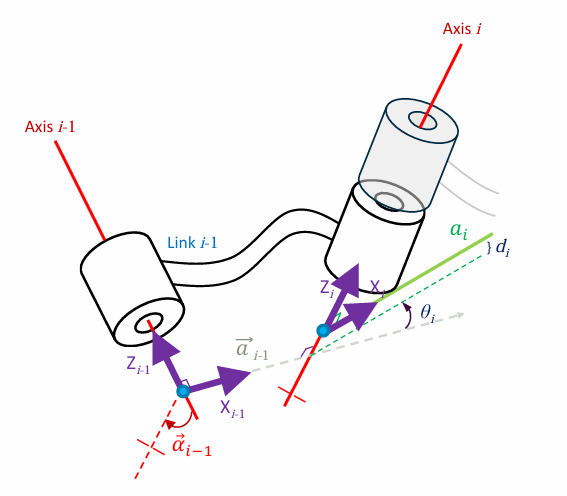

#### Frame attachment

1. Common Normals
2. Origins
3. Z-axis
4. X-axis


Intersecting Joint Axes:  
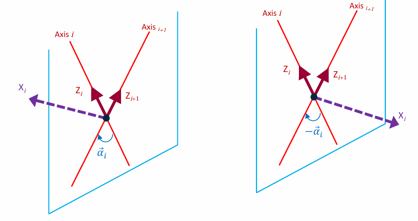

#### Summary


$\alpha_i$: angle between $z_i$ and $z_{i+1}$ about $x_i$
$a_i$: distance between $z_i$ and $z_{i+1}$ along $x_i$

$d_i$: distance between $x_{i-1}$ and $x_i$ along $z_i$
$\theta_i$: angle between $x_{i-1}$ and $x_i$ about $z_i$

- Forward Kinematics:  
  $$
    ^{i-1}_iT = ^{i-1}_RT\ ^R_QT\ ^Q_PT\ ^P_iT
  $$

  $$
  {}^{i-1}_i T(\alpha_{i-1}, a_{i-1}, \theta_i, d_i) = R_x(\alpha_{i-1}) D_x(a_{i-1}) R_z(\theta_i) D_z(d_i)
  $$

  $$
  {}^{i-1}_i T =
  \begin{bmatrix}
  c\theta_i & -s\theta_i c\alpha_{i-1} & s\theta_i s\alpha_{i-1} & a_{i-1} c\theta_i \\
  s\theta_i & c\theta_i c\alpha_{i-1} & -c\theta_i s\alpha_{i-1} & a_{i-1} s\theta_i \\
  0 & s\alpha_{i-1} & c\alpha_{i-1} & d_i \\
  0 & 0 & 0 & 1
  \end{bmatrix}
  $$

- Symbols:
  - Revolute Joints:  
    
  - Prismatic joints:  
    

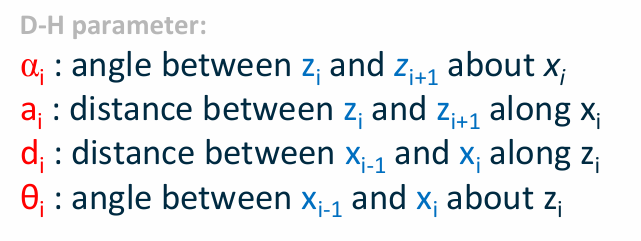


## Lecture 6

Dynamics:
$$
  \dot{x} = v · \cos\theta\\
  \dot{y} = v · \sin\theta\\
  \dot{\theta} = \omega
$$

The nonholonomic constraint:
$$
  \dot{x}\sin\theta - \dot{y}\cos\theta = 0
$$

- The resultant forward velocity through $C$(the centre of mass)
  $$
    v = r(\frac{\omega_r + \omega_l}{2})
  $$
- The steering velocity:
  $$
    \omega = r(\frac{\omega_r - \omega_l}{l})
  $$

- The configuration transition equations may be given as
  $$
    \dot{x} = r\frac{\omega_r + \omega_l}{2}\cos\theta\\
    \dot{y} = r\frac{\omega_r + \omega_l}{2}\sin\theta\\
    \dot{\theta} = r\frac{\omega_r - \omega_l}{l}
  $$
  $$
  \begin{bmatrix}
  v \\
  \omega
  \end{bmatrix}
  =
  \begin{bmatrix}
  r/2 & r/2 \\
  r/l & -r/l
  \end{bmatrix}
  \begin{bmatrix}
  \omega_r \\
  \omega_l
  \end{bmatrix}
  $$

### Dead Recokoning

Kinematic model for a differential robot model
$$
\frac{d}{dt}
\begin{bmatrix}
s_x \\
s_y \\
s_\theta
\end{bmatrix}
=
\begin{bmatrix}
\cos(s_\theta) & 0 \\
\sin(s_\theta) & 0 \\
0 & 1
\end{bmatrix}
\begin{bmatrix}
v \\
\omega
\end{bmatrix}
$$

The robot pose: $\mathbf{s}_k=\begin{bmatrix}S_x&&S_y&&S_\theta\end{bmatrix}^T$

The robot inputs: $\mathbf{u}_k=\begin{bmatrix}v&\omega\end{bmatrix}^T$

If $\Delta t$ is the sampling time , then it is possible to compute the incremential linear and angular Displacement, $\Delta d$ and $\Delta \theta$, as follows:
$$
\begin{aligned}&\Delta d=v\cdot\Delta t\quad\Delta\theta=\omega\cdot\Delta t\\&\begin{bmatrix}\Delta d\\\Delta\theta\end{bmatrix}=\begin{bmatrix}1/2&1/2\\1/l&-1/l\end{bmatrix}\begin{bmatrix}\Delta d_r\\\Delta d_l\end{bmatrix}\end{aligned}
$$

To compute the pose of the robot at any given time step, the kinematic model must be numerically integrated.

This approximation follows the **Markov assumption** where the current robot pose depends only on the previous pose and the input velocities
$$
  \begin{bmatrix}
    S_{x,k}\\S_{y,k}\\S_{\theta,k}\end{bmatrix}=\begin{bmatrix}S_{x,k-1}\\S_{y,k-1}\\S_{\theta,k-1}\end{bmatrix}+\begin{bmatrix}\Delta d\cos\bigl(s_{\theta,k-1}\bigr)\\\Delta d\sin\bigl(s_{\theta,k-1}\bigr)\\\Delta\theta
  \end{bmatrix}
  $$

#### Gaussian Distributions

The Guassian distribution (or normal distribution) is denoted by
$$
  \mathbf{s}_k{\sim}\mathcal{N}(\mathbf{\mu}_k,\mathbf{\Sigma}_k).
$$

A random varibale $X$ is noramlly distributed, or Gaussian, if its probability density function is defined as:
$$
  p_X(x)=\frac{1}{\sqrt{2\pi\sigma^2}}exp\left(-\frac{(x-\mu_X)^2}{2\sigma^2}\right)
$$

**Affine Transformation**

Consider $X \sim \mathcal{N} (\boldsymbol{\mu}_X,\boldsymbol{\Sigma}_X)$ in $\R^n$, and let $Y = \mathbf{A}X + \boldsymbol{b}$ be the affine transformation, where $\mathbf{A} \in \R^{m \times n}$ and $\mathbf{b} \in \R^m$. Then, the random vector $Y \sim \mathcal{N} (\boldsymbol{\mu}_X,\boldsymbol{\Sigma}_Y)$ such that:
$$
  \begin{aligned}\boldsymbol{\mu}_Y&= \mathbf{A}\boldsymbol{\mu}_X + \mathbf{b}\\\\\boldsymbol{\Sigma}_Y&=\mathbf{A}\boldsymbol{\Sigma}_X\mathbf{A}^T\end{aligned}
$$

In the context of probability, the robot pose at time step $k$, denoted by $s_k$, can be described with Markov assumption as function of previous robot pose $s_{k-1}$ and the current control input $\mathbf{u}_{k}=[v_{k}\quad\omega_{k}]^{T}$. This process is called the robot motion model.
$$
\mathbf{s}_k=\mathbf{h}(\mathbf{s}_{k-1},\mathbf{u}_k)+\mathbf{q}_k
$$
where $q_k$ is an additive Gaussian noise such that $\mathbf{q}_k{\sim}\mathcal{N}(\mathbf{0},\mathbf{Q}_k)$, and $Q_k$ is a positive semidefinite covariance matrix.

The function $\mathbf{h}(\mathbf{s}_{k-1},\mathbf{u}_k)$ is generally nonlinear, and in the case of a differential-drive robot, this fucntion is defined as:
$$
  \mathbf{h}(\mathbf{s}_{k-1},\mathbf{u}_{k})=\begin{bmatrix}s_{x,k-1}+\Delta t\cdot v_k.\cos\bigl(s_{\theta,k-1}\bigr)\\s_{y,k-1}+\Delta t\cdot v_k.\sin\bigl(s_{\theta,k-1}\bigr)\\s_{\theta,k-1}+\Delta t\cdot\omega_k\end{bmatrix}
$$

Assume that the robot pose at time step $k - 1$ is given by a Gaussian distribution such that $\mathbf{s}_{k-1}{\sim}\mathcal{N}(\boldsymbol{\mu}_{k-1},\boldsymbol{\Sigma}_{k-1})$

Then, the above setup can be used to estimate the robot pose at time step k by linearising the robot motion model using first-order Taylor expansion around $\mu_k$ as follows
$$
  \mu_k=\mathbf{h}(\mu_{k-1},\mathbf{u}_k)
$$

The following equation represents the Jacobian matrix of $\mathbf{h}(\mu_{k-1},\mathbf{u}_k)$ with respect to each variable in $s_{k-1}$, evaluated at $s_{k-1} = \mu_{k-1}$
$$
  \mathbf{H}_{k}=\nabla_{\mathbf{s}_{k}}\mathbf{h}(\mathbf{s}_{k-1},\mathbf{u}_{k})\Big|_{\mathbf{s}_{k-1}=\mu_{k-1}}
$$
and the pose $s_k$ is computed using the linearised system:
$$
  \mathbf{s}_k\approx\mathbf{\mu}_k+\mathbf{H}_k(\mathbf{s}_{k-1}-\mathbf{\mu}_{k-1})
$$

In the case of a differential-drive robot, the Jacobian $H_k$ is computed as follows:
$$
\mathbf{h}(\mathbf{s}_{k-1},\mathbf{u}_k)=\begin{bmatrix}s_{x,k-1}+\Delta t\cdot v_k.\cos(s_{\theta,k-1})\\s_{y,k-1}+\Delta t\cdot v_k.\sin(s_{\theta,k-1})\\s_{\theta,k-1}+\Delta t\cdot\omega_k\end{bmatrix}
$$
$$
\begin{gathered}\mathbf{H}_{k}=\begin{bmatrix}\frac{\partial h_1}{\partial s_{x,k}}&\frac{\partial h_1}{\partial s_{y,k}}&\frac{\partial h_1}{\partial s_{\theta,k}}\\\frac{\partial h_2}{\partial s_{x,k}}&\frac{\partial h_2}{\partial s_{y,k}}&\frac{\partial h_2}{\partial s_{\theta,k}}\\\frac{\partial h_3}{\partial s_{x,k}}&\frac{\partial h_3}{\partial s_{y,k}}&\frac{\partial h_3}{\partial s_{\theta,k}}\end{bmatrix}\\=\begin{bmatrix}1&0&-\Delta t\cdot v_k\cdot\sin(\mu_{\theta,k-1})\\0&1&\Delta t\cdot v_k\cdot\cos(\mu_{\theta,k-1})\\0&0&1\end{bmatrix}\end{gathered}
$$

Since the robot motion model is linearised and all uncertainties are Gaussians, it is possible to compute the covariance $\Sigma_k$ associated with the robot pose at time step $k$ using the properties of Gaussians:
$$
\Sigma_k = H_k \Sigma_{k-1} H_k^T + Q_k
$$

#### Pose covariance matrix

- Consider the following motion model for a differential drive robot:
  $$
    \boldsymbol{h}\big(\boldsymbol{s}_{k},\omega_{r,k},\omega_{l,k}\big)=\begin{bmatrix}s_{x,k-1}+r\Delta t \frac{\omega_{r,k}+\omega_{l,k}}{2}\cos( s_{\theta,k-1}\big)\\s_{y,k-1}+r\Delta t \frac{\omega_{r,k}+\omega_{l,k}}{2}\sin( s_{\theta,k-1}\big)\\s_{\theta,k-1}+r\Delta t \frac{\omega_{r,k}-\omega_{l,k}}{l}\end{bmatrix}
  $$
  where $\omega_{r,k}$ and $\omega_{l,k}$ are the right and left wheel angular velocity at time step keep

- Now assume the noise in both right and left wheel angular velocities to be zero-mean Gaussian distribution such that:
  $$
  \begin{bmatrix}
  \omega_{r,k} \\
  \omega_{l,k}
  \end{bmatrix}
  \sim \mathcal{N}(0, \Sigma_{\Delta,k})
  $$
  $$
  \Sigma_{\Delta,k} = 
  \begin{bmatrix}
  k_r |\omega_{r,k}| & 0 \\
  0 & k_l |\omega_{l,k}|
  \end{bmatrix}
  $$
  where $k_r$ and $k_l$ are constants representing the error associated with computing the angular velocity by each wheel.
- These constants are related to the traction between the wheels and the floor surface or the encoder noise used to compute the wheel displacements.
- Larger angular speed of the right motor $|\omega_{r,k}|$ will lead to a larger variance of that motor $k_r |\omega_{r,k}|$.

- It is possible to propagate this noise $\Sigma_{\Delta, k}$ to be seen from the robot state prospective using Taylor series expansion as follows:

$$
Q_k = \nabla_{\omega_k} \cdot \Sigma_{\Delta, k} \cdot \nabla_{\omega_k}^T
$$

$$
\nabla_{\omega_k} =
\begin{bmatrix}
\frac{\partial h_1}{\partial \omega_{r,k}} & \frac{\partial h_1}{\partial \omega_{l,k}} \\
\frac{\partial h_2}{\partial \omega_{r,k}} & \frac{\partial h_2}{\partial \omega_{l,k}} \\
\frac{\partial h_3}{\partial \omega_{r,k}} & \frac{\partial h_3}{\partial \omega_{l,k}}
\end{bmatrix}
=
\frac{1}{2}r\Delta t
\begin{bmatrix}
\cos(s_{\theta, k-1}) & \cos(s_{\theta, k-1}) \\
\sin(s_{\theta, k-1}) & \sin(s_{\theta, k-1}) \\
\frac{2}{l} & -\frac{2}{l}
\end{bmatrix}
$$

#### Point Stabilisation

The goal can be defined in the simplest way as a set of coordinates in a multidimensional space. For instance, if the robot is moving in a two dimensional space the goal is:

$X_g=\begin{pmatrix}x_g\\y_g\end{pmatrix}$ if the position of the robot needs to be controlled, or

$X_g=\begin{pmatrix}x_g\\y_g\\\theta_g\end{pmatrix}$ if both position and heading need to be controlled

In order to design the controller we first need to define the robot inputs, robot pose and the goal. For a non-holonomic robot moving in a 2D environment the robot pose can be represented by the vector
$$
  \boldsymbol{\rho}_r=\begin{pmatrix}x_r\\y_r\\\theta_r\end{pmatrix}
$$
The inputs are the linear and angular velocity of the robot
$$
v_r=\binom{v_r}{\omega_r}
$$

For the sake of simplicity, in this course, the goal is defined only by a 2D set of coordinates $X_g=\begin{pmatrix}x_g\\y_g\end{pmatrix}$

Then compute the errors by using the goal coordinates and robot position as in the following:
$$
  e_{x}= x_{g}-x_{r}\\e_{y}= y_{g}-y_{r}\\e_{\theta}= atan2(e_{y},e_{x})-\theta_{r}
$$

The robot position is assumed to be known and can be computed using various localisation techniques as Dead Reckoning. The equations for the error can be represented in vector format as follows:
$$
  \boldsymbol{e}=\begin{pmatrix}e_x\\e_y\\e_\theta\end{pmatrix}
$$
The general form of the control law can be written as:
$$
\begin{pmatrix}
v_r \\
\omega_r
\end{pmatrix}
=
K
\begin{pmatrix}
e_x \\
e_y \\
e_\theta
\end{pmatrix}
$$
where
$K =
\begin{pmatrix}
k_{11} & k_{12} & k_{13} \\
k_{21} & k_{22} & k_{23}
\end{pmatrix}$, is the control matrix

For simplicity the six controller gain parameters can be reduced to only two by defining the distance error:
$$
e_d = \sqrt{e_x^2 + e_y^2}
$$
The control law can now be written as:
$$
  v_r = K_de_d\\
  \omega_r = K_\theta e_\theta
$$

Closed-loop control block diagram:  


## Lecture 7

### Proportional Control

$$
  c(e) = K_pe
$$

### Proportional-Integral(PI) Control

$$
  c(e)=K_pe(t)+K_i\int_0^te(t)dt
$$

### Proportional-Integral-Derivative(PID) Control

$$
  c(e)=K_pe(t)+K_i\int_0^te(t)dt+K_d\frac d{dt}e(t)
$$

### Summary of Tuning Tendencies

| Response | Rise Time    | Overshoot   | Settling Time | Steady-State Error |
|----------|--------------|-------------|---------------|--------------------|
| $K_p$    | Decrease     | Increase    | Small change  | Decrease           |
| $K_I$    | Decrease     | Increase    | Increase      | Eliminate          |
| $K_D$    | Small change | Decrease    | Decrease      | No change          |

#### Advantages of PID Control

1. Robustness: PID controllers are inherently robust. They can handle various disturbances and changes in the system, such as variations in load, setpoint changes, or changes in system parameters, and still maintain stable control.  
   稳健性：PID 控制器天生就具有稳健性。它们可以处理系统中的各种干扰和变化，例如负载变化、设定点变化或系统参数变化，同时仍能保持稳定的控制。
2. Stability: Properly tuned PID controllers ensure system stability. They prevent the system from oscillating or becoming uncontrollable, which is crucial in many industrial applications to ensure safety and efficiency.  
   稳定性：经过适当调整的 PID 控制器可确保系统稳定性。它们可防止系统振荡或变得无法控制，这对于许多工业应用中的安全性和效率至关重要。
3. Ease of Implementation: PID controllers are relatively straightforward to implement, both in hardware and software. This simplicity makes them cost- effective and suitable for a wide range of applications.  
   易于实施：PID 控制器在硬件和软件方面都相对容易实施。这种简单性使它们具有成本效益，适用于广泛的应用。
4. Tuning Flexibility: While PID controllers require tuning to match the specific system, there are well-established methods for tuning PID parameters, such as the Ziegler-Nichols method.  
   调整灵活性：虽然 PID 控制器需要调整以匹配特定系统，但有成熟的方法来调整 PID 参数，例如 Ziegler-Nichols 方法。
5. Linear and Nonlinear Systems: PID controllers can be applied to linear and nonlinear systems.  
   线性和非线性系统：PID 控制器可应用于线性和非线性系统。

#### Disadvantages of PID Control

1. Tuning Challenges: Tuning PID parameters can be a complex and time-consuming task. Finding the right set of parameters to ensure optimal performance can be challenging.  
   调整挑战：调整 PID 参数可能是一项复杂且耗时的任务。找到正确的参数集以确保最佳性能可能具有挑战性。
2. Integral Windup: In cases where the system experiences long periods of sustained error (e.g., saturation or integrator windup), the integral term can accumulate excessively, causing a large overshoot or instability.  
   积分饱和：在系统经历长时间持续误差（例如饱和或积分器饱和）的情况下，积分项可能会过度累积，从而导致较大的过冲或不稳定。
3. Not Ideal for Dead Time Dominant Systems: Systems with significant dead time (delay between a control action and its effect on the process) can be challenging for PID control.  
   不适合死区时间主导系统：具有显着死区时间（控制动作与其对过程的影响之间的延迟）的系统对于 PID 控制来说可能具有挑战性。
4. Limited Performance for Multivariable Systems: PID controllers are typically designed for single-input, single-output (SISO) systems. When dealing with complex, multivariable systems, multiple PID controllers may need to be coordinated.  
   多变量系统的性能有限：PID 控制器通常设计用于单输入、单输出 (SISO) 系统。在处理复杂的多变量系统时​​，可能需要协调多个 PID 控制器。
5. Not Suitable for Some Highly Dynamic Systems: In systems with extremely fast dynamics or systems that require advanced control strategies, such as those in aerospace or high-speed manufacturing, PID control may not be sufficient to achieve the desired performance.  
   不适合某些高动态系统：在具有极快动态的系统或需要高级控制策略的系统中，例如航空航天或高速制造中的系统，PID 控制可能不足以实现所需的性能。

### Matrix Exponential

- Similarly, if A is a matrix, the Taylor expansion of $e^A$ is
  $$
    e^A=I+A+\frac{A^2}{2!}+\frac{A^3}{3!}+\cdots=\sum_{k=0}^{\infty}\frac{A^k}{k!}
  $$
- Then we have
  $$
    e^{At}=I+At+\frac{A^2t^2}{2!}+\frac{A^3t^3}{3!}+\cdots\quad=\quad\sum_{k=0}^{\infty}\frac{A^kt^k}{k!}
  $$
- Differentiating
  $$
    \begin{aligned}\frac{d}{dt}e^{At}&=A+A^{2}t+\frac{A^{3}t^{2}}{2!}+\cdots\quad=\quad A\left(I+At+\frac{A^{2}t^{2}}{2!}+\frac{A^{3}t^{3}}{3!}+\cdots\right)\\&=Ae^{At}\end{aligned}
  $$

- Hence, we have
  $$
    \dot{x}(t)=\frac{d(e^{At})}{dt}x_0=Ae^{At}x_0=Ax(t)
  $$
- The time response is given by
  $$
    x(t) = e^{At}x(0)
  $$

### Stability of the System

#### Lyapunov Stability

- Let 𝑥(𝑡; 𝑎) be a solution to $\dot{x} = f(x)$ with initial condition 𝑎
- A solution is stable in the sense of Lyapunov if other solutions that start near 𝑎 stay close to 𝑥(𝑡; 𝑎)
- For all 𝜀 > 0 is there exists 𝛿 > 0 such that
  $$
    |b-a|<\delta \Rightarrow |x(t;b)-x(t;a)|<\varepsilon \forall t\geq0
  $$

  

#### Asymptotic Stability

- When a system verifies the following:
  - It is Lyapunov stable
  - Additionally:
    $$
      |b-a|<\delta \Rightarrow \lim_{t\to\infty}|x(t;b)-x(t;a)|=0
    $$

    


#### Neutral Stability

- When a system verifies the following:
  - It is Lyapunov stable
  - It is not asymptotically stable
  
  

#### Stability of the LTI System

$$
  \dot{x}(t)=Ax(t)+Bu(t)
$$

#### Scalar Exponential Response

- Assuming no input, and A is a scalar, we have
  $$
    \dot{x}=ax\quad x(t)=e^{at}x(0)
  $$
- If a < 0, the system is asymptotically stable  
  

- If a > 0, the system is not stable  
  
  
- If a = 0, the system is neutrally stable  
  

#### Matrix Exponential Response

又或者直接
$$
\lambda_1 + \lambda_2 = trace(A)\\
\lambda_1 * \lambda_2 = det(A)
$$
也就是主对角线元素之和 与 行列式（∣A∣）

- If 𝐴 is a matrix, a matrix 𝐴 is diagonalisable if there is an invertible matrix 𝑇 and a diagonal matrix 𝛬 such that:
  $$
    \Lambda=T^{-1}AT=\begin{bmatrix}\lambda_1&0&\cdots&0\\0&\lambda_2&\cdots&0\\\vdots&\vdots&\ddots&\vdots\\0&0&\cdots&\lambda_n\end{bmatrix}
  $$
- Choose a set of coordinates z for our state such that
  $$
    Tz = x
  $$
- Then 
  $$
    T\dot{z}=\dot{x}=Ax\quad\dot{z}=T^{-1}ATz=\Lambda z
  $$
- $\dot{z} = \Lambda z$has the same stability properties as $\dot{x} = Ax$

$$
  \Lambda=\begin{bmatrix}\lambda_1&0&\cdots&0\\0&\lambda_2&\cdots&0\\\vdots&\vdots&\ddots&\vdots\\0&0&\cdots&\lambda_n\end{bmatrix}\quad e^{\Lambda t}=\begin{bmatrix}e^{\lambda_1t}&0&\cdots&0\\0&e^{\lambda_2t}&\cdots&0\\\vdots&\vdots&\ddots&\vdots\\0&0&\cdots&e^{\lambda_nt}\end{bmatrix}
$$

- The system is asymptotically stable if
  $$
    \lambda_i<0\quad\forall i\in\{1,2,...,n\}
  $$
- The system is not stable if
  $$
    \exist\lambda_i>0\quad i\in\{1,2,...,n\}
  $$
- The system in neutrally stable if
  $$
    \exists\lambda_{i}=0\quad i\in\{1,2,\ldots,n\}\\\lambda_{i}\leq0\quad\forall i\in\{1,2,\ldots,n\}
  $$

#### Stability of Nonlinear System

- We consider nonlinear time-invariant system $\dot{x} = f(x)$
- A point $x_e$ is an equilibrium point of the system if $f(x_e) = 0$

The system is globally asymptotically stable if for every trajectory 𝑥(𝑡), we have 𝑥(𝑡) → 𝑥𝑒 as 𝑡 → ∞

#### Positive Definite Functions

A function V is positive definite if
- $V(x) \geq 0 \quad \forall x$
- $V(x) = 0 \iff x = 0$
- $v(x) \rarr \infty$ as $x \rarr \infty$

#### Lyapunov Theory

Lyapunov theory is used to make conclusions about trajectories of a system $\dot{x} = f(x)$ without finding the trajectories 

A typical Lyapunov theorem has the form:
- If there exists a function V(x) that satisfies some conditions on $V$ and $\dot{V}$
- Then trajectories of system satisfy some property

If such a function $V$ exists we call it a Lyapunov function((that proves the property holds for the trajectories)

#### Lyapunov Stability Theorem

Suppose there is a function $V$ such that
- $V(x)$ is positive definite
- $\dot{V}(x) < 0 \quad \forall x \neq, \dot{V}(0) = 0$

Then,every trajectory of $\dot{x} = f(x)$ converges to zero as $t \rarr \infty$

## Lecture 8

### Obstacle Avoidance

- Robot needs to navigate through the environment without running into obstacles.
- Robot needs to utilize exteroceptive sensors to identify obstacles.
- Robot needs to know when it reaches the goal

#### Bug 0 Strategy

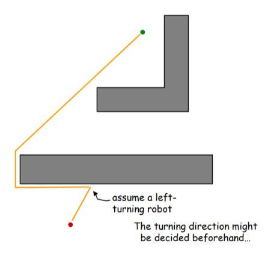

- Known direction to goal
  - Robot can measure distance d(x,y) between pts x and y
- Otherwise local sensing walls/obstacles

1. head toward goal
2. follow obstacles until you can head toward the goal again
3. continue

> Bug 0 won't work well in this map!
>
> 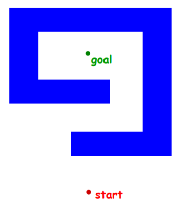

#### Bug 1 Strategy

1. head toward goal
2. if an obstacle is encountered, circumnavigate it and remember how close you get to the goal
3. return to that closest point(by wall-following) and continue

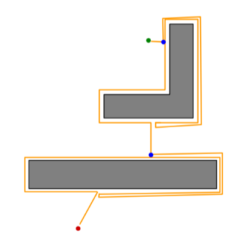

##### Bug 1 Path Bound

D =  straight-line distance from start to goal  
Pi = perimeter of the i th obstacle

Lower bound: D  
Upper bound: D + 1.5$\sum_i P_i$

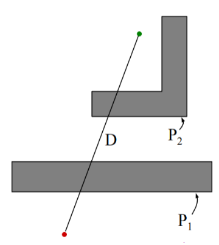

#### Bug 2 Strategy

1. head toward goal on the m-line
2. if an obstacle is in the way, follow it until you encounter the m-line again.
3. Leave the obstacle and continue toward the goal

In this case, re-encountering the m-line brings you back to the start

Implicitly assuming a static strategy for encountering the obstacle (“always turn left”)

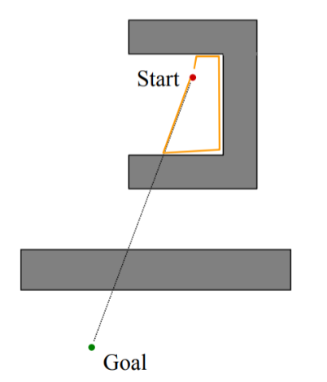

1. head toward goal on the m-line
2. if an obstacle is in the way, follow it until you encounter the m-line again closer to the goal.
3. Leave the obstacle and continue toward the goal

D =  straight-line distance from start to goal  
Pi = perimeter of the i th obstacle

Lower bound: D  
Upper bound: D + $\sum_i\frac{n_i}{2}P_i$

$n_i$ = # of m-line intersections of the i th obstacle

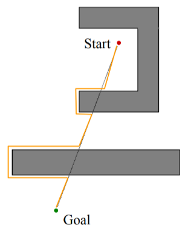

#### Bug 1 VS Bug 2

Bug 2 beats Bug 1
  
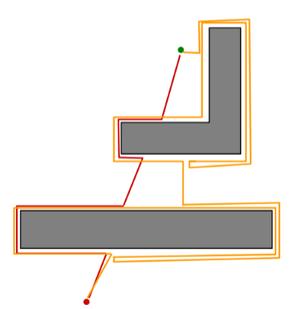

Bug 1 beats Bug 2

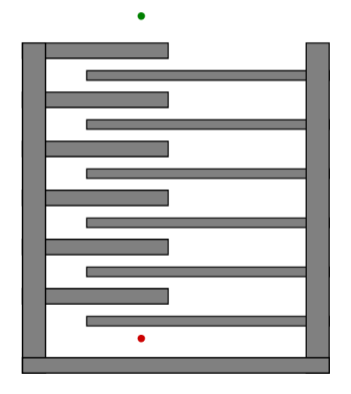

- BUG 1 is an exhaustive search algorithm
  - it looks at all choices before commiting
- BUG 2 is a greedy algorithm
  - it takes the first thing that looks better
- In many cases, BUG 2 will outperform BUG 1, but
- BUG 1 has a more predictable performance overall

#### Configuration Space

Mobile robots operate in either a 2D or 3D Cartesian workspace with between 1 and 6 degrees of freedom.  
The configuration of a robot completely specifies the robot’s location.  
The configuration of a robot, C, with 𝑘 DOF can be described with 𝑘 values: C = {𝑞1, 𝑞2, … , 𝑞𝑘}.  
These values can be considered a point, 𝑝 in a k-dimension space (C-space).

#### C-Space

Wheeled mobile robots can be modelled in such a way that the C-Space maps almost directly to the workspace.
$$
  C = \{x, y, \varphi \}
$$
The assumption is often made that the robot is holonomic, however this is not the case for differential drive robots. If the orientation of the robot is not important, this assumption is valid.

##### C-Space for Mobile Robots

If we assume a **circular**, **holonomic** robot, the C-space of a mobile robot is almost identical to the physical space.

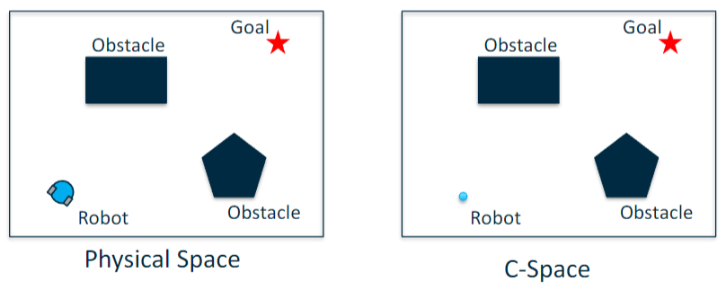

##### C-Space Modification

The robot in C-space is represented as a point, however the robot in the physical space has a finite size.  
To map the obstacles in C-space, they have to be increased in size by the radius of the robot.

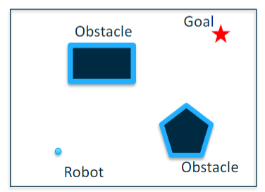

#### Graphs

The standard search methods used for planning a route are based on graphs.

A graph, 𝐺, is an abstract representation which is made up of nodes (Vertices), 𝑉(𝐺), and connections (Edges), 𝐸(𝐺).

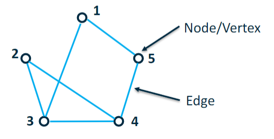

##### Graph Definitions

The graph below has a vertex set: 𝑉 𝐺 = 1,2,3,4,5  
The degree of a vertex is the number edges with that vertex as an end point (so the degree of node 1 would be 2).  
An edge connects two vertices and is defined as (𝑖, 𝑗) i.e. connecting vertex 𝑖 to vertex 𝑗.  
The formal definition of the graph is 𝐺 = (𝑉, 𝐸).

##### Graph Direction
  
The previous graph is known as an undirected graph, i.e. you can move from node to node in both directions.  
A directed graph means that you can only travel between nodes in a single direction.

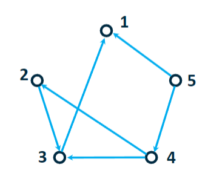

#### Adjacency Matrix

Graphs can be mathematically represented as an adjacency matrix, A, which is a 𝑉 × 𝑉 matrix with entries indicating if an edge exists between them.

$$
  a_{ij}=\begin{cases}1&\quad if(i,j)\in E\\0&\quad otherwise\end{cases}
$$

#### Grid movement

The cell decomposition method approaches the path-planning problem by discretising the environment into cells; each cell can either be an obstacle or free space. Then, a search algorithm is employed to determine the shortest path though these cells to go from the start position to the goal position. This strategy tends to work well in dense environments and some of its algorithms can handle changes in the environment efficiently.

The environment of the robot is a continuous structure that is perceived by the robot sensors. Storing and processing this complex environment in a simple format can be quite challenging. One way to simplify this problem is by discretising the map using a grid. The grid discretises the world of the robot into fixed-cells that are adjacent to each other.

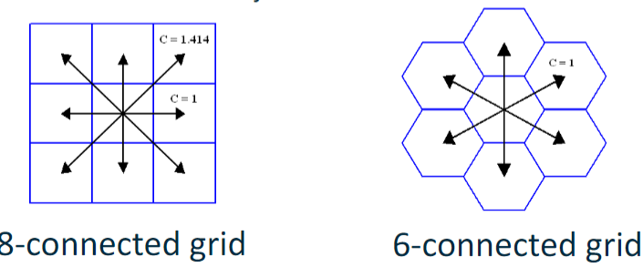

Grid-based discretisation results in an approximate map of the environment. If any part of the obstacle is inside a cell, then that cell is occupied; otherwise, the cell is considered as free space.

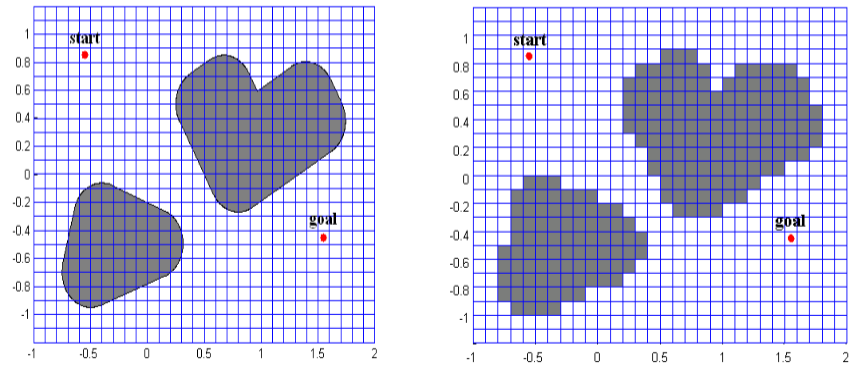

### Search Algorithms

Search algorithms can be broadly placed into two categories:
- Uninformed
  - E.g. Breadth-First, Depth-First, Wavefront
- Informed
  - E.g. Dijkstra, A*, D*, variants of both  
Uninformed searches have no additional information about the environment.  
Informed searches have additional information through the use of evaluation functions or heuristics.

#### Breadth-First

A basic search algorithm is called Breadth-First which begins at a start node and searches all adjacent nodes first. It then progresses onto the next ‘level’ node and searches all nodes on that level before it progresses. It terminates when it reaches its goal.

This search method provides an optimal path on the assumption that the cost of traversing each edge is the same.

#### Depth-First

DFS is similar to BSF, however the algorithm expands the nodes to the deepest level first.

There is some redundancy in that the algorithm may have to backtrack to previous nodes.

#### Wavefront Expansion

A specific implementation of the BFS algorithm for mobile robots is the Wavefront algorithm (also known as NF1 or grassfire).

This algorithm is used to find routes in fixed cell arrays and works backwards from the goal to the start point.

Wavefront Propagation
1. Start with a binary grid; ‘0’’s represent free space, ‘1’’s represent obstacles
2. Set the value of the goal cell to ‘2’
3. Set all ‘0’-valued grid cells adjacent to the ‘2’ cell with ‘3’
4. Set all ‘0’-valued grid cells adjacent to the ‘3’ cell with ‘4’
5. Continue until the wave front reaches the start cell (or has populated the whole grid)

Extract the path using gradient descent
1. Given the start cell with a value of ‘x’, find the neighbouring grid cell with a value ‘x-1’. Add this cell as a waypoint.
2. From this waypoint, find the neighbouring grid cell with a value ‘x-2’. Mark this cell as a waypoint.
3. Continue until you reach the cell with a value of ‘2’

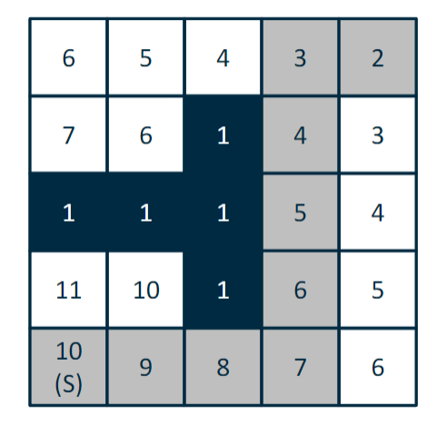

### Dijkstra's Algorithm

Up till now, the edges of the graphs we have considered have all had the same weight. As observed in the previous example, this doesn’t necessarily provide the optimal route.

Dijkstra's algorithm is similar to the BFS, however edges can take any positive cost.

This algorithm finds the costs to all vertices in the graph rather than just the goal.

This is an informed search where the node with the lowest 𝑓(𝑛) is explored first. 𝑔(𝑛) is the distance from the start.

$$
  f(n) = g(n)
$$

1. Initialise vectors
  a. Distance to all other nodes, 𝑓[𝑛] = Inf  
  b. Predecessor vector (pred) = Nil (0)  
  c. Priority vector, Q
2. For all nodes in the graph
  a. Find the one with the minimum distance  
  b. For each of the neighbour nodes  
    i. If the distance to the node from the start is shorter, update the path distance (if 𝑓[𝑢] + 𝑤(𝑢, 𝑛) < 𝑓[𝑛])
3. Find the path to the goal based on the shortest distances

Start: 5, Goal: 3  
Shortest Path = 7  
Path = 5 -> 4 ->2 -> 3

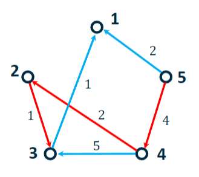

### A* Search Algorithm

One of the most popular search algorithms is called A* (A-star)

A* uses heuristics, additional information about the graph, to help find the best route.

$$
  f(n) = g(n) + h(n)
$$

𝑛 is the node  
𝑔(𝑛) is the distance from the start node to 𝑛  
ℎ(𝑛) is the estimated distance to the goal from 𝑛

Nodes with the lowest cost are explored first.

#### Heuristics

For grid maps, the heuristic function can be calculation a number of ways depending on the type of movement allowed.
- von Neumann – Manhattan Distance(四方向)
- Moore – Octile or Euclidean Distance(把方向)

The heuristic function should be ‘admissible’, i.e. always underestimate the distance to the goal:
$$
  h(n) \leq h^*(n)
$$

#### A* Pseudo Code

1. Initialise vectors
  a. Distance to all other nodes, 𝑓[𝑛] = Inf    
  b. Predecessor vector (pred) = Nil (0)    
  c. Priority vector, Q
2. From the starting node to the end node
  a. Find the node with the minimum 𝑓(𝑛). If there is more than one with the same value, select the node with the smallest ℎ(𝑛)  
  b. For each of the neighbour nodes  
    i. If 𝑓(𝑛) is smaller, update the path distance  
      𝑔[𝑢] + 𝑤(𝑛, 𝑢) + ℎ(𝑛) < 𝑓[𝑛]
3. Find the path to the goal based on the shortest distances

#### Advanced Planning Algorithms

There are more advanced planning algorithms which increase performance and can operate in dynamic conditions:
- Anytime Replanning A*
- D*
- Anytime D*
- Potential Fields

## 题型预测

### Week 1-5

1. Cylinder(linear Actuators) 压力差
2. DOF, 冗余度, 参数数量, n(number of manipulator), m(number of end-effector)
3. Transformation
4. 机械臂的旋转矩阵

### Week 6-9

1. 计算kinematics 的 v和 w（week6）
2. 计算Jacobi Matrix H 或 State transition matrix h（week6）
3. PID controller 的K参数的影响，可能考选择（week7）
4. stability 的判断（week7）
5. bug1 bug2的上界下界（week8）
6. 广度优先/深度优先最短路径以及路径长度（week8）
7. 波前扩展wavefront画表（week8）
8. A* 算法（必考）（week8）
9. Probabilistic Mapping 的计算，可能计算P(B) 或 P(A|B)（必考）（week9）

## 例题

### 第一部分：Week 1-5 (基础机械臂、矩阵变换)

---

#### **题目 1: 压力差计算**

一个液压缸的直径为 $D = 10 \, \text{cm}$，活塞杆的直径为 $d = 4 \, \text{cm}$，系统的压力 $P = 5 \, \text{MPa}$。  
计算：
1. 活塞向外推的力（扩展力）。
2. 活塞向内拉的力（收缩力）。

**答案**：
1. 活塞面积：$A_1 = \pi (D/2)^2 = \pi (0.1/2)^2 = 0.00785 \, \text{m}^2$  
   扩展力：$F_{\text{out}} = P \cdot A_1 = 5 \cdot 10^6 \cdot 0.00785 = 39.25 \, \text{kN}$

2. 杆面积：$A_2 = \pi (d/2)^2 = \pi (0.04/2)^2 = 0.00126 \, \text{m}^2$  
   有效面积：$A_{\text{effective}} = A_1 - A_2 = 0.00785 - 0.00126 = 0.00659 \, \text{m}^2$  
   收缩力：$F_{\text{in}} = P \cdot A_{\text{effective}} = 5 \cdot 10^6 \cdot 0.00659 = 32.95 \, \text{kN}$

---

#### **题目 2: 冗余度计算**

一个机械臂有 8 个活动连杆和 8 个关节，每个关节只有 1 个自由度（DOF），末端执行器需要 6 个自由度以覆盖所有空间。

问：
1. 系统总的 DOF 是多少？
2. 系统的冗余度是多少？

**答案**：
1. 总 DOF：$n = 8 \times 1 = 8$
2. 冗余度：$n - m = 8 - 6 = 2$

---

#### **题目 3: 矩阵变换**

已知刚体旋转的旋转矩阵：
$$
R = \begin{bmatrix}
0 & -1 & 0 \\
1 & 0 & 0 \\
0 & 0 & 1
\end{bmatrix}
$$
这个矩阵描述了一个物体绕 z 轴旋转的变换角度是多少？

**答案**：
- 矩阵表示绕 z 轴旋转，$\cos\theta = 0, \sin\theta = 1$。  
  因此：$\theta = 90^\circ$。

---

#### **题目 4: 末端位置计算**

一个机械臂的 D-H 参数如下：
- 连杆长度 $a = 0.5$
- 连杆扭转角 $\alpha = 90^\circ$
- 关节角 $\theta = 30^\circ$
- 连杆偏移 $d = 0.2$

计算末端执行器的变换矩阵 $T$。

**答案**：
$$
T = \begin{bmatrix}
\cos\theta & -\sin\theta\cos\alpha & \sin\theta\sin\alpha & a\cos\theta \\
\sin\theta & \cos\theta\cos\alpha & -\cos\theta\sin\alpha & a\sin\theta \\
0 & \sin\alpha & \cos\alpha & d \\
0 & 0 & 0 & 1
\end{bmatrix}
$$

代入值：
$$
T = \begin{bmatrix}
\sqrt{3}/2 & -1/2 & 0 & 0.25\sqrt{3} \\
1/2 & \sqrt{3}/2 & 0 & 0.25 \\
0 & 0 & 1 & 0.2 \\
0 & 0 & 0 & 1
\end{bmatrix}
$$

---

#### **题目 5: 冗余机械臂**

一个 8 自由度（DOF）机械臂，其末端执行器需要 6 个 DOF。如何分配多余的自由度以优化性能？举出 2 种策略。

**答案**：
1. **障碍物规避：** 使用多余的 DOF 来调整机械臂路径，使其避开障碍物。
2. **力优化：** 利用冗余 DOF 最小化关节的力或能量消耗。

---

### 第二部分：Week 6-9 (运动学、控制、SLAM)

---

#### **题目 6: 速度计算**

已知机器人在 $(x, y)$ 位置的速度为：
$$
v_x = 1 \, \text{m/s}, \quad v_y = 1 \, \text{m/s}
$$
机器人朝向角 $\theta = 45^\circ$。

计算机器人沿自身方向的速度 $v$ 和角速度 $\omega$。

**答案**：
1. 机器人速度 $v = \sqrt{v_x^2 + v_y^2} = \sqrt{1^2 + 1^2} = \sqrt{2} \, \text{m/s}$。
2. 如果没有旋转运动，$\omega = 0$。

---

#### **题目 7: Jacobian 矩阵**

一个机械臂的末端位姿 $(x, y, \theta)$ 与关节角 $(\theta_1, \theta_2)$ 之间关系为：
$$
x = l_1\cos\theta_1 + l_2\cos(\theta_1 + \theta_2)
$$
$$
y = l_1\sin\theta_1 + l_2\sin(\theta_1 + \theta_2)
$$
计算 Jacobian 矩阵。

**答案**：
Jacobian 矩阵为：
$$
J = \begin{bmatrix}
-\sin\theta_1 & -\sin(\theta_1 + \theta_2) \\
\cos\theta_1 & \cos(\theta_1 + \theta_2)
\end{bmatrix}
$$

---

#### **题目 8: PID 控制**

给定以下 PID 控制器参数：
- $K_p = 5$，$K_i = 2$，$K_d = 1$

初始误差 $e(t) = 3$，误差变化率 $\dot{e}(t) = -1$，累计误差 $\int e(t) dt = 6$。

计算控制器输出 $u(t)$。

**答案**：
$$
u(t) = K_p e(t) + K_i \int e(t) dt + K_d \dot{e}(t)
$$
$$
u(t) = 5 \cdot 3 + 2 \cdot 6 + 1 \cdot (-1) = 15 + 12 - 1 = 26
$$

---

#### **题目 9: 稳定性判断**

一个系统的特征值为 $-2, -1, 0, 1$。判断该系统的稳定性。

**答案**：
- 系统的特征值中存在正值（1），说明系统**不稳定**。

---

#### **题目 10: A* 算法**

在以下网格中，计算从起点 $S$ 到目标 $G$ 的最短路径。使用 A* 算法，启发式为曼哈顿距离。

```
S  1  1  G
1  1  1  1
```

权重：
- 节点间的代价均为 1。

**答案**：
1. 启发式函数 $h(n)$：曼哈顿距离。
2. $g(n)$：从起点到当前节点的代价。
3. 总代价：$f(n) = g(n) + h(n)$。

路径：
- $S \to (1,2) \to (1,3) \to G$，总代价 $3$。

以下是我之前给出的10道题目及其中文讲解：

---

### **定位 (Localization, Week 6)**

#### **问题 1:**  
**运动模型和观测模型在概率机器人中的区别是什么？它们是如何用于定位过程的？**

**解答:**  
- **运动模型**：描述机器人根据运动指令从一个状态转移到下一个状态的过程，用于预测机器人的位置（先验）。
- **观测模型**：描述传感器测量值与机器人当前位置的关系，用于结合传感器数据更新预测（后验）。
- **在定位过程中**，运动模型通过控制指令估计机器人下一步的位置，而观测模型根据传感器数据修正估计，得到更准确的机器人位置。

---

### **控制 (Control, Week 7)**

#### **问题 2:**  
**描述PID控制器是如何调整机器人系统的控制输入的。P、I 和 D 这三项分别起到什么作用？**

**解答:**  
- **P（比例项）**：根据当前误差进行调整，误差越大，调整幅度越大。
- **I（积分项）**：积累历史误差，解决系统偏差问题。
- **D（微分项）**：预测未来误差变化趋势，减小振荡，增加稳定性。

#### **问题 3:**  
**一个PID控制系统的响应存在较大超调且稳定时间较长。你会如何调整PID参数来改善系统性能？**

**解答:**  
- **减小 P 项**：降低响应强度，减少超调。
- **增加 D 项**：提高阻尼效果，减少振荡。
- **减小 I 项**：减少对历史误差的累积反应，避免过度修正。

---

### **规划 (Planning, Week 8)**

#### **问题 4:**  
**对于如下图的图（假设有边权重），使用Dijkstra算法计算从节点1到节点11的最短路径，展示每一步的更新过程。**

**解答:**  
（需要提供图和边权重）  
- 初始化距离表，起点距离为0，其余节点为无穷大。
- 逐步更新与当前节点相连的邻接节点的最短距离，直到目标节点距离更新完成。

#### **问题 5:**  
**比较 Bug 1 和 Bug 2 障碍物规避算法在路径效率和内存使用方面的区别。**

**解答:**  
- **Bug 1**：遍历障碍物整个边界找到离目标最近的点，路径效率较低但内存开销较高。
- **Bug 2**：沿障碍物移动，直到重新回到直线路径，计算简单，但可能选择非最优路径。

---

### **映射 (Mapping, Week 9)**

#### **问题 6:**  
**已知以下概率：**
- $P(Z = z_k | c_{i,j} = \text{occupied}) = 0.85$
- $P(Z = z_k | c_{i,j} \neq \text{occupied}) = 0.22$
- $P(c_{i,j} = \text{occupied}) = 0.5$

计算后验概率 $P(c_{i,j} = \text{occupied} | Z = z_k)$。

**解答:**  
应用贝叶斯定理：
$$
P(c_{i,j} = \text{occupied} | Z = z_k) = \frac{P(Z = z_k | c_{i,j} = \text{occupied}) P(c_{i,j} = \text{occupied})}{P(Z = z_k)}
$$
其中：
$$
P(Z = z_k) = P(Z = z_k | c_{i,j} = \text{occupied}) P(c_{i,j} = \text{occupied}) + P(Z = z_k | c_{i,j} \neq \text{occupied}) P(c_{i,j} \neq \text{occupied})
$$
计算得：
$$
P(Z = z_k) = (0.85)(0.5) + (0.22)(0.5) = 0.535
$$
$$
P(c_{i,j} = \text{occupied} | Z = z_k) = \frac{(0.85)(0.5)}{0.535} \approx 0.794
$$

#### **问题 7:**  
**解释传感器的真阳性率（True Positive Rate, TPR）和假阳性率（False Positive Rate, FPR）在概率映射中的作用。**

**解答:**  
- **真阳性率 (TPR)**：传感器正确检测障碍物为已占用状态的概率，反映传感器的准确性。
- **假阳性率 (FPR)**：传感器错误检测未占用区域为占用状态的概率，影响地图的误差累积。

---

### **综合题目**

#### **问题 8:**  
**解释SLAM如何将定位和映射结合到一个框架中。实现实时SLAM的主要挑战是什么？**

**解答:**  
- SLAM同时估计机器人的位置和构建环境地图，利用运动模型预测机器人位置，用观测模型更新地图。
- 挑战：
  - 计算量大，难以实时完成。
  - 传感器噪声和数据不确定性。
  - 需要闭环检测来避免位置和地图的不一致。

#### **问题 9:**  
**应用波前算法，计算从起点到目标点的最短路径。请展示路径上的标记值。**

**解答:**  
- 从目标点开始赋值0。
- 邻接点标记为1，以此类推，直到起点标记完成。
- 回溯标记值最小的路径得到最短路径。

#### **问题 10:**  
**描述如何通过数学模型定义队形控制中的Leader-Follower机制，并解释如何保证其稳定性。**

**解答:**  
- **数学模型：**
  $$
  u_i = -K \sum_{j=0}^N a_{ij} \big[(x_i - h_i) - (x_j - h_j)\big]
  $$
  其中 $K > 0$ 是控制增益，$a_{ij}$ 是邻接矩阵值，$h_i$ 是理想队形位置偏移。
- **稳定性：**  
  保证 $K > 0$，调整参数确保误差收敛，使用Lyapunov函数证明系统稳定性。

Based on the provided slides, here are 10 advanced questions and their answers across the topics of localization, control, planning, and mapping:

---

### Localization (Week 6)
**Question 1:**  
Explain the difference between the motion model and the observation model in probabilistic robotics. How are these models used in the localization process?

**Answer:**  
- The **motion model** describes the robot's state transition based on its control inputs, predicting the next state of the robot given the current state and motion commands.
- The **observation model** relates the measurements taken by the robot's sensors to its current state, providing a way to update the belief about the state.
- In localization, the motion model predicts the robot's pose (prior), and the observation model updates this prediction using sensor data (posterior).

---

### Control (Week 7)
**Question 2:**  
Describe how a PID controller adjusts the control input when applied to a robotic system. What role does each term (P, I, and D) play?

**Answer:**  
- **Proportional (P):** Reacts to the current error, providing a correction proportional to the magnitude of the error.
- **Integral (I):** Accounts for past errors by integrating them over time, correcting for systematic biases.
- **Derivative (D):** Predicts future error by considering the rate of error change, damping oscillations and overshoot.

**Question 3:**  
A system using a PID controller has overshoot and takes too long to stabilize. What adjustments would you recommend for the PID parameters to mitigate this?

**Answer:**  
- Reduce the **Proportional (P)** gain to decrease the overshoot.
- Increase the **Derivative (D)** gain to improve damping and reduce overshoot further.
- Decrease the **Integral (I)** gain to avoid excessive correction for accumulated errors.

---

### Planning (Week 8)
**Question 4:**  
For the following graph, calculate the shortest path from Node 1 to Node 11 using Dijkstra's algorithm. The graph's weights are provided. Show each step.

**Answer:**  
(Detailed path calculation omitted due to lack of graph weights in the text. This question prompts practical application.)

**Question 5:**  
Compare and contrast the Bug 1 and Bug 2 obstacle avoidance strategies in terms of path efficiency and memory usage.

**Answer:**  
- **Bug 1:** Tracks the entire perimeter of an obstacle to find the closest point to the goal, using more memory and computation but ensuring completeness.
- **Bug 2:** Follows the obstacle until it re-encounters the direct line to the goal, making it less computationally intensive but prone to suboptimal paths.

---

### Mapping (Week 9)
**Question 6:**  
Given the following probabilities:
- $$P(Z = z_k | c_{i,j} = \text{occupied}) = 0.85$$
- $$P(Z = z_k | c_{i,j} \neq \text{occupied}) = 0.22$$
- $$P(c_{i,j} = \text{occupied}) = 0.5$$

Calculate the posterior probability $$P(c_{i,j} = \text{occupied} | Z = z_k)$$.

**Answer:**  
Using Bayes' theorem:
$$ P(c_{i,j} = \text{occupied} | Z = z_k) = \frac{P(Z = z_k | c_{i,j} = \text{occupied}) P(c_{i,j} = \text{occupied})}{P(Z = z_k)} $$
Where:
$$ P(Z = z_k) = P(Z = z_k | c_{i,j} = \text{occupied}) P(c_{i,j} = \text{occupied}) + P(Z = z_k | c_{i,j} \neq \text{occupied}) P(c_{i,j} \neq \text{occupied}) $$

$$ P(Z = z_k) = (0.85)(0.5) + (0.22)(0.5) = 0.535 $$

$$ P(c_{i,j} = \text{occupied} | Z = z_k) = \frac{(0.85)(0.5)}{0.535} = 0.794 $$

---

**Question 7:**  
Explain the role of the sensor's true positive rate and false positive rate in probabilistic mapping.

**Answer:**  
- The **true positive rate** represents the likelihood that the sensor correctly detects an occupied cell when it is truly occupied, contributing to the reliability of positive measurements.
- The **false positive rate** indicates the likelihood that the sensor incorrectly identifies a free cell as occupied, which can introduce uncertainty and reduce map accuracy.

---

### Multi-topic Advanced
**Question 8:**  
Explain how SLAM combines localization and mapping into a single framework. What are the challenges of solving SLAM in real-time?

**Answer:**  
- SLAM simultaneously estimates the robot's pose and builds a map of the environment using only on-board sensors.
- Challenges include:
  - High computational demand for real-time operation.
  - Managing sensor noise and uncertainties in measurements.
  - Loop closure detection to correctly identify previously visited areas.

**Question 9:**  
Using the wavefront algorithm, fill in the missing values in the following 2D grid to calculate

the shortest path to the goal. Assume the goal is located at cell (5,5) and the grid starts with the goal marked as 0.

**Answer:**  
- Start at the goal cell (5,5) with value 0.
- Mark all adjacent cells with value 1.
- For each subsequent layer, increment the value by 1 for all unvisited adjacent cells.
- Repeat until all cells are filled.

(Detailed grid values depend on the problem setup provided. The exercise prompts practical application.)

---

**Question 10:**  
Describe how a leader-follower mechanism in formation control can be modeled mathematically. How is stability ensured in such systems?

**Answer:**  
- **Modeling:**  
  The leader's position is defined, and each follower's control law is based on the leader's state and their relative positions:
  $$
  u_i = -K \sum_{j=0}^N a_{ij} \big[(x_i - h_i) - (x_j - h_j)\big]
  $$
  Where $$K$$ is the control gain, $$a_{ij}$$ denotes adjacency in the graph, and $$h_i$$ is the desired offset.

- **Stability:**  
  Stability is achieved by ensuring the control gain $$K > 0$$ and proper tuning of the parameters to minimize error convergence between the leader and the followers, maintaining the desired formation. Lyapunov functions can be used to prove stability. 

---

### **Week 6: Localization (定位)**

1. **运动模型和观测模型：**
   - 确保理解两者的作用：
     - **运动模型**：估计机器人下一步的位置（预测）。
     - **观测模型**：修正估计，结合传感器数据得出后验分布。
   - 熟悉贝叶斯公式在SLAM中的应用：
     $$
     P(X|Z) = \frac{P(Z|X)P(X)}{P(Z)}
     $$
     - $X$：机器人位置
     - $Z$：观测值

2. **概率和误差传播：**
   - 熟悉 **Pose Covariance Matrix** 的公式推导，理解噪声如何影响位置估计的不确定性。
   - 学会处理高斯分布的线性变换，例如状态转移矩阵和观测矩阵的推导。

---

### **Week 7: Control (控制)**

1. **PID 控制器：**
   - 知道 P、I、D 参数分别对系统响应的影响：
     - **P 增大**：加快响应，但可能引起振荡。
     - **I 增大**：消除稳态误差，但可能增加超调。
     - **D 增大**：减小振荡，提高稳定性。
   - 对比不同控制器（P、PI、PID）的优缺点，特别是它们的收敛速度和稳定性。

2. **稳定性分析：**
   - 熟悉 Lyapunov 稳定性条件：
     - $V(x) > 0$ 表示正定函数。
     - $\dot{V}(x) < 0$ 表示系统趋于稳定。
   - 理解 Asymptotic Stability 和 Neutral Stability 的区别：
     - **渐近稳定**：误差逐渐减小，最终趋于零。
     - **中性稳定**：误差保持在一定范围内，但不减小。

---

### **Week 8: Planning (规划)**

1. **路径搜索算法：**
   - **A***:
     - 熟悉 $f(n) = g(n) + h(n)$ 的定义：
       - $g(n)$：起点到当前节点的实际代价。
       - $h(n)$：当前节点到目标节点的启发式估计代价。
     - 确保理解不同启发函数（曼哈顿、欧几里得距离）如何影响搜索效率。
     - 注意算法在选择节点时的顺序（根据 $f(n)$ 值）。

   - **Dijkstra 和波前算法：**
     - Dijkstra 是 A* 的特例（启发值 $h(n) = 0$）。
     - 波前算法用于栅格地图，熟悉它如何标记和回溯路径。

2. **障碍物规避算法：**
   - 熟悉 Bug1 和 Bug2 的区别：
     - Bug1 的完整边界遍历。
     - Bug2 在遇到障碍物时直接回归主路径。

---

### **Week 9: Mapping (映射)**

1. **概率映射：**
   - 理解先验概率、后验概率的计算：
     $$
     P(c_{i,j} = \text{occupied}|Z) = \frac{P(Z|c_{i,j} = \text{occupied}) P(c_{i,j} = \text{occupied})}{P(Z)}
     $$
   - 掌握如何从传感器数据计算栅格的占用概率。

2. **SLAM 原理：**
   - 熟悉 SLAM 中定位与映射的结合：
     - **预测**：运动模型更新机器人位置。
     - **修正**：观测模型更新地图。
   - 理解闭环检测（Loop Closure）的重要性。

---

### **综合建议**

1. **公式推导和简化：**
   - 考试中可能要求推导关键公式（如 A* 的估计函数、PID 的动态方程、SLAM 中概率公式）。
   - 熟悉公式的每一项含义，避免记错。

2. **应用题训练：**
   - 计算题：如 SLAM 中后验概率的计算，A* 的路径搜索。
   - 理论题：解释控制器设计、稳定性分析的基本原理。

3. **注意单位和边界条件：**
   - 控制参数 $K_p, K_i, K_d$ 的大小是否合理。
   - 地图栅格的占用概率是否符合边界值（如在 $[0,1]$ 内）。

4. **阅读题干，明确问题：**
   - 如果是算法题，明确输入和输出，例如 A* 的初始节点、目标节点、代价函数。
   - 如果是推导题，检查步骤的数学合理性。

---

### **重点高频知识点**
- **SLAM 的概率更新公式**。
- **PID 参数对系统性能的影响**。
- **A* 和波前算法的差异和适用场景**。
- **Lyapunov 稳定性的定义和应用**。
- **Mapping 中后验概率计算及假阳性率的影响**。

---


