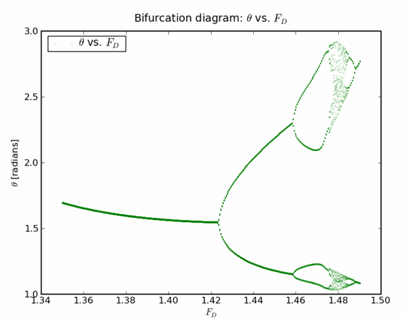
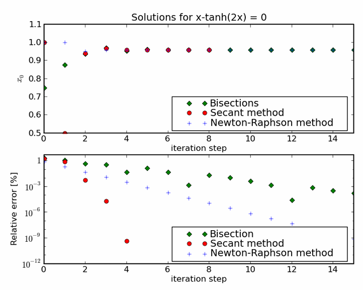
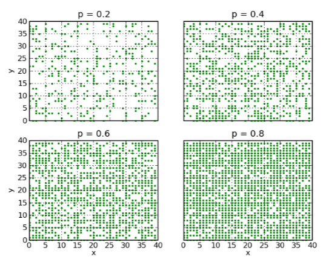
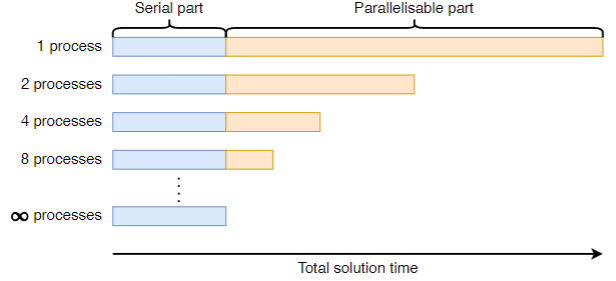
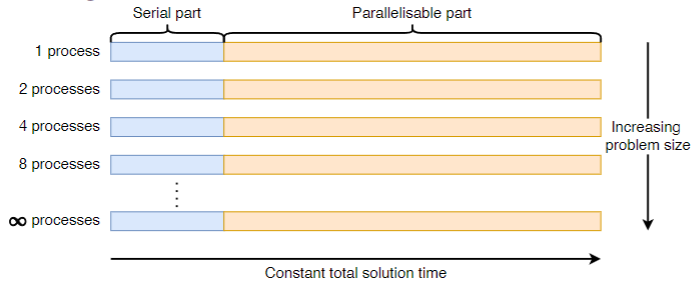
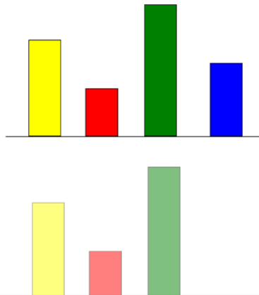
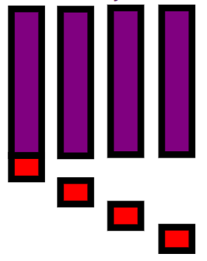
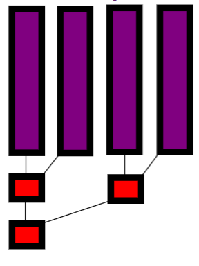
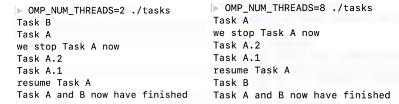

# Note - Scientific and High-Performance Computing

## Lecture 1 - Radioactive decay

### Mathematical model & analytical solution

- Constant fraction of atoms decays per unit time
    $$
    \frac{dN}{dt} = - \frac{N}{\tau} \equiv f(N, t)
    $$
    > $\tau$ is called `mean life-time`  

- Analytical solution: 
    $$
        N(t) = N_0 \exp(-\frac{t}{\tau})
    $$

    > $N_0$: number of radio-active atoms at t = 0  

    > $N(t) = \frac{N_0}{2}$ for $\exp(-\frac{t}{\tau}) = \frac{1}{2}$, so `half life-time` $T_{\frac{1}{2}} = \tau\ln(2)$

### Numerical solution: Euler's method

- Basic idea: Replace continuous time $t$ by discrete times $t_i$ ($i \in N$)
    $$
        \frac{N(t + \Delta t) - N(t)}{\Delta t} = - \frac{N(t)}{\tau}
    $$

$$
    \frac{dx}{dt} = f(x,t) \rarr \frac{x(t + \Delta t) - x(t)}{\Delta t} = f(x(t), t)
$$

### Euler's method

#### choosing the step size

- $N_{i+1} = (1 - \frac{\Delta t}{\tau})$
  1. Requires $\Delta t < \tau, otherwise $N_{i+1} < 0$ (method is not unconditionally stable)
  2. Accuracy improves with decreasing $\frac{\Delta t}{\tau}$
  3. Taking $\Delta t$ constant gives constant relative error per step
- In general: $f(x) \rarr f(x,t)$

#### error estimate

- Taylor expansion
    $$
        x(t + \Delta t) = x(t) + \frac{dx(t)}{dt}\frac{(\Delta t)^1}{1!} + \frac{d^2x(t)}{dt^2}\frac{(\Delta t)^2}{2!} + \dots
    $$

- Error Estimate:
  - Euler method uses `first two terms`, but `ignores all others starting at the third one.`
  - Error per step: $O[(\Delta t)^2]$
- Overall Error:
  - We got $\frac{1}{\Delta t}$ steps from $t_0$ to $t_{end}$
  - Overall error: $O[(\Delta t)]$
  - Take $\Delta t$ small enough: compare to time-scale in the problem($\Delta t \ll \tau$)

### A change of variables

- Original equation: $\frac{dN}{dt} = - \frac{N}{\tau}$
- Change of variables: $x = \ln(\frac{N}{N_0})$
  $$
    \frac{dx}{dt} = -\frac{1}{\tau}
  $$
- Even better: $t \rarr t' \equiv \frac{t}{\tau}$
  $$
    \frac{dx}{dt'} = -1
  $$

> Advantages:
> - Simplify differential equation
> - Stablility of the equation
> - No limit on time-step

## Lecture 2 - Projectile motion

### Mathematical model & analytical solution

- Newtonian dynamis:
  $$
    \frac{d^2x}{dt^2} = 0; \frac{d^2y}{dt^2} = -g
  $$
- Analytical solution:
  $$
    x = x_0 + \dot{x_0}t; t = y_0 + \dot{y_0}t - \frac{g}{2}t^2
  $$
  >  $(x_0, y_0)$ is initial position, $(\dot{x_0},\dot{y_0})$ is initial velocity in x and y direction
- In terms of launch angle, $\theta_0$, and launch speed, $v_0$
  $$
    \dot{x_0} = v_0\cos(\theta_0); \dot{y_0} = v_0\sin(\theta_0)
  $$

### Numerical solution: Euler's method

- Solution for differential equations of the type
  $$
    \frac{dx}{dt} = f(x, t)
  $$
- Discretise time t an coordinate x with time-step $\delta t$:
  $$
    x(t^{n+1}) \equiv x^{n+1} = x^n + f(x^n, t^n)\delta t
  $$

> Euler's method not directly applicable, because equations are second order  
> So **REWRITE** as two
> $$
>   \frac{dy}{dt} = v_y; \frac{dv_y}{dt} = f_y
> $$

- Initial conditions: Lanuch angle $\theta_0$, launch speed $v_0$
  $$
    (x_0, y_0) = (0,0), (v_{x,0}, v_{y,0}) = v_0(cos(\theta_0), sin(\theta_0))
  $$
- Euler's methods:
  $$
    x(t^{n+1}) \equiv x^{n+1} = x^n + v^n_x \Delta t; v^{n+1}_x = v_x^n + 0 \Delta t  \\
    y(t^{n+1}) \equiv y^{n+1} = y^n + v^n_y \Delta t; v^{n+1}_y = v_y^n - g \Delta t  \\
    t^{n+1} = t^n + \Delta t
  $$

### Air resistance: mathematical model

#### Drag force

- Drag force:
  $$
    F_{drag} = -B_{1,drag}v\frac{\bold{v}}{v} - -B_{2,drag}v^2\frac{\bold{v}}{v}
  $$
- drag froce is parallel to velocity, $F || v$  
  $\frac{\bold{v}}{v}$ is unit vector in the direction of motion
- drag coefficients $B_{1,drag} > 0$ and $B_{2,drag} > 0$ since drag slows projectile down

- Dimensional analysis: $|F_{drag}|$ depends on density of air $(\rho)$, speed $(v)$, and size of projectile $(r)$: 
  $$F_{drag} \propto \rho^\alpha v^\beta r^\gamma$$
  - As F is $kg\ m\ s^{-2}$, so $\alpha = 1;\beta = 2; \gamma = 2$
- Therefore take
  $$
    F_{drag} \approx -B_{2,drag}v^2\frac{\bold{v}}{v} = -B_{2,drag}v\left
    (\begin{array}{cc} 
    v_x\\ 
    v_y
    \end{array}\right)
  $$

#### Air resistance: Numerical solution

- Mathematical model:
  $$
    \frac{d^2x}{dt^2} = -\frac{B(y)vv_x}{m}, \frac{d^2y}{dt^2} = - g -\frac{B(y)vv_y}{m}
  $$
- Euler's method
  $$
    x^{n+1} = x^n + v^n_x\Delta t; v^{n+1}_x = v^n_x - \frac{B(y^n)v^nv^n_x}{m}\Delta t \\
    y^{n+1} = y^n + v^n_y\Delta t; v^{n+1}_y = v^n_y - g\Delta t - \frac{B(y^n)v^nv^n_y}{m}\Delta t \\
    t^{n+1} = t^n + \Delta t \\
    v^n = ((v^n_x)^2 + (v^n_y)^2)^{\frac{1}{2}}
  $$

### Higher-order methods

- Euler method simple to implement, but correct only to $O(\Delta t)$
- According to the `mean value theorem`:
  $$
    \exist t' \in [t, t + \Delta t] : x(t + \Delta t) \equiv x(t) + \frac{dx}{dt} \bigg|_{t = t'} \Delta t
  $$

> - Advantage: Here t' includes higher order effects(curvature etc)
> - Drawback: Not known generally, but maybe better choices than $t' = t$ employed in Euler method

#### $2^{nd}$ order Runge-Kutta

- Underlying idea: Estimate $t' = t + \frac{\Delta t}{2}$
- But: also need $\frac{dx}{dt}$ at $t = t'$
  $$
    x' = x + f(x,t)\frac{\Delta t}{2}
  $$
- Second-order scheme(precision $O[(\Delta t)^2]$):
  $$
    x' = x + f(x,t)\frac{\Delta t}{2} \\
    x(t + \Delta t) = x(t) + f(x', t') \Delta t\\ 
    x^{n+1} = x^n + f(x^n + \frac{\Delta t}{2}f(x^n,t^n), t^n + \frac{\Delta t}{2})\Delta t
  $$

#### $4^{th}$ order Runge-Kutta

- More sampling points
  $$
    x(t + \Delta t) = x(t) + \frac{\Delta t}{6}[f(x'_1,t'_1) + 2f(x'_2,t'_2) + 2f(x'_3,t'_3) + f(x'_4,t'_4)]
  $$
- Sampling points given by
    $$
    x'_1 = x \quad t'_1 = t
    $$
    $$
    x'_2 = x + f(x'_1, t'_1) \frac{\Delta t}{2} \quad t'_2 = t + \frac{\Delta t}{2}
    $$
    $$
    x'_3 = x + f(x'_2, t'_2) \frac{\Delta t}{2} \quad t'_3 = t + \frac{\Delta t}{2}
    $$
    $$
    x'_4 = x + f(x'_3, t'_3) \Delta t \quad t'_4 = t + \Delta t
    $$
- Fourth-order scheme(precision $O[(\Delta t)^4]$)

## Lecture 3 - Harmonic Motion

### Mathematical model & analytic solution

- Force is proportional to displacement
  $$
    m\frac{d^2x}{dt^2} = -kx
  $$
  > $k$ is a constant, m is mass of object  `k 是一个常数，表示恢复力的刚度系数（例如弹簧常数）`  
  > $k > 0$: minus sign result in a restoring force(osillations)   `恢复力总是指向平衡位置`

  $2^{nd}$ order DE: need to specify $x(t = 0) = x_0, \dot{x}(t = 0) = \dot{x}_0$

- Analytical solution
  $$
    x(t) = A\cos(\Omega t) + B\sin(\Omega t); \Omega^2 = \frac{k}{m}\\
    x_0 = A; \dot{x_0} = \Omega B
  $$
  Initial conditions determine A and B
  > $\Omega$是角频率，rad/s(弧度每秒)
  > $$
  >   T = \frac{2\pi}{\Omega}\\
  >   f = \frac{\Omega}{2\pi}
  > $$

#### Example of harmonic motion: pendulum 摆

- Pendulum bob
  - mass `m`
  - length `l`
  - deflection angle from vertical $\theta$

- $F_\theta = - mg\sin\theta \approx - mg\theta$
  > in the `small angle approximation` 小角近似

- Apply Newton's law:
  $$
    m\ddot{r} = ml\ddot{\theta} = -mg\theta; \ddot{\theta} = -\frac{g}{l}\theta\\
    m\ddot{x} = -kx; x = \theta \& \frac{k}{m} = \frac{g}{l} = \Omega^2
  $$
  
---

- Analytical solution(small angles): $\theta(t) = A\cos(\Omega t) + B\sin(\Omega t)$
- Angular eigen-frequency: $\Omega = \sqrt{\frac{g}{l}}$
- Choose initial conditions:
  - Maximal amplitude: $\theta = \theta_0$ when $t = 0 \rarr A = \theta_0$
  - Angular velocity: $\omega \equiv \dot{\theta} = 0$ when $t = 0 \rarr B = 0$
- Energy E of pendulum is conserved:
  $$
    E = \frac{1}{2}ml^2\omega^2 + mgl(1 - \cos\theta) \approx \frac{1}{2}ml^2\omega^2 + \frac{1}{2}mgl\theta^2\\
    \dot{E} = ml\omega(l\dot{\omega} + g\theta) = 0; \text{since } \dot{\omega} = \ddot{\theta} = -\frac{g}{l}\theta
  $$
  > $1 - \cos(\theta) \approx \frac{\theta^2}{2}$ in the small angle approximation

> 这里所有的导数皆是比$dt$

### Numerical solution: Euler's method

- Replace $2^{nd}$ order DE by two $1^{st}$ order DEs
  $$
    \frac{d^2\theta}{dt^2} = -\frac{g}{l}\theta \rarr \frac{d\theta}{dt} = \omega;\ \frac{d\omega}{dt} = -\frac{g}{l}\theta
  $$
- Discretise: $dt \rarr \Delta t$
  $$
    \theta^{n + 1} = \theta^n + \omega^n\Delta t\\
    \omega^{n + 1} = \omega^n - \frac{g}{l}\theta^n\Delta t\\
    t^{n + 1} = t^n + \Delta t
  $$
- Choose time-step to be small compared to period:
  $$
    \Delta \ll \frac{2\pi}{\Omega}
  $$

> - Problem: Amplitude increases with time(even for small $\Delta t$)
>
> Why does it fail?
> - Increasing amplitude implies energy of numerical solution increases
> - Evaluate numerical energy:
>   $$
>     E^{n + 1} = \frac{ml^2}{2}[(\omega^{n + 1})^2 + \frac{g}{l}(\theta^{n+1})^2]\\
>     = \frac{ml^2}{2}[(\omega^{n} - \frac{g}{l}\theta^n\Delta t)^2 + \frac{g}{l}(\theta^{n} + \omega^n \theta)^2]\\
>     = E^{n} + \frac{mgl}{2}(\frac{g}{l}(\theta^n)^2 + (\omega^n)^2)\Delta t^2\\
>     > E^n
>   $$
>   for any choice of time-step
> - Numerical scheme does not conserve energy!
>
> - Euler method not good for harmonic motion
> - Why was it good before? Was energy conserved applying Euler's method to ballistic motion?
>   - Remember the trajectory of the cannon ball: For larger step-size higher peak in trajectory than for smaller step-size(with roughly the same range)  
>     在以前处理抛体运动（如炮弹运动）时，欧拉法表现得还算可以。虽然在较大的步长下，弹道轨迹的峰值较高，但总的射程保持相对准确。因此在单次抛射的情况中，能量守恒的误差影响较小，但在多次周期振荡（如简谐运动）中，误差会随着时间的推移累积，导致能量越来越大。
> - In practise: only calculate parabolic trajectory(cannon ball) compared to many oscillations(harmonic motion)
>   - Euler's method OK for trajectories - but not for harmonic motion
> - There is no single method that is perfect for all problems

### Improving the Euler method: Euler-Cromer

- Obvious solution: use Runge-Kutta instead
- However, consider following small change to Euler's method:
  - Instead of
    $$
      \omega^{n + 1} = \omega^{n} - \frac{g}{l}\theta^n\Delta t \text{ and } \theta^{n + 1} = \theta^n + \omega^{n}\Delta t
    $$
  - use
    $$
      \omega^{n + 1} = \omega^{n} - \frac{g}{l}\theta^n\Delta t \text{ and } \theta^{n + 1} = \theta^n + \omega^{n + 1}\Delta t
    $$
  - That is: use new value of $\omega$ to update $\theta$

#### Results with Euler-Cromer

- Amplitude does not increase rapidly, even if $\Delta t$ is no very small!

### Damping: mathematical model 阻尼模型
- Damping slows down the pendulum bob: 阻尼使摆在运动时逐渐减速
  $$
    \ddot{\theta} = - \Omega^2\theta \rarr \ddot{\theta} = -\Omega^2\theta - q\dot{\theta}; q > 0
  $$
- Form of analytical solutoin depends on value of q
  1. **Under-damped regime**: amplitude decays exponentially 欠阻尼情况，振幅逐渐衰减
    $$
      \theta(t) = \theta_0\exp(-\frac{qt}{2})\sin(\sqrt{\Omega^2 - \frac{q^2}{4}} · t + \phi)
    $$
  2. **Over-damped regime**: no oscillations 过阻尼情况，不在振荡
    $$
      \theta(t) = \theta_0\exp[-(\frac{q}{2} + \sqrt{\frac{q^2}{4 - \omega}} · t)]
    $$
  3. **Critically damped regime**: Pendulum "crawls" to 0 临界阻尼情况，迅速衰减到平衡
    $$
      \theta(t) = (\theta_0 + C_t)\exp(-\frac{qt}{2})
    $$

- Amplitude decreases with time

- Add a time-varying force
  $$
    \ddot{\theta} = - \Omega^2\theta - q\dot{\theta} \text{ without driving force}
    \ddot{\theta} = - \Omega^2\theta - q\dot{\theta} + F_d\sin(\Omega_Dt) \text{ driving force}
  $$
  > strictly speaking, $F_D$ is an acceleration, not a force - we will still call it force  
  > driving force has amplitude $F_D > 0$ and varies sinusoidally with constant frequency $\Omega_D$
- Driving increases energy of the system.  
  After initial transient:
  - Frequency changes $\Omega \rarr \Omega_d$
  - amplitude changes  
  Analytical solution
  $$
    \theta(t) = \theta_{\max}\sin(\Omega_D t + \phi)\\
    \theta_{\max} = \frac{F_D}{\sqrt{(\Omega^2 - \Omega^2_D)^2 + (q\Omega_D)^2}}
  $$

### Real oscillator: adding non-linearity 增加非线性

- So far assumed amplitude is small: not always a good approximation
- For the description of a more realistic pendulum, we reinstate the non-linearity, and we will use $\sin\theta$
- This will have interesting consequences:
  - In the non-driven, non-dissipative pendulum, the eigen-frequency depends on the amplitude  
    在非驱动、非耗散钟摆中，特征频率取决于振幅
  - Driving force leads to chaotic motion  
    驱动力导致混沌运动

## Lecture 4 - Chaos

### Driven, non-linear pendulum, with dissipation

- Add drivin force and dissipation
  $$
    \ddot{\theta} = - \frac{g}{l}\sin\theta + F_D\sin(\Omega_D t) - q\dot{\theta}
  $$
- Numerical solution: **Euler-Cromer method**
- $\theta$ coordinate has 'periodic boundary' conditions
  > meaning $\theta = \pi$ is the same position of pendulum as $\theta = -\pi$ for example  
  > may lead to 'jumps' in a plot of $\theta(t)$ vs time $t$
- When $F_D = 0$ but $q > 0$: amplitude decreases with time
- When $F_D > 0: Different regimes$:
  - pendulum **in resonance** with driving force  可能处于共振
    > frequency is $\Omega_D$, amplitude may increase
  - $\theta(t)$ plot may appear **chaotic** 混沌

- $\theta(t)$ for $F_D = 0.5$ is periodic but $F_D = 1.2$ is **chaotic**
  > **no apparent periodicity**, even at much later times: we call this choas  无明显的周期性
- This 'chaotic' is in:
  - $\theta(t)$ appears to be 'unpredictable' 不可预测
    > no obvious pattern emerges 没有明显的模式
  - Yet solution is determined uniquely by the DE and its initial condition
- Example of **deterministic chaos**:  确定性混沌
  - Small differences in initial conditions get amplified
    $$
      |\theta_1(t = 0) - \theta_2(t = 0)| < \epsilon \rarr |\theta_1(t) - \theta_2(t)| \gg \epsilon
    $$
  > 即便两个系统的初始条件差异极小，随着时间推移，这种微小差异会被放大，最终导致两者的表现完全不同。

### Chaos: dependence on initial conditions

- Compare evolution for small change in initial value $\theta_0 = 0.2 \pm \Delta\theta_0$
  > $F_D = 0.5$: small differences in ICs stay small  
  > $F_D = 1.2$: small differences in ICs amplify rapidly


- Vary start condition(initial displacement $\theta_0 = 0.2$)
- Compute evolution of two identical pendulums, differing by $\Delta\theta_0 = O(0.0001)$
- Plot difference $\Delta\theta = |\theta^{(1)} - \theta^{(2)}|$ as function of time
- Findings:
  - For $F_D = 0.5$ dampening dominates and $|\Delta\theta|$ decreases
  - For $F_D = 1.2$ $\Delta\theta$ increases (up to max = $\pi$)  
  In both cases for t small: $|\Delta\theta| \sim e^{\lambda t}$
  > $\lambda < 0$ not chatic, $\lambda > 0$: chaotic
- $\lambda$ is called **Lyapunov exponent**  Lyapunov指数
  > Simple test: $\lambda > 0 \rArr \text{chaotic}$, $\lambda < 0 \rArr \text{not chaotic}$  
- Definition of **deterministic chaos**:  确定性混沌   
  System shows deterministic chaos, if its evolution depends sensitively on the initial conditions  
  演化轨迹高度依赖于初始条件

### Visualising chaos: Phase space

> Position-velocity space aka 'phase space'. For pendulum: $\theta, \omega = \dot{\theta}$ space  相空间(相图)

- Small driving force
  - Transient time at beginning: eigen-frequency decays  特征频率衰减
  - pendulum quickly settles into a regular orbit  经过暂态后，会迅速进入到一个**规律的轨道**
  - shape of $\omega(\theta)$ curve is independent of initial conditions(in agreement with $\lambda < 0$)  曲线形状稳定，与系统的初始条件无关
- Large driving force
  - Expectation of no structure in this panel is not true 预期相图中的轨迹会变得毫无规律
    > Notice that there is no maximum $\theta$  无最大摆角$\theta$的限制
  - Surprise: recognizable orbits, even though chaotic  仍能存在一些可识别的轨道
    > but a given orbit is traversed only a few times  但是这些轨道会被摆动几次后就改变
  - Examine phase space by plotting its **Poincare section**  Poincaré截面  
    - Plot $\omega$ vs $\theta$ but only when $\Omega t = 2n\pi$, with $n \in N$   
    - 只在$\Omega t = 2n\pi$时 记录$\omega$ vs $\theta$
    > meaning: plot position inphase space when the driving term is zero but increasing  
    含义：当驱动项为零但增加时，绘制相空间中的位置

### Chaos: Poincare section

- value of $\omega(\theta)$ when driving force is zero: Poincare section
- non-chaotic: just two points(shown as red dots)
- chaotic: a curve called strange attractor

#### Chaos: Strange attractors

- Poincare section is very different for chaotic versus non-chaotic motion  Poincare截面
  - non-chaotic: just a few points  只有少数几个点  
    original motion at eigen frequency, the driven motion with $\Omega = \Omega_d$  规律性的周期运动
  - chaotic: a fuzzy surface  模糊表面
    - 'Fuzziness' is not due to numerics 模糊表面不是由数值计算误差引起的。
    - Shape of surface is largely independent of initial conditions
      > important: implies that the Poincare section is a good way to examine deterministic chaos  表面的形状与初始条件无关
    - A fractal structure  分形结构(无论放大多少倍，局部结构和整体相似)

#### Chaos: Period Doubling

- What happens to solution when $F_D = 0.5 \rarr 1.2$?
  > non-chaotic $\rarr$ chaotic
- Answer: Not only one, but a chain of transitions: Hard to study  周期加倍
- Therefore: look for $F_D \in [1.3, 1.48]$ (fix $\Omega_D = 3\pi$)
  > nature of the transition is clearer for this choice of $F_D$
- In this region, the **period starts doubling**!
  > periodic motion with frequencies $\frac{\Omega_D}{2}$, $\frac{\Omega}{4}$ etc.
- Typically the opposite happens in a **harmonic oscillator** 谐波现象
  > when harmonics appear - oscilations with period $P / 2$, $P / 3$. etc
- In the chaotic pendulum, periodicities with period 2P, 4P etc appear - **sub-harmonics** 亚谐波
  > P is the period of the driving force


> Amplitude of the second maximum is smaller - true(almost periodic) cycle has a period twice that of the driving force(for $F_D = 1.44$) - and 4P(for $F_D = 1.465$)

#### Chaos: Bifurcations 分岔

- Plot $\theta$ when $\Omega_D t = 2\pi$ n with $n \in N$



- At low $F_D$
  > At a given phase of the driving force, pendulum is at a single value of $\theta$  只有单一的$\theta$值
- At $F_D \approx 1.43$: **First period doubling**
  > two possible values for $\theta$ at a given phase of drivin, small or large amplitude oscillation 首次周期加倍
- At $F_D \approx 1.46$: **Second period doubling**
  > four possible values for $\theta$ at a given phase of driving - 4 different possible amplitudes 第二次周期加倍
- At larger $F_D$ - more and more period doublings appear
- Introduce $F_n = F_D$ for $n$th period doubling and  (Feigenbaum常数)
  $$
    \delta_n = \frac{F_n - F_{n - 1}}{F_{n+1} - F_n}
  $$ 
  In limit of $n \rarr \infin$, $\delta_n \rarr \delta_\infin \approx 4.669$
- Universal feature: $\delta_\infin$ seemingly the same for all systems  
  (所有经历周期加倍转变为混沌系统的共有特性)
  > for which where period doubling leads to chaos, see Feigenbaum's original 1987 papaer 

## Lecture 5 - Root finding & numerical integration

### Mathematical problem

Common problems in computational physics include root finding and *numerical integration*

- **Root-finding**: Find a (the) value('s) x, for which求根  
  找到使函数等于0的点
  $$
    f(x) = 0
  $$
  > usually within a range $x \in [a, b]$
- **Numerical integration**: evaluate数值积分  
  计算函数在特定范围内的面积
  $$
    I = \int^b_af(x)dx
  $$
  > for a given function f(x), where a and b are given
  Both problems can occur in more than on dimension

### Root finding
- Cooling in cosmological simulations:$\rho\frac{dT}{dt} = - \Lambda(T)\rho^2$ solved numerically(implicity) as 
  > T is temperature, t is time, rho is density, $\Lambda$ is cooling rate
  $$
    \frac{T(t+\Delta t)- T(t)}{\Delta t} = - \Lambda(T + \Delta t)\rho
  $$
  

### Numerical integration

- The energy radiated by cosmic gas
  > during an interval $\Delta t$
  $$
    \Delta E = \int^{t + \Delta t}_t \Lambda(T)\rho^2 dt
  $$

#### Newton-Raphson

> Find value X for a given function f(x), so that f(x) = 0
- Assume $x_i$ starting point for root, develop f as a Taylor series expansion close to $x_i$  
  假设起始点$x_i$是我们求解根的初始猜测
  $$
    f(x_i) + f'(x_i)(X - x_i) + \dots \approx f(x) = 0
  $$
  and solve for X
  $$
    X = x_i - \frac{f(x_i)}{f'(x_i)} \equiv x_{i+1}
  $$
  $x_{i + 1}$ is improved estimate for root  
  这个$X$是下一个改进的根的估计

- Newton-Raphson is the iterative scheme
  $$
    x_{i+1} = x_i - \frac{f(x_i)}{f'(x_i)}
  $$

- $x_{i+1} = x_i - \frac{f(x_i)}{f'(x_i)}$
- Termination criterion
  > for the iteration: $|x_{i+1} - x_i|$ is 'small enough'
- Method requies that f' be calculable 可计算的
- Method needs a guess for start of iteration 猜测一个初始值
- Which root is found if there is more than one? 无法算出多根

##### Convergence 收敛性

- To estimate the error rewrite $x_{i+1} = X + \Delta x_{i+1}$ as
  $$
    X + \Delta{x_{i+1}} = X + \Delta x_i - \frac{f(X + \Delta x_i)}{f'(X + \Delta x_i)}
  $$
- Solve for $\Delta{x_{i+1}}$ & expand last term in a Taylor series:
  $$
    \Delta x_{i+1} = \Delta x_i - \frac{f(X) + \Delta x_i f'(X) + \frac{1}{2}(\Delta x_i)^2f''(X) + \dots}{f'(X) + \Delta x_if''(X) + \dots}\\
    = \frac{f''(X)}{2f'(X)}(\Delta x_i)^2 + O[(\Delta x_i)^3]
  $$
- Error term is quadratic in $\Delta x$ $\rarr$ decreases quickly convergence rate depends on $f'$ and $f''$  
  因为误差的二次项$(\Delta x_i)^2$ 主导, 所以误差会迅速减少
  > $f'$ small and/or $f''$ large $\rarr$ convergence is slow  
  如果$f'$太小, 或者$f''$很大, 算法的收敛速度会变慢。

#### Secant method 割线法

- If $f'$ is not known, we can't apply Newton-Raphson
- Instead use **Secant method: compute $f'$ numerically** from actual and previous guesses. 数值估计导数
  $$
    f'(x_i) \approx \frac{f(x_i) - f(x_{i-1})}{x_i - x_{i-1}} + O[(x_i - x_{i-1})^2]
  $$
- Use this estimate in Newton-Raphson method
  $$
    x_{i+1} = x_i - f(x_i)\frac{x_i - x_{i-1}}{f(x_i) - f(x_{i-1})}
  $$
  > requires that we ahve two guesses to start iteration, $x_1$ and $x_2$
- Depending on smoothess of f, secant method may converge faster than Newton-Raphson. Asymptotically,  
  割线法的收敛速度依赖于函数的光滑程度。在某些情况下，割线法可能比牛顿-拉弗森法收敛的更快
  $$
    \lim_{i \rarr \infin}|\Delta x_{i+1}| \approx |\Delta x_i|^{1.618}
  $$
  > $\Delta x_i = X - x_i$. Exponent is called the 'golden ratio'. $(\sqrt{5}+1)/2 \approx 1.618$  
  割线法的渐进收敛速度为 1.618

#### Bisection 二分法

- Robust method that relies on subdividing intervals
  - Use: $f(x_0) \cdot f(x_1) < 0 \rArr \exist X \in [x_0, x_1]: f(X) = 0$  
    Provided $f$ is continuous
  - Find interval $[x_i, x_{i+1}]$ with $f(x_i)f(x_{i+1}) < 0$  
    for example $f(x_i) < 0$ but $f(x_{i+1}) > 0$
  - **Bisection**: divide interval at $x_{i+2} = \frac{x_{i} + x_{i+1}}{2}$. Replace either $x_i$ or $x_{i+1}$ with $x_{i+2}$ such that for new interval limits still one function value above and one below zero.  
    利用二分法，逐渐接近函数的零点


#### Comparison of convergence



Summary
- We discussed Iterative procedures - must provide guess, and stop iteration when accuracy goal is reached. Typical condition:  
  停止条件
  $$
    |\frac{x_{i+1} - x_{i}}{x_{i+1} + x_{i}}| \leq p
  $$
  > can be absolute criterion as well, $|x_{i+1} - x_i| < q$
- Complications cases with several roots, extrema and saddle points, etc.  
  当存在多个根，极值点，和鞍点时，根查找可能变得复杂。 需要特别注意这些情况
- Newton-Raphson: fastest convergence
  > requires calculation of $f'$ 要求可以计算出导数
- Secant method: fast
  > compute $f'$ numerically 通过数值方式计算
- Bisections: Slowest convergence but very robust  
  很慢，但是robust性很强，即在各种条件下都能很好地工作
- In more than one dimension: very tricky business, would use gradient. Estimating convergence also tricky  
  在多维情况下，根查找变得更加复杂，通常需要梯度信息来处理，收敛速度也变得很慢

---

- Evaluate
  $$
    I = \int^b_a f(x) dx
  $$
  > for given integration limits a and b, and given function f

- Example: period of non-linear pendulum  非线性摆的周期
  $$
    T = \sqrt{\frac{8l}{g}}\int^{\theta_{\max}}_0\frac{d\theta}{\sqrt{\cos\theta - \cos\theta_{\max}}}
  $$
  Elliptic integral(椭圆积分), closed form `analytic` solution not known

Newton-Cotes method
- $$
    I = \int^b_a f(x) dx
  $$
- Newton-Cotes: divide interval $[a, b]$ in N subintervals of size $\Delta x = (b - a)/N$ and approximae integral by a sum  
  Newton-Cotes方法是一种通过将函数近似为小区间上的分段常数来求解积分的数值方法
  $$
    \int^b_a f(x) dx \approx \sum^{N-1}_{i=0}f(x_i)\Delta x = \sum^{N-1}_{i=0}f(a + i\Delta x)\Delta x
  $$
- Replace integration by sum over rectanglar segments
  > approximate f as being piece-wise constant when segments are 'small enough'

Convergence of Newton-Cotes 收敛性
- The **Euler-Maclaurin** summation formula is:  
  sum over integers, requires that *all* derivatives of F exist
  $$
    \sum^{N - 1}_{i = 1} F(i) = \int^N_0F(u)du - \frac{1}{2}[F(0) + F(N)] + \sum^\infin_{k = 1}\{\frac{B_{2k}}{(2k)!}[F^{(2k - 1)}(N) = F^{(2k-1)}(0)]\}
  $$
  $F^{(n)}(u) = n^{th}$ derivative of F  
  $B_{2k}$ are the **Bernoulli numbers**

- Setting $u = \frac{x-a}{\Delta x}$, $F(u) = f(x)$
  > E-M summation formula becomes
  $$
    \sum^{N-1}_{i=1}f(x_i) = \frac{1}{\Delta x}\int^b_a f(x) dx - \frac{1}{2}[f(a) + f(b)] + \sum^\infin_{k = 1}\{\frac{B_{2k}}{(2k)!}[f^{(2k-1)}(b) - f^{(2k-1)}(a)](\Delta x)^{2k-1}\}
  $$

- Rearrange and adjust the summation index:
  $$
    \int^b_a f(x) dx = \sum^{N-1}_{i=0} f(x_i) \Delta x + \frac{\Delta x}{2}[f(b) - f(a)] - \frac{(\Delta x)^2}{12}[f'(b) - f'(a)] + O[(\Delta x)^4]
  $$

#### trapezoidal rule

- Imporve convergence of N-C by including the term $\frac{[f(b) - f(a)]}{2}$
  $$
    \int^b_a f(x) dx = \sum^{N-1}_{i=0} f(x_i) \Delta x + \frac{\Delta x}{2}[f(b) - f(a)] + \dots
  $$

- Trapezoidal rule accurate upt to second order in $\Delta x$ - Newton-Cotes accurate to first order in $\Delta x$

#### Simpson's rule

- Use higher-order interpolation
  > rather than linear interpolation of trapezoidal rule
- Simpson's rule: Fit parabolic segments through the top edges of two neighbouring segments. If $A_i$ is the area of the segment between $x_i$ and $x_{i+1}$ in the parabolic fit, then
  $$
    A_i + A_{i+1} = \frac{\Delta x}{3}[f(x_i) + 4f(x_{i+1}) + f(x_{i+2})]
  $$
- This can be seen by using
  $$
    A_i + A_{i+1} = \int^{x_{i+1}}_{x_i} (ax^2 + bx + c) dx
  $$
  and the parabolic fit
  $$
    f(x_{j = i, i+1, i+2}) = ax^2_j + bx_j + c
  $$

- From the area $A_i + A_{i + 1}$ of two neighbouring segments in the parabolic fit we have
  $$
    \int^b_a f(x) dx \approx \frac{\Delta x}{3} [f(a) + 4f(x_1) + 2f(x_2) + 4f(x_3) + ... + 2f(x_{N-2}) + 4f(x_{N-1}) + f(b)]
  $$
- Convergence of Simpson's rule: $\propto (\Delta x)^4$

- Trivial test: Elliptic integral
  $$
    I=\intop_0^{\pi/2}\left(1-k^2\sin^2\theta\right)^{1/2}\mathrm{~d}\theta\xrightarrow{k\to1}1
  $$
  

- Harder test - function with diverging derivative at $x = 2$:
  $$
    I=\intop_0^2\left(4-x^2\right)^{1/2}\mathrm{~d}x=\pi 
  $$
  

#### Monte Carlo integration

- Example: calculating $\pi$. Compare surface area of sphere $(S = \pi r^2)$ to that of a square with length $2r (S = 4r^2)$
- Use pseudo-random number generator  
    
  Ratio of surface of quarter circle $(S = \pi r^2 / 4)$ over that of square $(S = r^2)$ is fraction of points that land inside the circle
  

- MC integration: Estimate integral by N probes
  $$
    I=\intop_a^bf(x)\mathrm{~d}x\longrightarrow\langle I\rangle=\frac{b-a}N\sum_{i=1}^Nf(x_i)=\langle f\rangle_{a,b} ,
  $$
  where $x_i$ are `random numbers` homogeneously distributed in [a, b]
- Basic idea for error estimate: statistical sample $\rArr$ use standard deviation as error estimate
  $$
    \langle E_f(N)\rangle=\sigma=\left[\frac{\langle f^2\rangle_{a,b}-\langle f\rangle_{a,b}^2}N\right]^{1/2}
  $$
  

#### Comparing convergence rates in numerical integration
- Interesting question: How do error estimates scale with the number of function calls?
- May become crucial, if function calls "expensive"
- Trapezium: $\sim N^{-2 / d}$, Simpson: $\sim N^{-4 / d}$, MC: $\sim N^{-1 / 2}$ for d dimensions
- Therefore: For $d \leq 8$ dimensions MC wins!
- Method of choice for high-dimensional integration

#### Summary
- When to favour higher-order over lower-order and vice versa?
  - integral needed only once: knowing accuracy important convergence
  - Integral needs evaluating many times  
    In general: smooth function $\rarr$ use higher-order method non-smooth function $\rarr$ use low-order method
- Very smooth function: use Gaussian integration

#### Application - Hyperspheres

> Hypersphere is a sphere in $d > 3$ dimensions

- Volume in spherical coordinates:
  $$
    V_d = \int^R_0 r^{d-1} dr \int d \Omega_n = \frac{R^d}{d} \int d\Omega
  $$
  R is radius of the sphere, $\int d \Omega_n$ is the 'angular bit'

##### Analytical calculation

- Transform to d-dimensional polar coordinates
  $$
    \begin{aligned}
    &x_{1}=&& r\sin\theta_1\sin\theta_2\ldots\sin\theta_{d-3}\sin\theta_{d-2}\sin\theta_{d-1} \\
    &x_{2}=&& = r\sin\theta_1\sin\theta_2\ldots\sin\theta_{d-3}\sin\theta_{d-2}\cos\theta_{d-1} \\
    &x_{3}=&& r\sin\theta_1\sin\theta_2\ldots\sin\theta_{d-3}\cos\theta_{d-2} \\
    ... \\
    &x_{d-1}&& =-r\sin\theta_1\cos\theta_1 \\
    &x_{d}=&& =-r\cos\theta_1 \\
    \end{aligned}
  $$
- Volume elements:
  $$
    \mathrm{d}V_d=\intop_0^Rr^{d-1}\mathrm{d}r\left[\prod_{i=1}^{d-2}\intop_0^\pi\sin^{d-1-i}\theta_i \mathrm{d}\theta_i\right]\intop_0^{2\pi}\mathrm{d}\theta_{d-1}
  $$

- For integral above, use(with $\beta = -\frac{1}{2}$)
  $$
    \int^\pi_0 \sin^{2\alpha + 1}(x)\cos^{2\beta+1}(x)dx = \frac{\Gamma(\alpha+1)\Gamma(\beta+1)}{\Gamma(2+\alpha+\beta)}
  $$

- Therefore volume of d-dimension Hypersphere
  $$
    V_d=\frac{\pi^{d/2}R^d}{\Gamma\left(1+\frac d2\right)}
  $$

- Remember Gaussian integral: $\int_{-\infty}^\infty\exp(-x^2) \mathrm{d}x=\pi^{1/2}$
- Therefore:
  $$
    \begin{aligned}\left(\int_{-\infty}^\infty\exp(-x^2) \mathrm{d}x\right)^n&=\quad\pi^{n/2}\\&=\quad\int_0^\infty r^{n-1} \exp(-r^2)\mathrm{d}r \int d\Omega_n\end{aligned}
  $$

- But $\int_0^\infty r^{n-1}\exp(-r^2)\mathrm{d}r=\Gamma(n/2)/2$
- Therefore
  $$
    \int\mathrm{d}\Omega_n=\frac{2\pi^{n/2}}{\Gamma(n/2)}
  $$

##### The $\Gamma$-function

- Properties:
  - $\Gamma(x+1)=x\Gamma(x)$, for $n \in N$: $\Gamma(n+1)=n!$
  - $\Gamma(1/2)=\sqrt{\pi}$, $\Gamma(1+n/2) = \sqrt{\pi / 2^{n+1}}n!!$
- Integral representation:
  $$
    \Gamma(z) = \int^\infin_0 t^{z-1}e^{-t} dt = \int^1_0 (\ln\frac{1}{u})^{z-1} du
  $$
- First derivative:
  $$
    \Gamma^{\prime}(z)=\Gamma(z)\psi^{(0)}(z)=\Gamma(z)\left[\intop_{0}^{1}\mathrm{d}t\frac{1-t^{z-1}}{1-t}-\gamma_{E}\right]
  $$
  where Euler-Mascheroni number $\gamma_E = 0.577215665$  
  


## Lecture 6 - Random Walks

### Random systems

- Motivation
  - Random system are described **probabilistically** rather than **deterministically**. Probabilistic means described by a **probability distribution**  
    随机系统是通过概率性而非确定性来描述的，概率性描述意味着用一个概率分布来表述系统。
  - Two generic cases of system that are described probabilistically
    - Quantum mechanical system
      > wave function descirbes probability of being in a given state
    - System with large number of degrees of freedom(dof)
      > deterministic describption impossible: equations cannot be solved and initial conditions cannot be determined anyway.  
      > Examples: Brownian motion, stirring of creeam in coffee or tea
  - 'Random' has well defined meaning: probability distribution is known result of computation is mean value and dispersion around mean, rather tahn detailed 'microscopic' state

- Pseudo-random numbers 伪随机数
  - Desired: generate a set of numbers that correctly sample a given probability distribution
    > Example: random numbers uniform in the interval $x = [0,1]; P(x) = 1$  
    > return a random set of choices from a given set
  - Extensive literature for generating 'pseudo' random numbers
    > set of numbers that samples a distribution function without **artificail correlations** or **periodicity**  
    > Pseudo random numbers because any random number generator does have artificial correlations
  - Seed: often it is useful to be able to generate the same random sequence multiple times. This can be done by starting the random sequence from a given seed

- Random walk
  - 1D: each step changes the location of the walker by $\pm 1$
  - nD: randomly choose dimension to step in
  > Pseudo-code
  > - Initialise: start m random walkers at $x = 0, i = 0, 1, ..., m - 1$
  > - Calculations:
  >   - For each walker: coose direction to step in
  >   - After each (time) step t compute
  >     - the mean displacement $\langle x(t)\rangle$
  >     - the mean squared displacement $\langle x^2(t)\rangle$
  > - Plot the results
  - Results
    - 'No' identical random walkers
    - Average(signed) displacement of all random walkers
      $$
        \langle x(t)\rangle = 0
      $$
      as expected, since $\Delta x = + 1$ equally likely as $\Delta x = -1$
    - Average mean squared displacement
      $$
        \langle x^2(t)\rangle=t ;\quad\langle x(t)^2\rangle^{1/2}\propto t^{1/2} .
      $$
      - **Increases linearly** in time meaning with the number of steps taken
      - Closely realted to the physics of **diffusion**
  - Analytical analysis
    - Write the position of walker after n steps as:
      $$
        x_{n}=\sum_{i=1}^{n}s_{i} ,\quad\mathrm{where~} s_{i}=\pm1 \mathrm{with~equal~probability}\\\langle s_{i}\rangle=0 ;\quad\langle s_{i}^{2}\rangle=1 ;\quad\langle s_{i}s_{j}\rangle=0 \mathrm{if} i\neq j
      $$
    - Therefore
      - $\langle x_n\rangle=\sum_{i=1}^n\langle s_i\rangle=0$
      - $\langle x_n^2\rangle=\langle\sum_{i=1}^n\sum_{j=1}^ns_is_j\rangle=\sum_{i=1}^n\langle s_i^2\rangle+\sum_{i=1}^n\sum_{j>i}^n\langle s_is_j\rangle=n+0 = n$
    - Assume duration of each step is $\Delta t$, $\langle x_n^2\rangle=n=\frac t{\Delta t}$
      > $\langle x_n^2\rangle $ incerases linearly with time t

### The diffusion equation

- Introduction
  - Consider the continuity equation
    $$
      \frac{\mathrm{d}\rho}{\mathrm{d}t}=-\nabla\mathbf{j}=-\nabla\rho\mathbf{v}
    $$
  - In diffusion, flux is proportional the gradient of $\rho$
    $$
      j=-D\nabla\rho 
    $$
    diffusion from high to low density. D > 0
  - Combining these yields the diffusion equation
    $$
      \frac{\mathrm{d}\rho}{\mathrm{d}t}=+D\nabla^2\rho 
    $$
    provided the diffusion coefficient, D, is uniform - the same everywhere in space

### Random walks connection to diffusion

- Consider random walk on 2D lattice with spacing $\Delta x$
- Let $P_{ij}(n)$ be the probability to find the walker at lattice position ij after n steps
- At step n - 1, there is an equal probability ot find the walker at any of its 2N neighbouring sites
  > N is the dimension, consider below N = 2
  Therefore
  $$
    P_{ij}(n)=\frac{1}{4}\left[P_{i-1j}(n-1)+P_{i+1j}(n-1)+P_{ij-1}(n-1)+P_{ij+1}(n-1)\right]
  $$
- This can be re-written as
  $$
    \begin{aligned}&P_{ij}(n)-P_{ij}(n-1)\\&=\quad\frac{1}{4}\left[P_{i-1j}(n-1)-2P_{ij}(n-1)+P_{i+1j}(n-1) +P_{ij-1}(n-1)-2P_{ij}(n-1)+P_{ij+1}(n-1)\right]\end{aligned}
  $$

We can convert this to the diffusion equation as follows
- Define time $t = n\Delta t$
  $$
    \begin{aligned}
    P(n)-P(n-1)& =\quad P(\frac t{\Delta t})-P(\frac{t-\Delta t}{\Delta t}) \\
    &\approx\quad\Delta t \frac{\mathrm{d}P(t)}{\mathrm{d}t}
    \end{aligned}
  $$
- Similarly, define position $x = i\Delta x$
  $$
    P_{i-1}-2P_i+P_{i+1}\approx(\Delta x)^2\frac{\mathrm{d}^2P(x)}{\mathrm{d}x^2}
  $$
- Combining these yields the diffusion equation,
  $$
    \dot{P}(t)=\frac{\Delta x^2}{2N\Delta t}\nabla^2P
  $$
  the diffusion constant is $D=\frac{\Delta x^2}{2N \Delta t}$, where N is the dimension of the lattice

## Lecture 7 - The lsing model

### Introduction

- Build-on previous lectures(random walks, cluster growth, percolation) by adding interactions between particles  
  在之前的讲座（随机游走、团簇生长、渗透）的基础上，增加粒子间的相互作用
- In addition, add a random component to mimic the effects of temperature on the system  
  此外，增加一个随机组件来模拟温度对系统的影响
- We will use this lsing model as a model for ferro-magnetism  
  我们将使用这个 lsing 模型作为铁磁性的模型

### Mathematical model

- Consider a 2D square lattice with spins at each lattice site  
  有一个二维正方晶格，每个晶格点都有一个自旋
- Spins can have two values: $s_i = \pm 1$
- Take into account only nearest neighbour interactions  
  只考虑最近邻居的相互作用
- Write total energy due to electron interactions as
  $$
    E = \sum\limits^N_{i = 1}E_i;\ E_i = -\frac{J}{2}\sum\limits_{j=i\pm1}s_is_j
  $$
  Sum $i$ runs over all N lattice sites on the square lattice, sum j runs over neighbours of $i$; factor $1/2$ to avoid double counting pairs.
- $J$ is the exchange constant
- Look at units: $\tilde{J}\times(\tilde{s})^2$ has dimension of energy, where $\tilde{s}$ is physical spin with units $\hbar$, and $\tilde{J}$ is the exchange constant
- In our notation, $\tilde{s} = \frac{\hbar}{2}s$, so $\tilde{s}=\pm\frac\hbar2$ implies $s = \pm 1$
- Therefore $\tilde{J}=\tilde{J}(\frac\hbar2)^2s^2\equiv Js^2$ and J has dimension of energy
- Energy of lattice depends on whether spins are mostly aligned, or mostly random
  - If all spins are aligned, $E = -2JN$ - lowest energy state
  - If spins are random, $E \approx 0$

Consider a 2D lattice of spins, at a given temperature, $T$. Temperature means electrons can jiggle about:  
if $T$ is sufficiently high, spins can flip randomly
- Probability of spin flip from state 1 $\rarr$ state 2  
  is the Boltzmann factor
  $$
    \mathcal{P}_{12}\propto\exp\left(-\frac{E_{12}}{k_BT}\right)
  $$
  $E_{12} \equiv E_{2} - E_{1}$, the difference between the energy in the final state and initial state: $k_B$ is Boltzmann's constant
- if $E_{2}<E_{1}\to E_{12}<0, P_{12}>P_{21}$ more likely to flip to lower energy state
- if $|E_{12}|\ll k_{B} T, P_{12}\approx P_{21}$ at high $T$, flip in either direction equally likely

Suppose we have a spin lattice at a given value of T. Spin may or may not flip. Which macroscopic quantities can we compute, and how are they related to the individual spin states?
- For a given spin configuration, called 'micro states'
  - Total energy: $E=-\frac j2\sum_{i=1}^Ns_i\left(\sum_{j=i\pm1}s_j\right)$ 
  - Magnetisation: $M=\sum_i^Ns_i$
    > M is dimensionless, get physcial magnetization by multiplying with electron's magnetic moment
- A given value of T can correspond to many micro state. The macroscopic state's properties are
  - $E=\sum_\alpha E_\alpha \mathcal{P}_\alpha$
  - $M=\sum_\alpha M_\alpha P_\alpha$  
  Weigh each micro state by its probability, $P_\alpha$  
  Problematic because computational expensive: there are very many possible micro state
- Need good way of calculating these macroscopic values - we discuss two of them

### Mean Field Approximation

> MFA - for `Mean Field Approximation`

- Elegant method - but its predictions are not very accurate
- MFA: Replace individual spins with average spin,  
  $s_i=\pm1\to\langle s\rangle$
  $$
    M=\sum_is_i\longrightarrow M=\sum_i\langle s\rangle=N\langle s\rangle\equiv N\langle s_i\rangle 
  $$
- Works well for infinitely large system where all spins are equivalent
  
- Add an external magnetic field
  $$
    E=-\frac J2\sum_{i=1}^N\left(\sum_{j=i\pm1}s_is_j\right)-\mu H\sum_is_i
  $$
  (External magnetic field H interacts with spins through their magnetic moment, $\mu$)
- Apply this to a system with just one spin:
  $$
    E_\pm = \mp \mu H
  $$
  notice how $\pm \rarr \mp$: spin aligned with H has less energy than anti-aligned
- This has two micro state, with probabilities $P_\pm = C \exp[\pm \frac{\mu H}{k_B T}]$
- Determine normalisation C by requiring $P_+ + P_- = 1$
  $$
    \rArr C=\frac1{\exp\left(\frac{\mu H}{k_BT}\right)+\exp\left(-\frac{\mu H}{k_BT}\right)}=\frac1{2\cosh\left(\frac{\mu H}{k_BT}\right)}
  $$ 
- Therefore thermal average of the single spin:
  $$
    \langle s_i\rangle=\mathcal{P}_+-\mathcal{P}_-=\tanh\frac{\mu H}{k_BT}
  $$

- Having the solution for a single spin in a background field, we replace the background field with the average spins!
  $$
    E=-\sum_i\left(\frac{J}{2}\sum_{j=i\pm1}s_j+\mu H\right)s_i\equiv-\mu H_{\mathrm{eff}}\sum_is_i
  $$
- The effective magnetic field is therefore
  $$
    H_{\mathrm{eff}}=\frac J{2\mu}\sum_{j=i\pm1}s_j+H
  $$
- Mean field approximation: set $s_j\to\langle s\rangle$ and $H \rarr 0$:
  $$
    H_{\mathrm{MFA}}=\frac{nJ}{2\mu}\langle s\rangle 
  $$
  Here, n is the number of nearest neighbours, n = 4 in our 2D case
- Combining this with $\langle s\rangle=\tanh\frac{\mu H_{\mathrm{MFA}}}{k_BT}$ yields a non-linear equation for $\langle s \rangle$
  $$
    \langle s\rangle=\tanh\left(\frac{T_c}T\langle s\rangle\right);\quad T_c\equiv\frac{nJ}{2k_B} .
  $$
  $T_c$ is called the critical temperature

- Notice the two different regimes:
  3 solutions $T < T_c$, left or 1 solution which = 0 $T > T_c$, right  
    
  left panel: low T, magnetization, can be up, $\langle s \rangle = 1$, or down, $\langle s \rangle = -1$, or no magnetization, $\langle s \rangle = 0$  
  right panel: high T, no net magnetization, $\langle s \rangle = 0$

- Solve numerically $f(\langle s\rangle)=\langle s\rangle-\tanh\frac{T_c\langle s\rangle}\tau=0$  
  

- plot M in units of $M_{\max} = N$, and set $J = k_B$ for simplicity
- Plots illustrates a phase transition at $T = T_c (T_c = 2J/k_B = 2)$ of second order  
  meaning 1st derivative of order parameter, in this case magnetisation, is discontinous at transition
- Around $T_c: \frac{dM}{dT} \rarr \infin$
- Exact form of singularity from Taylor expansion of tanh:
  $$
    \tanh x=x-\frac{x^3}3+\mathcal{O}(x^4)
  $$
- Therefore, around $T = T_c$:
  $$
    \langle s\rangle=\frac{T_{s}}{T}\langle s\rangle-\frac{1}{3}\left(\frac{T_{s}}{T}\right)^{3}\langle s\rangle^{3}
  $$

- Examine behaviour around $T = T_c$: define $\mu \equiv \frac{T_c}{T} - 1$, with $0 < \mu \ll$
  $$
    \langle s\rangle=(3\eta)^{1/2}\propto(T_c-T)^{1/2}\propto(T_c-T)^\beta 
  $$
- Critical temperature and critical exponent:
  $$
    T_c=\frac{nJ}{2k_B};\quad\beta=\frac12
  $$
- Exact analytical (non MFA) result is:
  $$
    T_c=\frac{2.27J}{k_B};\quad\beta=\frac18
  $$
  for a square lattice with n = 4


### Numerical treatment

- Strategy very similar to what's been done before: Use a random number generator to decide whether to flip a spin  
  spin flip probability is Boltzmann factor
- Algorithm: loop over spins one at a time, decide whether it flips(compare $P_{flip}$ with number from RNG), repeat until M equilibrates
- To calculate $P_{flip}$: Use energy of the two micro-states(beform and after flip) and Boltzmann factor
- While running, evaluate observables directly and take thermal average(average over many steps)

Layout of programme:
1. Initialise the lattice, i.e. choose $s_i$ for each spin(either at random, or $s_i = 1\forall i$, or similar)
2. Sweep over all spins
   At each step, decide whether or not to flip spin:
   - Calculate the system's energy $E = - J/2 \sum s_i s_j$
     - for current spin state, energy $E_1$
     - if spin were flipped, energy $E_2$
   - Calculate $\Delta E = E_2 - E_1$
     - $\Delta E < 0$: flip spin
     - $\Delta E \leq 0$: flip spin if
        $$
          \exp\left(-\frac{\Delta E}{k_BT}\right)>\mathcal{R}
        $$
        where $R$ is a random number $\in [0,1]$
3. Repeat step 2 until magnetization in equilibrium

- Consider spin flips between states 1 and 2
- Metropolis algorithm:
  - Probability spin flip $1 \rarr 2$ is $P_{1 \rarr 2} = 1$
  - Probability spin flip $2 \rarr 1$ is $P_{2 \rarr 1} = \exp(-\frac{E_1 - E_2}{k_B T}) \leq 1$
- Analysis: Let $W_1$ be the fraction of spins in state 1 & $W_2$ for state 2  
  The rate of transitions from $1 \rarr 2$ and vice versa is:
  $$
    R_{1 \rarr 2} = W_1P_{1 \rarr 2} = W_1 ; \quad R_{2 \rarr 1} = W_2P_{2\rarr1} = W_2 \exp(-\frac{E_1 - E_2}{k_B T})
  $$
  the product of the fraction of spins in a given state times the probability that a spin flips  
  In thermal equilibrium, $R_{1 \rarr 2} = R_{2 \rarr 1}$, in which case  
  $W_1/W_2=\exp(-(E_1-E_2)/k_BT)$ that is, states are occupied according to the Boltzmann distribution. Applying the Metropolis algorithm therefore drives systems to thermal equilibrium

- Metropolis algorithm drives system to thermal equilibirium
  $$
    \frac{W_1}{W_2} = \exp(-(E_1 - E_2)/k_BT)
  $$
  $W_1$ and $W_2$ fraction of spin in states 1, and 2, with energies $E_1$ and $E_2$
- In principle, all systems in thermal equilibrium can be studied with Metropolis - just need to write transition probabilities in accordance with detailed balance, as above.
- Metropolis algorithm simulates the canonical ensemble by summing over micro-states with a Monte Carlo method

Example of M as a function of sweep number
- At choosen T, sweeps on an 10 $\times$ 10 lattice  
  

Analysis of result
- At low temperature (T = 1 or T = 1.5 $\ll T_c \approx 2$): system quite stable, with small fluctuations around $M = M_{\max}$
- At high temperature (T = 4 $\ll T_c \approx 2$): system has $M \approx 0$, with relatively large fluctuations around $M = 0$
- At intermediate temperatures (T = 2) we see very large fluctuations
- Close to the critical value (T = 2.25 $\approx T_c$) see even large fluctuations, with $M \approx 1$ for a large number of sweeps, followed by a jump to $M = -1$ for a large number of sweeps

Phase transition - the MC look at things
- Analyse 10 $\times$ 10 lattice as function of temperature  
    
  As expected from MFA: when $T \ll T_c$: spins are aligned, $M \approx M_{\max}$  
  When $T \gg T_c$ spins are not aligned, $M \approx 0$. Second-order phase-transition around $T = T_c \approx 2J/k_B$

Discussion
- Results above plotted when system is in equilibrium
- critical slowdown around critical point:  
  The system's time to equilibrate diverges(never in equilibrium)
- Independent of this: Monte Carlo results in agreement with exact calculation and MFA calculation not very accurate but does describe generic behaviour correctly

### Lecture 8 - Percolation

#### Cluster growth: Eden model

A useful description for the growth of a tumour of cancer cells - hence also known as the 'cancer' model
- Start with a seed for example at location (x, y) = (0, 0)
- Growth rule: any unoccupied nearest neighbour is equally eligible for growth  
  'nearest neighbour' means differs by $\pm$ one step in x xor y(xor is exclusive or)  
  pick any unoccupied nearest neighbour at random, and grow cluster
- Repeat until cluster is finished, according to predefined size, number of sites included,...
- Note: unoccupied neighbours can also refer to holes inside the cluster
- After many steps, cluster is approximately circular, with a somewhat "fuzzy" edge and some holes in it.


#### Cluster growth: DLA model

DLA = diffusion limited aggregation - useful model for describing growth of a snowflake
- Start with a seed for example at location (x, y) = (0, 0), as in the Eden model
- Growth rule: Initialise a random walker at a large enough distance from the cluster an let it walk. The random walker is added to cluster when it hits it
- Repeat as in Eden model
- For efficient implementation: discard random walkers moving too far away or “direct” the walk towards the cluster
- Resulting cluster has significantly different shape from an Eden cluster: a fluffy object of irregular shape, with filaments delineating large empty regions.  
  Once a DLA cluster develops a hole, it becomes unlikely or even impossible for the hole to be filled in


#### Cluster shape: fractal dimension

Eden and DLA clusters have very different shape. One way to quantify a shape is by computing its fractal dimension
- What is the dimension of an Eden or a DLA cluster?  
  seems like a silly question - they are both 2D structures! So consider following examples.
  - The mass of a disc with radius r is
    $$
      m(r)\propto r^2
    $$
  - The mass of a straight rod with length r is
    $$
      m(r)\propto r^1
    $$
- Therefor $m(r)\propto r^2$ (2D object, e.g. disc) and $m(r)\propto r$ (1D object. e.g. rod)
- Suppose an object has $m(r)\propto r^d$
- d is called the fractal dimension of the object


mass increases as a power law in radius, until it saturates(becomes a constant) at large r when whole cluster is inside r and hence mass stops increasing with increasing r

- $d \approx 1.99$ for an Eden cluster
- $d \approx 1.65$ for a DLA cluster

fits with our expectations: Eden cluster is almost a disc: its fractal dimension should be close to 2  
DLA cluster more filamentary: has smaller dimension than a disc

#### Percolation

- Percolation as a physical process: for example the percolation of ground water through soil, percolation of oil oozing through a porous rock, a coffee percolator
  Fluid follows a path through the substrate (ground, rock, coffee). In on one side, out on the other side.
- Random processes where cells with a finite size within an area or volume are filled or activated closely related to cluster growth
- Large number of applications in science and industry
- Closely related to the physics of phase transitions  
  e.g. liquid-solid transition when water freezers, but also ferro-magnetism discussed in next lecture
- We'll simplify: lattice has finite size, the sites are filled randomly, etc. clearly can do better to get more realistic model

Plcae green elements randomly on lattice, with some probability p. Clearly closely connected to cluster growth.
- Lattice of dimension 40 $\times$ 40.  
    
  for p large enough, large cluster percolates - i.e. crosses the whole lattice left to right, or top to bottom, or both

##### Percolation: phenomenology

- Definition: cluster is structure of connected sites  
  ‘sites’ are the particles discussed previously.  
  ‘Connected’ means mutual nearest neighbours, $\Delta x = \pm 1$ xor $\Delta y = \pm 1$
- At p = 0.2, most clusters contain 1-2 sites
- At p = 0.4, most clusters contain 8-10 sites
- At p = 0.8, most sites are in a single, large, cluster
- Interesting transition occurs around a value of $p = 0.6$
  - Typically at this value the first percolating cluster emerges  
    a cluster that connects at least two opposite sides of the lattice. Whether or not there is a percolating cluster depends on actual distribution of occupied sites
  - Presence of such a cluster indicates percolation
  - Often, cluster stops percolating when only a few sites are removed
  - Stated differently: Occupancy of single sites determines average cluster size $\rArr$ a phase transition  
    between percolation and no percolation. See also next lecture on the Ising model.

##### Percolation: numberical analysis

- Analyse emergence of percolating cluster as function of p.
- Transition between two regimes (no percolating cluster present, or percolating cluster
present) is sharp and depends on size of lattice d in addition to p
- In the limit of $L \rarr \infin$ (L is the size of the grid) the critical probability for appearance of a percolating cluster can be shown to be $p_c \approx 0.593$  
  comfortingly close to the value of $p = 0.6$ we noticed
- Simple brute force method: keep increasing number of sites, until a percolating cluster emerges. Record value of p. Repeat process many times.

pseudo-code for cluster identification
- Main routine:
  1. Begin with an empty lattice, label all sites as empty, ’0’
  2. Pick a site at random, label it as occupied, ’1’  
     this is the first site hence the first cluster - label clusters consecutively
  3. Repeat step 2 until a percolating cluster emerges  
      Pick a site at random. Check for occupied neighbours:
      - No neighbours $\rarr$ new cluster & new integer label for clusters
      - Neighbour(s) $\rarr$ add to existing cluster or join existing clusters
  4. If a spanning cluster has emerged keep track of pc , the fraction of occupied sites.

Cluster labelling - pseudo-code(cont'd)
- Bridging sites:  
  For every bridging site (BS), examine occupied neighbours:
  1. One occupied neighbour: BS inherits label of adjacent cluster.
  2. Two or more occupied neighbours:
    - Calculate minimum label of adjacent cluster labels, i
    - BS inherits this number
    - All adjacent clusters inherent label i
      $\rArr$ merged cluster has unique label, i
- Examine presence of a percolating cluster:  
  For each cluster keep track of sites at edge of grid - need four booleans (top,bottom,left,right)

value of critical probability, $p_c$ , as a function of 1/L, the inverse of the number of 1D lattice sites
- Lattice with dimension L, sampled over 50L runs.
- Statistical fluctuations, linear fit in agreement with 0.593 for 1/L $\rarr$ 0  
  

##### Percolation and phase transitions

- **Examine the behaviour near the percolation threshold** $p_c$$
- **Second order phase transition** (first derivative jumps).
  - First-order phase transition involves latent heat, for example ice to liquid water. Both states (ice and liquid water) are present at the transition.
  - Second-order phase transition: substance is in either one state or the other.
- **Here**: transition between macroscopically connected and disconnected phases.
- **Typical for phase transitions**: Singular behaviour of some properties, often described by power laws.
- **Property in this case** is the fraction of occupied elements that is in the percolating clusters.  
  Therefore, percolation is a second-order phase transition: percolating cluster is either present, or not present!

‘rel. occupancy of spanning’ is the ratio F , where F is the number of sites in the percolating cluster / total number
of occupied sites
- Results for L = 25 square lattices  
  

- Number of percolating clusters and their relative occupancy drops very steeply at around 0.6.
- Write this as $N = N_0 (p - p_0)^\gamma$ where $N$ is the number of percolating clusters and $F = F_0 (p - p_0)^\beta$, where $p_0$, $N_0$, $\gamma$, $F_0$, and $\beta$ are fitting parameters.
- $\beta$ and $\gamma$ are known as critical exponents (more in lecture 8).
- Guess: $\text{d}\{F, N\} / \text{d}p \to \infty$ for $p \to p_0$.
- For infinitely large lattices, finite size effects are unimportant, and $p_0 \to p_c$ as $d \to \infty$.
- Also for $d \to \infty$: for all two-dimensional lattices
  $$\beta = \frac{5}{36}.$$
- Also: $F \to 0$ for $d \to \infty$  
  $\iff$ the percolating cluster has infinite size but zero volume – a fractal!

------
------
------

## Week 6

### No free lunch

Moore's Law: The complexity for minimum component costs has increased at a rate of roughly a factor of two per year  
摩尔定律：最低组件成本的复杂性每年大约增加一倍

### Flynn's taxonomy

- **Instruction stream**: sequence of commands (top-down classification)
- **Data stream**: sequence of data (left-right classification)

The combination of data stream and instruction stream yields four combination
- SISD
- SIMD
- MISD
- MIMD

SISD
- SISD architecture: One ALU and one activity a time
  - Runtime: (2 · load + add + store) · N
  - Usually load, add, store require multiple cycles (depend both on hardware and environment such as caches; cf. later sessions)
  > This is the model of a computer most people will typically employ when reasoning about their program – a sequence of operations, completing in order, without the details of data locality or hardware.

MIMD
  > MIMD describes many processors working on their data independently.  
  >
  > Thus MIMD is frequently thought about as multiple SISD computers working collaboratively on sub-problems.
- SPMD - Single Program Multiple Data
  - Not a hardware type but a programming paradigm
  - All chips run same instruction stream, but they might process different steps at the same time (no sync)
  - But: MIMD doesn’t say that we have to run the same program/algorithm everywhere

SIMD
- ALU: One activity a time
- Registers: Hold two pieces of data (think of two logical regs)
- Arithmetics: Update both sets at the same time
- Runtime: (4 · load + add + 2 · store) · N/2
- load, add, store slightly more expensive than in SIMD
- load and store can grab two pieces of data in one rush when they are stored next to each other

> SIMD operates at a lower level of hardware parallelism than the CPU core – it operates at the level of execution units (ALU & FPU). Likewise, it is frequently preferable to implement SIMD parallelism automatically, using compiler optimization or #pragmas.

#### AVE/SSE

Vectorisation: Rewrite implementation to make it work with small/tiny vectors.
- Extension to four or eight (single precision) straightforward
- Technique: Vectorisation/vector computing
- Hardware realisation: Large registers holding multiple (logical) registers

SSE
- SSE = Streaming SIMD Extension
- SIMD instruction instruction set introduced with Pentium III (1999)
- Answer to AMD’s 3DNow (computer games)
- Concept stems from the days when Cray was a big name
- Around 70 single precision instructions
- AMD implements SSE starting from Athlong XP (2001)

AVX
- Double number of registers
- However, multiple cores might share registers (MIC)
- Operations may store results in third register (original operand not overwritten)
- AVX 2–AVX512: Gather and scatter operations and fused multiply-add

#### Classification

- SISD
  - von Neumann’s principle
  - classic single processors with one ALU
  - one instruction on “one” piece of data a time
- MIMD
  - classic multicore/parallel computer: multiple SISD
  - asynchronous execution of several instruction streams (though it might be copies of the same program)
  - they might work on same data space (shared memory), but the processors do not (automatically) synchronise
- SIMD
  - synchronous execution of one single instruction
  - vector computer: (tiny) vectors
- MISD
  - pipelining (we ignore it here)

#### Flynn’s taxonomy: lessons learned/insights

- All three paradigms are often combined (see Haswell above)
- There is more than one flavour of hardware parallelism
- There is more than one parallelisation approach
- MIMD substypes:
  - shared vs. distributed memory
  - races vs. data inconsistency
  - synchronisation vs. explicit data exchange

### Speedup laws

We are usually interested in two metrics:
- Speedup: Let t(1) be the time used by one processor. t(p) is the time required by p processors. The speedup is
  $$
    S(p) = \frac{t(1)}{t(p)}
  $$

- Efficiency: The efficiency of a parallel application is
  $$
    E(p) = \frac{S(p)}{p}
  $$

Amdahl's Law
$$
  t(p)=f\cdot t(1)+(1-f)\frac{t(1)}p
$$
Ideas:
- Focus on simplest model, i.e. neglect overheads, memory, . . .
- Assume that code splits up into two parts: something that has to run serially (f ) with aremaining code that scales
- Assume that we know how long it takes to run the problem on one core.
- Assume that the problem remains the same but the number of cores is scaled up

Remarks:
- We do not change anything about the setup when we go from one to multiple nodes. This iscalled strong scaling.
- The speedup then derives directly from the formula.
- In real world, there is some concurrency overhead (often scaling with p) that is neglected here.



- Given f as the serial fraction, and $t(p) = t(1)(1 + \frac{1 - f}{p})$
- Then $S(p) = \frac{1}{f+\frac{1 - f}{p}}$
- The speedup is limited by the serial fraction: $\lim_{p\rarr\infty}S(p) = \frac{1}{f}$

Gustafson's Law
$$
  t(1) = f · t(p) + (1 - f)t(p)·p
$$
Ideas:
- Focus on simplest model, i.e. neglect overheads, memory, . . .
- Assume that code splits up into two parts (cf. BSP with arbitary cardinality): something that hasto run serially (f ) and the remaining code that scales.
- Assume that we know how long it takes to run the problem on p ranks.
- Derive the time required if we used only a single rank.

Remarks:
- Single node might not be able to handle problem and we assume that original problem is chosensuch that whole machine is exploited, i.e. problem size is scaled. This is called weak scaling.
- The speedup then derives directly from the formula.
- In real world, there is some concurrency overhead (often scaling with p) that is neglected here.



- Perfect weak scaling matches the number of processes to the amount of work to do – giving a constant run time rather than shorter with more processors
- Given, $t(1) = t(p)f + p(1 - f)t(p)$, then $S(p) = f + (1 - f)p$

Shortcomings of simple performance models
- These are very simple performance models with a number of assumptions.
  - That a program can be split into two separate parts which can be treated independently.
  - That changing a program to run in parallel will not affect the serial part.
  - That there is no communication overhead, or parallel management which scales with p.
  - That every processor in p is precisely the same, and experiencing the same environment.
- Frequently, real programs will change behaviour significantly when made parallel on the same hardware – e.g., due to frequency scaling or cache effects.
  - Computers are much more than a collection of loose CPU cores!
  - Phone SoCs are a great example of heterogeneity and ‘the other parts’ leading to dramatically improved performance.
- Is time the most relevant metric anymore?
- Some problems simply react differently to parallelisation!

### Parallelisation concepts

Typically in HPC, we have a problem which is well-specified (e.g. in a serial program) but the current approach is insufficient for some reason:
1. Serial is too slow; we need a fast solution
2. Problem is too small; Need to solve a larger or more accurate version
3. Solution is inefficient; we need it solved more efficiently

There are typically three approaches to applying parallel computing to the serial problem (not mutually exclusive):
- Better align with existing hardware capabilities (e.g., SIMD, caches)
- Split the computation so that multiple cores can work on subproblems
- Split the data so that multiple machines can be used to solve parts of the problem simultaneously (distributed memory parallelism)

In every approach, some degree of collaborative of competitive concurrency or parallelism is possible.

Programming techniques: For each parallelisation paradigm, there are many programming techniques/patterns/paradigms.

#### BSP

**BSP**: Bulk-synchronous parallelism is a type of coarse-grain parallelism where interprocessor communication follows the discipline of strict barrier synchronization. Depending on the context, BSP can be re- garded as a computation model for the design and analysis of parallel algorithms, or a programming model for the development of parallel software.

Remarks:
- Other name: Fork-join model
- No communication in original model
- Superstep

Terminology:
- Bulk
- Fork
- Join/Barrier/Barrier synchronisation
- Grain size (how many subproblems per thread)
- Superstep

Analysis:
- Parallel fraction f
- Max. concurrency
- Fit to strong and weak scaling

#### SPMD

*SPMD*: Single program multiple data is a type of coarse-grain parallelism where every single compute unit runs exactly the same application (though usually on different data). The may communicate with each other at any time. Depending on the context, SPMD can be regarded as a computation model for the design and analysis of parallel algorithms, or a programming model for the development of parallel software.

#### Pipelining

**Pipelining**: In computing, a pipeline is a set of data processing elements connected in series, where the output of one element is the input of the next one. The elements of a pipeline are often executed in parallel.

Applications:
- Assembly line
- Graphics pipeline
- Instruction pipeline (inside chip) / RISC pipeline
- Now coming back into fashion (PyTorch, Gpipe; Huang et al) for large ML model training

### OpenMP

- abbreviation for Open Multi Processing
- allows programmers to annotate their C/FORTRAN code with parallelism specs
- portability stems from compiler support
- standard defined by a consortium (www.openmp.org)
- driven by AMD, IBM, Intel, Cray, HP, Nvidia, . . .
- “old” thing currently facing its fifth (5.2) generation (1st: 1997, 2nd: 2000; 3rd: 2008; 4th: 2013, 5th: 2018)
- standard to program embarrassingly parallel accelerators – i.e., GPGPU We’ve come a long way from manual loop unrolls in OpenCL...
- Way to iteratively parallelise serial code by identifying opportunities for concurrency

```cpp
const int size = ...
int a[size];
#pragma omp parallel for
for(int i=0; i<size; i++){
  a[i] = i;
}
```
```bash
$ gcc -fopenmp test.c
$ export OMP_NUM_THREADS = 4
$ ./a.out
```

- Code runs serially until it hits the #pragma
- System splits up for loop into chunks (we do not yet know how many)
- Chunks then are deployed among the available (four) threads
- All threads wait until loop has terminated on all threads, i.e. it synchronises the threads ) bulk synchronous processing (bsp)
- Individual threads may execute different instructions from the loop concurrently (designed for MIMD machines)

#### OpenMP execution model

Explicit scoping: 显式作用域
```cpp
#pragma opm parallel
{
  for(int i=0; i<size; i++){
    a[i] = i;
  }
}
```

Implicit scoping: 隐式作用域
```cpp
#pragma opm parallel
for(int i=0; i<size; i++){
  a[i] = i;
}
```

- Manager thread vs. worker threads
  - 管理线程与工作线程
- Fork/join execution model with implicit synchronisation (barrier) at end of scope
  - 在范围末尾具有隐式同步（屏障）的分叉/合并执行模型
- Nested parallel loops possible (though sometimes very expensive)
  - 可以嵌套并行循环（尽管有时非常昂贵）
- Shared memory paradigm (everybody may access everything)
  - 共享内存范例（每个人都可以访问所有内容）

#### Some OMP functions

```cpp
int numberOfThreads = omp_get_num_procs();

#pragma omp parallel for
for(int i=0; i<size; i++){
  int thisLineCodeIsRunningOn = omp_get_thread_num();
}
```

- No explicit initialisation of OpenMP required in source code
  - 源代码中无需显式初始化 OpenMP
- Abstracted from hardware threads—setting thread count is done by OS
  - 从硬件线程中抽象出来 — 设置线程数由操作系统完成
- Error handling (to a greater extent) not specified by standard
  - 标准未指定错误处理（在更大程度上）
- Functions almost never required (perhaps for debugging)
  - 几乎从不需要函数（可能用于调试）

#### OpenMP function example

```cpp
#include <stdio.h>
#include <omp.h>
int main(void)
{
  int mthread = omp_get_max_threads();
  int nthread = omp_get_num_threads();
  int thread;
  #pragma omp parallel private(thread) shared(mthread, nthread)
  {
    thread = omp_get_thread_num();
    printf("Hello, World! I am thread %d of %d of %d\n",
thread, nthread, mthread);
  }
  return 0;
}
```
- `omp get max threads()` – maximum number of threads, in this case reads OMP NUM THREADS
- `omp get num threads()` – current number of threads, in this case 1
- `omp get thread num()` – current thread index, in this case between 1 & OMP NUM THREADS

#### Parallel loops in action

```cpp
#pragma omp parallel
{
  for(int i=0; i< size; i++){
    a[i] = a[i]*2;
  }
}

#pragma omp parallel for
{
  for(int i=0; i< size; i++){
    a[i] = a[i]*2;
  }
}
```

Observations:  
观察：
- Global loop count is either size or threads·size
  - 全局循环计数为大小或线程·大小
- We may run into race conditions
  - 我们可能会遇到竞争条件
- These result from dependencies (read-write, write-read, write-write) on a[i]
  - 这些是由 a[i] 上的依赖关系（读写、写读、写写）引起的

#### Parallel loops and BSP

```cpp
#pragma omp parallel
{
  #pragma omp for
  for( int i=0; i<size; i++ ) {
    a[i] = a[i]*2;
  }
}
```

- omp parallel triggers fork technically, i.e. spawns the threads
  - omp parallel 从技术上触发 fork，即生成线程
- for decomposes the iteration range (logical fork part)
  - for 分解迭代范围（逻辑 fork 部分）
- omp parallel for is a shortcut
  - omp parallel for 是一种快捷方式
- BSP’s join/barrier is done implicitly at end of the parallel section
  - BSP 的连接/屏障在并行部分末尾隐式完成

#### Requirements for parallel loops

```cpp
#pragma omp parallel for
{
  for( int i=0; i<size; i++ ) {
    a[i] = a[i]*2;
  }
}
```
- Loop has to follow plain initialisation-condition-increment pattern:
  - 循环必须遵循简单的初始化条件递增模式：
  - Only integer counters
    - 仅整数计数器
  - Only plain comparisons
    - 仅简单比较
  - Only increment and decrement (no multiplication or any arithmetics)
    - 仅递增和递减（无乘法或任何算术）
- Loop has be countable (otherwise splitting is doomed to fail).
  - 循环必须是可数的（否则拆分注定会失败）。
- Loop has to follow single-entry/single-exit pattern.
  - 循环必须遵循单入口/单出口模式。

```cpp
#pragma omp parallel
{
  #pragma omp for
  for(int i=0;i<size; i++){
    a[i] = a[i]*2;
  }
}
```

- No assumptions which statements run technically concurrent
  - 不假设哪些语句在技术上是并发运行的
- Shared memory without any consistency model
  - 共享内存，没有任何一致性模型
- No inter-thread communication (so far)
  - 没有线程间通信（到目前为止）
$\rArr$ Data consistency is developer’s responsibility  
  $\rArr$ 数据一致性是开发人员的责任

#### Concept of building block: OpenMP Introduction

- Content
  - OpenMP syntax basics
  - OpenMP runtime model
  - OpenMP functions
- Expected Learning Outcomes
  - The student can translate and use an application with OpenMP support
  - The student can explain with the OpenMP execution model
- Further Reading:
  - We will not talk about vectorisation (using OpenMP or otherwise) in this course, but a good resource for an introduction (and many other topics!) is here: Algorithmica https://en.algorithmica.org/hpc/

### Loop scheduling

#### Remaining agenda

Starting point:
- Data analysis allows us to identify candidates for data parallelism/BSP
- Concurrency analysis plus speedup laws determine potential real-world speedup
- OpenMP allows us to annotate serial code with BSP logic

Open questions:
- How is work technically split?
- How is work assigned to compute cores?
- What speedup can be expected in practice?

> **Scheduling**: Assign work (loop fragments) to threads.
>
> **Pinning**: Assign thread to core.

#### Technical remarks

On threads:
- A thread is a logically independent application part, i.e. it has its own call stack (local variables, local function history, . . . )
- All threads share one common heap (pointers are replicated but not the area they are pointing two)
- OpenMP literally starts new threads when we hit parallel for ) overhead
- OpenMP hides the scheduling from user code

On cores:
- Unix cores can host more than one thread though more than two (hyperthreading) becomes inefficient
- Unix OS may reassign threads from one core to the other ) overhead
- Unix OS can restrict cores-to-thread mapping (task affinity)
- Unix OS can be forced to keep cores-to-thread mapping (pinning)

#### Grain size

> **Grain size**: Minimal size of piece of work (loop range, e.g.).

- Concurrency is a theoretical metric, i.e. machine concurrency might/should be smaller
- Multithreading environment thus wrap up multiple parallel tasks into one job
- Grain size specifies how many tasks may be fused

Technical mapping of tasks
- Each thread has a queue of tasks (jobs to do)
- Each job has at least grain size
- Each thread processes tasks of its queues (dequeue)
- When all task queues are empty, BSP joins

#### Static scheduling

Definition:
1. Cut problem into pieces (constrained by prescribed grain size)
2. Distribute work chunks among queues
3. Disable any work stealing

In OpenMP:
- Default behaviour of parallel for
- Trivial grain size of 1 if not specified differently
- Problem is divided into OMP NUM THREADS chunks ) at most one task per queue

```cpp
#pragma omp parallel for schedule(static, 14)
```

Properties:
- Overhead
- Balancing
- Inflexibility w.r.t. inhomogeneous computations

#### Work stealing

> Work stealing: When one thread runs out of work (work queue become empty), it tries to grab (steal) work packages from other threads.



#### Dynamic scheduling

Definition:
1. Cut problem into pieces of prescribed grain size
2. Distribute all work chunks among queues
3. Enable work stealing
In OpenMP:
- To be explicitly enabled in parallel for
- Trivial grain size of 1 if not specified differently
- Set of chunks is divided among OMP NUM THREADS queues first

```cpp
#pragma omp parallel for schedule(dynamic)

#pragma omp parallel for schedule(dynamic, 14)
```

Properties:
- Overhead
- Balancing
- Flexibility w.r.t. inhomogeneous computations

#### Guided scheduling

Definition:
1. Cut problem into chunks of size N/p constrained by grain size and with p =OMP NUM THREADS
2. Cut remaining tasks into pieces of (N/(2p)) constrained by grain size
3. Continue cut process iteratively
4. Distribute all work chunks among queues; biggest jobs first
5. Enable work stealing

In OpenMP:
- To be explicitly enabled in parallel for
- Trivial grain size of 1 if not specified differently
- Set of chunks is divided among OMP NUM THREADS queues first

```cpp
#pragma omp parallel for schedule(guided)
...
#pragma omp parallel for schedule(guided,14)
...
```

Properties:
- Overhead
- Balancing
- Requires domain knowledge

#### Concept of building block: Loop scheduling

- Content
  - Introduce terminology
  - Discuss work stealing
  - Study OpenMP’s scheduling mechanisms
  - Study OpenMP’s two variants of dynamic scheduling
  - Conditional parallelisation
- Expected Learning Outcomes
  - The student knows technical terms tied to scheduling
  - The student can explain how work stealing conceptually works
  - The student can identify problems arising from poor scheduling/too small work packages
  - The student can use proper scheduling in OpenMP applications

## Week 7

### Race Conditions

- Race conditions arise from interdependency on data access across threads
- These result from dependencies (read-write, write-read, write-write) on a position in memory
$\rArr$ These manifest as indeterminacy in your program, and are sensitive to the memory model of your machine and how many threads are used.

#### Race condition example

```cpp
#include <omp.h>
#include <stdio.h>
int main() {
  int sum=0;
  const int N=100;
  #pragma omp parallel for
  for (int n=1; n<N+1; n++){
    sum +=n; // Race condition here
  }
  printf("Result is %d. It should be %d\n", sum, N*(N+1)/2);
  return 0;
}
```
- The variable sum is accessed for both reading and writing in parallel  
  $\rArr$ Thread 0 reads sum into (local) sum  
  $\rArr$ Thread 1 reads sum into (local) sum  
  $\rArr$ Thread 0 increments (local) sum by N/p  
  $\rArr$ Thread 1 increments (local) sum by N/p  
  $\rArr$ Thread 0 writes (local) sum to sum  
  $\rArr$ Thread 1 writes (local) sum to sum  
- So long as the variables are initialised correctly, the race condition means you’ll have sum  N(N + 1)/2.

#### Concept of building block: Race Conditions

- Content
  - Race conditions
- Expected Learning Outcomes
  - The student can identify potential race conditions in an OpenMP parallel code
  - The student can ameliorate race conditions in simple loops using alternative OpenMP constructions

### Thread communication

We distinguish two different communication types:
- Communication through the join
- Communication inside the BSP part

> Critical section: Part or code that is ran by at most one thread at a time – a manual
serialisation block.
>
> Reduction: Join variant, where all the threads reduce a value into one single value.

$\rArr$ Reduction maps a vector of (x0 , x1 , x2 , x3 , . . . , xp1 ) onto one value x, i.e. we have an all-to-one data flow  
$\rArr$ Inter-thread communication realised by data exchange through shared memory  
$\rArr$ Fork can be read as one-to-all information propagation (done implicitly by shared memory)  

#### Critical sections
```cpp
#pragma omp critical (mycriticalsection)
{
  x *= 2;
}
...
#pragma omp critical (anothersection)
{
  x *= 2;
}
...
#pragma omp critical (mycriticalsection)
{
  x /= 2;
}
```

- Name is optional (default name i.e. does not block with other sections with a name)
- Single point of exit policy ) return, break, . . . not allowed within critical section
- For operations on built-in/primitive data types, an atomic operation is usually the better, i.e. faster choice

#### critical vs. single regions

- critical sections specify that code is executed by one thread at a time
- single sections specify that a section of code should be executed by a single thread (not necessarily the manager thread)

```cpp
for(int i=0; i<size; i++){
  a[i] = i;
}
#pragma omp critical
{
  for(int i=0; i<size; i++){
    a[i] = i * 2;
  }
}
#pragma omp single
{
  for(int i=0; i<size; i++){
    a[i] = i / 2;
  }
}
```

#### Case study: scalar product

Serial starting point:
```cpp
double result = 0;
for(int i = 0l i<size; i++){
  result += a[i] * b[i];
}
```

A parallel variant:
```cpp
double result = 0.0;
#pragma omp parallel
{
  double myResult = 0.0;
  #pragma omp for
  for(int i=0; i<size; i++){
    myResult += a[i] * b[i];
  }
  #pragma omp critical
  result += myResult;
}
```

Observations:
- Avoid excessive synchronisation
- Type of operation is called reduction (as defined before)
- We may not use result to accumulate because of races
- We may not hide result as we then loose access to outer variable

#### The shared default clause
```cpp
double result = 0;
#pragma omp parallel for
for( int i=0; i<size; i++ ) {
  result += a[i] * b[i]; // race, don't worry about it here
}
```
```cpp
double result = 0;
#pragma omp parallel for shared(result)
for( int i=0; i<size; i++ ) {
  result += a[i] * b[i]; // race, don't worry about it here
}
```

- By default, all OpenMP threads share all variables, i.e. variables declared outside are visible to threads
- This sharing can be made explicit through the clause shared
- Explicit shared annotation is good practice (improved readability)

#### Thread-local variables
```cpp
double result = 0;
for( int i=0; i<size; i++ ) {
  double result = 0.0;
  result += a[i] * b[i];
}
```
Without OpenMP pragma:
- C/C++ allows us to “redefine” variable in inner scope
- Hides/shadows outer result
- We may not forget the second initialisation; otherwise garbage

```cpp
double result = 0;
#pragma omp parallel for
for( int i=0; i<size; i++ ) {
  double result = 0.0;
  result += a[i] * b[i];
}
```

With OpenMP pragma:
- OpenMP introduces (concurrent) scope of its own
- Scope-local variables are thread-local variables
- These are not shared – private variables in local scope

#### shared vs. private clauses

```cpp
double result = 0;
#pragma omp parallel for private(result)
for( int i=0; i<size; i++ ) {
  result += a[i] * b[i];
}
```
- private is the counterpart of shared, i.e. each thread works on its own copy
- Basically, the copying is similar to the following fragment:
```cpp
double result = 0;
#pragma omp parallel
{
  double result;
  #pragma omp for
  for( int i=0; i<size; i++ ) {
    result += a[i] * b[i];
  }
}
```
$\rArr$ In this example, result within thread is not initialised (garbage)!
$\rArr$ In this example, data within result is lost throughout join!
- This code will not do what we want (the inner product of a & b)  
$\rArr$ We will first look at other copy policies and then come back to properly parallelise the inner product calculation a few different ways next time!

#### default(none) and scoping

```cpp
double result = 0;
#pragma omp parallel for default(none) private(result) shared(a,b,size)
for( int i=0; i<size; i++ ) {
  result += a[i] * b[i];
}
```

- Using default(none) tells the compiler that, by default, the privacy/sharing of all variables is unspecified.  
$\rArr$ This means the programmer is responsible for all explicit sharing.
- This can dramatically improve legibility of your code when using a large number of temporary variables.

#### Copy policies

- default Specifies default visibility of variables
- firstprivate Variable is private, but initialised with value from surrounding
- lastprivate Variable is private, but value of very last iteration is copied over to outer variable

#### Concept of building block

- Content
  - Introduce three types of data flow/usage of shared memory: making memory available to all threads throughout fork, sharing data throughout computation, reducing data at termination
  - Introduce private variables
  - Study semantics and usage of critical sections
- Expected Learning Outcomes
  - The student can use critical sections
  - The student knows difference between private and shared variables
  - The student can identify race conditions and resolve them through critical sections for given code snippet

### Barriers

- Barriers are synchronisation points in your code
- Places where each threads waits for all other threads to arrive at the barrier before proceeding
- Lots of implicit barriers when using default constructs in OpenMP

```cpp
#pragma omp parallel{ // implicit barrier here
  #pragma omp for
  for (int i = 0; i < size; i++){
    a[i] = a[i]*2;
  } // implicit barrier here
}
```

#### Explicit Barriers

```cpp
// ...
  #pragma omp parallel
  {
    printf("Thread %d prints 1\n", omp_get_thread_num());
    printf("Thread %d prints 2\n", omp_get_thread_num());
  }
// ...
```
```cpp
// ...
  #pragma omp parallel
  {
    printf("Thread %d prints 1\n", omp_get_thread_num());
    #pragma omp barrier
    printf("Thread %d prints 2\n", omp_get_thread_num());
  }
// ...
```
```
Thread 0 prints 1
Thread 3 prints 1
Thread 2 prints 1
Thread 1 prints 1
Thread 3 prints 2
Thread 1 prints 2
Thread 2 prints 2
Thread 0 prints 2
```

#### Barriers and nowait clause

```cpp
// ...
#pragma omp parallel
{
  #pragma omp for
  for ... {
  } // implicit barrier here
  #pragma omp for
  for ... {
  } // implicit barrier here
}
// ...
```

- The implicit barriers here mean all threads complete the first loop before starting the second loop  
$\rArr$ What if we want the second loop to run as soon as there are threads available to do so?

```cpp
// ...
#pragma omp parallel
{
  #pragma omp for nowait
  for ... {
  } // no more implicit barrier here
  #pragma omp for
  for ... {
  } // still an implicit barrier here
}
// ...
```

- Adding the nowait clause to the first loop means that the threads will immediately progress to the second loop.  
$\rArr$ Since the #pragma omp for splits the range, the progressing threads will not necessarily work on the same range values in both loops, this can be wuite dangerous!

#### Concept of building block: Barriers

- Content
  - Barriers
- Expected Learning Outcomes
  - The student can identify implicit synchronisation points in an OpenMP parallel code
  - The student can add explicit synchronisation points in an OpenMP parallel code

### Atomics

#### atomic operations
- critical directives protect code blocks from parallel access
- atomic directives protect individual variables from parallel access

Recall the critical resolution of the inner product of a & b:
```cpp
double result = 0.0;
#pragma omp parallel
{
  double myResult = 0.0;
  #pragma omp for
  for( int i=0; i<size; i++ ) {
    myResult += a[i] * b[i];
  }
  #pragma omp critical
  result += myResult;
}
```
- The atomic clause tells the compiler that on the next line,
  - Thread acquires the lock
  - Thread updates the result
  - Thread releases the lock
- If updating different elements, i.e. x[k], then atomic will let x[k] and x[l] update simultaneously when k $\neq$ l (critical does not!).

#### Concept of building block

- Content
  - Introduce term atomic
  - Introduce atomic operator syntax
  - Study (potential) impact of atomic feature
- Expected Learning Outcomes
  - The student knows of atomics in OpenMP
  - The student can identify atomics in given codes
  - The student can program with atomics

### Reductions

#### Thread communication-replicated

We distinguish two different communication types:
I Communication through the join
I Communication inside the BSP part (not “academic” BSP)
> Critial section: Part or code that is ran by at most one thread at a time.
>
> Reduction: Join variant, where all the threads reduce a value into one single value.

$\rArr$ Reduction maps a vector of (x0 , x1 , x2 , x3 , . . . , xp1 ) onto one value x, i.e. we have an all-to-one data flow  
$\rArr$ Inter-thread communication realised by data exchange through shared memory  
$\rArr$ Fork can be read as one-to-all information propagation (done implicitly by shared memory)  

#### Collective operations

> Collective operation: A collective operation is an operation that involves multiple cores/threads

- Any synchronisation is a collective operation
- BSP/OpenMP implicitly synchronises threads, i.e. we have used synchronisation
- Synchronisation however does not compute any value

```cpp
double result = 0.0;
#pragma omp parallel
{
  double myResult = 0.0;
  #pragma omp for
  for( int i=0; i<size; i++ ) {
    myResult += a[i] * b[i];
  }
  #pragma omp barrier
}
```

- The above fragment synchronises all threads
- This type is a special type of a collective operation
- Barriers are implicitly inserted by BSP programming model

```cpp
double result = 0.0;
#pragma omp parallel
{
  double myResult = 0.0;
  #pragma omp for
  for( int i=0; i<size; i++ ) {
    myResult += a[i] * b[i];
  }
  #pragma omp critical
  result += myResult;
}
```

- The above fragment mimics an all-to-one operation (all threads aggregate their data in the manager threads result variable)
- This type is called reduction which is a special type of a collective operation
- OpenMP provides a special clause for this

#### Reduction operator

- We have been looking at various ways to combine the results from parallel computation on a group of threads into a single value
- This is a classic parallel computing communication pattern – think about computing the norm of a vector!  
$\rArr$ This pattern is called a reduction
- Thread communication relies on shared memory
- Writing this communication manually is tedious – OpenMP provides a clause:

```cpp
#pragma omp parallel for reduction([operator]:[variable])
```

- Some restrictions for reduction:
  - operator must be binary associative; e.g., a ⇥ (b ⇥ c) ⌘ (a ⇥ b) ⇥ c
  - operator must have an identity value for initialisation – e.g., 1 for ⇥
  - variable must be built-in type – e.g., int or double
  - variable must not appear in (other) data clauses – reduction takes primacy

#### Reduction pragma

```cpp
double result = 0;
#pragma omp parallel for reduction(+:result)
for( int i=0; i<size; i++ ) {
  result += a[i] * b[i];
}
```

#### Performance

```cpp
double result = 0.0;
#pragma omp parallel
{
  double myResult = 0.0;
  #pragma omp for
  for( int i=0; i<size; i++ ) {
    myResult += a[i] * b[i];
  }
  #pragma omp critical
  result += myResult;
}
```



```cpp
double result = 0;
#pragma omp parallel for reduction(+:result)
for( int i=0; i<size; i++ ) {
  result += a[i] * b[i];
}
```



#### Concept of building block

- Content
  - Introduce term collective
  - Introduce reduction syntax
  - Study (potential) impact of reduction feature
- Expected Learning Outcomes
  - The student knows of reductions in OpenMP and their variants
  - The student can identify reductions in given codes
  - The student can program with reductions

### Tasks

#### My work is more varied than iterating over a loop...

Sometimes we will have a large set of loosely-related subproblems with relatively shallow dependencies.

Or sometimes we will have multiple computations which are independent, but need to be combined in some way for another computation.

The archetypal parallelization method for this type of problem is tasking.

#### If not all threads shall do the same

A manual task implementation:
```cpp
#pragma omp parallel for schedule(static:1)
for (int i=0; i<2; i++) {
  if (i==0) {
    foo();
  }
  else {
    bar();
  }
}
```

Shortcomings:
- Syntactic overhead
- If bar depends at one point on data from foo, code deadlocks if ran serial
- Not a real task system, as two tasks are synchronised at end of loop

#### Task example

```cpp
#pragma omp parallel
{
  #pragma omp single
  {
    #pragma omp task
    {
    printf( "Task A\n" );
    printf( "we stop Task A now\n" );
    #pragma omp task
    {
      printf( "Task A.1\n" );
    }
    #pragma omp task
    {
      printf( "Task A.2\n" );
    }
    #pragma omp taskwait
      printf( "resume Task A\n" );
    }
    #pragma omp task
    {
      printf( "Task B\n" );
    }
    #pragma omp taskwait
    #pragma omp task
    printf( "Task A and B now have finished\n" );
  }
}
```



- Either ‘Task A’ or ‘Task B’ lines print first
- Task A stop line always follows ‘Task A’
- ‘Task A.1’ and ‘Task A.2’ should precede ‘resume Task A’
- ‘Task A and B have finished’ is always last

#### Task communication

- Tasks may communicate through shared memory
- Critical sections remain available

```cpp
#pragma omp parallel
{
  #pragma omp single
  {
    #pragma omp task
      foo();
    #pragma omp task
      bar();
  }
}
```

Observations:
- OpenMP pragmas are ignored if we compile without OpenMP  
$\rArr$ Code still deadlocks if bar depends on  
$\rArr$ Should work with OMP NUM THREADS=1
- There is still an implicit join where omp parallel terminates  
$\rArr$ Task paradigm is embedded into fork-join model

#### Concept of building block

- Content
  - Introduce task parallelism
  - Discuss task features compared to “real” tasking systems
- Expected Learning Outcomes
  - The student can analyse OpenMP’s task concept and upcoming features
  - The student can write a task-based OpenMP code